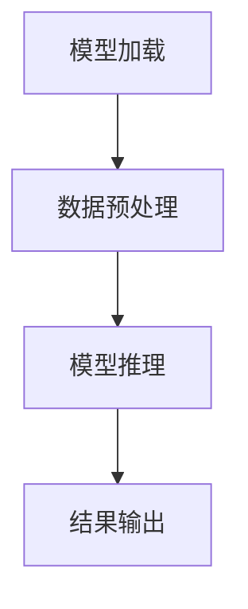
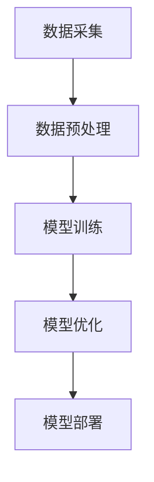
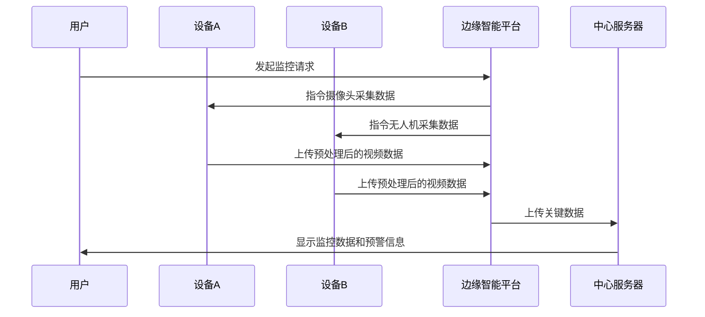

                 

### 第1章：边缘智能背景介绍

#### 1.1 问题背景

随着物联网（IoT）时代的到来，各种设备互联互通，数据量呈爆炸式增长。传统的云计算模式在处理这些海量数据时逐渐暴露出一些局限性。例如，云计算依赖于中心化的数据处理模式，这意味着所有数据都需要传输到云端进行集中处理。这不仅导致了网络带宽的紧张，也带来了延迟和安全隐患等问题。

在物联网时代，许多应用场景要求实时性和本地化处理。例如，智能城市监控系统中，摄像头捕捉到的视频数据需要立即进行分析，以实现对突发事件的快速响应。在工业自动化控制中，传感器采集的数据需要即时处理，以调整生产线的运行状态。这些应用场景对数据处理速度和实时性提出了极高的要求，而传统的云计算模式很难满足这些需求。

#### 1.2 问题描述

边缘智能，作为一种新兴的技术概念，旨在通过在数据产生的源头附近进行数据处理，来解决传统云计算的局限。边缘计算（Edge Computing）是指将数据处理、存储、分析和应用程序从中心化的云计算环境转移到网络的边缘，即接近数据源的位置。

边缘智能的目标是提升数据处理的速度和实时性，降低网络负载和延迟，提高系统的可靠性和安全性。具体来说，边缘智能涉及到以下几个关键问题：

1. **边缘设备的选择和部署**：边缘设备是边缘智能的基础，它们负责数据的采集和处理。选择合适的边缘设备，并确保其稳定运行，是边缘智能实现的关键。

2. **边缘网络的构建和优化**：边缘网络是连接边缘设备和中心服务器的桥梁。构建高效、稳定的边缘网络，是确保数据传输顺畅的重要保障。

3. **边缘智能平台的构建**：边缘智能平台负责整合边缘设备和边缘网络，提供统一的管理和协调机制，以实现边缘智能的总体目标。

#### 1.3 问题解决

为了解决上述问题，边缘智能提出了以下解决方案：

1. **边缘设备的智能化**：通过在边缘设备上部署智能算法，实现数据的本地化处理，降低对中心化云计算的依赖。

2. **边缘网络的优化**：通过构建低延迟、高带宽的边缘网络，提升数据传输速度和稳定性。

3. **边缘智能平台的构建**：通过构建边缘智能平台，实现边缘设备和边缘网络的统一管理和协调，提升边缘智能的整体效能。

#### 1.4 边缘智能边界与外延

1. **边缘计算与物联网**：物联网是边缘智能的重要应用场景。边缘计算通过在物联网设备上实现数据的本地化处理，提升了物联网系统的实时性和效率。

2. **边缘计算与5G**：5G网络的高带宽、低延迟特点，为边缘计算提供了坚实的基础。边缘智能与5G的融合，将进一步提升物联网和移动应用的处理能力。

3. **边缘计算与人工智能**：人工智能技术在边缘设备上的应用，使得边缘智能系统能够实现更复杂、更智能的数据处理和决策。

#### 1.5 概念结构与核心要素组成

1. **边缘设备的定义与类型**：边缘设备是指在网络边缘运行的计算设备，包括传感器、物联网设备、智能终端等。

2. **边缘网络的定义与特点**：边缘网络是指连接边缘设备和中心服务器的网络，具有低延迟、高带宽、可靠性强等特点。

3. **边缘智能平台的基本架构**：边缘智能平台通常包括数据采集模块、数据处理模块、决策支持模块等，负责协调和管理边缘设备和边缘网络。

### 总结

边缘智能是一种新兴的技术概念，旨在通过在数据产生的源头附近进行数据处理，解决传统云计算的局限。边缘智能涉及到边缘设备的选择和部署、边缘网络的构建和优化、边缘智能平台的构建等多个方面。通过实现数据的本地化处理，边缘智能将显著提升系统的实时性和效率，为物联网、5G、人工智能等领域的发展提供有力支持。在接下来的章节中，我们将对边缘智能的核心概念、算法原理、系统分析与架构设计等进行详细探讨。

### 第2章：边缘智能核心概念与联系

#### 2.1 边缘智能核心概念原理

边缘智能涉及多个核心概念，每个概念在边缘智能系统中扮演着不同的角色。以下是边缘智能核心概念的基本原理和主要特点：

1. **边缘设备**

   边缘设备是指在网络边缘运行的计算设备，如物联网设备、智能传感器、路由器、智能终端等。边缘设备的主要功能是数据采集、初步处理和本地执行任务。

   - **功能**：数据采集、预处理、任务执行、数据存储、设备管理。
   - **类型**：物联网设备（如智能传感器、智能门锁）、智能终端（如智能手机、平板电脑）、边缘服务器（如小型数据中心）。
   - **优势**：低延迟、高带宽、低成本、易于部署。

2. **边缘网络**

   边缘网络是指连接边缘设备和中心服务器的网络。边缘网络的主要功能是传输数据、提供计算资源和保证网络的高效运行。

   - **架构**：分布式网络结构，包括局域网、广域网、专用网络等。
   - **特点**：低延迟、高带宽、可靠性强、易于扩展。
   - **技术**：5G、Wi-Fi 6、LPWAN（如LoRa、NB-IoT）。

3. **边缘智能平台**

   边缘智能平台是边缘智能系统的核心，负责整合和管理边缘设备和边缘网络。边缘智能平台通常包括数据采集、数据处理、决策支持、安全防护等功能模块。

   - **组件**：数据采集模块、数据处理模块、存储模块、决策支持模块、安全模块。
   - **功能**：数据聚合、数据清洗、数据存储、数据处理、实时分析、决策支持、设备管理、安全防护。
   - **实现**：基于云计算平台（如AWS、Azure、Google Cloud）或开源平台（如Kubernetes、Docker）。

#### 2.2 概念属性特征对比表格

为了更好地理解边缘智能中的核心概念，以下是一个概念属性特征对比表格，列出了边缘设备、边缘网络和边缘智能平台的主要属性和特征：

| 概念         | 功能                 | 主要特征                         | 关联技术            |
| ------------ | -------------------- | -------------------------------- | ------------------- |
| 边缘设备     | 数据采集、预处理     | 低延迟、高带宽、低成本、易于部署 | IoT、边缘服务器     |
| 边缘网络     | 数据传输、提供计算资源 | 低延迟、高带宽、可靠性强、易于扩展 | 5G、Wi-Fi 6、LPWAN |
| 边缘智能平台 | 整合与管理           | 数据聚合、数据清洗、实时分析       | 云计算、Docker、Kubernetes |

#### 2.3 ER实体关系图架构

边缘智能系统中的实体关系图（ER图）展示了边缘智能系统中的主要实体及其之间的关系。以下是边缘智能系统的ER图：

```mermaid
erDiagram
    Device ||--o{ Platform : 设备与平台关联 }
    Network ||--o{ Platform : 网络与平台关联 }
    Platform ||--o{ Data : 平台与数据关联 }
    Data ||--o{ Analysis : 数据与分析关联 }
    Analysis ||--o{ Decision : 分析与决策关联 }
```

在这个ER图中，Device（边缘设备）和Network（边缘网络）与Platform（边缘智能平台）之间存在关联关系。Platform（边缘智能平台）与Data（数据）、Analysis（分析）和Decision（决策）之间也存在关联关系，展示了边缘智能系统中的数据流动和决策过程。

### 总结

在本章中，我们介绍了边缘智能的核心概念，包括边缘设备、边缘网络和边缘智能平台。通过对比表格和ER实体关系图，我们对这些概念的主要功能和特点有了更深入的理解。在接下来的章节中，我们将进一步探讨边缘智能的算法原理，以及如何在实际项目中实现和应用边缘智能技术。

### 第3章：边缘智能算法原理讲解

#### 3.1 算法原理

边缘智能算法主要包括边缘推理算法和边缘学习算法。这些算法在不同层面上实现数据的本地化处理，提高了系统的实时性和效率。

1. **边缘推理算法**

   边缘推理算法是指在边缘设备上直接执行预训练好的模型，对输入数据进行推理和决策。其核心思想是将复杂的数据处理任务在边缘设备上进行，减少对中心化云计算的依赖。

   - **工作原理**：边缘推理算法通常包括以下几个步骤：
     1. 模型加载：在边缘设备上加载预训练好的模型。
     2. 数据预处理：对输入数据进行预处理，使其符合模型的要求。
     3. 模型推理：将预处理后的数据输入模型，进行推理和决策。
     4. 结果输出：输出推理结果，供应用层使用。
   - **分类**：根据应用场景和任务需求，边缘推理算法可以分为以下几类：
     1. **图像识别**：对图像进行分类、检测和分割等操作。
     2. **语音识别**：将语音信号转换为文本。
     3. **自然语言处理**：处理和生成自然语言。
     4. **实时监控**：对监控视频进行实时分析和报警。

2. **边缘学习算法**

   边缘学习算法是指在边缘设备上对数据进行训练，以优化模型性能。与中心化学习相比，边缘学习具有数据本地化、隐私保护和高效性等优点。

   - **工作原理**：边缘学习算法通常包括以下几个步骤：
     1. 数据采集：从边缘设备上收集数据。
     2. 数据预处理：对采集到的数据进行分析和清洗，去除噪声和异常值。
     3. 模型训练：在边缘设备上使用收集到的数据对模型进行训练。
     4. 模型优化：根据训练结果对模型进行优化，提高模型性能。
     5. 模型部署：将训练好的模型部署到边缘设备上，进行实时推理和决策。
   - **选择**：在选择边缘学习算法时，需要考虑以下几个因素：
     1. **数据量**：对于数据量较大的任务，可以选择分布式边缘学习算法。
     2. **设备性能**：根据边缘设备的计算能力和存储容量，选择适合的算法。
     3. **实时性要求**：对于实时性要求较高的任务，可以选择低延迟的算法。

3. **边缘智能算法的设计原则**

   在设计边缘智能算法时，需要遵循以下几个原则：

   1. **高效性**：算法应具有低延迟、高吞吐量的特点，以适应实时性要求较高的应用场景。
   2. **可扩展性**：算法应具有较好的扩展性，能够适应不同规模的任务和数据量。
   3. **安全性**：算法应具备数据保护和隐私保护机制，确保边缘设备上的数据安全。
   4. **适应性**：算法应能够适应不同类型的边缘设备和应用场景，具有较好的通用性。

#### 3.2 算法mermaid流程图

以下是边缘推理算法和边缘学习算法的mermaid流程图：

**边缘推理算法流程图：**


**边缘学习算法流程图：**


#### 3.3 Python源代码

以下是一个简单的边缘推理算法示例和一个简单的边缘学习算法示例。

**边缘推理算法示例：**
```python
import tensorflow as tf

# 加载预训练好的模型
model = tf.keras.models.load_model('model.h5')

# 输入数据预处理
input_data = preprocess_data(input_data)

# 模型推理
predictions = model.predict(input_data)

# 输出结果
print(predictions)
```

**边缘学习算法示例：**
```python
import tensorflow as tf

# 数据采集
data = collect_data()

# 数据预处理
processed_data = preprocess_data(data)

# 模型训练
model = tf.keras.models.Sequential([
    tf.keras.layers.Dense(128, activation='relu', input_shape=(input_shape,)),
    tf.keras.layers.Dense(1, activation='sigmoid')
])

model.compile(optimizer='adam', loss='binary_crossentropy', metrics=['accuracy'])

model.fit(processed_data, labels, epochs=10, batch_size=32)

# 模型优化
model.save('model.h5')

# 模型部署
deploy_model('model.h5')
```

#### 3.4 算法原理的数学模型和公式

1. **边缘推理算法**

   边缘推理算法主要涉及以下数学模型和公式：

   - **损失函数**：
     $$L = \frac{1}{n}\sum_{i=1}^{n}(y_i - \hat{y}_i)^2$$
     其中，\(y_i\) 为实际标签，\(\hat{y}_i\) 为模型预测值。

   - **优化算法**：
     $$\theta_{t+1} = \theta_{t} - \alpha \nabla_{\theta}L(\theta)$$
     其中，\(\theta\) 为模型参数，\(\alpha\) 为学习率，\(\nabla_{\theta}L(\theta)\) 为损失函数关于参数 \(\theta\) 的梯度。

2. **边缘学习算法**

   边缘学习算法主要涉及以下数学模型和公式：

   - **梯度下降**：
     $$\theta_{t+1} = \theta_{t} - \alpha \nabla_{\theta}J(\theta)$$
     其中，\(J(\theta)\) 为损失函数，\(\theta\) 为模型参数，\(\alpha\) 为学习率。

   - **反向传播**：
     $$\delta_{l} = \nabla_{z_l}L(z_l) \odot \sigma'(z_l)$$
     其中，\(\delta_{l}\) 为第 \(l\) 层的误差梯度，\(z_l\) 为第 \(l\) 层的输入，\(\sigma'\) 为激活函数的导数。

#### 3.5 举例说明

1. **边缘推理算法**

   假设我们使用边缘推理算法进行实时物体识别，输入图像为 \(128 \times 128\) 像素的灰度图像，模型为卷积神经网络（CNN）。以下是具体的算法步骤：

   1. 加载预训练好的 CNN 模型。
   2. 对输入图像进行预处理，包括缩放、归一化等操作，使其符合模型的要求。
   3. 将预处理后的图像输入模型，进行推理，得到物体识别结果。
   4. 输出识别结果，如“猫”、“狗”等。

2. **边缘学习算法**

   假设我们使用边缘学习算法对传感器数据进行分析，预测设备的运行状态。以下是具体的算法步骤：

   1. 从边缘设备上收集传感器数据。
   2. 对传感器数据进行预处理，包括去噪、归一化等操作。
   3. 使用收集到的数据对模型进行训练，选择合适的损失函数和优化算法。
   4. 根据训练结果对模型进行优化，提高模型性能。
   5. 将训练好的模型部署到边缘设备上，进行实时预测和决策。

### 总结

在本章中，我们详细介绍了边缘智能算法的原理，包括边缘推理算法和边缘学习算法。通过mermaid流程图、Python源代码、数学模型和公式以及举例说明，我们对边缘智能算法有了更深入的理解。在接下来的章节中，我们将探讨边缘智能的数学模型和数学公式，以进一步深化我们对边缘智能算法的认识。

### 第4章：边缘智能的数学模型和数学公式

#### 4.1 概率论基础

概率论是边缘智能算法中不可或缺的基础知识，主要用于描述和处理不确定性和随机性。以下是概率论中的一些基本概念和公式：

1. **条件概率**

   条件概率是指在某个事件发生的条件下，另一个事件发生的概率。条件概率的公式为：

   $$P(A|B) = \frac{P(A \cap B)}{P(B)}$$

   其中，\(P(A|B)\) 表示在事件 \(B\) 发生的条件下事件 \(A\) 发生的概率，\(P(A \cap B)\) 表示事件 \(A\) 和事件 \(B\) 同时发生的概率，\(P(B)\) 表示事件 \(B\) 发生的概率。

2. **贝叶斯定理**

   贝叶斯定理是概率论中的一个重要公式，用于计算后验概率。贝叶斯定理的公式为：

   $$P(A|B) = \frac{P(B|A)P(A)}{P(B)}$$

   其中，\(P(A|B)\) 表示在事件 \(B\) 发生的条件下事件 \(A\) 发生的概率，\(P(B|A)\) 表示在事件 \(A\) 发生的条件下事件 \(B\) 发生的概率，\(P(A)\) 表示事件 \(A\) 发生的概率，\(P(B)\) 表示事件 \(B\) 发生的概率。

3. **全概率公式**

   全概率公式用于计算一个事件的总概率，它将这个事件发生的概率分解为多个条件概率的加权和。全概率公式的公式为：

   $$P(A) = \sum_{i=1}^{n}P(A|B_i)P(B_i)$$

   其中，\(P(A)\) 表示事件 \(A\) 发生的概率，\(P(A|B_i)\) 表示在事件 \(B_i\) 发生的条件下事件 \(A\) 发生的概率，\(P(B_i)\) 表示事件 \(B_i\) 发生的概率，\(n\) 表示条件事件的个数。

#### 4.2 线性代数基础

线性代数是边缘智能算法中的重要工具，用于处理向量、矩阵和线性方程组等问题。以下是线性代数中的一些基本概念和公式：

1. **矩阵运算**

   - **矩阵加法**：两个矩阵相加的结果是将对应位置的元素相加。
     $$C = A + B$$

   - **矩阵乘法**：两个矩阵相乘的结果是将一个矩阵的每一行与另一个矩阵的每一列进行点积。
     $$C = A \cdot B$$

   - **矩阵逆**：一个矩阵的逆是指与之相乘后结果为单位的矩阵。
     $$A^{-1} = (A \cdot A)^{-1}$$

2. **向量空间**

   - **定义**：向量空间是一组向量的集合，这些向量可以通过线性组合生成所有可能的向量。
   - **特性**：
     1. 封闭性：向量空间的线性组合结果仍然在向量空间内。
     2. 平移不变性：向量空间的基向量不变时，整个向量空间不变。
     3. 加法交换律、结合律、零向量存在等。

   - **应用**：在边缘智能算法中，向量空间用于处理多维度数据，如图像、声音等。

3. **特征值和特征向量**

   - **定义**：特征值是矩阵 \(A\) 满足 \(A \cdot v = \lambda \cdot v\) 的标量 \(\lambda\)，其中 \(v\) 是对应的特征向量。
   - **公式**：
     $$\lambda = \det(A - \lambda I)$$
     其中，\(I\) 是单位矩阵。

   - **应用**：在边缘智能算法中，特征值和特征向量用于降维、数据分析和模型优化。

#### 4.3 最优化算法

最优化算法是边缘智能算法中的重要组成部分，用于寻找函数的最大值或最小值。以下是两种常用的最优化算法：

1. **梯度下降**

   - **定义**：梯度下降是一种迭代优化算法，通过不断更新参数，使损失函数逐步减小。
   - **公式**：
     $$\theta_{t+1} = \theta_{t} - \alpha \nabla_{\theta}L(\theta)$$
     其中，\(\theta\) 是参数，\(\alpha\) 是学习率，\(\nabla_{\theta}L(\theta)\) 是损失函数关于参数 \(\theta\) 的梯度。

   - **应用**：在边缘智能算法中，梯度下降用于训练神经网络、优化模型参数等。

2. **牛顿法**

   - **定义**：牛顿法是一种基于梯度和二阶导数的优化算法，通过迭代计算，使损失函数快速收敛。
   - **公式**：
     $$\theta_{t+1} = \theta_{t} - H^{-1}\nabla_{\theta}L(\theta)$$
     其中，\(H\) 是海森矩阵，\(\nabla_{\theta}L(\theta)\) 是损失函数关于参数 \(\theta\) 的梯度。

   - **应用**：在边缘智能算法中，牛顿法用于优化非线性函数、解决复杂优化问题等。

### 总结

在本章中，我们介绍了边缘智能算法中常用的概率论、线性代数和最优化算法的基本概念和公式。这些数学模型和公式为边缘智能算法的设计和实现提供了理论支持。在接下来的章节中，我们将继续探讨边缘智能的系统分析与架构设计，以及如何在实际项目中应用边缘智能技术。通过这些探讨，我们将对边缘智能有一个更加全面和深入的认识。

### 第5章：边缘智能的系统分析与架构设计

#### 5.1 问题场景介绍

在讨论边缘智能的系统分析与架构设计之前，首先需要明确几个典型的问题场景，这些场景反映了边缘智能在不同领域的应用需求和挑战。

1. **智能城市监控**

   智能城市监控系统需要实时监控城市的重要区域，如交通枢纽、公共场所和重要设施。这类系统需要处理大量的视频数据，要求快速响应，以防止和应对突发事件。

2. **工业自动化控制**

   工业自动化控制系统需要对生产设备进行实时监控和智能控制，确保生产过程的稳定性和效率。系统需要处理来自各种传感器的实时数据，进行故障预测和优化调整。

3. **智慧农业**

   智慧农业系统利用传感器和边缘设备实时监测农作物的生长状况，进行环境监测、土壤分析和病虫害防治。系统需要快速处理数据，以提供精确的决策支持。

#### 5.2 项目介绍

以智能城市监控项目为例，以下是对项目的基本介绍和目标：

**项目概述：**
智能城市监控项目旨在建立一个高效、可靠的监控系统，以提升城市管理的智能化水平，保障公共安全和城市运行效率。

**项目目标：**
1. 实时视频数据采集与处理，确保监控数据的实时性。
2. 通过边缘智能算法对视频数据进行智能分析和预警，提高监控系统的智能化程度。
3. 构建一个灵活、可扩展的系统架构，以适应未来技术的发展和需求变化。

#### 5.3 系统功能设计

为了实现上述项目目标，智能城市监控系统需要具备以下核心功能模块：

1. **数据采集模块**
   - **功能**：从各种视频监控设备中采集实时视频数据。
   - **实现**：采用边缘设备（如摄像头、无人机等）进行数据采集，确保数据来源的多样性和可靠性。

2. **数据处理模块**
   - **功能**：对采集到的视频数据进行预处理、存储和初步分析。
   - **实现**：在边缘设备上部署边缘智能算法，对视频数据进行实时处理和初步分析，减少数据传输量。

3. **智能分析模块**
   - **功能**：利用边缘智能算法对处理后的视频数据进行高级分析，如目标检测、行为识别、异常检测等。
   - **实现**：在边缘设备上部署高性能的机器学习模型，实现对视频数据的智能分析和实时预警。

4. **数据存储与传输模块**
   - **功能**：存储和处理后的数据，并将关键数据传输到中心服务器。
   - **实现**：采用分布式存储方案，确保数据的安全性和可靠性，同时使用高效的数据传输协议（如MQTT）实现边缘设备和中心服务器之间的数据传输。

5. **用户交互模块**
   - **功能**：提供用户界面，以便操作员和管理人员查看监控数据、接收预警信息等。
   - **实现**：开发一个易于操作的用户界面，支持多种交互方式，如Web、移动应用等。

#### 5.4 系统架构设计

智能城市监控系统需要一个高效、可靠的架构设计，以支持实时数据处理和智能分析。以下是一个典型的边缘智能系统架构设计：

1. **边缘设备层**
   - **功能**：负责数据的采集、预处理和初步分析。
   - **组件**：包括摄像头、无人机、边缘服务器等。

2. **边缘网络层**
   - **功能**：负责数据的传输、同步和调度。
   - **组件**：包括边缘交换机、路由器、5G网络等。

3. **边缘智能平台层**
   - **功能**：负责边缘设备的统一管理和智能算法的部署。
   - **组件**：包括边缘智能平台、边缘数据库、边缘计算引擎等。

4. **中心数据处理层**
   - **功能**：负责数据的存储、高级分析和用户交互。
   - **组件**：包括中心服务器、大数据平台、用户界面等。

5. **数据存储层**
   - **功能**：负责存储和管理监控数据。
   - **组件**：包括分布式数据库、数据湖等。

#### 5.5 系统接口设计

智能城市监控系统的接口设计需要确保各组件之间的数据传输高效、安全、可靠。以下是一个典型的系统接口设计：

1. **边缘设备与边缘智能平台接口**
   - **功能**：实现边缘设备与边缘智能平台之间的数据传输和命令控制。
   - **接口**：采用RESTful API、MQTT协议等。

2. **边缘智能平台与中心数据处理层接口**
   - **功能**：实现边缘智能平台与中心数据处理层之间的数据同步和协调。
   - **接口**：采用Websocket、HTTP等。

3. **边缘网络与边缘设备接口**
   - **功能**：实现边缘网络与边缘设备之间的通信。
   - **接口**：采用Wi-Fi、LoRa、5G等。

4. **用户交互模块与中心数据处理层接口**
   - **功能**：实现用户交互模块与中心数据处理层之间的数据传输和交互。
   - **接口**：采用Web API、Websocket等。

#### 5.6 系统交互mermaid序列图

为了更直观地展示智能城市监控系统的交互过程，我们可以使用mermaid序列图来描述系统中的关键交互环节。以下是一个简单的mermaid序列图示例：



在这个mermaid序列图中，用户发起监控请求，边缘智能平台控制边缘设备进行数据采集和预处理，然后将关键数据上传到中心服务器，用户通过用户界面查看监控数据和预警信息。

### 总结

在本章中，我们介绍了边缘智能系统的分析与架构设计，包括问题场景介绍、项目介绍、系统功能设计、系统架构设计、系统接口设计和系统交互mermaid序列图。通过这些内容的讨论，我们对边缘智能系统的设计与实现有了更加清晰的认识。在接下来的章节中，我们将通过项目实战，进一步探索边缘智能技术的实际应用和实现细节。

### 第6章：边缘智能项目实战

#### 6.1 环境安装

在进行边缘智能项目实战之前，需要搭建一个合适的环境，以确保边缘设备的正常运作和边缘智能平台的稳定运行。

**硬件安装与配置**

1. **边缘设备**：根据项目需求，选择合适的边缘设备，如Raspberry Pi、Arduino等。这些设备应具备以下特性：
   - 具备足够的计算能力和存储空间。
   - 支持Wi-Fi或5G网络连接。
   - 具备摄像头或其他传感器接口。

2. **边缘服务器**：用于运行边缘智能平台的中央处理单元，应具备以下配置：
   - 处理器：至少双核以上，推荐四核或八核。
   - 内存：至少4GB，推荐8GB及以上。
   - 存储：至少128GB SSD硬盘。
   - 网络接口：支持Wi-Fi和有线网络连接。

**软件安装与配置**

1. **边缘设备端软件安装**
   - 下载并安装适用于边缘设备的操作系统，如Raspberry Pi OS。
   - 安装必要的软件包，如Python、TensorFlow、Keras等。
   - 配置网络连接，确保边缘设备可以与边缘服务器和互联网连接。

2. **边缘服务器端软件安装**
   - 下载并安装边缘智能平台的基础软件，如Kubernetes、Docker等。
   - 配置Kubernetes集群，确保边缘服务器可以管理多个边缘设备。
   - 部署边缘智能平台的应用程序，如边缘推理服务器、边缘学习服务器等。

#### 6.2 系统核心实现源代码

边缘智能项目的核心实现源代码分为边缘设备端和边缘服务器端两部分。

**边缘设备端代码**

边缘设备端的代码主要用于数据的采集、预处理和初步分析。以下是一个简单的边缘设备端代码示例：

```python
# 导入必要的库
import cv2
import numpy as np
import requests

# 初始化摄像头
cap = cv2.VideoCapture(0)

while True:
    # 读取一帧图像
    ret, frame = cap.read()
    
    # 图像预处理
    processed_frame = preprocess_frame(frame)
    
    # 将预处理后的图像上传到边缘服务器
    response = requests.post('http://边缘服务器地址:端口号/upload', files={'image': processed_frame})

    # 检查上传结果
    if response.status_code == 200:
        print("图像上传成功")
    else:
        print("图像上传失败")

    # 等待一段时间
    time.sleep(1)

# 释放摄像头资源
cap.release()
```

**边缘服务器端代码**

边缘服务器端的代码主要用于接收边缘设备上传的数据，进行高级分析，并将结果返回给边缘设备。以下是一个简单的边缘服务器端代码示例：

```python
# 导入必要的库
from flask import Flask, request, jsonify

app = Flask(__name__)

@app.route('/upload', methods=['POST'])
def upload_image():
    # 获取上传的图像文件
    image_file = request.files['image']
    
    # 读取图像数据
    image_data = np.fromstring(image_file.read(), dtype=np.uint8)
    
    # 使用预训练的模型进行图像识别
    prediction = model.predict(image_data.reshape(1, 128, 128, 3))
    
    # 返回识别结果
    return jsonify({'prediction': prediction.tolist()})

if __name__ == '__main__':
    app.run(host='0.0.0.0', port=5000)
```

#### 6.3 代码应用解读与分析

**边缘设备端代码解读**

1. **摄像头初始化**：使用OpenCV库初始化摄像头，准备读取图像数据。
2. **图像读取与预处理**：读取摄像头捕获的图像帧，并进行预处理，如缩放、归一化等。
3. **数据上传**：将预处理后的图像数据上传到边缘服务器，使用HTTP POST请求发送数据。

**边缘服务器端代码解读**

1. **Flask应用**：使用Flask框架创建Web应用，处理边缘设备上传的图像数据。
2. **图像处理**：接收上传的图像文件，将其转换为NumPy数组格式，并使用预训练的模型进行图像识别。
3. **返回结果**：将识别结果以JSON格式返回给边缘设备，以便边缘设备根据识别结果进行相应的操作。

#### 6.4 实际案例分析和详细讲解剖析

**智能城市监控案例**

智能城市监控系统是一个典型的边缘智能应用案例。以下是对该案例的分析和讲解：

1. **数据采集**：摄像头分布在城市的各个重要区域，实时采集视频数据。
2. **边缘预处理**：边缘设备（如Raspberry Pi）对采集到的视频数据进行预处理，包括图像裁剪、噪声过滤等。
3. **边缘推理**：边缘设备使用预训练的模型（如YOLO、SSD等）对预处理后的视频数据进行分析，识别出视频中的行人、车辆等目标。
4. **数据传输**：边缘设备将分析结果和关键数据（如时间戳、位置信息等）上传到边缘服务器。
5. **中心分析**：边缘服务器对上传的数据进行进一步分析，如轨迹分析、行为识别等，并将分析结果返回给边缘设备，用于实现智能预警和联动响应。

**工业自动化控制案例**

工业自动化控制系统也是一个典型的边缘智能应用场景。以下是对该案例的分析和讲解：

1. **传感器采集**：传感器分布在生产设备的各个关键位置，实时采集温度、压力、振动等数据。
2. **边缘预处理**：边缘设备对采集到的数据进行预处理，如滤波、校准等。
3. **边缘学习**：边缘设备使用边缘学习算法（如K-means、决策树等）对预处理后的数据进行分析，识别出异常数据或趋势。
4. **数据传输**：边缘设备将分析结果和关键数据上传到边缘服务器。
5. **中心优化**：边缘服务器对上传的数据进行进一步分析，如故障预测、优化调整等，并将优化结果返回给边缘设备，用于实现智能控制和故障预警。

#### 6.5 项目小结

通过以上实际案例的分析和讲解，我们可以看到边缘智能技术在智能城市监控和工业自动化控制等领域具有广泛的应用前景。边缘智能项目在实际应用中需要注意以下几点：

1. **数据安全性**：确保边缘设备和边缘服务器之间的数据传输安全，防止数据泄露和攻击。
2. **系统可靠性**：确保边缘设备和边缘服务器的稳定运行，提高系统的可靠性。
3. **算法优化**：根据实际应用需求，优化边缘智能算法，提高数据处理速度和准确性。
4. **扩展性设计**：设计一个灵活、可扩展的系统架构，以适应未来技术的发展和需求变化。

边缘智能项目为人工智能技术的发展带来了新的机遇和挑战。通过不断探索和实践，我们可以充分发挥边缘智能技术的优势，推动人工智能在各行各业的广泛应用。

### 第7章：边缘智能的最佳实践与拓展

#### 7.1 最佳实践 tips

在边缘智能的实际应用中，以下是一些最佳实践和技巧，可以帮助优化边缘设备的性能、提升边缘网络的稳定性，以及增强边缘智能系统的整体效能：

1. **边缘设备性能优化**

   - **选择合适的硬件**：根据应用需求，选择具备足够计算能力和存储空间的边缘设备，以确保设备的稳定运行。
   - **优化软件配置**：对边缘设备的操作系统和应用程序进行优化，减少不必要的后台服务和资源占用，提高系统的运行效率。
   - **资源调度**：合理分配边缘设备的计算资源，避免资源争用和瓶颈，确保关键任务能够及时处理。

2. **边缘网络稳定性提升**

   - **网络冗余设计**：采用多路径传输和冗余网络设计，提高网络的容错能力和可靠性。
   - **带宽优化**：根据实际需求，合理配置网络带宽，避免带宽瓶颈，确保数据传输的流畅性。
   - **网络监控与维护**：定期对边缘网络进行监控和优化，及时发现并解决网络故障，提高网络的稳定性。

3. **边缘智能平台优化**

   - **模块化设计**：将边缘智能平台的功能模块化，便于系统的扩展和维护，提高系统的灵活性和可扩展性。
   - **数据管理优化**：采用分布式存储和数据管理方案，提高数据存储的可靠性和访问速度，降低数据传输的延迟。
   - **安全性增强**：加强边缘智能平台的安全防护，采用加密传输、访问控制等技术，确保系统的安全性和数据的完整性。

#### 7.2 小结

边缘智能作为一种新兴技术，正日益受到广泛关注。通过本章的最佳实践和拓展，我们了解了如何优化边缘设备的性能、提升边缘网络的稳定性，以及增强边缘智能平台的整体效能。以下是一些关键点总结：

- **边缘设备优化**：选择合适的硬件、优化软件配置和合理调度资源，是提升边缘设备性能的关键。
- **网络稳定性提升**：采用网络冗余设计、带宽优化和网络监控维护，是确保边缘网络稳定运行的重要手段。
- **平台优化**：模块化设计、数据管理和安全性增强，是构建高效、可靠边缘智能平台的核心要素。

边缘智能技术的不断发展和应用，将为各个行业带来巨大的变革和机遇。通过深入研究和实践，我们可以更好地发挥边缘智能的优势，推动人工智能技术的进一步创新和应用。

#### 7.3 注意事项

在部署和运行边缘智能系统时，需要注意以下几点，以确保系统的稳定性和可靠性：

- **数据安全**：边缘设备和边缘服务器之间的数据传输必须采用加密技术，防止数据泄露。
- **设备维护**：定期对边缘设备进行检查和更新，确保设备的正常运行和性能。
- **网络监控**：持续监控边缘网络的状态，及时发现和解决网络故障。
- **资源分配**：合理分配边缘设备的计算资源，避免过度使用或资源不足。

#### 7.4 拓展阅读

对于希望深入了解边缘智能的读者，以下是一些推荐的阅读资源：

- **《边缘智能：从概念到实践》**：这本书详细介绍了边缘智能的基本概念、技术架构和应用案例。
- **《边缘计算：技术、应用与未来》**：本书涵盖了边缘计算的核心技术、应用场景以及未来的发展趋势。
- **《边缘人工智能》**：这本书深入探讨了边缘人工智能的技术原理、算法实现和应用案例。

通过这些资源，可以更全面地了解边缘智能的相关知识，并在实际项目中加以应用。

