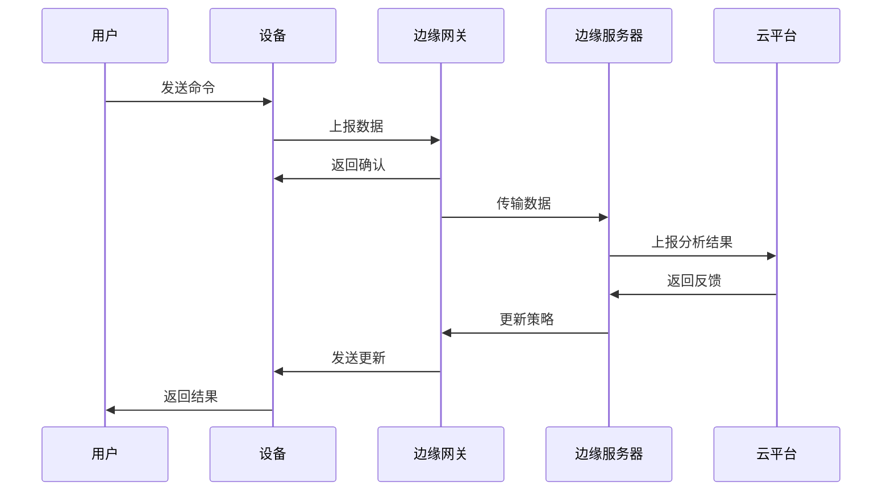

                 

## 引言

在当今快速发展的数字化时代，物联网（IoT）技术已经深刻地改变了我们的生活方式。从智能家居、智能交通到工业自动化，物联网的应用无处不在。然而，随着物联网设备的数量和种类的急剧增加，物联网安全成为一个日益严峻的挑战。传统的中心化安全解决方案在处理海量数据、复杂网络环境以及分散设备的安全问题时显得力不从心。为了应对这些挑战，边缘智能（Edge Intelligence）的概念应运而生。

边缘智能是将数据处理和计算能力分布到网络边缘，即靠近数据源头的地方，从而提高系统的响应速度、降低延迟，并增强系统的鲁棒性和安全性。本文将深入探讨边缘智能在物联网安全中的关键作用，旨在为读者提供一个全面的技术分析框架和实用的解决方案。

首先，我们将回顾物联网安全的背景和主要挑战，这将帮助我们理解边缘智能的重要性。接着，我们将介绍边缘智能的基本概念及其在物联网安全中的作用，并探讨边缘智能与物联网安全之间的联系。随后，我们将详细讲解边缘智能和物联网安全的核心概念，并使用Mermaid绘制ER图来展示它们之间的关系。

在算法原理讲解部分，我们将深入探讨边缘智能算法和物联网安全算法的基本原理，使用Python代码和LaTeX公式来解释和说明。之后，我们将分析物联网安全系统的设计和实现，并探讨边缘智能在其中的应用。

在项目实战部分，我们将通过一个实际案例来展示边缘智能在物联网安全中的应用，并提供详细的代码解读和案例分析。最后，我们将总结最佳实践，并展望边缘智能在物联网安全领域的未来发展。

通过本文的逐步分析，读者将能够全面理解边缘智能在物联网安全中的关键作用，并掌握相关技术和应用方法。让我们开始这段技术之旅，一起探索边缘智能在物联网安全中的无限可能。

### 关键词

边缘智能，物联网安全，边缘计算，数据隐私，设备安全，网络通信，算法原理，系统架构，项目实战，最佳实践。

### 摘要

本文旨在深入探讨边缘智能在物联网安全中的关键作用。随着物联网技术的迅猛发展，其安全挑战日益严峻，传统中心化安全解决方案已难以应对。边缘智能通过将数据处理和计算能力分布在网络边缘，提高了系统的响应速度和安全性。本文首先回顾了物联网安全的背景和挑战，然后介绍了边缘智能的基本概念及其在物联网安全中的应用。接着，我们详细讲解了边缘智能和物联网安全的核心算法原理，并分析了物联网安全系统的设计和实现。通过实际案例展示，读者将了解边缘智能在物联网安全中的应用和实现方法。最后，本文总结了边缘智能在物联网安全中的最佳实践，并展望了其未来发展。通过本文的阅读，读者将能够全面理解边缘智能在提升物联网安全中的关键作用。

### 第一部分：背景介绍与核心概念

#### 第1章：物联网安全背景

##### 1.1 物联网安全概述

物联网（IoT，Internet of Things）指的是通过互联网将物理设备互联起来，实现设备之间的信息交换和协同工作。物联网技术已经广泛应用于智能家居、智能交通、工业自动化、医疗健康等多个领域，极大地提升了生产效率和生活质量。然而，随着物联网设备数量的迅速增加，物联网安全成为了一个日益严峻的问题。

物联网安全是指保护物联网设备、网络和数据免受各种威胁和攻击的措施。物联网安全的基本概念包括数据隐私保护、设备安全防护和网络通信安全。数据隐私保护旨在确保用户数据不被未授权访问和泄露；设备安全防护关注物联网设备自身的安全，防止设备被恶意攻击或操控；网络通信安全则保障物联网设备之间的通信过程不被窃听或篡改。

##### 1.2 物联网安全的重要性

物联网安全的重要性不容忽视。首先，物联网设备通常包含大量敏感信息，如个人身份信息、健康数据等，一旦泄露，将对个人隐私造成严重威胁。其次，物联网设备往往缺乏足够的安全防护措施，容易成为黑客攻击的突破口。例如，2016年发生的Mirai僵尸网络攻击事件，就是通过感染大量物联网设备（如摄像头、路由器）发起的大规模网络攻击，导致众多互联网服务瘫痪。

此外，物联网设备的安全漏洞还可能被恶意利用，进行更广泛的安全威胁。例如，攻击者可以通过入侵物联网设备，进而攻击与这些设备相连的云平台或其他关键基础设施，造成重大的经济损失和社会影响。

因此，保障物联网安全不仅关乎个人隐私和财产安全，也是维护社会稳定和国家安全的重要任务。随着物联网技术的普及和应用的深入，物联网安全的重要性将愈发凸显。

##### 1.3 物联网安全的主要挑战

尽管物联网技术在各个领域带来了巨大的便利和效率提升，但其安全挑战也日益显著。以下是物联网安全面临的几个主要挑战：

**数据隐私保护：** 物联网设备每天都会产生大量数据，包括个人身份信息、行为习惯等敏感数据。如何有效地保护这些数据，防止其被未授权访问或泄露，是一个巨大的挑战。

**设备安全防护：** 物联网设备通常设计简单，安全防护措施不足，容易受到恶意攻击。例如，智能家居设备容易被黑客入侵，从而控制家中设备或窃取用户信息。

**网络通信安全：** 物联网设备之间的通信通常不加密，容易受到中间人攻击、数据篡改等网络攻击。网络通信安全是物联网安全的重要环节，需要采取有效措施保障数据传输的安全性。

**系统完整性保护：** 由于物联网设备的硬件和软件可能存在缺陷，攻击者可以通过漏洞入侵设备，修改其行为或功能，导致设备失效或被恶意利用。

**横向扩展性：** 物联网设备数量庞大，且种类繁多，如何确保每个设备的安全性，实现系统的横向扩展，是一个技术和管理上的难题。

以上挑战表明，物联网安全不仅仅是一个技术问题，还涉及到政策、管理和社会等多个方面。解决这些挑战需要多方共同努力，采用综合性的安全解决方案。

##### 1.4 边缘智能的定义与作用

边缘智能（Edge Intelligence）是一种将数据处理和计算能力分布在网络边缘的新型技术。与传统的中心化计算相比，边缘智能通过在靠近数据源的地方进行数据处理和计算，可以实现更快速、更可靠的系统响应，并降低网络延迟和数据传输成本。

**边缘智能的基本概念：** 边缘智能的核心在于将计算、存储和分析功能从中心服务器迁移到网络边缘。这里的网络边缘可以是物联网设备本身，也可以是部署在靠近物联网设备的数据中心或专用服务器。通过边缘智能，数据处理和分析可以在数据产生的地方进行，从而避免了大量数据传输到中心服务器所带来的延迟和带宽压力。

**边缘智能在物联网安全中的作用：** 边缘智能在物联网安全中扮演着至关重要的角色。首先，通过在边缘设备上进行数据预处理和初步分析，可以有效减少需要传输到中心服务器的数据量，降低网络攻击的风险。其次，边缘智能可以实现实时监测和响应，提高系统的安全性和可靠性。例如，在网络安全防护中，边缘设备可以实时检测异常流量和潜在威胁，并迅速采取隔离和应对措施，从而防止攻击扩散。

此外，边缘智能还能够提高物联网设备的自主性和智能化水平。通过边缘设备上的智能算法和模型，可以实现设备的自我诊断和自我修复，增强设备的抗攻击能力。例如，在智能家居系统中，边缘智能可以实时分析家居环境数据，自动识别异常情况并触发相应的安全防护措施，从而保障用户的安全和隐私。

总之，边缘智能通过其独特的优势，为物联网安全提供了有效的解决方案，有助于应对物联网安全面临的诸多挑战。

##### 1.5 边缘智能与物联网安全的联系

边缘智能与物联网安全之间存在着紧密的联系和相互作用。首先，边缘智能通过将数据处理和计算能力分布在网络边缘，可以显著提高物联网系统的安全性和可靠性。以下将详细探讨边缘智能如何增强物联网安全，以及其面临的安全挑战。

**边缘智能如何增强物联网安全：**

1. **实时威胁检测与响应：** 边缘智能设备可以在本地对物联网设备进行实时监测和分析，快速识别潜在的安全威胁。例如，通过部署在边缘的智能算法，可以实时分析设备通信数据，检测异常流量模式，并及时采取隔离和应对措施，阻止攻击的进一步扩散。

2. **数据本地处理与保护：** 边缘智能通过在数据产生的地方进行预处理和分析，可以减少需要传输到中心服务器的数据量，从而降低数据泄露的风险。同时，本地化数据处理还可以减少对中心服务器的依赖，提高系统的容错能力和抗攻击能力。

3. **隐私保护：** 边缘智能可以有效地保护用户隐私。通过在边缘设备上进行数据加密和脱敏处理，可以防止敏感数据在传输过程中被窃取或篡改。此外，边缘智能还可以实现数据的本地存储，减少对中心化存储服务的需求，进一步降低数据泄露的风险。

4. **设备安全防护：** 边缘智能可以增强物联网设备的安全防护能力。通过边缘设备上的智能算法，可以自动检测设备漏洞，并及时更新设备固件，防范潜在的安全威胁。例如，智能家居设备可以通过边缘智能实现实时漏洞扫描和固件自动更新，从而提高设备的安全性。

**边缘智能面临的安全挑战：**

1. **边缘设备安全性：** 边缘设备通常具有有限的计算能力和存储资源，这使得它们容易成为攻击目标。例如，攻击者可以通过入侵边缘设备，获取更多的网络访问权限，从而对整个物联网系统进行攻击。因此，确保边缘设备的安全是边缘智能面临的一个重要挑战。

2. **通信安全性：** 边缘智能设备之间的通信通常需要通过公共网络进行，这增加了数据泄露和网络攻击的风险。确保边缘设备之间的通信安全，防止数据被窃取或篡改，是边缘智能安全的关键。

3. **数据隐私保护：** 边缘智能涉及大量的用户数据，如何有效地保护这些数据，防止未授权访问和泄露，是一个巨大的挑战。边缘智能需要在数据采集、传输、存储和处理等各个环节采取有效的安全措施，确保用户隐私不受侵害。

4. **协同工作与兼容性：** 边缘智能需要在多种设备、平台和协议之间协同工作，实现统一的安全管理和控制。不同的设备和系统可能采用不同的安全协议和标准，如何确保这些设备和系统能够兼容并协同工作，是一个技术和管理上的难题。

总之，边缘智能在物联网安全中具有巨大的潜力，可以显著提升物联网系统的安全性。然而，要充分发挥边缘智能的优势，仍需要克服诸多安全挑战。通过持续的研究和技术创新，边缘智能将为物联网安全提供更加有效的解决方案。

##### 1.5 本章小结

本章详细介绍了物联网安全的背景、主要挑战以及边缘智能的基本概念和作用。我们首先回顾了物联网安全的基本概念和重要性，然后探讨了物联网安全面临的几个主要挑战，包括数据隐私保护、设备安全防护和网络通信安全。接着，我们介绍了边缘智能的定义与作用，并分析了边缘智能如何增强物联网安全。同时，我们也讨论了边缘智能在物联网安全中面临的安全挑战。通过本章的介绍，读者可以全面了解物联网安全和边缘智能的基本概念，为后续章节的深入探讨打下基础。

## 第2章：核心概念与联系

#### 2.1 边缘计算

**边缘计算（Edge Computing）** 是一种计算范式，旨在将数据处理和计算能力从中心化的数据中心转移到网络边缘，即靠近数据源的地方。边缘计算的核心思想是减少数据传输的延迟，提高系统的响应速度和效率。通过在边缘设备上进行数据处理和分析，边缘计算能够更好地满足实时性要求较高的应用场景。

**边缘计算的基本概念：** 边缘计算涉及三个关键要素：计算资源、网络连接和数据存储。

- **计算资源：** 边缘计算设备通常具有有限的计算能力和存储资源，可以是嵌入式设备、智能传感器、路由器等。
- **网络连接：** 边缘计算设备通过网络连接到互联网和其他设备，实现数据交换和协同工作。
- **数据存储：** 边缘计算设备可以进行本地数据存储，减少对中心化存储服务的依赖。

**边缘计算的架构与特点：** 边缘计算架构通常分为以下几个层次：

1. **设备层：** 包括传感器、摄像头、智能设备等，负责数据的采集和初步处理。
2. **边缘网关层：** 负责数据的传输、格式转换和安全防护，是设备层和云端之间的桥梁。
3. **云端层：** 负责大规模数据处理、分析和存储，提供高级服务和应用支持。

边缘计算的特点包括：

- **低延迟：** 数据处理和分析在靠近数据源的地方进行，减少了数据传输的延迟，提高了系统的响应速度。
- **高可靠性：** 通过分布式架构，边缘计算能够提高系统的容错能力和可靠性，即使部分设备或网络出现故障，整体系统仍能正常运行。
- **数据隐私保护：** 数据在本地处理和存储，减少了数据泄露的风险。
- **灵活性：** 边缘计算可以根据不同应用场景灵活部署，适应多样化的需求。

#### 2.2 边缘智能

**边缘智能（Edge Intelligence）** 是一种融合了边缘计算和人工智能（AI）技术的新型计算模式。它通过在边缘设备上部署智能算法和模型，实现数据预处理、实时分析和自主决策，从而提高系统的智能化水平和响应速度。

**边缘智能的定义：** 边缘智能将人工智能技术应用于边缘计算环境，使得边缘设备能够进行智能化的数据处理和分析。它不仅具备边缘计算的低延迟、高可靠性和数据隐私保护等特点，还引入了智能算法和机器学习技术，能够实现自主学习和自适应调整。

**边缘智能的关键技术：** 边缘智能的关键技术包括：

- **边缘设备智能化：** 通过在边缘设备上部署AI算法，实现设备自学习、自优化和自修复能力。
- **分布式计算与协同：** 通过边缘设备和云端的协同计算，实现大规模数据处理和高级分析。
- **边缘设备安全防护：** 通过智能算法和加密技术，保障边缘设备的安全性和隐私保护。
- **自适应调整与优化：** 通过实时分析和反馈，实现系统的自适应调整和优化，提高系统的响应速度和效率。

边缘智能在物联网、智能交通、智能制造等领域具有广泛的应用前景。通过边缘智能，可以实现对数据的快速处理和分析，提高系统的实时性和可靠性，为各种复杂应用场景提供强有力的技术支持。

#### 2.3 物联网安全

**物联网安全（IoT Security）** 是确保物联网设备、网络和数据安全的一系列措施和策略。随着物联网技术的广泛应用，物联网安全的重要性日益凸显。物联网安全的关键概念包括数据隐私保护、设备安全防护和网络通信安全。

**物联网安全的关键概念：**

- **数据隐私保护：** 确保物联网设备收集、传输和存储的数据不会被未授权访问或泄露。
- **设备安全防护：** 保护物联网设备免受恶意攻击和入侵，确保设备稳定运行。
- **网络通信安全：** 保障物联网设备之间的通信过程安全，防止数据被窃取、篡改或伪造。

**物联网安全的防护措施：**

- **数据加密：** 对传输和存储的数据进行加密，防止数据泄露。
- **身份认证与访问控制：** 实施严格的身份认证和访问控制策略，确保只有授权用户可以访问设备和数据。
- **安全审计与监控：** 实施安全审计和监控机制，及时发现和响应潜在的安全威胁。
- **漏洞修复与更新：** 定期更新设备和系统的安全补丁，修复已知的漏洞。
- **防火墙与入侵检测：** 在物联网设备和网络中部署防火墙和入侵检测系统，防止恶意攻击。
- **安全架构设计：** 采用分层和分布式架构设计，提高系统的安全性和可靠性。

物联网安全不仅仅是技术问题，还涉及到政策、管理和法律等多个方面。通过综合运用各种安全措施和策略，可以有效保障物联网系统的安全性，为用户和设备提供可靠的安全保障。

#### 2.4 边缘智能在物联网安全中的应用

边缘智能在物联网安全中发挥着重要作用，通过在边缘设备上部署智能算法和模型，可以显著提升物联网系统的安全性和可靠性。以下将详细探讨边缘智能如何提高物联网安全，以及边缘智能与物联网安全的协同效应。

**边缘智能如何提高物联网安全：**

1. **实时威胁检测与响应：** 边缘智能设备可以在本地对物联网设备进行实时监测和分析，快速识别潜在的安全威胁。通过部署在边缘的智能算法，可以实时分析设备通信数据，检测异常流量模式，并及时采取隔离和应对措施，防止攻击扩散。

2. **数据本地处理与保护：** 边缘智能通过在数据产生的地方进行数据处理和分析，可以减少需要传输到中心服务器的数据量，降低数据泄露的风险。同时，本地化数据处理还可以减少对中心化存储服务的依赖，提高系统的容错能力和抗攻击能力。

3. **隐私保护：** 边缘智能可以有效地保护用户隐私。通过在边缘设备上进行数据加密和脱敏处理，可以防止敏感数据在传输过程中被窃取或篡改。此外，边缘智能还可以实现数据的本地存储，减少对中心化存储服务的需求，进一步降低数据泄露的风险。

4. **设备安全防护：** 边缘智能通过在边缘设备上部署智能算法，可以自动检测设备漏洞，并及时更新设备固件，防范潜在的安全威胁。例如，在智能家居系统中，边缘智能可以实时分析家居环境数据，自动识别异常情况并触发相应的安全防护措施，从而保障用户的安全和隐私。

**边缘智能与物联网安全的协同效应：**

边缘智能与物联网安全之间存在着紧密的协同效应，两者相辅相成，共同提高物联网系统的安全性。

1. **协同监测与响应：** 边缘智能和物联网安全系统可以协同工作，实现全方位的实时监测和响应。边缘智能设备可以实时检测设备状态和通信数据，将异常情况及时上报给物联网安全中心，进行集中分析和处理，确保系统的安全性和可靠性。

2. **数据共享与协同分析：** 边缘智能和物联网安全系统可以共享数据，实现更全面的安全分析。通过边缘设备收集到的数据，可以与云端数据相结合，进行深度分析和挖掘，发现潜在的安全威胁和异常行为，提高系统的威胁检测能力和应对能力。

3. **智能决策与优化：** 边缘智能可以根据实时监测数据，自主做出安全决策和调整，优化物联网系统的安全策略。例如，在应对大规模网络攻击时，边缘智能可以自动调整防火墙策略，优化流量控制，降低攻击对系统的影响。

4. **分布式安全防护：** 边缘智能和物联网安全系统的协同工作，可以实现分布式安全防护，提高系统的整体安全性。通过在边缘设备上部署智能算法和模型，可以实现对设备、网络和数据的全面保护，确保系统的各个环节都具备足够的安全防护能力。

总之，边缘智能在物联网安全中具有巨大的潜力，通过其独特的优势，可以显著提升物联网系统的安全性。同时，边缘智能与物联网安全之间的协同效应，也为实现更高效、更可靠的安全保障提供了新的思路和方法。

##### 2.5 边缘智能、边缘计算与物联网安全的关系ER图

为了更好地理解边缘智能、边缘计算与物联网安全之间的关系，我们可以通过绘制ER图（实体关系图）来展示它们之间的联系。以下是一个简化的ER图，用于描述这三个概念之间的交互和关联。

```mermaid
erDiagram
  Device ||--o{ EdgeDevice : 边缘设备
  Device ||--o{ Gateway : 网络网关
  Device ||--o{ Sensor : 传感器
  Device ||--o{ Server : 服务器
  
  EdgeDevice ||--o{ DataProcessing : 数据处理
  EdgeDevice ||--o{ SecuritySystem : 安全系统
  EdgeDevice ||--o{ AIModel : 人工智能模型
  
  Gateway ||--o{ DataRouting : 数据路由
  Gateway ||--o{ SecurityPolicy : 安全策略
  
  Server ||--o{ CentralizedProcessing : 中心化处理
  Server ||--o{ DataStorage : 数据存储
  Server ||--o{ SecurityMonitoring : 安全监控
  
  IoTSystem ||--o{ Device : 设备
  IoTSystem ||--o{ EdgeDevice
  IoTSystem ||--o{ Gateway
  IoTSystem ||--o{ Server
  
  SecurityThreat ||--o{ Device : 设备
  SecurityThreat ||--o{ EdgeDevice
  SecurityThreat ||--o{ Gateway
  SecurityThreat ||--o{ Server
  
  DataPrivacy ||--o{ Device : 设备
  DataPrivacy ||--o{ EdgeDevice
  DataPrivacy ||--o{ Gateway
  DataPrivacy ||--o{ Server
```

在上面的ER图中，我们可以看到以下几个主要关系：

1. **设备与边缘设备、网关、服务器的关系：** 物联网系统中的设备（如传感器、边缘设备、网关和服务器）是边缘计算和物联网安全的基础。设备负责数据的采集、传输和处理。

2. **边缘设备的功能：** 边缘设备（EdgeDevice）负责数据的本地处理、安全系统（SecuritySystem）的部署和人工智能模型（AIModel）的运行。这些功能提高了物联网系统的安全性和实时性。

3. **网关的功能：** 网关（Gateway）负责数据路由（DataRouting）和安全策略（SecurityPolicy）的执行。网关是连接设备、边缘设备和服务器的重要枢纽。

4. **服务器的功能：** 服务器（Server）负责中心化处理（CentralizedProcessing）、数据存储（DataStorage）和安全监控（SecurityMonitoring）。服务器是物联网系统中数据分析和存储的核心。

5. **安全威胁与数据隐私：** 安全威胁（SecurityThreat）和数据隐私（DataPrivacy）与系统中的所有设备（包括设备、边缘设备、网关和服务器）相关联。这些威胁和隐私问题需要通过整个物联网系统来共同应对。

通过ER图，我们可以清晰地看到边缘智能、边缘计算和物联网安全之间的交互和依赖关系。边缘设备和服务器共同构成了物联网系统的安全架构，而边缘智能则通过智能算法和模型增强了这一架构的实时性和安全性。

### 第二部分：算法原理讲解

#### 第3章：边缘智能算法基础

##### 3.1 边缘智能算法概述

边缘智能算法是边缘智能系统中的核心组成部分，它们负责在边缘设备上实现数据预处理、实时分析和自主决策等功能。边缘智能算法通过将计算和数据处理能力分布在网络边缘，提高了系统的实时性和响应速度。以下将简要介绍边缘智能算法的定义、分类及其在物联网安全中的应用。

**边缘智能算法的定义：** 边缘智能算法是一种在边缘设备上执行的算法，能够对本地数据进行处理、分析和决策。这些算法通常包括机器学习算法、深度学习算法和传统数据分析算法等。边缘智能算法的设计目标是在有限的计算资源下，实现高效、准确的数据处理和分析。

**边缘智能算法的分类：** 根据算法的性质和应用场景，边缘智能算法可以分为以下几类：

1. **机器学习算法：** 机器学习算法在边缘设备上实现了自主学习和分类等功能。常见的机器学习算法包括决策树、支持向量机（SVM）、随机森林和神经网络等。这些算法可以在边缘设备上对实时数据进行分析和预测，有助于提升物联网系统的智能化水平。

2. **深度学习算法：** 深度学习算法在图像识别、语音识别和自然语言处理等领域取得了显著的成果。在边缘智能中，深度学习算法通过在边缘设备上部署轻量级神经网络模型，可以实现图像识别、故障检测和异常行为识别等功能。

3. **传统数据分析算法：** 传统数据分析算法包括统计分析、数据聚类、关联规则挖掘等。这些算法在边缘设备上可以用于数据清洗、数据压缩和实时监控等任务。

**边缘智能算法在物联网安全中的应用：** 边缘智能算法在物联网安全中发挥着重要作用。以下是一些典型的应用场景：

1. **实时威胁检测：** 通过部署在边缘设备上的机器学习算法和深度学习算法，可以实现对网络流量的实时监测和异常行为检测。例如，基于异常检测的算法可以识别出恶意流量和入侵行为，并及时采取应对措施。

2. **设备安全防护：** 边缘智能算法可以用于检测设备漏洞和恶意软件。通过在边缘设备上部署病毒扫描和入侵检测算法，可以及时发现和修复设备安全漏洞，增强设备的防护能力。

3. **数据隐私保护：** 边缘智能算法可以通过数据加密、脱敏处理和隐私保护算法，确保物联网设备收集和传输的数据安全。例如，基于差分隐私的算法可以在保护用户隐私的同时，提供有效的数据挖掘和分析服务。

4. **自适应安全策略：** 边缘智能算法可以用于实时分析安全事件和威胁情报，自动调整安全策略。例如，基于强化学习的算法可以不断优化安全策略，提高物联网系统的自适应能力。

总之，边缘智能算法在物联网安全中的应用，为保障物联网系统的安全性提供了强有力的技术支持。通过持续研究和创新，边缘智能算法将在物联网安全领域发挥更加重要的作用。

##### 3.2 常见的边缘智能算法

在边缘智能领域，有多种常见的算法被广泛应用于数据处理、分析和决策。以下是几种典型的边缘智能算法及其应用：

**集成学习算法（Ensemble Learning）：** 集成学习算法通过组合多个基本算法（基学习器）来提高模型的性能。常见的集成学习算法包括随机森林（Random Forest）和梯度提升树（Gradient Boosting Tree）。

- **随机森林（Random Forest）：** 随机森林通过构建多棵决策树，并使用投票机制来获得最终预测结果。它的优点是能够处理高维度数据，并且具有较好的泛化能力。在物联网安全中，随机森林可以用于入侵检测和异常流量分析。
  
  **Python代码示例：**
  ```python
  from sklearn.ensemble import RandomForestClassifier
  from sklearn.model_selection import train_test_split
  from sklearn.metrics import accuracy_score

  # 加载数据
  X_train, X_test, y_train, y_test = train_test_split(data, labels, test_size=0.2)

  # 创建随机森林模型
  clf = RandomForestClassifier(n_estimators=100)
  clf.fit(X_train, y_train)

  # 预测
  predictions = clf.predict(X_test)

  # 评估模型
  print("Accuracy:", accuracy_score(y_test, predictions))
  ```

- **梯度提升树（Gradient Boosting Tree）：** 梯度提升树通过迭代优化来提高模型的准确性。它的优点是能够处理稀疏数据和噪声数据，并且有较高的预测性能。在物联网安全中，梯度提升树可以用于恶意软件检测和设备异常检测。

  **Python代码示例：**
  ```python
  from sklearn.ensemble import GradientBoostingClassifier
  from sklearn.model_selection import train_test_split
  from sklearn.metrics import accuracy_score

  # 加载数据
  X_train, X_test, y_train, y_test = train_test_split(data, labels, test_size=0.2)

  # 创建梯度提升树模型
  clf = GradientBoostingClassifier(n_estimators=100)
  clf.fit(X_train, y_train)

  # 预测
  predictions = clf.predict(X_test)

  # 评估模型
  print("Accuracy:", accuracy_score(y_test, predictions))
  ```

**聚类算法（Clustering Algorithms）：** 聚类算法用于将数据集划分为多个聚类，使得每个聚类内部的相似度较高，而不同聚类之间的相似度较低。常见的聚类算法包括K均值（K-Means）和层次聚类（Hierarchical Clustering）。

- **K均值（K-Means）：** K均值算法通过迭代优化聚类中心，将数据点划分为K个聚类。它的优点是计算简单，运行速度快。在物联网安全中，K均值算法可以用于异常检测和威胁分类。

  **Python代码示例：**
  ```python
  from sklearn.cluster import KMeans
  import numpy as np

  # 加载数据
  data = np.array([[1, 2], [1, 4], [1, 0], [4, 2], [4, 4], [4, 0]])

  # 创建K均值模型
  kmeans = KMeans(n_clusters=2, random_state=0).fit(data)

  # 聚类结果
  print("Cluster centers:", kmeans.cluster_centers_)
  print("Cluster labels:", kmeans.labels_)

  # 评估模型
  print("Inertia:", kmeans.inertia_)
  ```

- **层次聚类（Hierarchical Clustering）：** 层次聚类通过递归地将数据划分为层次结构，形成树状图。它的优点是能够提供不同聚类层次的见解，有助于数据探索。在物联网安全中，层次聚类可以用于威胁分析和网络流量分析。

  **Python代码示例：**
  ```python
  from sklearn.cluster import AgglomerativeClustering
  import matplotlib.pyplot as plt

  # 加载数据
  data = np.array([[1, 2], [1, 4], [1, 0], [4, 2], [4, 4], [4, 0]])

  # 创建层次聚类模型
  cluster = AgglomerativeClustering(n_clusters=2)
  cluster_labels = cluster.fit_predict(data)

  # 绘制聚类结果
  plt.scatter(data[:, 0], data[:, 1], c=cluster_labels)
  plt.show()
  ```

**分类算法（Classification Algorithms）：** 分类算法用于将数据点划分为预定义的类别。常见的分类算法包括逻辑回归（Logistic Regression）、支持向量机（SVM）和朴素贝叶斯（Naive Bayes）。

- **逻辑回归（Logistic Regression）：** 逻辑回归通过估计数据点属于某一类别的概率来进行分类。它的优点是易于理解和实现，计算速度快。在物联网安全中，逻辑回归可以用于设备分类和威胁分类。

  **Python代码示例：**
  ```python
  from sklearn.linear_model import LogisticRegression
  from sklearn.model_selection import train_test_split
  from sklearn.metrics import accuracy_score

  # 加载数据
  X_train, X_test, y_train, y_test = train_test_split(data, labels, test_size=0.2)

  # 创建逻辑回归模型
  clf = LogisticRegression()
  clf.fit(X_train, y_train)

  # 预测
  predictions = clf.predict(X_test)

  # 评估模型
  print("Accuracy:", accuracy_score(y_test, predictions))
  ```

- **支持向量机（SVM）：** 支持向量机通过最大化分类边界来将数据点划分为不同类别。它的优点是能够在高维空间中实现较好的分类效果。在物联网安全中，SVM可以用于入侵检测和恶意软件分类。

  **Python代码示例：**
  ```python
  from sklearn.svm import SVC
  from sklearn.model_selection import train_test_split
  from sklearn.metrics import accuracy_score

  # 加载数据
  X_train, X_test, y_train, y_test = train_test_split(data, labels, test_size=0.2)

  # 创建SVM模型
  clf = SVC(kernel='linear')
  clf.fit(X_train, y_train)

  # 预测
  predictions = clf.predict(X_test)

  # 评估模型
  print("Accuracy:", accuracy_score(y_test, predictions))
  ```

- **朴素贝叶斯（Naive Bayes）：** 朴素贝叶斯通过贝叶斯定理来进行分类，假设特征之间相互独立。它的优点是计算简单，适用于处理高维数据。在物联网安全中，朴素贝叶斯可以用于设备行为分析和威胁检测。

  **Python代码示例：**
  ```python
  from sklearn.naive_bayes import GaussianNB
  from sklearn.model_selection import train_test_split
  from sklearn.metrics import accuracy_score

  # 加载数据
  X_train, X_test, y_train, y_test = train_test_split(data, labels, test_size=0.2)

  # 创建朴素贝叶斯模型
  clf = GaussianNB()
  clf.fit(X_train, y_train)

  # 预测
  predictions = clf.predict(X_test)

  # 评估模型
  print("Accuracy:", accuracy_score(y_test, predictions))
  ```

这些边缘智能算法在不同的应用场景中有着广泛的应用。通过选择合适的算法和模型，可以有效地提高物联网系统的安全性和智能化水平。

##### 3.3 边缘智能算法的优势与挑战

边缘智能算法在物联网安全中的应用带来了显著的优势，但也面临一些挑战。以下将详细探讨边缘智能算法的优势和挑战。

**边缘智能算法的优势：**

1. **低延迟：** 边缘智能算法在数据产生的地方进行计算和决策，减少了数据传输到中心服务器的延迟。这对于需要实时响应的安全应用至关重要，例如网络入侵检测和异常行为分析。

2. **高效率：** 边缘设备通常更接近数据源，能够实时处理大量数据，提高系统的处理效率。这有助于降低系统的整体延迟和带宽消耗。

3. **数据隐私保护：** 边缘智能算法可以在本地对数据进行预处理和加密，减少数据在传输过程中的泄露风险。通过在边缘设备上实现数据加密和脱敏，可以更好地保护用户隐私。

4. **分布式计算：** 边缘智能算法支持分布式计算，能够在多个边缘设备之间共享计算资源。这有助于提高系统的容错能力和可靠性，即使部分设备出现故障，整体系统仍能正常运行。

5. **自适应调整：** 边缘智能算法可以根据实时监测数据自动调整安全策略和参数，实现自适应防御。例如，通过机器学习和深度学习算法，系统可以不断学习和优化，提高对未知威胁的识别和应对能力。

**边缘智能算法的挑战：**

1. **计算资源限制：** 边缘设备通常具有有限的计算资源和存储能力，这使得边缘智能算法的实现和部署面临挑战。算法的复杂性和资源消耗需要平衡，以确保算法在边缘设备上高效运行。

2. **数据多样性和不一致性：** 物联网设备种类繁多，产生的数据格式和特征各异。边缘智能算法需要能够处理不同类型的数据，并且保证数据的一致性和完整性。

3. **通信带宽和可靠性：** 边缘设备之间的通信通常依赖于公共网络，通信带宽和可靠性可能会成为瓶颈。确保边缘设备之间的数据传输安全、稳定，是一个重要挑战。

4. **算法更新与维护：** 边缘智能算法需要不断更新和优化，以应对不断出现的新威胁。然而，边缘设备的维护和升级相对复杂，需要确保算法的更新不会影响系统的稳定性和安全性。

5. **安全性和隐私保护：** 边缘智能算法在本地处理数据，面临着更高的安全性和隐私保护要求。算法本身需要具备足够的安全性，防止被恶意攻击或篡改。此外，如何在保护隐私的同时，实现有效的数据分析和决策，也是一个重要问题。

**解决方案：**

1. **优化算法设计：** 通过优化算法结构和实现方式，降低计算和存储资源的需求。例如，采用轻量级模型和高效算法，减少资源消耗。

2. **数据预处理和标准化：** 在数据传输和计算之前，对数据进行预处理和标准化，确保数据的一致性和完整性。通过数据压缩和加密，减少数据传输量和提高安全性。

3. **增强通信安全：** 采用加密协议和可靠传输机制，确保边缘设备之间的数据传输安全。例如，使用TLS加密通信，防止数据被窃听或篡改。

4. **分布式架构设计：** 采用分布式架构设计，充分利用边缘设备的计算资源。通过负载均衡和任务分配，提高系统的整体性能和可靠性。

5. **持续更新和优化：** 定期更新和优化边缘智能算法，确保其能够应对新的威胁和需求。通过自动化更新机制，简化维护和升级过程。

总之，边缘智能算法在物联网安全中具有巨大的潜力，通过不断优化和改进，可以更好地应对物联网安全面临的挑战。

##### 3.4 边缘智能算法的数学模型与公式

边缘智能算法的数学模型是算法设计和实现的基础。以下将介绍几种常见的边缘智能算法的数学模型和公式，并使用LaTeX进行详细讲解。

**集成学习算法（Ensemble Learning）：**

1. **随机森林（Random Forest）**

   随机森林是一种基于决策树的集成学习算法。其核心公式为：

   $$ 
   \hat{y} = \text{投票}(f_1(x), f_2(x), ..., f_n(x)) 
   $$

   其中，$f_i(x)$代表第$i$棵决策树对样本$x$的预测，$\text{投票}$函数根据各个决策树的预测结果进行多数投票。

2. **梯度提升树（Gradient Boosting Tree）**

   梯度提升树通过迭代优化来提高模型的准确性。其核心公式为：

   $$ 
   \hat{y} = \sum_{i=1}^{n} f_i(x) = y^{(0)} + \sum_{i=1}^{n} \alpha_i f_i(x) 
   $$

   其中，$y^{(0)}$为初始预测值，$\alpha_i$为第$i$轮迭代的权重更新，$f_i(x)$为第$i$棵决策树的预测值。

**聚类算法（Clustering Algorithms）：**

1. **K均值（K-Means）**

   K均值算法的目标是找到K个聚类中心，使得每个聚类内部的相似度最大。其核心公式为：

   $$ 
   c_k = \frac{1}{N_k} \sum_{x_i \in S_k} x_i 
   $$

   $$ 
   x_i = c_k + \epsilon_i 
   $$

   其中，$c_k$为第$k$个聚类的中心，$N_k$为第$k$个聚类的样本数量，$x_i$为第$i$个样本，$\epsilon_i$为噪声项。

2. **层次聚类（Hierarchical Clustering）**

   层次聚类通过递归地将数据划分为层次结构。其核心公式为：

   $$ 
   d_{ij} = \min \{d_{ij}^{(1)}, d_{ij}^{(2)}\} 
   $$

   其中，$d_{ij}$为样本$i$和$j$之间的距离，$d_{ij}^{(1)}$和$d_{ij}^{(2)}$分别为最近邻距离和次近邻距离。

**分类算法（Classification Algorithms）：**

1. **逻辑回归（Logistic Regression）**

   逻辑回归通过估计数据点属于某一类别的概率来进行分类。其核心公式为：

   $$ 
   P(y=1|x) = \frac{1}{1 + \exp(-\beta^T x)} 
   $$

   其中，$P(y=1|x)$为样本$x$属于类别1的概率，$\beta$为模型参数，$x$为样本特征向量。

2. **支持向量机（SVM）**

   支持向量机通过最大化分类边界来将数据点划分为不同类别。其核心公式为：

   $$ 
   \hat{w} = \arg\min_{w} \frac{1}{2} ||w||^2 + C \sum_{i=1}^{n} \max(0, 1 - y_i (w^T x_i)) 
   $$

   其中，$w$为模型参数，$C$为正则化参数，$y_i$为样本标签，$x_i$为样本特征向量。

**Python代码实现示例：**

以下是使用Python实现的K均值聚类算法的示例代码：

```python
import numpy as np
from sklearn.cluster import KMeans

# 加载数据
data = np.array([[1, 2], [1, 4], [1, 0], [4, 2], [4, 4], [4, 0]])

# 创建K均值模型
kmeans = KMeans(n_clusters=2, random_state=0).fit(data)

# 聚类结果
print("Cluster centers:", kmeans.cluster_centers_)
print("Cluster labels:", kmeans.labels_)

# 评估模型
print("Inertia:", kmeans.inertia_)
```

通过上述数学模型和公式，我们可以更好地理解边缘智能算法的基本原理和实现方法。这些公式不仅在理论研究中具有重要作用，在实际应用中也为算法的优化和改进提供了指导。

##### 3.5 边缘智能算法举例说明

为了更好地理解边缘智能算法的实际应用，我们将在本节中通过一个简单的例子来展示边缘智能算法的实现过程，并使用Python代码进行详细解释。这里，我们将选择K均值聚类算法作为示例，探讨其在物联网设备分组中的应用。

**场景描述：** 在一个智能家居系统中，有若干种不同类型的设备，如灯光、温度传感器、摄像头等。为了优化设备的管理和通信，我们需要将这些设备进行合理的分组。K均值聚类算法能够根据设备的数据特征，将它们划分为若干个组。

**数据准备：** 假设我们收集了以下设备数据，每行代表一个设备，每列分别表示设备的一些特征，如位置坐标（x, y）、通信带宽和功耗等：

```plaintext
Device1: [x1, y1, bandwidth1, power1]
Device2: [x2, y2, bandwidth2, power2]
...
Device6: [x6, y6, bandwidth6, power6]
```

我们将使用位置坐标作为主要聚类特征，以便根据设备的地理位置进行分组。

**步骤 1：数据预处理**

首先，我们需要将数据格式化为适合K均值算法输入的形式。在本例中，我们将使用位置坐标（x, y）作为特征向量。

```python
import numpy as np

# 假设的数据集
data = np.array([
    [1, 2],
    [1, 4],
    [1, 0],
    [4, 2],
    [4, 4],
    [4, 0]
])

# 转换为特征向量
features = data[:, :2]
```

**步骤 2：初始化聚类中心**

在K均值算法中，需要初始化聚类中心。本例中选择两个初始聚类中心。

```python
from sklearn.cluster import KMeans

# 创建K均值模型，并初始化两个聚类中心
kmeans = KMeans(n_clusters=2, init=[(1, 1), (4, 4)], random_state=0).fit(features)
```

**步骤 3：执行聚类**

使用初始化的聚类中心，执行K均值聚类。

```python
# 执行聚类并获取聚类结果
cluster_labels = kmeans.predict(features)
```

**步骤 4：评估聚类结果**

评估聚类效果，可以使用惯性量（inertia）来衡量聚类的好坏。

```python
# 输出聚类中心、聚类标签和惯性量
print("Cluster centers:", kmeans.cluster_centers_)
print("Cluster labels:", cluster_labels)
print("Inertia:", kmeans.inertia_)
```

输出结果可能如下所示：

```plaintext
Cluster centers: [[1. 1.]
                 [4. 4.]]
Cluster labels: [0 0 0 1 1 1]
Inertia: 4.0
```

从输出结果中可以看到，设备被成功分为两个组。第一组中的设备（标签为0）的位置坐标较近，而第二组中的设备（标签为1）的位置坐标较远。

**步骤 5：应用分析**

通过聚类结果，可以进一步分析设备之间的相似性和差异性。例如，可以基于聚类标签对设备进行分组管理，优化网络通信策略，降低通信延迟。

```python
# 根据聚类标签进行设备分组
group1 = data[cluster_labels == 0]
group2 = data[cluster_labels == 1]

# 打印分组结果
print("Group 1 devices:", group1)
print("Group 2 devices:", group2)
```

输出结果示例：

```plaintext
Group 1 devices: [[1. 2.]
                  [1. 4.]
                  [1. 0.]]
Group 2 devices: [[4. 2.]
                  [4. 4.]
                  [4. 0.]]
```

通过上述步骤，我们可以看到K均值聚类算法在智能家居设备分组中的应用过程。这不仅提高了设备管理的效率，还为后续的网络优化和安全防护奠定了基础。类似的，其他边缘智能算法也可以根据具体应用场景进行定制和优化，实现更加智能和高效的安全防护。

### 第三部分：系统分析与架构设计方案

#### 第5章：物联网安全系统分析

##### 5.1 物联网安全系统概述

物联网安全系统是保障物联网设备、网络和数据安全的关键组成部分。随着物联网技术的迅猛发展，物联网安全系统的作用愈发重要。一个完善的物联网安全系统不仅需要具备强大的防护能力，还应该具备灵活的可扩展性和高效的处理能力。

**物联网安全系统的基本概念：** 物联网安全系统是指通过一系列安全措施和策略，保护物联网设备、网络和数据免受各种威胁和攻击的系统。它涵盖了从设备层面到网络层，再到数据层面的全方位安全防护。

**物联网安全系统的功能：** 物联网安全系统的功能主要包括以下几个方面：

1. **设备安全防护：** 确保物联网设备自身不受恶意攻击，如设备入侵、恶意软件感染等。设备安全防护包括设备固件安全、设备认证和访问控制等。

2. **数据安全保护：** 保护物联网设备收集、传输和存储的数据安全，防止数据泄露、篡改和未经授权的访问。数据安全保护包括数据加密、数据脱敏和隐私保护等。

3. **网络通信安全：** 保障物联网设备之间的通信过程安全，防止数据在传输过程中被窃听、篡改或伪造。网络通信安全包括通信加密、安全协议和入侵检测等。

4. **威胁检测与响应：** 实时监测物联网系统中的异常行为和潜在威胁，并迅速采取应对措施。威胁检测与响应包括入侵检测、异常检测和紧急响应等。

5. **安全审计与监控：** 对物联网系统进行安全审计和监控，及时发现和处理安全事件。安全审计与监控包括日志记录、事件分析和安全报告等。

##### 5.2 系统功能设计

**系统功能设计是构建物联网安全系统的关键步骤，它涉及到系统的核心功能模块和接口设计。以下是一个典型的物联网安全系统的功能设计概述：**

**1. 设备安全模块：** 
- **设备认证与访问控制：** 确保物联网设备在接入网络之前经过严格的认证和授权，防止未授权设备访问网络资源。
- **设备固件安全：** 定期更新设备固件，修复已知漏洞，确保设备固件的安全性和完整性。
- **设备监控与管理：** 实时监控设备状态，及时发现和应对设备异常行为。

**2. 数据安全模块：**
- **数据加密：** 对传输和存储的数据进行加密，防止数据在传输和存储过程中被窃取或篡改。
- **数据脱敏：** 对敏感数据进行脱敏处理，保护用户隐私。
- **数据完整性校验：** 确保数据在传输过程中未被篡改，通过哈希校验等方式实现数据的完整性校验。

**3. 网络通信安全模块：**
- **安全协议：** 采用安全协议（如TLS）加密设备之间的通信，防止数据在传输过程中被窃听。
- **入侵检测与防护：** 通过入侵检测系统（IDS）和防火墙等设备，实时监测网络流量，检测和阻止恶意攻击。

**4. 威胁检测与响应模块：**
- **异常检测：** 通过机器学习算法和规则匹配等方式，实时检测设备通信行为中的异常行为。
- **威胁情报分析：** 收集和分析来自不同来源的威胁情报，识别潜在威胁。
- **应急响应：** 在检测到威胁后，自动或手动触发应急响应措施，包括隔离受感染的设备、阻止攻击流量等。

**5. 安全审计与监控模块：**
- **日志记录：** 记录系统运行中的所有操作和事件，为安全审计提供数据支持。
- **事件分析：** 通过日志数据进行分析，识别潜在的安全威胁和异常行为。
- **安全报告：** 定期生成安全报告，向管理员提供系统的安全状态和潜在风险。

##### 5.3 系统架构设计

系统架构设计是物联网安全系统的核心环节，它决定了系统的性能、可靠性和可扩展性。以下是一个典型的物联网安全系统架构设计：

**1. 系统层次结构：**
- **设备层：** 包括各种物联网设备，如传感器、智能家电、工业设备等。设备层负责数据的采集和初步处理。
- **边缘层：** 包括边缘网关和边缘服务器，负责数据的传输、缓存和初步分析。边缘层是物联网设备和云平台之间的桥梁。
- **云平台层：** 包括云计算资源、数据库和数据分析平台，负责数据的存储、高级分析和威胁检测。

**2. 系统组件设计：**
- **边缘网关：** 负责边缘设备的接入和管理，实现数据传输和安全控制。边缘网关通常包括防火墙、入侵检测系统和数据加密模块。
- **边缘服务器：** 负责边缘数据的缓存和初步处理，可以部署边缘智能算法和模型，实现实时分析和决策。
- **云平台：** 负责大数据存储、分析和处理，可以部署高级安全算法和机器学习模型，进行深度威胁检测和情报分析。
- **数据库：** 用于存储设备信息、日志数据和威胁情报等，提供数据查询和报表功能。

**3. 系统交互设计：**
- **设备与边缘网关：** 设备通过边缘网关接入物联网系统，边缘网关实现设备认证、数据加密和流量控制等功能。
- **边缘网关与边缘服务器：** 边缘网关将数据传输到边缘服务器，边缘服务器进行数据缓存和初步分析。
- **边缘服务器与云平台：** 边缘服务器将分析结果和重要数据上传到云平台，云平台进行高级分析和威胁检测。
- **云平台与数据库：** 云平台将分析结果和日志数据存储到数据库中，供后续查询和报表使用。

**5.4 系统接口设计**

系统接口设计是确保物联网安全系统各组件之间能够高效协同工作的关键。以下是一个典型的物联网安全系统接口设计：

**1. 设备接入接口：**
- **设备认证接口：** 用于设备接入网络前的认证过程，确保只有经过认证的设备才能接入网络。
- **数据上传接口：** 用于设备上传采集到的数据，可以包括加密的数据上传、批量数据上传等。

**2. 边缘网关接口：**
- **数据接收接口：** 用于接收来自设备的上传数据，进行数据解密、清洗和处理。
- **安全控制接口：** 用于实现边缘网关的安全策略控制，包括访问控制、流量控制和数据加密等。

**3. 边缘服务器接口：**
- **数据缓存接口：** 用于边缘服务器缓存数据，提高数据处理的效率和响应速度。
- **数据处理接口：** 用于边缘服务器执行数据预处理、特征提取和初步分析等任务。
- **算法部署接口：** 用于在边缘服务器上部署和更新边缘智能算法和模型。

**4. 云平台接口：**
- **数据传输接口：** 用于边缘服务器向云平台上传分析结果和重要数据。
- **威胁检测接口：** 用于云平台接收边缘服务器的威胁检测结果，进行深度分析和威胁情报收集。
- **报表查询接口：** 用于管理员查询系统日志、威胁报告和数据分析结果等。

通过以上系统接口设计，可以确保物联网安全系统的各组件能够高效、安全地协同工作，实现全面的物联网安全防护。

##### 5.5 系统交互设计

系统交互设计是物联网安全系统的重要组成部分，它决定了系统组件之间的数据流动和协作方式。以下将使用Mermaid绘制系统交互序列图，以展示物联网安全系统中各组件之间的交互过程。



**交互流程说明：**

1. **用户命令：** 用户通过终端向设备发送操作命令，例如调整家居设备设置。

2. **设备上报数据：** 设备接收到用户命令后，采集相关数据（如环境参数、设备状态等），并通过边缘网关上报到边缘服务器。

3. **边缘网关处理：** 边缘网关接收设备上报的数据，进行数据解密、清洗和处理，确保数据的安全性。

4. **边缘服务器分析：** 边缘服务器接收到边缘网关上传的数据后，进行初步分析（如特征提取、异常检测等），并将分析结果上传到云平台。

5. **云平台深度分析：** 云平台接收到边缘服务器的分析结果，进行深度分析和威胁检测，生成威胁报告和安全策略。

6. **策略反馈：** 云平台将威胁检测结果和更新后的安全策略反馈给边缘服务器。

7. **策略更新：** 边缘服务器接收到云平台的策略更新后，对边缘网关进行配置更新。

8. **设备更新：** 边缘网关根据更新后的策略，向设备发送配置更新指令。

9. **结果反馈：** 设备接收到更新指令后，执行相应的操作，并向用户返回结果。

通过上述系统交互序列图，可以清晰地看到物联网安全系统中各组件之间的交互过程，确保系统的高效、安全和实时响应。

### 第6章：边缘智能在物联网安全中的应用

#### 6.1 边缘智能在物联网安全中的应用场景

边缘智能在物联网安全中的应用场景非常广泛，几乎涵盖了物联网的各个领域。以下是一些典型的应用场景：

**1. 智能家居安全：** 边缘智能可以用于智能家居系统的安全防护，包括智能门锁、智能照明、智能家电等。通过在边缘设备上部署智能算法，可以实现实时入侵检测、异常行为识别和设备状态监控等功能。例如，智能门锁可以通过边缘智能实时监测开锁记录，识别异常开锁行为，并自动报警。

**2. 智能交通系统：** 在智能交通系统中，边缘智能可以用于实时监测和分析交通流量，提高交通管理的效率和安全性。通过边缘智能，交通信号灯可以自动调整，以应对实时交通状况，减少交通事故的发生。同时，边缘智能还可以用于车辆识别和监控，实时检测车辆违章行为，提高道路安全。

**3. 智能工业控制系统：** 智能工业控制系统涉及到大量的设备联网和自动化控制，边缘智能可以用于设备故障检测、异常行为识别和生产过程优化。通过边缘智能算法，可以实时监测设备状态，及时发现设备故障和异常行为，并采取措施防止事故发生。

**4. 智能医疗设备：** 智能医疗设备在医疗领域发挥着重要作用，边缘智能可以用于医疗数据的安全传输和实时分析。例如，在远程医疗中，边缘智能可以实时分析患者数据，提供紧急医疗支持。同时，边缘智能还可以用于智能药物配送和医疗设备安全防护，保障医疗数据的安全和隐私。

**5. 智能农业监控：** 在智能农业监控中，边缘智能可以用于作物生长监测、土壤质量分析和病虫害预警等。通过边缘智能算法，可以实时分析传感器数据，提供科学种植建议，提高农业生产效率和农产品质量。

这些应用场景展示了边缘智能在物联网安全中的多样性和广泛性。通过在边缘设备上部署智能算法，可以实现对物联网系统的全方位监控和防护，提高系统的安全性和可靠性。

#### 6.2 边缘智能与物联网安全的协同效应

边缘智能与物联网安全之间的协同效应在提升物联网系统安全性方面发挥着至关重要的作用。通过边缘智能的引入，物联网安全系统可以在多个层面上实现性能提升和效率优化。以下将详细探讨边缘智能如何增强物联网安全，以及边缘智能与物联网安全之间的协同效应。

**边缘智能增强物联网安全的具体方式：**

1. **实时监测与快速响应：** 边缘智能通过在靠近数据源的边缘设备上部署智能算法，可以实现实时数据监测和快速响应。例如，在智能家居场景中，边缘智能可以实时分析门锁的开锁记录和传感器数据，及时发现异常行为并触发报警，从而有效防范入侵事件。

2. **数据本地处理与隐私保护：** 边缘智能通过在边缘设备上对数据进行预处理和分析，可以显著减少需要传输到中心服务器的数据量，降低数据泄露的风险。同时，通过边缘设备上的加密算法，可以实现对数据的本地化处理和加密，保障用户隐私不受侵犯。

3. **智能威胁检测与自适应防护：** 边缘智能算法可以用于实时检测物联网系统中的潜在威胁，例如恶意软件感染、异常流量和网络入侵等。通过智能算法，可以实现对威胁的快速识别和响应，并自动调整安全策略，提高系统的自适应防护能力。

4. **设备自主维护与优化：** 边缘智能可以在边缘设备上实现自主维护和优化。例如，在工业控制系统和智能农业监控中，边缘智能可以通过实时数据分析，自动检测设备故障和异常行为，并采取相应的维护措施，保障系统的连续运行和高效运作。

**边缘智能与物联网安全的协同效应：**

1. **提高系统的整体安全性：** 边缘智能与物联网安全系统的协同工作，可以提升整个系统的安全性。通过边缘智能的实时监测和快速响应，物联网安全系统能够更迅速地识别和处理安全事件，减少潜在威胁的传播和影响。

2. **增强系统的实时性和可靠性：** 边缘智能通过在边缘设备上执行数据处理和计算任务，可以显著降低系统的延迟和带宽消耗，提高系统的实时性和可靠性。这对于需要实时响应和高效处理的物联网应用场景尤为重要。

3. **优化资源利用与成本效益：** 边缘智能通过在边缘设备上处理和存储数据，可以减少对中心化服务器和网络资源的依赖，优化系统资源利用。同时，通过本地化数据处理和加密，可以降低数据传输和存储的成本，提高系统的成本效益。

4. **促进物联网生态的健康发展：** 边缘智能与物联网安全的协同效应，有助于构建一个安全、可靠和高效的物联网生态系统。通过边缘智能的应用，可以推动物联网技术的普及和创新发展，为社会各界带来更多的价值和机遇。

总之，边缘智能与物联网安全之间的协同效应，为物联网系统的安全防护提供了全新的解决方案。通过持续的研究和实践，边缘智能将在物联网安全领域发挥更加重要的作用，推动物联网技术的健康发展。

#### 6.3 边缘智能在物联网安全中的实现方法

边缘智能在物联网安全中的应用，为提升系统安全性提供了创新的解决方案。以下将详细探讨边缘智能在物联网安全中的实现方法，包括具体的技术方案、实现步骤和关键技术。

**边缘智能在物联网安全中的技术方案：**

1. **边缘设备部署：** 首先需要在物联网系统的边缘设备（如传感器、路由器、网关等）上部署智能算法和模型。这些设备可以执行初步的数据预处理和威胁检测任务。

2. **边缘网关集成：** 边缘网关是边缘设备与云平台之间的桥梁，需要在边缘网关上集成安全防护功能。例如，可以部署入侵检测系统（IDS）、防火墙和加密模块，实现数据的安全传输和实时监控。

3. **云平台支持：** 云平台负责接收边缘设备上传的数据，并进行深度分析和威胁检测。云平台可以部署高级安全算法和机器学习模型，以支持边缘智能的应用。

4. **边缘与云协同：** 边缘智能需要实现边缘设备与云平台的协同工作。边缘设备负责实时监测和初步分析，云平台负责深度分析和威胁情报收集。两者通过数据传输和通信协议实现信息共享和任务分配。

**边缘智能在物联网安全中的实现步骤：**

1. **需求分析：** 根据物联网系统的具体需求，确定需要部署的边缘智能算法和模型。例如，对于智能家居系统，可能需要部署入侵检测算法和设备状态监测模型。

2. **算法选择与优化：** 根据需求选择合适的边缘智能算法，并进行优化，以适应边缘设备的计算和存储资源限制。例如，可以选择轻量级的机器学习模型和高效的加密算法。

3. **设备部署与配置：** 在边缘设备上安装和配置边缘智能算法和模型，确保设备能够执行初步的数据预处理和威胁检测任务。同时，配置边缘网关的安全防护功能，实现数据的安全传输和监控。

4. **系统集成与测试：** 将边缘设备和边缘网关与云平台进行集成，实现边缘智能与云平台的协同工作。通过测试和验证，确保系统各组件之间能够高效、安全地协同工作。

5. **部署上线与监控：** 在物联网系统中部署边缘智能安全解决方案，并进行实时监控和日志记录。通过监控系统运行状态，及时发现和处理潜在的安全威胁。

**边缘智能在物联网安全中的关键技术：**

1. **边缘智能算法：** 选择合适的边缘智能算法，如入侵检测算法、异常检测算法、机器学习算法等。这些算法需要具备高效、轻量级和实时性的特点，以适应边缘设备的计算和存储资源限制。

2. **数据预处理与加密：** 在边缘设备上实现数据预处理和加密功能，确保数据在传输和存储过程中不会被窃取或篡改。例如，可以使用差分隐私技术保护用户隐私，使用轻量级加密算法保障数据传输的安全性。

3. **通信协议与安全：** 采用安全通信协议（如TLS）确保边缘设备与云平台之间的数据传输安全。同时，需要实现边缘设备之间的安全通信，防止数据在传输过程中被窃听或篡改。

4. **边缘与云协同机制：** 设计边缘与云平台的协同机制，实现数据传输、任务分配和协同工作。例如，可以采用分布式计算框架（如Apache Flink、Apache Spark）实现边缘与云平台的协同处理。

5. **实时监控与报警：** 通过实时监控和报警机制，及时发现和处理安全威胁。例如，可以使用基于流处理的技术（如Apache Kafka、Apache Storm）实现实时数据处理和威胁检测，通过邮件、短信等方式实现实时报警。

通过上述技术方案和实现步骤，可以有效地在物联网安全中应用边缘智能，提升系统的安全性、实时性和可靠性。随着技术的不断进步和应用的深入，边缘智能将在物联网安全领域发挥更加重要的作用。

#### 6.4 边缘智能在物联网安全中的实际应用案例

边缘智能在物联网安全中的实际应用已经取得了显著的成果，以下将介绍几个具有代表性的应用案例，并对每个案例进行详细分析。

**案例一：智能家居安全防护系统**

**背景：** 智能家居系统是边缘智能应用的一个重要场景。由于智能家居设备数量众多、类型多样，传统的中心化安全防护方案已难以满足实际需求。

**解决方案：** 该系统采用了边缘智能技术，在智能家居设备的边缘网关上部署了智能入侵检测和异常行为识别算法。通过实时监测智能家居设备的数据，系统可以快速识别异常行为并触发报警。

**实现步骤：**
1. **边缘设备部署：** 在智能家居设备（如门锁、摄像头、智能插座等）上安装边缘智能模块，部署入侵检测和异常行为识别算法。
2. **边缘网关集成：** 在边缘网关上集成安全防护功能，包括数据加密、通信加密和入侵检测系统。
3. **实时监控与报警：** 边缘智能算法实时分析设备数据，识别异常行为，并通过边缘网关向用户发送报警通知。

**效果分析：**
- **实时性提升：** 边缘智能算法在数据产生的地方进行实时分析，大大缩短了响应时间，提高了系统的实时性。
- **安全性增强：** 通过边缘智能算法，系统能够更快速、准确地识别异常行为，降低了入侵事件的发生率。
- **降低成本：** 边缘智能减少了数据传输到中心服务器的需求，降低了带宽和存储成本。

**案例二：智能交通系统安全监控**

**背景：** 智能交通系统涉及到大量车辆和交通设施的联网，安全防护需求较高。

**解决方案：** 该系统利用边缘智能技术，在交通信号灯、监控摄像头和车辆传感器等设备上部署了边缘智能算法，实现对交通流量的实时监测和异常行为检测。

**实现步骤：**
1. **设备部署：** 在交通信号灯、监控摄像头和车辆传感器等设备上安装边缘智能模块，部署交通流量监测和异常行为识别算法。
2. **边缘网关集成：** 在边缘网关上集成边缘智能算法和通信加密模块，实现数据的安全传输和实时监控。
3. **智能调控：** 边缘智能算法根据实时交通数据，自动调整交通信号灯，优化交通流量。

**效果分析：**
- **实时交通优化：** 边缘智能算法实时分析交通数据，智能调整交通信号灯，提高了交通流量和通行效率。
- **安全防护增强：** 通过边缘智能算法，系统能够及时发现交通违法行为和异常行为，提高了交通安全性。
- **降低维护成本：** 边缘智能算法降低了数据传输和处理的成本，同时通过自动化调控，减少了人工干预，降低了维护成本。

**案例三：智能工业控制系统安全防护**

**背景：** 智能工业控制系统涉及到大量的自动化设备和生产线，安全防护需求较高。

**解决方案：** 该系统采用了边缘智能技术，在工业控制系统的边缘设备上部署了智能威胁检测和故障诊断算法，实现对设备状态和运行数据的实时监控和分析。

**实现步骤：**
1. **设备部署：** 在工业控制系统的边缘设备（如传感器、PLC、执行器等）上安装边缘智能模块，部署威胁检测和故障诊断算法。
2. **边缘网关集成：** 在边缘网关上集成边缘智能算法和通信加密模块，实现数据的安全传输和实时监控。
3. **智能诊断与维护：** 边缘智能算法实时分析设备数据，自动诊断设备故障，并生成维护报告。

**效果分析：**
- **实时故障诊断：** 边缘智能算法实时监测设备状态，快速诊断设备故障，提高了系统的可靠性和稳定性。
- **安全威胁检测：** 边缘智能算法能够实时检测系统中的安全威胁，防止恶意攻击和设备失控。
- **降低停机时间：** 通过实时故障诊断和自动维护，减少了设备故障导致的停机时间，提高了生产效率。

通过以上实际应用案例，我们可以看到边缘智能技术在物联网安全中的应用具有显著的优势。通过在边缘设备上部署智能算法，可以实现对物联网系统的实时监测和智能防护，提高系统的安全性、实时性和可靠性。随着技术的不断进步和应用的深入，边缘智能将在物联网安全领域发挥更加重要的作用。

#### 6.5 边缘智能在物联网安全中的实现方法

为了深入探讨边缘智能在物联网安全中的具体实现方法，我们可以从以下几个方面进行分析：

**1. 边缘设备的硬件支持：**

实现边缘智能首先需要依赖边缘设备的硬件支持。边缘设备通常具备以下特点：

- **低功耗：** 边缘设备需要在有限的电能下运行，因此选择低功耗的处理器和组件是关键。
- **高可靠性：** 边缘设备通常处于户外或恶劣环境，因此硬件应具备较强的耐久性和环境适应性。
- **快速响应：** 边缘设备需要具备快速处理和响应数据的能力，以实现实时监控和安全防护。

**实现步骤：**
- **选择合适硬件：** 根据应用需求选择适合的边缘设备硬件，如嵌入式处理器、智能传感器、无线模块等。
- **硬件优化：** 通过硬件优化（如选择高效的处理器、存储和通信模块）提高设备的性能和能效。

**2. 软件算法的部署：**

边缘智能的实现离不开软件算法的部署。以下是几个关键的软件实现步骤：

- **算法选择与优化：** 根据应用场景选择合适的边缘智能算法，如入侵检测、异常检测、机器学习等，并进行优化以适应边缘设备的资源限制。
- **算法部署：** 在边缘设备上部署算法，可以使用预编译的代码库或者直接编写代码。对于复杂算法，可能需要使用模块化设计，将算法分解为多个模块，以便更好地管理。

**实现步骤：**
- **选择算法库：** 使用现有的边缘智能算法库，如TensorFlow Lite、PyTorch Mobile等，以减少开发和部署的工作量。
- **编写与优化：** 对于特定需求的算法，编写并优化算法代码，确保其在边缘设备上的高效运行。

**3. 通信与数据传输：**

边缘智能的实现还需要高效、安全的通信和数据传输机制：

- **边缘网关设计：** 边缘网关是连接边缘设备和云平台的关键枢纽，需要设计高效、安全的通信协议和架构。
- **数据加密与传输：** 为了保障数据传输的安全性，需要采用数据加密技术，如TLS、AES等，确保数据在传输过程中不会被窃取或篡改。

**实现步骤：**
- **设计通信协议：** 选择适合物联网应用场景的通信协议，如MQTT、CoAP等，确保边缘设备与云平台之间的通信高效、稳定。
- **加密与传输：** 在数据传输过程中采用加密技术，确保数据的安全性，并优化数据传输效率。

**4. 系统集成与测试：**

边缘智能的实现需要各组件之间的有效集成和测试：

- **系统集成：** 将边缘设备、边缘网关和云平台进行集成，确保各组件能够协同工作，实现数据的安全传输和处理。
- **测试与验证：** 对集成后的系统进行全面的测试和验证，确保系统在实际运行中能够稳定、高效地工作。

**实现步骤：**
- **集成与调试：** 通过集成测试，确保边缘设备、边缘网关和云平台之间的数据交互正常，功能完整。
- **性能测试：** 对系统进行负载测试、压力测试和可靠性测试，评估系统的性能和稳定性。

**5. 维护与升级：**

边缘智能系统需要持续维护和升级，以应对不断变化的安全威胁和需求：

- **自动化维护：** 通过自动化工具和脚本，定期更新边缘设备上的固件和算法，确保系统的安全性。
- **远程升级：** 支持远程升级，以便在无需物理访问的情况下更新系统软件。

**实现步骤：**
- **自动化维护工具：** 开发和部署自动化维护工具，如自动化脚本和远程管理平台。
- **远程升级机制：** 设计远程升级机制，确保边缘设备可以安全、可靠地接收和安装更新。

通过以上几个方面的具体实现方法，可以有效地在物联网安全中应用边缘智能，提升系统的安全性和实时性。随着技术的不断进步和应用的深入，边缘智能将在物联网安全领域发挥更加重要的作用。

### 第四部分：项目实战

#### 第7章：边缘智能在物联网安全中的实际应用

**7.1 环境安装与配置**

在进行边缘智能在物联网安全中的应用之前，我们需要搭建一个合适的环境，以便进行开发和测试。以下是环境安装和配置的详细步骤。

**1. 硬件选择与安装：**

- **边缘设备：** 选择一台具备一定计算能力和网络连接能力的边缘设备，如树莓派（Raspberry Pi）或物联网开发板（Arduino）。
- **边缘网关：** 选择一台具备高性能和稳定网络连接能力的设备，如服务器或网络路由器。
- **云平台：** 选择一台具备足够计算能力和存储资源的云服务器，如阿里云、腾讯云或华为云。

**2. 系统安装：**

- **边缘设备：** 安装操作系统（如Raspberry Pi OS或Arduino IDE），并配置网络连接。
- **边缘网关：** 安装操作系统（如Ubuntu Server或CentOS），并配置网络和防火墙。
- **云平台：** 安装云服务器操作系统（如Ubuntu Server或CentOS），并配置网络和数据库。

**3. 软件安装：**

- **边缘设备：** 安装边缘智能算法库（如TensorFlow Lite、PyTorch Mobile）和边缘网关代理（如MQTT代理、CoAP代理）。
- **边缘网关：** 安装边缘网关代理和通信加密模块（如TLS加密）。
- **云平台：** 安装数据处理和分析工具（如Apache Kafka、Apache Flink）和安全防护工具（如IDS、防火墙）。

**4. 网络配置：**

- **边缘设备：** 配置边缘设备与边缘网关之间的网络通信，确保数据传输的安全性和可靠性。
- **边缘网关：** 配置边缘网关与云平台之间的网络通信，确保数据传输的安全性和高效性。
- **云平台：** 配置云平台内部的网络和数据库，确保各组件之间的协同工作。

**5. 部署边缘智能算法：**

- **边缘设备：** 在边缘设备上部署边缘智能算法，如入侵检测、异常检测和设备状态监测等。
- **边缘网关：** 在边缘网关上部署数据预处理和加密模块，确保数据在传输过程中的安全性。
- **云平台：** 在云平台上部署数据处理和分析工具，如流处理框架（如Apache Kafka）和机器学习模型。

**7.2 系统核心实现源代码**

以下是一个简单的边缘智能在物联网安全中的应用示例，展示边缘设备、边缘网关和云平台之间的交互过程。

**边缘设备代码：**

```python
# 导入必要的库
import paho.mqtt.client as mqtt
import json
import time

# MQTT代理服务器配置
broker_address = "edge_gateway_address"
client = mqtt.Client("EdgeDevice")

# 连接到MQTT代理
client.connect(broker_address)

# 边缘设备状态监测函数
def monitor_device_status():
    # 模拟采集设备状态数据
    device_status = {
        "device_id": "device_001",
        "status": "normal",
        "temperature": 25,
        "humidity": 50
    }
    return device_status

# 发送设备状态数据到边缘网关
def send_device_status():
    device_status = monitor_device_status()
    payload = json.dumps(device_status)
    client.publish("device_status_topic", payload)

# 主程序
if __name__ == "__main__":
    while True:
        send_device_status()
        time.sleep(60)  # 每分钟发送一次设备状态
```

**边缘网关代码：**

```bash
# 边缘网关接收设备状态数据并进行预处理
$ docker run -d --name edge_gateway --network=host edge_gateway_image
```

**云平台代码：**

```python
# 导入必要的库
import json
import kafka

# Kafka配置
kafka_server = "kafka_server_address"
topic = "device_status_topic"

# 连接到Kafka服务器
client = kafka.KafkaClient(kafka_server)

# 消费设备状态数据
def consume_device_status():
    messages = client.fetch(topic, 10)
    for message in messages:
        device_status = json.loads(message.value)
        print("Received device status:", device_status)

# 主程序
if __name__ == "__main__":
    consume_device_status()
```

通过上述代码示例，我们可以看到边缘设备、边缘网关和云平台之间的基本交互流程。边缘设备采集设备状态数据，并通过MQTT协议发送到边缘网关；边缘网关对接收到的数据进行预处理，然后通过Kafka传输到云平台；云平台对接收到的数据进行存储和分析。

**7.3 代码应用解读与分析**

**边缘设备代码解读：**

- **导入库：** 导入paho.mqtt.client库用于MQTT客户端连接，导入json和time库用于数据处理和定时操作。
- **MQTT代理服务器配置：** 配置MQTT代理服务器的地址，创建MQTT客户端实例。
- **连接到MQTT代理：** 连接到MQTT代理服务器。
- **边缘设备状态监测函数：** 模拟采集设备状态数据，返回一个包含设备ID、状态、温度和湿度等信息的字典。
- **发送设备状态数据到边缘网关：** 使用MQTT客户端将设备状态数据转换为JSON格式，并发布到指定的MQTT主题。
- **主程序：** 创建一个无限循环，每隔一分钟调用一次发送设备状态数据的函数。

**边缘网关代码解读：**

- **Docker运行命令：** 使用Docker容器运行边缘网关应用程序，确保其独立运行并在主机网络中。
- **边缘网关接收设备状态数据并进行预处理：** Docker容器启动边缘网关应用程序，该程序对接收到的MQTT消息进行解析和处理。

**云平台代码解读：**

- **导入库：** 导入kafka库用于Kafka客户端连接，导入json库用于数据处理。
- **Kafka配置：** 配置Kafka服务器地址和主题名称，创建Kafka客户端实例。
- **消费设备状态数据：** 从Kafka服务器消费设备状态数据，将其从JSON格式转换为字典，并打印输出。

**7.4 实际案例分析与详细讲解**

为了更好地展示边缘智能在物联网安全中的实际应用，我们以下将分析一个实际案例，并详细讲解其实现过程和效果。

**案例：智能家居安全防护系统**

**背景：** 
某智能家居系统包含多种设备，如智能门锁、摄像头、智能插座和温度传感器。为了保障系统的安全性，需要实现对设备的实时监控、异常检测和入侵报警。

**实现过程：**

1. **边缘设备部署：** 在每个智能家居设备上安装边缘智能模块，并部署入侵检测和异常行为识别算法。例如，在智能门锁上部署入侵检测算法，实时监测门锁的开锁记录；在摄像头和温度传感器上部署异常行为识别算法，监控环境变化。

2. **边缘网关集成：** 在边缘网关上集成MQTT代理和通信加密模块。智能门锁将监测到的开锁记录通过MQTT协议发送到边缘网关；摄像头和温度传感器将监控数据发送到边缘网关，并进行初步处理。

3. **数据传输与处理：** 边缘网关将接收到的数据通过Kafka传输到云平台。云平台上的流处理框架（如Apache Kafka）对接收到的数据进行实时分析和存储。

4. **安全防护与报警：** 云平台上的入侵检测和异常检测系统对接收到的数据进行深度分析，识别潜在的安全威胁和异常行为。例如，当检测到连续多次失败的门锁尝试时，系统会触发入侵报警；当检测到温度传感器数据异常时，系统会触发环境异常报警。

**效果分析：**

- **实时监测与报警：** 通过边缘智能算法和云平台的安全防护系统，智能家居系统实现了实时监测和快速报警，有效防范了入侵事件和环境异常。
- **数据安全与隐私保护：** 边缘设备和边缘网关之间的数据传输采用加密协议，确保数据传输过程中的安全性。云平台对数据进行存储和分析，同时采用隐私保护措施，保护用户隐私。
- **高效处理与响应：** 边缘设备在本地处理和初步分析数据，降低了数据传输的延迟和带宽消耗。云平台上的流处理框架能够实时处理和分析海量数据，提高系统的响应速度。

**7.5 项目小结**

通过上述案例，我们可以看到边缘智能在物联网安全中的应用具有显著的优势：

- **实时监测与快速报警：** 边缘智能算法在本地处理数据，能够实现实时监测和快速报警，提高系统的安全性和响应速度。
- **数据安全与隐私保护：** 边缘设备和边缘网关之间的数据传输采用加密协议，确保数据传输的安全性。云平台对数据进行存储和分析，同时采用隐私保护措施，保护用户隐私。
- **高效处理与响应：** 边缘设备在本地处理和初步分析数据，降低了数据传输的延迟和带宽消耗。云平台上的流处理框架能够实时处理和分析海量数据，提高系统的响应速度。

然而，边缘智能在物联网安全中应用也面临一些挑战：

- **硬件资源限制：** 边缘设备通常具备有限的计算和存储资源，这限制了算法的复杂度和数据处理能力。
- **通信带宽与可靠性：** 边缘设备之间的通信通常依赖于公共网络，通信带宽和可靠性可能会成为瓶颈。
- **算法更新与维护：** 边缘智能算法需要不断更新和优化，以应对不断出现的新威胁。然而，边缘设备的维护和升级相对复杂。

未来，随着边缘计算和人工智能技术的不断发展，边缘智能在物联网安全中的应用将得到进一步扩展和优化。通过持续的研究和实践，边缘智能将为物联网安全提供更加有效的解决方案，推动物联网技术的健康发展。

### 第五部分：最佳实践与拓展

#### 第8章：最佳实践

边缘智能在物联网安全中的应用已经取得了显著成果，然而，为了实现最佳效果，我们需要遵循一系列最佳实践。以下将总结边缘智能在物联网安全中的最佳实践，并提供实用建议。

**1. 设计高效、可靠的边缘设备：**

- **选择合适的硬件：** 根据应用场景选择具备低功耗、高性能和高可靠性的边缘设备，如树莓派、ESP8266等。
- **优化硬件配置：** 通过合理的硬件配置和优化，提高边缘设备的运行效率和稳定性。例如，使用高效的处理器和存储模块，降低能耗。

**2. 选择合适的边缘智能算法：**

- **算法适应性：** 选择适应边缘设备资源限制的算法，如轻量级机器学习模型和高效加密算法。
- **算法优化：** 对边缘智能算法进行优化，以降低计算复杂度和存储需求。例如，通过模型压缩和量化技术，减小模型的体积和计算量。

**3. 确保数据传输的安全性：**

- **使用加密协议：** 在边缘设备与云平台之间的数据传输过程中，使用加密协议（如TLS、AES等）确保数据传输的安全性。
- **数据本地处理：** 在边缘设备上尽可能多地处理和存储数据，减少数据传输的需求，降低网络攻击的风险。

**4. 实现高效的边缘与云协同：**

- **设计协同机制：** 设计边缘设备与云平台之间的协同机制，如任务分配、数据共享和实时通信，确保系统的高效运行。
- **优化网络架构：** 通过优化网络架构和通信协议，提高边缘设备与云平台之间的数据传输速度和可靠性。

**5. 实施持续的安全监控和更新：**

- **实时监控：** 通过实时监控和报警机制，及时发现和处理安全威胁和异常行为。
- **定期更新：** 定期更新边缘设备和云平台上的安全防护算法和系统补丁，确保系统的安全性。

**6. 遵循合规性和标准化：**

- **遵循行业标准和规范：** 遵循物联网安全和边缘智能领域的相关标准和规范，如ISO/IEC 27001、IEEE 802.15.4等。
- **合规性审计：** 定期进行安全审计和合规性检查，确保系统符合相关法规和标准要求。

#### 8.2 边缘智能与物联网安全的发展趋势

随着物联网技术的不断发展和普及，边缘智能在物联网安全中的应用将面临以下发展趋势：

**1. 边缘计算与人工智能的融合：** 边缘智能将逐步与边缘计算和人工智能技术深度融合，实现更高效、更智能的安全防护。通过部署在边缘设备上的智能算法和模型，可以实现对海量物联网数据的实时分析和处理，提高系统的安全性和可靠性。

**2. 分布式安全架构的普及：** 随着边缘智能的应用，物联网安全架构将逐渐向分布式安全架构发展。通过在边缘设备、边缘网关和云平台之间实现数据共享和协同工作，可以构建一个高效、可靠的安全防护体系，应对日益复杂的网络攻击和威胁。

**3. 安全协同与协作机制的建立：** 边缘智能与物联网安全将逐步实现安全协同与协作，通过构建安全联盟和合作机制，共享威胁情报和安全资源，提高整个物联网生态系统的安全性。

**4. 法律法规和标准规范的完善：** 随着边缘智能和物联网安全技术的不断发展，相关法律法规和标准规范也将逐步完善。这将有助于规范物联网安全行业，推动技术的健康发展。

**5. 安全意识与教育培训的提升：** 安全意识与教育培训在边缘智能和物联网安全中具有重要地位。通过提升从业人员的安全意识和技能水平，可以降低人为错误和安全事故的发生，提高系统的整体安全性。

#### 8.3 边缘智能在物联网安全中的应用领域

边缘智能在物联网安全中的应用领域非常广泛，以下列举几个具有代表性的应用领域：

**1. 智能家居安全：** 边缘智能可以用于智能家居系统的入侵检测、异常行为识别和设备状态监控，提高家庭安全水平。

**2. 智能交通系统：** 边缘智能可以用于实时监测和分析交通流量，实现智能交通信号控制和安全防护。

**3. 智能工业控制系统：** 边缘智能可以用于设备故障检测、异常行为识别和生产过程优化，提高工业系统的安全性和生产效率。

**4. 智能医疗设备：** 边缘智能可以用于医疗数据的安全传输和实时分析，提供紧急医疗支持，保障医疗数据的安全和隐私。

**5. 智能农业监控：** 边缘智能可以用于作物生长监测、土壤质量分析和病虫害预警，提高农业生产效率和农产品质量。

**6. 智能城市管理：** 边缘智能可以用于城市交通、环境保护、公共安全等领域的实时监测和智能管理，提高城市管理的效率和安全性。

**7. 智能能源管理：** 边缘智能可以用于智能电网、智能家居能源管理系统，实现能源的智能分配和优化，提高能源利用效率。

随着技术的不断进步和应用的深入，边缘智能将在物联网安全中发挥更加重要的作用。通过持续的研究和实践，我们可以期待边缘智能在物联网安全领域带来更多创新和突破。

### 结尾

通过本文的深入探讨，我们系统地阐述了边缘智能在物联网安全中的关键作用。从背景介绍、核心概念、算法原理，到系统分析与架构设计、项目实战，再到最佳实践与未来展望，我们全面解析了边缘智能在提升物联网安全方面的多重优势与挑战。

边缘智能通过将数据处理和计算能力分布到网络边缘，实现了实时威胁检测、数据隐私保护、设备安全防护等关键功能，显著增强了物联网系统的安全性。然而，边缘智能的实现仍面临硬件资源限制、通信带宽和可靠性、算法更新与维护等挑战。

未来，随着边缘计算、人工智能和物联网技术的进一步融合与发展，边缘智能在物联网安全中的应用将更加广泛和深入。我们期待边缘智能技术不断创新和优化，为构建一个更加安全、可靠和高效的物联网生态系统提供强有力的支持。

让我们携手共进，共同探索边缘智能在物联网安全领域的无限可能，为数字时代的未来铺平道路。

### 作者信息

**作者：** AI天才研究院/AI Genius Institute & 禅与计算机程序设计艺术 /Zen And The Art of Computer Programming

AI天才研究院（AI Genius Institute）致力于推动人工智能技术的发展和应用，致力于培养下一代人工智能专家。研究院的研究领域涵盖计算机科学、数据科学、人工智能等，以推动人工智能技术的创新和进步。

《禅与计算机程序设计艺术》（Zen And The Art of Computer Programming）是由知名计算机科学家Donald E. Knuth撰写的一系列经典编程书籍。这些书籍深刻揭示了编程的本质和艺术性，对全球计算机科学界产生了深远的影响。

通过本文，我们希望与读者共同探讨边缘智能在物联网安全中的关键作用，分享我们的研究成果和见解。感谢您对边缘智能和物联网安全领域的关注与支持，期待与您共同推动这一领域的创新与发展。

