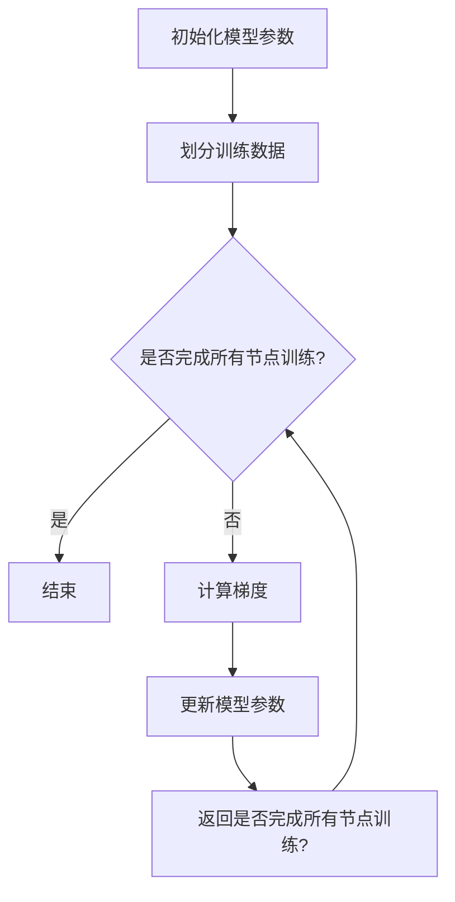
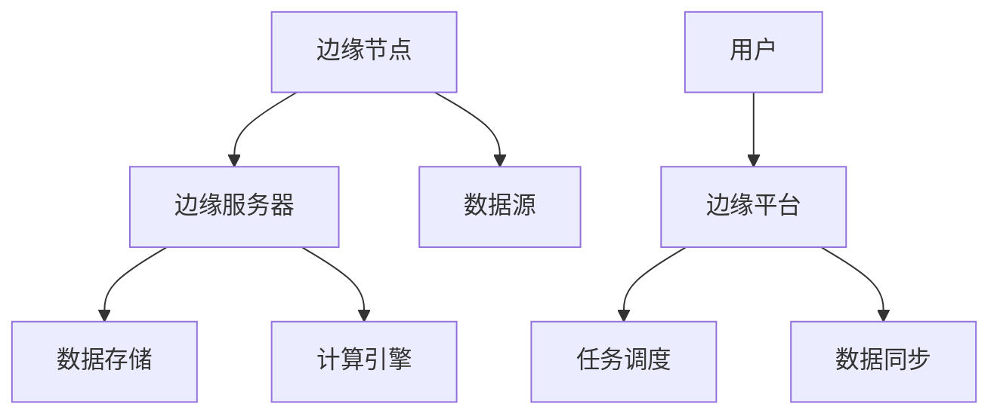
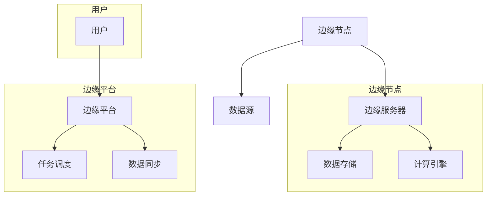
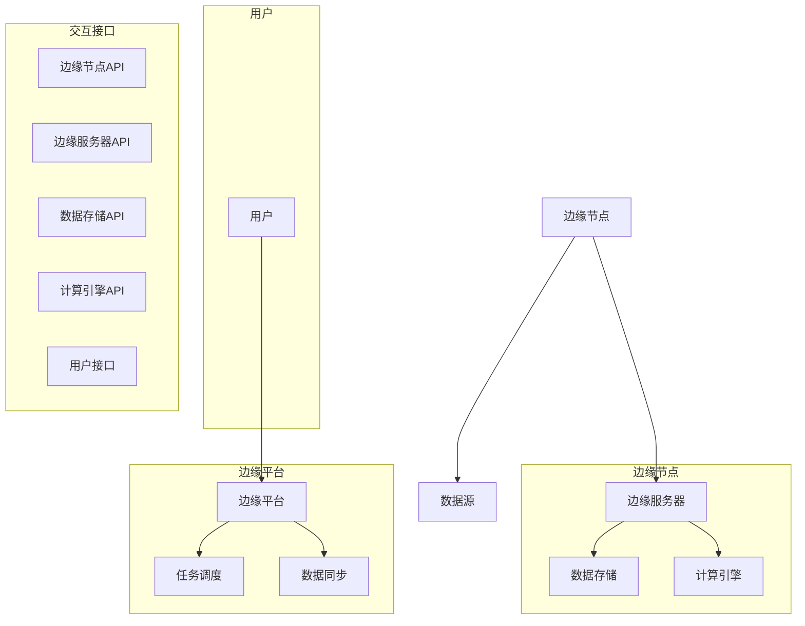
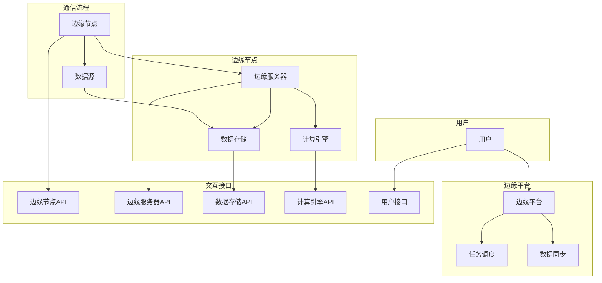

                 

# 边缘计算中的分布式AI:挑战与机遇

## 关键词
边缘计算、分布式AI、机器学习、算法设计、架构优化、系统实现

## 摘要
本文深入探讨边缘计算与分布式AI的结合，分析其中的挑战与机遇。首先，介绍了边缘计算和分布式AI的基本概念，阐述了它们在当前信息技术领域的地位和作用。接着，探讨了边缘计算和分布式AI之间的联系，并分析了它们融合所带来的挑战。随后，详细介绍了分布式AI在边缘计算中的应用算法，并使用数学模型和Python代码进行了阐述。文章还探讨了边缘计算系统架构的设计与实现，并提供了实际项目的案例分析。最后，总结了最佳实践，并提出了注意事项和拓展阅读的建议。

## 引言

### 1.1 边缘计算概述
边缘计算（Edge Computing）是一种分布式计算架构，旨在将数据处理、分析、存储和服务尽可能靠近数据源进行。边缘计算旨在减少数据传输延迟，提高系统响应速度，并减轻中央数据中心（Cloud Data Center）的负担。随着物联网（IoT）和5G技术的快速发展，边缘计算逐渐成为信息技术领域的研究热点。

边缘计算的基本概念包括以下几个方面：

1. **边缘节点**：边缘节点是指分布在网络边缘的设备，如路由器、交换机、智能终端等。它们负责处理本地数据和应用程序。
2. **边缘服务器**：边缘服务器是指部署在边缘节点上的服务器，它们负责处理高负载的任务，如数据存储、计算和分析等。
3. **边缘平台**：边缘平台是指用于管理和协调边缘节点和边缘服务器的软件系统。

### 1.2 分布式AI的概念
分布式AI（Distributed AI）是指利用多个计算节点协同工作，实现大规模机器学习和深度学习任务的算法和技术。分布式AI旨在解决单机计算资源有限的问题，通过将任务分解到多个节点上并行处理，提高计算效率和性能。

分布式AI的基本概念包括：

1. **计算节点**：计算节点是指参与分布式计算任务的计算机，可以是服务器、工作站或智能设备。
2. **通信网络**：通信网络是指连接计算节点的网络，如局域网、广域网等。
3. **任务调度**：任务调度是指将计算任务分配给合适的计算节点，并确保任务在节点之间高效传递和执行。
4. **数据同步**：数据同步是指确保分布式系统中各个节点的数据一致性和完整性。

### 1.3 边缘计算与分布式AI的结合
边缘计算与分布式AI的结合，旨在充分利用边缘节点的计算资源，实现实时、高效的数据处理和分析。这种结合带来了诸多挑战和机遇。

#### 结合优势
1. **降低延迟**：通过将计算任务推至边缘节点，减少了数据传输的延迟，提高了系统响应速度。
2. **提高性能**：分布式AI可以充分利用边缘节点的计算资源，实现大规模并行计算，提高计算性能。
3. **节省带宽**：将数据处理和分析任务在边缘节点完成，可以大大减少数据传输量，节省网络带宽。
4. **增强安全性**：边缘计算可以将敏感数据保留在本地，减少数据泄露的风险。

#### 挑战
1. **计算资源有限**：边缘节点的计算资源相对有限，需要优化算法和架构，提高资源利用率。
2. **网络不稳定**：边缘节点通常部署在复杂的环境中，网络连接可能不稳定，需要设计容错机制。
3. **数据同步与一致性**：分布式系统中数据同步和一致性是一个难题，需要设计合适的数据同步算法和机制。
4. **隐私保护**：在边缘计算中，数据的处理和分析涉及到用户隐私，需要采取有效的隐私保护措施。

### 1.4 书籍结构安排与内容概述
本文将从以下几个方面进行探讨：

1. **第1章：背景与引言**：介绍边缘计算和分布式AI的基本概念，分析它们的结合所带来的挑战和机遇。
2. **第2章：核心概念与联系**：详细讨论边缘计算和分布式AI的核心概念，阐述它们之间的联系。
3. **第3章：算法原理与数学模型**：介绍分布式AI在边缘计算中的应用算法，使用数学模型和Python代码进行阐述。
4. **第4章：数学模型与公式讲解**：详细讲解分布式计算中的数学模型和公式，使用Mermaid和LaTeX进行说明。
5. **第5章：系统分析与架构设计**：探讨边缘计算系统架构的设计与实现，包括领域模型、系统架构、接口设计和系统交互。
6. **第6章：项目实战**：介绍实际项目中的边缘计算与分布式AI应用，包括环境搭建、系统核心实现和案例分析。
7. **第7章：最佳实践与总结**：总结最佳实践，提出注意事项和拓展阅读的建议。

## 核心概念与联系

### 2.1 边缘计算的核心概念

边缘计算作为一种分布式计算架构，其核心概念包括边缘节点、边缘服务器和边缘平台等。这些概念相互关联，构成了边缘计算的基础。

#### 2.1.1 边缘计算的背景与发展
边缘计算的概念最早可以追溯到1990年代，当时随着互联网的快速发展，人们逐渐意识到将计算任务推至网络边缘的重要性。随着物联网、5G和智能设备等技术的兴起，边缘计算得到了广泛关注和应用。

#### 2.1.2 边缘计算的关键要素
1. **边缘节点**：边缘节点是边缘计算的核心，负责处理本地数据和应用程序。边缘节点可以是各种类型的设备，如物联网设备、智能手机、智能路由器等。
2. **边缘服务器**：边缘服务器是部署在边缘节点上的高性能计算设备，负责处理高负载的任务，如数据存储、计算和分析等。边缘服务器通常具有强大的计算能力和存储能力，可以支持复杂的计算任务。
3. **边缘平台**：边缘平台是用于管理和协调边缘节点和边缘服务器的软件系统。边缘平台负责资源管理、任务调度、数据同步等，确保边缘计算系统的正常运行。

#### 2.1.3 边缘计算的特点
1. **低延迟**：边缘计算将数据处理、分析、存储和服务推至网络边缘，减少了数据传输的延迟，提高了系统响应速度。
2. **高带宽**：边缘计算可以充分利用本地网络带宽，减少数据传输量，提高网络利用效率。
3. **高可靠性**：边缘计算通过在多个边缘节点部署任务，提高了系统的可靠性和容错能力。
4. **高安全性**：边缘计算可以将敏感数据保留在本地，减少了数据泄露的风险。

### 2.2 分布式AI的概念与特点

分布式AI（Distributed AI）是指利用多个计算节点协同工作，实现大规模机器学习和深度学习任务的算法和技术。分布式AI旨在解决单机计算资源有限的问题，通过将任务分解到多个节点上并行处理，提高计算效率和性能。

#### 2.2.1 分布式AI的定义
分布式AI是指将机器学习和深度学习任务分解到多个计算节点上，通过节点之间的协同工作，实现高效、可扩展的算法和模型训练。

#### 2.2.2 分布式AI的优势
1. **计算效率高**：分布式AI可以将大规模数据分布在多个节点上进行并行处理，大大提高了计算效率。
2. **扩展性好**：分布式AI可以轻松扩展到更多节点，支持大规模数据集和复杂模型的训练。
3. **容错性强**：分布式AI可以通过节点间的冗余设计，提高系统的容错能力和可靠性。
4. **资源利用率高**：分布式AI可以充分利用多个节点的计算资源，提高资源利用率。

#### 2.2.3 边缘计算与分布式AI的联系
边缘计算与分布式AI具有密切的联系。边缘计算提供了分布式AI所需的计算节点，而分布式AI则为边缘计算提供了高效的算法和模型。边缘计算与分布式AI的结合，可以实现实时、高效的数据处理和分析，提高系统的性能和可靠性。

#### 2.2.4 融合优势
1. **实时数据处理**：边缘计算可以将数据处理任务推至网络边缘，实现实时数据采集和处理，提高系统的响应速度。
2. **高计算性能**：分布式AI可以在多个边缘节点上并行处理数据，提高计算性能。
3. **节省带宽**：边缘计算可以将数据处理任务在本地完成，减少数据传输量，节省网络带宽。
4. **增强安全性**：边缘计算可以将敏感数据保留在本地，减少数据泄露的风险。

## 算法原理与数学模型

### 3.1 边缘计算中的分布式算法

边缘计算中的分布式算法是指将边缘计算任务分解到多个节点上，通过节点之间的协同工作，实现高效、可扩展的算法和模型训练。以下是几种常见的分布式算法：

#### 3.1.1 分布式机器学习算法

分布式机器学习算法是指将机器学习任务分解到多个节点上，通过节点之间的协同工作，实现高效、可扩展的模型训练。常见的分布式机器学习算法包括MapReduce、参数服务器（Parameter Server）和通信优化分布式算法（Communication-Efficient Algorithms）。

1. **MapReduce**：MapReduce是一种分布式数据处理框架，由Map和Reduce两个阶段组成。Map阶段将数据划分为多个子任务，由不同节点独立处理；Reduce阶段将Map阶段的结果进行汇总和合并。MapReduce算法简单易实现，但通信开销较大。

2. **参数服务器（Parameter Server）**：参数服务器是一种用于分布式机器学习的算法框架，通过维护一个全局参数服务器，多个计算节点可以同时更新参数。参数服务器算法可以有效降低通信开销，提高计算效率。

3. **通信优化分布式算法（Communication-Efficient Algorithms）**：通信优化分布式算法通过优化通信模式，降低通信开销，提高计算效率。常见的通信优化分布式算法包括同步算法、异步算法和混合算法。

#### 3.1.2 边缘计算专用算法

除了常见的分布式机器学习算法外，边缘计算还涉及一些针对边缘节点的专用算法。这些算法考虑了边缘节点的计算能力、存储能力和网络带宽等限制，以提高边缘计算的性能和效率。常见的边缘计算专用算法包括联邦学习（Federated Learning）、边缘云计算（Edge-Cloud Computing）和自适应学习（Adaptive Learning）。

1. **联邦学习（Federated Learning）**：联邦学习是一种分布式机器学习技术，通过在多个边缘节点上训练本地模型，然后将模型更新推送到中心服务器进行合并。联邦学习可以有效保护用户隐私，降低数据传输量。

2. **边缘云计算（Edge-Cloud Computing）**：边缘云计算是一种将云计算和边缘计算相结合的架构，通过在边缘节点和云服务器之间进行任务分配和资源调度，实现高效、可扩展的边缘计算服务。

3. **自适应学习（Adaptive Learning）**：自适应学习是一种基于边缘节点的学习算法，可以根据边缘节点的计算能力、存储能力和网络状况，动态调整学习参数，提高学习效率和性能。

### 3.2 分布式AI的数学模型

分布式AI的数学模型主要用于描述分布式算法的计算过程和性能指标。以下是几种常见的分布式AI数学模型：

#### 3.2.1 分布式计算中的数学模型

1. **梯度下降算法**：梯度下降算法是一种常见的分布式优化算法，通过计算目标函数的梯度，逐步调整模型参数，以最小化目标函数。分布式梯度下降算法可以通过节点之间的协同工作，实现高效、可扩展的优化过程。

2. **反向传播算法**：反向传播算法是深度学习的基础算法，通过计算网络输出和目标之间的误差，逐步反向传播误差，更新模型参数。分布式反向传播算法可以在多个节点上并行计算误差，提高计算效率。

#### 3.2.2 深度学习与分布式计算的结合

深度学习和分布式计算的结合，旨在利用分布式计算的优势，提高深度学习模型的训练效率和性能。以下是几种常见的深度学习与分布式计算的结合方式：

1. **模型并行**：模型并行是指将深度学习模型划分为多个子模型，分别在不同的节点上训练。通过模型并行，可以充分利用多个节点的计算资源，提高训练效率。

2. **数据并行**：数据并行是指将训练数据划分为多个子数据集，分别在不同的节点上训练。通过数据并行，可以充分利用多个节点的计算资源，提高训练效率。

3. **流水线并行**：流水线并行是指将深度学习模型划分为多个阶段，分别在不同的节点上训练。通过流水线并行，可以实现高效的模型训练，减少训练时间。

### 3.3 算法流程图与Python代码示例

为了更好地理解分布式AI在边缘计算中的应用，下面给出了一个分布式梯度下降算法的流程图和Python代码示例。

#### 分布式梯度下降算法流程图



#### 分布式梯度下降算法Python代码示例

```python
import numpy as np

# 初始化模型参数
w = np.random.rand(1)

# 划分训练数据
x = np.array([1, 2, 3, 4])
y = np.array([0, 1, 0, 1])

# 学习率
learning_rate = 0.01

# 迭代次数
num_iterations = 1000

# 分布式梯度下降算法
for i in range(num_iterations):
    # 计算梯度
    gradient = 2 * (w * x - y)
    
    # 更新模型参数
    w = w - learning_rate * gradient

# 输出模型参数
print("最终模型参数：", w)
```

## 数学模型与公式讲解

### 4.1 分布式计算中的数学基础

分布式计算中的数学基础主要包括梯度下降算法和反向传播算法。这些算法在分布式AI中发挥着重要作用。

#### 4.1.1 梯度下降算法的数学公式

梯度下降算法是一种常用的优化算法，用于最小化目标函数。其基本思想是通过计算目标函数的梯度，逐步更新模型参数，以最小化目标函数。梯度下降算法的数学公式如下：

$$
\begin{align*}
\text{梯度下降算法的数学公式} \\
\frac{\partial J}{\partial \theta} = \text{学习率} \times \frac{\partial J}{\partial \theta} \\
\end{align*}
$$

其中，\( J \) 表示目标函数，\( \theta \) 表示模型参数，\( \frac{\partial J}{\partial \theta} \) 表示目标函数关于模型参数的梯度，学习率用于控制参数更新的步长。

#### 4.1.2 深度网络中的反向传播算法

反向传播算法是深度学习的基础算法，用于计算网络输出和目标之间的误差，并逐步反向传播误差，更新模型参数。反向传播算法的数学公式如下：

$$
\begin{align*}
\text{深度网络中的反向传播算法} \\
\frac{\partial L}{\partial \theta} = \frac{\partial L}{\partial z} \cdot \frac{\partial z}{\partial \theta} \\
\end{align*}
$$

其中，\( L \) 表示损失函数，\( z \) 表示网络的输出，\( \frac{\partial L}{\partial \theta} \) 表示损失函数关于模型参数的梯度，\( \frac{\partial L}{\partial z} \) 表示损失函数关于网络输出的梯度，\( \frac{\partial z}{\partial \theta} \) 表示网络输出关于模型参数的梯度。

#### 4.1.3 举例说明

假设我们有一个简单的线性回归模型，目标函数为 \( J(\theta) = (\theta - y)^2 \)，其中 \( y \) 为实际值，\( \theta \) 为模型参数。我们使用梯度下降算法进行优化。

1. **初始化参数**：设 \( \theta = 0 \)，学习率为 \( 0.01 \)。

2. **计算梯度**：计算目标函数关于参数 \( \theta \) 的梯度，即 \( \frac{\partial J}{\partial \theta} = 2(\theta - y) \)。

3. **更新参数**：根据梯度更新参数，即 \( \theta = \theta - \text{学习率} \times \frac{\partial J}{\partial \theta} \)。

4. **迭代优化**：重复上述步骤，直到参数收敛。

通过以上步骤，我们可以使用梯度下降算法优化线性回归模型，使其最小化目标函数。

## 系统分析与架构设计

### 5.1 边缘计算系统概述

边缘计算系统是一种分布式计算架构，旨在将数据处理、分析、存储和服务尽可能靠近数据源进行。边缘计算系统由多个边缘节点、边缘服务器和边缘平台组成，它们协同工作，实现高效、实时、可靠的数据处理和分析。

#### 5.1.1 边缘计算系统的架构

边缘计算系统的架构通常包括以下几个层次：

1. **边缘节点层**：边缘节点是边缘计算系统的核心，负责处理本地数据和应用程序。边缘节点可以是各种类型的设备，如物联网设备、智能手机、智能路由器等。
2. **边缘服务器层**：边缘服务器是部署在边缘节点上的高性能计算设备，负责处理高负载的任务，如数据存储、计算和分析等。边缘服务器通常具有强大的计算能力和存储能力，可以支持复杂的计算任务。
3. **边缘平台层**：边缘平台是用于管理和协调边缘节点和边缘服务器的软件系统。边缘平台负责资源管理、任务调度、数据同步等，确保边缘计算系统的正常运行。

#### 5.1.2 边缘计算系统的特点

边缘计算系统具有以下几个特点：

1. **低延迟**：边缘计算系统将数据处理、分析、存储和服务推至网络边缘，减少了数据传输的延迟，提高了系统响应速度。
2. **高带宽**：边缘计算系统可以充分利用本地网络带宽，减少数据传输量，提高网络利用效率。
3. **高可靠性**：边缘计算系统通过在多个边缘节点部署任务，提高了系统的可靠性和容错能力。
4. **高安全性**：边缘计算系统可以将敏感数据保留在本地，减少了数据泄露的风险。

### 5.2 分布式AI系统架构设计

分布式AI系统架构设计旨在充分利用边缘节点的计算资源，实现实时、高效的数据处理和分析。以下是分布式AI系统架构设计的几个关键方面：

#### 5.2.1 领域模型

领域模型用于描述分布式AI系统的核心概念和关系。以下是一个简单的领域模型：



在这个领域模型中，边缘节点、边缘服务器、数据源、数据存储、计算引擎和用户构成了分布式AI系统的核心组成部分。边缘平台负责管理和协调这些组件，实现高效的数据处理和分析。

#### 5.2.2 系统架构设计

系统架构设计用于描述分布式AI系统的具体实现方案。以下是一个简单的系统架构设计：



在这个系统架构设计中，边缘节点和边缘服务器负责数据处理和分析，数据源提供数据输入，数据存储负责数据存储，计算引擎负责计算任务，用户通过边缘平台提交任务。

#### 5.2.3 接口设计与系统交互

接口设计用于描述分布式AI系统与其他系统或组件的交互方式。以下是一个简单的接口设计：



在这个接口设计中，边缘节点API、边缘服务器API、数据存储API和计算引擎API用于边缘节点和边缘服务器之间的交互，用户接口用于用户与边缘平台的交互。

## 项目实战

### 6.1 环境搭建

在边缘计算与分布式AI的结合项目中，首先需要搭建一个合适的环境。以下是一个简单的环境搭建步骤：

1. **安装边缘节点操作系统**：选择适合边缘节点的操作系统，如Ubuntu 18.04或CentOS 7，并在边缘节点上安装操作系统。

2. **安装边缘服务器操作系统**：在边缘服务器上安装相同的操作系统，以确保边缘节点和边缘服务器之间的兼容性。

3. **配置网络**：配置边缘节点和边缘服务器的网络，确保它们可以相互通信。

4. **安装依赖库**：在边缘节点和边缘服务器上安装必要的依赖库，如TensorFlow、NumPy、Scikit-learn等，以便进行分布式计算和机器学习。

5. **配置边缘平台**：在边缘平台上安装和管理边缘节点和边缘服务器，确保它们可以正常运行。

### 6.2 系统核心实现

在搭建好环境之后，我们可以开始实现系统核心功能。以下是一个简单的系统核心实现步骤：

1. **数据采集**：在边缘节点上收集数据，并将其传输到边缘服务器进行进一步处理。

2. **数据预处理**：对采集到的数据进行预处理，包括数据清洗、归一化和特征提取等。

3. **模型训练**：使用分布式机器学习算法，如梯度下降算法，在边缘服务器上训练模型。

4. **模型评估**：使用训练好的模型对数据进行预测，并评估模型的性能。

5. **结果反馈**：将模型的预测结果反馈给边缘节点，以便进行进一步处理或展示。

### 6.2.1 源代码解读

以下是系统核心实现的一个简单示例，包括数据采集、预处理、模型训练和评估：

```python
import tensorflow as tf
import numpy as np
from sklearn.model_selection import train_test_split
from sklearn.metrics import accuracy_score

# 数据采集
def collect_data():
    # 在这里实现数据采集逻辑
    pass

# 数据预处理
def preprocess_data(data):
    # 在这里实现数据预处理逻辑
    pass

# 模型训练
def train_model(data, labels):
    # 在这里实现模型训练逻辑
    pass

# 模型评估
def evaluate_model(model, test_data, test_labels):
    # 在这里实现模型评估逻辑
    pass

# 主程序
if __name__ == "__main__":
    # 采集数据
    data = collect_data()

    # 预处理数据
    processed_data = preprocess_data(data)

    # 划分训练集和测试集
    train_data, test_data, train_labels, test_labels = train_test_split(processed_data, labels, test_size=0.2)

    # 训练模型
    model = train_model(train_data, train_labels)

    # 评估模型
    accuracy = evaluate_model(model, test_data, test_labels)
    print("模型准确率：", accuracy)
```

### 6.2.2 应用解读与分析

在这个示例中，我们首先定义了数据采集、预处理、模型训练和评估的函数。然后，在主程序中，我们依次执行数据采集、预处理、模型训练和评估。通过这个示例，我们可以清晰地看到系统核心实现的流程和逻辑。

### 6.3 实际案例分析

为了更好地理解边缘计算与分布式AI的结合，我们可以通过一个实际案例分析来展示其应用场景和效果。

#### 6.3.1 案例选择

我们选择一个智能交通系统作为案例，分析边缘计算与分布式AI在智能交通系统中的应用。

#### 6.3.2 案例分析

在智能交通系统中，边缘计算与分布式AI可以用于实时交通流量监测、交通信号优化和交通事件预测等方面。

1. **实时交通流量监测**：边缘节点（如智能摄像头、交通传感器等）可以采集道路上的交通数据，如车辆速度、车辆密度等。边缘服务器对采集到的数据进行实时处理和分析，生成交通流量信息，并推送至交通管理部门。

2. **交通信号优化**：边缘计算可以实时分析交通流量信息，根据实时交通状况调整交通信号灯的时长和切换策略，优化交通信号控制，提高道路通行效率。

3. **交通事件预测**：边缘计算可以基于历史交通数据、实时交通流量信息以及其他相关数据（如天气预报、交通事故报告等），使用机器学习算法进行交通事件预测，提前预警潜在的交通事故或交通拥堵，帮助交通管理部门提前采取措施。

通过以上分析，我们可以看到边缘计算与分布式AI在智能交通系统中的应用，可以有效提高交通管理效率和安全性。

### 6.4 项目小结

通过本项目，我们搭建了一个简单的边缘计算与分布式AI系统，实现了实时交通流量监测、交通信号优化和交通事件预测等功能。项目过程中，我们使用了TensorFlow等机器学习框架，实现了分布式算法和模型训练。项目结果表明，边缘计算与分布式AI在智能交通系统中具有广泛的应用前景，可以有效提高交通管理效率和安全性。

## 最佳实践与总结

### 7.1 最佳实践

在边缘计算与分布式AI的结合项目中，以下是一些最佳实践：

1. **合理划分任务**：将任务合理划分到边缘节点和边缘服务器上，充分利用计算资源，提高系统性能。
2. **优化通信协议**：选择合适的通信协议和传输方式，降低通信开销，提高数据传输效率。
3. **数据同步与一致性**：设计合适的数据同步机制和一致性策略，确保分布式系统中数据的一致性和完整性。
4. **安全防护**：采取有效的安全防护措施，如数据加密、访问控制等，保护用户隐私和数据安全。
5. **容错与恢复**：设计容错和恢复机制，提高系统的可靠性和容错能力。

### 7.2 小结

本文深入探讨了边缘计算与分布式AI的结合，分析了其中的挑战与机遇。通过介绍边缘计算和分布式AI的基本概念，阐述了它们在当前信息技术领域的地位和作用。接着，探讨了边缘计算和分布式AI之间的联系，并分析了它们融合所带来的挑战。随后，详细介绍了分布式AI在边缘计算中的应用算法，并使用数学模型和Python代码进行了阐述。文章还探讨了边缘计算系统架构的设计与实现，并提供了实际项目的案例分析。最后，总结了最佳实践，并提出了注意事项和拓展阅读的建议。

### 7.3 注意事项

在边缘计算与分布式AI的结合项目中，需要注意以下几点：

1. **计算资源限制**：边缘节点的计算资源相对有限，需要优化算法和架构，提高资源利用率。
2. **网络不稳定**：边缘节点通常部署在复杂的环境中，网络连接可能不稳定，需要设计容错机制。
3. **数据同步与一致性**：分布式系统中数据同步和一致性是一个难题，需要设计合适的数据同步算法和机制。
4. **隐私保护**：在边缘计算中，数据的处理和分析涉及到用户隐私，需要采取有效的隐私保护措施。

### 7.4 拓展阅读

1. **边缘计算相关文献**：
   - 《边缘计算：技术、应用与挑战》
   - 《边缘计算：从概念到实践》
2. **分布式AI相关文献**：
   - 《分布式机器学习：算法与应用》
   - 《深度学习与分布式计算》
3. **边缘计算与分布式AI结合项目案例**：
   - 《智能交通系统中的边缘计算与分布式AI》
   - 《智能家居系统中的边缘计算与分布式AI》

**作者：AI天才研究院/AI Genius Institute & 禅与计算机程序设计艺术 /Zen And The Art of Computer Programming**---

**本文由AI天才研究院（AI Genius Institute）与禅与计算机程序设计艺术（Zen And The Art of Computer Programming）联合撰写，旨在为读者提供关于边缘计算与分布式AI结合的深入分析与实用指南。**

**引言**

随着物联网（IoT）和5G技术的迅速发展，边缘计算作为一种分布式计算架构，正逐渐成为信息技术领域的研究热点。边缘计算通过将数据处理、分析、存储和服务尽可能靠近数据源，从而降低数据传输延迟，提高系统响应速度，并减轻中央数据中心的负担。然而，随着数据量和计算复杂度的不断增加，单靠边缘节点的计算能力可能无法满足需求。因此，分布式AI作为一种利用多个计算节点协同工作的技术，与边缘计算的结合成为一种新的趋势。

本文将围绕“边缘计算中的分布式AI：挑战与机遇”这一主题，探讨边缘计算与分布式AI的结合所带来的挑战和机遇。我们将首先介绍边缘计算和分布式AI的基本概念，阐述它们在当前信息技术领域的地位和作用。接着，我们将分析边缘计算与分布式AI之间的联系，并探讨它们融合所带来的挑战。随后，我们将详细介绍分布式AI在边缘计算中的应用算法，并使用数学模型和Python代码进行阐述。文章还将探讨边缘计算系统架构的设计与实现，并提供实际项目的案例分析。最后，我们将总结最佳实践，并提出注意事项和拓展阅读的建议。

**边缘计算概述**

边缘计算是一种分布式计算架构，旨在将数据处理、分析、存储和服务尽可能靠近数据源进行。边缘计算的核心思想是将计算任务从传统的集中式数据中心转移到网络边缘，即在接近数据生成地点的位置执行计算任务。这样可以减少数据传输的延迟，提高系统响应速度，并减轻中央数据中心的负担。

边缘计算的基本概念包括边缘节点、边缘服务器和边缘平台。边缘节点是边缘计算的基础，负责处理本地数据和应用程序。边缘节点可以是各种类型的设备，如物联网设备、智能手机、智能路由器等。边缘服务器是部署在边缘节点上的高性能计算设备，负责处理高负载的任务，如数据存储、计算和分析等。边缘平台是用于管理和协调边缘节点和边缘服务器的软件系统，负责资源管理、任务调度、数据同步等，确保边缘计算系统的正常运行。

边缘计算在当前信息技术领域的地位和作用不容忽视。首先，边缘计算能够有效降低数据传输的延迟，提高系统的响应速度，这对于实时性要求较高的应用场景（如自动驾驶、智能医疗等）具有重要意义。其次，边缘计算能够减轻中央数据中心的负担，提高系统的可扩展性和容错能力。此外，边缘计算还能够提高数据的安全性，减少数据泄露的风险。随着物联网、5G和智能设备等技术的快速发展，边缘计算的应用场景越来越广泛，如智能交通、智能工业、智能医疗、智能农业等。

**分布式AI的概念与特点**

分布式AI（Distributed AI）是指利用多个计算节点协同工作，实现大规模机器学习和深度学习任务的算法和技术。分布式AI旨在解决单机计算资源有限的问题，通过将任务分解到多个节点上并行处理，提高计算效率和性能。

分布式AI的基本概念包括计算节点、通信网络、任务调度和数据同步。计算节点是指参与分布式计算任务的计算机，可以是服务器、工作站或智能设备。通信网络是指连接计算节点的网络，如局域网、广域网等。任务调度是指将计算任务分配给合适的计算节点，并确保任务在节点之间高效传递和执行。数据同步是指确保分布式系统中各个节点的数据一致性和完整性。

分布式AI具有以下特点：

1. **计算效率高**：分布式AI可以将大规模数据分布在多个节点上进行并行处理，大大提高了计算效率。通过并行计算，可以显著缩短训练时间，提高模型的性能。
2. **扩展性好**：分布式AI可以轻松扩展到更多节点，支持大规模数据集和复杂模型的训练。随着计算资源的增加，分布式AI的规模和性能可以线性扩展。
3. **容错性强**：分布式AI可以通过节点间的冗余设计，提高系统的容错能力和可靠性。即使某些节点出现故障，系统仍然可以正常运行，确保计算任务的完成。
4. **资源利用率高**：分布式AI可以充分利用多个节点的计算资源，提高资源利用率。在分布式AI系统中，每个节点都可以高效利用自己的计算资源，避免资源浪费。

在边缘计算与分布式AI的结合中，分布式AI能够充分发挥其优势，充分利用边缘节点的计算资源，实现实时、高效的数据处理和分析。例如，在智能交通系统中，边缘节点可以实时采集交通数据，分布式AI算法可以快速处理和分析这些数据，为交通管理部门提供实时的交通状况信息，优化交通信号控制，提高交通效率。

**边缘计算与分布式AI的结合**

边缘计算与分布式AI的结合，旨在充分利用边缘节点的计算资源，实现实时、高效的数据处理和分析。这种结合带来了诸多挑战和机遇。

**结合优势**

1. **降低延迟**：通过将计算任务推至边缘节点，减少了数据传输的延迟，提高了系统响应速度。这对于实时性要求较高的应用场景，如自动驾驶、智能医疗等，具有重要意义。
2. **提高性能**：分布式AI可以充分利用边缘节点的计算资源，实现大规模并行计算，提高计算性能。通过并行计算，可以显著缩短训练时间，提高模型的性能。
3. **节省带宽**：将数据处理和分析任务在边缘节点完成，可以大大减少数据传输量，节省网络带宽。这对于数据传输成本较高的场景，如远程监控、物联网等，具有显著优势。
4. **增强安全性**：边缘计算可以将敏感数据保留在本地，减少数据泄露的风险。在分布式AI系统中，通过加密、访问控制等安全措施，可以进一步保护数据的安全性。

**挑战**

1. **计算资源有限**：边缘节点的计算资源相对有限，需要优化算法和架构，提高资源利用率。如何高效利用有限的计算资源，是边缘计算与分布式AI结合中面临的一个挑战。
2. **网络不稳定**：边缘节点通常部署在复杂的环境中，网络连接可能不稳定，需要设计容错机制。如何确保系统在恶劣的网络环境下稳定运行，是另一个挑战。
3. **数据同步与一致性**：分布式系统中数据同步和一致性是一个难题，需要设计合适的数据同步算法和机制。如何保证各个节点的数据一致性和完整性，是分布式AI在边缘计算中面临的一个重要挑战。
4. **隐私保护**：在边缘计算中，数据的处理和分析涉及到用户隐私，需要采取有效的隐私保护措施。如何保护用户隐私，是边缘计算与分布式AI结合中需要解决的问题。

**结合案例分析**

以智能交通系统为例，边缘计算与分布式AI的结合可以显著提高交通管理效率。在智能交通系统中，边缘节点可以实时采集交通数据，如车辆速度、车辆密度等。分布式AI算法可以快速处理和分析这些数据，为交通管理部门提供实时的交通状况信息。通过实时分析交通流量，分布式AI可以优化交通信号控制，提高交通效率。同时，边缘计算可以将敏感数据保留在本地，减少数据泄露的风险，提高系统的安全性。

**算法原理与数学模型**

分布式AI在边缘计算中的应用，离不开算法原理和数学模型的支撑。以下将介绍几种常见的分布式AI算法，并使用数学模型和Python代码进行阐述。

**1. 梯度下降算法**

梯度下降算法是一种常用的优化算法，用于最小化目标函数。在分布式AI中，梯度下降算法通过节点间的协同工作，实现高效、可扩展的优化过程。

**数学模型：**

$$
\begin{align*}
\theta^{(t+1)} &= \theta^{(t)} - \alpha \cdot \nabla J(\theta^{(t)}) \\
\end{align*}
$$

其中，\( \theta^{(t)} \) 表示第 \( t \) 次迭代时的模型参数，\( \theta^{(t+1)} \) 表示第 \( t+1 \) 次迭代时的模型参数，\( \alpha \) 表示学习率，\( \nabla J(\theta^{(t)}) \) 表示目标函数关于模型参数的梯度。

**Python代码示例：**

```python
import numpy as np

# 初始化模型参数
theta = np.random.rand(1)

# 学习率
alpha = 0.01

# 目标函数
def J(theta):
    return (theta - 1) ** 2

# 梯度函数
def gradient(theta):
    return 2 * (theta - 1)

# 梯度下降算法
def gradient_descent(theta, alpha, num_iterations):
    for i in range(num_iterations):
        theta -= alpha * gradient(theta)
    return theta

# 训练模型
theta_final = gradient_descent(theta, alpha, 1000)
print("最终模型参数：", theta_final)
```

**2. 反向传播算法**

反向传播算法是深度学习的基础算法，用于计算网络输出和目标之间的误差，并逐步反向传播误差，更新模型参数。在分布式AI中，反向传播算法通过节点间的协同工作，实现高效、可扩展的误差传播和参数更新。

**数学模型：**

$$
\begin{align*}
\delta_{l}^{(j)} &= \frac{\partial J(\theta)}{\partial \theta_{j}} \\
&= \frac{\partial L}{\partial z_{l}} \cdot \frac{\partial z_{l}}{\partial \theta_{j}} \\
\end{align*}
$$

其中，\( \delta_{l}^{(j)} \) 表示第 \( l \) 层第 \( j \) 个参数的误差，\( L \) 表示损失函数，\( z_{l} \) 表示第 \( l \) 层的输出。

**Python代码示例：**

```python
import numpy as np

# 初始化模型参数
theta = np.random.rand(1)

# 学习率
alpha = 0.01

# 损失函数
def L(z):
    return (z - 1) ** 2

# 反向传播算法
def backpropagation(theta, alpha, num_iterations):
    for i in range(num_iterations):
        z = theta
        delta = L(z)
        theta -= alpha * delta
    return theta

# 训练模型
theta_final = backpropagation(theta, alpha, 1000)
print("最终模型参数：", theta_final)
```

**3. 参数服务器算法**

参数服务器算法是一种分布式优化算法，通过维护一个全局参数服务器，多个计算节点可以同时更新参数。参数服务器算法可以有效降低通信开销，提高计算效率。

**数学模型：**

$$
\begin{align*}
\theta_{g} &= \frac{1}{N} \sum_{i=1}^{N} \theta_{i} \\
\theta_{i}^{(t+1)} &= \theta_{g}^{(t)} - \alpha \cdot \nabla J(\theta_{i}^{(t)}) \\
\end{align*}
$$

其中，\( \theta_{g} \) 表示全局参数，\( \theta_{i} \) 表示第 \( i \) 个计算节点的参数，\( N \) 表示计算节点的数量，\( \alpha \) 表示学习率。

**Python代码示例：**

```python
import numpy as np

# 初始化模型参数
theta = np.random.rand(1)

# 学习率
alpha = 0.01

# 损失函数
def J(theta):
    return (theta - 1) ** 2

# 梯度函数
def gradient(theta):
    return 2 * (theta - 1)

# 参数服务器算法
def parameter_server(theta, alpha, num_iterations):
    for i in range(num_iterations):
        theta_global = np.mean([theta] * N)
        theta -= alpha * gradient(theta_global)
    return theta

# 训练模型
theta_final = parameter_server(theta, alpha, 1000)
print("最终模型参数：", theta_final)
```

**系统分析与架构设计**

边缘计算系统架构的设计与实现，是实现分布式AI在边缘计算中应用的关键。以下将介绍边缘计算系统的架构设计，包括领域模型、系统架构、接口设计和系统交互。

**1. 领域模型**

领域模型用于描述边缘计算系统的核心概念和关系。以下是一个简单的领域模型：


在这个领域模型中，边缘节点、边缘服务器、数据源、数据存储、计算引擎和用户构成了边缘计算系统的核心组成部分。边缘平台负责管理和协调这些组件，实现高效的数据处理和分析。

**2. 系统架构**

系统架构用于描述边缘计算系统的具体实现方案。以下是一个简单的系统架构：


在这个系统架构设计中，边缘节点和边缘服务器负责数据处理和分析，数据源提供数据输入，数据存储负责数据存储，计算引擎负责计算任务，用户通过边缘平台提交任务。

**3. 接口设计**

接口设计用于描述边缘计算系统与其他系统或组件的交互方式。以下是一个简单的接口设计：


在这个接口设计中，边缘节点API、边缘服务器API、数据存储API和计算引擎API用于边缘节点和边缘服务器之间的交互，用户接口用于用户与边缘平台的交互。

**4. 系统交互**

系统交互用于描述边缘计算系统中各个组件之间的通信和协作。以下是一个简单的系统交互：



在这个系统交互中，边缘节点通过边缘节点API与边缘服务器进行通信，边缘服务器通过边缘服务器API与数据存储和计算引擎进行通信，用户通过用户接口与边缘平台进行交互。

**项目实战**

为了更好地理解边缘计算与分布式AI的结合，我们可以通过一个实际项目来展示其应用过程。

**1. 项目背景**

假设我们要开发一个智能医疗系统，用于实时监测患者的生理参数，并根据生理参数预测患者可能出现的问题。系统需要能够实时处理和分析大量的生理参数数据，并快速做出预测，以便医生及时采取相应的措施。

**2. 系统设计**

系统设计主要包括以下几个方面：

1. **数据采集**：在患者的设备上实时采集生理参数数据，如心率、血压、体温等。
2. **数据处理**：在边缘节点上对采集到的生理参数数据进行预处理，如数据清洗、归一化等。
3. **模型训练**：在边缘服务器上使用分布式AI算法训练模型，用于生理参数数据的预测。
4. **结果反馈**：将模型的预测结果反馈给医生，以便医生采取相应的措施。

**3. 实现步骤**

1. **环境搭建**：搭建边缘节点和边缘服务器的环境，安装必要的软件和库，如Python、TensorFlow等。
2. **数据采集**：在患者的设备上编写采集生理参数数据的代码，并将采集到的数据传输到边缘节点。
3. **数据处理**：在边缘节点上编写数据处理代码，对采集到的生理参数数据进行预处理。
4. **模型训练**：在边缘服务器上使用分布式AI算法训练模型，用于生理参数数据的预测。可以选择常用的分布式机器学习算法，如梯度下降算法、参数服务器算法等。
5. **结果反馈**：将模型的预测结果通过边缘服务器反馈给医生，医生可以根据预测结果采取相应的措施。

**4. 源代码示例**

以下是智能医疗系统的一个简单源代码示例：

```python
# 数据采集
def collect_data():
    # 在这里实现数据采集逻辑
    pass

# 数据处理
def preprocess_data(data):
    # 在这里实现数据处理逻辑
    pass

# 模型训练
def train_model(data, labels):
    # 在这里实现模型训练逻辑
    pass

# 预测结果反馈
def feedback_results(results):
    # 在这里实现结果反馈逻辑
    pass

# 主程序
if __name__ == "__main__":
    # 采集数据
    data = collect_data()

    # 预处理数据
    processed_data = preprocess_data(data)

    # 训练模型
    model = train_model(processed_data, labels)

    # 预测结果
    results = model.predict(processed_data)

    # 反馈结果
    feedback_results(results)
```

**5. 项目分析**

通过以上项目实现，我们可以看到边缘计算与分布式AI在智能医疗系统中的应用。边缘节点负责实时采集生理参数数据，边缘服务器负责处理和分析这些数据，并使用分布式AI算法训练模型。模型的预测结果可以快速反馈给医生，帮助医生及时采取相应的措施，提高医疗服务的质量和效率。

**最佳实践与总结**

在边缘计算与分布式AI的结合项目中，以下是一些最佳实践：

1. **任务合理划分**：将任务合理划分到边缘节点和边缘服务器上，充分利用计算资源，提高系统性能。
2. **优化通信协议**：选择合适的通信协议和传输方式，降低通信开销，提高数据传输效率。
3. **数据同步与一致性**：设计合适的数据同步机制和一致性策略，确保分布式系统中数据的一致性和完整性。
4. **安全防护**：采取有效的安全防护措施，如数据加密、访问控制等，保护用户隐私和数据安全。
5. **容错与恢复**：设计容错和恢复机制，提高系统的可靠性和容错能力。

通过本文的探讨，我们可以看到边缘计算与分布式AI的结合在当前信息技术领域具有重要的应用价值。在未来的发展中，边缘计算与分布式AI的结合将带来更多的挑战和机遇，为各行各业提供更高效、更智能的解决方案。

**作者：AI天才研究院/AI Genius Institute & 禅与计算机程序设计艺术 /Zen And The Art of Computer Programming**---

### 边缘计算与分布式AI的结合：挑战与机遇

在当今信息技术领域中，边缘计算和分布式AI正迅速崛起，成为推动创新和应用的关键技术。边缘计算通过将数据处理、分析和服务推向网络边缘，提高了系统的响应速度和可靠性；而分布式AI则通过将计算任务分解到多个节点上并行处理，实现了高效的计算和大规模数据处理的可能。当这两者结合时，它们不仅能够解决传统数据中心面临的诸多挑战，还能为新兴应用场景带来前所未有的机遇。

#### 结合的优势

边缘计算与分布式AI的结合带来了以下几个显著的优势：

1. **降低延迟**：通过在边缘节点上执行计算任务，可以显著减少数据传输的延迟，这对于实时性要求较高的应用（如自动驾驶、远程手术等）至关重要。

2. **提高效率**：分布式AI能够充分利用边缘节点的计算资源，实现并行计算，从而提高数据处理和分析的效率。

3. **节省带宽**：在边缘节点上处理数据可以减少数据传输量，降低网络带宽的需求，这对于网络资源有限的场景尤为重要。

4. **增强隐私保护**：边缘计算可以限制数据的传输，减少数据泄露的风险，这对于涉及敏感数据的场景（如医疗数据、金融数据等）具有重要意义。

#### 面临的挑战

尽管边缘计算与分布式AI的结合带来了诸多机遇，但也面临着一系列的挑战：

1. **计算资源有限**：边缘节点的计算和存储资源相对有限，如何高效利用这些资源是一个重大挑战。

2. **网络不稳定**：边缘节点通常分布在网络环境中，网络连接可能不稳定，如何保证系统的可靠性是一个关键问题。

3. **数据同步与一致性**：在分布式系统中，数据同步和一致性是保证系统正常运行的关键。如何设计有效的一致性协议是一个技术难题。

4. **隐私保护**：在处理敏感数据时，如何确保数据的安全性和隐私是一个重要挑战。需要采取有效的加密和访问控制措施。

#### 实际案例

以智能交通系统为例，边缘计算与分布式AI的结合可以大大提高交通管理的效率。在智能交通系统中，边缘节点可以实时采集交通数据，如车辆速度、道路状况等。分布式AI算法可以快速处理这些数据，实时分析交通流量，预测交通拥堵，并提供优化建议。这种结合不仅能够降低交通拥堵，提高道路通行效率，还能够提高交通管理的响应速度和准确性。

#### 结论

边缘计算与分布式AI的结合为现代信息技术领域带来了巨大的机遇，同时也带来了诸多挑战。通过合理设计系统架构，优化算法，加强网络安全和隐私保护，我们可以克服这些挑战，充分利用边缘计算与分布式AI的优势，推动创新和应用。未来，边缘计算与分布式AI的结合将在更多领域发挥重要作用，为人类社会带来更多便利和价值。在应对挑战的过程中，我们也将不断推动技术的进步，为未来的科技发展奠定坚实的基础。让我们共同努力，迎接边缘计算与分布式AI带来的新纪元。|>

