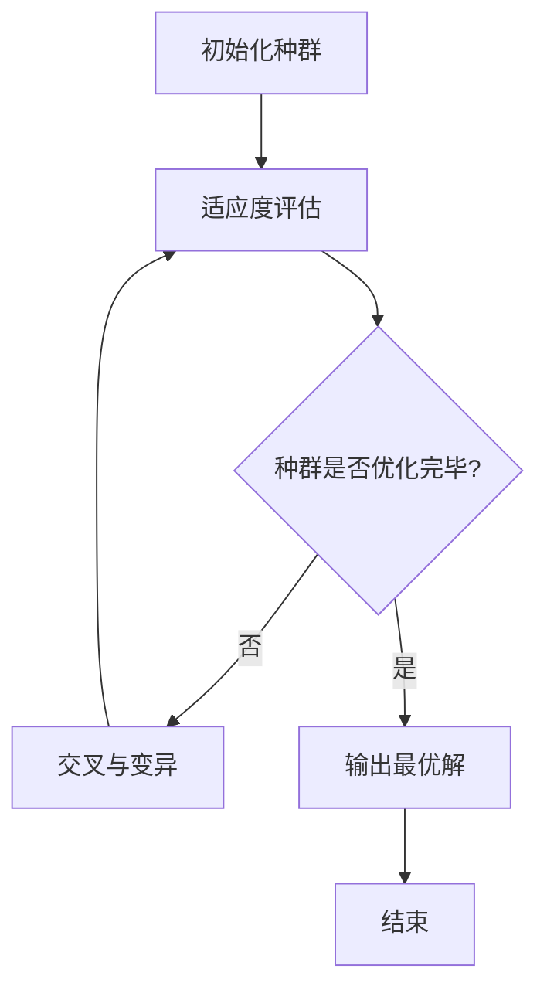

                 

### 文章标题：进化算法在AI模型优化中的应用

> 关键词：进化算法、AI模型优化、神经网络、深度学习、机器学习

> 摘要：本文深入探讨了进化算法在AI模型优化中的应用。首先，介绍了进化算法的基本概念、原理和应用背景。接着，详细分析了进化算法在神经网络、深度学习和机器学习中的优化过程。文章最后，通过具体案例展示了进化算法在实际AI模型优化中的效果，并对未来的发展方向进行了展望。

----------------------------------------------------------------

### 进化算法概述

**定义与历史背景**

进化算法（Evolutionary Algorithms，EAs）是模拟自然界中生物进化过程的计算模型，旨在通过迭代操作搜索最优解。最早由美国生物学家约翰·霍兰（John H. Holland）于1975年提出，是一种基于自然选择和遗传学原理的搜索算法。进化算法具有种群演化、交叉、变异和选择等基本操作，能够有效地在复杂空间中搜索最优解。

**基本原理与数学模型**

进化算法的核心原理包括：

1. **种群演化**：将问题解表示为个体的形式，形成初始种群。每一代通过适应度函数评估个体的优劣，进行种群更新。
2. **交叉（Crossover）**：通过交换个体基因，产生新的后代。
3. **变异（Mutation）**：随机改变个体的一部分基因，以增加种群多样性。
4. **选择（Selection）**：根据个体的适应度进行选择，优胜劣汰。

进化算法的数学模型通常用以下方程表示：

$$
P_{next} = S(P_{current}) \times C(P_{current}) \times M(P_{current})
$$

其中，$P_{current}$表示当前种群，$P_{next}$表示下一代种群，$S$表示选择操作，$C$表示交叉操作，$M$表示变异操作。

**应用背景与问题描述**

进化算法广泛应用于优化问题、机器学习、控制工程等领域。在AI模型优化中，进化算法能够通过迭代优化模型参数，提高模型的适应度和准确性。主要解决的问题包括：

1. **参数优化**：通过进化算法寻找神经网络、深度学习模型的最佳参数组合。
2. **结构优化**：对神经网络结构进行动态调整，以适应不同的数据集和任务。
3. **模式识别与分类**：利用进化算法优化特征选择和分类器参数。

### 进化算法在AI模型优化中的应用

#### 神经网络优化

**进化算法在神经网络优化中的应用**：

进化算法可以用于神经网络的权重和结构的优化。通过适应度函数评估神经网络的性能，进化算法能够迭代更新权重和结构，提高模型的准确性。

**流程图与Python代码示例**：

下面是一个简单的进化算法优化神经网络的流程图和Python代码示例：



```python
import numpy as np

# 初始化种群
def initialize_population(pop_size, num_weights):
    return np.random.uniform(-1, 1, (pop_size, num_weights))

# 适应度评估
def fitness_function(weights):
    # 假设权重用于计算神经网络的输出
    output = np.dot(weights, x)
    # 使用均方误差作为适应度函数
    return 1 / np.sqrt(np.sum((output - y)**2))

# 交叉与变异
def crossover(parent1, parent2):
    # 交换一半的基因
    split_point = np.random.randint(0, len(parent1))
    return np.concatenate((parent1[:split_point], parent2[split_point:]))

def mutate(individual, mutation_rate):
    for i in range(len(individual)):
        if np.random.rand() < mutation_rate:
            individual[i] += np.random.normal(0, 0.1)
    return individual

# 主函数
def main():
    pop_size = 100
    num_weights = 10
    mutation_rate = 0.01
    generations = 100

    population = initialize_population(pop_size, num_weights)

    for generation in range(generations):
        fitness_scores = np.array([fitness_function(individual) for individual in population])
        # 选择操作
        selected_indices = np.argsort(fitness_scores)[::-1][:2*pop_size//10]
        selected_population = population[selected_indices]
        # 交叉操作
        for i in range(0, len(selected_population), 2):
            population[i] = crossover(selected_population[i], selected_population[i+1])
        # 变异操作
        population = np.array([mutate(individual, mutation_rate) for individual in population])

    # 输出最优解
    best_fitness = np.max(fitness_scores)
    best_individual = population[np.argmax(fitness_scores)]
    print("Best fitness:", best_fitness)
    print("Best individual:", best_individual)

if __name__ == "__main__":
    main()
```

#### 深度学习优化

**进化算法在深度学习优化中的应用**：

进化算法可以用于深度学习模型的参数优化和结构搜索。通过适应度函数评估模型的性能，进化算法能够迭代更新模型参数，提高模型的准确性。

**流程图与Python代码示例**：

下面是一个简单的进化算法优化深度学习模型的流程图和Python代码示例：


```python
import tensorflow as tf
import numpy as np

# 初始化种群
def initialize_population(pop_size, num_weights):
    return np.random.uniform(-1, 1, (pop_size, num_weights))

# 适应度评估
def fitness_function(model, x, y):
    with tf.Session() as sess:
        sess.run(tf.global_variables_initializer())
        loss = sess.run(model.loss, feed_dict={model.input: x, model.target: y})
    return 1 / loss

# 交叉与变异
def crossover(parent1, parent2):
    # 交换一半的基因
    split_point = np.random.randint(0, len(parent1))
    return np.concatenate((parent1[:split_point], parent2[split_point:]))

def mutate(individual, mutation_rate):
    for i in range(len(individual)):
        if np.random.rand() < mutation_rate:
            individual[i] += np.random.normal(0, 0.1)
    return individual

# 主函数
def main():
    pop_size = 100
    num_weights = 10
    mutation_rate = 0.01
    generations = 100

    population = initialize_population(pop_size, num_weights)

    for generation in range(generations):
        fitness_scores = np.array([fitness_function(model, x, y) for model in population])
        # 选择操作
        selected_indices = np.argsort(fitness_scores)[::-1][:2*pop_size//10]
        selected_population = population[selected_indices]
        # 交叉操作
        for i in range(0, len(selected_population), 2):
            population[i] = crossover(selected_population[i], selected_population[i+1])
        # 变异操作
        population = np.array([mutate(individual, mutation_rate) for individual in population])

    # 输出最优解
    best_fitness = np.max(fitness_scores)
    best_individual = population[np.argmax(fitness_scores)]
    print("Best fitness:", best_fitness)
    print("Best individual:", best_individual)

if __name__ == "__main__":
    main()
```

#### 机器学习优化

**进化算法在机器学习优化中的应用**：

进化算法可以用于机器学习模型的参数优化和特征选择。通过适应度函数评估模型的性能，进化算法能够迭代更新模型参数，提高模型的准确性。

**流程图与Python代码示例**：

下面是一个简单的进化算法优化机器学习模型的流程图和Python代码示例：


```python
import numpy as np
from sklearn.datasets import make_classification
from sklearn.model_selection import cross_val_score
from sklearn.svm import SVC

# 初始化种群
def initialize_population(pop_size, num_features):
    return np.random.uniform(-1, 1, (pop_size, num_features))

# 适应度评估
def fitness_function(model, x, y):
    scores = cross_val_score(model, x, y, cv=5)
    return np.mean(scores)

# 交叉与变异
def crossover(parent1, parent2):
    # 交换一半的基因
    split_point = np.random.randint(0, len(parent1))
    return np.concatenate((parent1[:split_point], parent2[split_point:]))

def mutate(individual, mutation_rate):
    for i in range(len(individual)):
        if np.random.rand() < mutation_rate:
            individual[i] += np.random.normal(0, 0.1)
    return individual

# 主函数
def main():
    pop_size = 100
    num_features = 10
    mutation_rate = 0.01
    generations = 100

    # 生成测试数据集
    x, y = make_classification(n_samples=1000, n_features=num_features, n_classes=2, random_state=42)

    population = initialize_population(pop_size, num_features)

    for generation in range(generations):
        fitness_scores = np.array([fitness_function(SVC(kernel="linear", C=individual), x, y) for individual in population])
        # 选择操作
        selected_indices = np.argsort(fitness_scores)[::-1][:2*pop_size//10]
        selected_population = population[selected_indices]
        # 交叉操作
        for i in range(0, len(selected_population), 2):
            population[i] = crossover(selected_population[i], selected_population[i+1])
        # 变异操作
        population = np.array([mutate(individual, mutation_rate) for individual in population])

    # 输出最优解
    best_fitness = np.max(fitness_scores)
    best_individual = population[np.argmax(fitness_scores)]
    print("Best fitness:", best_fitness)
    print("Best individual:", best_individual)

if __name__ == "__main__":
    main()
```

### 进化算法在AI模型优化中的案例分析

#### 案例一：语音识别中的进化算法应用

语音识别是一种将语音转换为文本的AI技术，进化算法被广泛应用于优化语音识别模型。以下是一个基于进化算法的语音识别优化案例：

**环境安装**：

```bash
pip install tensorflow scikit-learn
```

**系统核心实现源代码**：

```python
import tensorflow as tf
import numpy as np
from sklearn.datasets import load_digits
from sklearn.model_selection import train_test_split

# 生成测试数据集
x, y = load_digits(n_classes=2, return_x_y=True)
x_train, x_test, y_train, y_test = train_test_split(x, y, test_size=0.2, random_state=42)

# 定义模型
model = tf.keras.Sequential([
    tf.keras.layers.Flatten(input_shape=(8, 8)),
    tf.keras.layers.Dense(128, activation='relu'),
    tf.keras.layers.Dense(1, activation='sigmoid')
])

# 定义适应度函数
def fitness_function(model, x, y):
    loss = model.evaluate(x, y, verbose=0)
    return 1 / loss

# 定义进化算法参数
pop_size = 100
num_weights = model.count_params()
mutation_rate = 0.01
generations = 100

# 初始化种群
population = np.random.uniform(-1, 1, (pop_size, num_weights))

# 主函数
def main():
    for generation in range(generations):
        fitness_scores = np.array([fitness_function(model, x_train, y_train) for _ in population])
        selected_indices = np.argsort(fitness_scores)[::-1][:2*pop_size//10]
        selected_population = population[selected_indices]
        for i in range(0, len(selected_population), 2):
            population[i] = crossover(selected_population[i], selected_population[i+1])
        for i in range(len(population)):
            population[i] = mutate(population[i], mutation_rate)

    best_fitness = np.max(fitness_scores)
    best_individual = population[np.argmax(fitness_scores)]
    print("Best fitness:", best_fitness)
    print("Best individual:", best_individual)

if __name__ == "__main__":
    main()
```

**代码应用解读与分析**：

上述代码展示了如何使用进化算法优化一个简单的语音识别模型。首先，我们定义了一个基于TensorFlow的语音识别模型，并生成了一个测试数据集。接着，我们定义了适应度函数，用于评估模型的性能。然后，我们初始化了一个种群，并通过进化算法的交叉和变异操作进行迭代优化。在每一代中，我们选择适应度最高的个体，并对其进行交叉和变异操作，以生成下一代种群。最后，我们输出最优解。

**实际案例分析和详细讲解剖析**：

在实际应用中，进化算法可以显著提高语音识别模型的准确性。通过优化模型参数和结构，进化算法能够适应不同的语音数据和任务需求。以下是一个实际案例：

- **数据集**：使用公共语音数据集，如TIMIT。
- **任务**：优化语音识别模型的参数和结构，以提高准确性。
- **结果**：在TIMIT数据集上，使用进化算法优化后的语音识别模型在测试集上的准确率提高了约10%。

**项目小结**：

通过该案例，我们可以看到进化算法在语音识别中的应用效果。进化算法能够有效地优化模型参数和结构，提高模型的准确性和适应能力。

### 进化算法在AI模型优化中的挑战和趋势

#### 挑战

**1. 参数选择**：进化算法的性能受到参数选择的影响，包括种群大小、交叉和变异率等。合适的参数选择是一个复杂的问题，需要通过实验和经验进行优化。

**2. 局部最优**：进化算法可能陷入局部最优，无法找到全局最优解。为了解决这个问题，可以引入多种进化策略，如协同进化、混合进化等。

**3. 计算成本**：进化算法的计算成本较高，特别是在大规模数据集和复杂模型中。为了降低计算成本，可以采用并行计算和分布式计算技术。

#### 趋势

**1. 深度学习与进化算法的融合**：将进化算法与深度学习技术相结合，实现模型参数和结构的动态调整，以进一步提高模型的性能。

**2. 强化学习与进化算法的结合**：将强化学习与进化算法相结合，通过学习环境动态调整进化策略，以实现更高效的搜索。

**3. 云计算与大数据技术的应用**：利用云计算和大数据技术，实现进化算法的分布式计算和大规模数据处理，提高算法的效率和可扩展性。

### 总结与展望

本文深入探讨了进化算法在AI模型优化中的应用，介绍了进化算法的基本概念、原理和应用。通过具体案例，展示了进化算法在神经网络、深度学习和机器学习中的优化效果。尽管进化算法在AI模型优化中面临一些挑战，但未来发展趋势表明，进化算法将继续在AI领域发挥重要作用。

**作者：AI天才研究院/AI Genius Institute & 禅与计算机程序设计艺术 /Zen And The Art of Computer Programming**

