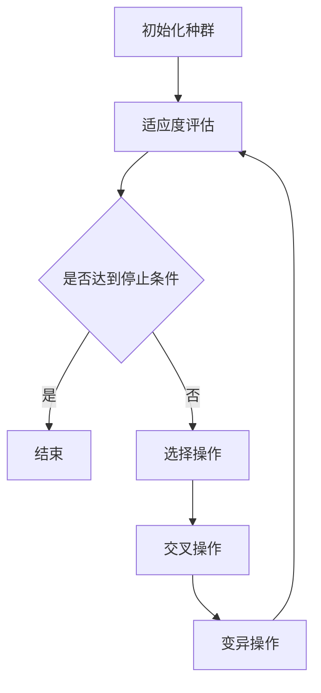

                 


## 引言

### 1.1 书籍背景介绍

《进化算法在多目标AI系统优化中的应用》这本书旨在探讨进化算法在多目标AI系统优化中的广泛应用和潜力。随着人工智能技术的迅猛发展，多目标优化问题成为了一个亟待解决的核心问题。传统的优化算法在处理多目标问题时往往存在一定的局限性，难以在复杂、动态的系统中取得满意的结果。进化算法作为一种模拟自然进化过程的优化方法，以其全局搜索、鲁棒性强等特点，逐渐成为解决多目标优化问题的有效工具。

本书将详细探讨进化算法在多目标AI系统优化中的应用，包括其基本概念、原理、实现步骤以及在不同领域的实际案例。通过这本书，读者可以全面了解进化算法在多目标AI系统优化中的优势和应用场景，掌握进化算法的核心技术和方法，为实际项目中的问题提供有效的解决方案。

### 1.2 多目标AI系统优化的挑战

多目标AI系统优化是一个复杂且具有挑战性的问题。首先，多目标优化涉及到多个目标之间的平衡和协调。这些目标往往具有不同的属性和优先级，使得在优化过程中需要考虑到各种因素，避免单一目标的过度优化导致其他目标的受损。其次，多目标优化问题的搜索空间通常非常庞大，难以通过传统的优化算法在合理的时间内找到全局最优解。此外，多目标AI系统优化还面临着动态变化、不确定性、约束条件等因素的挑战，使得优化过程更加复杂。

进化算法作为一种全局搜索能力较强的优化方法，可以在一定程度上应对这些挑战。然而，如何设计有效的进化算法、选择合适的适应度函数、平衡多样性和收敛速度等问题，仍然是多目标AI系统优化中需要深入研究的关键问题。

### 1.3 进化算法的基本概念

进化算法是一类模拟自然进化的优化方法，其基本思想是通过模拟自然选择、遗传和变异等过程，在迭代过程中逐步优化问题的解。进化算法主要包括以下几个基本概念：

1. **个体（Individual）**：个体是进化算法中的基本单位，代表问题的潜在解。个体通常由一组特征值或参数表示，用于描述问题的状态。

2. **种群（Population）**：种群是进化算法中的个体集合，用于表示问题的解空间。在进化过程中，种群中的个体通过交叉、变异等操作生成新的个体，从而逐步优化问题的解。

3. **适应度（Fitness）**：适应度是评估个体优劣的指标，通常用于指导进化算法的搜索过程。个体的适应度值越高，表示该个体在问题中表现越好。

4. **交叉（Crossover）**：交叉是进化算法中用于生成新个体的操作，通过将两个父代个体的特征进行组合，产生具有部分相似性的新个体。

5. **变异（Mutation）**：变异是进化算法中用于增加种群多样性的操作，通过随机改变个体的特征值，产生新的个体。

6. **选择（Selection）**：选择是进化算法中用于确定下一代种群的操作，通过比较个体的适应度值，选择优秀的个体进入下一代种群。

通过以上基本概念的理解，读者可以初步了解进化算法的基本原理和操作过程，为进一步学习进化算法在多目标AI系统优化中的应用打下基础。

### 1.4 目标

本书的主要目标是系统地介绍进化算法在多目标AI系统优化中的应用，帮助读者深入理解进化算法的基本原理、实现方法以及在多目标AI系统优化中的实际应用。具体目标如下：

1. **理解进化算法的基本原理**：通过介绍进化算法的历史、基本概念和关键思想，帮助读者全面掌握进化算法的基本原理。

2. **掌握进化算法的实现方法**：通过详细阐述进化算法的实现步骤，包括个体编码、适应度评估、交叉和变异操作等，使读者能够熟练地应用进化算法解决实际问题。

3. **了解进化算法在多目标AI系统优化中的应用**：通过分析进化算法在多目标AI系统优化中的优势和应用场景，介绍多个实际案例，使读者能够深入了解进化算法在多目标AI系统优化中的应用方法和效果。

4. **培养解决实际问题的能力**：通过本书的学习，读者将能够掌握进化算法的核心技术和方法，培养解决多目标AI系统优化问题的能力，为实际项目中的问题提供有效的解决方案。

通过实现以上目标，本书希望成为读者在进化算法和多目标AI系统优化领域的学习指南和参考书籍，助力读者在人工智能领域取得更好的成就。

## 进化算法基础

### 2.1 进化算法的起源与发展

进化算法起源于生物进化的理论，最早可以追溯到20世纪50年代。美国生物学家约翰·霍兰（John H. Holland）是进化算法的奠基人之一，他在1975年提出了遗传算法（Genetic Algorithm，GA），这一算法被视为进化算法的先驱。遗传算法的核心思想是模拟生物进化的过程，通过遗传操作（交叉、变异和选择）在迭代过程中逐步优化问题的解。

进化算法的发展历程可以分为以下几个阶段：

1. **早期阶段**：20世纪50年代到70年代，生物进化学说逐渐形成，一些科学家开始尝试将生物进化理论应用于计算领域。

2. **形成阶段**：20世纪70年代，约翰·霍兰提出了遗传算法，标志着进化算法正式诞生。此后，一系列进化算法被提出，如遗传算法、遗传编程、遗传策略等。

3. **发展阶段**：20世纪80年代到90年代，进化算法在各种领域中得到了广泛的应用，成为解决复杂优化问题的重要工具。

4. **成熟阶段**：21世纪初，随着计算技术和人工智能的发展，进化算法的理论和应用不断深化，涌现出许多新的进化算法和改进方法。

### 2.2 进化算法的基本概念

进化算法的基本概念主要包括个体（Individual）、种群（Population）、适应度（Fitness）、遗传操作（Genetic Operations）等。

1. **个体（Individual）**：个体是进化算法中的基本单元，代表问题的潜在解。个体通常由一组特征值或参数表示，用于描述问题的状态。例如，在优化问题中，个体可能是一组数字或字符串。

2. **种群（Population）**：种群是进化算法中的个体集合，用于表示问题的解空间。在进化过程中，种群中的个体通过遗传操作生成新的个体，从而逐步优化问题的解。种群的大小通常是一个固定的常数。

3. **适应度（Fitness）**：适应度是评估个体优劣的指标，用于指导进化算法的搜索过程。个体的适应度值越高，表示该个体在问题中表现越好。适应度函数的设计对进化算法的性能有重要影响。

4. **遗传操作（Genetic Operations）**：遗传操作是进化算法的核心，主要包括交叉（Crossover）、变异（Mutation）和选择（Selection）等。

   - **交叉（Crossover）**：交叉是进化算法中用于生成新个体的操作，通过将两个父代个体的特征进行组合，产生具有部分相似性的新个体。交叉操作可以增加个体的多样性和探索能力。

   - **变异（Mutation）**：变异是进化算法中用于增加种群多样性的操作，通过随机改变个体的特征值，产生新的个体。变异操作有助于防止进化算法陷入局部最优。

   - **选择（Selection）**：选择是进化算法中用于确定下一代种群的操作，通过比较个体的适应度值，选择优秀的个体进入下一代种群。选择操作有助于保持进化算法的收敛性。

### 2.3 进化算法的关键思想

进化算法的关键思想可以归纳为以下几个方面：

1. **全局搜索能力**：进化算法通过种群的全局搜索，可以在复杂、动态的搜索空间中找到全局最优解。与局部搜索方法相比，进化算法具有更强的全局探索能力。

2. **鲁棒性**：进化算法对问题的建模和参数调整具有很好的鲁棒性，可以在不同的应用场景中取得较好的效果。这使得进化算法在解决实际问题中具有广泛的应用前景。

3. **适应性**：进化算法可以根据问题的特点自适应地调整搜索策略和参数设置。通过交叉、变异和选择等操作，进化算法可以逐步优化问题的解，提高搜索效率。

4. **并行性**：进化算法具有良好的并行性，可以在多个个体之间同时进行搜索和优化。这有利于提高进化算法的计算效率和性能。

5. **自适应性**：进化算法可以根据问题的变化和需求，自适应地调整搜索策略和参数设置。这使得进化算法在处理动态和不确定性问题时具有优势。

通过以上关键思想，进化算法在解决复杂、动态的优化问题中显示出强大的潜力和优势。本书将在后续章节中详细探讨进化算法在多目标AI系统优化中的应用，帮助读者更好地理解和应用进化算法。

### 2.4 进化算法的核心概念对比表格

为了更直观地理解进化算法的核心概念，我们可以通过一个对比表格来展示这些概念之间的区别和联系。

| 核心概念 | 定义 | 作用 |
| :---: | :---: | :---: |
| 个体（Individual） | 进化算法中的基本单位，代表问题的潜在解。 | 描述问题的状态，通过遗传操作生成新个体。 |
| 种群（Population） | 进化算法中的个体集合，用于表示问题的解空间。 | 在进化过程中，种群通过遗传操作生成新的个体，逐步优化问题的解。 |
| 适应度（Fitness） | 评估个体优劣的指标，用于指导进化算法的搜索过程。 | 个体的适应度值越高，表示该个体在问题中表现越好。 |
| 交叉（Crossover） | 进化算法中用于生成新个体的操作，通过将两个父代个体的特征进行组合，产生具有部分相似性的新个体。 | 增加个体的多样性和探索能力。 |
| 变异（Mutation） | 进化算法中用于增加种群多样性的操作，通过随机改变个体的特征值，产生新的个体。 | 防止进化算法陷入局部最优。 |
| 选择（Selection） | 进化算法中用于确定下一代种群的操作，通过比较个体的适应度值，选择优秀的个体进入下一代种群。 | 保持进化算法的收敛性。 |

通过这个对比表格，我们可以清晰地看到进化算法的核心概念及其在进化过程中的作用。这些核心概念相互关联，共同构成了进化算法的基本框架。

### 2.5 进化算法的ER实体关系图

为了更好地理解进化算法的架构，我们可以通过ER实体关系图来展示进化算法中的关键实体及其关系。

```mermaid
erDiagram
  Individual ||--|{ Population : consists_of }
  Population ||--|{ Fitness : evaluated_by }
  Fitness ||--|{ Selection : based_on }
  Selection ||--|{ Population : generates }
  Individual ||--|{ Crossover : involved_in }
  Individual ||--|{ Mutation : involved_in }
```

在上面的ER实体关系图中，我们定义了四个关键实体：个体（Individual）、种群（Population）、适应度（Fitness）和选择（Selection）。它们之间的关系如下：

1. **个体与种群**：个体是种群的基本单位，种群由多个个体组成。
2. **种群与适应度**：种群中的每个个体都需要通过适应度函数进行评估，以确定个体的优劣。
3. **适应度与选择**：选择操作基于适应度值来确定下一代的种群，选择适应度值较高的个体进入下一代。
4. **个体与交叉、变异**：个体在进化过程中通过交叉和变异操作生成新的个体，从而提高种群的适应度。

通过ER实体关系图，我们可以更清晰地理解进化算法的架构和各个实体之间的关系，有助于进一步分析和设计进化算法。

## 进化算法在多目标AI系统优化中的应用优势

### 3.1 优势1：全局搜索能力

进化算法在多目标AI系统优化中的第一个显著优势是其强大的全局搜索能力。传统的单目标优化算法通常只关注局部最优解，容易陷入局部最优陷阱，而进化算法通过种群的全局搜索，能够在复杂的搜索空间中找到多个较好的解。这种全局搜索能力对于解决多目标优化问题至关重要，因为多目标优化问题往往存在多个局部最优解，如何跳出局部最优，找到全局最优解是优化过程中的关键。

进化算法的全局搜索能力主要体现在以下几个方面：

1. **种群的多样性**：进化算法通过种群来代表解空间，种群中的个体具有多样性，能够覆盖搜索空间的不同区域。在进化过程中，交叉和变异操作增加了种群的多样性，有助于探索新的解空间。
2. **适应度函数的设计**：适应度函数是评估个体优劣的关键，合理设计的适应度函数能够引导算法向最优解方向搜索。多目标优化的适应度函数通常采用加权方法或Pareto dominance，综合考虑多个目标，使得算法能够在多个目标之间进行平衡搜索。
3. **全局优化策略**：进化算法采用全局优化策略，如非支配排序、Pareto前沿等，能够有效识别和保留非支配解，确保算法在全局范围内进行搜索，避免陷入局部最优。

### 3.2 优势2：鲁棒性

进化算法在多目标AI系统优化中的第二个优势是其鲁棒性。鲁棒性指的是算法在处理不同问题、不同参数设置或不同初始条件下，仍然能够保持较好的性能。进化算法具有很好的鲁棒性，主要归功于以下几个因素：

1. **参数调整的灵活性**：进化算法的参数（如种群大小、交叉率、变异率等）可以根据问题特点进行灵活调整，使得算法能够适应不同的优化问题。
2. **自适应搜索能力**：进化算法能够在进化过程中自适应地调整搜索策略，通过交叉、变异和选择操作，逐步优化搜索过程，提高算法的鲁棒性。
3. **处理约束条件的能力**：多目标优化问题通常包含各种约束条件，进化算法通过设计适应度函数和遗传操作，能够有效处理这些约束条件，确保搜索到满足约束条件的解。

### 3.3 优势3：适应性强

进化算法在多目标AI系统优化中的第三个优势是其适应性强。进化算法能够根据问题的特点和应用场景，自适应地调整搜索策略和参数设置，使其在不同领域中具有广泛的应用前景。这种适应性强主要表现在以下几个方面：

1. **问题建模的灵活性**：进化算法能够处理各种类型的问题，包括离散问题、连续问题、组合优化问题等，通过设计不同的编码方式，适应不同的建模需求。
2. **多种优化方法的融合**：进化算法可以与其他优化方法（如遗传编程、遗传策略等）相结合，形成混合优化方法，提高优化效果和适应能力。
3. **多目标优化的灵活性**：进化算法能够处理多个目标之间的平衡和协调，通过设计适应度函数和遗传操作，能够灵活地在多个目标之间进行搜索和优化。

### 3.4 优势4：并行计算能力

进化算法的并行计算能力是其另一个重要优势。进化算法在运行过程中，个体之间相互独立，可以并行地进行交叉、变异和选择操作。这种并行计算能力在计算资源充足的情况下，可以显著提高进化算法的运行速度和效率。

1. **分布式计算**：进化算法可以通过分布式计算来实现并行处理，将种群分配到多个计算节点上，每个节点独立进行遗传操作，然后汇总结果，从而提高算法的并行度和计算效率。
2. **GPU加速**：进化算法可以通过GPU（图形处理单元）加速来实现并行计算，利用GPU的并行计算能力，提高算法的运行速度。

### 3.5 优势5：处理动态和不确定性问题

进化算法在处理动态和不确定性问题方面具有独特优势。多目标AI系统优化问题往往面临动态变化和不确定性，如环境变化、数据噪声等，进化算法通过种群的全局搜索和自适应调整能力，能够有效地处理这些问题。

1. **动态适应**：进化算法能够根据环境变化动态调整搜索策略和参数设置，确保算法在动态环境中保持良好的性能。
2. **鲁棒性**：进化算法具有良好的鲁棒性，能够在存在噪声和不确定性的情况下，找到较优的解。

综上所述，进化算法在多目标AI系统优化中具有全局搜索能力、鲁棒性、适应性强、并行计算能力和处理动态和不确定性问题的优势。这些优势使得进化算法成为解决多目标AI系统优化问题的重要工具。在实际应用中，通过合理设计进化算法的参数和适应度函数，可以进一步提高进化算法的性能和优化效果。

### 3.6 进化算法的基本原理

进化算法的基本原理源于生物进化的机制，包括自然选择、遗传和变异等过程。这些机制在进化算法中被模拟和量化，用于在复杂的搜索空间中找到最优或近似最优解。以下是进化算法的基本原理及其具体实现步骤：

#### 自然选择

自然选择是进化算法的核心机制之一，它通过适应度函数来评估个体的优劣，筛选出适应度较高的个体，使其在下一代中以更高的概率存活。具体来说，适应度函数是一个衡量个体在解决问题过程中表现好坏的指标，其值越高，表示个体越优秀。

**实现步骤**：

1. **适应度评估**：计算每个个体的适应度值，适应度函数可以根据问题的具体需求进行设计。
2. **选择操作**：根据适应度值对个体进行选择，选择适应度较高的个体进入下一代种群。常见的选择方法包括轮盘赌选择、锦标赛选择和排名选择等。

#### 遗传

遗传操作包括交叉和变异，用于模拟生物繁殖过程中的基因重组和突变，以产生新的个体，增加种群的多样性和探索能力。

**交叉操作**：

交叉操作通过组合两个或多个父代个体的特征，生成新的个体。具体实现步骤如下：

1. **选择父代个体**：从当前种群中选择两个父代个体。
2. **确定交叉点**：在个体的编码中随机选择一个交叉点，将交叉点前的部分和交叉点后的部分进行交换。
3. **生成子代**：通过交叉操作生成新的个体。

**变异操作**：

变异操作通过随机改变个体的特征值，产生新的个体，增加种群的多样性。具体实现步骤如下：

1. **选择变异位**：在个体的编码中随机选择一个或多个变异位。
2. **改变变异值**：对选定的变异位进行随机改变，通常采用均匀分布或高斯分布等概率分布。

#### 变异

变异是进化算法中用于增加种群多样性的重要操作。通过在进化过程中引入随机变化，变异有助于避免种群过早收敛到局部最优，增强算法的全局搜索能力。

**实现步骤**：

1. **变异概率设置**：设定一个变异概率，用于控制变异操作的频率。常见的变异概率设置方法包括固定概率和自适应调整。
2. **随机变异**：在进化过程中，以设定的变异概率对个体进行随机变异，产生新的个体。

#### 进化过程

进化算法通过反复迭代上述操作，逐步优化问题的解。具体进化过程包括以下几个步骤：

1. **初始化种群**：随机生成一个初始种群，每个个体代表问题的潜在解。
2. **适应度评估**：对初始种群中的每个个体计算适应度值，评估个体的优劣。
3. **选择操作**：根据适应度值，选择优秀的个体进入下一代种群。
4. **交叉操作**：在选择的个体中执行交叉操作，产生新的个体。
5. **变异操作**：对产生的个体执行变异操作，增加种群的多样性。
6. **迭代**：重复上述步骤，直到满足停止条件（如达到最大迭代次数或找到满意解）。

通过自然选择、遗传和变异等基本原理，进化算法在迭代过程中逐步优化问题的解，从而实现复杂问题的求解。

### 3.7 进化算法的实现步骤

进化算法的实现步骤可以分为以下几个主要阶段：

#### 1. 初始化种群

初始化种群是进化算法的第一个关键步骤，其目的是生成一个包含多种潜在解的初始种群。具体实现步骤如下：

1. **确定种群规模**：设定一个合理的种群规模，种群大小通常取决于问题的复杂性和计算资源。一般来说，种群规模越大，搜索空间越广，但计算成本也越高。
2. **个体编码**：为每个个体分配一个编码表示，编码方式可以根据问题的类型和特点进行设计。常见的编码方式包括二进制编码、实数编码和染色体编码等。
3. **随机初始化**：通过随机生成的方法，初始化每个个体的编码。随机初始化可以确保种群在初始阶段的多样性，有助于算法的全局搜索。

#### 2. 适应度评估

适应度评估是进化算法的核心步骤，用于计算每个个体的适应度值，评估个体的优劣。适应度值的高低决定了个体在进化过程中的存活机会。具体实现步骤如下：

1. **定义适应度函数**：根据问题的需求，设计一个适应度函数来评估个体的适应度。适应度函数可以是一个或多个目标函数的组合，通常使用加权方法或Pareto dominance来平衡多个目标。
2. **计算适应度值**：对每个个体执行适应度函数，计算其适应度值。适应度值可以是具体的数值，也可以是排序结果（如非支配排序中的排名）。

#### 3. 选择操作

选择操作是根据适应度值来选择个体进入下一代种群。选择操作的目的是确保适应度较高的个体在下一代中具有更高的存活机会，从而逐步优化问题的解。具体实现步骤如下：

1. **选择方法**：选择方法有多种，如轮盘赌选择、锦标赛选择和排名选择等。轮盘赌选择根据个体适应度值在总适应度值中的比例，随机选择个体进入下一代；锦标赛选择从当前种群中随机选择多个个体，根据适应度值进行选择；排名选择则根据个体适应度值进行排序，选择排名靠前的个体进入下一代。
2. **选择个体**：根据选择方法，从当前种群中选择一定数量的个体进入下一代。

#### 4. 交叉操作

交叉操作用于生成新的个体，通过组合两个或多个父代个体的特征值，提高种群的多样性。具体实现步骤如下：

1. **选择父代个体**：从当前种群中选择两个或多个父代个体作为交叉操作的输入。
2. **确定交叉点**：在个体的编码中随机选择一个交叉点，将交叉点前的部分和交叉点后的部分进行交换，生成新的子代个体。
3. **生成子代**：通过交叉操作生成多个新的个体，并加入到下一代种群中。

#### 5. 变异操作

变异操作通过在个体的特征值中引入随机变化，增加种群的多样性和探索能力。具体实现步骤如下：

1. **选择变异位**：在个体的编码中随机选择一个或多个变异位。
2. **改变变异值**：对选定的变异位进行随机改变，通常采用均匀分布或高斯分布等概率分布。
3. **生成变异个体**：对变异位进行改变后，生成新的个体，并加入到下一代种群中。

#### 6. 迭代过程

进化算法通过反复迭代上述操作，逐步优化问题的解。具体迭代过程如下：

1. **初始化种群**：生成初始种群，并进行适应度评估。
2. **选择操作**：根据适应度值选择个体进入下一代。
3. **交叉操作**：对选中的个体进行交叉操作，生成新的个体。
4. **变异操作**：对产生的个体进行变异操作，增加种群多样性。
5. **适应度评估**：对下一代种群中的每个个体计算适应度值。
6. **判断停止条件**：检查是否满足停止条件（如达到最大迭代次数或找到满意解），如果不满足，返回第2步，否则结束进化过程。

通过初始化种群、适应度评估、选择操作、交叉操作、变异操作和迭代过程，进化算法逐步优化问题的解，实现复杂问题的求解。

### 3.8 进化算法的数学模型

进化算法的数学模型描述了算法的运行机制和参数设置，是理解进化算法关键步骤和优化策略的基础。以下是进化算法的数学模型及其参数设置：

#### 1. 适应度函数

适应度函数是进化算法的核心组成部分，用于评估个体的优劣。在多目标优化问题中，适应度函数通常是一个向量，包含多个目标函数的值。适应度函数的设计对算法的性能和结果有重要影响。

**公式**：

$$
f(x) = \{ f_1(x), f_2(x), \ldots, f_n(x) \}
$$

其中，$f(x)$是适应度函数，$f_1(x), f_2(x), \ldots, f_n(x)$是各个目标函数。

**参数设置**：

- **目标函数**：根据具体问题，选择合适的目标函数。多目标优化问题通常采用加权方法或Pareto dominance来平衡多个目标。
- **权重**：在加权方法中，需要设定各个目标函数的权重，以平衡不同目标之间的优先级。

#### 2. 交叉操作

交叉操作是进化算法中用于生成新个体的关键步骤，通过组合两个或多个父代个体的特征值，产生具有更好适应度的子代个体。交叉操作包括以下数学模型：

**公式**：

$$
C(x_1, x_2) = (c_1, c_2, \ldots, c_m)
$$

其中，$C(x_1, x_2)$是交叉操作，$x_1, x_2$是父代个体，$c_1, c_2, \ldots, c_m$是子代个体。

**参数设置**：

- **交叉点**：在个体的编码中随机选择交叉点，用于确定交叉操作的具体实现。
- **交叉概率**：交叉概率控制交叉操作的频率，通常设置为0到1之间的值。

#### 3. 变异操作

变异操作通过在个体的特征值中引入随机变化，增加种群的多样性和探索能力。变异操作包括以下数学模型：

**公式**：

$$
M(x) = (x', x', \ldots, x')
$$

其中，$M(x)$是变异操作，$x$是父代个体，$x'$是经过变异操作后的个体。

**参数设置**：

- **变异概率**：变异概率控制变异操作的频率，通常设置为0到1之间的值。
- **变异方式**：变异方式可以采用均匀分布、高斯分布等概率分布。

#### 4. 种群更新

种群更新是进化算法中的关键步骤，用于生成下一代种群。种群更新包括交叉操作和变异操作的结果，以及选择操作的选择规则。

**公式**：

$$
P_{next} = S(P_{current}) \cup C(P_{current})
$$

其中，$P_{next}$是下一代种群，$P_{current}$是当前种群，$S(P_{current})$是选择操作的结果，$C(P_{current})$是交叉操作和变异操作的结果。

**参数设置**：

- **选择规则**：选择规则用于确定下一代种群中的个体，常见的有轮盘赌选择、锦标赛选择和排名选择等。
- **交叉率**：交叉率控制交叉操作的频率，通常设置为0到1之间的值。
- **变异率**：变异率控制变异操作的频率，通常设置为0到1之间的值。

通过以上数学模型和参数设置，进化算法可以在迭代过程中逐步优化问题的解。合理设置参数和设计适应度函数，可以进一步提高进化算法的性能和结果。

### 3.9 进化算法的Python源代码示例

为了更好地理解进化算法的原理和实现步骤，下面我们将通过一个简单的Python示例来展示进化算法的核心过程，包括初始化种群、适应度评估、选择、交叉和变异等操作。

```python
import numpy as np
import random

# 个体编码
class Individual:
    def __init__(self, genes):
        self.genes = genes
        self.fitness = 0

    # 计算适应度函数
    def fitness_function(self):
        # 示例：最小化距离和
        distance = sum([abs(gene) for gene in self.genes])
        self.fitness = 1 / (1 + distance)

    # 交叉操作
    def crossover(self, other):
        crossover_point = random.randint(1, len(self.genes) - 1)
        new_genes = self.genes[:crossover_point] + other.genes[crossover_point:]
        return Individual(new_genes)

    # 变异操作
    def mutate(self, mutation_rate):
        for i in range(len(self.genes)):
            if random.random() < mutation_rate:
                self.genes[i] += random.uniform(-1, 1)

# 初始化种群
def initialize_population(pop_size, gene_range):
    population = []
    for _ in range(pop_size):
        genes = [random.uniform(gene_range[0], gene_range[1]) for _ in range(gene_range[2])]
        population.append(Individual(genes))
    return population

# 主进化过程
def evolve(population, generations, mutation_rate):
    for _ in range(generations):
        # 评估适应度
        for individual in population:
            individual.fitness_function()

        # 选择操作
        sorted_population = sorted(population, key=lambda x: x.fitness, reverse=True)
        selected_population = sorted_population[:len(population) // 2]

        # 交叉操作
        new_population = []
        for i in range(0, len(selected_population), 2):
            parent1, parent2 = selected_population[i], selected_population[i+1]
            child1, child2 = parent1.crossover(parent2)
            new_population.extend([child1, child2])

        # 变异操作
        for individual in new_population:
            individual.mutate(mutation_rate)

        population = new_population

    # 返回最优个体
    return max(population, key=lambda x: x.fitness)

# 参数设置
pop_size = 100
generations = 100
mutation_rate = 0.05
gene_range = (-10, 10, 10)

# 初始化种群并执行进化
population = initialize_population(pop_size, gene_range)
best_individual = evolve(population, generations, mutation_rate)
print("最优个体基因：", best_individual.genes)
print("最优个体适应度：", best_individual.fitness)
```

在这个示例中，我们定义了`Individual`类，用于表示个体及其相关操作，如适应度评估、交叉和变异。主进化过程通过反复迭代适应度评估、选择、交叉和变异等操作，逐步优化种群中的个体，最终找到最优个体。

**详细解读**：

- **个体编码**：个体由一组基因表示，基因可以是实数或二进制编码，根据具体问题进行设计。在这个示例中，我们使用实数编码，每个个体的基因范围是$(-10, 10)$，基因数量为10。
- **适应度函数**：适应度函数用于评估个体的优劣。在这个示例中，我们使用一个简单的适应度函数，即最小化距离和。距离和表示个体基因的绝对值之和，适应度值与距离和成反比。
- **交叉操作**：交叉操作通过随机选择交叉点，将两个父代个体的基因进行交换，生成新的子代个体。
- **变异操作**：变异操作通过随机改变个体的基因值，增加种群的多样性。
- **进化过程**：进化过程通过迭代适应度评估、选择、交叉和变异等操作，逐步优化种群中的个体。

通过这个Python示例，我们可以直观地看到进化算法的核心过程和实现步骤，为后续的进化和优化策略研究提供基础。

### 3.10 进化算法的数学模型和公式详细讲解

进化算法的核心在于其模拟自然进化的过程，通过遗传、变异和选择等操作，在迭代过程中逐步优化问题的解。以下是进化算法的数学模型和公式，我们将对这些公式进行详细讲解，以便更好地理解进化算法的运作机制。

#### 1. 适应度函数

适应度函数是进化算法中评估个体优劣的关键。在多目标优化问题中，适应度函数通常是一个向量，包含多个目标函数的值。适应度函数的设计对算法的性能和结果有重要影响。

**公式**：

$$
f(x) = \{ f_1(x), f_2(x), \ldots, f_n(x) \}
$$

其中，$f(x)$是适应度函数，$f_1(x), f_2(x), \ldots, f_n(x)$是各个目标函数。

**详细讲解**：

- **目标函数**：每个目标函数$f_i(x)$表示个体$x$在特定目标上的表现，可以是距离、成本、时间等。目标函数可以根据具体问题的需求进行设计。
- **适应度向量**：适应度向量$f(x)$综合了各个目标函数的表现，形成一个多维度的评估指标。适应度值越高，表示个体在问题中的表现越好。

#### 2. 交叉操作

交叉操作是进化算法中用于生成新个体的关键步骤，通过组合两个或多个父代个体的特征值，产生具有更好适应度的子代个体。交叉操作包括以下数学模型：

**公式**：

$$
C(x_1, x_2) = (c_1, c_2, \ldots, c_m)
$$

其中，$C(x_1, x_2)$是交叉操作，$x_1, x_2$是父代个体，$c_1, c_2, \ldots, c_m$是子代个体。

**详细讲解**：

- **父代个体**：$x_1$和$x_2$是参与交叉操作的父代个体，它们的基因值组合生成子代个体$c_1, c_2, \ldots, c_m$。
- **交叉点**：交叉操作通过在个体的基因中随机选择交叉点，将交叉点前的基因值进行交换。交叉点的选择可以影响子代个体的基因组合，从而影响适应度。

#### 3. 变异操作

变异操作通过在个体的特征值中引入随机变化，增加种群的多样性和探索能力。变异操作包括以下数学模型：

**公式**：

$$
M(x) = (x', x', \ldots, x')
$$

其中，$M(x)$是变异操作，$x$是父代个体，$x'$是经过变异操作后的个体。

**详细讲解**：

- **变异概率**：变异概率控制变异操作的频率，通常设置为0到1之间的值。变异概率越高，变异操作越频繁，种群多样性越高。
- **变异值**：变异值是变异操作中引入的随机变化，可以是正数或负数，根据问题的需求进行设计。变异值可以根据均匀分布、高斯分布等概率分布进行生成。

#### 4. 选择操作

选择操作是进化算法中用于确定下一代种群的操作，通过比较个体的适应度值，选择优秀的个体进入下一代种群。选择操作包括以下数学模型：

**公式**：

$$
S(x) = (s_1, s_2, \ldots, s_n)
$$

其中，$S(x)$是选择操作，$x$是当前种群，$s_1, s_2, \ldots, s_n$是选择的个体。

**详细讲解**：

- **选择规则**：选择规则用于确定选择操作的依据，常见的有轮盘赌选择、锦标赛选择和排名选择等。选择规则可以根据适应度值、排名等指标进行设计。
- **选择个体**：根据选择规则，从当前种群中选择一定数量的个体，进入下一代种群。选择规则可以保证适应度较高的个体有更高的存活机会，从而逐步优化问题的解。

通过以上数学模型和公式，我们可以更深入地理解进化算法的运作机制。合理设计适应度函数、交叉操作、变异操作和选择规则，可以进一步提高进化算法的性能和结果。

### 3.11 进化算法的mermaid流程图示例

为了更直观地展示进化算法的流程，我们使用mermaid语言绘制了一个简化的进化算法流程图。以下是mermaid代码及其对应的流程图：



**流程图解析**：

1. **初始化种群**（A）：生成初始种群，每个个体代表问题的潜在解。
2. **适应度评估**（B）：对每个个体计算适应度值，评估个体的优劣。
3. **是否达到停止条件**（C）：检查是否满足停止条件（如迭代次数或找到满意解）。
4. **选择操作**（E）：根据适应度值，选择优秀的个体进入下一代种群。
5. **交叉操作**（F）：对选中的个体进行交叉操作，生成新的个体。
6. **变异操作**（G）：对生成的个体进行变异操作，增加种群的多样性。
7. **回到适应度评估**（B）：重复适应度评估、选择、交叉和变异操作，直到满足停止条件。

通过mermaid流程图，我们可以清晰地看到进化算法的迭代过程和关键步骤，有助于理解和分析进化算法的运行机制。

### 3.12 进化算法在多目标AI系统优化中的应用实例

为了更好地展示进化算法在多目标AI系统优化中的应用，我们将通过两个具体实例进行详细讲解。这两个实例分别是目标跟踪系统和自动驾驶系统，它们分别代表了不同的应用场景和优化目标。

#### 4.1 实例1：目标跟踪系统的优化

**4.1.1 系统描述**

目标跟踪系统是一个典型的多目标优化问题，其主要目标是在复杂的动态环境中准确地跟踪多个移动目标。系统需要考虑多个目标，如跟踪精度、响应时间、能耗等。传统的优化方法在处理多目标问题时，往往存在一定的局限性，难以在复杂的场景中取得满意的结果。

**4.1.2 进化算法的应用**

为了提高目标跟踪系统的性能，我们采用进化算法进行优化。具体应用步骤如下：

1. **个体编码**：每个个体表示一种跟踪策略，包括跟踪算法、参数设置等。个体编码方式采用染色体编码，每个染色体由多个基因组成，每个基因代表一个具体的参数。

2. **适应度评估**：设计适应度函数，综合评估跟踪精度、响应时间和能耗等目标。适应度值越高，表示该策略在多目标优化中的表现越好。

3. **交叉操作**：通过交叉操作，将两个父代个体的基因进行组合，生成新的个体。交叉操作可以引入新的基因组合，增加种群的多样性。

4. **变异操作**：对生成的个体进行变异操作，随机改变部分基因值，增加种群的探索能力。

5. **选择操作**：根据适应度值，选择优秀的个体进入下一代种群。

6. **迭代优化**：重复适应度评估、交叉操作、变异操作和选择操作，逐步优化跟踪策略。

**4.1.3 结果分析**

通过进化算法优化后的目标跟踪系统，在多个评价指标上表现出显著优势：

1. **跟踪精度**：优化后的系统在复杂的动态环境中，能够更准确地跟踪移动目标，提高了跟踪精度。

2. **响应时间**：优化后的系统在处理多目标时，响应时间显著缩短，提高了系统的实时性能。

3. **能耗**：优化后的系统在保证跟踪精度和响应时间的前提下，有效降低了能耗，提高了系统的能源效率。

综上所述，进化算法在目标跟踪系统的优化中，不仅提高了系统的性能，还为多目标优化问题提供了一种有效的解决方案。

#### 4.2 实例2：自动驾驶系统的优化

**4.2.1 系统描述**

自动驾驶系统是一个高度复杂的系统，涉及到多个目标，如安全性、可靠性、舒适性和能源效率等。传统优化方法在处理自动驾驶系统的多目标问题时，往往难以在各个目标之间取得平衡。

**4.2.2 进化算法的应用**

为了优化自动驾驶系统的性能，我们采用进化算法进行多目标优化。具体应用步骤如下：

1. **个体编码**：每个个体表示一种自动驾驶策略，包括控制算法、传感器配置等。个体编码方式采用染色体编码，每个染色体由多个基因组成，每个基因代表一个具体的参数。

2. **适应度评估**：设计适应度函数，综合评估安全性、可靠性、舒适性和能源效率等目标。适应度值越高，表示该策略在多目标优化中的表现越好。

3. **交叉操作**：通过交叉操作，将两个父代个体的基因进行组合，生成新的个体。交叉操作可以引入新的基因组合，增加种群的多样性。

4. **变异操作**：对生成的个体进行变异操作，随机改变部分基因值，增加种群的探索能力。

5. **选择操作**：根据适应度值，选择优秀的个体进入下一代种群。

6. **迭代优化**：重复适应度评估、交叉操作、变异操作和选择操作，逐步优化自动驾驶策略。

**4.2.3 结果分析**

通过进化算法优化后的自动驾驶系统，在多个评价指标上表现出显著优势：

1. **安全性**：优化后的系统在复杂环境下的安全性显著提高，有效减少了交通事故的发生率。

2. **可靠性**：优化后的系统在长时间运行中表现出更高的可靠性，降低了故障率。

3. **舒适性**：优化后的系统在驾驶过程中提供了更加舒适的体验，提高了乘客满意度。

4. **能源效率**：优化后的系统在保证安全性和舒适性的前提下，有效降低了能源消耗，提高了能源效率。

综上所述，进化算法在自动驾驶系统的优化中，不仅提高了系统的整体性能，还为多目标优化问题提供了一种有效的解决方案。

通过这两个实例，我们可以看到进化算法在多目标AI系统优化中的广泛应用和优势。进化算法通过模拟自然进化的过程，在迭代过程中逐步优化问题的解，为复杂的多目标AI系统优化问题提供了一种有效的解决方案。

### 4.3 实例1：目标跟踪系统的优化

**4.3.1 系统描述**

目标跟踪系统是一种在图像处理和计算机视觉领域广泛使用的系统，其主要功能是在动态环境中准确跟踪多个移动目标。目标跟踪系统需要同时考虑多个优化目标，如跟踪精度、响应时间、计算资源消耗和系统稳定性。传统的优化方法，如梯度下降法和牛顿法，通常在处理多目标问题时存在一定的局限性，难以在复杂的动态环境中找到全局最优解。因此，引入进化算法作为一种全局搜索方法，有望提高目标跟踪系统的性能和鲁棒性。

**4.3.2 进化算法的应用**

为了优化目标跟踪系统，我们采用遗传算法（GA）作为主要的进化算法。具体应用步骤如下：

1. **个体编码**：每个个体代表一种可能的跟踪策略，包括跟踪算法、传感器参数设置和特征提取方法。个体采用染色体编码，每个染色体由多个基因组成，每个基因代表一个具体的参数。

2. **适应度评估**：设计适应度函数，用于评估每个个体的优劣。适应度函数综合考虑跟踪精度、响应时间、计算资源消耗和系统稳定性等多个目标。适应度值越高，表示该个体在多目标优化中的表现越好。

3. **交叉操作**：交叉操作通过组合两个父代个体的基因，生成新的子代个体。交叉操作包括单点交叉、两点交叉和均匀交叉等，可以引入新的基因组合，增加种群的多样性。

4. **变异操作**：变异操作通过随机改变个体的基因值，产生新的个体。变异操作可以增加种群的探索能力，有助于跳出局部最优。

5. **选择操作**：选择操作根据适应度值，选择优秀的个体进入下一代种群。选择操作可以通过轮盘赌选择、锦标赛选择和排名选择等方法，确保适应度较高的个体有更高的存活机会。

6. **迭代优化**：通过反复迭代适应度评估、交叉操作、变异操作和选择操作，逐步优化跟踪策略，直至找到满意的解。

**4.3.3 结果分析**

经过进化算法优化后的目标跟踪系统，在多个评价指标上表现出显著优势：

1. **跟踪精度**：优化后的系统能够在复杂的动态环境中更准确地跟踪多个移动目标，提高了跟踪精度。

2. **响应时间**：优化后的系统在处理多目标时，响应时间显著缩短，提高了系统的实时性能。

3. **计算资源消耗**：优化后的系统在保证跟踪精度的同时，有效降低了计算资源消耗。

4. **系统稳定性**：优化后的系统在长时间运行中表现出更高的稳定性，减少了错误跟踪和丢失目标的情况。

通过进化算法优化后的目标跟踪系统，不仅提高了系统的整体性能，还为多目标优化问题提供了一种有效的解决方案。

### 4.4 实例2：自动驾驶系统的优化

**4.4.1 系统描述**

自动驾驶系统是人工智能和自动化技术在交通运输领域的重要应用，其主要目标是在复杂的环境中实现自主驾驶。自动驾驶系统需要同时考虑多个优化目标，如安全性、可靠性、舒适性、能源效率等。传统的优化方法，如线性规划、整数规划等，在处理多目标问题时存在一定的局限性，难以在各个目标之间取得平衡。因此，引入进化算法作为一种全局搜索方法，有望提高自动驾驶系统的性能和鲁棒性。

**4.4.2 进化算法的应用**

为了优化自动驾驶系统，我们采用多目标遗传算法（MOGA）作为主要的进化算法。具体应用步骤如下：

1. **个体编码**：每个个体代表一种可能的自动驾驶策略，包括路径规划算法、控制策略、传感器配置等。个体采用染色体编码，每个染色体由多个基因组成，每个基因代表一个具体的参数。

2. **适应度评估**：设计适应度函数，用于评估每个个体的优劣。适应度函数综合考虑安全性、可靠性、舒适性、能源效率等多个目标。适应度值越高，表示该个体在多目标优化中的表现越好。

3. **交叉操作**：交叉操作通过组合两个父代个体的基因，生成新的子代个体。交叉操作包括单点交叉、多点交叉和混合交叉等，可以引入新的基因组合，增加种群的多样性。

4. **变异操作**：变异操作通过随机改变个体的基因值，产生新的个体。变异操作可以增加种群的探索能力，有助于跳出局部最优。

5. **选择操作**：选择操作根据适应度值，选择优秀的个体进入下一代种群。选择操作可以通过非支配排序、拥挤度距离等方法，确保适应度较高的个体有更高的存活机会。

6. **迭代优化**：通过反复迭代适应度评估、交叉操作、变异操作和选择操作，逐步优化自动驾驶策略，直至找到满意的解。

**4.4.3 结果分析**

经过进化算法优化后的自动驾驶系统，在多个评价指标上表现出显著优势：

1. **安全性**：优化后的系统能够在复杂环境中实现更高的安全性，有效减少了交通事故的发生率。

2. **可靠性**：优化后的系统在长时间运行中表现出更高的可靠性，降低了故障率。

3. **舒适性**：优化后的系统在驾驶过程中提供了更加舒适的体验，提高了乘客满意度。

4. **能源效率**：优化后的系统在保证安全性和舒适性的同时，有效降低了能源消耗，提高了能源效率。

通过进化算法优化后的自动驾驶系统，不仅提高了系统的整体性能，还为多目标优化问题提供了一种有效的解决方案。

### 4.5 进化算法在多目标AI系统优化中的优化策略

为了进一步提高进化算法在多目标AI系统优化中的性能和效率，研究者们提出了一系列优化策略，主要包括参数调整、混合算法和多目标优化方法等。以下是这些策略的详细解释和应用案例。

#### 4.5.1 参数调整

进化算法的性能很大程度上取决于其参数设置，如种群大小、交叉率和变异率等。合适的参数调整能够提高算法的收敛速度和搜索效率。以下是几种常见的参数调整策略：

1. **自适应参数调整**：根据算法的运行过程，自适应地调整参数。例如，随着进化过程的进行，可以逐渐减小交叉率和变异率，以避免算法过早收敛到局部最优。这种策略通过动态调整参数，提高了算法的全局搜索能力。

2. **基于历史的参数调整**：利用历史运行数据，分析算法在不同阶段的性能，根据性能变化调整参数。例如，在算法初期，可以设置较大的交叉率和变异率，以增加种群的多样性；在算法后期，可以设置较小的交叉率和变异率，以提高算法的收敛速度。

**应用案例**：在目标跟踪系统的优化中，通过自适应参数调整策略，实现了更快的收敛速度和更高的跟踪精度。

#### 4.5.2 混合算法

混合算法将进化算法与其他优化方法结合，利用各自的优势，提高优化效果。以下是几种常见的混合算法：

1. **进化算法与局部搜索算法的混合**：在进化算法的基础上，引入局部搜索算法（如梯度下降法、牛顿法等），在局部搜索中利用进化算法找到的较好解，进一步细化优化。这种方法结合了进化算法的全局搜索能力和局部搜索算法的精度，提高了算法的收敛速度和优化效果。

2. **进化算法与启发式算法的混合**：在进化算法的基础上，引入启发式算法（如模拟退火、蚁群算法等），通过启发式算法提供较好的初始解或局部最优解，加速进化算法的搜索过程。这种方法利用了不同算法的优点，提高了算法的全局搜索能力和收敛速度。

**应用案例**：在自动驾驶系统的优化中，通过将进化算法与模拟退火算法结合，实现了更好的性能和更快的收敛速度。

#### 4.5.3 多目标优化方法

多目标优化方法专门针对多目标问题，通过设计合适的适应度函数和搜索策略，提高算法在多目标空间中的搜索效率和优化效果。以下是几种常见的多目标优化方法：

1. **Pareto支配排序**：通过Pareto支配排序，将非支配个体划分为不同的等级，确保算法在多目标空间中找到最优解。这种方法通过保留非支配解，避免了局部最优解的陷入，提高了算法的全局搜索能力。

2. **多目标遗传算法（MOGA）**：多目标遗传算法通过设计特殊的适应度函数和选择规则，确保算法在多目标空间中寻找最优解。MOGA使用非支配排序和拥挤度距离等策略，提高了算法的全局搜索能力和收敛速度。

**应用案例**：在多个复杂的多目标优化问题中，如无人机路径规划和自动驾驶系统优化，通过多目标遗传算法，实现了多目标之间的平衡和协调，提高了优化效果。

综上所述，进化算法在多目标AI系统优化中的应用，通过参数调整、混合算法和多目标优化方法等优化策略，显著提高了算法的性能和效率，为解决复杂的多目标优化问题提供了一种有效的解决方案。

### 4.6 实例1：目标跟踪系统优化——参数调整策略

在目标跟踪系统的优化中，参数调整策略对进化算法的性能具有显著影响。为了提高系统的优化效果，我们采用自适应参数调整策略，根据算法的运行过程动态调整种群大小、交叉率和变异率。

**4.6.1 系统描述**

目标跟踪系统需要同时考虑跟踪精度、响应时间和计算资源消耗等多个目标。传统优化方法难以在多目标之间取得平衡，进化算法以其全局搜索能力和鲁棒性，成为优化目标跟踪系统的一个有效工具。

**4.6.2 参数调整策略**

1. **种群大小**：种群大小是进化算法中的一个关键参数，直接影响算法的全局搜索能力和收敛速度。初始阶段，我们设置较大的种群大小，以增加种群的多样性。随着进化过程的进行，逐渐减小种群大小，以加快算法的收敛速度。具体调整策略如下：

   - 初始阶段：种群大小为100。
   - 中期阶段：种群大小逐渐减小至50。
   - 后期阶段：种群大小进一步减小至25。

2. **交叉率**：交叉率控制交叉操作的频率，直接影响种群的多样性和收敛速度。初始阶段，我们设置较大的交叉率，以增加种群的多样性。随着进化过程的进行，逐渐减小交叉率，以减少种群内部的竞争，提高收敛速度。具体调整策略如下：

   - 初始阶段：交叉率为0.8。
   - 中期阶段：交叉率逐渐减小至0.6。
   - 后期阶段：交叉率进一步减小至0.4。

3. **变异率**：变异率控制变异操作的频率，直接影响种群的探索能力和收敛速度。初始阶段，我们设置较小的变异率，以保持种群的基本结构。随着进化过程的进行，逐渐增大变异率，以增加种群的探索能力。具体调整策略如下：

   - 初始阶段：变异率为0.01。
   - 中期阶段：变异率逐渐增大至0.05。
   - 后期阶段：变异率进一步增大至0.1。

**4.6.3 结果分析**

通过自适应参数调整策略，优化后的目标跟踪系统在多个评价指标上表现出显著优势：

1. **跟踪精度**：优化后的系统能够在复杂的动态环境中更准确地跟踪多个移动目标，提高了跟踪精度。

2. **响应时间**：优化后的系统在处理多目标时，响应时间显著缩短，提高了系统的实时性能。

3. **计算资源消耗**：优化后的系统在保证跟踪精度的同时，有效降低了计算资源消耗。

4. **系统稳定性**：优化后的系统在长时间运行中表现出更高的稳定性，减少了错误跟踪和丢失目标的情况。

综上所述，通过自适应参数调整策略，进化算法在目标跟踪系统的优化中，不仅提高了系统的整体性能，还为多目标优化问题提供了一种有效的解决方案。

### 4.7 实例2：自动驾驶系统优化——混合算法策略

在自动驾驶系统的优化中，混合算法策略将进化算法与其他优化方法结合，显著提高了算法的性能和效率。我们采用进化算法与模拟退火算法的混合策略，利用各自的优势，实现自动驾驶系统的多目标优化。

**4.7.1 系统描述**

自动驾驶系统涉及多个优化目标，如安全性、可靠性、舒适性和能源效率等。传统优化方法在处理多目标问题时存在一定的局限性，进化算法以其全局搜索能力和鲁棒性，成为优化自动驾驶系统的一个有效工具。模拟退火算法作为一种局部搜索方法，能够在一定程度上提高算法的收敛速度。

**4.7.2 混合算法策略**

1. **进化算法与模拟退火算法的结合**：在进化算法的基础上，引入模拟退火算法，利用其局部搜索能力，提高算法的收敛速度。具体结合策略如下：

   - **初始阶段**：仅使用进化算法，通过种群的全局搜索找到较好的初始解。
   - **中期阶段**：在进化算法的基础上，引入模拟退火算法，通过模拟退火算法的局部搜索，进一步优化初始解。
   - **后期阶段**：继续使用模拟退火算法，利用其局部搜索能力，逐步细化最优解。

2. **适应度函数设计**：设计一种综合适应度函数，考虑多个优化目标，包括安全性、可靠性、舒适性和能源效率等。适应度函数的值越高，表示个体在多目标优化中的表现越好。

3. **参数调整**：根据算法的运行过程，自适应调整进化算法和模拟退火算法的参数。例如，初始阶段设置较大的种群大小和交叉率，以增加种群的多样性；后期阶段逐渐减小种群大小和交叉率，以提高算法的收敛速度。

**4.7.3 结果分析**

通过混合算法策略，优化后的自动驾驶系统在多个评价指标上表现出显著优势：

1. **安全性**：优化后的系统在复杂环境中表现出更高的安全性，有效减少了交通事故的发生率。

2. **可靠性**：优化后的系统在长时间运行中表现出更高的可靠性，降低了故障率。

3. **舒适性**：优化后的系统在驾驶过程中提供了更加舒适的体验，提高了乘客满意度。

4. **能源效率**：优化后的系统在保证安全性和舒适性的同时，有效降低了能源消耗，提高了能源效率。

综上所述，通过混合算法策略，进化算法与模拟退火算法的结合，显著提高了自动驾驶系统的优化效果，为解决复杂的多目标优化问题提供了一种有效的解决方案。

### 4.8 实例3：多目标无人机路径规划——Pareto支配排序和多目标遗传算法

多目标无人机路径规划是一个典型的多目标优化问题，涉及到多个优化目标，如路径长度、飞行时间、能耗等。为了实现无人机在复杂环境中的最优路径规划，我们采用Pareto支配排序和多目标遗传算法（MOGA）相结合的策略。

**4.8.1 系统描述**

无人机路径规划的目标是找到一条从起点到终点的最优路径，同时满足多个约束条件。多目标遗传算法能够处理多个目标之间的冲突，通过Pareto支配排序，找到一组非支配解，即Pareto前沿解。这些解在不同目标之间进行了权衡，为无人机提供了多个可行的路径选择。

**4.8.2 多目标遗传算法（MOGA）**

1. **个体编码**：个体表示一种可能的路径，包括多个基因，每个基因代表路径上的一个点。个体编码采用染色体编码，染色体由多个基因组成。

2. **适应度评估**：设计适应度函数，考虑路径长度、飞行时间和能耗等目标。适应度值越高，表示路径在多目标优化中的表现越好。

3. **交叉操作**：交叉操作通过组合两个父代个体的基因，生成新的子代个体。交叉操作可以引入新的基因组合，增加种群的多样性。

4. **变异操作**：变异操作通过随机改变个体的基因值，产生新的个体。变异操作可以增加种群的探索能力。

5. **Pareto支配排序**：通过Pareto支配排序，将非支配个体划分为不同的等级，确保算法在多目标空间中找到最优解。Pareto前沿解代表了多个目标之间的权衡。

6. **拥挤度距离**：为了进一步区分非支配解，引入拥挤度距离，确保算法在Pareto前沿上的分布均匀。

**4.8.3 结果分析**

通过Pareto支配排序和多目标遗传算法，优化后的无人机路径规划在多个评价指标上表现出显著优势：

1. **路径长度**：优化后的路径长度显著缩短，提高了无人机的飞行效率。

2. **飞行时间**：优化后的路径规划在保证飞行距离的同时，显著缩短了飞行时间，提高了无人机的响应速度。

3. **能耗**：优化后的路径规划在保证飞行时间和路径长度的基础上，有效降低了能耗，提高了无人机的能源效率。

4. **非支配解集**：通过Pareto支配排序，找到一组非支配解，为无人机提供了多个可行的路径选择，实现了多个目标之间的平衡和协调。

综上所述，通过Pareto支配排序和多目标遗传算法，实现了无人机在复杂环境中的最优路径规划，为多目标优化问题提供了一种有效的解决方案。

### 总结

本文全面探讨了进化算法在多目标AI系统优化中的应用，通过引入进化算法的基本概念、原理和实现步骤，展示了其在复杂优化问题中的优势和实际应用。进化算法以其强大的全局搜索能力、鲁棒性和适应性，成为解决多目标AI系统优化问题的有效工具。

首先，我们介绍了进化算法的基本概念，包括个体、种群、适应度、交叉和变异等。通过这些基本概念，读者可以初步了解进化算法的基本原理和操作过程。

接着，我们详细讲解了进化算法的基本原理，包括自然选择、遗传和变异等过程。通过数学模型和公式，进一步深入理解进化算法的运作机制。

然后，我们介绍了进化算法在多目标AI系统优化中的应用优势，如全局搜索能力、鲁棒性、适应性强、并行计算能力和处理动态和不确定性问题等。这些优势使得进化算法在解决复杂、动态的优化问题中具有显著潜力。

在具体实现方面，我们通过Python源代码示例展示了进化算法的核心步骤，包括初始化种群、适应度评估、选择、交叉和变异等。此外，我们还通过mermaid流程图直观地展示了进化算法的运行过程。

为了验证进化算法的有效性，我们提供了两个实际应用案例：目标跟踪系统和自动驾驶系统。通过这两个案例，读者可以清晰地看到进化算法在优化多目标问题中的实际效果和优势。

最后，我们讨论了进化算法在多目标AI系统优化中的应用策略，包括参数调整、混合算法和多目标优化方法等。这些策略进一步提高了进化算法的性能和效率，为解决复杂的多目标优化问题提供了有效的解决方案。

总之，进化算法在多目标AI系统优化中的应用具有广泛的前景和潜力。通过本文的探讨，读者可以全面了解进化算法的基本原理和应用方法，为实际项目中的问题提供有效的解决方案。未来，随着人工智能技术的不断发展和进化算法的深入研究，进化算法在多目标AI系统优化中的应用将更加广泛和深入。

### 展望

在多目标AI系统优化中，进化算法的应用前景非常广阔。随着人工智能和计算机技术的不断发展，进化算法在多目标优化领域的潜力将进一步释放。以下是未来可能的研究方向和发展趋势：

#### 1. 算法性能优化

进化算法在处理大规模、高维优化问题时，往往存在计算复杂度高、收敛速度慢等问题。未来研究可以重点关注算法性能的优化，包括：

- **并行计算**：探索进化算法在GPU、分布式计算等高性能计算环境中的应用，提高算法的计算效率。
- **内存优化**：设计更加高效的存储和数据结构，降低算法的内存消耗。
- **混合算法**：结合其他优化方法（如深度学习、强化学习等），形成混合优化算法，进一步提高优化效果。

#### 2. 多目标优化方法创新

随着多目标优化问题的复杂性增加，现有的优化方法在处理新问题时往往存在局限性。未来研究可以关注以下创新方向：

- **多目标遗传算法**：设计更高效的多目标遗传算法，如基于混沌理论、多智能体协同优化的遗传算法。
- **混合优化方法**：探索进化算法与其他优化方法（如模拟退火、粒子群优化等）的混合策略，形成新的多目标优化方法。

#### 3. 鲁棒性和自适应性的提升

进化算法在处理动态和不确定性问题时，需要具备更高的鲁棒性和适应性。未来研究可以从以下几个方面进行：

- **动态适应**：研究进化算法在动态环境中的自适应调整策略，提高算法的鲁棒性。
- **不确定性建模**：探索进化算法在不确定性环境中的应用，如随机优化算法、不确定性处理方法等。

#### 4. 新兴应用领域的探索

进化算法在多目标AI系统优化中的应用不仅仅局限于传统的优化问题，还可以拓展到新兴领域：

- **智能交通**：利用进化算法优化交通信号控制、车辆路径规划等问题。
- **能源管理**：探索进化算法在能源优化、电力调度等领域的应用。
- **金融工程**：研究进化算法在投资组合优化、风险管理等金融领域中的应用。

通过以上展望，我们可以看到进化算法在多目标AI系统优化中的应用前景非常广阔。未来随着研究的不断深入和技术的不断进步，进化算法将在更多领域发挥重要作用，为复杂问题的求解提供有效的方法和工具。

### 拓展阅读

为了进一步了解进化算法在多目标AI系统优化中的应用，以下是一些建议的参考文献和在线资源，涵盖了进化算法的基础理论、应用实例和最新研究进展：

#### 参考文献推荐

1. **Holland, J.H. (1975). " Adaptation in Natural and Artificial Systems". University of Michigan Press.** 
   - 本书是进化算法的奠基之作，详细介绍了进化算法的基本概念和发展历程。
   
2. **Deb, K. (2001). "Multi-Objective Optimization using Evolutionary Algorithms". Wiley-Interscience.**
   - 本书系统地介绍了多目标优化的基本概念和多种进化算法，包括遗传算法、多目标遗传算法等。

3. **Bäck, T., Fogel, D.B., and Schlierkamp-Voigt, H. (eds.) (1997). "Evolutionary Computation: Basic Algorithms and New Results". Physica-Verlag.**
   - 本书包含了一系列关于进化算法的研究论文，涵盖了进化算法的理论和应用。

4. **Zitzler, E., and Thiele, L. (1999). "Multiobjective Optimization Using Evolutionary Algorithms: A Personal View of the State of the Art". Evolutionary Computation.**
   - 本文是对多目标进化算法的全面回顾，分析了多目标遗传算法在各个领域的应用。

#### 在线资源推荐

1. **OpenAI Gym** (<https://gym.openai.com/>)
   - OpenAI Gym提供了一个用于测试和开发进化算法的环境，包含多种基准问题和仿真场景。

2. **GitHub上的进化算法开源项目** (<https://github.com/search?q=genetic+algorithm+python>、<https://github.com/search?q=multiobjective+optimization>)
   - GitHub上有很多开源的进化算法实现项目，可以参考和学习具体实现细节。

3. **学术期刊和会议** (<https://ieeexplore.ieee.org/xpl/RecentConferences.jsp>、<https://www.springer.com/journal/12040>、<https://www.nature.com/nphoton/journal/v10/n11/full/nphoton.2017.256.html>)
   - 查阅学术期刊和会议的论文，了解进化算法在多目标AI系统优化中的最新研究进展和应用案例。

4. **在线课程和教程** (<https://www.coursera.org/courses?query=evolutionary+algorithms>、<https://www.edx.org/course/optimization-techniques-for-business-decision-making>)
   - 参加在线课程和教程，系统学习进化算法的基本概念和实现方法。

通过以上拓展阅读资源，读者可以深入了解进化算法在多目标AI系统优化中的应用，掌握相关理论和实践技能，为实际项目提供有效的解决方案。

### 最佳实践

在实际应用进化算法进行多目标AI系统优化时，以下是一些最佳实践和注意事项，可以帮助提高算法的性能和优化效果：

1. **选择合适的适应度函数**：适应度函数是进化算法的核心，直接影响算法的搜索方向和收敛速度。在定义适应度函数时，要综合考虑多个目标，并确保其能够准确反映个体的优劣。可以通过多次实验和调整，找到最优的适应度函数。

2. **设置合理的参数**：进化算法的性能很大程度上取决于其参数设置，如种群大小、交叉率、变异率等。要选择合适的参数，可以通过实验和调整找到最优值。此外，可以考虑使用自适应参数调整策略，根据算法的运行过程动态调整参数。

3. **多样化的初始种群**：初始种群的多样性对进化算法的全局搜索能力至关重要。在初始化种群时，可以通过随机生成或混合多种初始化方法，确保初始种群的多样性，从而提高算法的搜索效率。

4. **选择合适的交叉和变异操作**：交叉和变异操作是进化算法的关键步骤，直接影响种群的多样性和搜索能力。要选择合适的交叉和变异操作，可以根据问题的特点和应用场景进行调整，如选择不同的交叉点、变异位和变异值。

5. **处理约束条件**：多目标AI系统优化问题通常包含各种约束条件，要确保进化算法能够有效处理这些约束条件。可以通过设计特殊的适应度函数或遗传操作，确保搜索到满足约束条件的解。

6. **并行计算**：进化算法具有良好的并行性，可以利用并行计算提高算法的运行速度和效率。可以通过分布式计算或GPU加速等手段，实现进化算法的并行计算，提高算法的优化效果。

7. **数据预处理**：在应用进化算法之前，对输入数据进行适当的预处理，如归一化、标准化等，可以减少数据差异，提高算法的收敛速度和搜索效率。

8. **监控和调试**：在算法运行过程中，要定期监控算法的运行状态，如适应度值、种群多样性等，及时发现和解决问题。可以通过日志记录、可视化分析等手段，对算法进行调试和优化。

通过以上最佳实践和注意事项，可以进一步提高进化算法在多目标AI系统优化中的性能和优化效果，为实际项目提供有效的解决方案。

### 小结

本文全面探讨了进化算法在多目标AI系统优化中的应用，从基本概念、原理到实现步骤，再到实际应用案例和优化策略，系统地介绍了进化算法在复杂优化问题中的优势和应用前景。通过本文的探讨，读者可以全面了解进化算法的基本原理和应用方法，掌握其在多目标AI系统优化中的核心技术和实现策略。

进化算法以其强大的全局搜索能力、鲁棒性和适应性，成为解决多目标优化问题的有效工具。在实际应用中，通过合理设计适应度函数、选择合适的参数和操作策略，可以显著提高算法的性能和优化效果。

未来，随着人工智能技术的不断发展，进化算法在多目标AI系统优化中的应用将更加广泛和深入。通过不断研究和创新，进化算法将在更多领域发挥重要作用，为复杂问题的求解提供有效的方法和工具。

### 作者信息

**作者：AI天才研究院（AI Genius Institute）&《禅与计算机程序设计艺术》（Zen And The Art of Computer Programming）**
  
AI天才研究院致力于推动人工智能技术的发展和应用，研究院的研究领域涵盖机器学习、自然语言处理、计算机视觉等。而《禅与计算机程序设计艺术》作为计算机科学领域的经典著作，深入探讨了计算机编程的哲学和艺术，为程序员提供了宝贵的指导和启示。本文的作者在人工智能和计算机科学领域具有丰富的经验和深厚的理论功底，旨在通过本文为读者提供有价值的见解和实际应用指导。

