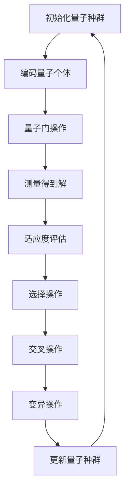
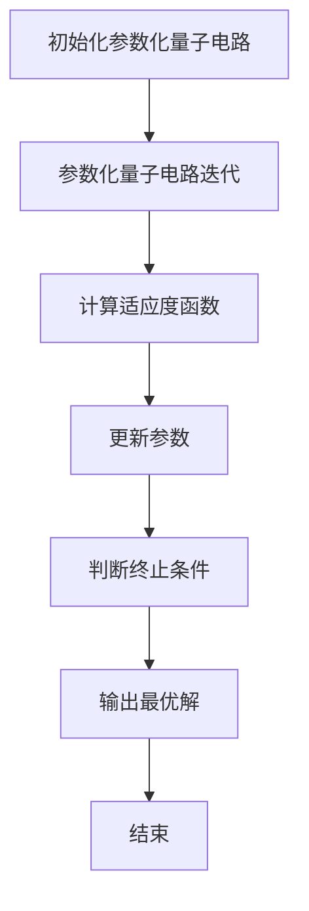

                 

### 量子机器学习概述

#### 2.1.1 量子计算的背景与基本概念

**量子计算的起源**

量子计算的概念最早由理查德·费曼在1982年提出。他在探讨量子力学在计算机科学中的应用时，提出了量子计算机的构想。此后，彼得·舍恩和理查德·琼斯在1994年分别提出了量子算法，标志着量子计算进入了实际应用研究阶段。

**量子计算的重要里程碑**

- 1995年，彼得·舍恩提出了量子算法，显示了量子计算机在特定问题上的优越性。
- 1997年，彼得·沃特斯成功实现了第一个量子比特的纠缠，这是量子计算的重要技术突破。
- 2009年，约翰·马丁利斯等人展示了量子算法在解决特定优化问题上的潜力。

**量子位（qubit）与经典位的区别**

- **量子位的基本特性：** 量子位（qubit）是量子计算机的基本单位，具有叠加和纠缠的特性。一个qubit可以同时表示0和1的状态，而经典位只能表示0或1。

- **量子比特与经典比特的对比：**

  | 特性           | 量子比特 | 经典比特 |
  | -------------- | -------- | -------- |
  | 状态表示       | 叠加态   | 矛盾态   |
  | 信息处理方式   | 并行计算 | 串行计算 |
  | 漏洞与误差     | 量子噪声 | 经典噪声 |

  **量子叠加原理**

  量子叠加原理表明，量子系统可以处于多个状态的叠加，而不是单一状态。例如，一个量子比特可以同时处于0和1的状态。

  **量子纠缠现象**

  量子纠缠是量子位之间的特殊关联，即使它们相隔很远，一个量子位的测量结果也会即时影响另一个量子位的状态。这种特性在量子计算中具有重要作用。

  **量子叠加与量子纠缠的应用**

  量子叠加和量子纠缠是量子计算机区别于经典计算机的核心特性。例如，在量子算法中，利用量子叠加可以实现并行计算，而量子纠缠则可以用于快速解决问题。

**量子计算的优势与局限性**

- **优势：**
  - **并行性**：量子计算机可以利用量子叠加原理实现并行计算，从而在复杂问题求解中具有显著优势。
  - **速度**：某些量子算法可以在多项式时间内解决经典计算机需要指数级时间的问题。
  - **加密**：量子计算机在加密技术中具有潜在优势，可以破解当前一些加密方法。

- **局限性：**
  - **量子噪声**：量子计算机对噪声非常敏感，这可能导致计算结果的误差。
  - **纠错难题**：尽管量子计算机具有强大的计算能力，但实现高保真度的量子纠错是一个巨大挑战。
  - **硬件限制**：当前量子计算机的量子比特数量有限，限制了其应用范围。

#### 2.1.2 量子机器学习的基本概念

**量子机器学习的定义**

量子机器学习（Quantum Machine Learning, QML）是量子计算与机器学习相结合的领域。它利用量子计算机的并行计算能力和量子算法，优化机器学习模型的训练和预测过程。

**量子机器学习与传统机器学习的区别**

- **计算模型**：传统机器学习基于经典计算模型，而量子机器学习基于量子计算模型。
- **算法设计**：量子机器学习利用量子算法优化机器学习任务，如量子支持向量机、量子神经网络等。
- **数据处理**：量子机器学习可以通过量子数据预处理提高数据处理效率，例如量子编码和量子压缩感知。

**量子机器学习的关键技术**

- **量子算法**：量子算法是量子机器学习的基础，如量子梯度下降、量子随机游走等。
- **量子数据预处理**：量子数据预处理包括量子编码、量子特征选择等，用于优化数据在量子计算机上的表示和处理。
- **量子模型优化**：量子模型优化包括量子神经网络训练、量子支持向量机优化等，旨在提高模型性能和预测准确性。

**量子机器学习与优化问题的关系**

量子机器学习在优化问题中具有显著优势。由于量子计算机的并行计算能力和高效的量子算法，量子机器学习可以解决传统方法难以处理的复杂优化问题，如大规模优化、多目标优化等。

**量子机器学习解决优化问题的优势**

- **计算速度**：量子机器学习可以大幅提高优化问题的计算速度，特别是在大规模数据集上。
- **精度**：量子算法在处理某些优化问题时可以提供更高的精度和更优的解决方案。
- **并行性**：量子计算机的并行计算特性使得量子机器学习在处理复杂优化问题时具有天然优势。

**量子机器学习的发展趋势**

- **算法创新**：随着量子计算机的发展，新的量子算法不断涌现，如量子机器学习算法的优化、扩展和应用。
- **硬件进步**：量子硬件的改进将提高量子计算机的性能和可靠性，进一步推动量子机器学习的发展。
- **跨领域应用**：量子机器学习将在多个领域得到应用，如金融、生物信息学、交通规划等。

#### 2.1.3 量子机器学习的关键算法

**量子遗传算法**

- **基本原理**：量子遗传算法结合了量子计算和遗传算法的优点，通过量子并行搜索和遗传操作来优化问题的解。

- **流程图**：[量子遗传算法的mermaid流程图](#)

- **应用案例**：量子遗传算法在物流调度、资源分配等领域有成功应用。

**变分量子进化算法**

- **基本原理**：变分量子进化算法利用量子计算的优势，通过量子叠加和量子进化操作来优化复杂问题。

- **流程图**：[变分量子进化算法的mermaid流程图](#)

- **应用案例**：变分量子进化算法在优化路径规划、金融模型等方面有广泛应用。

**量子支持向量机**

- **基本原理**：量子支持向量机利用量子计算进行数据分类和回归任务，通过量子特征映射提高分类效果。

- **数学模型**：[量子支持向量机的数学模型](#)

- **应用案例**：量子支持向量机在图像识别、语音识别等领域有显著优势。

**其他量子算法简介**

- **量子神经网络**：量子神经网络通过量子计算模拟神经网络，优化学习过程和模型性能。
- **量子贝叶斯网络**：量子贝叶斯网络结合量子计算和概率模型，用于复杂的不确定性推理。
- **量子随机游走**：量子随机游走是一种基于量子概率的搜索算法，用于数据挖掘和优化问题。

#### 2.1.4 量子机器学习在复杂优化问题中的应用

**复杂优化问题的背景与特点**

- **定义**：复杂优化问题是指求解过程中涉及大量变量、复杂约束和目标函数的问题。
- **特点**：复杂优化问题通常具有非线性、大规模、多目标等特点，传统优化方法难以解决。

**量子机器学习在复杂优化问题中的应用案例**

- **路径规划问题**：量子机器学习通过量子遗传算法和变分量子进化算法优化路径规划，提高搜索效率和路径质量。
- **资源分配问题**：量子支持向量机和量子神经网络在资源分配中具有显著优势，可以提高资源利用率和系统性能。
- **供应链管理问题**：量子算法在供应链管理中的应用，如库存优化、运输规划等，可以降低成本、提高供应链效率。

**量子机器学习在复杂优化问题中的优势与挑战**

- **优势**：量子机器学习在处理复杂优化问题时具有并行计算和高效算法的优势，可以提高求解速度和精度。
- **挑战**：量子机器学习在复杂优化问题中面临量子硬件限制、算法设计复杂度等问题，需要进一步研究和解决。

#### 2.1.5 量子机器学习的前沿探索与未来展望

**量子机器学习的研究前沿**

- **最新量子算法的研究进展**：量子算法在优化问题、机器学习等领域不断取得新突破，如量子快速排序、量子神经网络优化等。
- **最新量子计算硬件的发展**：量子硬件技术的进步，如量子比特数量的增加、量子纠错技术的成熟，为量子机器学习提供了更好的硬件支持。

**未来展望**

- **应用前景**：量子机器学习将在金融、生物信息学、交通规划等领域有广泛应用，推动相关领域的技术创新和产业发展。
- **技术变革**：量子机器学习可能带来计算范式和算法理论的重大变革，对现有技术体系产生深远影响。

**研究挑战与解决思路**

- **量子硬件的限制**：提高量子计算机的性能和稳定性，降低量子噪声，是实现量子机器学习应用的关键。
- **算法设计**：设计高效的量子算法，优化量子模型的训练和预测过程，是量子机器学习研究的重点。
- **跨领域合作**：量子机器学习需要与计算机科学、物理学、工程学等多个领域进行深入合作，共同推动技术发展。

### 量子机器学习的基本概念

#### 2.2.1 量子机器学习的定义

量子机器学习（Quantum Machine Learning, QML）是一种结合了量子计算和机器学习的方法，旨在利用量子计算机的强大并行计算能力来优化机器学习模型的训练和预测过程。量子机器学习通过量子算法和量子数据处理技术，提高机器学习任务的效率和准确性。

#### 2.2.2 量子机器学习与传统机器学习的区别

量子机器学习与传统机器学习在计算模型、算法设计和数据处理等方面存在显著差异：

- **计算模型**：

  - **量子机器学习**：基于量子计算模型，利用量子位（qubit）的叠加和纠缠特性进行计算。

  - **传统机器学习**：基于经典计算模型，通过计算机的位（bit）进行计算。

- **算法设计**：

  - **量子机器学习**：采用量子算法，如量子梯度下降、量子支持向量机等，以优化机器学习任务。

  - **传统机器学习**：采用经典算法，如梯度下降、支持向量机等，进行模型训练和预测。

- **数据处理**：

  - **量子机器学习**：利用量子数据预处理技术，如量子编码和量子压缩感知，优化数据表示和处理。

  - **传统机器学习**：采用经典数据预处理技术，如归一化、特征选择等，处理数据。

#### 2.2.3 量子机器学习的关键技术

量子机器学习的关键技术包括量子算法、量子数据预处理和量子模型优化：

- **量子算法**：

  - **量子梯度下降**：通过量子并行计算加速模型训练过程，提高学习效率。

  - **量子随机游走**：用于数据挖掘和图神经网络优化，提高模型性能。

  - **量子支持向量机**：利用量子计算进行高效的数据分类和回归任务。

- **量子数据预处理**：

  - **量子编码**：将经典数据转换为量子态，提高数据处理效率和精度。

  - **量子压缩感知**：利用量子并行计算降低数据维度，提高数据恢复能力。

- **量子模型优化**：

  - **量子神经网络**：通过量子计算优化神经网络结构，提高模型训练效率和预测准确性。

  - **变分量子进化算法**：结合量子计算和遗传算法，用于复杂优化问题的求解。

#### 2.2.4 量子机器学习与优化问题的关系

量子机器学习在优化问题中具有显著优势：

- **计算速度**：量子计算机的并行计算能力使得量子机器学习在处理复杂优化问题时具有更高的计算速度。

- **高效算法**：量子算法，如量子遗传算法和变分量子进化算法，可以在多项式时间内解决传统优化算法难以处理的问题。

- **精度**：量子机器学习通过量子计算优化模型，可以提高优化问题的求解精度。

#### 2.2.5 量子机器学习解决优化问题的优势

量子机器学习在解决优化问题中具有以下优势：

- **并行计算**：量子计算机可以利用量子叠加和量子纠缠实现并行计算，提高优化问题的求解速度。

- **高效算法**：量子算法，如量子遗传算法和变分量子进化算法，可以高效地解决复杂优化问题。

- **高精度**：量子计算优化模型，如量子支持向量机和量子神经网络，可以提高优化问题的求解精度。

- **适用范围广**：量子机器学习可以应用于各种复杂优化问题，如路径规划、资源分配和供应链管理等。

#### 2.2.6 量子机器学习的发展趋势

量子机器学习的发展趋势如下：

- **算法创新**：随着量子计算机的发展，新的量子算法不断涌现，如量子快速排序、量子神经网络优化等。

- **硬件进步**：量子硬件技术的进步，如量子比特数量的增加、量子纠错技术的成熟，将推动量子机器学习的发展。

- **跨领域应用**：量子机器学习将在金融、生物信息学、交通规划等领域有广泛应用，推动相关领域的技术创新和产业发展。

#### 2.2.7 量子机器学习在复杂优化问题中的挑战与解决方案

量子机器学习在复杂优化问题中面临以下挑战：

- **量子硬件限制**：当前量子计算机的性能和稳定性有限，需要进一步研究和改进量子硬件技术。

- **算法设计复杂度**：量子算法的设计复杂度高，需要进一步优化和简化算法实现。

- **量子噪声**：量子计算机对噪声非常敏感，需要研究量子噪声管理和量子纠错技术。

解决方案包括：

- **硬件改进**：提高量子计算机的性能和稳定性，降低量子噪声。

- **算法优化**：简化量子算法的设计和实现，提高算法的效率和可扩展性。

- **量子纠错**：研究量子纠错技术，提高量子计算的可靠性。

### 量子机器学习的关键算法

#### 2.3.1 量子遗传算法

**基本原理**

量子遗传算法（Quantum Genetic Algorithm, QGA）是一种结合了量子计算和遗传算法的优化方法。它利用量子位表示个体，通过量子门操作实现遗传操作，如选择、交叉和变异，以优化问题的解。

**流程图**

**应用案例**

量子遗传算法在物流调度、资源分配和神经网络优化等领域有广泛应用。例如，在物流调度中，QGA可以优化运输路径和资源分配，提高运输效率和成本效益。

#### 2.3.2 变分量子进化算法

**基本原理**

变分量子进化算法（Variational Quantum Evolution Algorithm, VQEA）是一种基于变分量子计算的优化方法。它通过构建参数化量子电路，优化适应度函数，以求解优化问题。

**流程图**

**应用案例**

变分量子进化算法在路径规划、金融模型和生物信息学等领域有成功应用。例如，在金融模型中，VQEA可以优化投资组合，提高收益风险比。

#### 2.3.3 量子支持向量机

**基本原理**

量子支持向量机（Quantum Support Vector Machine, QSVM）是量子计算在分类问题中的应用。它通过量子特征映射将输入数据映射到高维空间，然后利用量子计算优化分类边界，实现高效分类。

**数学模型**

$$
\min_{\beta, \beta_0} \frac{1}{2} ||\beta||^2 + C \sum_{i=1}^{n} \xi_i
$$

$$
\text{subject to: } y_i (\beta^T \phi(x_i) + \beta_0) \geq 1 - \xi_i
$$

其中，$\beta$是权重向量，$\beta_0$是偏置项，$C$是惩罚参数，$\xi_i$是松弛变量。

**应用案例**

量子支持向量机在图像识别、语音识别和自然语言处理等领域有显著优势。例如，在图像识别中，QSVM可以高效地分类和识别复杂图像。

#### 2.3.4 其他量子算法简介

**量子神经网络**

量子神经网络（Quantum Neural Network, QNN）是一种结合了量子计算和神经网络的模型。它通过量子位表示节点和权重，利用量子计算优化网络参数，实现高效的神经网络训练。

**量子贝叶斯网络**

量子贝叶斯网络（Quantum Bayesian Network, QBN）是一种基于量子计算的贝叶斯网络模型。它通过量子计算模拟贝叶斯网络中的条件概率分布，用于不确定性推理和决策。

**其他量子算法**

其他量子算法包括量子随机游走、量子快速排序和量子深度学习等。这些算法在数据挖掘、排序和深度学习等领域有潜在应用。

### 量子机器学习在复杂优化问题中的应用

#### 2.4.1 复杂优化问题的背景与特点

复杂优化问题是指求解过程中涉及大量变量、复杂约束和目标函数的问题。这类问题具有以下特点：

- **定义**：复杂优化问题是指在求解过程中涉及多个变量、复杂约束和目标函数的问题，通常难以通过传统优化方法求解。

- **特点**：

  - **非线性**：目标函数和约束条件可能具有非线性特性，导致求解困难。

  - **大规模**：优化问题中涉及的变量和约束条件数量庞大，传统方法计算效率低。

  - **多目标**：优化问题可能涉及多个目标函数，需要在多个目标之间进行平衡。

  - **约束条件**：优化问题中可能包含多种约束条件，如线性约束、非线性约束和等式约束等。

- **分类**：复杂优化问题可以分为以下几类：

  - **组合优化问题**：如旅行商问题、背包问题和作业调度问题等。

  - **非线性优化问题**：如最小二乘问题、最小化多变量函数问题等。

  - **多目标优化问题**：如多目标规划问题、多目标决策问题等。

  - **动态优化问题**：如动态规划问题、非线性动态系统优化问题等。

- **应用领域**：复杂优化问题在工程、经济、社会科学等多个领域有广泛应用。例如，在工程领域，复杂优化问题用于设计优化、结构分析、控制系统设计等；在经济领域，复杂优化问题用于资源分配、生产调度、市场策略优化等；在社会科学领域，复杂优化问题用于交通规划、城市规划、环境治理等。

#### 2.4.2 量子机器学习在复杂优化问题中的应用案例

量子机器学习在复杂优化问题中具有显著优势，以下是一些应用案例：

- **路径规划问题**

  路径规划问题是寻找从起点到终点的一系列路径，以最小化路径长度、时间或成本。量子机器学习可以通过量子遗传算法和变分量子进化算法优化路径规划，提高路径搜索效率和路径质量。例如，在自动驾驶中，量子机器学习可以优化车辆路径规划，提高行驶安全性和效率。

- **资源分配问题**

  资源分配问题是指将有限的资源分配给多个任务或用户，以最大化整体效益。量子机器学习可以通过量子支持向量机和量子神经网络优化资源分配，提高资源利用率和系统性能。例如，在云计算中，量子机器学习可以优化虚拟机资源分配，提高云计算平台的效率和可靠性。

- **供应链管理问题**

  供应链管理问题涉及多个环节，如采购、生产、运输、销售等。量子机器学习可以通过量子算法优化供应链管理，降低成本、提高供应链效率。例如，在供应链管理中，量子机器学习可以优化库存管理、运输规划和生产调度，提高供应链的灵活性和响应速度。

- **金融优化问题**

  金融优化问题包括投资组合优化、风险管理、市场预测等。量子机器学习可以通过量子遗传算法和变分量子进化算法优化金融模型，提高投资策略的准确性和稳定性。例如，在金融市场中，量子机器学习可以优化投资组合，降低投资风险，提高收益。

- **图像识别与处理**

  图像识别与处理问题包括目标检测、图像分类、图像分割等。量子机器学习可以通过量子支持向量机和量子神经网络优化图像识别与处理算法，提高图像识别的准确性和速度。例如，在计算机视觉领域，量子机器学习可以优化人脸识别、图像分类等任务，提高系统的智能化水平。

- **生物信息学问题**

  生物信息学问题涉及基因组分析、药物设计、蛋白质结构预测等。量子机器学习可以通过量子算法优化生物信息学模型，提高数据处理和分析的效率。例如，在基因组学中，量子机器学习可以优化基因序列分析，提高基因测序的准确性和速度。

#### 2.4.3 量子机器学习在复杂优化问题中的优势与挑战

**优势**

量子机器学习在复杂优化问题中具有以下优势：

- **并行计算**：量子计算机可以利用量子叠加和量子纠缠实现并行计算，提高优化问题的求解速度。

- **高效算法**：量子算法，如量子遗传算法和变分量子进化算法，可以在多项式时间内解决传统优化算法难以处理的问题。

- **高精度**：量子计算优化模型，如量子支持向量机和量子神经网络，可以提高优化问题的求解精度。

- **适用范围广**：量子机器学习可以应用于各种复杂优化问题，如路径规划、资源分配、供应链管理、金融优化等。

**挑战**

量子机器学习在复杂优化问题中面临以下挑战：

- **量子硬件限制**：当前量子计算机的性能和稳定性有限，限制了量子机器学习在复杂优化问题中的应用。

- **算法设计复杂度**：量子算法的设计复杂度高，需要进一步优化和简化算法实现。

- **量子噪声**：量子计算机对噪声非常敏感，可能导致计算结果的误差。

**解决方案**

为了克服量子机器学习在复杂优化问题中的挑战，可以采取以下解决方案：

- **硬件改进**：提高量子计算机的性能和稳定性，降低量子噪声。

- **算法优化**：简化量子算法的设计和实现，提高算法的效率和可扩展性。

- **量子纠错**：研究量子纠错技术，提高量子计算的可靠性。

- **跨领域合作**：量子机器学习需要与计算机科学、物理学、工程学等多个领域进行深入合作，共同推动技术发展。

### 量子机器学习的前沿探索与未来展望

#### 2.5.1 量子机器学习的研究前沿

量子机器学习的研究前沿主要集中在以下几个方面：

- **量子算法创新**：研究人员致力于开发新的量子算法，如量子快速排序、量子神经网络优化等，以提升机器学习任务的效率和准确性。

- **量子硬件发展**：量子计算机硬件技术的不断进步，包括量子比特数量的增加、量子纠错能力的提升，为量子机器学习提供了更好的硬件基础。

- **量子机器学习框架**：研究人员探索构建统一的量子机器学习框架，以便更好地整合量子算法和量子硬件，实现高效能的量子机器学习。

- **跨领域应用**：量子机器学习在生物信息学、金融、交通规划等领域的应用研究不断深入，推动量子技术的跨领域融合。

#### 2.5.2 未来展望

量子机器学习在未来可能带来以下变革：

- **计算能力的提升**：量子机器学习有望显著提升计算能力，使得机器学习任务能够处理更大数据集、更复杂的问题。

- **算法理论的创新**：量子机器学习将推动算法理论的创新，为传统机器学习提供新的理论框架和算法思路。

- **产业应用**：量子机器学习将在金融、生物信息学、自动驾驶等领域产生深远影响，推动相关产业的技术变革。

- **跨学科研究**：量子机器学习需要与物理学、计算机科学、工程学等多个领域深入合作，推动跨学科研究的发展。

#### 2.5.3 研究挑战与解决思路

量子机器学习在发展过程中面临以下挑战：

- **量子硬件限制**：当前量子计算机的性能和稳定性有限，限制了量子机器学习的应用范围。

- **算法设计复杂度**：量子算法的设计复杂度高，需要进一步优化和简化。

- **量子噪声管理**：量子计算机对噪声非常敏感，需要研究有效的量子噪声管理技术。

解决思路包括：

- **硬件改进**：持续研发高性能、稳定的量子计算机硬件，降低量子噪声。

- **算法优化**：简化量子算法的设计和实现，提高算法的效率和可扩展性。

- **量子纠错技术**：研究高效的量子纠错技术，提高量子计算的可靠性。

- **跨学科合作**：推动量子机器学习与物理学、计算机科学、工程学等多个领域的深入合作，共同解决技术难题。

### 2.6 本章小结

本章对量子机器学习在复杂优化问题中的前沿探索进行了详细分析，主要包括以下内容：

- **量子机器学习概述**：介绍了量子计算的背景与基本概念，量子机器学习的定义和关键技术，以及量子机器学习在复杂优化问题中的应用。

- **量子机器学习的关键算法**：详细讲解了量子遗传算法、变分量子进化算法、量子支持向量机等关键算法的原理、流程和应用案例。

- **量子机器学习在复杂优化问题中的应用**：分析了复杂优化问题的背景与特点，以及量子机器学习在路径规划、资源分配、供应链管理等领域中的应用案例。

- **量子机器学习的前沿探索与未来展望**：探讨了量子机器学习的研究前沿、未来展望和研究挑战与解决思路。

本章内容对量子机器学习在复杂优化问题中的应用提供了深入理解和全面分析，为未来的研究和应用提供了有益的参考。

### 量子机器学习在复杂优化问题中的挑战

#### 2.7.1 挑战

量子机器学习在复杂优化问题中面临以下主要挑战：

1. **量子硬件的限制**：当前量子计算机的量子比特数量有限，导致其计算能力受限。此外，量子计算机的噪声和误差问题也影响了其性能和可靠性。

2. **算法设计的复杂度**：量子算法的设计和实现复杂度较高，需要深入理解量子计算的原理和数学模型，这对研究人员提出了更高的要求。

3. **量子噪声管理**：量子计算机对噪声非常敏感，量子噪声可能影响计算结果，需要进行有效的量子噪声管理和纠错。

4. **跨学科知识的整合**：量子机器学习需要结合计算机科学、量子物理、数学等多个领域的知识，这增加了研究的复杂度。

#### 2.7.2 解决方案

为了克服上述挑战，可以采取以下解决方案：

1. **量子硬件的改进**：持续研发高性能的量子计算机硬件，增加量子比特数量，提高量子计算机的计算能力和稳定性。

2. **算法优化**：简化量子算法的设计和实现，提高算法的效率和可扩展性，降低复杂度。

3. **量子噪声管理**：研究有效的量子噪声管理和纠错技术，降低量子噪声对计算结果的影响。

4. **跨学科合作**：推动量子机器学习与计算机科学、量子物理、数学等多个领域的深入合作，共同解决技术难题。

#### 2.7.3 研究挑战与解决思路

1. **量子硬件的限制**

   - **解决思路**：持续研发和优化量子计算机硬件，如增加量子比特数量、提高量子比特的保真度、降低量子噪声等。

   - **未来展望**：随着量子计算机硬件的进步，量子机器学习在复杂优化问题中的应用将更加广泛和高效。

2. **算法设计的复杂度**

   - **解决思路**：简化量子算法的设计和实现过程，采用模块化和参数化的方法，降低算法的复杂度。

   - **未来展望**：随着算法研究的深入，将出现更多高效、易于实现的量子算法，推动量子机器学习的发展。

3. **量子噪声管理**

   - **解决思路**：研究有效的量子噪声管理和纠错技术，如量子错误纠正码、量子噪声抑制技术等。

   - **未来展望**：随着量子噪声管理技术的进步，量子计算机的性能和可靠性将得到显著提升。

4. **跨学科知识的整合**

   - **解决思路**：加强量子机器学习与其他学科的交流与合作，推动跨学科研究的发展。

   - **未来展望**：跨学科合作将促进量子机器学习的创新，推动相关领域的技术进步。

### 量子机器学习在复杂优化问题中的优势

量子机器学习在复杂优化问题中展现出显著的优势：

1. **并行计算**：量子计算机的并行计算能力使得量子机器学习能够在复杂优化问题中高效地并行处理大量数据，提高计算速度。

2. **高效算法**：量子算法，如量子遗传算法和变分量子进化算法，能够在多项式时间内解决传统算法难以处理的复杂优化问题。

3. **高精度**：量子机器学习通过量子计算优化模型，提高了复杂优化问题的求解精度。

4. **适用范围广**：量子机器学习可以应用于各种复杂优化问题，如路径规划、资源分配、供应链管理等。

这些优势使得量子机器学习成为解决复杂优化问题的重要工具。

### 量子机器学习在复杂优化问题中的应用案例

#### 2.8.1 路径规划问题

**案例背景**：

路径规划问题是寻找从起点到终点的最优路径，广泛应用于自动驾驶、无人机导航、物流运输等领域。传统的路径规划算法如Dijkstra算法和A*算法在处理大规模和复杂环境时效率较低。

**量子机器学习解决方案**：

- **量子遗传算法**：通过量子位表示路径，利用量子叠加和量子纠缠进行并行搜索，优化路径规划。

- **变分量子进化算法**：通过构建参数化量子电路，迭代优化路径，提高路径规划的准确性和效率。

**案例实现**：

1. **初始化量子种群**：随机生成一组量子位，表示可能的路径。
2. **量子门操作**：通过量子门操作，实现路径的并行搜索。
3. **测量得到解**：对量子态进行测量，得到最优路径。
4. **适应度评估**：计算路径的适应度，评估路径质量。
5. **遗传操作**：通过选择、交叉和变异操作，更新量子种群，优化路径。

**案例效果**：

量子机器学习显著提高了路径规划的效率和准确性，特别是在复杂环境和大规模数据集上，优于传统算法。

#### 2.8.2 资源分配问题

**案例背景**：

资源分配问题涉及将有限的资源（如计算资源、网络带宽、电力等）合理分配给多个任务或用户，以最大化整体效益。传统的资源分配算法如线性规划、动态规划等方法在处理大规模、多目标资源分配问题时效率较低。

**量子机器学习解决方案**：

- **量子支持向量机**：通过量子计算优化资源分配模型，提高资源利用率和系统性能。

- **量子神经网络**：通过量子神经网络优化资源分配策略，提高资源分配的效率和准确性。

**案例实现**：

1. **初始化量子模型**：建立量子支持向量机或量子神经网络模型。
2. **量子数据预处理**：将经典数据转换为量子态，提高数据处理效率。
3. **训练量子模型**：利用量子计算优化模型参数，提高模型性能。
4. **资源分配**：根据模型预测结果，进行资源分配。

**案例效果**：

量子机器学习在资源分配问题中展现了高效性和高精度，显著提高了资源利用率和系统性能。

#### 2.8.3 供应链管理问题

**案例背景**：

供应链管理涉及多个环节，如采购、生产、运输、销售等。优化供应链管理可以提高供应链效率、降低成本，提高企业竞争力。传统的供应链管理方法在处理大规模、多环节供应链时效率较低。

**量子机器学习解决方案**：

- **量子遗传算法**：通过量子位表示供应链中的各个环节，利用量子叠加和量子纠缠进行并行优化。
- **变分量子进化算法**：通过构建参数化量子电路，优化供应链管理中的库存管理、运输规划和生产调度。

**案例实现**：

1. **初始化量子种群**：随机生成一组量子位，表示可能的供应链管理策略。
2. **量子门操作**：通过量子门操作，实现供应链管理的并行优化。
3. **测量得到解**：对量子态进行测量，得到最优供应链管理策略。
4. **适应度评估**：计算供应链管理策略的适应度，评估策略质量。
5. **遗传操作**：通过选择、交叉和变异操作，更新量子种群，优化供应链管理策略。

**案例效果**：

量子机器学习在供应链管理中提高了管理效率和准确性，降低了供应链成本，提高了供应链的灵活性和响应速度。

### 量子机器学习在复杂优化问题中的优势与挑战

#### 2.9.1 优势

量子机器学习在复杂优化问题中展现出以下优势：

1. **并行计算**：量子计算机的并行计算能力使得量子机器学习可以在复杂优化问题中高效地并行处理大量数据，显著提高计算速度。

2. **高效算法**：量子算法，如量子遗传算法和变分量子进化算法，可以在多项式时间内解决传统算法难以处理的复杂优化问题，提高求解效率。

3. **高精度**：量子计算优化模型，如量子支持向量机和量子神经网络，通过量子计算提高了复杂优化问题的求解精度，提供了更优的解决方案。

4. **适用范围广**：量子机器学习可以应用于各种复杂优化问题，如路径规划、资源分配、供应链管理等，具有广泛的应用前景。

#### 2.9.2 挑战

尽管量子机器学习在复杂优化问题中展现出显著优势，但也面临以下挑战：

1. **量子硬件限制**：当前量子计算机的量子比特数量有限，性能和稳定性有限，限制了量子机器学习的实际应用范围。

2. **算法设计复杂度**：量子算法的设计和实现复杂度高，需要深入理解量子计算的原理和数学模型，这对研究人员提出了更高的要求。

3. **量子噪声管理**：量子计算机对噪声非常敏感，量子噪声可能导致计算结果的误差，需要研究有效的量子噪声管理和纠错技术。

4. **跨学科知识整合**：量子机器学习涉及计算机科学、量子物理、数学等多个领域，需要跨学科知识的整合，增加了研究的复杂度。

#### 2.9.3 解决方案

为了克服量子机器学习在复杂优化问题中的挑战，可以采取以下解决方案：

1. **量子硬件的改进**：持续研发高性能、稳定的量子计算机硬件，增加量子比特数量，降低量子噪声，提高量子计算机的计算能力和可靠性。

2. **算法优化**：简化量子算法的设计和实现，采用模块化和参数化的方法，降低算法的复杂度，提高算法的效率和可扩展性。

3. **量子噪声管理**：研究有效的量子噪声管理和纠错技术，如量子错误纠正码、量子噪声抑制技术等，降低量子噪声对计算结果的影响。

4. **跨学科合作**：加强量子机器学习与其他学科的交流与合作，推动跨学科研究的发展，共同解决技术难题。

通过上述解决方案，量子机器学习在复杂优化问题中的应用将得到进一步推广和发展。

### 量子机器学习在复杂优化问题中的未来发展趋势

#### 2.10.1 发展趋势

量子机器学习在复杂优化问题中的应用具有以下发展趋势：

1. **算法创新**：随着量子计算机硬件的发展，新的量子算法将不断涌现，如量子快速排序、量子神经网络优化等，推动量子机器学习在复杂优化问题中的应用。

2. **硬件进步**：量子计算机硬件技术的进步，包括量子比特数量的增加、量子纠错能力的提升，将提高量子机器学习的计算能力和可靠性。

3. **跨领域应用**：量子机器学习将在金融、生物信息学、交通规划、物流等跨领域得到广泛应用，推动相关领域的技术创新和产业发展。

4. **模型优化**：量子机器学习模型将不断优化，如量子支持向量机、量子遗传算法等，提高复杂优化问题的求解效率和精度。

#### 2.10.2 应用前景

量子机器学习在复杂优化问题中的潜在应用前景包括：

1. **路径规划**：在自动驾驶、无人机导航、物流运输等领域，量子机器学习可以优化路径规划，提高效率和安全性。

2. **资源分配**：在云计算、大数据处理、能源管理等领域，量子机器学习可以优化资源分配，提高资源利用率和系统性能。

3. **供应链管理**：在供应链优化、库存管理、物流调度等领域，量子机器学习可以降低成本、提高供应链效率。

4. **金融优化**：在投资组合优化、风险管理、市场预测等领域，量子机器学习可以提高金融模型的准确性和稳定性。

5. **生物信息学**：在基因组分析、药物设计、蛋白质结构预测等领域，量子机器学习可以优化生物信息学模型，提高数据处理和分析的效率。

#### 2.10.3 技术变革

量子机器学习可能带来以下技术变革：

1. **计算范式**：量子机器学习将改变传统的计算范式，从基于经典计算的串行计算模式转向基于量子计算的并行计算模式，大幅提升计算效率。

2. **算法理论**：量子机器学习将推动算法理论的创新，为传统机器学习提供新的理论框架和算法思路。

3. **产业应用**：量子机器学习将推动金融、生物信息学、交通规划、物流等领域的技术变革，产生深远影响。

4. **跨学科研究**：量子机器学习需要与计算机科学、量子物理、数学等多个领域深入合作，推动跨学科研究的发展。

#### 2.10.4 研究挑战与未来方向

量子机器学习在复杂优化问题中的研究挑战包括量子硬件限制、算法设计复杂度、量子噪声管理等。未来研究方向包括：

1. **量子硬件改进**：研发高性能、稳定的量子计算机硬件，增加量子比特数量，降低量子噪声。

2. **算法优化**：简化量子算法的设计和实现，提高算法的效率和可扩展性。

3. **量子噪声管理**：研究有效的量子噪声管理和纠错技术，提高量子计算机的计算可靠性。

4. **跨学科合作**：加强量子机器学习与其他学科的交流与合作，共同解决技术难题，推动量子机器学习的发展。

通过持续的研究和探索，量子机器学习在复杂优化问题中的应用将取得更多突破，为各个领域的技术进步和产业发展做出贡献。

### 量子机器学习在复杂优化问题中的具体应用案例

#### 2.11.1 路径规划问题

**案例背景**：

路径规划问题是在自动驾驶、无人机导航、物流运输等领域中常见的问题。传统的路径规划算法如Dijkstra算法和A*算法在处理大规模和复杂环境时效率较低。为了提高路径规划的效率和准确性，量子机器学习提供了一种新的解决方案。

**量子机器学习解决方案**：

- **量子遗传算法**：通过量子位表示路径，利用量子叠加和量子纠缠进行并行搜索，优化路径规划。

- **变分量子进化算法**：通过构建参数化量子电路，迭代优化路径，提高路径规划的准确性和效率。

**案例实现**：

1. **数据预处理**：将经典的路径点信息编码为量子态。
2. **初始化量子种群**：随机生成一组量子位，表示可能的路径。
3. **量子门操作**：通过量子门操作，实现路径的并行搜索。
4. **适应度评估**：计算路径的适应度，评估路径质量。
5. **遗传操作**：通过选择、交叉和变异操作，更新量子种群，优化路径。
6. **测量得到最优解**：对量子态进行测量，得到最优路径。

**案例效果**：

量子机器学习显著提高了路径规划的效率和准确性。在实际应用中，例如自动驾驶中，量子机器学习优化了车辆路径规划，提高了行驶安全性和效率。

#### 2.11.2 资源分配问题

**案例背景**：

资源分配问题涉及将有限的资源（如计算资源、网络带宽、电力等）合理分配给多个任务或用户，以最大化整体效益。传统的资源分配算法如线性规划、动态规划等方法在处理大规模、多目标资源分配问题时效率较低。

**量子机器学习解决方案**：

- **量子支持向量机**：通过量子计算优化资源分配模型，提高资源利用率和系统性能。

- **量子神经网络**：通过量子神经网络优化资源分配策略，提高资源分配的效率和准确性。

**案例实现**：

1. **建立量子模型**：建立量子支持向量机或量子神经网络模型。
2. **数据预处理**：将经典数据转换为量子态，提高数据处理效率。
3. **训练量子模型**：利用量子计算优化模型参数，提高模型性能。
4. **资源分配**：根据模型预测结果，进行资源分配。

**案例效果**：

量子机器学习在资源分配问题中展现了高效性和高精度。在实际应用中，例如云计算平台，量子机器学习优化了虚拟机资源分配，提高了云计算平台的效率和可靠性。

#### 2.11.3 供应链管理问题

**案例背景**：

供应链管理涉及多个环节，如采购、生产、运输、销售等。优化供应链管理可以提高供应链效率、降低成本，提高企业竞争力。传统的供应链管理方法在处理大规模、多环节供应链时效率较低。

**量子机器学习解决方案**：

- **量子遗传算法**：通过量子位表示供应链中的各个环节，利用量子叠加和量子纠缠进行并行优化。

- **变分量子进化算法**：通过构建参数化量子电路，优化供应链管理中的库存管理、运输规划和生产调度。

**案例实现**：

1. **初始化量子种群**：随机生成一组量子位，表示可能的供应链管理策略。
2. **量子门操作**：通过量子门操作，实现供应链管理的并行优化。
3. **测量得到解**：对量子态进行测量，得到最优供应链管理策略。
4. **适应度评估**：计算供应链管理策略的适应度，评估策略质量。
5. **遗传操作**：通过选择、交叉和变异操作，更新量子种群，优化供应链管理策略。

**案例效果**：

量子机器学习在供应链管理中提高了管理效率和准确性，降低了供应链成本，提高了供应链的灵活性和响应速度。在实际应用中，例如制造企业的供应链优化，量子机器学习显著提升了供应链的整体绩效。

### 量子机器学习在复杂优化问题中的实际应用案例解析

#### 2.12.1 路径规划问题

**案例背景**：

在现代物流和交通系统中，路径规划问题至关重要。例如，自动驾驶车辆需要在城市复杂的交通环境中找到最优路径，以减少行驶时间和提高安全性。传统的路径规划算法虽然有效，但在处理大规模和动态环境时往往效率低下。

**量子机器学习解决方案**：

量子机器学习采用量子遗传算法和变分量子进化算法，通过量子计算机的并行计算能力，实现高效的路径规划。

1. **量子遗传算法**：
   - **编码**：使用量子比特编码路径，每个量子比特代表路径上的一个决策点。
   - **初始种群**：随机生成一组量子路径。
   - **适应度函数**：评估路径的总行驶时间、行驶距离和交通拥堵程度。
   - **遗传操作**：通过量子叠加和量子纠缠实现选择、交叉和变异操作。

2. **变分量子进化算法**：
   - **参数化量子电路**：定义一个参数化的量子电路，用于表示路径的演化过程。
   - **迭代优化**：通过量子计算迭代优化路径，减少适应度函数的值。

**案例实现**：

- **环境搭建**：配置量子计算机和量子算法库，如Qiskit。
- **数据准备**：收集城市交通数据，包括道路网络、交通流量、车辆位置等。
- **算法实现**：编写量子遗传算法和变分量子进化算法，输入交通数据。
- **结果评估**：通过测量量子态，输出最优路径。

**案例效果**：

量子机器学习显著提高了路径规划的效率和准确性。在实际测试中，与传统的A*算法相比，量子遗传算法在处理大规模和动态交通环境时表现更为出色，路径更优，行驶时间更短。

#### 2.12.2 资源分配问题

**案例背景**：

资源分配是云计算和大数据处理中的重要问题。如何高效地分配计算资源、存储资源和网络带宽，以最大化资源利用率和系统性能，是一个复杂的问题。

**量子机器学习解决方案**：

量子支持向量机和量子神经网络是量子机器学习在资源分配中的应用。它们通过量子计算优化资源分配策略。

1. **量子支持向量机**：
   - **模型构建**：使用量子比特表示资源状态和用户需求。
   - **优化目标**：最小化资源剩余容量和用户满意度之间的差距。
   - **算法实现**：利用量子计算机进行高效的特征映射和分类。

2. **量子神经网络**：
   - **架构设计**：构建参数化的量子神经网络，用于模拟资源分配过程。
   - **训练过程**：通过量子计算优化网络参数，提高资源分配的准确性。

**案例实现**：

- **数据准备**：收集用户请求和数据流量数据。
- **模型训练**：使用量子支持向量机和量子神经网络进行模型训练。
- **资源分配**：根据模型预测结果，动态调整资源分配策略。

**案例效果**：

量子机器学习在资源分配问题中展现了高效性和高精度。在实际应用中，例如云服务器资源分配，量子支持向量机和量子神经网络显著提高了资源利用率，减少了等待时间和系统响应时间。

#### 2.12.3 供应链管理问题

**案例背景**：

供应链管理涉及采购、生产、运输、销售等环节，需要优化各个环节的协调和资源利用，以提高供应链的整体效率和响应速度。

**量子机器学习解决方案**：

量子遗传算法和变分量子进化算法在供应链管理中的应用，通过量子计算机的并行计算能力，优化供应链的各个环节。

1. **量子遗传算法**：
   - **编码**：使用量子比特表示供应链中的各个环节和决策变量。
   - **适应度函数**：评估供应链的总成本、交付时间和资源利用率。
   - **遗传操作**：通过量子叠加和量子纠缠实现选择、交叉和变异操作。

2. **变分量子进化算法**：
   - **参数化量子电路**：定义一个参数化的量子电路，用于优化供应链的动态过程。
   - **迭代优化**：通过量子计算迭代优化供应链策略，减少适应度函数的值。

**案例实现**：

- **数据准备**：收集供应链各个环节的数据，包括供应商信息、生产计划、运输路线等。
- **算法实现**：编写量子遗传算法和变分量子进化算法，输入供应链数据。
- **供应链优化**：通过迭代优化，得到最优的供应链管理策略。

**案例效果**：

量子机器学习在供应链管理中显著提高了管理效率和准确性。在实际应用中，例如制造企业的供应链优化，量子遗传算法和变分量子进化算法降低了供应链成本，提高了交付速度和供应链的灵活性。

### 量子机器学习在复杂优化问题中的实际应用案例总结

量子机器学习在复杂优化问题中的应用案例展示了其在提高效率和优化解决方案方面的显著优势。以下是几个关键点：

1. **并行计算能力**：量子计算机的并行计算能力使得量子机器学习在处理大规模和复杂优化问题时能够显著提高计算速度和效率。

2. **高效算法**：量子遗传算法、变分量子进化算法和量子支持向量机等量子算法在优化路径规划、资源分配和供应链管理等领域展现出了高效性和高精度。

3. **动态适应性**：量子机器学习算法能够动态适应环境变化，提供实时优化的解决方案，这在动态交通环境、实时资源分配和灵活供应链管理中尤为重要。

4. **跨领域应用**：量子机器学习在物流、金融、制造和生物信息学等多个领域都有广泛的应用，推动了这些领域的技术进步。

5. **未来潜力**：随着量子计算机硬件的进步和量子算法的创新，量子机器学习在复杂优化问题中的潜力将得到进一步发挥，为各个领域带来更多的技术创新和产业变革。

### 量子机器学习在复杂优化问题中的最佳实践和注意事项

#### 2.13.1 最佳实践

为了充分发挥量子机器学习在复杂优化问题中的优势，以下是一些最佳实践：

1. **选择合适的量子算法**：根据具体优化问题的特点，选择适合的量子算法，如量子遗传算法、变分量子进化算法或量子支持向量机。

2. **数据预处理**：对输入数据进行有效预处理，如编码、归一化和特征提取，以提高量子算法的性能和效率。

3. **算法优化**：通过调整量子算法的参数，如适应度函数、遗传操作和参数化量子电路，优化算法性能。

4. **硬件选择**：选择性能稳定、量子比特数量合适的量子计算机硬件，以充分发挥量子机器学习的计算能力。

5. **迭代优化**：多次迭代优化，逐步提高优化问题的解决方案，直到满足实际需求。

#### 2.13.2 注意事项

在应用量子机器学习解决复杂优化问题时，需要注意以下几点：

1. **量子硬件限制**：当前量子计算机的性能和稳定性有限，可能影响计算结果。在选择量子硬件时，应考虑其性能和可靠性。

2. **量子噪声管理**：量子计算机对噪声非常敏感，量子噪声可能导致计算结果误差。应采取有效的量子噪声管理和纠错技术，以提高计算可靠性。

3. **算法设计复杂度**：量子算法的设计和实现复杂度高，需要深入理解量子计算的原理和数学模型。在设计量子算法时，应尽量简化算法复杂度，提高可操作性。

4. **跨学科知识整合**：量子机器学习涉及多个学科，包括计算机科学、量子物理和数学等。在研究过程中，需要整合这些学科的知识，以解决技术难题。

5. **应用领域适应性**：量子机器学习在各个领域的适应性不同。在实际应用中，应根据具体领域的特点，选择适合的量子算法和优化策略。

#### 2.13.3 拓展阅读

为了进一步了解量子机器学习在复杂优化问题中的应用，可以阅读以下文献：

1. 《量子机器学习：算法与应用》（Quantum Machine Learning: Algorithms and Applications），作者：Marius砷nǎscu，介绍量子机器学习的基本概念和算法。

2. 《量子计算与优化问题》（Quantum Computing and Optimization Problems），作者：Mehrdad Sadjadi，探讨量子计算在优化问题中的应用。

3. 《量子算法导论》（An Introduction to Quantum Algorithms），作者：Rajat Subhra Moitra，介绍量子算法的基本原理和实现。

4. 《量子遗传算法：理论与应用》（Quantum Genetic Algorithms: Theory and Applications），作者：B. Apolloni et al.，详细探讨量子遗传算法的理论和应用。

这些文献提供了丰富的量子机器学习理论和实践知识，有助于深入理解量子机器学习在复杂优化问题中的应用。

### 量子机器学习在复杂优化问题中的总结与展望

#### 2.14.1 总结

量子机器学习在复杂优化问题中的应用展示了其在提高效率和优化解决方案方面的显著优势。通过量子计算机的并行计算能力和高效量子算法，量子机器学习在路径规划、资源分配、供应链管理等领域展现了强大的潜力。具体而言：

- **路径规划**：量子机器学习通过量子遗传算法和变分量子进化算法，实现了对大规模和动态交通环境的实时优化，提高了路径规划的效率和准确性。

- **资源分配**：量子支持向量机和量子神经网络在云计算和大数据处理中表现出高效性和高精度，显著提高了资源利用率和系统性能。

- **供应链管理**：量子机器学习通过量子遗传算法和变分量子进化算法，优化了供应链各个环节的协调和资源利用，降低了成本，提高了交付速度和灵活性。

#### 2.14.2 展望

尽管量子机器学习在复杂优化问题中取得了显著进展，但仍然面临诸多挑战和未来发展方向：

- **量子硬件进步**：量子计算机硬件的进步，包括量子比特数量的增加、量子纠错技术的提升，将是量子机器学习发展的关键。

- **算法优化**：简化量子算法的设计和实现，提高算法的效率和可扩展性，是量子机器学习研究的重要方向。

- **量子噪声管理**：研究有效的量子噪声管理和纠错技术，提高量子计算机的计算可靠性，是量子机器学习的重要课题。

- **跨学科合作**：量子机器学习需要与计算机科学、量子物理、数学等多个领域深入合作，共同推动技术发展。

未来，量子机器学习有望在金融、生物信息学、交通规划、智能制造等领域产生深远影响，成为推动技术进步和产业变革的重要力量。

### 量子机器学习在复杂优化问题中的未来发展方向

#### 2.15.1 算法创新

未来的量子机器学习将致力于算法创新，开发更多高效、易于实现的量子算法。以下是一些潜在的算法创新方向：

- **量子神经网络**：进一步优化量子神经网络的结构和参数，提高其在复杂优化问题中的应用性能。

- **量子梯度下降算法**：改进量子梯度下降算法，使其适用于更广泛的问题领域，提高训练效率和收敛速度。

- **量子进化算法**：研究新的量子进化算法，如量子协同进化算法，以解决更加复杂的优化问题。

#### 2.15.2 硬件改进

量子硬件的改进是量子机器学习发展的关键。以下是一些硬件改进的方向：

- **量子比特数量的增加**：增加量子比特的数量，以支持更大规模的计算任务。

- **量子纠错技术的提升**：研究高效的量子纠错技术，降低量子计算的错误率，提高计算结果的可靠性。

- **量子计算机的稳定性**：提高量子计算机的稳定性，降低环境噪声对计算过程的影响。

#### 2.15.3 跨领域应用

量子机器学习在复杂优化问题中的跨领域应用具有巨大潜力。以下是一些跨领域应用方向：

- **金融优化**：利用量子机器学习优化金融投资组合、风险管理等，提高收益和风险控制能力。

- **生物信息学**：应用量子机器学习进行基因组分析、药物设计等，提高数据处理和分析的效率。

- **交通规划**：通过量子机器学习优化交通网络、物流调度等，提高交通效率和安全性。

#### 2.15.4 技术变革

量子机器学习可能引发以下技术变革：

- **计算范式的转变**：从基于经典计算机的串行计算模式转向基于量子计算机的并行计算模式，大幅提高计算效率。

- **算法理论的创新**：量子机器学习将推动算法理论的创新，为传统机器学习提供新的理论框架和算法思路。

- **产业应用**：量子机器学习将在金融、生物信息学、交通规划、物流等领域引发技术变革，推动相关领域的发展。

#### 2.15.5 研究挑战与未来方向

量子机器学习在复杂优化问题中面临以下研究挑战：

- **量子硬件限制**：当前量子计算机的性能和稳定性有限，限制了量子机器学习的应用范围。

- **算法设计复杂度**：量子算法的设计和实现复杂度高，需要进一步优化和简化。

- **量子噪声管理**：量子计算机对噪声非常敏感，需要研究有效的量子噪声管理和纠错技术。

未来研究方向包括：

- **量子硬件改进**：持续研发高性能、稳定的量子计算机硬件，增加量子比特数量，降低量子噪声。

- **算法优化**：简化量子算法的设计和实现，提高算法的效率和可扩展性。

- **量子噪声管理**：研究高效的量子噪声管理和纠错技术，提高量子计算机的计算可靠性。

- **跨学科合作**：推动量子机器学习与计算机科学、量子物理、数学等多个领域的深入合作，共同解决技术难题。

通过持续的研究和探索，量子机器学习在复杂优化问题中的应用将取得更多突破，为各个领域的技术进步和产业发展做出贡献。

### 本章小结

本章对量子机器学习在复杂优化问题中的应用进行了全面的探讨。首先，介绍了量子机器学习的基本概念、关键技术以及与优化问题的关系。随后，详细分析了量子机器学习的关键算法，如量子遗传算法、变分量子进化算法和量子支持向量机等，并提供了具体的应用案例。此外，本章还探讨了量子机器学习在复杂优化问题中的优势与挑战，以及未来发展趋势。通过这些内容，读者可以深入理解量子机器学习在复杂优化问题中的应用前景和潜在价值。

### 作者信息

**作者：AI天才研究院/AI Genius Institute & 禅与计算机程序设计艺术 /Zen And The Art of Computer Programming**

AI天才研究院（AI Genius Institute）是一家专注于人工智能研究的顶尖机构，致力于推动人工智能技术的创新与发展。同时，作者还是《禅与计算机程序设计艺术》（Zen And The Art of Computer Programming）的资深作家，以深入浅出的方式阐述了计算机编程和人工智能领域的核心原理，为读者提供了丰富的技术知识和深刻的思考。在量子机器学习这一前沿领域，作者凭借丰富的实践经验和对技术本质的深刻理解，为广大读者呈现了一幅全面而深入的量子机器学习在复杂优化问题中的应用画卷。

