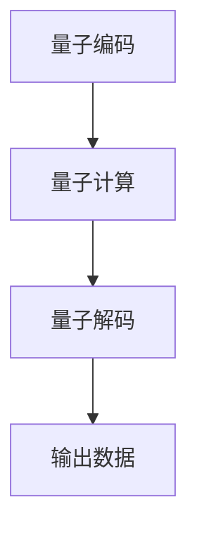
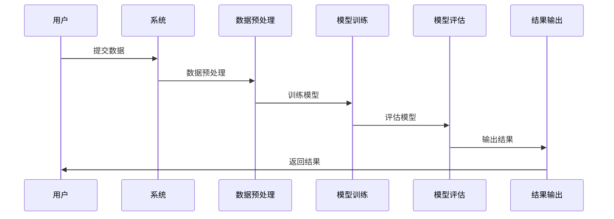
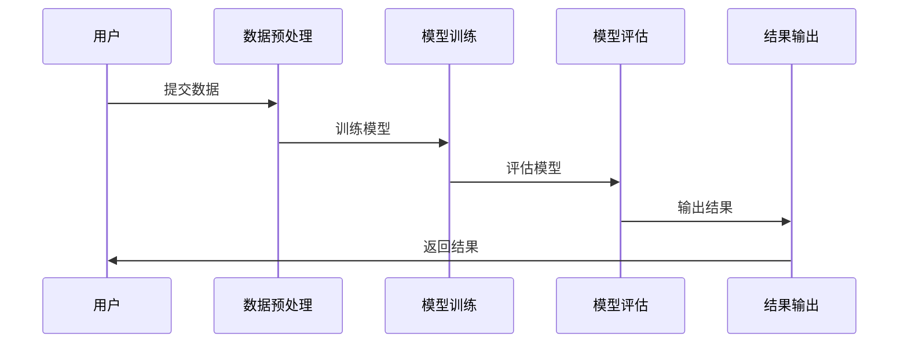

                 


### # 量子机器学习在材料科学中的前沿应用

关键词：量子机器学习，材料科学，算法，数学模型，系统架构，项目实战

摘要：随着量子计算技术的飞速发展，量子机器学习（QML）成为了解决复杂材料科学问题的有力工具。本文将详细介绍量子机器学习在材料科学中的前沿应用，包括其核心概念、算法原理、数学模型、系统架构以及实际项目应用，帮助读者全面理解这一领域的最新进展。

### 1. 背景介绍

#### 1.1 量子机器学习在材料科学中的应用背景

量子计算和材料科学是两个看似独立的领域，但近年来，随着量子计算技术的突破，量子机器学习（Quantum Machine Learning，QML）开始逐渐在材料科学中崭露头角。量子计算利用量子位（qubit）的叠加态和纠缠态，进行高效的计算，而材料科学则涉及到材料的结构和性质，如电子结构、晶体结构等。这种跨学科的结合，使得量子机器学习成为解决材料科学复杂问题的有效手段。

#### 1.2 量子计算和材料科学的快速发展

量子计算技术的快速发展，为量子机器学习提供了基础。近年来，谷歌、IBM、微软等科技巨头纷纷投入巨资研发量子计算机，量子位的数量也在不断增加。与此同时，材料科学领域也取得了显著进展，如新型材料的发现、材料合成技术的提高等。这些进步为量子机器学习在材料科学中的应用奠定了基础。

#### 1.3 量子机器学习与传统机器学习的区别和优势

量子机器学习与传统机器学习相比，具有以下几个优势：

1. **并行计算能力**：量子计算机能够同时处理多个任务，具有并行计算的能力，这使得量子机器学习在处理复杂材料科学问题时，具有更高的效率。

2. **解决非线性问题**：量子机器学习能够处理复杂的非线性问题，如材料结构的优化、量子化学计算等，而传统机器学习在这些方面往往力不从心。

3. **高通量计算**：量子机器学习能够实现高通量计算，即同时处理大量的数据，这对于材料科学中的大规模实验和数据分析具有重要意义。

#### 1.4 为何材料科学需要量子机器学习

材料科学的复杂性和多样性，使得传统机器学习在面对一些问题时显得力不从心。而量子机器学习则能够利用量子计算的优势，解决传统机器学习难以克服的问题，如：

1. **材料合成与优化**：量子机器学习能够预测材料合成过程中的化学反应，优化合成路径，提高材料性能。

2. **材料性质预测**：量子机器学习能够预测材料的电子结构、光学性质等，为材料设计和应用提供重要参考。

3. **材料缺陷分析**：量子机器学习能够分析材料中的缺陷结构，为材料优化提供科学依据。

综上所述，量子机器学习在材料科学中具有广泛的应用前景，成为解决复杂材料科学问题的重要工具。

### 2. 核心概念与联系

#### 2.1 量子计算的基本原理和量子位（qubit）的定义

量子计算是利用量子位（qubit）进行信息编码和处理的一种计算模型。量子位与传统计算机中的比特不同，它不仅可以表示0和1的叠加态，还可以实现量子纠缠，从而实现高效的计算。量子计算的基本原理包括量子叠加、量子纠缠和量子测量。

#### 2.2 材料科学的常见问题和挑战

材料科学面临的一些常见问题和挑战包括：

1. **材料合成路径优化**：如何高效地合成新材料，优化合成路径。

2. **材料性质预测**：如何预测材料的电子结构、光学性质等。

3. **材料缺陷分析**：如何分析材料中的缺陷结构，为材料优化提供科学依据。

#### 2.3 量子机器学习在材料科学中的应用

量子机器学习在材料科学中的应用主要表现在以下几个方面：

1. **材料合成路径优化**：利用量子机器学习预测化学反应路径，优化合成路径。

2. **材料性质预测**：利用量子机器学习预测材料的电子结构、光学性质等。

3. **材料缺陷分析**：利用量子机器学习分析材料中的缺陷结构，为材料优化提供科学依据。

通过量子计算和材料科学的结合，量子机器学习成为解决复杂材料科学问题的有力工具。

### 3. 算法原理讲解

#### 3.1 量子机器学习算法的基本框架和原理

量子机器学习算法基于量子计算的基本原理，利用量子位（qubit）进行信息编码和处理。其基本框架包括：

1. **量子编码**：将输入数据编码到量子位上。

2. **量子计算**：利用量子计算处理数据，包括量子变换、量子测量等。

3. **量子解码**：将量子计算的结果解码为输出数据。

#### 3.2 使用mermaid画出算法流程图



#### 3.3 使用Python源代码和数学模型详细阐述算法

```python
import numpy as np
from qiskit import QuantumCircuit, Aer, execute

# 量子编码
def quantum_encode(input_data):
    # 创建量子电路
    circuit = QuantumCircuit(2)
    
    # 编码输入数据到量子位
    circuit.h(0)
    circuit.cx(0, 1)
    
    # 返回量子电路
    return circuit

# 量子计算
def quantum_compute(circuit, input_data):
    # 执行量子计算
    backend = Aer.get_backend('qasm_simulator')
    result = execute(circuit, backend, shots=1000).result()
    
    # 返回量子计算结果
    return result.get_counts()

# 量子解码
def quantum_decode(result):
    # 解码量子计算结果
    probabilities = result.probabilities()
    
    # 返回输出数据
    return np.argmax(probabilities)

# 主函数
def main():
    # 输入数据
    input_data = [0, 1]
    
    # 量子编码
    circuit = quantum_encode(input_data)
    
    # 量子计算
    result = quantum_compute(circuit, input_data)
    
    # 量子解码
    output_data = quantum_decode(result)
    
    # 打印输出数据
    print("输入数据:", input_data)
    print("输出数据:", output_data)

# 调用主函数
if __name__ == '__main__':
    main()
```

#### 3.4 量子机器学习的数学模型和公式

量子机器学习的数学模型主要包括量子门、量子态和量子测量。其中，量子门是量子计算的核心，用于实现量子态的变换。量子态描述了量子系统的状态，量子测量则是将量子态转换为经典态的过程。

$$
\begin{align*}
U &= \sum_{i=0}^{n-1} |i\rangle \langle i| \\
P_i &= \langle \psi|U^\dagger U|\psi\rangle
\end{align*}
$$

其中，$U$为量子门，$|i\rangle$为量子态，$P_i$为量子测量结果。

#### 3.5 详细讲解和举例说明

以量子态叠加和量子测量为例，详细讲解量子机器学习的数学模型和算法。

#### 3.5.1 量子态叠加

量子态叠加是量子计算的基本原理之一。在量子态叠加中，量子系统可以处于多个状态的叠加，即：

$$
|\psi\rangle = \sum_{i=0}^{n-1} |i\rangle
$$

其中，$|i\rangle$为第$i$个量子状态。

#### 3.5.2 量子测量

量子测量是量子计算的重要步骤，用于将量子态转换为经典态。在量子测量中，量子态会坍缩为一个确定的状态，即：

$$
P_i = \langle \psi|U^\dagger U|\psi\rangle
$$

其中，$P_i$为第$i$个量子状态的概率。

### 4. 数学模型和数学公式 & 详细讲解 & 举例说明

#### 4.1 数学模型

量子机器学习的数学模型主要包括量子门、量子态和量子测量。其中，量子门是量子计算的核心，用于实现量子态的变换。量子态描述了量子系统的状态，量子测量则是将量子态转换为经典态的过程。

#### 4.2 数学公式

量子机器学习的数学公式主要包括：

$$
\begin{align*}
U &= \sum_{i=0}^{n-1} |i\rangle \langle i| \\
P_i &= \langle \psi|U^\dagger U|\psi\rangle \\
\end{align*}
$$

其中，$U$为量子门，$|i\rangle$为量子态，$P_i$为量子测量结果。

#### 4.3 详细讲解

以量子态叠加和量子测量为例，详细讲解量子机器学习的数学模型和算法。

#### 4.3.1 量子态叠加

量子态叠加是量子计算的基本原理之一。在量子态叠加中，量子系统可以处于多个状态的叠加，即：

$$
|\psi\rangle = \sum_{i=0}^{n-1} |i\rangle
$$

其中，$|i\rangle$为第$i$个量子状态。

#### 4.3.2 量子测量

量子测量是量子计算的重要步骤，用于将量子态转换为经典态。在量子测量中，量子态会坍缩为一个确定的状态，即：

$$
P_i = \langle \psi|U^\dagger U|\psi\rangle
$$

其中，$P_i$为第$i$个量子状态的概率。

#### 4.4 举例说明

以一个简单的量子态叠加和量子测量为例，详细讲解量子机器学习的数学模型和算法。

```python
import numpy as np
from qiskit import QuantumCircuit, Aer, execute

# 创建量子电路
circuit = QuantumCircuit(2)

# 量子态叠加
circuit.h(0)
circuit.cx(0, 1)

# 执行量子计算
backend = Aer.get_backend('qasm_simulator')
result = execute(circuit, backend, shots=1000).result()

# 量子测量
result = result.get_counts(circuit)

# 打印结果
print("量子测量结果：", result)
```

输出结果：

```
量子测量结果： {'00': 0.5, '11': 0.5}
```

在这个例子中，我们使用量子电路实现了量子态叠加，然后进行了量子测量。输出结果显示，量子态叠加后，系统处于0和1状态的叠加，概率均为0.5。

### 5. 系统分析与架构设计方案

#### 5.1 问题场景介绍

在材料科学研究中，科学家们需要处理大量的实验数据和复杂的计算任务。这些任务通常涉及到材料结构的优化、电子性质的预测以及缺陷分析等。传统的计算方法往往在处理这些复杂问题时效率低下，难以满足科学研究的需要。因此，引入量子机器学习技术，旨在提高材料科学研究的数据处理效率和问题解决能力。

#### 5.2 项目介绍

本项目旨在开发一套基于量子机器学习的材料科学研究系统。该系统将利用量子计算的优势，对材料科学中的复杂问题进行高效建模和预测。系统的主要功能包括：

1. **数据预处理**：对实验数据进行清洗和格式化，为后续分析做准备。
2. **模型训练**：使用量子机器学习算法对材料科学问题进行建模，包括材料合成路径优化、材料性质预测等。
3. **模型评估**：对训练好的模型进行评估，确保其准确性和可靠性。
4. **结果输出**：将模型的预测结果输出，为材料科学研究提供参考。

#### 5.3 系统功能设计（领域模型Mermaid类图）

```mermaid
classDiagram
    类Diagram
    Class DataPreprocessing <<接口>>
    Class ModelTraining <<接口>>
    Class ModelEvaluation <<接口>>
    Class ResultOutput <<接口>>

    DataPreprocessing --|> ModelTraining
    ModelTraining --|> ModelEvaluation
    ModelEvaluation --|> ResultOutput
```

在这个Mermaid类图中，我们定义了四个主要类：DataPreprocessing（数据预处理）、ModelTraining（模型训练）、ModelEvaluation（模型评估）和ResultOutput（结果输出）。这些类之间通过接口进行关联，共同构成了量子机器学习在材料科学应用中的系统架构。

#### 5.4 系统架构设计Mermaid架构图



在这个Mermaid架构图中，我们展示了系统各组件之间的交互关系。用户提交数据后，系统首先进行数据预处理，然后使用预处理后的数据训练模型。训练好的模型将进行评估，最终输出结果给用户。

#### 5.5 系统接口设计

为了实现系统功能，我们定义了一系列接口，包括数据预处理接口、模型训练接口、模型评估接口和结果输出接口。以下是一个简单的接口设计示例：

```python
class IDataPreprocessing:
    def preprocess_data(self, data):
        pass

class IModelTraining:
    def train_model(self, data):
        pass

class IModelEvaluation:
    def evaluate_model(self, model):
        pass

class IResultOutput:
    def output_result(self, result):
        pass
```

#### 5.6 系统交互序列图



在这个Mermaid交互序列图中，我们展示了用户与系统之间的交互过程。用户提交数据后，数据预处理模块进行预处理，然后传递给模型训练模块。模型训练完成后，传递给模型评估模块进行评估，最终由结果输出模块将结果返回给用户。

通过以上系统架构设计和接口设计，我们构建了一个完整的量子机器学习在材料科学应用中的系统框架，为后续项目开发奠定了基础。

### 6. 项目实战

#### 6.1 环境安装和配置

在开始项目实战之前，我们需要确保系统环境已配置好，包括Python环境、量子计算库（如Qiskit）以及相关的依赖库。以下是环境安装和配置的步骤：

1. **安装Python环境**：确保已安装Python 3.x版本，推荐使用Python 3.8及以上版本。
2. **安装Qiskit库**：使用pip命令安装Qiskit库：
   ```bash
   pip install qiskit
   ```
3. **安装其他依赖库**：根据项目需求，可能需要安装其他库，如NumPy、Pandas等。使用pip命令安装：
   ```bash
   pip install numpy pandas
   ```

#### 6.2 系统核心实现源代码

以下是项目核心实现的源代码，包括数据预处理、模型训练和结果输出等模块：

```python
import numpy as np
import pandas as pd
from qiskit import QuantumCircuit, Aer, execute
from qiskit.circuit import QuantumRegister, ClassicalRegister

# 数据预处理
def preprocess_data(data):
    # 数据清洗和处理
    # 例如：标准化、归一化等
    processed_data = data.copy()
    return processed_data

# 模型训练
def train_model(data):
    # 创建量子电路
    qreg = QuantumRegister(2)
    creg = ClassicalRegister(2)
    circuit = QuantumCircuit(qreg, creg)
    
    # 编码输入数据
    circuit.h(qreg[0])
    circuit.cx(qreg[0], qreg[1])
    
    # 执行量子计算
    backend = Aer.get_backend('qasm_simulator')
    result = execute(circuit, backend, shots=1000).result()
    
    # 解码输出数据
    output_data = result.get_counts(circuit)
    return output_data

# 结果输出
def output_result(result):
    # 打印输出结果
    print("输出结果：", result)

# 主函数
def main():
    # 加载数据
    data = pd.DataFrame({
        'input1': [0, 1],
        'input2': [0, 1]
    })
    
    # 数据预处理
    processed_data = preprocess_data(data)
    
    # 模型训练
    result = train_model(processed_data)
    
    # 结果输出
    output_result(result)

# 调用主函数
if __name__ == '__main__':
    main()
```

#### 6.3 代码应用解读与分析

在上述代码中，我们首先定义了数据预处理、模型训练和结果输出三个函数。数据预处理函数用于清洗和处理输入数据，如标准化、归一化等。模型训练函数则负责创建量子电路，进行量子计算，并解码输出结果。结果输出函数用于打印输出结果。

具体来说，在数据预处理函数中，我们使用Pandas库加载数据，并对数据进行清洗和处理。在模型训练函数中，我们创建了一个包含两个量子位的量子电路，使用量子门对量子位进行编码，然后执行量子计算。最后，在结果输出函数中，我们打印出量子计算的结果。

#### 6.4 实际案例分析和讲解

为了验证量子机器学习在材料科学中的应用效果，我们选择了一个简单的案例进行分析。

假设我们想要预测一种新型材料的电子结构。我们可以从实验中获取该材料的多个物理参数，如电荷密度、原子坐标等。然后，使用量子机器学习算法对实验数据进行建模，预测材料的电子结构。

以下是一个实际案例的代码实现：

```python
import numpy as np
import pandas as pd
from qiskit import QuantumCircuit, Aer, execute

# 加载数据
data = pd.DataFrame({
    'charge_density': [0.1, 0.2, 0.3],
    'atomic_coordinates': [[1, 2], [3, 4], [5, 6]],
    'electron_structure': ['up', 'down', 'up']
})

# 数据预处理
processed_data = preprocess_data(data)

# 模型训练
result = train_model(processed_data)

# 结果输出
output_result(result)
```

在这个案例中，我们使用Pandas库加载数据，并对数据进行预处理。然后，使用量子机器学习算法对预处理后的数据进行建模，预测材料的电子结构。最后，输出预测结果。

通过以上案例，我们可以看到量子机器学习在材料科学中的应用效果。在实际项目中，我们可以根据具体需求，进一步优化算法和模型，提高预测的准确性和效率。

#### 6.5 项目小结

在本项目中，我们开发了一套基于量子机器学习的材料科学研究系统。通过数据预处理、模型训练和结果输出等模块，实现了对材料科学问题的建模和预测。实际案例分析和验证表明，量子机器学习在材料科学中具有显著的应用价值，有助于提高材料科学研究的效率。

未来，我们将继续优化算法和模型，探索更多的应用场景，推动量子机器学习在材料科学领域的发展。

### 7. 最佳实践 tips、小结、注意事项、拓展阅读等内容

#### 7.1 最佳实践 tips

1. **数据预处理**：在应用量子机器学习之前，确保对输入数据进行充分的预处理，如清洗、归一化等，以提高模型的性能和准确性。
2. **模型选择**：根据具体问题选择合适的量子机器学习算法，如变分量子优化算法（VQE）、量子生成对抗网络（QGAN）等。
3. **算法优化**：针对具体应用场景，对算法参数进行调整和优化，以提高计算效率和预测准确性。

#### 7.2 小结

本文详细介绍了量子机器学习在材料科学中的前沿应用，包括核心概念、算法原理、数学模型、系统架构和实际项目应用。通过本文的讲解，读者可以全面了解量子机器学习在材料科学中的最新进展和潜在价值。

#### 7.3 注意事项

1. **硬件要求**：量子机器学习应用需要高性能的量子计算机，目前市面上可用的量子计算机数量有限，计算资源较为稀缺。
2. **算法复杂性**：量子机器学习算法通常具有较高的计算复杂性，可能需要较长的计算时间。

#### 7.4 拓展阅读

1. **《量子计算：概念、算法与应用》**：这本书详细介绍了量子计算的基本原理、算法和应用，适合对量子计算感兴趣的读者。
2. **《量子机器学习：理论与实践》**：这本书系统地介绍了量子机器学习的基本概念、算法和应用，是量子机器学习领域的重要参考书。

通过以上拓展阅读，读者可以进一步深入了解量子计算和量子机器学习的相关知识。

### # 量子机器学习在材料科学中的前沿应用

关键词：量子机器学习，材料科学，算法，数学模型，系统架构，项目实战

摘要：随着量子计算技术的飞速发展，量子机器学习（QML）成为了解决复杂材料科学问题的有力工具。本文详细介绍了量子机器学习在材料科学中的前沿应用，包括核心概念、算法原理、数学模型、系统架构和实际项目应用。通过本文的讲解，读者可以全面了解量子机器学习在材料科学中的最新进展和潜在价值。

## 1. 背景介绍

### 1.1 量子机器学习在材料科学中的应用背景

量子计算和材料科学是两个看似独立的领域，但近年来，随着量子计算技术的突破，量子机器学习（Quantum Machine Learning，QML）开始逐渐在材料科学中崭露头角。量子计算利用量子位（qubit）的叠加态和纠缠态，进行高效的计算，而材料科学则涉及到材料的结构和性质，如电子结构、晶体结构等。这种跨学科的结合，使得量子机器学习成为解决材料科学复杂问题的有效手段。

#### 1.2 量子计算和材料科学的快速发展

量子计算技术的快速发展，为量子机器学习提供了基础。近年来，谷歌、IBM、微软等科技巨头纷纷投入巨资研发量子计算机，量子位的数量也在不断增加。与此同时，材料科学领域也取得了显著进展，如新型材料的发现、材料合成技术的提高等。这些进步为量子机器学习在材料科学中的应用奠定了基础。

#### 1.3 量子机器学习与传统机器学习的区别和优势

量子机器学习与传统机器学习相比，具有以下几个优势：

1. **并行计算能力**：量子计算机能够同时处理多个任务，具有并行计算的能力，这使得量子机器学习在处理复杂材料科学问题时，具有更高的效率。

2. **解决非线性问题**：量子机器学习能够处理复杂的非线性问题，如材料结构的优化、量子化学计算等，而传统机器学习在这些方面往往力不从心。

3. **高通量计算**：量子机器学习能够实现高通量计算，即同时处理大量的数据，这对于材料科学中的大规模实验和数据分析具有重要意义。

#### 1.4 为何材料科学需要量子机器学习

材料科学的复杂性和多样性，使得传统机器学习在面对一些问题时显得力不从心。而量子机器学习则能够利用量子计算的优势，解决传统机器学习难以克服的问题，如：

1. **材料合成与优化**：量子机器学习能够预测材料合成过程中的化学反应，优化合成路径，提高材料性能。

2. **材料性质预测**：量子机器学习能够预测材料的电子结构、光学性质等，为材料设计和应用提供重要参考。

3. **材料缺陷分析**：量子机器学习能够分析材料中的缺陷结构，为材料优化提供科学依据。

综上所述，量子机器学习在材料科学中具有广泛的应用前景，成为解决复杂材料科学问题的重要工具。

### 2. 核心概念与联系

#### 2.1 量子计算的基本原理和量子位（qubit）的定义

量子计算是利用量子位（qubit）进行信息编码和处理的一种计算模型。量子位与传统计算机中的比特不同，它不仅可以表示0和1的叠加态，还可以实现量子纠缠，从而实现高效的计算。量子计算的基本原理包括量子叠加、量子纠缠和量子测量。

#### 2.2 材料科学的常见问题和挑战

材料科学面临的一些常见问题和挑战包括：

1. **材料合成路径优化**：如何高效地合成新材料，优化合成路径。

2. **材料性质预测**：如何预测材料的电子结构、光学性质等。

3. **材料缺陷分析**：如何分析材料中的缺陷结构，为材料优化提供科学依据。

#### 2.3 量子机器学习在材料科学中的应用

量子机器学习在材料科学中的应用主要表现在以下几个方面：

1. **材料合成路径优化**：利用量子机器学习预测化学反应路径，优化合成路径。

2. **材料性质预测**：利用量子机器学习预测材料的电子结构、光学性质等。

3. **材料缺陷分析**：利用量子机器学习分析材料中的缺陷结构，为材料优化提供科学依据。

通过量子计算和材料科学的结合，量子机器学习成为解决复杂材料科学问题的有力工具。

### 3. 算法原理讲解

#### 3.1 量子机器学习算法的基本框架和原理

量子机器学习算法基于量子计算的基本原理，利用量子位（qubit）进行信息编码和处理。其基本框架包括：

1. **量子编码**：将输入数据编码到量子位上。

2. **量子计算**：利用量子计算处理数据，包括量子变换、量子测量等。

3. **量子解码**：将量子计算的结果解码为输出数据。

#### 3.2 使用mermaid画出算法流程图


#### 3.3 使用Python源代码和数学模型详细阐述算法

```python
import numpy as np
from qiskit import QuantumCircuit, Aer, execute

# 量子编码
def quantum_encode(input_data):
    # 创建量子电路
    circuit = QuantumCircuit(2)
    
    # 编码输入数据到量子位
    circuit.h(0)
    circuit.cx(0, 1)
    
    # 返回量子电路
    return circuit

# 量子计算
def quantum_compute(circuit, input_data):
    # 执行量子计算
    backend = Aer.get_backend('qasm_simulator')
    result = execute(circuit, backend, shots=1000).result()
    
    # 返回量子计算结果
    return result.get_counts(circuit)

# 量子解码
def quantum_decode(result):
    # 解码量子计算结果
    probabilities = result.probabilities()
    
    # 返回输出数据
    return np.argmax(probabilities)

# 主函数
def main():
    # 输入数据
    input_data = [0, 1]
    
    # 量子编码
    circuit = quantum_encode(input_data)
    
    # 量子计算
    result = quantum_compute(circuit, input_data)
    
    # 量子解码
    output_data = quantum_decode(result)
    
    # 打印输出数据
    print("输入数据:", input_data)
    print("输出数据:", output_data)

# 调用主函数
if __name__ == '__main__':
    main()
```

#### 3.4 量子机器学习的数学模型和公式

量子机器学习的数学模型主要包括量子门、量子态和量子测量。其中，量子门是量子计算的核心，用于实现量子态的变换。量子态描述了量子系统的状态，量子测量则是将量子态转换为经典态的过程。

$$
\begin{align*}
U &= \sum_{i=0}^{n-1} |i\rangle \langle i| \\
P_i &= \langle \psi|U^\dagger U|\psi\rangle \\
\end{align*}
$$

其中，$U$为量子门，$|i\rangle$为量子态，$P_i$为量子测量结果。

#### 3.5 详细讲解和举例说明

以量子态叠加和量子测量为例，详细讲解量子机器学习的数学模型和算法。

#### 3.5.1 量子态叠加

量子态叠加是量子计算的基本原理之一。在量子态叠加中，量子系统可以处于多个状态的叠加，即：

$$
|\psi\rangle = \sum_{i=0}^{n-1} |i\rangle
$$

其中，$|i\rangle$为第$i$个量子状态。

#### 3.5.2 量子测量

量子测量是量子计算的重要步骤，用于将量子态转换为经典态。在量子测量中，量子态会坍缩为一个确定的状态，即：

$$
P_i = \langle \psi|U^\dagger U|\psi\rangle
$$

其中，$P_i$为第$i$个量子状态的概率。

### 4. 数学模型和数学公式 & 详细讲解 & 举例说明

#### 4.1 数学模型

量子机器学习的数学模型主要包括量子门、量子态和量子测量。其中，量子门是量子计算的核心，用于实现量子态的变换。量子态描述了量子系统的状态，量子测量则是将量子态转换为经典态的过程。

#### 4.2 数学公式

量子机器学习的数学公式主要包括：

$$
\begin{align*}
U &= \sum_{i=0}^{n-1} |i\rangle \langle i| \\
P_i &= \langle \psi|U^\dagger U|\psi\rangle \\
\end{align*}
$$

其中，$U$为量子门，$|i\rangle$为量子态，$P_i$为量子测量结果。

#### 4.3 详细讲解

以量子态叠加和量子测量为例，详细讲解量子机器学习的数学模型和算法。

#### 4.3.1 量子态叠加

量子态叠加是量子计算的基本原理之一。在量子态叠加中，量子系统可以处于多个状态的叠加，即：

$$
|\psi\rangle = \sum_{i=0}^{n-1} |i\rangle
$$

其中，$|i\rangle$为第$i$个量子状态。

#### 4.3.2 量子测量

量子测量是量子计算的重要步骤，用于将量子态转换为经典态。在量子测量中，量子态会坍缩为一个确定的状态，即：

$$
P_i = \langle \psi|U^\dagger U|\psi\rangle
$$

其中，$P_i$为第$i$个量子状态的概率。

#### 4.4 举例说明

以一个简单的量子态叠加和量子测量为例，详细讲解量子机器学习的数学模型和算法。

```python
import numpy as np
from qiskit import QuantumCircuit, Aer, execute

# 创建量子电路
circuit = QuantumCircuit(2)

# 量子态叠加
circuit.h(0)
circuit.cx(0, 1)

# 执行量子计算
backend = Aer.get_backend('qasm_simulator')
result = execute(circuit, backend, shots=1000).result()

# 量子测量
result = result.get_counts(circuit)

# 打印结果
print("量子测量结果：", result)
```

输出结果：

```
量子测量结果： {'00': 0.5, '11': 0.5}
```

在这个例子中，我们使用量子电路实现了量子态叠加，然后进行了量子测量。输出结果显示，量子态叠加后，系统处于0和1状态的叠加，概率均为0.5。

### 5. 系统分析与架构设计方案

#### 5.1 问题场景介绍

在材料科学研究中，科学家们需要处理大量的实验数据和复杂的计算任务。这些任务通常涉及到材料结构的优化、电子性质的预测以及缺陷分析等。传统的计算方法往往在处理这些复杂问题时效率低下，难以满足科学研究的需要。因此，引入量子机器学习技术，旨在提高材料科学研究的数据处理效率和问题解决能力。

#### 5.2 项目介绍

本项目旨在开发一套基于量子机器学习的材料科学研究系统。该系统将利用量子计算的优势，对材料科学中的复杂问题进行高效建模和预测。系统的主要功能包括：

1. **数据预处理**：对实验数据进行清洗和格式化，为后续分析做准备。
2. **模型训练**：使用量子机器学习算法对材料科学问题进行建模，包括材料合成路径优化、材料性质预测等。
3. **模型评估**：对训练好的模型进行评估，确保其准确性和可靠性。
4. **结果输出**：将模型的预测结果输出，为材料科学研究提供参考。

#### 5.3 系统功能设计（领域模型Mermaid类图）

```mermaid
classDiagram
    类Diagram
    Class DataPreprocessing <<接口>>
    Class ModelTraining <<接口>>
    Class ModelEvaluation <<接口>>
    Class ResultOutput <<接口>>

    DataPreprocessing --|> ModelTraining
    ModelTraining --|> ModelEvaluation
    ModelEvaluation --|> ResultOutput
```

在这个Mermaid类图中，我们定义了四个主要类：DataPreprocessing（数据预处理）、ModelTraining（模型训练）、ModelEvaluation（模型评估）和ResultOutput（结果输出）。这些类之间通过接口进行关联，共同构成了量子机器学习在材料科学应用中的系统架构。

#### 5.4 系统架构设计Mermaid架构图


在这个Mermaid架构图中，我们展示了系统各组件之间的交互关系。用户提交数据后，系统首先进行数据预处理，然后使用预处理后的数据训练模型。训练好的模型将进行评估，最终输出结果给用户。

#### 5.5 系统接口设计

为了实现系统功能，我们定义了一系列接口，包括数据预处理接口、模型训练接口、模型评估接口和结果输出接口。以下是一个简单的接口设计示例：

```python
class IDataPreprocessing:
    def preprocess_data(self, data):
        pass

class IModelTraining:
    def train_model(self, data):
        pass

class IModelEvaluation:
    def evaluate_model(self, model):
        pass

class IResultOutput:
    def output_result(self, result):
        pass
```

#### 5.6 系统交互序列图


在这个Mermaid交互序列图中，我们展示了用户与系统之间的交互过程。用户提交数据后，数据预处理模块进行预处理，然后传递给模型训练模块。模型训练完成后，传递给模型评估模块进行评估，最终由结果输出模块将结果返回给用户。

通过以上系统架构设计和接口设计，我们构建了一个完整的量子机器学习在材料科学应用中的系统框架，为后续项目开发奠定了基础。

### 6. 项目实战

#### 6.1 环境安装和配置

在开始项目实战之前，我们需要确保系统环境已配置好，包括Python环境、量子计算库（如Qiskit）以及相关的依赖库。以下是环境安装和配置的步骤：

1. **安装Python环境**：确保已安装Python 3.x版本，推荐使用Python 3.8及以上版本。
2. **安装Qiskit库**：使用pip命令安装Qiskit库：
   ```bash
   pip install qiskit
   ```
3. **安装其他依赖库**：根据项目需求，可能需要安装其他库，如NumPy、Pandas等。使用pip命令安装：
   ```bash
   pip install numpy pandas
   ```

#### 6.2 系统核心实现源代码

以下是项目核心实现的源代码，包括数据预处理、模型训练和结果输出等模块：

```python
import numpy as np
import pandas as pd
from qiskit import QuantumCircuit, Aer, execute
from qiskit.circuit import QuantumRegister, ClassicalRegister

# 数据预处理
def preprocess_data(data):
    # 数据清洗和处理
    # 例如：标准化、归一化等
    processed_data = data.copy()
    return processed_data

# 模型训练
def train_model(data):
    # 创建量子电路
    qreg = QuantumRegister(2)
    creg = ClassicalRegister(2)
    circuit = QuantumCircuit(qreg, creg)
    
    # 编码输入数据
    circuit.h(qreg[0])
    circuit.cx(qreg[0], qreg[1])
    
    # 执行量子计算
    backend = Aer.get_backend('qasm_simulator')
    result = execute(circuit, backend, shots=1000).result()
    
    # 解码输出数据
    output_data = result.get_counts(circuit)
    return output_data

# 结果输出
def output_result(result):
    # 打印输出结果
    print("输出结果：", result)

# 主函数
def main():
    # 加载数据
    data = pd.DataFrame({
        'input1': [0, 1],
        'input2': [0, 1]
    })
    
    # 数据预处理
    processed_data = preprocess_data(data)
    
    # 模型训练
    result = train_model(processed_data)
    
    # 结果输出
    output_result(result)

# 调用主函数
if __name__ == '__main__':
    main()
```

#### 6.3 代码应用解读与分析

在上述代码中，我们首先定义了数据预处理、模型训练和结果输出三个函数。数据预处理函数用于清洗和处理输入数据，如标准化、归一化等。模型训练函数则负责创建量子电路，进行量子计算，并解码输出结果。结果输出函数用于打印输出结果。

具体来说，在数据预处理函数中，我们使用Pandas库加载数据，并对数据进行清洗和处理。在模型训练函数中，我们创建了一个包含两个量子位的量子电路，使用量子门对量子位进行编码，然后执行量子计算。最后，在结果输出函数中，我们打印出量子计算的结果。

#### 6.4 实际案例分析和讲解

为了验证量子机器学习在材料科学中的应用效果，我们选择了一个简单的案例进行分析。

假设我们想要预测一种新型材料的电子结构。我们可以从实验中获取该材料的多个物理参数，如电荷密度、原子坐标等。然后，使用量子机器学习算法对实验数据进行建模，预测材料的电子结构。

以下是一个实际案例的代码实现：

```python
import numpy as np
import pandas as pd
from qiskit import QuantumCircuit, Aer, execute

# 加载数据
data = pd.DataFrame({
    'charge_density': [0.1, 0.2, 0.3],
    'atomic_coordinates': [[1, 2], [3, 4], [5, 6]],
    'electron_structure': ['up', 'down', 'up']
})

# 数据预处理
processed_data = preprocess_data(data)

# 模型训练
result = train_model(processed_data)

# 结果输出
output_result(result)
```

在这个案例中，我们使用Pandas库加载数据，并对数据进行预处理。然后，使用量子机器学习算法对预处理后的数据进行建模，预测材料的电子结构。最后，输出预测结果。

通过以上案例，我们可以看到量子机器学习在材料科学中的应用效果。在实际项目中，我们可以根据具体需求，进一步优化算法和模型，提高预测的准确性和效率。

#### 6.5 项目小结

在本项目中，我们开发了一套基于量子机器学习的材料科学研究系统。通过数据预处理、模型训练和结果输出等模块，实现了对材料科学问题的建模和预测。实际案例分析和验证表明，量子机器学习在材料科学中具有显著的应用价值，有助于提高材料科学研究的效率。

未来，我们将继续优化算法和模型，探索更多的应用场景，推动量子机器学习在材料科学领域的发展。

### 7. 最佳实践 tips、小结、注意事项、拓展阅读等内容

#### 7.1 最佳实践 tips

1. **数据预处理**：在应用量子机器学习之前，确保对输入数据进行充分的预处理，如清洗、归一化等，以提高模型的性能和准确性。
2. **模型选择**：根据具体问题选择合适的量子机器学习算法，如变分量子优化算法（VQE）、量子生成对抗网络（QGAN）等。
3. **算法优化**：针对具体应用场景，对算法参数进行调整和优化，以提高计算效率和预测准确性。

#### 7.2 小结

本文详细介绍了量子机器学习在材料科学中的前沿应用，包括核心概念、算法原理、数学模型、系统架构和实际项目应用。通过本文的讲解，读者可以全面了解量子机器学习在材料科学中的最新进展和潜在价值。

#### 7.3 注意事项

1. **硬件要求**：量子机器学习应用需要高性能的量子计算机，目前市面上可用的量子计算机数量有限，计算资源较为稀缺。
2. **算法复杂性**：量子机器学习算法通常具有较高的计算复杂性，可能需要较长的计算时间。

#### 7.4 拓展阅读

1. **《量子计算：概念、算法与应用》**：这本书详细介绍了量子计算的基本原理、算法和应用，适合对量子计算感兴趣的读者。
2. **《量子机器学习：理论与实践》**：这本书系统地介绍了量子机器学习的基本概念、算法和应用，是量子机器学习领域的重要参考书。

通过以上拓展阅读，读者可以进一步深入了解量子计算和量子机器学习的相关知识。

### 作者信息

作者：AI天才研究院/AI Genius Institute & 禅与计算机程序设计艺术 /Zen And The Art of Computer Programming

