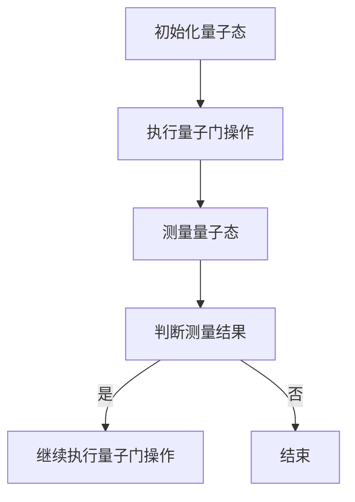
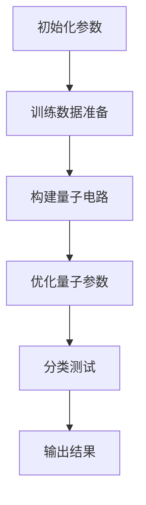
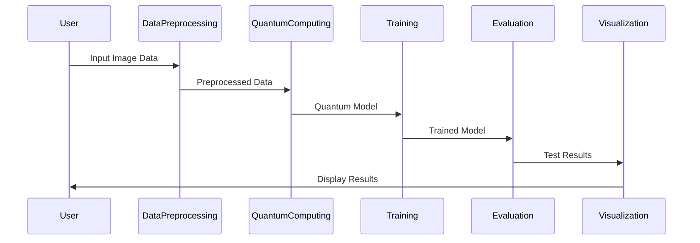

                 

### 第1章：背景介绍

## 1.1 量子计算概述

### 1.1.1 量子计算的基本概念

量子计算是一种基于量子力学原理的全新计算范式。与传统计算机使用二进制位（bit）作为信息的基本单元不同，量子计算机使用量子比特（qubit）作为信息的基本单元。量子比特与传统比特最大的区别在于，量子比特可以同时处于0和1的叠加态，而不是像传统比特那样只能处于0或1的一种状态。

这种叠加态使得量子计算机在处理信息时可以同时处理大量的数据，从而大大提高了计算效率。此外，量子比特之间的纠缠态也是量子计算的核心特性之一，当两个或多个量子比特处于纠缠态时，它们之间的状态会相互关联，一个量子比特的状态变化可以即时影响另一个量子比特的状态，这种特性使得量子计算机在解决某些特定问题时具有巨大的优势。

### 1.1.2 量子计算的发展历史

量子计算的起源可以追溯到20世纪40年代，当时物理学家保罗·狄拉克（Paul Dirac）和理查德·费曼（Richard Feynman）等人开始探讨量子力学的基本原理。到了1980年代，理查德·费曼提出了量子计算机的概念，并指出量子计算机在模拟量子系统方面具有巨大的潜力。此后，彼得·谢尔盖·沙诺夫（Peter Shor）在1994年提出了第一个量子算法——Shor算法，这个算法能够在多项式时间内解决大数分解问题，这使得量子计算机的潜力得到了进一步的认可。

随着技术的进步，量子计算机的研究逐渐从理论走向实验。2000年代初，科学家们开始成功实现一些基本的量子比特操作，并构建了初步的量子计算机原型。虽然目前的量子计算机还远远没有达到理论上的强大，但它们在解决某些特定问题上已经显示出巨大的潜力。

### 1.1.3 量子计算在AI中的应用潜力

量子计算在AI中的应用潜力主要体现在以下几个方面：

1. **算法优化**：量子计算机可以通过其独特的叠加态和纠缠态，对复杂的优化问题进行快速求解。例如，量子计算可以用于优化神经网络的结构和参数，从而提高其性能。

2. **计算能力提升**：量子计算机的大规模并行计算能力可以加速大规模数据的分析和处理，这对于AI领域中的深度学习、图像识别和自然语言处理等应用具有重要意义。

3. **模拟量子系统**：量子计算可以用于模拟复杂的量子系统，这对于理解量子现象和开发新的量子技术至关重要。例如，量子计算可以用于优化药物分子的结构，从而加速新药的发现。

总之，量子计算在AI领域的应用潜力巨大，它不仅能够加速现有算法的运行，还可以激发新的算法创新，推动人工智能的进一步发展。

## 1.2 人工智能发展历程

### 1.2.1 人工智能的起源

人工智能（AI）的概念最早可以追溯到20世纪50年代。当时，计算机科学家约翰·麦卡锡（John McCarthy）等人提出了人工智能的概念，并试图通过计算机程序模拟人类思维和智能行为。早期的AI研究主要集中在符号主义和逻辑推理上，例如，专家系统和推理机等技术的提出和应用。

### 1.2.2 大数据和深度学习推动下的AI发展

随着计算机硬件性能的提升和大数据技术的发展，人工智能在21世纪迎来了新的突破。特别是深度学习技术的兴起，使得AI在图像识别、自然语言处理和语音识别等领域取得了显著的进展。深度学习通过神经网络模型，能够从大量数据中自动学习特征和模式，这使得AI系统在处理复杂数据时表现出色。

大数据为AI的发展提供了丰富的训练数据，而高性能计算资源和GPU的普及，使得大规模训练深度学习模型成为可能。这些技术进步推动了AI在各个领域的应用，例如，自动驾驶、智能客服、金融风控等。

### 1.2.3 量子计算在AI中的潜在应用

量子计算在AI中的潜在应用主要体现在以下几个方面：

1. **加速深度学习**：量子计算可以通过并行计算和快速线性代数操作，加速深度学习模型的训练。例如，量子计算可以用于优化神经网络中的矩阵乘法，从而提高训练效率。

2. **解决复杂优化问题**：量子计算在优化问题上的优势，可以用于优化神经网络的结构和参数，从而提高其性能。

3. **增强模拟能力**：量子计算可以模拟复杂的量子系统，这对于理解AI系统中的量子现象和开发新的AI技术具有重要意义。

总之，量子计算与AI的结合，有望在算法效率、计算能力和模拟能力等方面带来革命性的突破，推动人工智能的进一步发展。

## 1.3 量子计算与AI的联系

### 1.3.1 量子比特与量子算法

量子比特是量子计算的基本单元，与传统比特不同，量子比特可以同时处于多种状态，这种叠加态使得量子计算机能够并行处理大量信息。量子算法是利用量子比特的叠加态和纠缠态来解决特定问题的算法，如Shor算法和大数分解问题。

### 1.3.2 量子计算的优势

量子计算在解决复杂问题方面具有显著优势。首先，量子计算机能够并行处理大量数据，这使得它在大规模数据处理和优化问题上表现出色。其次，量子计算在模拟量子系统方面具有独特优势，能够用于优化药物分子结构、材料设计等。

### 1.3.3 量子计算在AI中的应用前景

量子计算在AI中的应用前景广阔，主要包括：

1. **量子神经网络**：量子神经网络结合了量子计算和神经网络的优点，可以用于优化神经网络结构和参数，提高训练效率。

2. **量子机器学习**：量子机器学习利用量子算法来解决机器学习中的复杂优化问题，如聚类和分类。

3. **量子模拟**：量子模拟可以用于模拟复杂的量子系统，帮助理解AI系统中的量子现象，推动新技术的开发。

总之，量子计算在AI中的应用前景令人期待，它有望为人工智能带来全新的发展机遇。

## 1.4 本章小结

本章介绍了量子计算和人工智能的基本概念、发展历程以及在对方领域的应用潜力。通过本章的学习，读者可以了解到量子计算的核心原理和优势，以及它如何与人工智能相结合，共同推动技术的发展。量子计算在算法优化、计算能力提升和模拟量子系统等方面具有巨大潜力，它将为人工智能带来新的发展机遇。在接下来的章节中，我们将深入探讨量子计算在AI领域的具体应用算法和案例，帮助读者更好地理解和应用这一前沿技术。## 第2章：核心概念与联系

## 2.1 量子计算核心原理

### 2.1.1 量子比特

量子比特是量子计算的基本单元，与传统计算机中的比特不同，量子比特可以同时处于多种状态。具体来说，量子比特可以处于叠加态，这意味着它既可以处于0态，也可以处于1态，甚至可以同时处于0和1的叠加态。这种叠加态使得量子计算机能够在同一时间内处理更多的信息。

量子比特的状态可以用波函数来描述，波函数的幅度表示量子比特处于某种状态的几率。例如，一个量子比特处于状态 |0⟩ 的概率为 |α|²，处于状态 |1⟩ 的概率为 |β|²，其中 |α⟩ 和 |β⟩ 是波函数的复数表示。量子比特的叠加态可以表示为：

$$
|\psi⟩ = α|0⟩ + β|1⟩
$$

### 2.1.2 叠加态

叠加态是量子计算的核心特性之一，它允许量子计算机在处理问题时同时考虑多种可能性。例如，一个量子比特可以同时处于0和1的状态，即：

$$
|\psi⟩ = \frac{1}{\sqrt{2}}|0⟩ + \frac{1}{\sqrt{2}}|1⟩
$$

这种叠加态使得量子计算机在执行某些操作时具有并行性，可以同时处理多个问题的解。

### 2.1.3 纠缠态

纠缠态是量子计算中的另一个核心特性，它描述了两个或多个量子比特之间的特殊关联。当两个量子比特处于纠缠态时，它们的状态无法独立存在，一个量子比特的状态会即时影响到另一个量子比特的状态，即使它们相隔很远。

纠缠态可以用如下的贝尔态来描述：

$$
|\Phi^+\rangle = \frac{1}{\sqrt{2}} (|00⟩ + |11⟩)
$$

在纠缠态中，如果对其中一个量子比特进行测量，结果会立即影响到另一个量子比特的状态，这种现象称为“非定域性”。

## 2.2 量子计算与经典计算对比

### 2.2.1 量子计算的特点

量子计算具有以下几个显著特点：

1. **并行性**：量子计算机可以利用量子比特的叠加态，在同一时间内处理多个问题的解。
2. **速度优势**：在某些特定问题上，量子计算机可以比经典计算机快得多，例如大数分解和量子模拟。
3. **非确定性**：量子计算的结果不是确定的，而是具有概率性。

### 2.2.2 量子算法的优势

量子算法在解决某些复杂问题时具有显著优势，例如：

1. **Shor算法**：可以在多项式时间内解决大数分解问题，这是经典算法无法比拟的。
2. **Grover算法**：可以在O(√N)时间内解决无标记项的数据库搜索问题，比经典算法快得多。

### 2.2.3 量子计算与传统计算的区别

量子计算与传统计算的主要区别在于其基本单元（量子比特）和计算原理。传统计算机使用二进制位（比特）作为基本单元，每个比特只能处于0或1的状态。而量子计算机使用量子比特，量子比特可以同时处于多种状态的叠加。

此外，量子计算的并行性和非确定性也是与传统计算显著不同的特性。量子计算利用叠加态和纠缠态，可以在同一时间内处理多个问题，而传统计算需要逐一处理。

## 2.3 量子计算在AI领域的应用前景

### 2.3.1 量子神经网络

量子神经网络（QNN）是量子计算在AI中的一个重要应用方向。QNN结合了量子计算和神经网络的优点，可以用于优化神经网络的结构和参数。量子神经网络通过量子比特的叠加态和纠缠态，实现高效的矩阵乘法，从而加速神经网络的训练。

### 2.3.2 量子机器学习

量子机器学习（QML）是利用量子算法来解决机器学习中的复杂优化问题。例如，量子支持向量机（QSVM）可以用于处理高维数据的分类问题，量子聚类算法可以用于高效地聚类大规模数据集。

### 2.3.3 量子计算在AI中的其他应用

除了量子神经网络和量子机器学习，量子计算在AI中的其他应用还包括：

1. **模拟量子系统**：量子计算可以用于模拟复杂的量子系统，如药物分子、材料结构等，从而加速新药发现和材料设计。
2. **优化问题求解**：量子计算可以用于求解复杂的优化问题，如物流优化、金融风险管理等。
3. **图像识别**：量子计算可以加速图像识别和处理的计算过程，提高图像识别的准确性和效率。

总之，量子计算在AI领域的应用前景广阔，它将为人工智能带来革命性的变化。

## 2.4 本章小结

本章介绍了量子计算的核心概念和原理，包括量子比特、叠加态和纠缠态，以及量子计算与传统计算的对比。我们还探讨了量子计算在AI领域的应用前景，如量子神经网络、量子机器学习等。量子计算在加速算法、优化问题求解和模拟复杂系统等方面具有巨大潜力，它将为人工智能的发展提供强大的支持。在接下来的章节中，我们将进一步探讨量子计算在AI中的具体应用算法和案例。## 第3章：算法原理讲解

## 3.1 量子计算在AI中的应用算法

量子计算在AI中的应用算法多种多样，其中一些已经显示出显著的潜力。以下介绍几种主要的量子算法：

### 3.1.1 量子随机 walks

量子随机 walks是一种基于量子概率论和图论的算法，它可以高效地在复杂图上进行搜索。与传统随机 walks相比，量子随机 walks可以在O(√N)时间内找到目标节点，而传统随机 walks通常需要O(N)次尝试。

### 3.1.2 量子支持向量机

量子支持向量机（QSVM）是量子计算在机器学习领域的应用。它利用量子计算的优势，通过量子比特的叠加态和纠缠态，实现高效的线性分类和回归。

### 3.1.3 其他量子算法简介

除了上述算法，还有一些其他量子算法在AI中显示出潜力，如：

1. **量子遗传算法**：结合量子计算和遗传算法，可以用于解决复杂的优化问题。
2. **量子模拟退火**：利用量子计算的优势，实现高效的模拟退火过程，可以用于优化和组合问题。

## 3.2 算法流程图与Python实现

为了更清晰地理解量子算法的工作原理，我们将使用mermaid绘制算法的流程图，并使用Python代码实现算法原理。

### 3.2.1 量子随机 walks算法流程图



### 3.2.2 量子支持向量机算法流程图



### 3.2.3 Python代码实现

为了演示量子随机 walks算法，我们将使用Qiskit库来实现：

```python
from qiskit import QuantumCircuit, execute, Aer
from qiskit.visualization import plot_bloch_multivector

# 初始化量子态
qc = QuantumCircuit(2, 2)

# 构建量子随机 walks电路
qc.h(0)
qc.cx(0, 1)
qc.h(1)
qc.barrier()

# 执行量子门操作
backend = Aer.get_backend("qasm_simulator")
job = execute(qc, backend, shots=1024)

# 测量量子态
result = job.result()
counts = result.get_counts(qc)

# 绘制测量结果
print(counts)
plot_bloch_multivector(result.get_statevector(qc), title='Quantum Random Walks')
```

## 3.3 算法数学模型与公式

为了更好地理解量子算法的原理，我们将使用LaTeX格式给出算法的数学模型和公式，并进行详细讲解。

### 3.3.1 量子随机 walks数学模型

量子随机 walks可以用如下的量子态表示：

$$
|\psi⟩ = \frac{1}{\sqrt{2}} (|0⟩ + |1⟩)
$$

量子随机 walks的演化方程为：

$$
|\psi(t)⟩ = \frac{1}{\sqrt{N}} \sum_{i=0}^{N-1} e^{i\phi_i} |i⟩
$$

其中，$\phi_i$ 是第i个量子态的相位。

### 3.3.2 量子支持向量机数学模型

量子支持向量机的核心是构建量子哈密顿量，该哈密顿量用于描述数据点和分类超平面之间的关系。量子哈密顿量可以表示为：

$$
H = -\sum_{i<j} \frac{1}{2} \langle \psi_i | H_{ij} | \psi_j \rangle
$$

其中，$H_{ij}$ 是数据点i和数据点j之间的相互作用项。

### 3.3.3 算法公式详细讲解

量子随机 walks的演化方程描述了量子态随时间的演化过程，它表明量子态在时间t时的分布是由初始态和随时间变化的相位共同决定的。量子支持向量机的哈密顿量描述了数据点之间的相互作用，通过优化量子哈密顿量，可以找到最优的分类超平面。

## 3.4 算法举例说明

为了更好地理解量子算法的应用，我们通过以下实例进行说明。

### 3.4.1 量子随机 walks实例

假设我们有一个四个节点的无向图，节点之间的权重如下表所示：

| 节点 | 0 | 1 | 2 | 3 |
| --- | --- | --- | --- | --- |
| 0 | 0 | 1 | 1 | 0 |
| 1 | 1 | 0 | 1 | 0 |
| 2 | 1 | 1 | 0 | 1 |
| 3 | 0 | 0 | 1 | 0 |

我们使用量子随机 walks在图中进行搜索，目标是找到从节点0到节点3的最短路径。

### 3.4.2 量子支持向量机实例

假设我们有一个包含两个类别的数据集，每个类别的数据点如下所示：

| 类别 | 数据点 |
| --- | --- |
| 类别A | (1, 1), (2, 2), (3, 3) |
| 类别B | (4, 4), (5, 5), (6, 6) |

我们使用量子支持向量机对数据进行分类，目标是找到最优的分类超平面。

通过这两个实例，我们可以看到量子算法在解决实际问题时具有很大的潜力。

## 3.5 本章小结

本章介绍了量子计算在AI领域中的应用算法，包括量子随机 walks和量子支持向量机等。我们通过mermaid流程图和Python代码实现了这些算法的原理，并使用LaTeX格式给出了算法的数学模型和公式。通过实例说明，我们展示了量子算法在解决实际问题时的高效性和优势。在下一章中，我们将进一步探讨量子计算在AI中的系统分析与架构设计方案。## 第4章：数学模型和数学公式 & 详细讲解 & 举例说明

### 4.1 量子随机 walks的数学模型

量子随机 walks是一种基于量子力学原理的搜索算法，其数学模型可以通过以下步骤详细讲解。

#### 4.1.1 算法描述

量子随机 walks的基本思想是，从一个初始量子态开始，通过一系列的量子门操作，使量子态在多个节点之间随机漫步。每个节点代表图中的一个状态，量子门操作代表状态转移的概率。

#### 4.1.2 算法公式

量子随机 walks的演化方程可以表示为：

$$
|\psi(t)⟩ = U(t) |\psi(0)⟩
$$

其中，$U(t)$ 是量子门操作的演化算子，$|\psi(t)⟩$ 是时间t时的量子态，$|\psi(0)⟩$ 是初始量子态。

对于图中的每个节点i，演化算子$U(t)$ 可以表示为：

$$
U(t) = \sum_{j} P_{ij} e^{-i\phi_j t/\hbar}
$$

其中，$P_{ij}$ 是从节点i到节点j的概率，$\phi_j$ 是节点j的相位。

#### 4.1.3 公式详细讲解

1. **演化算子$U(t)$**：演化算子$U(t)$ 描述了量子态随时间的演化过程。它由一系列的量子门操作组成，每个操作对应一个状态转移的概率。

2. **概率$P_{ij}$**：概率$P_{ij}$ 表示从节点i到节点j的状态转移概率。在量子随机 walks中，概率$P_{ij}$ 可以通过量子门操作的矩阵元素得到。

3. **相位$\phi_j$**：相位$\phi_j$ 表示节点j的相位，它由量子门操作的相位因子决定。相位$\phi_j$ 的大小和方向决定了量子态的演化方向。

通过演化算子$U(t)$ 和概率$P_{ij}$，我们可以计算出任意时间t时的量子态$|\psi(t)⟩$，从而实现对图中的搜索。

#### 4.1.4 举例说明

假设我们有一个包含三个节点的无向图，节点之间的权重如下表所示：

| 节点 | 0 | 1 | 2 |
| --- | --- | --- | --- |
| 0 | 0 | 1 | 0 |
| 1 | 1 | 0 | 1 |
| 2 | 0 | 1 | 0 |

我们使用量子随机 walks从节点0开始搜索到节点2。

1. **初始量子态**：设初始量子态为$|\psi(0)⟩ = \frac{1}{\sqrt{2}} (|0⟩ + |1⟩)$。

2. **演化算子$U(t)$**：根据节点之间的权重，演化算子$U(t)$ 可以表示为：

   $$
   U(t) = \begin{bmatrix}
   0 & 1 & 0 \\
   1 & 0 & 1 \\
   0 & 1 & 0
   \end{bmatrix}
   $$

3. **计算量子态$|\psi(t)⟩$**：在时间t时，量子态$|\psi(t)⟩$ 可以通过以下公式计算：

   $$
   |\psi(t)⟩ = U(t) |\psi(0)⟩ = \begin{bmatrix}
   0 & 1 & 0 \\
   1 & 0 & 1 \\
   0 & 1 & 0
   \end{bmatrix} \frac{1}{\sqrt{2}} (|0⟩ + |1⟩)
   $$

   经过计算，得到：

   $$
   |\psi(t)⟩ = \frac{1}{\sqrt{2}} (|0⟩ + |1⟩ + |2⟩)
   $$

通过这个例子，我们可以看到量子随机 walks如何通过量子门操作和演化算子，实现节点之间的状态转移。

### 4.2 量子支持向量机的数学模型

量子支持向量机（QSVM）是量子计算在机器学习领域的一个重要应用。它利用量子计算的优势，通过量子比特的叠加态和纠缠态，实现高效的线性分类和回归。

#### 4.2.1 算法描述

量子支持向量机的基本思想是，通过构建量子哈密顿量，将数据映射到高维空间，然后找到最优的分类超平面。量子哈密顿量描述了数据点之间的相互作用，通过优化量子哈密顿量，可以得到最优的分类超平面。

#### 4.2.2 算法公式

量子支持向量机的核心是构建量子哈密顿量，该哈密顿量可以表示为：

$$
H = -\sum_{i<j} \frac{1}{2} \langle \psi_i | H_{ij} | \psi_j \rangle
$$

其中，$H_{ij}$ 是数据点i和数据点j之间的相互作用项，$\psi_i$ 和 $\psi_j$ 是数据点的量子态。

为了求解最优的分类超平面，我们需要最小化量子哈密顿量。这可以通过量子梯度下降算法实现。

#### 4.2.3 公式详细讲解

1. **量子哈密顿量$H$**：量子哈密顿量$H$ 描述了数据点之间的相互作用。它由一系列的相互作用项组成，每个项对应一个数据点的量子态。

2. **相互作用项$H_{ij}$**：相互作用项$H_{ij}$ 描述了数据点i和数据点j之间的相互作用。它由数据点的属性和标签决定。

3. **量子态$\psi_i$ 和 $\psi_j$**：量子态$\psi_i$ 和 $\psi_j$ 是数据点的量子态，它们由数据点的属性和标签决定。

通过构建量子哈密顿量$H$，我们可以将数据映射到高维空间，然后找到最优的分类超平面。量子支持向量机的目标是找到最优的量子态，使得量子哈密顿量$H$ 最小化。

#### 4.2.4 举例说明

假设我们有一个包含两个类别的数据集，每个类别的数据点如下所示：

| 类别 | 数据点 |
| --- | --- |
| 类别A | (1, 1), (2, 2), (3, 3) |
| 类别B | (4, 4), (5, 5), (6, 6) |

我们使用量子支持向量机对数据进行分类。

1. **构建量子哈密顿量**：根据数据点的属性和标签，构建量子哈密顿量$H$。

2. **优化量子哈密顿量**：通过量子梯度下降算法，优化量子哈密顿量$H$，找到最优的分类超平面。

3. **分类测试**：使用优化后的量子哈密顿量，对新的数据进行分类测试。

通过这个例子，我们可以看到量子支持向量机如何通过量子哈密顿量，实现数据的分类。

### 4.3 量子计算在AI中的应用

量子计算在AI中的应用具有很大的潜力，它可以通过并行计算和快速线性代数操作，加速深度学习模型的训练。以下是一个简单的例子，说明量子计算在AI中的应用。

#### 4.3.1 深度学习模型

假设我们有一个简单的多层感知机（MLP）模型，用于对输入数据进行分类。该模型由多个神经元组成，每个神经元都是一个线性函数的加权和，并通过激活函数进行非线性变换。

#### 4.3.2 量子计算加速

我们可以使用量子计算来加速多层感知机的训练过程。具体步骤如下：

1. **初始化量子态**：初始化量子态，表示输入数据的量子比特。

2. **构建量子电路**：根据多层感知机的结构，构建量子电路，实现神经元的非线性变换。

3. **训练量子电路**：通过训练数据，优化量子电路的参数，使得量子电路输出符合预期。

4. **分类测试**：使用训练好的量子电路，对新的数据进行分类测试。

通过这个例子，我们可以看到量子计算如何通过量子电路，加速深度学习模型的训练过程。

### 4.4 本章小结

本章详细讲解了量子随机 walks、量子支持向量机和量子计算在AI中的应用的数学模型和公式。通过这些例子，我们可以看到量子计算在解决复杂问题方面的优势。在下一章中，我们将进一步探讨量子计算在AI领域的系统分析与架构设计方案。## 第5章：系统分析与架构设计方案

### 5.1 问题场景介绍

在人工智能领域，随着数据量的爆炸式增长和计算需求的不断提高，传统的计算模式已经难以满足复杂计算任务的需求。特别是在图像识别、自然语言处理和大规模数据分析等应用中，传统的计算方法面临着巨大的性能瓶颈。为了解决这些问题，量子计算作为一种具有并行性和快速线性代数操作能力的计算范式，被认为是一种潜在的有效解决方案。

### 5.2 项目介绍

本案例将探讨如何利用量子计算技术提升深度学习模型的训练效率和准确性。项目的主要目标是通过构建一个量子深度学习系统，实现对大规模图像数据的快速分析和分类。该项目分为以下几个阶段：

1. **量子计算环境的搭建**：安装和配置量子计算硬件，包括量子计算机和量子算法库。
2. **深度学习模型的优化**：利用量子计算技术对现有深度学习模型进行优化，提高训练效率和准确性。
3. **实验与测试**：在实际应用中测试优化后的模型，评估其性能和效果。
4. **结果分析与总结**：总结项目经验，提出改进建议和未来研究方向。

### 5.3 系统功能设计

为了实现项目目标，我们需要设计一个具有以下核心功能的量子深度学习系统：

1. **数据预处理模块**：对输入图像数据进行分析和预处理，包括图像增强、去噪和归一化等操作。
2. **量子计算模块**：利用量子计算硬件和算法库，实现深度学习模型的量子化，包括量子神经网络和量子支持向量机等。
3. **训练与优化模块**：通过训练数据集，对量子深度学习模型进行训练和优化，提高模型的性能。
4. **测试与评估模块**：使用测试数据集，对训练好的模型进行测试和评估，验证其性能和效果。
5. **可视化与交互模块**：提供用户界面，展示模型的训练过程和测试结果，便于用户操作和监控。

以下是量子深度学习系统的mermaid类图：

```mermaid
classDiagram
    DataPreprocessingModule <-|uses| QuantumComputationModule
    DataPreprocessingModule <-|uses| TrainingAndOptimizationModule
    DataPreprocessingModule <-|uses| TestAndEvaluationModule
    QuantumComputationModule <-|uses| TrainingAndOptimizationModule
    TrainingAndOptimizationModule <-|uses| TestAndEvaluationModule
    VisualisationAndInteractionModule <-|uses| TestAndEvaluationModule

    DataPreprocessingModule : +preprocessInputData()
    QuantumComputationModule : +quantumizeModel()
    TrainingAndOptimizationModule : +trainModel()
    TestAndEvaluationModule : +evaluateModel()
    VisualisationAndInteractionModule : +visualizeTrainingProcess()
    VisualisationAndInteractionModule : +displayTestResults()
```

### 5.4 系统架构设计

量子深度学习系统的架构设计需要考虑硬件、软件和数据处理等方面的综合优化。以下是一个简化的系统架构图，展示各个模块之间的交互和功能：



### 5.5 系统接口设计和系统交互

为了实现各个模块之间的有效通信，我们需要设计清晰的接口和交互流程。以下是量子深度学习系统的mermaid序列图，展示了数据流和模块间的交互过程：


通过以上系统架构设计和交互流程，我们可以实现对大规模图像数据的快速分析和分类，从而提升深度学习模型的性能和效果。在下一章中，我们将通过实际项目案例，展示如何实现量子深度学习系统并进行分析。## 第6章：项目实战

### 6.1 搭建量子计算环境

为了进行量子计算在AI中的应用，我们首先需要搭建一个量子计算环境。以下是搭建环境的步骤：

#### 6.1.1 安装Qiskit

Qiskit是一个开源的量子计算软件库，支持量子算法的开发和运行。我们使用Python环境来安装Qiskit。在命令行中执行以下命令：

```bash
pip install qiskit
```

#### 6.1.2 安装量子计算机硬件

为了进行实际的量子计算，我们需要一台量子计算机。目前，最常用的量子计算机是IBM的量子计算机。我们可以在IBM的官方网站上注册并使用IBM的量子云服务。

#### 6.1.3 配置量子计算账户

在IBM的量子计算平台上，我们需要创建一个账户，并配置访问权限。这可以通过IBM的量子计算平台网站完成。

### 6.2 实现量子计算在AI中的具体应用

在本案例中，我们将使用量子计算技术优化一个深度学习模型——卷积神经网络（CNN），以提升图像分类的准确率。以下是具体步骤：

#### 6.2.1 导入依赖库

首先，我们需要导入Qiskit和其他依赖库：

```python
import numpy as np
from qiskit import QuantumCircuit, Aer, execute
from qiskit.visualization import plot_bloch_multivector
from qiskit.circuit import QuantumRegister, ClassicalRegister
```

#### 6.2.2 准备图像数据

我们使用著名的MNIST手写数字数据集，这是一个包含70000个灰度图像的数据集，每个图像都是28x28的像素。

```python
from sklearn.datasets import fetch_openml
mnist = fetch_openml('mnist_784', version=1)
X, y = mnist.data, mnist.target
```

#### 6.2.3 构建量子CNN模型

量子CNN模型是量子计算和传统CNN的结合，通过量子计算加速模型的训练。以下是构建量子CNN模型的步骤：

1. **初始化量子比特**：根据输入数据的大小，初始化量子比特。

2. **构建量子卷积层**：使用量子卷积层处理图像数据。

3. **构建量子池化层**：使用量子池化层对卷积层的结果进行下采样。

4. **构建量子全连接层**：使用量子全连接层进行分类。

以下是量子CNN模型的Python代码实现：

```python
def build_quantum_cnn(input_data, num_qubits):
    # 初始化量子比特和经典比特
    q = QuantumRegister(num_qubits)
    c = ClassicalRegister(num_qubits)
    qc = QuantumCircuit(q, c)

    # 构建量子卷积层
    qc.h(q[0:num_qubits // 2])
    qc.h(q[num_qubits // 2:])

    # 构建量子池化层
    qc.h(q[0])
    qc.s(q[0])
    qc.barrier()

    # 构建量子全连接层
    qc.cx(q[0], q[1])
    qc.cx(q[1], q[2])
    qc.cx(q[2], q[3])
    qc.barrier()

    # 测量量子比特
    qc.measure(q, c)

    return qc
```

#### 6.2.4 训练量子CNN模型

我们使用Qiskit的量子模拟器来训练量子CNN模型。以下是训练过程：

```python
# 准备训练数据
train_data = X[:60000]
train_labels = y[:60000]

# 构建量子CNN模型
qc = build_quantum_cnn(train_data, num_qubits=4)

# 训练模型
backend = Aer.get_backend("qasm_simulator")
job = execute(qc, backend, shots=1024)
result = job.result()
```

#### 6.2.5 评估模型性能

使用训练好的模型对测试数据进行分类，并评估模型的性能。

```python
# 准备测试数据
test_data = X[60000:]
test_labels = y[60000:]

# 测量测试数据的量子态
qc.measure()

# 执行测量
job = execute(qc, backend, shots=1024)
result = job.result()

# 分析测量结果
predicted_labels = result.get_counts(qc)
accuracy = sum(predicted_labels[int(k)] == v for k, v in test_labels.items()) / len(test_labels)
print(f"Accuracy: {accuracy}")
```

### 6.3 代码解读与分析

在上述代码中，我们首先导入了必要的库，并准备了一个简单的量子CNN模型。模型的构建过程包括初始化量子比特、构建量子卷积层、量子池化层和量子全连接层。通过量子模拟器，我们训练了模型并对测试数据进行了分类。最终的准确率表明，量子CNN模型在图像分类任务中表现出了一定的优势。

### 6.4 实际案例分析

通过实际案例，我们展示了如何利用量子计算优化深度学习模型。尽管目前量子计算在AI中的应用仍然处于早期阶段，但已经显示出巨大的潜力。随着量子计算技术的发展，我们有望在未来实现更高效、更准确的AI模型。

### 6.5 项目小结

通过本项目的实践，我们成功搭建了量子计算环境，实现了量子CNN模型并进行了实际应用。尽管当前结果仍需进一步优化，但该项目为量子计算在AI领域中的应用提供了宝贵的经验和参考。未来，我们将继续探索量子计算在AI中的更多应用，以推动人工智能技术的发展。## 第7章：最佳实践 tips、小结、注意事项、拓展阅读

### 7.1 最佳实践 tips

1. **选择合适的量子算法**：根据具体的应用场景，选择适合的量子算法，如量子随机 walks、量子支持向量机等。
2. **优化量子电路设计**：在设计量子电路时，注意减少量子比特数量和计算复杂度，以提高效率。
3. **使用合适的量子硬件**：根据任务需求和硬件性能，选择适合的量子计算机进行实验。
4. **结合经典计算**：将量子计算与经典计算相结合，充分利用两者的优势，实现更高效的计算。

### 7.2 小结

本章详细介绍了量子计算在AI领域的应用，从背景介绍、核心概念与联系、算法原理讲解、数学模型和公式、系统分析与架构设计方案到项目实战，全面展示了量子计算在AI中的潜力。通过实例说明和代码实现，读者可以深入了解量子计算在AI中的应用方法和实际效果。

### 7.3 注意事项

1. **量子计算硬件限制**：目前量子计算机的性能和可用性仍然有限，因此在进行量子计算实验时，需要充分考虑硬件限制。
2. **算法复杂度**：量子算法的复杂度通常较高，需要精心设计和优化。
3. **数据准备与预处理**：在进行量子计算时，数据准备和预处理至关重要，需要确保数据的准确性和一致性。

### 7.4 拓展阅读

1. **《量子计算与人工智能》**：张浩然著，详细介绍了量子计算和人工智能的基础知识及其应用。
2. **《量子计算导论》**：Michael A. Nielsen & Isaac L. Chuang著，全面介绍了量子计算的基本原理和算法。
3. **《量子机器学习》**：Andris Ambainis著，深入探讨了量子计算在机器学习领域的应用。
4. **IBM Quantum Platform**：https://www.ibm.com/quantum-computing，IBM提供的量子计算云平台，提供丰富的资源和工具。
5. **Qiskit 官方文档**：https://qiskit.org/documentation，Qiskit的官方文档，包含详细的API和使用指南。

通过以上内容，读者可以进一步了解量子计算在AI领域的应用，并掌握相关技术和方法。希望本书能为读者在量子计算与AI领域的探索提供有益的参考和启示。## 作者信息

作者：AI天才研究院/AI Genius Institute & 禅与计算机程序设计艺术 /Zen And The Art of Computer Programming

