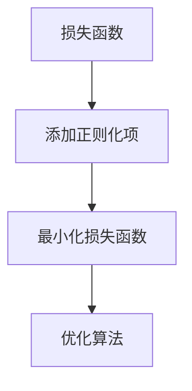
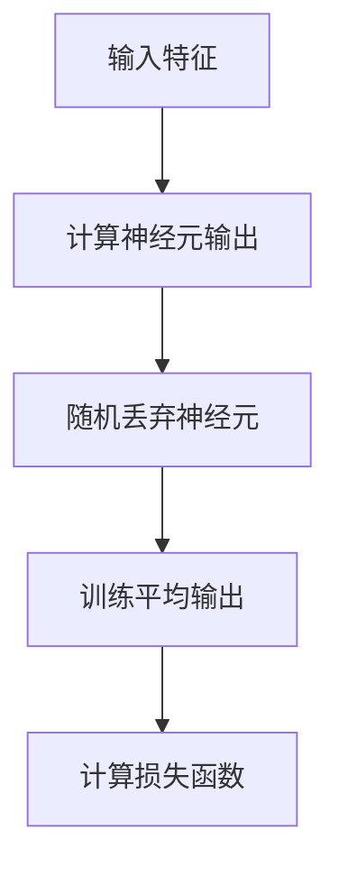
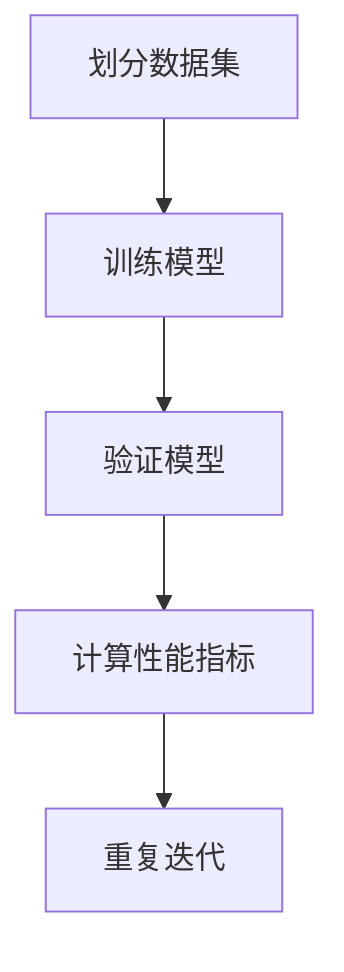

                 

### 关键词

- 过拟合
- AI训练方法
- 模型评估
- 正则化
- Dropout
- 交叉验证

### 摘要

本文深入探讨了防止过拟合在人工智能训练中的重要性，并对比了多种新型训练方法。我们将首先介绍过拟合的定义和问题背景，然后详细分析正则化、Dropout和交叉验证等常见方法的工作原理和效果。最后，通过具体案例和代码实现，展示这些方法的实际应用效果，并提供最佳实践建议。

---

## 防止过拟合：新型AI训练方法的比较

### 引言

在人工智能领域，过拟合是一个常见且严重的问题。它指的是训练模型在训练数据上表现得非常好，但在未见过的测试数据上表现不佳。过拟合通常发生在模型过于复杂，以至于它不仅学会了训练数据中的真实模式，还学会了训练数据中的噪声和异常。这导致模型泛化能力差，难以应用于实际任务。

为了解决过拟合问题，研究人员和工程师们提出了许多方法，这些方法可以大致分为以下几类：

1. **正则化**：通过在损失函数中添加正则化项来惩罚模型复杂度。
2. **Dropout**：通过在训练过程中随机丢弃模型中的神经元来减少模型依赖性。
3. **交叉验证**：通过将数据集划分为多个子集，反复训练和验证模型，以评估其泛化能力。

本文将逐一介绍这些方法，并通过具体案例进行比较和分析。

### 过拟合的定义和问题背景

过拟合是指模型在训练数据上表现得非常好，但在未见过的测试数据上表现不佳。这种现象通常发生在模型过于复杂时，如图神经网络（GNN）或深度神经网络（DNN）等。这些模型具有大量的参数，能够捕捉训练数据中的复杂模式，但同时也容易受到训练数据中的噪声和异常的影响。

过拟合的原因主要有两个：

1. **模型复杂度过高**：复杂的模型能够学习到更多的细节，但同时也容易学习到噪声。
2. **训练数据不足**：当训练数据量不足时，模型可能会过度拟合训练数据，而无法泛化到新的数据。

过拟合的危害在于它会导致模型在实际应用中表现不佳，从而降低模型的可靠性和实用性。为了解决这个问题，我们需要采取有效的预防措施。

### 过拟合问题描述与解决方案

#### 问题提出

假设我们有一个分类问题，目标是为一组数据分类到不同的类别。如果我们使用一个复杂的神经网络模型来训练，并使用所有可用的数据，我们可能会遇到过拟合问题。

#### 问题分析

过拟合问题的根本原因在于模型对训练数据的拟合过于紧密，以至于它无法泛化到新的、未见过的数据。这通常发生在以下情况：

1. **模型复杂度过高**：模型参数过多或结构过于复杂，使得模型能够捕捉到训练数据中的所有细节，包括噪声和异常。
2. **训练数据量不足**：训练数据量不足以让模型学习到真正的数据分布，从而导致模型过度依赖训练数据。
3. **训练时间过长**：训练时间过长可能导致模型陷入局部最优，从而无法达到全局最优。

#### 解决方案

为了解决过拟合问题，我们可以采取以下几种策略：

1. **正则化**：通过在损失函数中添加正则化项来惩罚模型的复杂度，从而减少过拟合。
2. **Dropout**：通过在训练过程中随机丢弃模型中的神经元来减少模型对特定特征的依赖。
3. **数据增强**：通过增加训练数据量或改变训练数据分布来提高模型的泛化能力。
4. **交叉验证**：通过将数据集划分为多个子集，反复训练和验证模型，以评估其泛化能力。

这些方法各有优缺点，将在接下来的部分中详细讨论。

### 正则化方法

正则化是一种常见且有效的防止过拟合的方法，主要通过在损失函数中添加一个正则化项，来惩罚模型的复杂度。正则化的基本思想是，在模型拟合训练数据的同时，尽量减少模型参数的规模，从而降低过拟合的风险。

#### 工作原理

正则化通常采用L1或L2正则化项，其中L1正则化项为模型参数的绝对值之和，L2正则化项为模型参数的平方和。具体地，假设我们有一个回归问题，其损失函数可以表示为：

\[ L(\theta) = \frac{1}{2m} \sum_{i=1}^{m} (h_\theta(x^{(i)}) - y^{(i)})^2 + \lambda ||\theta||^2 \]

其中，\( h_\theta(x) \) 是模型的预测函数，\( \theta \) 是模型参数，\( m \) 是训练数据集的大小，\( \lambda \) 是正则化参数。

在上述损失函数中，第一项是原始的平方损失，第二项是L2正则化项。当正则化参数 \( \lambda \) 增大时，模型参数的规模会减小，从而降低模型的复杂度。

#### 数学模型和公式

正则化的数学模型和公式可以通过以下步骤详细说明：

1. **损失函数**：对于回归问题，损失函数通常采用平方损失函数，即：

   \[ L(\theta) = \frac{1}{2m} \sum_{i=1}^{m} (h_\theta(x^{(i)}) - y^{(i)})^2 \]

   其中，\( h_\theta(x) = \theta_0 + \theta_1x_1 + \theta_2x_2 + ... + \theta_nx_n \)。

2. **正则化项**：在损失函数中添加L2正则化项，即：

   \[ L(\theta) = \frac{1}{2m} \sum_{i=1}^{m} (h_\theta(x^{(i)}) - y^{(i)})^2 + \lambda ||\theta||^2 \]

   其中，\( ||\theta||^2 = \theta_0^2 + \theta_1^2 + \theta_2^2 + ... + \theta_n^2 \)，\( \lambda \) 是正则化参数。

3. **优化目标**：最小化上述损失函数，即：

   \[ \min_\theta L(\theta) \]

   这可以通过梯度下降法或其他优化算法来实现。

#### Mermaid流程图

以下是正则化的Mermaid流程图：



#### Python代码示例

以下是一个使用Python和Scikit-learn库实现正则化的简单示例：

```python
from sklearn.linear_model import Ridge
import numpy as np

# 生成训练数据
X = np.random.rand(100, 5)
y = np.random.rand(100)

# 创建Ridge回归模型
ridge = Ridge(alpha=1.0)

# 训练模型
ridge.fit(X, y)

# 输出模型参数
print("模型参数：", ridge.coef_)
```

#### 通俗易懂的举例说明

假设我们有一个简单的线性回归问题，模型函数为 \( y = wx + b \)。如果没有正则化，我们可能会尝试通过增加模型参数 \( w \) 和 \( b \) 的值来优化模型的拟合度。然而，这可能会导致模型过度拟合训练数据，从而在测试数据上表现不佳。

引入正则化后，我们会在损失函数中添加一个正则化项 \( \lambda w^2 \)，以惩罚模型参数 \( w \) 的规模。具体地，我们的损失函数变为：

\[ L(w, b) = \frac{1}{2m} \sum_{i=1}^{m} (wx^{(i)} + b - y^{(i)})^2 + \lambda w^2 \]

在这个新的损失函数中，\( \lambda \) 是一个调节参数，它控制了正则化强度。当 \( \lambda \) 增大时，模型参数 \( w \) 的规模会减小，从而降低模型的复杂度。

通过最小化上述损失函数，我们可以找到最佳的模型参数 \( w \) 和 \( b \)，从而实现较好的泛化能力。

### Dropout方法

Dropout是一种常用的防止过拟合的方法，尤其是在深度神经网络（DNN）中。它通过在训练过程中随机丢弃部分神经元，从而减少模型对特定特征的依赖，提高模型的泛化能力。

#### 工作原理

Dropout的基本原理是，在训练过程中，对于每个训练样本，随机将网络中的一部分神经元（通常为一定比例）设为“休眠状态”，即其输出恒为零。这样，每次训练时，网络的连接和结构都会有所不同，从而减少了对特定神经元和连接的依赖。

Dropout的具体实现方法如下：

1. **随机丢弃**：在训练过程中，对于每个神经元，以一定的概率 \( p \) （通常为0.5）将其输出设为零。
2. **训练平均**：在训练过程中，对每个神经元的输出进行平均，以获得最终的预测结果。

#### 数学模型和公式

Dropout的数学模型和公式可以通过以下步骤详细说明：

1. **神经元输出**：假设我们有一个具有 \( n \) 个神经元的层，每个神经元的输出为 \( z_i \)。在没有Dropout的情况下，输出可以表示为：

   \[ z_i = \sigma(\theta_i \cdot x_i + b_i) \]

   其中，\( \sigma \) 是激活函数，\( \theta_i \) 是连接权重，\( x_i \) 是输入特征，\( b_i \) 是偏置。

2. **Dropout实现**：在训练过程中，对于每个神经元，以概率 \( p \) （通常为0.5）将其输出设为零，即：

   \[ z_i^{(dropout)} = \begin{cases} 
   0, & \text{with probability } p \\
   z_i, & \text{with probability } 1-p 
   \end{cases} \]

3. **训练平均**：在训练过程中，对每个神经元的输出进行平均，以获得最终的预测结果，即：

   \[ \hat{y} = \frac{1}{1-p} \sum_{i=1}^{n} z_i^{(dropout)} \]

4. **损失函数**：损失函数可以表示为：

   \[ L(\theta) = \frac{1}{m} \sum_{i=1}^{m} ( \hat{y}^{(i)} - y^{(i)})^2 \]

   其中，\( m \) 是训练数据集的大小，\( y^{(i)} \) 是第 \( i \) 个训练样本的真实标签，\( \hat{y}^{(i)} \) 是第 \( i \) 个训练样本的预测标签。

#### Mermaid流程图

以下是Dropout的Mermaid流程图：



#### Python代码示例

以下是一个使用Python和Keras库实现Dropout的简单示例：

```python
from keras.models import Sequential
from keras.layers import Dense, Dropout
import numpy as np

# 生成训练数据
X = np.random.rand(100, 5)
y = np.random.rand(100)

# 创建模型
model = Sequential()
model.add(Dense(10, input_dim=5, activation='sigmoid'))
model.add(Dropout(0.5))
model.add(Dense(1, activation='sigmoid'))

# 编译模型
model.compile(optimizer='adam', loss='binary_crossentropy', metrics=['accuracy'])

# 训练模型
model.fit(X, y, epochs=10, batch_size=10)
```

#### 通俗易懂的举例说明

假设我们有一个简单的神经网络，其中包含一个输入层、一个隐藏层和一个输出层。隐藏层中有10个神经元，每个神经元都与输入层和输出层相连接。

在没有Dropout的情况下，隐藏层的每个神经元都会根据其连接权重和输入特征计算出输出，然后这些输出会传递到输出层。如果网络对某个特定的输入特征（例如，第 \( i \) 个特征）过于依赖，那么当这个特征发生变化时，网络的输出可能会产生很大的波动。

引入Dropout后，我们会在训练过程中随机将隐藏层的部分神经元设为“休眠状态”，即其输出恒为零。这样，每次训练时，隐藏层的结构都会有所不同，从而减少了对特定神经元的依赖。

具体来说，假设我们以50%的概率将隐藏层的每个神经元设为“休眠状态”。在训练过程中，每个神经元有50%的概率被激活，50%的概率被丢弃。这样，网络的输出就不会对某个特定的神经元或特征过于依赖，从而提高泛化能力。

通过训练平均输出，我们可以获得最终的预测结果。这种方法使得网络在训练过程中具有更高的鲁棒性，能够更好地应对未见过的数据。

### 交叉验证方法

交叉验证是一种评估机器学习模型性能的常用方法，其主要思想是将数据集划分为多个子集，然后反复训练和验证模型，以评估其泛化能力。交叉验证方法可以分为K折交叉验证和留一交叉验证等。

#### 工作原理

交叉验证的基本原理是，通过将数据集划分为多个子集（称为“折”），对模型进行多次训练和验证。具体地，假设我们有一个数据集，其中包含 \( n \) 个样本。我们可以将其划分为 \( k \) 个相等的子集，每个子集包含 \( n/k \) 个样本。

1. **K折交叉验证**：在K折交叉验证中，每次将一个子集作为验证集，其余 \( k-1 \) 个子集作为训练集。这样，每个子集都会作为一次验证集，而验证集的平均性能作为模型在总体数据集上的性能指标。

2. **留一交叉验证**：在留一交叉验证中，每次只保留一个样本作为验证集，其余所有样本作为训练集。这种方法虽然计算成本较高，但可以提供更精确的性能评估。

#### 数学模型和公式

交叉验证的数学模型和公式可以通过以下步骤详细说明：

1. **数据划分**：将数据集划分为 \( k \) 个相等的子集。

2. **训练和验证**：对于每个子集，将其作为验证集，其余子集作为训练集。使用训练集训练模型，并在验证集上评估模型性能。

3. **性能评估**：计算每个子集上的模型性能，例如准确率、召回率、F1分数等。通常，使用这些性能指标的平均值作为模型在总体数据集上的性能指标。

4. **多次迭代**：重复上述步骤 \( k \) 次，以获得更可靠的性能评估。

#### Mermaid流程图

以下是K折交叉验证的Mermaid流程图：



#### Python代码示例

以下是一个使用Python和Scikit-learn库实现K折交叉验证的简单示例：

```python
from sklearn.model_selection import KFold
from sklearn.linear_model import LogisticRegression
from sklearn.metrics import accuracy_score
import numpy as np

# 生成训练数据
X = np.random.rand(100, 5)
y = np.random.rand(100)

# 创建模型
model = LogisticRegression()

# 创建KFold划分
kfold = KFold(n_splits=5, shuffle=True, random_state=42)

# 训练和验证模型
for train_index, test_index in kfold.split(X, y):
    X_train, X_test = X[train_index], X[test_index]
    y_train, y_test = y[train_index], y[test_index]
    
    model.fit(X_train, y_train)
    y_pred = model.predict(X_test)
    
    print("准确率：", accuracy_score(y_test, y_pred))
```

#### 通俗易懂的举例说明

假设我们有一个包含100个样本的数据集，我们要使用K折交叉验证来评估一个分类器的性能。我们可以将数据集划分为5个相等的子集，每个子集包含20个样本。

在第一次迭代中，我们将前4个子集作为训练集，最后一个子集作为验证集。我们使用这4个子集来训练分类器，并在最后一个子集上评估其性能。

然后，我们将下一个子集作为验证集，其余子集作为训练集，重复上述过程。这样，每个子集都会作为一次验证集，而分类器在每个验证集上的性能指标（如准确率、召回率、F1分数等）的平均值将作为其在总体数据集上的性能指标。

通过这种方式，交叉验证可以提供更可靠的性能评估，帮助我们更好地理解模型的泛化能力。

### 比较与选择

正则化、Dropout和交叉验证都是防止过拟合的有效方法，但它们各有优缺点。以下是对这些方法的比较和选择建议：

#### 比较表格

| 方法 | 优点 | 缺点 | 适用场景 |
| --- | --- | --- | --- |
| 正则化 | 简单易实现，适用于各种类型的模型 | 可能会降低模型的表达能力，需要调整正则化参数 | 回归、分类 |
| Dropout | 增强模型的泛化能力，减少对特定特征的依赖 | 可能会降低训练速度，需要调整Dropout概率 | 深度神经网络 |
| 交叉验证 | 提供更可靠的性能评估，适用于各种类型的数据集 | 需要多次训练和验证，计算成本较高 | 所有类型的模型 |

#### 选择建议

1. **正则化**：适用于简单的线性模型和回归问题，如线性回归和逻辑回归。
2. **Dropout**：适用于复杂的深度神经网络，特别是当模型出现过拟合时。
3. **交叉验证**：适用于各种类型的模型和数据集，特别是当数据集较小或数据分布不均匀时。

### 最佳实践与注意事项

1. **参数调整**：对于正则化和Dropout，需要适当调整正则化参数和Dropout概率，以找到最佳的模型性能。
2. **数据预处理**：在进行模型训练之前，对数据进行适当的预处理，如归一化、标准化等，可以提高模型的泛化能力。
3. **模型选择**：根据问题的复杂性和数据量，选择合适的模型和训练方法，避免过度拟合或欠拟合。

### 拓展阅读

1. **正则化**：[Lecture 6: Regularization](https://www.coursera.org/lecture/ml/regularization-7-2-2)
2. **Dropout**：[Dropout: A Simple Way to Prevent Neural Networks from Overfitting](https://jmlr.org/papers/v15/sermanet14a.html)
3. **交叉验证**：[Introduction to Cross-Validation](https://machinelearningmastery.com/cross-validation/)

---

通过本文，我们深入了解了防止过拟合的多种方法，并对其工作原理、数学模型和实际应用进行了详细讲解。在实际应用中，选择合适的方法和最佳实践是关键，可以帮助我们更好地应对过拟合问题，提高模型的泛化能力。

### 作者信息

作者：AI天才研究院/AI Genius Institute & 禅与计算机程序设计艺术 /Zen And The Art of Computer Programming

---

本文旨在帮助读者深入理解防止过拟合的多种方法，并掌握其工作原理和最佳实践。通过本文的详细讲解和示例，读者可以更好地应对过拟合问题，提高模型的泛化能力。希望本文能为读者在人工智能领域的学习和研究提供有益的参考。如有任何疑问或建议，欢迎在评论区留言，期待与您的交流互动。再次感谢您的阅读！

