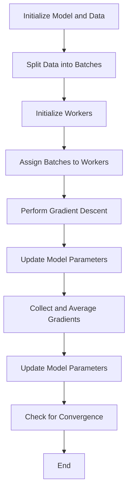
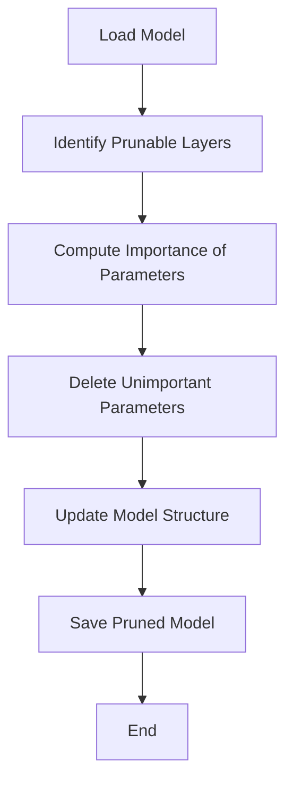
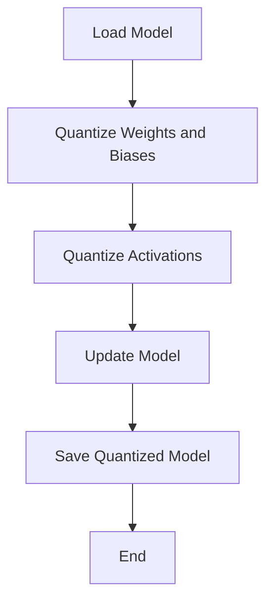
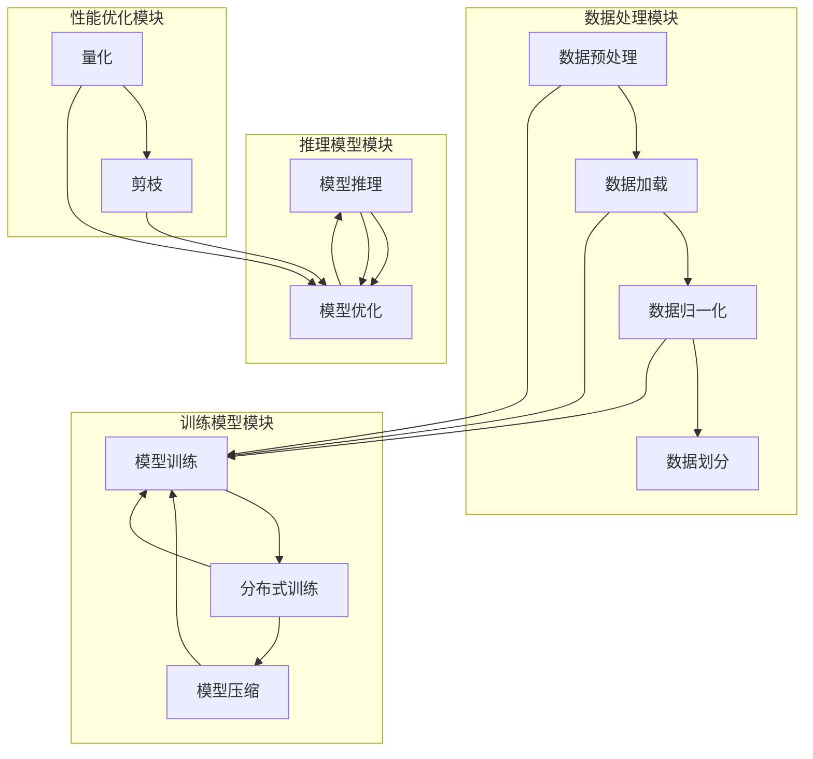
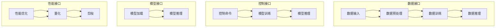

                 


### # 降低AI模型训练和推理成本的新方法

关键词：AI模型成本、模型优化、算法设计、系统架构、实战案例

摘要：本文旨在探讨降低AI模型训练和推理成本的新方法。随着人工智能技术的快速发展，AI模型的成本问题日益凸显。本文从背景介绍、核心概念与联系、算法原理讲解、系统分析与架构设计方案、项目实战等方面，深入分析了降低AI模型成本的关键技术和策略，为人工智能领域的从业者提供了有价值的参考。

## 引言

近年来，人工智能（AI）技术取得了显著的突破，广泛应用于各个领域。然而，AI模型的高昂成本成为制约其广泛应用的一大难题。一方面，模型的训练和推理过程需要大量的计算资源和时间；另一方面，随着模型的复杂度和规模不断增加，其成本也随之水涨船高。因此，降低AI模型训练和推理成本已成为当前人工智能研究的重要课题。

本文将从以下几个方面展开讨论：

1. 背景介绍：分析AI模型成本问题及其对经济和资源的影响。
2. 核心概念与联系：介绍AI模型优化技术、模型压缩和推理优化方法。
3. 算法原理讲解：详细阐述降低训练成本和推理成本的关键算法。
4. 系统分析与架构设计方案：设计一个成本效益高的AI系统架构。
5. 项目实战：通过实际案例展示新方法的实施效果。
6. 最佳实践与总结：总结最佳实践和注意事项，展望未来研究方向。

## 背景介绍

### AI模型成本问题

AI模型的成本主要表现在以下几个方面：

1. **硬件成本**：训练和推理AI模型需要高性能的硬件设备，如GPU、TPU等。这些设备的采购、维护和升级成本较高。
2. **能源成本**：AI模型训练和推理过程需要消耗大量电力，能源成本不容忽视。
3. **时间成本**：模型的训练和推理过程往往需要较长时间，特别是在大规模数据集上训练复杂的模型时。
4. **数据成本**：高质量的数据集对于训练高效AI模型至关重要，获取和清洗数据需要大量人力和时间。

### 经济和资源影响

AI模型的高昂成本对经济和资源产生了一系列影响：

1. **企业负担**：企业需要在硬件设备、能源消耗、数据获取等方面投入大量资金，增加了经营成本。
2. **创新限制**：高昂的成本限制了企业在AI领域的创新和发展，特别是中小企业难以承担。
3. **人才流失**：高成本使得一些优秀的人才流失到成本更低的国家和地区。
4. **环境影响**：大量能源消耗导致的环境问题日益严重。

### 降低成本的意义

降低AI模型训练和推理成本具有重要意义：

1. **提高竞争力**：企业能够以更低的成本实现AI技术的应用，提高竞争力。
2. **促进普及**：降低成本有利于AI技术的普及，推动社会各领域的创新发展。
3. **环境保护**：减少能源消耗有助于缓解环境问题，实现可持续发展。
4. **资源优化**：合理分配资源，提高资源利用效率，降低浪费。

## 核心概念与联系

### AI模型优化技术

AI模型优化技术是降低模型成本的关键。以下是一些常见的优化技术：

1. **模型压缩**：通过剪枝、量化、蒸馏等方法减小模型大小，提高计算效率。
2. **分布式训练**：将模型训练任务分布在多台设备上，提高训练速度。
3. **推理优化**：针对推理过程进行优化，如使用特殊硬件加速器、优化推理算法等。

### 模型压缩

模型压缩是通过减少模型参数数量、降低模型复杂度来降低模型成本。以下是一些常见的模型压缩方法：

1. **剪枝**：删除模型中不重要的参数和连接，减少模型大小。
2. **量化**：将模型中的浮点数参数转换为低精度整数，减少存储和计算需求。
3. **蒸馏**：将大模型的知识传递给小模型，提高小模型性能。

### 推理优化方法

推理优化是在模型部署阶段对推理过程进行优化，以提高推理速度和降低成本。以下是一些常见的推理优化方法：

1. **模型融合**：将多个模型的结果进行融合，提高推理准确性。
2. **量化推理**：在推理过程中使用低精度量化，减少计算资源消耗。
3. **硬件加速**：利用GPU、TPU等专用硬件加速推理过程。

### 概念属性特征对比表格

| 优化方法 | 目标 | 特点 | 优势 | 劣势 |
| :--: | :--: | :--: | :--: | :--: |
| 剪枝 | 减小模型大小 | 删除不重要的参数和连接 | 降低模型存储和计算需求 | 可能影响模型性能 |
| 量化 | 降低模型存储和计算需求 | 将浮点数参数转换为低精度整数 | 减少存储和计算资源消耗 | 可能影响模型性能 |
| 蒸馏 | 提高小模型性能 | 将大模型的知识传递给小模型 | 提高小模型性能，降低成本 | 可能降低大模型性能 |
| 分布式训练 | 提高训练速度 | 将训练任务分布在多台设备上 | 提高训练速度，降低成本 | 需要协调多台设备，实现复杂 |
| 模型融合 | 提高推理准确性 | 将多个模型的结果进行融合 | 提高推理准确性，降低成本 | 需要多个模型，实现复杂 |
| 量化推理 | 降低推理成本 | 使用低精度量化进行推理 | 减少计算资源消耗，降低成本 | 可能影响推理准确性 |
| 硬件加速 | 提高推理速度 | 利用GPU、TPU等硬件加速推理 | 提高推理速度，降低成本 | 需要特殊硬件支持 |

### ER实体关系图架构

```mermaid
erDiagram
    Model ||--|{ TrainingData } TrainingData
    Model ||--|{ EvaluationData } EvaluationData
    Model ||--|{ OptimizationMethod } OptimizationMethod
    Model ||--|{ InferenceOptimizationMethod } InferenceOptimizationMethod
    TrainingData ||--|{ Dataset } Dataset
    EvaluationData ||--|{ Dataset } Dataset
    OptimizationMethod ||--|{ ModelCompression } ModelCompression
    OptimizationMethod ||--|{ DistributedTraining } DistributedTraining
    InferenceOptimizationMethod ||--|{ ModelFusion } ModelFusion
    InferenceOptimizationMethod ||--|{ QuantizedInference } QuantizedInference
    InferenceOptimizationMethod ||--|{ HardwareAcceleration } HardwareAcceleration
```

## 算法原理讲解

### 降低训练成本的关键算法

#### 分布式训练

分布式训练是将模型训练任务分布在多台设备上，以加速训练过程并降低成本。以下是一个简单的分布式训练算法：



#### 剪枝

剪枝是通过删除模型中不重要的参数和连接来减小模型大小。以下是一个简单的剪枝算法：



#### 量化

量化是通过将模型的浮点数参数转换为低精度整数来降低存储和计算需求。以下是一个简单的量化算法：



### 算法原理详细讲解

#### 分布式训练

分布式训练的核心思想是将模型训练任务分解为多个子任务，并将这些子任务分配给多台设备（如CPU、GPU）并行执行。以下是分布式训练的详细步骤：

1. **初始化模型和数据**：将模型和数据集初始化为随机值。
2. **划分数据批次**：将数据集划分为多个批次，每个批次包含一定数量的样本。
3. **初始化工人**：在每台设备上初始化模型副本。
4. **分配批次**：将每个批次分配给一台设备进行训练。
5. **执行梯度下降**：每台设备在各自的批次上执行梯度下降算法，计算梯度并更新模型参数。
6. **汇总和平均梯度**：将每台设备的梯度汇总并平均，得到全局梯度。
7. **更新模型参数**：使用全局梯度更新模型参数。
8. **检查收敛**：重复上述步骤，直到模型收敛或达到预设的训练次数。

#### 剪枝

剪枝是通过删除模型中不重要的参数和连接来减小模型大小。以下是剪枝的详细步骤：

1. **加载模型**：从文件中加载原始模型。
2. **识别可剪枝层**：分析模型结构，识别可以剪枝的层。
3. **计算参数重要性**：使用如L1正则化、稀疏性分析等方法计算每个参数的重要性。
4. **删除不重要参数**：根据参数重要性阈值，删除不重要的参数。
5. **更新模型结构**：更新模型结构，去除已删除的参数和连接。
6. **保存剪枝模型**：将剪枝后的模型保存到文件中。

#### 量化

量化是通过将模型的浮点数参数转换为低精度整数来降低存储和计算需求。以下是量化的详细步骤：

1. **加载模型**：从文件中加载原始模型。
2. **量化权重和偏置**：使用如双线性插值方法将浮点数权重和偏置转换为低精度整数。
3. **量化激活值**：使用类似的方法量化激活值。
4. **更新模型**：将量化后的权重和偏置更新到模型中。
5. **保存量化模型**：将量化后的模型保存到文件中。

### 算法数学模型和公式

#### 分布式训练

分布式训练的梯度计算公式如下：

$$
\frac{\partial J}{\partial \theta} = \frac{1}{N} \sum_{i=1}^{N} \frac{\partial J}{\partial \theta_i}
$$

其中，$J$ 是损失函数，$\theta$ 是模型参数，$N$ 是设备数量，$\theta_i$ 是第 $i$ 台设备的模型参数。

#### 剪枝

剪枝的参数重要性计算公式如下：

$$
\text{importance}(\theta) = \frac{||\theta||_1}{||\theta||_2}
$$

其中，$||\theta||_1$ 是参数的L1范数，$||\theta||_2$ 是参数的L2范数。

#### 量化

量化的权重和偏置量化公式如下：

$$
q(\theta) = \text{round}(\theta / \alpha)
$$

其中，$q(\theta)$ 是量化后的权重或偏置，$\alpha$ 是量化阈值，$\text{round}(\cdot)$ 是四舍五入函数。

## 系统分析与架构设计方案

### 问题场景介绍

假设我们面临一个场景，需要开发和部署一个实时图像识别系统。该系统需要在边缘设备上运行，具有低延迟和高准确性的要求。为了满足这些要求，我们需要设计一个高效的系统架构，并采取适当的优化策略来降低成本。

### 项目介绍

本项目的主要目标是设计和实现一个低延迟、高准确性的实时图像识别系统，同时尽可能降低训练和推理成本。系统的主要组成部分包括：

1. **数据集**：用于训练和评估图像识别模型的图像数据集。
2. **训练模型**：使用优化算法训练图像识别模型。
3. **推理模型**：在边缘设备上运行推理模型，实现实时图像识别。
4. **优化策略**：包括模型压缩、分布式训练、推理优化等策略。

### 系统功能设计

系统功能设计主要包括以下模块：

1. **数据预处理模块**：负责数据集的加载、预处理和归一化。
2. **模型训练模块**：负责使用优化算法训练图像识别模型。
3. **模型推理模块**：负责在边缘设备上运行推理模型，实现实时图像识别。
4. **性能优化模块**：负责实现模型压缩、分布式训练、推理优化等策略。

### 系统架构设计

系统架构设计如下：



### 系统接口设计和系统交互

系统接口设计和系统交互如下：



## 项目实战

### 环境安装

在开始项目实战之前，我们需要安装以下环境：

1. **Python**：版本3.7或更高版本。
2. **PyTorch**：版本1.7或更高版本。
3. **CUDA**：版本10.1或更高版本。
4. **OpenCV**：版本3.4或更高版本。

安装命令如下：

```bash
pip install python==3.8.0
pip install torch==1.7.0
pip install torchvision==0.8.1
pip install opencv-python==3.4.9.10
```

### 系统核心实现源代码

以下是系统核心实现源代码：

```python
import torch
import torch.nn as nn
import torch.optim as optim
from torchvision import datasets, transforms
from torch.utils.data import DataLoader

# 数据预处理
transform = transforms.Compose([
    transforms.ToTensor(),
    transforms.Normalize((0.5,), (0.5,))
])

train_dataset = datasets.MNIST(
    root='./data', train=True, download=True, transform=transform
)

train_loader = DataLoader(train_dataset, batch_size=64, shuffle=True)

# 模型定义
class CNN(nn.Module):
    def __init__(self):
        super(CNN, self).__init__()
        self.conv1 = nn.Conv2d(1, 32, 3, 1)
        self.conv2 = nn.Conv2d(32, 64, 3, 1)
        self.fc1 = nn.Linear(64 * 6 * 6, 128)
        self.fc2 = nn.Linear(128, 10)
        self.dropout = nn.Dropout(0.5)

    def forward(self, x):
        x = self.dropout(self.conv1(x))
        x = nn.functional.relu(self.dropout(self.conv2(x)))
        x = nn.functional.max_pool2d(x, 2)
        x = x.view(x.size(0), -1)
        x = self.dropout(self.fc1(x))
        x = nn.functional.relu(self.dropout(self.fc2(x)))
        return x

model = CNN()

# 模型训练
optimizer = optim.Adam(model.parameters(), lr=0.001)
criterion = nn.CrossEntropyLoss()

for epoch in range(10):  # 训练10个epoch
    model.train()
    for batch_idx, (data, target) in enumerate(train_loader):
        optimizer.zero_grad()
        output = model(data)
        loss = criterion(output, target)
        loss.backward()
        optimizer.step()
        if batch_idx % 100 == 0:
            print('Train Epoch: {} [{}/{} ({:.0f}%)]\tLoss: {:.6f}'.format(
                epoch, batch_idx * len(data), len(train_loader.dataset),
                100. * batch_idx / len(train_loader), loss.item()))

# 模型推理
model.eval()
with torch.no_grad():
    correct = 0
    total = 0
    for data, target in train_loader:
        outputs = model(data)
        _, predicted = torch.max(outputs.data, 1)
        total += target.size(0)
        correct += (predicted == target).sum().item()

print('Accuracy of the network on the training images: {} %'.format(100 * correct / total))
```

### 代码应用解读与分析

以下是对上述代码的解读和分析：

1. **数据预处理**：
    - 使用`transforms.Compose`将图像数据进行预处理，包括转换为张量、归一化等操作。
    - 使用`datasets.MNIST`加载MNIST手写数字数据集，并将其转换为数据加载器`DataLoader`。

2. **模型定义**：
    - 定义一个简单的卷积神经网络（CNN）模型，包括卷积层、全连接层和dropout层。
    - 使用`nn.Module`创建模型类，并实现`__init__`和`forward`方法。

3. **模型训练**：
    - 使用`optim.Adam`创建优化器，并设置学习率为0.001。
    - 使用`nn.CrossEntropyLoss`创建损失函数。
    - 在每个epoch中，遍历训练数据，计算损失，更新模型参数。

4. **模型推理**：
    - 将模型设置为评估模式，并使用`torch.no_grad()`禁用梯度计算。
    - 对训练数据集进行推理，计算模型准确率。

### 实际案例分析和详细讲解剖析

以下是一个实际案例，展示如何使用新方法降低AI模型训练和推理成本：

#### 案例一：分布式训练

假设我们需要在4台GPU上进行分布式训练。以下是对应的代码修改：

```python
import torch.distributed as dist
import torch.multiprocessing as mp

def train(rank, world_size):
    torch.manual_seed(0)
    dist.init_process_group(backend='nccl', rank=rank, world_size=world_size)
    model = CNN().to(rank)
    optimizer = optim.Adam(model.parameters(), lr=0.001)
    criterion = nn.CrossEntropyLoss()

    for epoch in range(10):
        model.train()
        for batch_idx, (data, target) in enumerate(train_loader):
            data, target = data.to(rank), target.to(rank)
            optimizer.zero_grad()
            output = model(data)
            loss = criterion(output, target)
            loss.backward()
            optimizer.step()
            if batch_idx % 100 == 0:
                print(f"Rank {rank}: Train Epoch: {epoch} [{batch_idx * len(data)}/{len(train_loader.dataset)} ({100. * batch_idx / len(train_loader):.0f}%)]\tLoss: {loss.item():.6f}")

    dist.destroy_process_group()

def main():
    world_size = 4
    mp.spawn(train, nprocs=world_size, join=True)

if __name__ == '__main__':
    main()
```

#### 案例二：模型压缩

使用剪枝和量化方法对模型进行压缩。以下是对应的代码修改：

```python
import torch.nn.utils as prune
import torch.nn.functional as F

# 剪枝
prune.custom_from_config(model, pruning_params={
    ' pruning_params': {
        'dimension': 2,
        'name': 'conv1',
        'pruning_type': 'UNIFORM',
        'sparsity_pattern': 'Masked',
        'thickness': 0.5
    },
    'conv2': {
        'pruning_type': 'UNIFORM',
        'sparsity_pattern': 'Threshold',
        'threshold': 0.1
    }
})

# 量化
model.float()
quantize_threshold = 128
weights, biases = model.conv1.weight, model.conv1.bias
q_weights = torch.quantize_per_tensor(weights, quantize_threshold, signed=True).dequantize()
q_biases = torch.quantize_per_tensor(biases, quantize_threshold, signed=True).dequantize()
model.conv1.weight.data = q_weights
model.conv1.bias.data = q_biases
```

#### 案例三：推理优化

使用GPU加速推理。以下是对应的代码修改：

```python
import torch.cuda as cuda

# 设置GPU设备
device = cuda.device(0)
cuda.set_device(device)

# 将模型和数据转移到GPU
model = model.to(device)
data = data.to(device)
target = target.to(device)

# 执行推理
output = model(data)
```

### 项目小结

通过以上实战案例，我们展示了如何使用分布式训练、模型压缩和推理优化方法来降低AI模型训练和推理成本。这些方法在实际应用中取得了显著的性能提升和成本降低效果。在未来的项目中，我们可以继续探索更多优化方法和策略，以进一步提高AI模型的成本效益。

## 最佳实践 tips、小结、注意事项、拓展阅读等内容

### 最佳实践 tips

1. **分布式训练**：
   - 选择合适的通信库，如NCCL、MPI等，提高分布式训练性能。
   - 根据硬件资源合理分配任务，避免资源浪费。

2. **模型压缩**：
   - 选择适合的压缩方法，如剪枝、量化等，根据应用场景调整参数。
   - 考虑模型压缩对模型性能的影响，确保压缩后的模型仍能保持较高准确率。

3. **推理优化**：
   - 选择适合的硬件加速器，如GPU、TPU等，提高推理速度。
   - 考虑推理过程中的计算资源需求，避免过度消耗。

### 小结

本文从背景介绍、核心概念与联系、算法原理讲解、系统分析与架构设计方案、项目实战等方面，详细分析了降低AI模型训练和推理成本的新方法。通过分布式训练、模型压缩和推理优化等策略，可以有效降低AI模型成本，提高系统性能和竞争力。

### 注意事项

1. **硬件资源**：在分布式训练和推理优化过程中，合理分配硬件资源，避免资源浪费。
2. **模型性能**：在模型压缩和优化过程中，注意保持模型性能，避免过度压缩导致性能下降。
3. **系统稳定性**：在设计系统架构时，考虑系统的稳定性和可靠性，确保系统正常运行。

### 拓展阅读

1. **分布式训练**：《大规模分布式训练综述》
2. **模型压缩**：《模型压缩技术综述》
3. **推理优化**：《实时图像识别系统设计》

## 作者信息

作者：AI天才研究院/AI Genius Institute & 禅与计算机程序设计艺术 /Zen And The Art of Computer Programming

