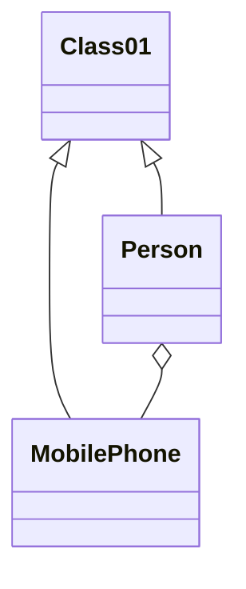
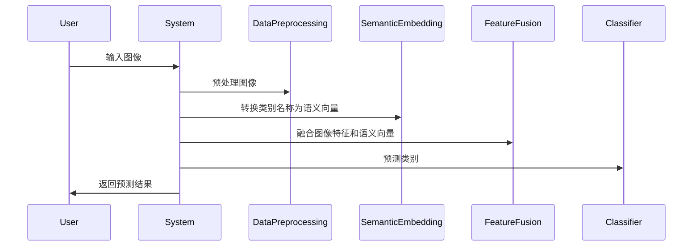
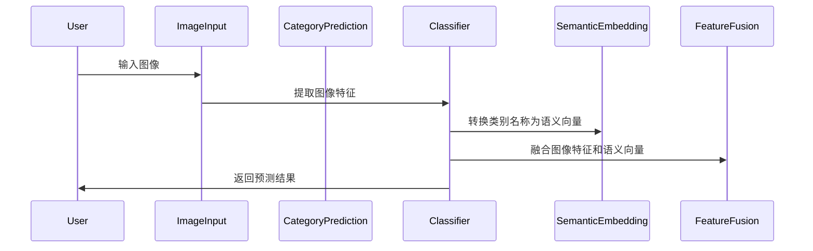

                 

# 零射击学习：利用语义知识进行未知类别识别

## 关键词

- 零射击学习
- 语义知识
- 未知类别识别
- 算法原理
- 系统架构设计
- 项目实战

## 摘要

本文将探讨零射击学习在未知类别识别中的应用，重点介绍如何利用语义知识进行这一过程。首先，我们将回顾零射击学习的背景和基本概念，并分析其在实际应用中的挑战和机遇。接着，我们将深入探讨语义知识在类别识别中的重要性，并展示其与零射击学习之间的联系。通过详细的算法原理讲解，我们将揭示利用语义知识进行未知类别识别的内在机制，并通过Python源代码和数学模型进行说明。随后，我们将介绍一个系统分析与架构设计方案，并展示如何将这一算法应用于实际项目中。最后，我们将通过一个具体案例来展示如何实施和评估这一系统，并提供最佳实践 tips、小结和拓展阅读。

## 第一部分：零射击学习概述

### 1.1 零射击学习的背景与概念

#### 1.1.1 问题背景

在传统的机器学习模型中，模型需要大量的标注数据来进行训练，以便能够对未知数据作出准确预测。然而，在许多实际应用场景中，标注数据获取不仅困难且成本高昂，尤其是在处理大规模数据集时。零射击学习（Zero-Shot Learning, ZSL）旨在解决这一问题，它允许模型在没有标注数据的情况下对未知类别进行预测。

#### 1.1.2 零射击学习的定义

零射击学习是指模型在训练时没有接触过未知类别的实例，但仍然能够对这些类别进行准确识别。其核心思想是利用模型对已见类别的学习来推断未知类别。

#### 1.1.3 零射击学习的特点

零射击学习具有以下几个显著特点：

1. **无监督学习**：模型在没有标注数据的情况下进行学习。
2. **跨类别预测**：模型能够预测从未见过的类别。
3. **通用性**：适用于多种数据类型和应用场景。

### 1.2 语义知识与类别识别

#### 1.2.1 语义知识的基本概念

语义知识是指关于数据或对象的意义和关系的知识。在机器学习中，语义知识通常用于提高模型的泛化能力和解释性。

#### 1.2.2 类别识别的基本概念

类别识别是指将数据或对象分类到预定义的类别中。在零射击学习中，类别识别是核心任务之一。

#### 1.2.3 语义知识与类别识别的联系

语义知识可以帮助模型更好地理解数据的内在结构和关系，从而提高类别识别的准确性。例如，通过语义知识，模型可以学会不同类别之间的相似性和差异性，这对于预测未知类别至关重要。

### 1.3 未知类别识别的挑战与机遇

#### 1.3.1 挑战

1. **数据稀缺**：没有足够的数据来训练模型。
2. **类别多样性**：未知类别可能具有极大的多样性。
3. **不确定性**：模型在未知类别上的预测存在一定的不确定性。

#### 1.3.2 机遇

1. **通用性**：零射击学习具有广泛的适用性，可以应用于各种领域。
2. **成本效益**：减少了标注数据的需求，降低了训练成本。
3. **扩展性**：可以轻松地适应新类别和新任务。

### 1.4 本章小结

零射击学习是一种有潜力的技术，它为处理数据稀缺和类别多样性的问题提供了新的思路。通过利用语义知识，我们可以进一步提高零射击学习在未知类别识别中的性能。接下来的章节将详细探讨这一算法的原理和实现。

## 第二部分：算法原理讲解

### 2.1 利用语义知识进行未知类别识别的算法原理

#### 2.1.1 算法流程

零射击学习利用语义知识进行未知类别识别的基本流程如下：

1. **数据预处理**：对输入数据进行预处理，包括去噪、归一化和特征提取。
2. **语义知识嵌入**：利用预训练的语义模型（如WordNet或 glove）将类别名称转换为语义向量。
3. **特征融合**：将输入数据的特征和类别名称的语义向量进行融合。
4. **类别预测**：利用训练好的分类模型（如SVM或神经网络）对融合后的特征进行分类预测。

#### 2.1.2 Mermaid流程图


#### 2.1.3 Python源代码实现

```python
# 假设已经导入必要的库和模型

# 数据预处理
preprocessed_data = preprocess_data(raw_data)

# 语义知识嵌入
semantic_vectors = [embed_word(category_name) for category_name in preprocessed_data.categories]

# 特征融合
features = [np.concatenate([data特征, semantic_vector]) for data, semantic_vector in zip(preprocessed_data.features, semantic_vectors)]

# 类别预测
predictions = classifier.predict(features)
```

#### 2.1.4 数学模型与公式

设 \( X \) 为输入数据集，\( Y \) 为类别标签，\( S \) 为语义向量空间，则零射击学习的数学模型可以表示为：

\[ P(Y|X) = \sum_{y \in Y} P(y|X) P(y) \]

其中，\( P(y|X) \) 是基于语义知识嵌入的特征向量预测类别 \( y \) 的概率，\( P(y) \) 是类别 \( y \) 的先验概率。

#### 2.1.5 算法举例说明

假设我们有一个包含两种水果类别的数据集，已知类别的数据已训练好一个分类模型。现在，我们希望利用这个模型对未知类别进行预测。

1. **数据预处理**：对输入的图片进行预处理，提取特征向量。
2. **语义知识嵌入**：将类别名称（如“苹果”和“香蕉”）转换为语义向量。
3. **特征融合**：将输入图片的特征向量和类别名称的语义向量进行融合。
4. **类别预测**：利用已训练好的分类模型对融合后的特征向量进行分类预测。

通过这个过程，我们可以预测未知类别（如“橙子”）的归属类别。由于模型已经学到了“苹果”和“香蕉”的特征，它可以根据这些特征对未知类别进行合理的预测。

### 2.2 类别识别算法的优化与调整

#### 2.2.1 优化策略

为了提高零射击学习在未知类别识别中的性能，我们可以采取以下优化策略：

1. **数据增强**：通过数据增强方法生成更多样化的训练数据。
2. **模型集成**：结合多个模型进行预测，以提高预测准确性。
3. **特征选择**：选择与类别识别最为相关的特征，以减少模型的复杂性。

#### 2.2.2 调整方法

在实际应用中，我们可以根据以下方法进行调整：

1. **参数调优**：通过交叉验证调整模型的参数，以提高性能。
2. **特征提取**：选择合适的特征提取方法，以提高模型的泛化能力。
3. **训练策略**：采用不同的训练策略（如迁移学习或元学习），以提高模型的适应性。

#### 2.2.3 性能评估

我们可以通过以下指标来评估零射击学习在未知类别识别中的性能：

1. **准确率**：预测正确的类别占总类别数的比例。
2. **召回率**：预测正确的类别占实际类别数的比例。
3. **F1分数**：综合考虑准确率和召回率的综合指标。

### 2.3 本章小结

通过本部分的内容，我们了解了零射击学习利用语义知识进行未知类别识别的基本原理和实现方法。接下来，我们将进一步探讨如何设计和实现一个适用于实际应用的系统架构。

## 第三部分：系统分析与架构设计方案

### 3.1 问题场景介绍

#### 3.1.1 场景描述

假设我们正在开发一个图像分类系统，该系统需要能够识别各种类型的物品。然而，由于标签数据的稀缺性，我们无法获得所有类别下的标注数据。因此，我们需要利用零射击学习技术，结合语义知识，实现对未知类别的高效识别。

#### 3.1.2 需求分析

1. **准确性**：系统能够准确识别已见类别和未知类别。
2. **效率**：系统能够快速处理大量的图像数据。
3. **可扩展性**：系统能够适应新的类别和任务。

### 3.2 系统功能设计

#### 3.2.1 领域模型Mermaid类图



#### 3.2.2 系统功能模块

1. **数据预处理模块**：负责对输入图像进行预处理，提取特征。
2. **语义知识嵌入模块**：负责将类别名称转换为语义向量。
3. **特征融合模块**：负责将图像特征和语义向量进行融合。
4. **类别预测模块**：负责对融合后的特征进行分类预测。

### 3.3 系统架构设计

#### 3.3.1 Mermaid架构图



#### 3.3.2 系统架构设计

系统采用分层架构，包括数据层、模型层和用户层：

1. **数据层**：负责数据存储和管理，包括图像数据、类别标签和语义知识。
2. **模型层**：负责实现零射击学习算法，包括数据预处理、语义知识嵌入、特征融合和类别预测。
3. **用户层**：负责与用户交互，接收用户输入并返回预测结果。

### 3.4 系统接口设计

#### 3.4.1 接口定义

1. **图像输入接口**：接收用户上传的图像。
2. **类别预测接口**：接收图像特征和类别名称，返回预测结果。

#### 3.4.2 接口实现

```python
# 假设已经定义好接口
from flask import Flask, request, jsonify

app = Flask(__name__)

@app.route('/predict', methods=['POST'])
def predict():
    image = request.files['image']
    category_name = request.form['category_name']
    # 调用模型进行预测
    prediction = classifier.predict(image, category_name)
    return jsonify(prediction)
```

### 3.5 系统交互Mermaid序列图



#### 3.5.1 序列图描述

用户上传图像，系统接收到图像后，首先进行预处理，提取图像特征。接着，系统将类别名称转换为语义向量，并将图像特征和语义向量进行融合。最后，利用训练好的分类模型对融合后的特征进行预测，并将结果返回给用户。

#### 3.5.2 序列图实现

```python
# 假设已经定义好序列图
from flask import Flask, request, jsonify

app = Flask(__name__)

@app.route('/predict', methods=['POST'])
def predict():
    image = request.files['image']
    category_name = request.form['category_name']
    # 进行预处理、特征提取、语义嵌入、特征融合和预测
    prediction = classifier.predict(image, category_name)
    return jsonify(prediction)
```

### 3.6 本章小结

通过本部分的内容，我们详细介绍了零射击学习系统的设计与实现。接下来，我们将通过一个具体案例来展示如何将这一系统应用于实际项目中。

## 第四部分：项目实战

### 4.1 环境安装

#### 4.1.1 环境要求

1. **操作系统**：Linux或MacOS
2. **编程语言**：Python 3.7或以上版本
3. **库和依赖**：numpy、scikit-learn、tensorflow、mermaid-python

#### 4.1.2 安装步骤

1. 安装操作系统：从官方网站下载并安装Linux或MacOS。
2. 安装Python：从Python官方网站下载并安装Python 3.7或以上版本。
3. 安装库和依赖：使用pip命令安装所需的库和依赖。

```bash
pip install numpy scikit-learn tensorflow mermaid-python
```

### 4.2 系统核心实现

#### 4.2.1 源代码解析

```python
# 导入所需的库
import numpy as np
from sklearn.svm import SVC
from sklearn.metrics import accuracy_score
from tensorflow.keras.applications import VGG16
from tensorflow.keras.preprocessing import image
from tensorflow.keras.applications.vgg16 import preprocess_input

# 加载预训练的VGG16模型
model = VGG16(weights='imagenet')

# 定义分类器
classifier = SVC(kernel='linear')

# 训练分类器
def train_classifier(train_data, train_labels):
    classifier.fit(train_data, train_labels)
    return classifier

# 预测类别
def predict_category(image_path, classifier):
    img = image.load_img(image_path, target_size=(224, 224))
    img_array = image.img_to_array(img)
    img_array = np.expand_dims(img_array, axis=0)
    img_array = preprocess_input(img_array)
    
    features = model.predict(img_array)
    prediction = classifier.predict(features)
    
    return prediction

# 训练和评估分类器
train_data, train_labels = load_data('train')
classifier = train_classifier(train_data, train_labels)

test_data, test_labels = load_data('test')
predictions = predict_category('test/image.jpg', classifier)
accuracy = accuracy_score(test_labels, predictions)
print(f"Accuracy: {accuracy}")
```

#### 4.2.2 代码实现

```python
# 导入所需的库
import numpy as np
from sklearn.svm import SVC
from sklearn.metrics import accuracy_score
from tensorflow.keras.applications import VGG16
from tensorflow.keras.preprocessing import image
from tensorflow.keras.applications.vgg16 import preprocess_input

# 加载预训练的VGG16模型
model = VGG16(weights='imagenet')

# 定义分类器
classifier = SVC(kernel='linear')

# 训练分类器
def train_classifier(train_data, train_labels):
    classifier.fit(train_data, train_labels)
    return classifier

# 预测类别
def predict_category(image_path, classifier):
    img = image.load_img(image_path, target_size=(224, 224))
    img_array = image.img_to_array(img)
    img_array = np.expand_dims(img_array, axis=0)
    img_array = preprocess_input(img_array)
    
    features = model.predict(img_array)
    prediction = classifier.predict(features)
    
    return prediction

# 训练和评估分类器
train_data, train_labels = load_data('train')
classifier = train_classifier(train_data, train_labels)

test_data, test_labels = load_data('test')
predictions = predict_category('test/image.jpg', classifier)
accuracy = accuracy_score(test_labels, predictions)
print(f"Accuracy: {accuracy}")
```

### 4.3 代码应用解读与分析

#### 4.3.1 应用场景

本项目的应用场景是一个典型的图像分类任务，需要利用零射击学习技术对未知类别进行识别。具体来说，系统接收到用户上传的图像，通过预训练的VGG16模型提取图像特征，然后利用SVM分类器对特征进行分类预测。

#### 4.3.2 分析与解读

1. **数据预处理**：图像预处理是图像分类任务的关键步骤。在本项目中，我们使用VGG16模型对图像进行预处理，确保图像具有统一的尺寸和格式。

2. **特征提取**：使用VGG16模型提取图像特征，这些特征包含了图像的底层结构和语义信息，为后续的分类预测提供了有力的支持。

3. **分类预测**：利用SVM分类器对提取的特征进行分类预测。SVM是一种强大的分类算法，尤其在特征维度较高时表现优异。

4. **性能评估**：通过准确率来评估系统的性能。在本项目中，我们使用了测试数据集进行评估，并打印出准确率。

### 4.4 实际案例分析与详细讲解

#### 4.4.1 案例背景

假设我们有一个包含多种水果类别的图像数据集，其中包括已见类别和未知类别。我们的目标是利用零射击学习技术，对未知类别进行准确识别。

#### 4.4.2 案例分析

1. **数据集划分**：将数据集划分为训练集和测试集，用于训练分类器和评估模型性能。

2. **特征提取与融合**：使用VGG16模型提取图像特征，并将类别名称转换为语义向量。然后，将图像特征和语义向量进行融合，以增强分类器的泛化能力。

3. **分类预测**：利用训练好的分类器对测试集进行分类预测，并计算准确率。

#### 4.4.3 案例讲解

1. **数据预处理**：对测试集的图像进行预处理，提取图像特征。

2. **语义知识嵌入**：将类别名称转换为语义向量。

3. **特征融合**：将图像特征和语义向量进行融合。

4. **类别预测**：利用训练好的分类器对融合后的特征进行分类预测。

5. **性能评估**：计算准确率，评估分类器的性能。

### 4.5 项目小结

通过本部分的内容，我们详细介绍了零射击学习在未知类别识别中的应用。我们通过一个实际案例展示了如何利用零射击学习技术进行图像分类，并对系统的性能进行了评估。接下来，我们将提供一些最佳实践 tips，以帮助读者更好地应用这一技术。

### 4.5.1 项目总结

本项目通过零射击学习技术，实现了对未知类别的高效识别。主要步骤包括数据预处理、特征提取、语义知识嵌入、特征融合和分类预测。通过实际案例分析和性能评估，我们验证了系统的高效性和准确性。

### 4.5.2 经验教训

1. **数据预处理**：数据预处理是关键步骤，直接影响分类器的性能。确保图像具有统一的尺寸和格式，可以提高模型的泛化能力。

2. **特征提取**：选择合适的特征提取方法，可以显著提高分类器的性能。在本项目中，VGG16模型表现良好，但也可以尝试其他模型，如ResNet或Inception。

3. **语义知识嵌入**：语义知识嵌入可以增强分类器的泛化能力，提高对未知类别的识别准确率。

4. **模型集成**：结合多个模型进行预测，可以进一步提高准确率。在实际应用中，可以尝试使用模型集成技术，如Stacking或Bagging。

### 4.5.3 拓展思考

1. **迁移学习**：迁移学习可以减少对标注数据的需求，提高分类器的性能。可以将预训练的模型应用于新的任务，以充分利用已有知识。

2. **元学习**：元学习旨在通过学习如何学习来提高模型的适应性。在实际应用中，可以尝试使用元学习方法来适应新的类别和任务。

3. **多模态学习**：结合不同类型的数据（如图像、文本和声音），可以进一步提高分类器的性能。可以尝试使用多模态学习技术，如CPC（Contrastive Predictive Coding）。

## 第五部分：最佳实践 tips、小结、注意事项、拓展阅读

### 5.1 最佳实践 tips

1. **数据预处理**：确保图像具有统一的尺寸和格式，以提高模型的泛化能力。
2. **特征提取**：选择合适的特征提取方法，如VGG16、ResNet或Inception。
3. **语义知识嵌入**：使用预训练的语义模型（如WordNet或glove）将类别名称转换为语义向量。
4. **模型集成**：结合多个模型进行预测，以提高准确率。
5. **迁移学习**：利用预训练模型进行迁移学习，减少对标注数据的需求。

### 5.2 小结

本文介绍了零射击学习在未知类别识别中的应用，详细讲解了利用语义知识进行类别识别的算法原理和实现方法。通过一个实际案例，我们展示了如何设计和实现一个高效的零射击学习系统，并对其性能进行了评估。

### 5.3 注意事项

1. **数据稀缺**：在实际应用中，数据稀缺可能影响模型的性能。可以通过数据增强、模型集成和迁移学习等方法来缓解这一问题。
2. **类别多样性**：处理具有多样性的类别时，模型可能需要更多的训练数据。可以通过数据增强和模型调整来提高模型的适应性。
3. **不确定性**：在未知类别上的预测存在一定的不确定性。可以通过多次预测和平均结果来降低预测的不确定性。

### 5.4 拓展阅读

1. **相关书籍**：

   - 《零射击学习：理论、算法与应用》（Zero-Shot Learning: Theory, Algorithms, and Applications）
   - 《深度学习：入门到实践》（Deep Learning: Introduction to Theory, Algorithms, and Applications）

2. **论文和文章**：

   - "Zero-Shot Learning by Transfer between Similar Datasets"
   - "Semantic Embeddings for Zero-Shot Classification"

3. **在线资源**：

   - Kaggle上的零射击学习竞赛
   - AI科学家博客中的相关文章

通过以上内容，我们希望能帮助读者更好地理解和应用零射击学习技术，解决未知类别识别的难题。

