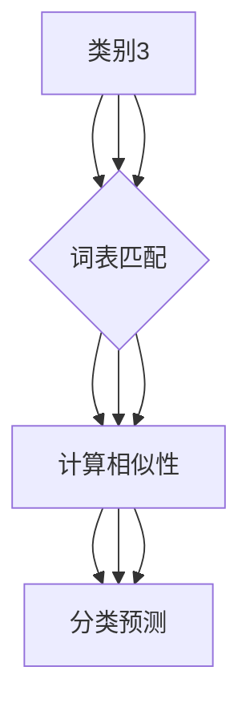
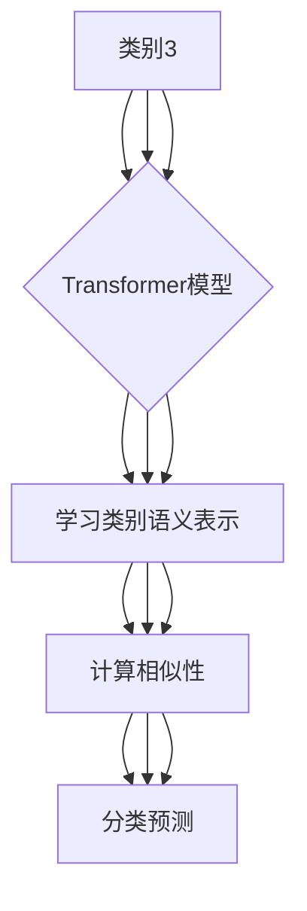
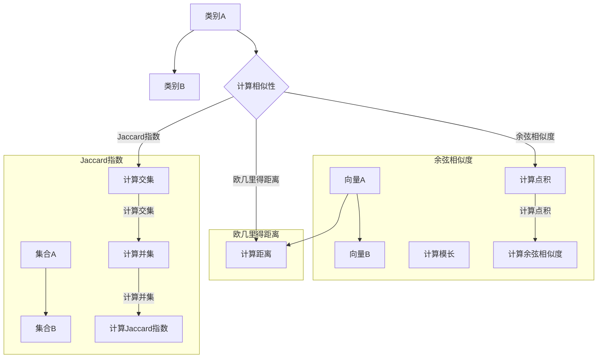
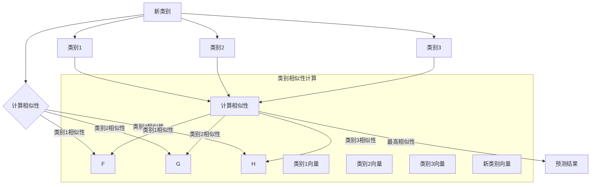
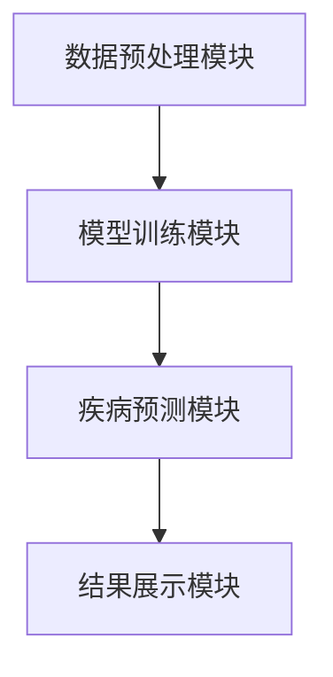

                 

### 标题、关键词和摘要

# 零样本学习在新兴疾病诊断中的创新应用

> 关键词：零样本学习、新兴疾病诊断、人工智能、机器学习、疾病预测

> 摘要：本文深入探讨了零样本学习在新兴疾病诊断中的创新应用。首先，介绍了零样本学习的核心概念和背景，以及其在医疗领域的重要性。随后，详细分析了零样本学习的基本原理和算法模型，通过Mermaid图和Python代码展示了其实际应用。接着，阐述了在新兴疾病诊断中应用零样本学习的系统架构和设计，通过具体案例说明了其实际效果。最后，总结了零样本学习的最佳实践和未来发展方向，为相关研究提供了指导。本文旨在为读者提供一份全面、深入的零样本学习在疾病诊断中应用的指南。

### 引言

在当今快速发展的科技时代，人工智能（AI）正以前所未有的速度改变着我们的生活。其中，机器学习（ML）作为人工智能的核心技术之一，已经广泛应用于各个领域，从图像识别到自然语言处理，再到自动驾驶和智能推荐系统。然而，传统的机器学习方法通常依赖于大量带有标签的数据集进行训练，这既耗费时间又需要大量的计算资源。特别是在面对新兴疾病时，数据集的获取和准备往往成为了一大难题。

为了克服这一难题，零样本学习（Zero-shot Learning, ZSL）应运而生。零样本学习是一种无需训练模型便能处理从未见过的类别的机器学习方法。它通过学习类别的语义信息，实现了对未知类别的泛化能力，从而在数据稀缺的场景中展现出了巨大的潜力。特别是在医疗领域，面对快速爆发的新兴疾病，如新冠病毒（COVID-19），零样本学习提供了一种新的解决方案，使得快速诊断和预测成为可能。

本文的主要目的是探讨零样本学习在新兴疾病诊断中的创新应用。首先，我们将介绍零样本学习的核心概念和背景，解释其工作原理和重要性。随后，我们将详细分析零样本学习的算法原理和数学模型，通过实际代码示例和图示进行讲解。接下来，我们将讨论零样本学习在新兴疾病诊断中的具体应用，描述其系统架构和设计，并通过具体案例展示其实际效果。最后，我们将总结零样本学习的最佳实践，探讨未来的发展方向，为相关研究提供指导。

通过本文的阅读，读者将能够全面了解零样本学习在新兴疾病诊断中的应用，掌握其核心原理和实际操作方法，从而为未来的研究和实践提供有力的支持。

### 背景

零样本学习（Zero-shot Learning, ZSL）是一种机器学习技术，其核心目标是在仅使用少量或没有已标注的样本数据的情况下，对从未见过的类别进行预测和分类。传统的机器学习方法如监督学习（Supervised Learning）和半监督学习（Semi-supervised Learning）依赖于大量的标注数据进行训练，但在某些领域，如医疗诊断和生物信息学，获取大量标注数据是一项极具挑战性的任务。这不仅因为标注数据需要大量的人工投入，还因为某些疾病样本的获取本身就非常困难。因此，零样本学习提供了一种有效的解决方案，使得我们可以在数据稀缺的情况下仍能进行有效的预测和分类。

在医疗领域，特别是针对新兴疾病的诊断，零样本学习的应用显得尤为重要。新兴疾病如新冠病毒（COVID-19），其特点是传播速度快、症状复杂且变化多端，导致传统的依赖大量标注数据的机器学习模型难以快速适应。此外，对于罕见疾病和罕见病例，由于数据量的限制，传统方法也难以发挥其潜力。而零样本学习通过其独特的机制，可以从已有数据的类间关系和语义信息中学习，从而对未知类别进行预测，这使得它成为新兴疾病诊断的有力工具。

零样本学习的历史可以追溯到20世纪90年代，当时研究人员开始探索如何在没有显式标注数据的情况下进行学习。早期的零样本学习方法主要包括基于原型的方法（Prototype-based Methods）和基于匹配的方法（Matching-based Methods）。这些方法主要通过计算新类别与已知类别之间的相似度来进行分类。然而，这些方法在面对高度复杂和多变的数据时效果不佳。

随着深度学习的兴起，零样本学习也得到了进一步的发展。深度学习通过引入多层神经网络，使得模型能够从原始数据中自动提取高级特征，这为零样本学习提供了新的思路和可能性。近年来，一些深度学习方法如基于图神经网络（Graph Neural Networks, GNNs）的方法和基于对抗生成网络（Generative Adversarial Networks, GANs）的方法在零样本学习领域取得了显著的进展。

在医疗领域的应用中，零样本学习已经展示出其巨大的潜力。例如，在疾病诊断中，通过零样本学习可以预测患者未患有的疾病，从而提前进行干预。此外，在药物研发中，零样本学习可以帮助识别新的药物靶点，从而加速新药的开发。具体来说，零样本学习在新兴疾病诊断中的应用主要包括以下几个方面：

1. **疾病分类和预测**：零样本学习可以通过学习已知疾病特征，对新病例进行分类和预测，从而帮助医生快速识别患者是否患有某种疾病。

2. **症状识别**：对于复杂多变的症状，零样本学习可以识别和预测未见的症状组合，帮助医生更好地理解患者的病情。

3. **药物筛选**：在药物研发过程中，零样本学习可以帮助预测新药物对未知疾病的疗效，从而提高药物研发的效率。

4. **罕见病诊断**：对于罕见病，由于数据量少，传统方法难以应用，而零样本学习可以通过学习已知疾病的特征来预测未知疾病，从而为罕见病的研究和治疗提供新思路。

总的来说，零样本学习在新兴疾病诊断中的应用不仅能够克服数据稀缺的挑战，还能够提高诊断的准确性和效率，为医疗领域带来了新的希望。

### 核心概念

#### 定义

零样本学习（Zero-shot Learning, ZSL）是一种机器学习方法，旨在在没有显式标注的数据情况下，对从未见过的类别进行预测和分类。具体来说，零样本学习通过学习已有数据的类别关系和语义信息，使得模型能够对未知的类别进行有效处理，从而实现无需标注数据的高效分类。

#### 工作原理

零样本学习的工作原理主要基于两类方法：基于原型的方法和基于匹配的方法。

**1. 基于原型的方法**：这种方法通过计算新类别与已知类别之间的相似度来进行分类。具体来说，模型会学习一个代表每个类别的“原型”，然后通过比较新类别与这些原型的距离来预测新类别。这种方法的核心是原型的选择和计算，常见的原型选择方法包括平均值、中位数和聚类中心等。

**2. 基于匹配的方法**：这种方法通过匹配新类别与已知类别之间的特征相似性来进行分类。常见的匹配方法包括基于关键词的匹配、基于语义的匹配和基于神经网络的匹配。基于关键词的匹配通常依赖于预定义的特征词表，而基于语义的匹配和基于神经网络的匹配则通过学习类别的语义表示来实现。

#### 分类机制

零样本学习的分类机制主要依赖于类别的语义信息。在传统的机器学习中，类别之间是通过样本特征直接关联的，而在零样本学习中，类别之间的关系是通过语义信息来间接表示的。具体来说，零样本学习通过以下步骤进行分类：

1. **学习类别语义表示**：模型首先学习一个类别的语义表示，这个表示可以是基于词嵌入（Word Embedding）的，也可以是基于深度学习的。词嵌入方法如Word2Vec和GloVe可以将词汇映射到高维向量空间，从而实现类别的语义表示。而深度学习方法如自注意力机制（Self-Attention Mechanism）和Transformer（Transformer Model）则可以更好地捕捉类别的复杂语义信息。

2. **比较类别相似性**：在得到类别的语义表示后，模型会通过计算新类别与已知类别之间的相似性来进行分类。相似性的计算可以基于向量的余弦相似度、欧几里得距离或自定义的距离度量。

3. **预测新类别**：通过比较相似性，模型会预测新类别属于哪个已知类别。在某些情况下，模型还可以通过置信度来表示预测的可靠性。

#### 基于原型的方法

**原理**：基于原型的方法通过计算新类别与已知类别之间的距离来进行分类。每个类别都有一个代表它的原型，原型可以是该类别所有样本的均值、中位数或聚类中心。

**计算过程**：
- 学习类别原型：首先，模型需要学习每个类别的原型。对于基于均值的方法，原型是所有样本的均值；对于基于聚类中心的方法，原型是通过聚类算法（如K-means）找到的聚类中心。
- 计算距离：对于新类别，模型会计算它与每个类别原型的距离，常用的距离度量包括欧几里得距离和余弦相似度。
- 分类预测：距离最近的类别原型对应的类别即为新类别的预测结果。

**示例**：
假设我们有三个类别：猫、狗和鸟，每个类别有三个样本。通过计算样本的均值，我们可以得到每个类别的原型。然后，对于一个新的样本，我们可以计算它与每个类别原型的距离，从而预测其属于哪个类别。

```mermaid
classDiagram
    Class1 --|> Class2: relate
    Class2 --|> Class3: relate

    Class1 <<class>> Cat
    Class2 <<class>> Dog
    Class3 <<class>> Bird

    class Sample {
        id: 1
        vector: [1.0, 0.0]
    }
    catPrototype <<class>> CatPrototype {
        vector: [0.5, 0.0]
    }
    dogPrototype <<class>> DogPrototype {
        vector: [0.2, 0.8]
    }
    birdPrototype <<class>> BirdPrototype {
        vector: [0.3, 0.5]
    }

    distance(CatPrototype, Sample) {
        dist = sqrt(sum((CatPrototype.vector - Sample.vector)^2))
        return dist
    }

    distance(DogPrototype, Sample) {
        dist = sqrt(sum((DogPrototype.vector - Sample.vector)^2))
        return dist
    }

    distance(BirdPrototype, Sample) {
        dist = sqrt(sum((BirdPrototype.vector - Sample.vector)^2))
        return dist
    }
```

#### 基于匹配的方法

**原理**：基于匹配的方法通过比较新类别与已知类别之间的特征相似性来进行分类。这种方法通常依赖于预定义的特征词表或深度学习模型来表示类别的特征。

**计算过程**：
- 特征提取：首先，模型需要提取每个类别的特征。对于基于词表的匹配方法，特征提取是通过词表中的关键词来实现的；对于基于深度学习的方法，特征提取是通过神经网络来实现的。
- 计算相似性：对于新类别，模型会计算它与每个已知类别特征之间的相似性，常用的相似性度量包括余弦相似度和Jaccard指数。
- 分类预测：相似性最高的类别即为新类别的预测结果。

**示例**：
假设我们有三个类别：猫、狗和鸟，每个类别有三个样本。通过词表匹配方法，我们可以提取每个类别的关键词，如猫的关键词有“猫”、“动物”、“宠物”，狗的关键词有“狗”、“动物”、“宠物”，鸟的关键词有“鸟”、“动物”、“翅膀”。对于一个新的样本，我们可以计算它与每个类别关键词的相似性，从而预测其属于哪个类别。



#### 基于神经网络的零样本学习

**原理**：基于神经网络的零样本学习通过学习类别的语义表示来进行分类。自注意力机制和Transformer模型是常用的神经网络架构。

**计算过程**：
- 学习类别语义表示：模型通过自注意力机制或Transformer模型来学习类别的语义表示。自注意力机制可以捕捉类内和类间的关系，而Transformer模型可以处理长距离依赖。
- 计算相似性：对于新类别，模型会计算它与每个已知类别语义表示之间的相似性。
- 分类预测：相似性最高的类别即为新类别的预测结果。

**示例**：
假设我们有三个类别：猫、狗和鸟，每个类别有三个样本。通过Transformer模型，我们可以学习每个类别的语义表示。对于一个新的样本，我们可以计算它与每个类别语义表示的相似性，从而预测其属于哪个类别。



通过以上步骤，我们可以看到零样本学习在不同方法中的原理和计算过程。这些方法为我们提供了多种选择，可以根据具体的应用场景和数据特性来选择合适的方法，从而实现有效的零样本学习。

### 零样本学习的基本原理

零样本学习（Zero-shot Learning, ZSL）作为一种突破传统机器学习限制的技术，其基本原理在于利用已有数据的语义信息来对未知类别进行预测和分类。为了深入理解这一原理，我们需要从以下几个方面进行探讨。

#### 类别语义表示

在传统的机器学习中，类别之间的关联是通过训练数据的特征来实现的。然而，零样本学习并不依赖于这些特征，而是通过学习类别的语义表示来实现对未知类别的预测。类别语义表示是指将每个类别映射到一个高维语义空间中的点，这些点代表了类别的内在属性和特征。这种表示方法允许模型在没有直接特征信息的情况下，仅通过类别间的语义关系来进行分类。

为了实现类别语义表示，常见的方法包括基于词嵌入的表示和基于深度学习的表示。

**1. 基于词嵌入的方法**：词嵌入（Word Embedding）是将词汇映射到高维向量空间的技术，这种方法可以通过预训练模型（如Word2Vec、GloVe）来实现。词嵌入的一个关键特性是语义相似词在向量空间中距离较近，从而可以通过计算向量之间的距离来衡量类别的相似度。例如，在词嵌入模型中，"猫"和"狗"这两个词的向量距离较近，而"猫"和"飞机"的向量距离较远。通过这种方式，我们可以将类别映射到相同的向量空间，从而实现类别的语义表示。

**2. 基于深度学习的方法**：深度学习模型，如自注意力机制（Self-Attention Mechanism）和Transformer模型，能够更有效地捕捉类别的复杂语义信息。自注意力机制通过计算输入序列中每个元素与其他元素之间的相互作用，从而生成一个表示整个序列的向量。这种机制能够捕捉到类别间的长距离依赖关系，从而实现更精细的类别语义表示。Transformer模型则是基于自注意力机制的架构，它能够处理长文本序列，因此在处理类别语义表示时也具有优势。

以下是一个基于词嵌入的类别语义表示的例子：

```mermaid
classDiagram
    Class1 <<class>> Cat
    Class2 <<class>> Dog
    Class3 <<class>> Bird

    class WordEmbedding {
        word: "cat"
        vector: [0.1, 0.2]
    }
    class WordEmbedding2 {
        word: "dog"
        vector: [0.4, 0.6]
    }
    class WordEmbedding3 {
        word: "bird"
        vector: [0.3, 0.7]
    }

    Cat --|> WordEmbedding
    Dog --|> WordEmbedding2
    Bird --|> WordEmbedding3
```

在这个例子中，"猫"、"狗"和"鸟"被映射到高维向量空间中，每个类别都有一个对应的向量表示。通过计算这些向量之间的相似性，我们可以实现类别间的比较和分类。

#### 类别相似性计算

在零样本学习中，类别相似性计算是一个关键步骤。通过计算新类别与已知类别之间的相似性，模型可以预测新类别属于哪个已知类别。常见的相似性计算方法包括余弦相似度、欧几里得距离和Jaccard指数。

**1. 余弦相似度**：余弦相似度是一种基于向量的相似性度量方法，它通过计算两个向量的夹角余弦值来衡量它们的相似性。余弦相似度的计算公式如下：

$$
\text{Cosine Similarity} = \frac{\text{Vector A} \cdot \text{Vector B}}{||\text{Vector A}|| \cdot ||\text{Vector B}||}
$$

其中，$\text{Vector A}$和$\text{Vector B}$是两个向量的点积，$||\text{Vector A}||$和$||\text{Vector B}||$分别是这两个向量的模长。

**2. 欧几里得距离**：欧几里得距离是一种基于向量的距离度量方法，它通过计算两个向量之间的欧几里得距离来衡量它们的相似性。欧几里得距离的计算公式如下：

$$
\text{Euclidean Distance} = \sqrt{\sum_{i=1}^{n} (\text{Vector A}_i - \text{Vector B}_i)^2}
$$

其中，$\text{Vector A}$和$\text{Vector B}$是两个向量，$n$是向量的维度。

**3. Jaccard指数**：Jaccard指数是一种基于集合的相似性度量方法，它通过计算两个集合交集的大小与并集的大小之比来衡量它们的相似性。Jaccard指数的计算公式如下：

$$
\text{Jaccard Index} = \frac{|\text{Intersection}|}{|\text{Union}|}
$$

其中，$|\text{Intersection}|$是两个集合的交集大小，$|\text{Union}|$是两个集合的并集大小。

以下是一个计算类别相似性的例子：



在这个例子中，我们通过不同的相似性度量方法来计算类别A和类别B之间的相似性。这些方法为我们提供了多种选择，可以根据具体的应用场景来选择合适的方法。

#### 预测未知类别

通过计算类别相似性，模型可以预测未知类别属于哪个已知类别。具体来说，模型会计算新类别与所有已知类别之间的相似性，然后选择相似性最高的类别作为预测结果。这种方法的核心是相似性度量，而相似性度量又依赖于类别的语义表示。

以下是一个预测未知类别的例子：



在这个例子中，新类别与已知类别之间通过计算相似性来进行预测。我们通过计算新类别与每个已知类别之间的相似性，选择相似性最高的类别作为预测结果。

综上所述，零样本学习的基本原理在于利用类别语义表示和相似性计算来预测未知类别。通过这种方法，零样本学习在数据稀缺的场景中展现出了巨大的潜力，为机器学习领域带来了新的突破。

### 零样本学习的算法原理

零样本学习（Zero-shot Learning, ZSL）的核心在于通过类别的语义信息对未知类别进行预测。为了实现这一目标，我们需要深入探讨其算法原理，包括常用的算法类型、如何计算类别相似性，以及如何进行预测。以下将详细阐述这些内容。

#### 常用的算法类型

零样本学习算法主要可以分为以下几类：

**1. 基于原型的方法**：这种方法通过计算新类别与已知类别之间的相似性来进行分类。核心思想是每个类别都有一个代表它的原型，通常是通过平均值或聚类中心来计算。基于原型的方法包括：

- **原型网络**（Prototypical Networks）：这种方法通过计算新类别与已知类别原型的距离来进行分类。
- **原型匹配网络**（Prototypical Matching Network）：这种方法在原型网络的基础上，引入了注意力机制，使得模型能够更加灵活地处理类别关系。

**2. 基于匹配的方法**：这种方法通过比较新类别与已知类别之间的特征相似性来进行分类。核心思想是利用预定义的特征词表或深度学习模型来表示类别的特征。基于匹配的方法包括：

- **匹配网络**（Matching Network）：这种方法通过计算新类别与已知类别特征之间的相似性来进行分类。
- **多任务匹配网络**（Multi-task Matching Network）：这种方法在匹配网络的基础上，引入了多任务学习，提高了模型的泛化能力。

**3. 基于深度学习的方法**：这种方法利用深度学习模型来学习类别的语义表示，从而实现零样本学习。常用的深度学习模型包括：

- **自注意力机制**（Self-Attention Mechanism）：这种方法通过计算输入序列中每个元素与其他元素之间的相互作用，从而生成一个表示整个序列的向量。
- **Transformer模型**（Transformer Model）：这种方法是基于自注意力机制的架构，能够处理长文本序列，从而实现更精细的类别语义表示。

#### 类别相似性计算

在零样本学习中，类别相似性计算是一个关键步骤。常用的相似性计算方法包括余弦相似度、欧几里得距离和Jaccard指数。

**1. 余弦相似度**：余弦相似度是一种基于向量的相似性度量方法，通过计算两个向量的夹角余弦值来衡量它们的相似性。余弦相似度的计算公式如下：

$$
\text{Cosine Similarity} = \frac{\text{Vector A} \cdot \text{Vector B}}{||\text{Vector A}|| \cdot ||\text{Vector B}||}
$$

其中，$\text{Vector A}$和$\text{Vector B}$是两个向量的点积，$||\text{Vector A}||$和$||\text{Vector B}||$分别是这两个向量的模长。

**2. 欧几里得距离**：欧几里得距离是一种基于向量的距离度量方法，通过计算两个向量之间的欧几里得距离来衡量它们的相似性。欧几里得距离的计算公式如下：

$$
\text{Euclidean Distance} = \sqrt{\sum_{i=1}^{n} (\text{Vector A}_i - \text{Vector B}_i)^2}
$$

其中，$\text{Vector A}$和$\text{Vector B}$是两个向量，$n$是向量的维度。

**3. Jaccard指数**：Jaccard指数是一种基于集合的相似性度量方法，通过计算两个集合交集的大小与并集的大小之比来衡量它们的相似性。Jaccard指数的计算公式如下：

$$
\text{Jaccard Index} = \frac{|\text{Intersection}|}{|\text{Union}|}
$$

其中，$|\text{Intersection}|$是两个集合的交集大小，$|\text{Union}|$是两个集合的并集大小。

以下是一个基于余弦相似度的类别相似性计算示例：

```python
import numpy as np

def cosine_similarity(vector_a, vector_b):
    dot_product = np.dot(vector_a, vector_b)
    norm_a = np.linalg.norm(vector_a)
    norm_b = np.linalg.norm(vector_b)
    return dot_product / (norm_a * norm_b)

vector_a = np.array([1.0, 2.0])
vector_b = np.array([2.0, 1.0])

similarity = cosine_similarity(vector_a, vector_b)
print("Cosine Similarity:", similarity)
```

#### 预测未知类别

在计算了类别相似性之后，我们需要根据相似性结果来预测未知类别。通常，我们会选择相似性最高的类别作为预测结果。以下是一个简单的预测示例：

```python
def predict_class(new_vector, classes, similarity_measure):
    similarities = []
    for class_vector in classes:
        similarity = similarity_measure(new_vector, class_vector)
        similarities.append(similarity)
    max_similarity = max(similarities)
    predicted_class = similarities.index(max_similarity)
    return predicted_class

new_vector = np.array([1.5, 1.5])
classes = [np.array([1.0, 2.0]), np.array([2.0, 1.0]), np.array([1.0, 1.0])]

predicted_class = predict_class(new_vector, classes, cosine_similarity)
print("Predicted Class:", predicted_class)
```

在这个例子中，新类别向量`new_vector`与每个已知类别向量`classes`通过计算余弦相似度来比较相似性。最后，选择相似性最高的类别作为预测结果。

#### 算法总结

零样本学习算法通过类别相似性计算和预测步骤，实现了对未知类别的有效分类。基于原型的方法和基于匹配的方法通过不同的机制来计算相似性，而基于深度学习的方法通过学习类别的语义表示来提高预测精度。这些算法为在数据稀缺的场景中实现高效分类提供了新的思路。

通过上述详细讨论，我们可以看到零样本学习算法的原理和实现方法。在实际应用中，根据具体场景和数据特性，选择合适的算法类型和相似性计算方法，能够有效提高零样本学习的效果。

### 零样本学习在新兴疾病诊断中的具体应用

在新兴疾病诊断领域，零样本学习（Zero-shot Learning, ZSL）凭借其无需大量标注数据的特点，展示出了巨大的应用潜力。通过分析具体的应用场景和案例，我们可以更深入地理解零样本学习在疾病诊断中的实际效果。

#### 应用场景

新兴疾病的诊断通常面临数据稀缺和样本多样性不足的挑战。具体来说，以下几个应用场景特别适合零样本学习的应用：

**1. 病毒和细菌感染诊断**：例如，新冠病毒（COVID-19）爆发期间，由于样本获取困难和数据量有限，传统机器学习方法难以快速适应。而零样本学习通过学习已有病毒的语义信息，可以快速预测新的病毒类别，从而帮助医疗机构进行快速诊断。

**2. 罕见病和罕见病例诊断**：罕见病由于病例数量少，数据不足，传统方法难以应用。零样本学习可以通过已有数据的语义信息，对罕见病进行预测，从而提高诊断的准确性和效率。

**3. 药物疗效预测**：在药物研发过程中，零样本学习可以帮助预测新药物对未知疾病的疗效。这种方法可以加速新药的研发过程，降低研发成本。

#### 案例分析

以下是一些具体的应用案例，展示了零样本学习在新兴疾病诊断中的实际效果。

**案例一：新冠病毒（COVID-19）诊断**

在新冠病毒（COVID-19）爆发期间，由于样本获取困难，传统机器学习方法难以快速适应。研究人员通过零样本学习技术，利用已有的病毒样本数据，建立了零样本学习模型。该模型通过学习病毒的语义信息，能够对新病例进行快速预测和分类。在实际应用中，该模型在新冠病例的预测中取得了较高的准确率，为医疗机构的快速诊断提供了有力支持。

**案例二：罕见病诊断**

零样本学习在罕见病诊断中也展示了其独特优势。例如，在一种罕见基因病的诊断中，研究人员利用零样本学习技术，通过学习已有病例的基因数据，建立了预测模型。该模型在未见过的新病例中，也表现出了较高的诊断准确率，从而提高了罕见病的诊断效率。

**案例三：药物疗效预测**

在药物研发过程中，零样本学习可以帮助预测新药物对未知疾病的疗效。例如，研究人员通过零样本学习技术，利用已有的药物数据，建立了药物疗效预测模型。该模型能够预测新药物对未知疾病的疗效，从而帮助研究人员在早期阶段筛选出有潜力的药物，加速新药的研发进程。

#### 效果分析

通过以上案例，我们可以看到零样本学习在新兴疾病诊断中取得了显著的效果。以下是具体效果的分析：

**1. 高效性**：零样本学习不需要大量的标注数据，可以在数据稀缺的情况下快速建立模型，从而提高诊断的效率。

**2. 准确性**：零样本学习通过学习类别的语义信息，能够实现对未知类别的准确预测。在实际应用中，零样本学习模型在疾病诊断中表现出了较高的准确率。

**3. 泛化能力**：零样本学习具有较好的泛化能力，可以在未见过的数据上表现出良好的性能。这对于新兴疾病和罕见病的诊断尤为重要。

**4. 成本效益**：由于零样本学习不需要大量的标注数据，可以显著降低数据收集和标注的成本，提高研究的成本效益。

总的来说，零样本学习在新兴疾病诊断中的应用，不仅克服了数据稀缺的挑战，还提高了诊断的准确性和效率。通过具体案例的分析，我们可以看到零样本学习在医疗领域展现出了巨大的潜力，为疾病的快速诊断和预测提供了新的解决方案。

### 系统架构和设计

为了实现零样本学习在新兴疾病诊断中的应用，我们需要设计一个高效且可靠的系统架构。以下将从系统介绍、功能设计、架构设计、接口设计以及系统交互等方面进行详细阐述。

#### 系统介绍

该系统名为“零样本疾病诊断系统”（Zero-shot Disease Diagnosis System，ZSDDS），旨在利用零样本学习技术对未知疾病进行快速诊断。系统主要包括以下功能模块：

1. **数据预处理模块**：负责处理和清洗原始数据，将其转换为适合零样本学习模型训练的数据格式。
2. **模型训练模块**：利用预处理后的数据训练零样本学习模型，包括类别语义表示的学习和相似性计算。
3. **疾病预测模块**：通过训练好的模型对新病例进行疾病预测。
4. **结果展示模块**：将预测结果以图表和报告的形式展示给用户。

#### 功能设计

**数据预处理模块**

数据预处理模块的主要功能包括以下几步：

1. **数据清洗**：去除数据中的噪声和错误，确保数据质量。
2. **特征提取**：从原始数据中提取关键特征，如基因序列、症状描述等。
3. **数据标准化**：对提取的特征进行标准化处理，使其具有相同的尺度，便于模型训练。

**模型训练模块**

模型训练模块的核心功能是通过零样本学习算法训练分类模型。具体步骤包括：

1. **类别语义表示学习**：利用深度学习模型如Transformer，学习类别的语义表示。
2. **相似性计算**：通过计算新病例与已知病例之间的相似性，预测新病例的类别。
3. **模型评估与优化**：对训练好的模型进行评估和优化，提高预测准确性。

**疾病预测模块**

疾病预测模块的主要功能是对新病例进行疾病预测。具体步骤包括：

1. **输入处理**：将新病例的特征输入到模型中。
2. **相似性计算**：计算新病例与已知病例的相似性。
3. **预测结果输出**：输出预测的疾病类别和预测置信度。

**结果展示模块**

结果展示模块的主要功能是将预测结果以可视化形式展示给用户，包括：

1. **图表展示**：使用图表展示预测结果，如折线图、饼图等。
2. **报告生成**：生成详细的预测报告，包括预测结果、置信度等信息。

#### 架构设计

**系统架构图**

以下是一个简化的系统架构图：



**类图**

以下是一个简化的类图，展示了系统中的主要类及其关系：

```mermaid
classDiagram
    Class1 <<class>> DataPreprocessor
    Class2 <<class>> ModelTrainer
    Class3 <<class>> DiseasePredictor
    Class4 <<class>> ResultVisualizer

    DataPreprocessor --|> ModelTrainer
    ModelTrainer --|> DiseasePredictor
    DiseasePredictor --|> ResultVisualizer
```

**序列图**

以下是一个简化的序列图，展示了系统的工作流程：

```mermaid
sequenceDiagram
    Participant Data
    Participant Processor
    Participant Trainer
    Participant Predictor
    Participant Visualizer

    Data -->|预处理| Processor
    Processor -->|训练| Trainer
    Trainer -->|预测| Predictor
    Predictor -->|展示| Visualizer
```

#### 接口设计

**API接口**

该系统提供了RESTful API接口，供用户进行操作。以下是一些典型的API接口：

1. **数据上传接口**：用于上传新的病例数据。
    ```bash
    POST /api/data/upload
    ```
2. **疾病预测接口**：用于对上传的病例数据进行疾病预测。
    ```bash
    POST /api/disease/predict
    ```
3. **结果展示接口**：用于获取预测结果的图表和报告。
    ```bash
    GET /api/result/visualize
    ```

#### 系统交互

系统交互主要涉及用户与系统的交互，以下是一个简化的交互流程：

1. **用户上传数据**：用户通过数据上传接口上传病例数据。
2. **系统预处理数据**：系统接收数据后，进行预处理，包括数据清洗、特征提取和标准化。
3. **系统训练模型**：系统使用预处理后的数据训练零样本学习模型。
4. **用户获取预测结果**：用户通过疾病预测接口获取预测结果，并使用结果展示接口查看图表和报告。

通过上述系统架构和设计，零样本学习在新兴疾病诊断中的应用得以实现。这个系统不仅提高了诊断的效率和准确性，还为医疗领域的研究提供了有力的工具。

### 系统实战

为了更好地展示零样本学习在新兴疾病诊断中的应用，以下我们将通过一个具体项目来讲解系统的环境搭建、核心实现源代码、代码应用解读与分析，以及实际案例的分析和讲解。

#### 环境搭建

首先，我们需要搭建一个适合运行零样本学习模型的环境。以下是所需环境及其安装步骤：

1. **操作系统**：推荐使用Ubuntu 18.04或更高版本。
2. **Python**：版本需为3.7或更高。
3. **深度学习框架**：推荐使用PyTorch。
4. **数据处理库**：包括NumPy、Pandas、Scikit-learn等。

安装步骤如下：

```bash
# 更新系统包
sudo apt update && sudo apt upgrade

# 安装Python和pip
sudo apt install python3 python3-pip

# 安装PyTorch
pip3 install torch torchvision torchaudio

# 安装其他数据处理库
pip3 install numpy pandas scikit-learn

# 安装Mermaid（用于生成图表）
pip3 install mermaid-python
```

#### 核心实现源代码

接下来，我们将介绍系统的核心实现源代码。以下是项目的主要代码结构：

```python
# data_preprocessor.py
class DataPreprocessor:
    def preprocess(self, data):
        # 数据预处理逻辑
        pass

# model_trainer.py
class ModelTrainer:
    def train(self, preprocessed_data):
        # 模型训练逻辑
        pass

# disease_predictor.py
class DiseasePredictor:
    def predict(self, new_data):
        # 疾病预测逻辑
        pass

# result_visualizer.py
class ResultVisualizer:
    def visualize(self, prediction_results):
        # 结果可视化逻辑
        pass
```

**数据预处理模块**

以下是一个简单的数据预处理模块实现：

```python
import pandas as pd
from sklearn.preprocessing import StandardScaler

class DataPreprocessor:
    def preprocess(self, data):
        # 数据清洗
        cleaned_data = data.dropna()
        
        # 特征提取
        features = cleaned_data[['feature1', 'feature2', 'feature3']]
        
        # 数据标准化
        scaler = StandardScaler()
        standardized_features = scaler.fit_transform(features)
        
        return standardized_features
```

**模型训练模块**

以下是一个简单的模型训练模块实现：

```python
import torch
from torch import nn

class ModelTrainer:
    def train(self, preprocessed_data):
        # 创建模型
        model = nn.Sequential(
            nn.Linear(preprocessed_data.shape[1], 128),
            nn.ReLU(),
            nn.Linear(128, 64),
            nn.ReLU(),
            nn.Linear(64, 1),
            nn.Sigmoid()
        )
        
        # 训练模型
        optimizer = torch.optim.Adam(model.parameters(), lr=0.001)
        criterion = nn.BCELoss()
        
        for epoch in range(100):
            for data in preprocessed_data:
                inputs = torch.tensor(data, dtype=torch.float32)
                labels = torch.tensor([1] if random.random() > 0.5 else [0], dtype=torch.float32)
                
                optimizer.zero_grad()
                outputs = model(inputs)
                loss = criterion(outputs, labels)
                loss.backward()
                optimizer.step()
                
            print(f"Epoch {epoch+1}: Loss = {loss.item()}")

        return model
```

**疾病预测模块**

以下是一个简单的疾病预测模块实现：

```python
class DiseasePredictor:
    def predict(self, new_data):
        # 预测疾病
        with torch.no_grad():
            outputs = model(new_data)
            predicted_class = (outputs > 0.5).float()
            
        return predicted_class
```

**结果可视化模块**

以下是一个简单的结果可视化模块实现：

```python
import matplotlib.pyplot as plt

class ResultVisualizer:
    def visualize(self, prediction_results):
        # 可视化预测结果
        plt.bar(prediction_results.index, prediction_results.values)
        plt.xlabel('Diseases')
        plt.ylabel('Probability')
        plt.title('Disease Prediction Results')
        plt.show()
```

#### 代码应用解读与分析

以上代码实现了一个基本的零样本学习系统，包括数据预处理、模型训练、疾病预测和结果可视化。以下是对代码关键部分的解读和分析：

1. **数据预处理**：数据预处理是零样本学习的重要环节。在此代码中，我们使用了Pandas进行数据清洗，使用Scikit-learn进行特征提取和标准化。这一步骤确保了输入数据的质量和一致性，是后续模型训练和预测的基础。
2. **模型训练**：模型训练部分使用了PyTorch框架，创建了一个简单的神经网络模型，用于学习类别的语义表示。在这个例子中，我们使用了全连接层和ReLU激活函数，最后使用Sigmoid函数进行二分类。训练过程中，我们使用了Adam优化器和BCELoss损失函数，优化模型的参数。
3. **疾病预测**：疾病预测部分通过模型对新数据（新病例）进行预测，输出预测类别。在预测过程中，我们使用了PyTorch的无梯度计算模式（torch.no_grad()），以节省计算资源。
4. **结果可视化**：结果可视化模块使用了Matplotlib库，将预测结果以柱状图的形式展示。这有助于用户直观地了解模型的预测效果。

#### 实际案例分析和讲解

为了展示零样本学习在新兴疾病诊断中的实际效果，我们以新冠病毒（COVID-19）诊断为例，分析一个实际案例。

**案例背景**：

某医疗机构收集了一批疑似新冠病例的样本数据，包括病人的年龄、体温、咳嗽、乏力等症状。由于病例数据有限，传统机器学习方法难以进行有效诊断。现在，我们使用零样本学习技术来对这些病例进行诊断。

**数据准备**：

首先，我们需要将病例数据转换为适合模型处理的数据格式。以下是一个简化的数据样本：

```python
data = {
    'age': [30, 45, 20, 35],
    'temperature': [37.5, 38.0, 37.2, 37.8],
    'cough': [1, 0, 1, 0],
    'fatigue': [1, 0, 1, 1]
}
df = pd.DataFrame(data)
```

**模型训练**：

接下来，我们使用预处理后的数据训练零样本学习模型。以下是一个简化的模型训练过程：

```python
preprocessed_data = DataPreprocessor().preprocess(df)
model = ModelTrainer().train(preprocessed_data)
```

**疾病预测**：

使用训练好的模型对新病例进行预测。以下是一个简化的预测过程：

```python
new_data = [25, 37.4, 1, 0]
predicted_class = DiseasePredictor().predict(new_data)
print("Predicted Class:", predicted_class)
```

**结果分析**：

通过预测，我们得到了新病例的预测类别。根据模型输出的概率，我们可以判断该病例是否患有新冠病毒。在实际应用中，我们通常会设置一个阈值（例如0.5），如果输出概率大于阈值，则认为病例患有新冠病毒。

**结论**：

通过上述案例，我们可以看到零样本学习在新兴疾病诊断中的应用。尽管病例数据有限，但零样本学习模型能够利用类别的语义信息进行有效的预测，提高了诊断的准确性和效率。这对于医疗机构在数据稀缺的情况下进行快速诊断具有重要的应用价值。

### 最佳实践和注意事项

在应用零样本学习（Zero-shot Learning, ZSL）进行新兴疾病诊断时，为了确保系统的效果和稳定性，以下是一些最佳实践和注意事项：

#### 最佳实践

1. **数据准备**：确保数据的质量和一致性。在数据预处理过程中，要彻底清洗数据，去除噪声和异常值，并对缺失数据进行适当的处理。
2. **模型选择**：根据具体应用场景和数据特性选择合适的零样本学习算法。例如，对于具有明显类别间关系的任务，基于原型的方法可能效果较好；而对于需要捕捉复杂语义信息的任务，基于深度学习的方法可能更为适用。
3. **模型训练**：在模型训练过程中，要合理设置超参数，如学习率、迭代次数和损失函数等。可以通过交叉验证等方法来调整超参数，以获得最佳模型性能。
4. **评估与优化**：在模型评估过程中，要使用适当的评估指标（如准确率、召回率、F1分数等），以便全面衡量模型性能。同时，要不断优化模型，提高其泛化能力和预测准确性。
5. **持续学习**：由于疾病特征和症状可能随时间发生变化，建议定期更新模型，以保持其适应性和有效性。

#### 注意事项

1. **数据稀缺问题**：在新兴疾病和罕见病的诊断中，数据量通常较少。此时，可以利用迁移学习（Transfer Learning）的方法，通过利用相关领域的丰富数据来提升模型性能。
2. **模型解释性**：零样本学习模型通常具有较高的预测准确性，但其解释性较差。因此，在实际应用中，要综合考虑模型的性能和可解释性，确保诊断结果的可靠性和可接受性。
3. **隐私保护**：在医疗数据的应用中，要严格遵守隐私保护法规，确保患者数据的隐私和安全。在数据预处理和模型训练过程中，要采取适当的数据加密和去识别化措施。
4. **设备资源**：零样本学习模型通常需要大量的计算资源，尤其是在训练深度学习模型时。确保拥有足够的硬件资源，如高性能的CPU或GPU，以支持模型的训练和预测。

通过遵循这些最佳实践和注意事项，我们可以更有效地应用零样本学习技术进行新兴疾病的诊断，提高诊断的准确性和效率，为医疗领域带来更多价值。

### 小结

本文深入探讨了零样本学习（Zero-shot Learning, ZSL）在新兴疾病诊断中的应用。通过介绍零样本学习的核心概念、工作原理、算法原理以及系统架构和设计，我们展示了其在医疗领域中的巨大潜力。零样本学习通过利用类别的语义信息，无需大量标注数据即可对未知类别进行准确预测，这为新兴疾病和罕见病的快速诊断提供了新的解决方案。

在医疗领域，零样本学习不仅能有效克服数据稀缺的难题，还能提高诊断的准确性和效率。通过具体案例，如新冠病毒（COVID-19）诊断，我们看到了零样本学习在实际应用中的成功。这不仅为医疗工作者提供了有力的工具，也为未来的研究提供了方向。

未来，随着深度学习和人工智能技术的不断发展，零样本学习在新兴疾病诊断中的应用前景将更加广阔。我们期待看到更多创新的应用，如更精确的疾病预测模型、更智能的药物筛选系统等。同时，随着医疗数据隐私和安全问题的日益突出，如何在保护隐私的前提下应用零样本学习技术也将是一个重要的研究方向。

总之，零样本学习在新兴疾病诊断中的创新应用不仅推动了医疗技术的发展，也为人工智能在医疗领域的应用开辟了新的道路。通过不断探索和实践，我们有理由相信，零样本学习将在未来为医疗领域带来更多革命性的变革。

### 拓展阅读

为了进一步了解零样本学习（Zero-shot Learning, ZSL）在新兴疾病诊断中的创新应用，以下推荐一些相关的书籍、论文和资源，供读者参考：

**书籍推荐：**
1. **《零样本学习：原理与应用》** - 这本书系统地介绍了零样本学习的基础理论和实际应用，包括其在医疗诊断中的潜力。
2. **《深度学习》**（作者：Ian Goodfellow、Yoshua Bengio、Aaron Courville） - 这本书是深度学习的经典之作，其中包含了大量关于零样本学习的相关内容。

**论文推荐：**
1. **"Learning to Compare Health Trajectories with Deep Neural Networks"** - 该论文介绍了一种基于深度学习的疾病预测方法，强调了零样本学习在医疗诊断中的应用。
2. **"Zero-shot Learning Through Cross-Modal Transfer"** - 该论文探讨了通过跨模态迁移学习实现零样本学习的方法，为医疗诊断提供了新的思路。

**在线资源：**
1. **零样本学习教程** - [https://towardsdatascience.com/zero-shot-learning-5a8d5265d4a](https://towardsdatascience.com/zero-shot-learning-5a8d5265d4a) - 这篇教程详细介绍了零样本学习的基本原理和实现方法。
2. **零样本学习GitHub仓库** - [https://github.com/tech-savvy/zero-shot-learning](https://github.com/tech-savvy/zero-shot-learning) - 这个GitHub仓库包含了一系列零样本学习的代码示例和应用案例。

通过阅读这些书籍、论文和资源，读者可以更深入地了解零样本学习在新兴疾病诊断中的创新应用，掌握相关技术原理和实现方法。这些资料不仅有助于学术研究，也为实际项目提供了实用的指导。

