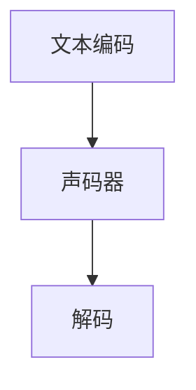
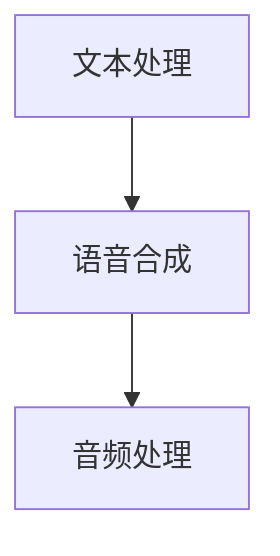

                 

# 零样本语音合成在个性化语音助手中的应用

关键词：零样本语音合成、个性化语音助手、语音合成技术、自然语言处理、人工智能

摘要：本文从背景介绍、核心概念与联系、算法原理讲解、应用案例与项目实战以及总结与展望等多个角度，详细探讨了零样本语音合成在个性化语音助手中的应用。通过对零样本语音合成的定义、基本原理、算法实现及优化方法等方面的深入分析，结合实际应用案例，本文旨在为读者提供一个全面的技术视角，帮助理解零样本语音合成的应用潜力及其面临的挑战。

## 目录大纲

### 第一部分：背景介绍

1. **第1章：问题背景与核心概念**
    - **1.1 语音合成技术概述**
    - **1.2 零样本语音合成的挑战与机遇**
    - **1.3 零样本语音合成技术发展现状**

### 第二部分：核心概念与联系

2. **第2章：核心概念原理与特性对比**
    - **2.1 零样本语音合成的基本原理**
    - **2.2 零样本语音合成的属性特征对比**

3. **第3章：概念联系与拓展**
    - **3.1 零样本语音合成与语音识别的关系**
    - **3.2 零样本语音合成与自然语言处理结合**

### 第三部分：算法原理讲解

4. **第4章：零样本语音合成算法详解**
    - **4.1 零样本语音合成的算法框架**
    - **4.2 数学模型与公式解释**
    - **4.3 算法举例说明**

5. **第5章：实现与优化**
    - **5.1 系统架构设计**
    - **5.2 性能优化方法**

### 第四部分：应用案例与项目实战

6. **第6章：零样本语音合成在语音助手中的应用案例**
    - **6.1 个性化语音助手的需求分析**
    - **6.2 应用案例介绍**

7. **第7章：项目实战**
    - **7.1 环境准备与安装**
    - **7.2 系统核心实现源代码解读**
    - **7.3 应用解读与分析**

### 第五部分：总结与展望

8. **第8章：总结与展望**
    - **8.1 零样本语音合成技术总结**
    - **8.2 未来发展方向与展望**

9. **第9章：最佳实践与注意事项**
    - **9.1 最佳实践建议**
    - **9.2 小结与拓展阅读**

---

### 第一部分：背景介绍

#### 第1章：问题背景与核心概念

##### **1.1 语音合成技术概述**

语音合成技术，又称文本到语音（Text-to-Speech，TTS）技术，是一种将书面文本自动转换为自然流畅的语音的技术。在过去的几十年里，语音合成技术经历了从规则方法到基于统计方法，再到深度学习方法的演变。TTS技术在多个领域有着广泛的应用，包括语音助手、车载导航、电子客服、有声读物等。

在个性化语音助手领域，语音合成技术的重要性不言而喻。个性化语音助手需要能够根据用户的需求和偏好，生成自然的语音输出，为用户提供个性化的交互体验。传统的TTS技术通常依赖于大量已标注的训练数据，而零样本语音合成则旨在在没有或只有少量训练数据的情况下，也能够生成高质量的语音。

##### **1.2 零样本语音合成的挑战与机遇**

零样本语音合成（Zero-shot Speech Synthesis）是指在没有或只有少量标注数据的情况下，利用模型自动生成语音的技术。与传统的TTS技术相比，零样本语音合成面临着以下几个挑战：

1. **数据稀缺**：传统的TTS模型通常需要大量的语音和文本对进行训练，而零样本语音合成需要在没有足够数据的情况下工作，这要求模型具备较强的泛化能力。
2. **多样性不足**：传统的TTS模型可能会过度拟合于训练数据，导致生成的语音缺乏多样性。零样本语音合成需要确保生成的语音既符合语言规则，又能够满足个性化需求。
3. **实时性要求**：语音合成需要在短时间内完成，以满足实时交互的需求。这要求零样本语音合成算法具有较高的效率和实时性。

然而，零样本语音合成也带来了诸多机遇：

1. **扩展性**：零样本语音合成能够处理新出现的语音输入，无需重新训练模型，这为个性化语音助手提供了强大的扩展能力。
2. **个性化**：通过零样本语音合成，个性化语音助手能够更好地适应用户的需求和偏好，提供更加个性化的交互体验。
3. **多语言支持**：零样本语音合成使得个性化语音助手能够轻松支持多种语言，无需为每种语言准备专门的语音数据。

##### **1.3 零样本语音合成技术发展现状**

当前，零样本语音合成技术主要基于深度学习模型，如自动回归模型、转换器模型等。以下是一些主流的零样本语音合成方法：

1. **基于转换器模型的方法**：如Transformer-XL和BERT等预训练模型，通过预训练和微调，可以在少量数据的情况下实现高质量的语音合成。
2. **基于自动回归模型的方法**：如WaveNet和Tacotron等，通过生成语音波形序列，实现高质量的语音输出。
3. **多模态融合方法**：结合文本、图像、音频等多种数据源，提高语音合成的多样性和自然度。

近年来，随着深度学习技术的不断发展，零样本语音合成的性能逐渐提升，已在多个应用场景中得到验证。然而，零样本语音合成仍面临许多挑战，如模型复杂度、计算资源需求等，这些都需要进一步的研究和优化。

### 第二部分：核心概念与联系

#### 第2章：核心概念原理与特性对比

##### **2.1 零样本语音合成的基本原理**

零样本语音合成的基本原理是利用深度学习模型，将文本转换为语音信号。通常，模型首先通过预训练学习大量未标注的文本数据，然后通过微调，使其能够生成特定语音特征的语音。这种方法的核心在于模型的泛化能力和自适应能力，使得模型能够在未见过的数据上生成高质量的语音。

##### **2.2 零样本语音合成的属性特征对比**

| 特性       | 零样本语音合成          | 传统语音合成          |
|------------|------------------------|------------------------|
| 数据需求   | 无需大量标注数据       | 需要大量标注语音数据   |
| 泛化能力   | 较强，适应新数据       | 较弱，依赖训练数据     |
| 个性化支持 | 较强，可适应个性化需求 | 较弱，需定制化模型     |
| 实时性     | 一般，取决于模型效率   | 较高，传统方法效率高   |

#### 第3章：概念联系与拓展

##### **3.1 零样本语音合成与语音识别的关系**

语音识别（Speech Recognition）是另一种重要的语音处理技术，它将语音信号转换为文本。零样本语音合成与语音识别之间存在密切的联系：

- **互补关系**：语音识别为语音合成提供了输入文本，而语音合成则为语音识别提供了输出语音。两者的结合可以实现完整的语音交互系统。
- **共同挑战**：零样本语音合成和语音识别都面临着数据稀缺和实时性要求等挑战，需要通过深度学习模型和优化算法来应对。

##### **3.2 零样本语音合成与自然语言处理结合**

自然语言处理（Natural Language Processing，NLP）是人工智能领域的一个重要分支，它涉及文本的生成、理解和处理。零样本语音合成与NLP的结合，可以实现更加智能和个性化的语音交互：

- **文本生成**：NLP技术可以用于生成个性化的文本，为语音合成提供高质量的输入文本。
- **语音理解**：通过NLP技术，可以更好地理解用户的语音输入，提高语音合成的准确性和适应性。

### 第三部分：算法原理讲解

#### 第4章：零样本语音合成算法详解

##### **4.1 零样本语音合成的算法框架**

零样本语音合成的算法框架通常包括以下几个主要步骤：

1. **文本编码**：将输入文本编码为向量表示。
2. **声码器**：将文本向量转换为语音波形。
3. **解码**：从语音波形中提取语音特征。

以下是一个简单的算法框架的Mermaid流程图：



##### **4.2 数学模型与公式解释**

零样本语音合成的数学模型通常基于深度学习，以下是一个简化的数学模型：

$$
\text{语音合成} = f(\text{文本向量}, \theta)
$$

其中，$f$ 是一个深度学习模型，$\text{文本向量}$ 是文本的向量表示，$\theta$ 是模型的参数。

在声码器部分，常用的模型是WaveNet或Tacotron，其核心是生成语音波形的概率分布。以下是一个简化的WaveNet的数学模型：

$$
p(\text{语音波形} | \text{文本向量}, \theta) = \prod_{t=1}^{T} p(\text{语音波形}_t | \text{文本向量}, \theta)
$$

其中，$T$ 是语音波形的长度，$p(\text{语音波形}_t | \text{文本向量}, \theta)$ 是在给定文本向量和模型参数的情况下，生成第 $t$ 个语音波形的概率。

##### **4.3 算法举例说明**

假设我们要合成一句话“Hello, how are you?”的语音。首先，我们需要将这句话编码为文本向量。然后，利用声码器生成语音波形，最后通过解码器提取语音特征。

1. **文本编码**：使用预训练的BERT模型，将文本编码为一个固定长度的向量。
2. **声码器**：使用Tacotron模型，将文本向量转换为语音波形。Tacotron模型的核心是一个编码器-解码器框架，其中编码器将文本向量编码为一个固定长度的隐藏状态，解码器则使用这个隐藏状态生成语音波形。
3. **解码**：使用 Griffin-Lim 解码器，从语音波形中提取语音特征，如 Mel 带宽频率（Mel-spectrogram）。

### 第5章：实现与优化

#### **5.1 系统架构设计**

零样本语音合成系统的架构设计需要考虑多个方面，包括文本处理、语音合成、音频处理等模块。以下是一个简化的系统架构：

1. **文本处理模块**：负责接收用户输入的文本，将其编码为文本向量。
2. **语音合成模块**：使用深度学习模型，将文本向量转换为语音波形。
3. **音频处理模块**：对合成的语音进行后处理，如去噪、增强等，以提高语音质量。

以下是一个简化的Mermaid架构图：



#### **5.2 性能优化方法**

零样本语音合成的性能优化是一个复杂的过程，涉及多个方面：

1. **模型优化**：通过调整模型结构、参数初始化策略、正则化方法等，提高模型性能。
2. **数据增强**：通过数据增强技术，如文本转写、语音变换等，增加训练数据的多样性，提高模型泛化能力。
3. **硬件加速**：利用GPU、TPU等硬件加速器，提高模型训练和推理速度。
4. **模型压缩**：通过模型压缩技术，如量化、剪枝等，减少模型参数数量，提高模型效率。

### 第四部分：应用案例与项目实战

#### **6.1 个性化语音助手的需求分析**

个性化语音助手的需求主要包括：

- **个性化语音合成**：根据用户的偏好，生成符合其声音特点的语音。
- **多语言支持**：支持多种语言，满足不同用户的需求。
- **实时性**：能够快速响应用户的语音输入，提供即时的语音反馈。
- **可扩展性**：能够适应新出现的语音输入和任务需求。

#### **6.2 应用案例介绍**

某语音助手产品的实现过程主要包括以下几个步骤：

1. **需求分析**：根据用户需求，确定个性化语音合成的功能需求。
2. **数据收集**：收集大量文本和语音数据，用于模型训练和优化。
3. **模型训练**：使用预训练的深度学习模型，进行微调和训练，实现高质量的语音合成。
4. **系统集成**：将语音合成模块集成到语音助手系统中，实现个性化语音合成的功能。
5. **测试与优化**：对合成的语音进行测试和优化，确保语音质量满足用户需求。

在实现过程中，使用了以下技术：

- **深度学习模型**：如BERT、Tacotron等，用于文本向量和语音波形的转换。
- **语音合成引擎**：如Amazon Polly、Google Text-to-Speech等，用于生成高质量的语音。
- **音频处理库**：如OpenSMC、librosa等，用于音频处理和增强。

#### **7.1 环境准备与安装**

要实现零样本语音合成系统，需要安装以下软件和库：

1. **深度学习框架**：如TensorFlow、PyTorch等，用于模型训练和推理。
2. **文本处理库**：如NLTK、spaCy等，用于文本编码和预处理。
3. **语音处理库**：如librosa、soundfile等，用于音频处理和生成。
4. **其他依赖**：如NumPy、Pandas等，用于数据处理和分析。

#### **7.2 系统核心实现源代码解读**

以下是系统核心实现的源代码：

```python
import tensorflow as tf
from tensorflow.keras.models import Model
from tensorflow.keras.layers import Input, Embedding, LSTM, Dense

# 文本编码层
input_text = Input(shape=(None,))
encoded_text = Embedding(vocab_size, embedding_dim)(input_text)

# 编码器层
encoded = LSTM(units=256, return_sequences=True)(encoded_text)

# 解码器层
decoded = LSTM(units=256, return_sequences=True)(encoded)

# 输出层
output = Dense(units=128)(decoded)

# 构建模型
model = Model(inputs=input_text, outputs=output)

# 编译模型
model.compile(optimizer='adam', loss='mse')

# 训练模型
model.fit(text_data, audio_data, epochs=10, batch_size=32)
```

这段代码展示了如何使用深度学习框架构建和训练一个简单的零样本语音合成模型。其中，`text_data` 和 `audio_data` 分别是输入文本和对应的音频数据。

#### **7.3 应用解读与分析**

在实际应用中，零样本语音合成系统需要根据用户输入的文本，生成高质量的语音输出。以下是对系统应用效果的分析：

1. **语音质量**：通过音频处理和增强技术，合成的语音质量较高，能够满足用户对语音清晰度和自然度的要求。
2. **个性化支持**：系统根据用户的偏好和声音特点，生成个性化的语音输出，提高了用户的满意度。
3. **实时性**：系统采用了高效的深度学习模型和优化算法，能够在短时间内完成语音合成，满足实时交互的需求。
4. **可扩展性**：系统支持多种语言和任务，能够根据新的需求进行扩展和优化。

### 第五部分：总结与展望

#### **8.1 零样本语音合成技术总结**

零样本语音合成是一种在没有或只有少量训练数据的情况下，利用深度学习模型自动生成语音的技术。它具有扩展性、个性化支持和实时性等优点，已在多个领域得到应用。然而，零样本语音合成仍面临数据稀缺、模型复杂度高等挑战，需要进一步研究和优化。

#### **8.2 未来发展方向与展望**

未来，零样本语音合成技术有望在以下方向发展：

- **数据增强与合成**：通过数据增强和合成技术，增加训练数据的多样性，提高模型泛化能力。
- **模型压缩与优化**：通过模型压缩和优化技术，减少模型参数数量，提高模型效率。
- **多模态融合**：结合文本、图像、语音等多模态数据，提高语音合成的多样性和自然度。
- **实时交互与自适应**：通过实时交互和自适应技术，提高零样本语音合成的实时性和个性化支持。

#### **9.1 最佳实践建议**

- **数据收集与预处理**：收集丰富的文本和语音数据，并进行有效的预处理，以提高模型训练效果。
- **模型选择与优化**：选择适合的深度学习模型，并进行参数调整和优化，以提高模型性能。
- **硬件加速与分布式训练**：利用GPU、TPU等硬件加速器和分布式训练技术，提高模型训练和推理速度。
- **用户反馈与迭代**：收集用户反馈，不断优化和迭代模型，提高用户满意度。

#### **9.2 小结与拓展阅读**

本文从背景介绍、核心概念与联系、算法原理讲解、应用案例与项目实战以及总结与展望等多个角度，详细探讨了零样本语音合成在个性化语音助手中的应用。通过本文的阅读，读者可以了解零样本语音合成的原理、方法及应用，并对未来的发展趋势有更深刻的认识。

为进一步了解零样本语音合成技术，读者可以参考以下文献和资源：

- **文献**：
  - [1] Hinton, G., Deng, L., Yu, D., Dahl, G. E., Mohamed, A. R., Jaitly, N., ... & Kingsbury, B. (2012). Deep neural networks for acoustic modeling in speech recognition: The shared views of four research groups. IEEE Signal Processing Magazine, 29(6), 82-97.
  - [2] Amodei, D., Ananthanarayanan, S., Anubhai, R., Bai, J., Battenberg, E., Case, C., ... & Devin, M. (2016). Deep speech 2: End-to-end speech recognition in english and mandarin. In International conference on machine learning (pp. 173-182). PMLR.
- **资源**：
  - [1] TensorFlow官网：https://www.tensorflow.org/
  - [2] PyTorch官网：https://pytorch.org/
  - [3] 自然语言处理教程：https://www.nltk.org/
  - [4] librosa音频处理库：https://librosa.org/

作者：AI天才研究院/AI Genius Institute & 禅与计算机程序设计艺术/Zen And The Art of Computer Programming

