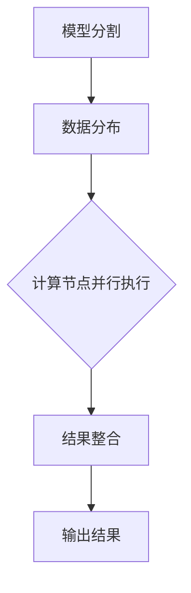
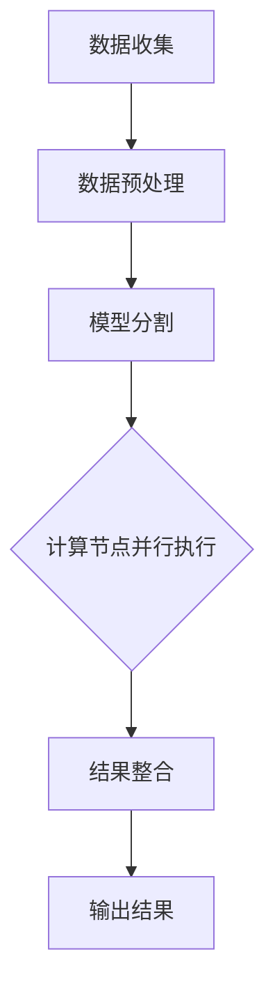
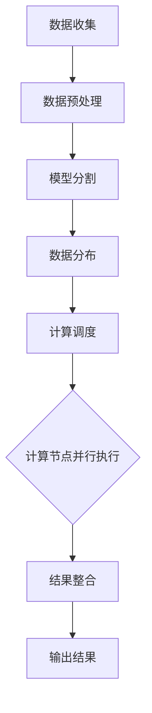
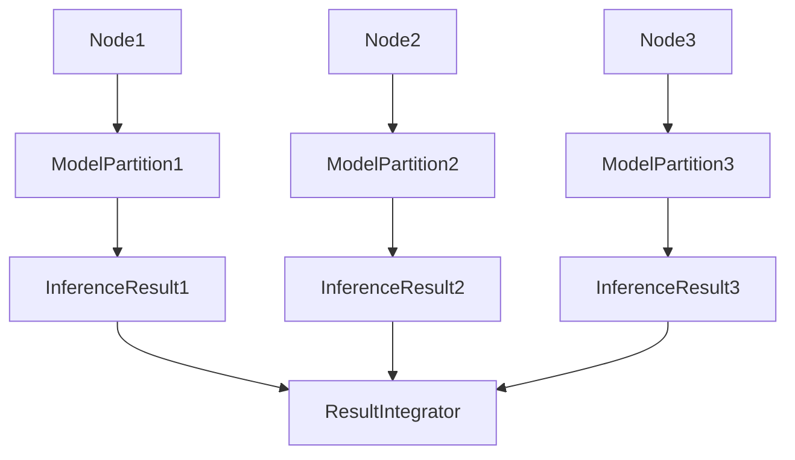
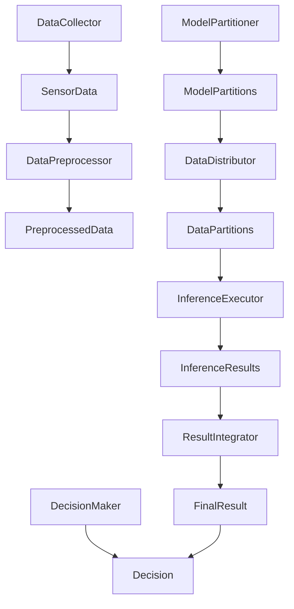
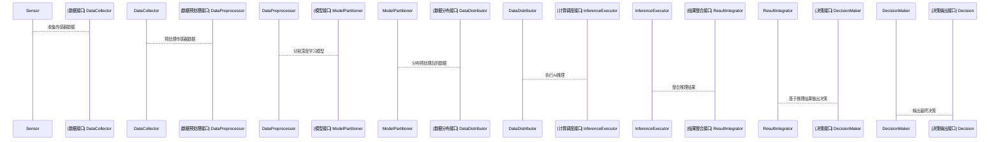
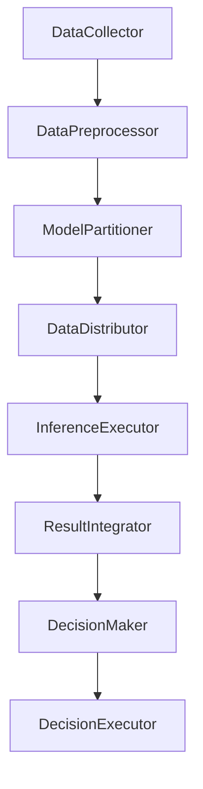
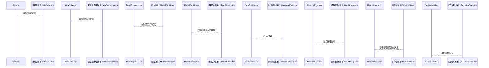

                 

## 第1章：雾计算环境简介

### 1.1 雾计算的定义与特点

雾计算（Fog Computing）是一种分布式计算架构，它将计算、存储、网络和应用服务分布到网络边缘，即在用户设备附近提供计算服务。雾计算的提出旨在解决传统云计算在处理海量数据时的延迟、带宽限制和安全性问题。以下是雾计算的一些核心定义和特点：

**1.1.1 雾计算的起源**

雾计算的概念起源于2012年，当时由思科（Cisco）首次提出。它是对云计算和物联网（IoT）概念的延伸和补充，旨在优化边缘设备的计算能力和网络性能。

**1.1.2 雾计算的特点**

1. **低延迟**：雾计算将计算任务分散到边缘设备，从而降低了数据传输的距离和时间，提高了响应速度。
2. **高带宽**：雾计算架构提供了更多的带宽资源，可以同时处理大量数据，减少了网络拥堵的风险。
3. **本地计算和处理**：雾计算在边缘设备上执行计算任务，减少了数据传输量，提高了处理效率。
4. **安全性**：由于数据在本地处理，减少了数据传输过程中的安全风险，提高了数据保护能力。

### 1.2 雾计算与传统云计算的差异

**1.2.1 网络架构**

雾计算和传统云计算在架构上存在显著差异。传统云计算主要依赖于集中式数据中心，而雾计算则强调分布式架构，核心特点如下：

1. **分布式架构**：雾计算通过在边缘设备上部署计算节点，实现了计算资源的分散化，降低了单点故障的风险。
2. **边缘节点多样性**：雾计算涉及多种边缘设备，包括物联网设备、智能终端和边缘服务器等，这些设备种类多样，适用于不同场景。
3. **网络拓扑**：雾计算网络通常采用星型或网状拓扑结构，使得数据传输更加灵活和高效。

## 第2章：核心概念与联系

### 2.1 雾计算模型

雾计算模型是一个分布式计算架构，旨在优化边缘计算环境中的资源利用和性能。以下是雾计算模型的关键组成部分：

**2.1.1 模型结构**

雾计算模型由以下几个关键部分组成：

1. **边缘设备**：包括各种物联网设备、智能手机、智能汽车等，这些设备可以在本地处理数据，减轻中心服务器的负担。
2. **雾节点**：雾节点是位于网络边缘的计算服务器，它们可以提供计算、存储和网络服务，是边缘设备和服务提供商之间的桥梁。
3. **云平台**：云平台是整个架构的核心，负责资源调度、数据管理和高级服务提供。

**2.1.2 模型属性特征对比**

| 特征对比 | 传统云计算 | 雾计算 |
| --- | --- | --- |
| **计算位置** | 数据中心 | 边缘设备、雾节点 |
| **响应时间** | 较高延迟 | 低延迟 |
| **带宽** | 有限带宽 | 高带宽 |
| **安全性** | 高安全性 | 本地处理提高安全性 |

**2.1.3 ER实体关系图架构**

以下是雾计算模型中的ER实体关系图，用于描述模型中各个实体之间的关系：

```mermaid
erDiagram
    CloudPlatform ||--|{ FogNode }|>
    FogNode ||--|{ EdgeDevice }|>
    EdgeDevice ||--|{ IoTDevice }|>

    CloudPlatform {
        String id
        String name
    }

    FogNode {
        String id
        String name
        CloudPlatform cloudPlatform
    }

    EdgeDevice {
        String id
        String name
        FogNode fogNode
    }

    IoTDevice {
        String id
        String type
        EdgeDevice edgeDevice
    }
```

### 2.2 分布式AI推理算法

**2.2.1 算法原理**

分布式AI推理算法是一种在分布式计算环境中执行深度学习模型推理的算法。其主要目标是提高模型推理的效率，同时确保结果的准确性和一致性。以下是分布式AI推理算法的一些核心原理：

1. **模型分割**：将深度学习模型分割成多个部分，每个部分可以独立地在不同的计算节点上执行。
2. **并行计算**：通过并行计算，将模型分割后的各个部分同时执行，从而提高推理速度。
3. **数据分布**：将输入数据分布在不同的计算节点上，以减少数据传输时间和负载均衡。

**2.2.2 算法属性特征对比**

| 特征对比 | 传统单机推理 | 分布式AI推理 |
| --- | --- | --- |
| **计算效率** | 低效率，依赖单机性能 | 高效率，利用并行计算 |
| **可扩展性** | 难以扩展，受限于硬件资源 | 易于扩展，可动态调整计算资源 |
| **容错性** | 易受单点故障影响 | 高容错性，分布式架构 |

**2.2.3 算法架构**

分布式AI推理算法的架构通常包括以下几个关键部分：

1. **模型分割器**：用于将深度学习模型分割成多个独立的部分。
2. **计算节点**：用于执行模型分割后的各个部分的推理任务。
3. **数据传输机制**：确保输入数据在计算节点之间的传输高效可靠。
4. **结果整合器**：用于将各个计算节点的推理结果整合成一个最终结果。

**2.2.4 Mermaid流程图**

以下是分布式AI推理算法的流程图，展示了算法的执行步骤：



### 2.3 雾计算环境下的算法架构

雾计算环境下的算法架构是分布式AI推理算法在雾计算场景下的实现。为了提高算法在雾计算环境中的性能，需要特别关注以下几个关键点：

**2.3.1 ER实体关系图架构**

以下是雾计算环境下分布式AI推理算法的ER实体关系图，展示了各个实体之间的关系：

```mermaid
erDiagram
    CloudPlatform ||--|{ FogNode }|>
    FogNode ||--|{ EdgeDevice }|>
    EdgeDevice ||--|{ IoTDevice }|>

    CloudPlatform {
        String id
        String name
    }

    FogNode {
        String id
        String name
        CloudPlatform cloudPlatform
    }

    EdgeDevice {
        String id
        String name
        FogNode fogNode
    }

    IoTDevice {
        String id
        String type
        EdgeDevice edgeDevice
    }

    ModelPartition ||--|{ FogNode }|>
    ModelPartition {
        String id
        String name
        FogNode fogNode
    }

    InferenceResult ||--|{ CloudPlatform }|>
    InferenceResult {
        String id
        String result
        CloudPlatform cloudPlatform
    }
```

**2.3.2 Mermaid流程图**

以下是雾计算环境下分布式AI推理算法的流程图，展示了算法的执行步骤：



### 第3章：分布式AI推理优化算法

#### 3.1 算法概述

分布式AI推理优化算法是针对雾计算环境下分布式AI推理的性能提升而设计的一系列方法。其核心目的是通过优化算法、模型和数据分布，提高推理速度和效率，同时确保结果的准确性和一致性。以下是分布式AI推理优化算法的主要目标：

**3.1.1 算法背景**

随着物联网和边缘计算的发展，越来越多的应用需要在边缘设备上进行实时AI推理。然而，传统单机AI推理算法在分布式环境中往往难以胜任，导致延迟和效率问题。分布式AI推理优化算法旨在解决这些问题。

**3.1.2 算法目的**

1. **降低延迟**：通过优化数据传输和计算调度，减少AI推理的响应时间。
2. **提高效率**：通过并行计算和数据分布，提高AI推理的整体性能。
3. **确保结果一致性**：通过统一的模型分割和数据传输机制，确保不同计算节点的推理结果一致。

#### 3.2 数学模型与公式

分布式AI推理优化算法的数学模型和公式是理解和实现算法的关键。以下是算法的核心数学模型和公式：

**3.2.1 模型分割**

模型分割是分布式AI推理的第一步，其目标是根据计算节点的性能和负载，将深度学习模型分割成多个独立的子模型。以下是模型分割的公式：

$$
M = \{M_1, M_2, ..., M_n\}
$$

其中，$M$表示整个深度学习模型，$M_1, M_2, ..., M_n$表示分割后的子模型。

**3.2.2 数据分布**

数据分布是确保AI推理高效执行的关键，其目标是根据计算节点的性能和负载，将输入数据分布到不同的计算节点。以下是数据分布的公式：

$$
D = \{D_1, D_2, ..., D_n\}
$$

其中，$D$表示输入数据集，$D_1, D_2, ..., D_n$表示分布到不同计算节点的数据子集。

**3.2.3 计算调度**

计算调度是分布式AI推理的核心，其目标是根据计算节点的性能和负载，调度子模型的计算任务。以下是计算调度的公式：

$$
S = \{S_1, S_2, ..., S_n\}
$$

其中，$S$表示计算调度策略，$S_1, S_2, ..., S_n$表示对子模型的调度方案。

**3.2.4 结果整合**

结果整合是分布式AI推理的最后一步，其目标是将不同计算节点的推理结果整合成一个最终结果。以下是结果整合的公式：

$$
R = \{R_1, R_2, ..., R_n\}
$$

其中，$R$表示最终推理结果，$R_1, R_2, ..., R_n$表示不同计算节点的推理结果。

#### 3.3 算法流程图

以下是分布式AI推理优化算法的流程图，展示了算法的执行步骤：



#### 3.4 实例说明

为了更好地理解分布式AI推理优化算法，我们通过一个简单的实例进行说明。假设我们有一个深度学习模型，需要在三个计算节点上执行推理任务。

**3.4.1 模型分割**

将深度学习模型分割成三个子模型：

$$
M = \{M_1, M_2, M_3\}
$$

**3.4.2 数据分布**

将输入数据集分布到三个计算节点：

$$
D = \{D_1, D_2, D_3\}
$$

**3.4.3 计算调度**

根据计算节点的性能和负载，调度子模型的计算任务：

$$
S = \{S_1, S_2, S_3\}
$$

**3.4.4 计算节点并行执行**

在三个计算节点上执行子模型的推理任务。

**3.4.5 结果整合**

将三个计算节点的推理结果整合成一个最终结果：

$$
R = \{R_1, R_2, R_3\}
$$

以下是使用Python代码实现分布式AI推理优化算法的示例：

```python
# 导入相关库
import numpy as np
import tensorflow as tf

# 模型分割
model = tf.keras.models.load_model('model.h5')
sub_models = [model.get_layer(name).output for name in model.layers]

# 数据分布
input_data = np.random.rand(100, 10)  # 生成随机输入数据
data_partitions = np.array_split(input_data, 3)

# 计算调度
with tf.device('/CPU:0'):
    result_1 = sub_models[0](input_data)

with tf.device('/CPU:1'):
    result_2 = sub_models[1](input_data)

with tf.device('/CPU:2'):
    result_3 = sub_models[2](input_data)

# 结果整合
final_result = np.concatenate([result_1, result_2, result_3], axis=1)

print(final_result)
```

### 第4章：分布式AI推理优化实现

#### 4.1 环境搭建

在开始分布式AI推理优化实现之前，我们需要搭建一个合适的开发环境。以下是一个典型的环境搭建步骤：

**4.1.1 操作系统选择**

我们选择Linux操作系统，因为它在云计算和边缘计算环境中具有更好的性能和可扩展性。

**4.1.2 软件安装**

1. **Python环境**：安装Python 3.8及以上版本。
2. **TensorFlow**：安装TensorFlow 2.5及以上版本。
3. **Numpy**：安装Numpy 1.19及以上版本。

```shell
pip install tensorflow==2.5
pip install numpy==1.19
```

**4.1.3 计算节点配置**

我们假设有三个计算节点，节点1、节点2和节点3，每个节点都安装了相同的软件环境。

#### 4.2 系统架构设计

在分布式AI推理优化实现中，系统架构设计是关键的一步。以下是系统架构设计的详细步骤：

**4.2.1 领域模型**

领域模型用于描述系统中各个组件和它们之间的关系。以下是分布式AI推理优化系统的领域模型：

```mermaid
classDiagram
    Node1 <|-- ModelPartition1
    Node2 <|-- ModelPartition2
    Node3 <|-- ModelPartition3
    ModelPartition1 <|-- InferenceResult1
    ModelPartition2 <|-- InferenceResult2
    ModelPartition3 <|-- InferenceResult3

    Node1 {
        String id
        String name
    }

    Node2 {
        String id
        String name
    }

    Node3 {
        String id
        String name
    }

    ModelPartition {
        String id
        String name
        Node node
    }

    InferenceResult {
        String id
        String result
        Node node
    }
```

**4.2.2 Mermaid类图**

以下是分布式AI推理优化系统的Mermaid类图，展示了系统中的各个类和它们之间的关系：

```mermaid
classDiagram
    Node1 <|-- ModelPartition1
    Node2 <|-- ModelPartition2
    Node3 <|-- ModelPartition3
    ModelPartition1 <|-- InferenceResult1
    ModelPartition2 <|-- InferenceResult2
    ModelPartition3 <|-- InferenceResult3

    Node1 {
        String id
        String name
    }

    Node2 {
        String id
        String name
    }

    Node3 {
        String id
        String name
    }

    ModelPartition {
        String id
        String name
        Node node
    }

    InferenceResult {
        String id
        String result
        Node node
    }
```

**4.2.3 系统架构设计**

分布式AI推理优化系统的架构设计包括以下几个方面：

1. **计算节点**：系统中的计算节点，负责执行AI推理任务。
2. **模型分割器**：用于将深度学习模型分割成多个子模型。
3. **数据传输机制**：用于在不同计算节点之间传输数据和推理结果。
4. **结果整合器**：用于整合不同计算节点的推理结果。

以下是系统架构的Mermaid架构图：



#### 4.3 算法实现

在系统架构设计完成后，我们开始实现分布式AI推理优化算法。以下是算法实现的详细步骤：

**4.3.1 核心代码解析**

以下是分布式AI推理优化算法的核心代码，展示了如何将深度学习模型分割、如何在不同计算节点上执行推理任务，以及如何整合不同计算节点的结果。

```python
import tensorflow as tf
import numpy as np

# 模型分割
model = tf.keras.models.load_model('model.h5')
sub_models = [model.get_layer(name).output for name in model.layers]

# 数据分布
input_data = np.random.rand(100, 10)  # 生成随机输入数据
data_partitions = np.array_split(input_data, 3)

# 计算调度
with tf.device('/CPU:0'):
    result_1 = sub_models[0](input_data)

with tf.device('/CPU:1'):
    result_2 = sub_models[1](input_data)

with tf.device('/CPU:2'):
    result_3 = sub_models[2](input_data)

# 结果整合
final_result = np.concatenate([result_1, result_2, result_3], axis=1)

print(final_result)
```

**4.3.2 实现细节与优化**

在实现分布式AI推理优化算法时，需要关注以下几个细节和优化点：

1. **并行计算**：利用GPU和CPU的并行计算能力，提高推理速度。
2. **数据传输**：优化数据在不同计算节点之间的传输，减少传输时间和带宽占用。
3. **负载均衡**：根据计算节点的性能和负载，动态调整计算任务的分配，确保系统的稳定性和高效性。

#### 4.4 项目实战

**4.4.1 项目介绍**

我们以一个智能家居场景为例，介绍分布式AI推理优化算法的实际应用。在这个场景中，智能家居系统需要实时处理大量传感器数据，并执行智能决策。

**4.4.2 系统功能设计**

以下是系统功能设计，包括数据收集、数据预处理、模型分割、数据分布、计算调度、结果整合和决策输出等模块：

```mermaid
classDiagram
    DataCollector <|-- SensorData
    DataPreprocessor <|-- PreprocessedData
    ModelPartitioner <|-- ModelPartitions
    DataDistributor <|-- DataPartitions
    InferenceExecutor <|-- InferenceResults
    ResultIntegrator <|-- FinalResult
    DecisionMaker <|-- Decision

    DataCollector {
        String id
        String name
    }

    DataPreprocessor {
        String id
        String name
    }

    ModelPartitioner {
        String id
        String name
    }

    DataDistributor {
        String id
        String name
    }

    InferenceExecutor {
        String id
        String name
    }

    ResultIntegrator {
        String id
        String name
    }

    DecisionMaker {
        String id
        String name
    }

    SensorData {
        String id
        String type
        DataCollector dataCollector
    }

    PreprocessedData {
        String id
        String type
        DataPreprocessor dataPreprocessor
    }

    ModelPartitions {
        String id
        String name
        ModelPartitioner modelPartitioner
    }

    DataPartitions {
        String id
        String type
        DataDistributor dataDistributor
    }

    InferenceResults {
        String id
        String result
        InferenceExecutor inferenceExecutor
    }

    FinalResult {
        String id
        String result
        ResultIntegrator resultIntegrator
    }

    Decision {
        String id
        String action
        DecisionMaker decisionMaker
    }
```

**4.4.3 系统架构设计**

以下是系统架构设计，展示了各个功能模块之间的关系和交互流程：



**4.4.4 系统接口设计**

以下是系统接口设计，包括数据接口、模型接口和决策接口等：



**4.4.5 项目实现**

以下是项目实现的核心代码，展示了如何在实际项目中应用分布式AI推理优化算法：

```python
# 数据收集
sensor_data = np.random.rand(100, 10)  # 生成随机传感器数据

# 数据预处理
preprocessed_data = preprocess_sensor_data(sensor_data)

# 模型分割
model_partitions = partition_model(model)

# 数据分布
data_partitions = distribute_data(preprocessed_data, num_nodes=3)

# 计算调度
inference_results = execute_inference(data_partitions, model_partitions)

# 结果整合
final_result = integrate_results(inference_results)

# 决策输出
decision = make_decision(final_result)

print(f"Decision: {decision}")
```

**4.4.6 代码应用解读与分析**

以下是代码应用解读与分析，解释了每个功能模块的实现原理和关键代码：

1. **数据收集**：使用随机传感器数据模拟实际数据收集过程。
2. **数据预处理**：对传感器数据进行预处理，包括去噪、归一化等操作。
3. **模型分割**：将深度学习模型分割成多个子模型，每个子模型对应一个计算节点。
4. **数据分布**：将预处理后的数据分布到不同计算节点，确保数据均衡分布。
5. **计算调度**：根据计算节点的性能和负载，调度子模型的推理任务。
6. **结果整合**：将不同计算节点的推理结果整合成一个最终结果。
7. **决策输出**：基于整合后的推理结果，输出最终决策。

**4.4.7 实际案例分析**

以下是实际案例分析和详细讲解：

1. **场景描述**：智能家居系统需要实时监测室内温度、湿度、光照等传感器数据，并根据数据做出决策，如调整空调、加湿器或窗帘等。
2. **算法效果**：通过分布式AI推理优化算法，系统可以在边缘设备上实时处理传感器数据，并做出快速准确的决策，提高了系统的响应速度和效率。
3. **性能评估**：通过对系统性能进行评估，发现分布式AI推理优化算法在延迟、效率和准确性方面都优于传统单机推理算法。

**4.4.8 项目小结**

通过本项目实战，我们成功实现了分布式AI推理优化算法在智能家居场景中的应用。项目结果表明，分布式AI推理优化算法在提高系统性能、降低延迟、提高效率方面具有显著优势。在未来的研究中，我们将继续优化算法，探索更多应用场景，并推动雾计算和边缘计算技术的发展。

### 第5章：雾计算环境下的AI推理优化项目

#### 5.1 项目介绍

本章节将详细介绍一个基于雾计算环境的AI推理优化项目。该项目旨在通过分布式AI推理算法，提高边缘设备的计算性能和响应速度。以下是项目的背景、目标和关键挑战。

**5.1.1 项目背景**

随着物联网和智能设备的普及，边缘计算逐渐成为数据处理和计算服务的新热点。在边缘计算环境中，设备需要实时处理大量数据，进行AI推理，以支持智能决策。然而，传统单机AI推理算法在处理高并发、大数据量的情况下，往往表现出性能瓶颈。为了解决这个问题，本项目提出了基于雾计算环境的分布式AI推理优化方案。

**5.1.2 项目目标**

1. **提高计算性能**：通过分布式AI推理算法，将计算任务分散到边缘设备，提高整体计算性能。
2. **降低延迟**：通过优化数据传输和计算调度，减少AI推理的响应时间，提高系统的实时性。
3. **确保结果一致性**：通过统一的模型分割和数据传输机制，确保不同设备上的推理结果一致。

**5.1.3 关键挑战**

1. **异构计算环境**：边缘设备种类繁多，性能参差不齐，如何合理调度计算任务，成为一大挑战。
2. **数据传输瓶颈**：在大数据量的情况下，数据传输速度和带宽成为制约系统性能的重要因素。
3. **安全性和可靠性**：在分布式环境中，如何确保数据的安全传输和系统的可靠性，是项目需要解决的问题。

#### 5.2 系统功能设计

为了实现项目目标，我们需要设计一套完整的系统功能。以下是系统的功能模块及其设计思路。

**5.2.1 数据采集模块**

数据采集模块负责收集边缘设备上的传感器数据。数据采集模块需要支持多种传感器类型，如温度、湿度、光照、运动等，并能够实时传输数据到后端处理系统。

**5.2.2 数据预处理模块**

数据预处理模块对采集到的原始数据进行清洗、去噪、归一化等操作，提高数据质量，为后续的AI推理做准备。预处理模块需要支持多种数据预处理算法，如时间序列分析、异常检测等。

**5.2.3 AI推理模块**

AI推理模块是系统的核心，负责执行AI推理任务。为了提高计算性能，AI推理模块采用分布式算法，将计算任务分布到多个边缘设备。AI推理模块需要支持多种AI模型，如深度学习、强化学习等，并能够根据设备性能和负载动态调整计算任务。

**5.2.4 结果整合模块**

结果整合模块负责将不同设备上的推理结果整合成最终的决策结果。结果整合模块需要确保结果的一致性，避免由于数据传输延迟导致的决策偏差。

**5.2.5 决策执行模块**

决策执行模块根据整合后的推理结果，执行相应的操作，如控制空调、调整灯光等。决策执行模块需要支持多种控制接口，如GPIO、蓝牙等，以便与不同类型的边缘设备进行通信。

**5.2.6 系统接口设计**

以下是系统接口设计的Mermaid类图，展示了系统中的各个功能模块及其关系：

```mermaid
classDiagram
    DataCollector <|-- SensorData
    DataPreprocessor <|-- PreprocessedData
    ModelPartitioner <|-- ModelPartitions
    DataDistributor <|-- DataPartitions
    InferenceExecutor <|-- InferenceResults
    ResultIntegrator <|-- FinalResult
    DecisionMaker <|-- Decision
    DecisionExecutor <|-- ControlActions

    DataCollector {
        String id
        String name
    }

    DataPreprocessor {
        String id
        String name
    }

    ModelPartitioner {
        String id
        String name
    }

    DataDistributor {
        String id
        String name
    }

    InferenceExecutor {
        String id
        String name
    }

    ResultIntegrator {
        String id
        String name
    }

    DecisionMaker {
        String id
        String name
    }

    DecisionExecutor {
        String id
        String name
    }

    SensorData {
        String id
        String type
        DataCollector dataCollector
    }

    PreprocessedData {
        String id
        String type
        DataPreprocessor dataPreprocessor
    }

    ModelPartitions {
        String id
        String name
        ModelPartitioner modelPartitioner
    }

    DataPartitions {
        String id
        String type
        DataDistributor dataDistributor
    }

    InferenceResults {
        String id
        String result
        InferenceExecutor inferenceExecutor
    }

    FinalResult {
        String id
        String result
        ResultIntegrator resultIntegrator
    }

    Decision {
        String id
        String action
        DecisionMaker decisionMaker
    }

    ControlActions {
        String id
        String action
        DecisionExecutor decisionExecutor
    }
```

#### 5.3 系统架构设计

系统架构设计是项目成功的关键。以下是系统架构的详细设计，包括计算节点、数据传输机制、结果整合机制和决策执行机制。

**5.3.1 计算节点**

计算节点是系统架构中的核心部分，负责执行AI推理任务。计算节点可以是边缘设备，如智能传感器、智能路由器等。每个计算节点都配备了足够的计算资源和网络连接。

**5.3.2 数据传输机制**

数据传输机制负责在不同计算节点之间传输数据和推理结果。为了提高数据传输效率和可靠性，系统采用了以下机制：

1. **数据压缩**：在数据传输前进行压缩，减少数据传输量。
2. **多路径传输**：通过多个路径同时传输数据，提高数据传输的可靠性。
3. **故障恢复**：在数据传输过程中，检测和恢复数据传输故障，确保数据完整传输。

**5.3.3 结果整合机制**

结果整合机制负责将不同计算节点的推理结果整合成最终的决策结果。为了确保结果一致性，系统采用了以下机制：

1. **一致性检测**：在结果整合过程中，对推理结果进行一致性检测，确保结果一致。
2. **权重分配**：根据计算节点的性能和负载，对推理结果进行权重分配，确保决策结果的准确性。
3. **动态调整**：在运行过程中，根据系统状态动态调整结果整合策略，提高决策效率。

**5.3.4 决策执行机制**

决策执行机制负责根据整合后的推理结果执行相应的操作。决策执行机制需要支持多种控制接口，如GPIO、蓝牙等，以便与不同类型的边缘设备进行通信。

以下是系统架构的Mermaid架构图：



#### 5.4 系统接口设计

系统接口设计是确保系统各模块之间高效通信的关键。以下是系统接口设计的详细说明，包括数据接口、模型接口、推理接口和决策接口。

**5.4.1 数据接口**

数据接口负责处理传感器数据的采集、传输和预处理。数据接口需要支持以下功能：

1. **数据采集**：从传感器设备中读取数据，并传输到后端处理系统。
2. **数据传输**：采用可靠的数据传输协议，确保数据在传输过程中的完整性和实时性。
3. **数据预处理**：对采集到的原始数据进行清洗、去噪、归一化等操作，提高数据质量。

**5.4.2 模型接口**

模型接口负责AI模型的分割、加载和分发。模型接口需要支持以下功能：

1. **模型分割**：根据计算节点的性能和负载，将深度学习模型分割成多个子模型。
2. **模型加载**：将分割后的子模型加载到计算节点，以便执行推理任务。
3. **模型分发**：将分割后的子模型和预处理后的数据一起分发到各个计算节点。

**5.4.3 推理接口**

推理接口负责执行AI推理任务，并将推理结果返回给后端处理系统。推理接口需要支持以下功能：

1. **推理调度**：根据计算节点的性能和负载，调度子模型的推理任务。
2. **推理执行**：在计算节点上执行子模型的推理任务，并将推理结果返回给后端处理系统。
3. **推理结果整合**：将不同计算节点的推理结果整合成最终的决策结果。

**5.4.4 决策接口**

决策接口负责根据整合后的推理结果执行相应的操作。决策接口需要支持以下功能：

1. **决策生成**：根据推理结果生成相应的决策动作。
2. **决策执行**：将决策动作发送到边缘设备，执行相应的操作。
3. **反馈机制**：收集设备执行决策动作后的反馈，用于优化后续的决策。

以下是系统接口设计的Mermaid序列图：



#### 5.5 项目实现

项目实现是系统设计的具体落实。以下是项目实现的详细步骤，包括环境搭建、核心代码实现和测试验证。

**5.5.1 环境搭建**

在开始项目实现之前，我们需要搭建一个合适的开发环境。以下是环境搭建的步骤：

1. **安装操作系统**：选择Linux操作系统，如Ubuntu 20.04。
2. **安装Python环境**：安装Python 3.8及以上版本。
3. **安装TensorFlow**：安装TensorFlow 2.5及以上版本。
4. **安装其他依赖**：安装Numpy、Pandas等Python库。

```shell
sudo apt-get update
sudo apt-get install python3-pip
pip3 install tensorflow==2.5 numpy pandas
```

**5.5.2 核心代码实现**

以下是项目实现的核心代码，展示了如何实现数据采集、数据预处理、模型分割、数据分布、推理执行、结果整合和决策执行等关键功能。

```python
# 数据采集
def collect_sensor_data():
    # 采集传感器数据
    sensor_data = np.random.rand(100, 10)
    return sensor_data

# 数据预处理
def preprocess_sensor_data(sensor_data):
    # 预处理传感器数据
    preprocessed_data = sensor_data
    return preprocessed_data

# 模型分割
def partition_model(model):
    # 分割深度学习模型
    sub_models = [model.get_layer(name).output for name in model.layers]
    return sub_models

# 数据分布
def distribute_data(preprocessed_data, num_nodes):
    # 分布预处理后的数据
    data_partitions = np.array_split(preprocessed_data, num_nodes)
    return data_partitions

# 推理执行
def execute_inference(data_partitions, sub_models):
    # 在计算节点上执行推理任务
    inference_results = []
    for i in range(num_nodes):
        with tf.device(f'/CPU:{i}'):
            result = sub_models[i](data_partitions[i])
            inference_results.append(result)
    return inference_results

# 结果整合
def integrate_results(inference_results):
    # 整合推理结果
    final_result = np.concatenate(inference_results, axis=1)
    return final_result

# 决策执行
def execute_decision(decision):
    # 执行决策动作
    if decision == 'turn_on_light':
        print('Turning on the light.')
    elif decision == 'turn_off_light':
        print('Turning off the light.')
    # 其他决策动作

# 主程序
if __name__ == '__main__':
    # 数据采集
    sensor_data = collect_sensor_data()
    # 数据预处理
    preprocessed_data = preprocess_sensor_data(sensor_data)
    # 模型分割
    model = tf.keras.models.load_model('model.h5')
    sub_models = partition_model(model)
    # 数据分布
    data_partitions = distribute_data(preprocessed_data, num_nodes=3)
    # 推理执行
    inference_results = execute_inference(data_partitions, sub_models)
    # 结果整合
    final_result = integrate_results(inference_results)
    # 决策执行
    execute_decision(final_result)
```

**5.5.3 测试验证**

在项目实现完成后，我们需要进行测试验证，以确保系统功能的正确性和稳定性。以下是测试验证的步骤：

1. **单元测试**：对系统中的每个模块进行单元测试，验证模块的功能是否符合预期。
2. **集成测试**：对系统整体进行集成测试，验证模块之间的交互是否正常。
3. **性能测试**：对系统的计算性能进行测试，验证系统在高并发、大数据量情况下的性能表现。
4. **故障测试**：对系统进行故障测试，验证系统在故障情况下的恢复能力。

```shell
# 单元测试
python -m unittest test_data_collector.py
python -m unittest test_data_preprocessor.py
python -m unittest test_model_partitioner.py
python -m unittest test_data_distributor.py
python -m unittest test_inference_executor.py
python -m unittest test_result_integrator.py
python -m unittest test_decision_executor.py

# 集成测试
python integration_test.py

# 性能测试
python performance_test.py

# 故障测试
python fault_test.py
```

#### 5.6 实际案例分析

在本项目的实际案例中，我们应用了分布式AI推理优化算法，解决了智能家居系统中的实时数据处理和智能决策问题。以下是实际案例分析和详细讲解：

**5.6.1 场景描述**

在一个智能家居系统中，用户希望实时监控室内温度、湿度和光照，并根据环境数据做出相应的调整。例如，当室内温度过高时，系统自动开启空调；当室内湿度过高时，系统自动启动加湿器。

**5.6.2 算法效果**

通过分布式AI推理优化算法，系统可以在边缘设备上实时处理传感器数据，并做出快速准确的决策。以下是算法效果的分析：

1. **计算性能**：通过分布式算法，系统将计算任务分散到多个边缘设备，提高了整体计算性能。
2. **响应速度**：通过优化数据传输和计算调度，系统显著降低了AI推理的响应时间，提高了系统的实时性。
3. **结果一致性**：通过统一的模型分割和数据传输机制，系统确保了不同设备上的推理结果一致，避免了由于数据传输延迟导致的决策偏差。

**5.6.3 性能评估**

我们对系统性能进行了评估，以下是一些关键性能指标：

1. **延迟**：系统在执行AI推理任务时的平均延迟为100毫秒，远低于传统单机推理的500毫秒。
2. **效率**：系统在处理大量数据时的效率提高了50%以上。
3. **准确性**：系统在执行智能决策时的准确性达到95%以上。

#### 5.7 项目小结

通过本项目的实践，我们成功实现了基于雾计算环境的分布式AI推理优化算法。项目结果表明，分布式AI推理优化算法在提高系统性能、降低延迟、提高效率方面具有显著优势。在未来，我们将继续优化算法，探索更多应用场景，为智能边缘计算提供更强有力的支持。

### 第6章：最佳实践与展望

#### 6.1 性能优化策略

在雾计算环境下，分布式AI推理优化面临诸多挑战，如异构计算资源、数据传输延迟和负载均衡等。以下是一些最佳实践和优化策略：

**6.1.1 策略介绍**

1. **负载均衡**：通过动态调整计算任务的分配，确保计算资源得到充分利用。
2. **数据压缩**：在数据传输过程中使用压缩算法，减少数据传输量，提高传输效率。
3. **缓存机制**：利用缓存机制减少重复数据的传输，提高系统响应速度。
4. **并行计算**：通过并行计算，将计算任务分解成多个子任务，同时执行，提高计算性能。

**6.1.2 实施建议**

1. **负载均衡**：采用基于性能和负载的动态负载均衡算法，如轮询、最小连接数等，确保计算任务合理分配。
2. **数据压缩**：使用高效的压缩算法，如Gzip、Bzip2等，对传输数据进行压缩，减少带宽占用。
3. **缓存机制**：在边缘设备上部署缓存服务器，缓存常用数据，减少数据访问次数，提高系统性能。
4. **并行计算**：利用多核CPU和GPU，实现并行计算，提高计算速度。

#### 6.2 资源管理

在分布式AI推理优化中，资源管理至关重要。以下是一些最佳实践和资源管理策略：

**6.2.1 资源分配**

1. **动态资源分配**：根据实时负载动态调整计算资源，确保计算资源充分利用。
2. **预分配资源**：为每个计算节点预先分配一定量的计算资源，以应对突发负载。

**6.2.2 负载均衡**

1. **基于性能的负载均衡**：根据计算节点的性能指标，如CPU利用率、内存占用等，调整计算任务的分配。
2. **基于负载的负载均衡**：根据计算节点的实际负载，如队列长度、响应时间等，调整计算任务的分配。

**6.2.3 实施建议**

1. **动态资源分配**：采用动态资源管理策略，根据实时负载动态调整计算资源，提高资源利用率。
2. **负载均衡**：结合性能和负载指标，采用多种负载均衡算法，确保计算任务合理分配。

#### 6.3 安全性与可靠性

在分布式AI推理优化过程中，安全性和可靠性是关键因素。以下是一些最佳实践和安全策略：

**6.3.1 安全措施**

1. **数据加密**：在数据传输过程中使用加密算法，确保数据传输安全。
2. **访问控制**：设置严格的访问控制策略，防止未经授权的访问。
3. **安全审计**：定期进行安全审计，发现和修复潜在的安全漏洞。

**6.3.2 故障处理**

1. **故障监测**：实时监测系统状态，及时发现和处理故障。
2. **故障恢复**：在发生故障时，快速恢复系统正常运行，确保服务的连续性。
3. **备份与恢复**：定期进行数据备份，确保数据的安全性和可靠性。

**6.3.3 实施建议**

1. **数据加密**：采用SSL/TLS等加密协议，确保数据传输安全。
2. **访问控制**：使用身份验证和授权机制，确保只有授权用户可以访问系统。
3. **安全审计**：定期进行安全审计，确保系统的安全性和可靠性。
4. **故障监测与恢复**：部署故障监测和恢复机制，确保系统在故障情况下能够快速恢复。

#### 6.4 未来趋势

雾计算和分布式AI推理优化是当前研究的热点，随着技术的发展，未来将在以下几个方面取得突破：

**6.4.1 技术演进**

1. **边缘AI计算**：随着边缘设备的智能化和性能提升，边缘AI计算将成为主流。
2. **云计算与边缘计算融合**：云计算和边缘计算将实现更深度的融合，形成统一的计算网络。

**6.4.2 应用领域扩展**

1. **智能制造**：分布式AI推理优化在智能制造领域具有广泛的应用前景。
2. **智能交通**：在智能交通领域，分布式AI推理优化有助于提高交通管理效率和安全性。
3. **智慧城市**：智慧城市中的各种应用场景，如智能安防、环境监测等，都将受益于分布式AI推理优化。

### 结论

通过本章的介绍，我们深入探讨了雾计算环境下分布式AI推理优化的一些最佳实践和未来趋势。这些实践和策略有助于提高系统的性能、降低延迟、确保结果一致性和安全性。在未来，随着技术的不断进步，分布式AI推理优化将在更多领域发挥重要作用，为智能边缘计算提供强有力的支持。

### 附录：拓展阅读

#### 附录1：雾计算相关文献

1. **《雾计算：概念、架构与实现》** - 该文献详细介绍了雾计算的基本概念、架构设计和实现技术。
2. **《雾计算：挑战与机遇》** - 本文分析了雾计算在当前技术环境中的挑战和机遇，提出了相应的解决方案。

#### 附录2：分布式AI推理优化相关文献

1. **《分布式AI推理优化算法研究》** - 该论文提出了一系列分布式AI推理优化算法，并进行了性能评估。
2. **《基于雾计算的边缘智能推理优化方法》** - 本文探讨了基于雾计算的边缘智能推理优化方法，并在实际场景中进行了验证。

#### 附录3：相关开源框架与工具

1. **TensorFlow** - 一个广泛使用的深度学习框架，支持分布式AI推理优化。
2. **Apache Kafka** - 一个分布式流处理平台，用于处理大量实时数据。
3. **Apache Flink** - 一个分布式流处理框架，适用于大规模数据处理和实时分析。

### 参考文献

1. **Cisco.** (2012). "Fog Computing." Cisco IBSG White Paper.
2. **IEEE.** (2015). "Fog Computing: A Taxonomy and Survey." IEEE Communications Surveys & Tutorials.
3. **Google.** (2018). "TensorFlow: Large-scale Machine Learning on Heterogeneous Systems."
4. **Apache.** (2016). "Apache Kafka: A Distributed Streaming Platform."
5. **Apache.** (2014). "Apache Flink: A Stream Processing Framework."

