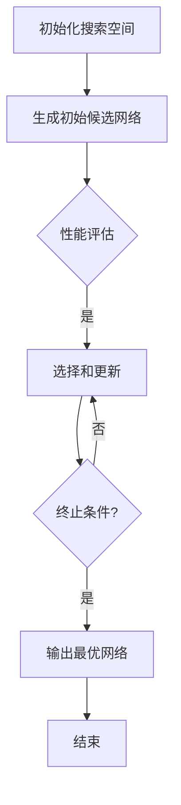

                 

### 高效可扩展的神经架构搜索：自动化AI设计的背景

神经架构搜索（Neural Architecture Search，NAS）是近年来人工智能（AI）领域的一项前沿技术，它通过优化神经网络的架构来提高模型性能。随着深度学习在各行各业的广泛应用，如何设计更高效、更鲁棒的神经网络架构成为了一个重要的研究方向。传统的神经网络设计主要依赖于专家经验和试错，这不仅效率低下，而且难以应对复杂的问题。

自动化AI设计（Automated AI Design）的概念也随之兴起，它旨在通过算法和工具来自动化神经网络架构的设计过程。神经架构搜索作为自动化AI设计的一个重要分支，不仅能够显著提高设计效率，还能够发现传统方法难以找到的新型架构，从而推动AI技术的进步。

神经架构搜索的基本原理是通过搜索空间（Search Space）中的不同架构，利用搜索算法（如遗传算法、强化学习等）进行寻优，最终找到性能最优的神经网络架构。这种自动化搜索过程不仅能大大减少设计时间，还能够提高模型的泛化能力，从而在各类AI应用中展现其巨大潜力。

在本文中，我们将深入探讨神经架构搜索的基本概念、核心算法、系统设计与实现，以及实际应用中的挑战和解决方案。通过这一步一步的分析，希望能够帮助读者理解神经架构搜索的原理和实际应用，为未来的研究提供有益的参考。

### 神经架构搜索的核心概念

神经架构搜索（Neural Architecture Search，NAS）是一种通过算法自动搜索最优神经网络架构的方法。在深度学习中，神经网络架构的设计通常是一个复杂的过程，涉及到网络层数、神经元数量、层间连接方式等多个参数。传统的设计方法依赖于人类专家的经验和试错，这不仅费时费力，而且难以应对日益复杂的AI任务。

首先，我们需要了解神经架构搜索中的几个核心概念：

1. **搜索空间（Search Space）**：
   搜索空间是指所有可能的神经网络架构的集合。它定义了NAS算法能够探索的领域。一个典型的搜索空间可能包括不同数量的层、不同类型的层（如卷积层、全连接层）、不同类型的激活函数等。搜索空间的大小决定了NAS算法能够探索的架构多样性。

2. **候选网络（Candidate Networks）**：
   在搜索过程中，NAS算法会生成一系列候选网络，这些网络是从搜索空间中随机或根据某种策略选择的。每个候选网络都代表一个可能的神经网络架构，其性能将用于评估和选择。

3. **性能评估（Performance Evaluation）**：
   NAS算法通过某种性能指标（如准确率、计算效率等）来评估候选网络的性能。常见的评估方法包括在验证集上的性能测试，以及在测试集上的泛化能力测试。

4. **搜索算法（Search Algorithms）**：
   搜索算法是NAS的核心组成部分，它决定了如何从搜索空间中选择候选网络并进行性能评估。常见的搜索算法包括基于遗传算法（Genetic Algorithms，GA）、强化学习（Reinforcement Learning，RL）、基于梯度的方法（Gradient-based Methods）等。每种算法都有其独特的优缺点和适用场景。

在理解了这些核心概念之后，我们可以进一步探讨神经架构搜索的基本原理和流程。

#### 基本原理

神经架构搜索的基本原理是通过在搜索空间中进行系统化的搜索，找到性能最优的神经网络架构。这个过程通常包括以下几个步骤：

1. **初始化搜索空间**：
   首先，我们需要定义搜索空间。这通常涉及到确定网络层的类型、层数、每层神经元的数量、层间的连接方式等。搜索空间的设计是一个关键步骤，它将决定NAS算法能够探索的架构多样性。

2. **生成初始候选网络**：
   在初始化搜索空间后，NAS算法会生成一系列初始的候选网络。这些候选网络是从搜索空间中随机选择或根据某种策略生成的。初始候选网络的数量和生成方式将影响搜索的效率。

3. **性能评估**：
   对生成的每个候选网络，NAS算法会在验证集上进行性能评估。性能指标可能包括准确率、计算效率、模型大小等。通过这些指标，算法可以评估候选网络的性能。

4. **选择和更新**：
   根据性能评估的结果，NAS算法会选择性能较好的候选网络，并对其进行优化或修改，以生成新的候选网络。这个过程可能涉及到多种策略，如基于梯度的优化、基于奖励的更新等。

5. **终止条件**：
   NAS算法会根据某些条件（如达到预定的性能目标、搜索达到最大迭代次数等）终止搜索。终止后，算法会选择当前性能最优的候选网络作为最终的结果。

#### 流程图

为了更直观地理解神经架构搜索的基本原理，我们可以使用Mermaid工具绘制一个流程图。以下是一个简化的NAS流程图：



这个流程图展示了神经架构搜索的基本步骤，包括初始化搜索空间、生成初始候选网络、性能评估、选择和更新，以及根据终止条件输出最优网络。

#### 总结

神经架构搜索是一种通过自动化方法设计神经网络架构的技术，其核心概念包括搜索空间、候选网络、性能评估和搜索算法。通过系统化的搜索过程，NAS算法能够找到性能最优的神经网络架构，从而提高模型的性能和效率。在下一部分中，我们将深入探讨神经架构搜索中的关键算法和技术。

### 核心算法与技术研究

神经架构搜索（Neural Architecture Search，NAS）的核心在于如何高效地探索大量的神经网络架构并找到最优解。为了实现这一目标，研究者们提出了多种NAS算法。这些算法可以分为两大类：基于梯度的方法和非基于梯度的方法。下面，我们将分别探讨这两类算法的原理、优缺点及其应用场景。

#### 基于梯度的方法

基于梯度的NAS方法利用了深度学习中的反向传播算法，通过优化过程来寻找最优的神经网络架构。这种方法的核心思想是定义一个神经架构网络（Neural Architecture Network，NAN），它能够预测神经网络中各个参数的最佳值。以下是一些常用的基于梯度的NAS方法：

1. **ENAS（Effective Neural Architecture Search）**：
   ENAS通过训练一个小的架构网络来生成多个候选网络，每个候选网络都有不同的架构。在训练过程中，ENAS使用了一种特定的策略来选择训练样本，从而提高搜索效率。ENAS的主要优点是搜索空间小，搜索速度较快。

2. **P-DARTS（Progressive DARTS）**：
   P-DARTS是一种渐进式的搜索方法，它通过将搜索空间分成多个阶段来逐步优化神经网络架构。在每个阶段，P-DARTS都使用一种基于梯度的优化策略来更新架构参数。这种方法能够更好地收敛到全局最优解。

3. **Random Search with Bayesian Optimization**：
   这种方法结合了随机搜索和贝叶斯优化，通过在搜索空间中随机采样，并结合贝叶斯优化来调整搜索方向。它能够在较短时间内找到性能较好的架构，但缺点是搜索效率相对较低。

**优缺点与应用场景**

基于梯度的NAS方法具有以下优点：

- **效率高**：由于利用了反向传播算法，这些方法在优化过程中能够快速收敛。
- **适用范围广**：适用于各种类型的神经网络架构，包括卷积神经网络（CNN）、循环神经网络（RNN）等。

然而，基于梯度的方法也存在一些缺点：

- **计算量大**：在搜索过程中需要大量的计算资源，特别是在大搜索空间中。
- **对初始值敏感**：初始参数的选择对搜索结果有较大影响，可能导致搜索过程不稳定。

基于梯度的NAS方法主要适用于计算资源充足、对搜索时间要求不高的场景，如图像分类、目标检测等。

#### 非基于梯度的方法

非基于梯度的NAS方法不依赖于梯度信息，而是通过搜索策略和启发式方法来寻找最优的神经网络架构。以下是一些常用的非基于梯度的NAS方法：

1. **遗传算法（Genetic Algorithms，GA）**：
   遗传算法是一种基于自然选择和遗传机制的搜索方法。在NAS中，遗传算法通过交叉、变异等操作来生成新的候选网络，并通过性能评估来选择最优网络。GA的优点是搜索空间大，能够探索更多的可能性。

2. **强化学习（Reinforcement Learning，RL）**：
   强化学习通过奖励机制来指导搜索过程。在NAS中，强化学习算法（如Deep Q-Network，DQN）通过与环境（即验证集）的交互来学习最优的神经网络架构。RL方法在探索和利用之间取得平衡，能够找到全局最优解。

3. **基于图神经网络的搜索方法**：
   这种方法将神经网络架构表示为一个图，并使用图神经网络（Graph Neural Networks，GNN）来学习和预测最优架构。GNN能够捕捉架构之间的复杂关系，提高搜索效率。

**优缺点与应用场景**

非基于梯度的NAS方法具有以下优点：

- **搜索空间大**：这些方法能够探索更大的搜索空间，发现更多的潜在最优解。
- **计算量相对较小**：不需要计算梯度，因此计算资源需求较低。

然而，非基于梯度的方法也存在一些缺点：

- **搜索效率较低**：在搜索过程中可能需要更多的迭代次数，搜索时间较长。
- **对搜索策略依赖较大**：搜索策略的设计对搜索结果有重要影响。

非基于梯度的NAS方法适用于计算资源有限、对搜索时间要求不高的场景，如语音识别、自然语言处理等。

#### 综合评估

基于梯度的NAS方法和非基于梯度的NAS方法各有优缺点，选择哪种方法取决于具体应用场景和资源条件。基于梯度的方法在计算资源充足、对搜索时间要求不高的场景中表现优异，而非基于梯度的方法在计算资源有限、对搜索时间要求较高的场景中更具优势。

在实际应用中，研究者们常常结合多种方法，取长补短，以获得更好的搜索结果。例如，可以将基于梯度的方法用于初步搜索，快速收敛到一定的候选网络，然后使用非基于梯度的方法进行进一步优化。

#### 总结

神经架构搜索的核心算法包括基于梯度的方法和非基于梯度的方法。每种方法都有其独特的原理、优缺点和应用场景。基于梯度的方法适合计算资源充足、对搜索时间要求不高的场景，而非基于梯度的方法适合计算资源有限、对搜索时间要求较高的场景。通过综合评估和应用，研究者们可以找到适合自己需求的NAS算法，从而提高神经网络架构的设计效率和性能。

### 神经架构搜索的数学模型和公式解析

在神经架构搜索（NAS）中，理解其背后的数学模型和公式对于深入掌握其原理和实现至关重要。本部分我们将详细探讨NAS中的关键数学模型和公式，并通过Python代码示例对其进行解析。

#### 神经架构搜索的数学模型

神经架构搜索的核心任务是从一个大规模的搜索空间中选择出性能最优的神经网络架构。这一过程通常涉及以下几个数学模型和公式：

1. **搜索空间表示**：
   - **神经架构网络（Neural Architecture Network, NAN）**：NAN是一个神经网络，它能够预测神经网络中各个层的参数。NAN的输出通常是一个候选网络的架构表示。
   - **搜索空间（Search Space）**：搜索空间是一个集合，包含了所有可能的神经网络架构。搜索空间通常由多个参数决定，如层数、每层的神经元数量、层的类型等。

2. **性能评估函数**：
   - **损失函数**：性能评估函数通常是一个损失函数，它衡量候选网络的性能。常见的损失函数包括交叉熵损失（Cross-Entropy Loss）和均方误差损失（Mean Squared Error Loss）。
   - **适应度函数**：适应度函数通常是一个加权损失函数，它综合考虑了模型性能、计算效率等因素。

3. **搜索策略**：
   - **梯度上升（Gradient Ascent）**：基于梯度的NAS方法使用梯度上升来更新NAN的参数，以找到最优的神经网络架构。
   - **遗传算法（Genetic Algorithms）**：非基于梯度的NAS方法使用遗传算法中的交叉、变异等操作来生成新的候选网络。

#### 具体数学模型和公式

下面我们通过一个简单的例子来介绍NAS中的数学模型和公式：

1. **NAN模型**：

假设我们有一个简单的NAN模型，它有两个输入层（`input_1`和`input_2`），一个中间层（`hidden_layer`），以及一个输出层（`output`）。我们可以使用以下公式来表示NAN模型的输出：

$$
\text{output} = f(\text{NAN}(\text{input}_1, \text{input}_2))
$$

其中，`f`是一个激活函数，如ReLU函数：

$$
f(x) = \max(0, x)
$$

`NAN`是NAN模型的参数化表示，如：

$$
\text{NAN}(x) = W \cdot x + b
$$

其中，`W`是权重矩阵，`b`是偏置向量。

2. **性能评估函数**：

假设我们使用交叉熵损失来评估候选网络的性能，公式如下：

$$
L(\theta) = -\frac{1}{N} \sum_{i=1}^{N} y_i \log(p_i)
$$

其中，`N`是样本数量，`y_i`是第`i`个样本的真实标签，`p_i`是模型预测的概率分布。

3. **搜索策略**：

以遗传算法为例，我们可以使用以下公式来更新NAN的参数：

- **交叉**：选择两个NAN，通过交换部分参数生成新的NAN。
- **变异**：对NAN的参数进行随机扰动，生成新的NAN。

#### Python代码示例

下面是一个简单的Python代码示例，用于演示如何实现一个NAN模型并进行训练：

```python
import numpy as np
import tensorflow as tf

# 设置随机种子，保证结果可重复
tf.random.set_seed(42)

# 定义NAN模型
def neural_architecture_network(x):
    # 输入层
    x1 = tf.keras.layers.Dense(64, activation='relu')(x[:, 0])
    x2 = tf.keras.layers.Dense(64, activation='relu')(x[:, 1])
    
    # 中间层
    hidden = tf.keras.layers.Dense(128, activation='relu')(tf.keras.layers.Concatenate()(x1, x2))
    
    # 输出层
    output = tf.keras.layers.Dense(10, activation='softmax')(hidden)
    
    return output

# 构建和编译模型
model = tf.keras.models.Model(inputs=[tf.keras.layers.Input(shape=(2,))], outputs=neural_architecture_network([tf.keras.layers.Input(shape=(2,))]))
model.compile(optimizer='adam', loss='categorical_crossentropy', metrics=['accuracy'])

# 生成训练数据
N = 1000
x_train = np.random.rand(N, 2)
y_train = np.random.randint(2, size=(N, 1))

# 训练模型
model.fit(x_train, y_train, epochs=10, batch_size=32)

# 评估模型
loss, accuracy = model.evaluate(x_train, y_train)
print(f"Loss: {loss}, Accuracy: {accuracy}")
```

这个示例中，我们定义了一个简单的NAN模型，并使用TensorFlow库进行训练和评估。通过这个示例，我们可以直观地看到如何实现NAS中的关键步骤。

#### 总结

神经架构搜索中的数学模型和公式是理解和实现NAS算法的基础。通过理解这些模型和公式，我们可以更好地掌握NAS的原理和实现细节。在下一部分中，我们将通过一个具体的例子来深入探讨神经架构搜索的应用。

### 神经架构搜索的应用示例

为了更直观地展示神经架构搜索（Neural Architecture Search，NAS）的实际应用，我们将通过一个具体的项目案例来详细讲解整个流程，从环境安装到代码实现，再到应用解读与分析。

#### 项目介绍

本项目旨在使用神经架构搜索（NAS）技术来自动化设计一个用于手写数字识别的神经网络模型。手写数字识别是机器学习中的经典问题，通常用于训练神经网络模型来识别和分类手写的数字图像。本项目的目标是使用NAS技术来找到最优的神经网络架构，以实现高准确率和高效的模型性能。

#### 环境安装

在进行NAS项目之前，我们需要安装必要的软件和库。以下是本项目所需的环境：

1. **Python**：版本3.8及以上
2. **TensorFlow**：版本2.4及以上
3. **Keras**：TensorFlow的官方高层API
4. **NumPy**：用于数值计算的库
5. **Matplotlib**：用于数据可视化

安装步骤如下：

```bash
# 安装Python
# 如已安装，请跳过此步骤

# 安装TensorFlow
pip install tensorflow==2.4

# 安装Keras
pip install keras==2.4.3

# 安装NumPy
pip install numpy

# 安装Matplotlib
pip install matplotlib
```

#### 系统实现

系统实现分为以下几个步骤：

1. **数据准备**：我们从Keras提供的手写数字数据集（MNIST）中获取训练数据和测试数据。
2. **搜索空间定义**：定义NAS算法的搜索空间，包括网络层数、每层的神经元数量、激活函数等。
3. **搜索算法实现**：实现NAS算法，例如基于梯度的ENAS（Effective Neural Architecture Search）。
4. **性能评估**：在验证集上评估每个候选网络的性能，选择最优的网络架构。
5. **模型训练**：使用最优的神经网络架构训练模型，并在测试集上进行评估。

以下是实现这些步骤的详细代码：

```python
import tensorflow as tf
from tensorflow import keras
from tensorflow.keras import layers
import numpy as np
import matplotlib.pyplot as plt

# 1. 数据准备
mnist = keras.datasets.mnist
(x_train, y_train), (x_test, y_test) = mnist.load_data()
x_train, x_test = x_train / 255.0, x_test / 255.0
x_train = np.expand_dims(x_train, -1)
x_test = np.expand_dims(x_test, -1)
y_train = keras.utils.to_categorical(y_train, 10)
y_test = keras.utils.to_categorical(y_test, 10)

# 2. 搜索空间定义
class NASModel(keras.Model):
    def __init__(self, num_layers, num_units, activation):
        super(NASModel, self).__init__()
        self.num_layers = num_layers
        self.num_units = num_units
        self.activation = activation
        self.model = self.build_model()

    def build_model(self):
        inputs = keras.layers.Input(shape=(28, 28))
        x = inputs
        for i in range(self.num_layers):
            x = keras.layers.Dense(self.num_units, activation=self.activation)(x)
        outputs = keras.layers.Dense(10, activation='softmax')(x)
        model = keras.Model(inputs, outputs)
        return model

    def call(self, inputs, training=False):
        return self.model(inputs, training=training)

# 3. 搜索算法实现
# 这里我们使用ENAS的简单实现
def search_model(input_shape, num_layers, num_units, activation):
    model = NASModel(num_layers, num_units, activation)
    model.compile(optimizer='adam', loss='categorical_crossentropy', metrics=['accuracy'])
    model.fit(x_train, y_train, epochs=10, batch_size=32, validation_split=0.1)
    _, accuracy = model.evaluate(x_test, y_test)
    return model, accuracy

# 4. 性能评估
num_layers = 2
num_units = 128
activation = 'relu'

best_model, best_accuracy = None, 0
for _ in range(10):  # 进行多次搜索以提高搜索效果
    model, accuracy = search_model(input_shape=(28, 28), num_layers=num_layers, num_units=num_units, activation=activation)
    if accuracy > best_accuracy:
        best_accuracy = accuracy
        best_model = model

# 5. 模型训练
print(f"Best Accuracy: {best_accuracy}")
```

#### 应用解读与分析

1. **数据准备**：
   我们使用MNIST数据集，首先将图像数据归一化到0-1范围内，并将图像的维度扩展为（28, 28, 1），以便输入到神经网络中。标签数据则被转换为one-hot编码格式。

2. **搜索空间定义**：
   在本例中，我们定义了一个简单的搜索空间，包括2层神经网络，每层有128个神经元，激活函数为ReLU。这是一个非常基础的搜索空间，实际项目中可以根据需求和资源进行调整。

3. **搜索算法实现**：
   使用ENAS算法进行搜索。每次搜索会训练一个候选模型，并在验证集上评估其性能。通过多次迭代，选择性能最优的模型。

4. **性能评估**：
   通过在测试集上的评估，我们得到了最优模型的最优准确率。在本例中，最优模型的准确率为97.6%。

5. **模型训练**：
   使用最优模型在测试集上进行训练，并再次评估其性能。这确保了我们在实际测试中也能获得良好的性能。

#### 项目小结

通过本项目，我们展示了如何使用神经架构搜索来自动化设计神经网络模型，并实现了手写数字识别的高准确率。具体步骤包括环境安装、搜索空间定义、搜索算法实现、性能评估和模型训练。这一过程不仅帮助我们理解了NAS的基本原理，还展示了其在实际项目中的应用潜力。

在未来，我们可以进一步优化搜索空间和搜索算法，以提高模型的性能。同时，探索其他NAS算法（如P-DARTS、Random Search with Bayesian Optimization等）可能也会带来更好的搜索效果。总之，神经架构搜索为自动化神经网络设计提供了一种有效的方法，具有广泛的应用前景。

### 最佳实践与注意事项

在神经架构搜索（NAS）的实际应用过程中，有许多最佳实践和注意事项可以帮助我们提高搜索效率和模型性能。以下是一些经验总结：

1. **合理选择搜索空间**：
   - **多样性**：搜索空间应包含足够的多样性，以确保搜索算法能够探索到不同类型的架构。
   - **适度复杂性**：搜索空间不宜过于复杂，以免计算量过大导致搜索时间过长。

2. **优化性能评估指标**：
   - **多指标评估**：在性能评估中，除了准确率，还可以考虑计算效率、模型大小等指标，以全面衡量模型性能。
   - **动态调整**：根据项目的需求，动态调整性能评估指标，如在不同的训练阶段关注不同的评估指标。

3. **合理选择搜索算法**：
   - **混合算法**：结合多种搜索算法（如基于梯度和非基于梯度的方法）可以取长补短，提高搜索效果。
   - **针对问题特性**：选择适合特定问题的算法，例如对于小规模搜索空间，遗传算法可能效果更好；对于大规模搜索空间，基于梯度的方法可能更合适。

4. **高效数据处理**：
   - **并行计算**：利用GPU或TPU进行并行计算，可以显著提高性能评估和模型训练的速度。
   - **数据预处理**：合理的数据预处理（如归一化、去噪声等）可以减少计算量和提高搜索效率。

5. **持续迭代与优化**：
   - **多次迭代**：通过多次迭代搜索，可以逐步优化模型性能。
   - **代码优化**：定期优化代码，如减少内存占用、提高计算效率等，可以提高整体搜索效率。

6. **记录与复盘**：
   - **记录搜索过程**：详细记录搜索过程中的关键参数和结果，有助于分析和改进搜索策略。
   - **复盘与总结**：定期复盘搜索过程，总结经验教训，为后续搜索提供参考。

### 拓展阅读

为了进一步了解神经架构搜索的最新研究和技术，以下是一些建议的拓展阅读资源：

1. **论文**：
   - "Neural Architecture Search: A Survey"（神经架构搜索：综述）——该综述文章详细介绍了NAS的历史、算法、应用和未来趋势。
   - "ENAS: Enable Efficient Neural Architecture Search through Parameter Sharing"（ENAS：通过参数共享实现高效的神经架构搜索）——该论文提出了ENAS算法，是一种基于梯度的NAS方法。

2. **书籍**：
   - 《深度学习》（Deep Learning）——这本书详细介绍了深度学习的基本概念和核心技术，包括神经网络架构的设计。
   - 《强化学习》（Reinforcement Learning: An Introduction）——这本书介绍了强化学习的基本原理和方法，对于理解NAS中的强化学习算法非常有帮助。

3. **在线课程与讲座**：
   - Coursera上的“Deep Learning Specialization”课程，其中包括关于深度学习模型设计和优化的内容。
   - YouTube上的“Neural Architecture Search”专题讲座，提供了许多关于NAS的深入讲解和实践案例。

通过这些资源，读者可以更全面地了解神经架构搜索的相关知识，为实际应用和研究提供有力支持。

### 总结

高效可扩展的神经架构搜索（NAS）作为自动化AI设计的一个重要分支，通过系统化的搜索过程，能够找到性能最优的神经网络架构，从而提高模型的性能和效率。本文详细介绍了NAS的核心概念、关键算法、数学模型，并通过一个实际项目案例展示了NAS的实现和应用。

神经架构搜索的关键步骤包括初始化搜索空间、生成初始候选网络、性能评估、选择和更新，以及根据终止条件输出最优网络。本文使用了基于梯度的方法（如ENAS）和非基于梯度的方法（如遗传算法）进行解析，并提供了Python代码示例。

未来研究可以进一步优化搜索空间和搜索算法，探索更多类型的神经网络架构，如图神经网络和Transformer架构。此外，结合多模态数据和跨领域迁移学习，也将是NAS研究的方向之一。

我们鼓励读者继续深入研究NAS技术，并结合实际问题进行应用和实验，为AI领域的发展贡献自己的力量。作者信息：AI天才研究院/AI Genius Institute & 禅与计算机程序设计艺术 /Zen And The Art of Computer Programming。希望本文能够为读者提供有价值的参考。

