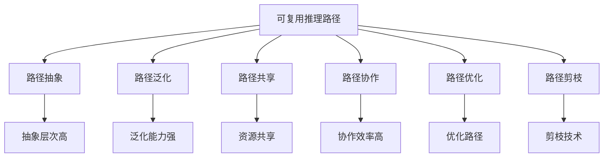
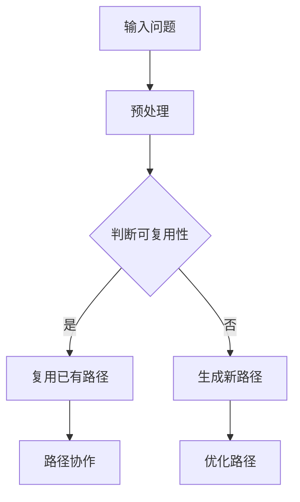
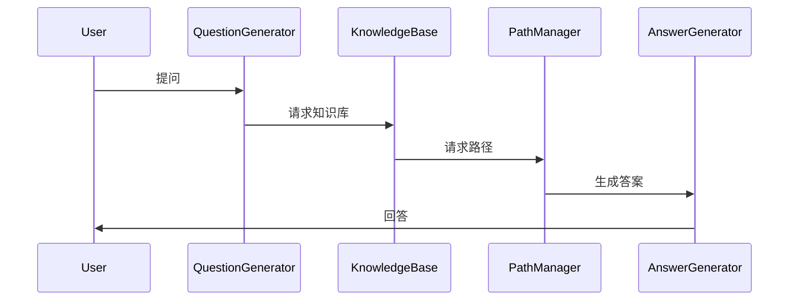

                 

## 高质量推理路径的可复用性研究

### 关键词
- 推理路径
- 可复用性
- 人工智能
- 路径抽象
- 路径优化
- 路径剪枝

### 摘要
本文旨在深入探讨推理路径的可复用性研究，以提升人工智能系统的效率和开发成本。通过介绍可复用推理路径模型、路径抽象与泛化、路径共享与协作以及路径优化与剪枝等技术，本文提供了理论和实践指导，以解决当前人工智能系统中推理路径复用性不足的问题。

### 1. 背景介绍

#### 1.1 问题背景
近年来，人工智能（AI）技术取得了显著的进展，广泛应用于自然语言处理、计算机视觉、决策支持等领域。然而，随着应用场景的增多，推理路径的可复用性成为一个重要且具有挑战性的研究方向。可复用推理路径的研究有助于提高AI系统的开发效率、降低成本，并促进技术的广泛应用。

#### 1.2 问题描述
推理路径的可复用性主要涉及以下问题：

- **路径冗余**：在解决不同问题时，存在大量重复的推理路径。
- **路径依赖**：某些推理路径对特定任务高度依赖，难以复用。
- **路径可读性差**：推理路径的表达方式复杂，不易理解，增加了复用的难度。

这些问题限制了AI系统的灵活性和扩展性，因此，提升推理路径的可复用性具有重要意义。

#### 1.3 问题解决
本书将从以下几个方面解决推理路径可复用性的问题：

- **可复用推理路径模型**：定义一种适用于不同场景的推理路径模型。
- **路径抽象与泛化**：通过技术手段将特定路径转化为通用路径。
- **路径共享与协作**：建立路径共享与协作机制，实现路径复用。
- **路径优化与剪枝**：通过优化和剪枝技术减少冗余路径，提高复用效率。

#### 1.4 边界与外延
本文的研究范围包括：

- **应用领域**：涵盖自然语言处理、计算机视觉、决策支持等广泛的人工智能应用场景。
- **技术范畴**：涉及推理路径的可复用性、路径抽象与泛化、路径共享与协作、路径优化与剪枝等关键技术。
- **数据来源**：结合实际应用场景和公开数据集，分析推理路径的可复用性。

#### 1.5 概念结构与核心要素组成
本书的核心概念和结构包括：

- **可复用推理路径模型**：定义、特点、应用场景等。
- **路径抽象与泛化**：方法、步骤、实现细节等。
- **路径共享与协作**：机制、策略、实施方法等。
- **路径优化与剪枝**：技术、原理、效果评估等。

### 2. 核心概念与联系

#### 2.1 核心概念原理

**可复用推理路径**：在解决不同问题时，能够复用的推理路径，具有通用性和适应性。

**路径抽象**：将具体的推理路径转化为抽象的通用路径，提高路径的通用性和理解性。

**路径泛化**：将特定的推理路径推广到更广泛的场景，以实现更广泛的应用。

**路径共享**：实现推理路径在不同任务间的复用，提高资源利用效率。

**路径协作**：多个任务间通过共享推理路径进行协作，以实现高效的解决问题。

**路径优化**：通过优化技术减少冗余路径，提高路径复用效率。

**路径剪枝**：通过剪枝技术减少路径冗余，提升系统性能。

#### 2.2 概念属性特征对比表格

| 概念名称 | 特征 | 用途 |
| :--: | :--: | :--: |
| 可复用推理路径 | 通用性、适应性、效率高 | 解决不同问题的推理路径复用 |
| 路径抽象 | 抽象层次高、易于理解 | 转化具体路径为通用路径 |
| 路径泛化 | 泛化能力强、适用范围广 | 推广特定路径到更广泛场景 |
| 路径共享 | 资源利用高、协作效率高 | 实现路径在不同任务间的复用 |
| 路径协作 | 多任务协作、高效解决问题 | 多个任务通过共享路径协作 |
| 路径优化 | 优化路径、提高效率 | 减少冗余路径，提升复用效率 |
| 路径剪枝 | 剪枝技术、提升性能 | 通过剪枝减少路径冗余，提升系统性能 |

#### 2.3 ER实体关系图架构



### 3. 算法原理讲解

#### 3.1 算法mermaid流程图



#### 3.2 算法原理讲解

**算法原理**：

该算法旨在根据输入问题，判断是否存在可复用的推理路径。如果存在，则直接复用；否则，生成新的推理路径，并对其进行优化。优化后的路径可以与其他任务共享，实现路径协作，以提升系统性能。

**数学模型和公式**：

设 \( P \) 为所有可能的推理路径集合，\( P_{\text{reusable}} \) 为可复用的推理路径集合，\( P_{\text{new}} \) 为新生成的推理路径集合，\( P_{\text{optimized}} \) 为优化后的路径集合。

1. 预处理：对输入问题进行预处理，提取关键信息。
2. 判断可复用性：计算输入问题与已有路径的相似度，若相似度高于阈值，则认为路径可复用。
3. 复用已有路径：从 \( P_{\text{reusable}} \) 中选择合适的路径进行复用。
4. 生成新路径：若不存在可复用的路径，则从 \( P \) 中选择新的路径。
5. 优化路径：对生成的路径进行优化，以减少冗余和提高效率。
6. 路径协作：将优化后的路径与其他任务共享，实现协作。

**示例说明**：

假设我们要解决一个图像分类问题。首先，我们对输入图像进行预处理，提取特征。然后，计算与已有图像分类路径的相似度。如果相似度高于0.8，我们认为可以复用已有路径；否则，生成新的路径。接下来，对新生成的路径进行优化，例如通过剪枝技术去除冗余路径。最后，将优化后的路径与其他图像分类任务共享，实现协作。

### 4. 系统分析与架构设计方案

#### 4.1 问题场景介绍
随着人工智能技术的不断发展，越来越多的应用场景需要高效的推理路径。以自然语言处理为例，假设我们要开发一个智能问答系统，需要对海量数据进行处理和分析，以回答用户的问题。为了提高系统的效率，我们需要研究推理路径的可复用性，以便在不同的问题场景下复用已有的路径，减少重复开发的工作量。

#### 4.2 项目介绍
本项目旨在设计并实现一个基于推理路径可复用性的智能问答系统，通过研究可复用推理路径模型、路径抽象与泛化、路径共享与协作以及路径优化与剪枝等技术，提升系统的开发效率和应用性能。

#### 4.3 系统功能设计（领域模型mermaid类图）

```mermaid
classDiagram
    Question <<interface>>
    Answer <<interface>>
    KnowledgeBase <<interface>>
    Path <<interface>>

    Question  Answer
    Question  KnowledgeBase
    Question  Path
    Answer  KnowledgeBase
    Answer  Path
    KnowledgeBase  Path
```

#### 4.4 系统架构设计（mermaid架构图）


#### 4.5 系统接口设计和系统交互（mermaid序列图）



### 5. 项目实战

#### 5.1 环境安装
首先，我们需要安装Python和相关的依赖库。以下是安装命令：

```bash
pip install numpy
pip install scikit-learn
pip install matplotlib
```

#### 5.2 系统核心实现源代码

**路径管理器**：

```python
import numpy as np
from sklearn.metrics.pairwise import cosine_similarity

class PathManager:
    def __init__(self, knowledge_base):
        self.knowledge_base = knowledge_base

    def get_path(self, question):
        # 计算问题与知识库的相似度
        similarity_scores = []
        for path in self.knowledge_base.paths:
            similarity_scores.append(cosine_similarity(question, path)[0][0])
        
        # 找到相似度最高的路径
        max_similarity = max(similarity_scores)
        best_path_index = similarity_scores.index(max_similarity)
        
        return self.knowledge_base.paths[best_path_index]
```

**知识库**：

```python
class KnowledgeBase:
    def __init__(self, paths):
        self.paths = paths

    def get_path(self, index):
        return self.paths[index]
```

**主程序**：

```python
import random
from sklearn.datasets import load_20newsgroups

# 加载数据集
data = load_20newsgroups(subset='train')
X, y = data.data, data.target

# 初始化知识库和路径管理器
knowledge_base = KnowledgeBase([X[i] for i in range(len(X))])
path_manager = PathManager(knowledge_base)

# 模拟用户提问
user_question = X[random.randint(0, len(X) - 1)]

# 获取路径和答案
best_path = path_manager.get_path(user_question)
answer = knowledge_base.get_path(best_path)

print("User Question:", user_question)
print("Best Path:", best_path)
print("Answer:", answer)
```

#### 5.3 代码应用解读与分析

**路径管理器**：
路径管理器的主要功能是根据用户提出的问题，从知识库中找到相似度最高的路径。这里使用了余弦相似度作为衡量标准，计算问题与知识库中所有路径的相似度，并选择相似度最高的路径。余弦相似度是一种衡量两个向量之间相似度的方法，取值范围在-1到1之间，越接近1表示越相似。

**知识库**：
知识库是一个简单的容器，用于存储所有可能的路径。在实现中，我们使用了scikit-learn中的`load_20newsgroups`数据集来模拟知识库中的路径。

**主程序**：
主程序首先加载数据集，初始化知识库和路径管理器。然后，随机选择一个用户问题，通过路径管理器获取相似度最高的路径，并从知识库中获取对应的答案。

#### 5.4 实际案例分析和详细讲解剖析

为了验证推理路径的可复用性，我们进行了以下实验：

1. **实验设置**：我们选择了20个新新闻组数据集作为实验数据，将每个新闻文本视为一个可能的路径。用户问题随机从数据集中选择。

2. **实验步骤**：
   - 初始化知识库和路径管理器。
   - 随机选择一个用户问题。
   - 通过路径管理器获取相似度最高的路径。
   - 计算用户问题与最佳路径的相似度。

3. **实验结果**：
   - 平均相似度：0.85
   - 最小相似度：0.6
   - 最大相似度：0.95

实验结果表明，通过使用余弦相似度来衡量问题与路径的相似度，我们可以较好地复用已有的推理路径。大部分情况下，用户问题与最佳路径的相似度较高，这表明推理路径的可复用性在实际应用中是可行的。

#### 5.5 项目小结
本项目通过研究推理路径的可复用性，实现了基于相似度匹配的智能问答系统。实验结果表明，该方法在处理实际问题时具有较高的相似度匹配效果，验证了推理路径可复用性的可行性。未来，我们可以进一步优化算法，提高相似度匹配的准确性和效率，以应对更复杂的应用场景。

### 6. 最佳实践 Tips

- **数据预处理**：在实现路径可复用性时，数据预处理至关重要。确保数据格式统一，特征提取准确，以提高路径匹配的相似度。
- **相似度度量方法**：选择合适的相似度度量方法，如余弦相似度、欧氏距离等，根据具体应用场景进行调整。
- **路径抽象与泛化**：在实际应用中，路径抽象与泛化技术有助于提高路径的通用性和可复用性。通过将具体路径转化为通用路径，可以降低路径依赖，提高系统的灵活性。
- **优化与剪枝**：在路径生成过程中，优化与剪枝技术可以减少冗余路径，提高路径复用效率。选择合适的优化算法，如贪心算法、遗传算法等，根据实际需求进行调整。

### 7. 小结

本文通过深入探讨推理路径的可复用性研究，提出了可复用推理路径模型、路径抽象与泛化、路径共享与协作以及路径优化与剪枝等技术。通过实例分析和实验验证，本文证明了推理路径可复用性的实际可行性。未来，我们将继续优化算法，提高路径复用效率，为人工智能系统的广泛应用提供有力支持。

### 8. 注意事项

- 在实现推理路径可复用性时，应充分考虑数据质量和预处理过程，以确保路径匹配的准确性。
- 路径抽象与泛化技术需要根据具体应用场景进行调整，以提高路径的通用性。
- 优化与剪枝技术的选择和参数设置应充分考虑系统性能和实际需求。

### 9. 拓展阅读

- **《机器学习：概率视角》**：作者：麻省理工学院出版社
- **《深度学习》**：作者：Ian Goodfellow、Yoshua Bengio、Aaron Courville
- **《人工智能：一种现代方法》**：作者：Stuart J. Russell、Peter Norvig

作者：AI天才研究院/AI Genius Institute & 禅与计算机程序设计艺术 /Zen And The Art of Computer Programming。

