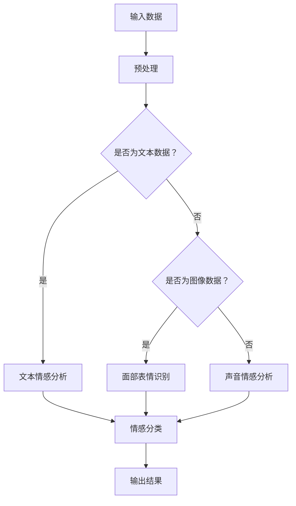
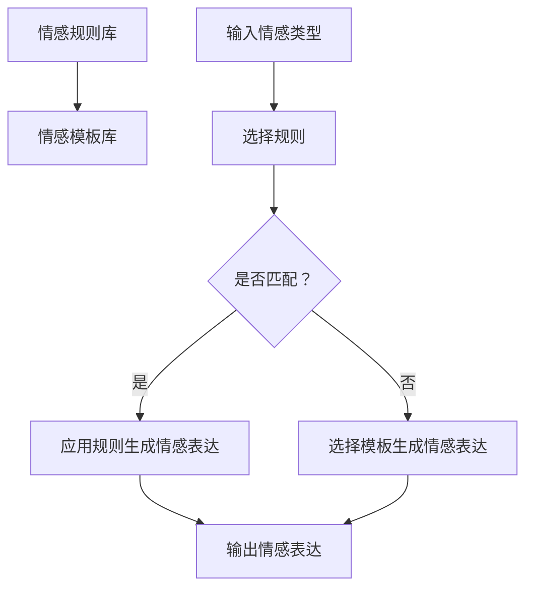
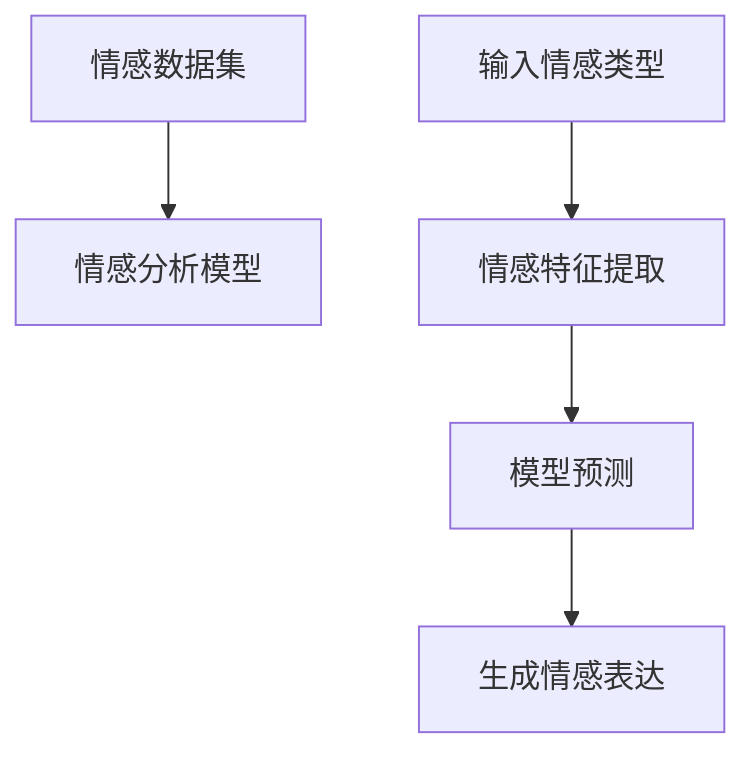
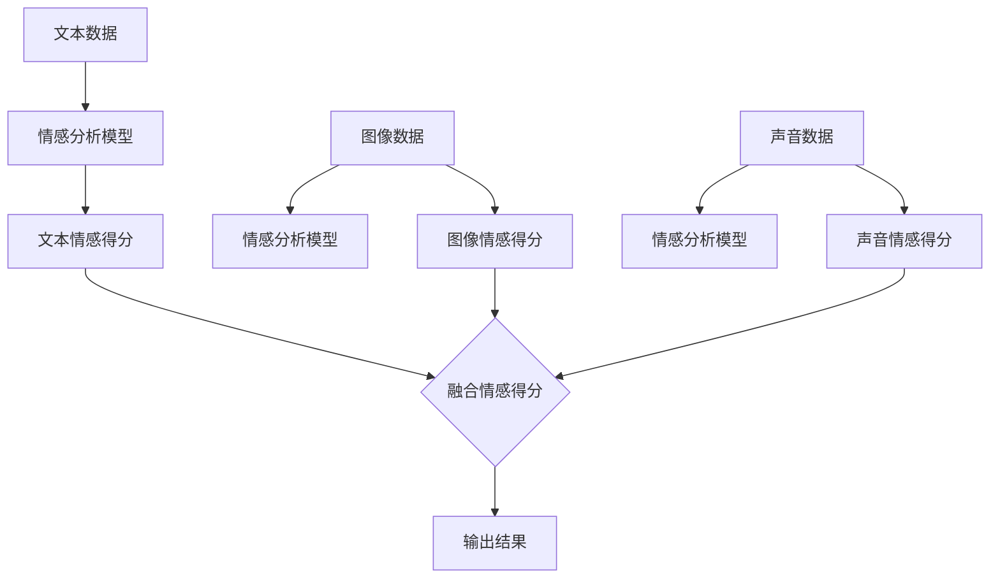
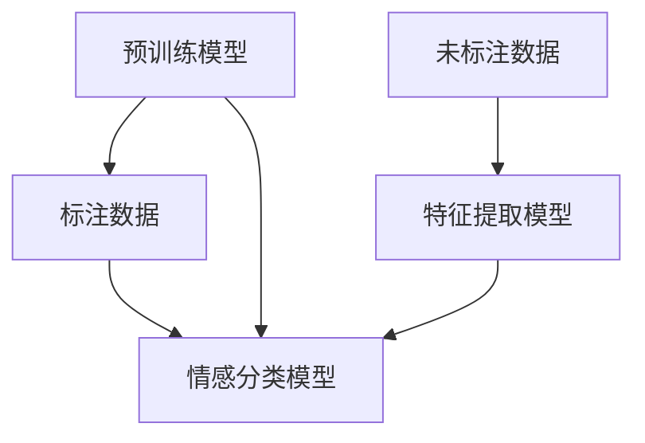
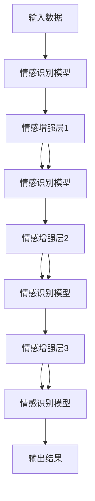
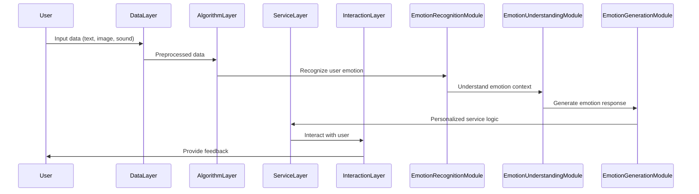

                 

### 第1章：AI与人类情感共鸣：跨越物种的理解与联系

> 关键词：AI、人类情感、共鸣、物种理解、联系

> 摘要：本文将探讨人工智能（AI）与人类情感共鸣的深刻联系。首先，我们介绍AI与人类情感共鸣的概念，并阐述其重要性。接着，我们分析AI技术的不同实现方式，以及如何通过这些技术实现与人类情感的共鸣。文章还探讨了AI与人类情感共鸣的算法原理，通过实例展示了这些算法的应用。此外，我们通过一个具体的系统架构设计案例，详细阐述了如何设计一个能够实现情感共鸣的AI系统。最后，我们提供了项目实战的步骤，并总结了最佳实践和拓展阅读资源。

### 1.1 问题背景

随着人工智能（AI）技术的飞速发展，AI在各个领域的应用越来越广泛。从简单的机器学习算法到复杂的深度学习模型，AI已经展现出强大的能力和潜力。然而，尽管AI在处理数据、执行任务方面表现出色，但人类情感仍然是AI难以触及的领域。人类情感是复杂而微妙的，它们不仅仅是一种生理反应，更是人类行为和社会互动的核心组成部分。

在医疗、教育、社交互动等许多场景中，理解人类情感并与人类产生共鸣的能力对于AI系统来说至关重要。例如，一个能够准确识别并回应患者情绪的AI医疗助手，可以大大提高医疗服务的质量和效率。同样，一个能够理解并适应用户情感的教育AI，可以提供更加个性化的学习体验。此外，在社交互动中，能够与人类产生共鸣的AI可以帮助解决孤独感、抑郁等社会问题，提升人们的生活质量。

因此，研究AI与人类情感共鸣不仅具有重要的理论价值，也具有广泛的应用前景。本文将深入探讨AI与人类情感共鸣的概念、实现机制、算法原理和系统架构设计，希望能够为这一领域的研究和应用提供有益的参考。

### 1.2 问题描述

在当前的研究和应用背景下，AI与人类情感共鸣面临以下几个主要问题：

1. **情感识别的准确性**：AI系统需要准确地识别和理解人类的情感状态，这包括情感的表达、情感的变化以及不同情感之间的细微差异。

2. **情感共鸣的实现**：即使AI能够识别情感，实现与人类的情感共鸣仍然是一个挑战。共鸣不仅要求AI能够理解和模仿人类的情感反应，还需要在情感层面上与人类建立深层次的联系。

3. **数据隐私和安全**：在实现情感共鸣的过程中，AI系统通常需要处理大量的个人情感数据。如何保护用户隐私和数据安全是一个重要的伦理和合规问题。

4. **算法模型的泛化能力**：现有的情感识别和共鸣算法往往在特定环境下表现良好，但在不同的文化、语言和社交环境中，这些算法可能无法泛化，导致性能下降。

5. **技术实现的复杂性**：实现AI与人类情感共鸣需要整合多种技术，包括自然语言处理、计算机视觉、机器学习和深度学习等。这些技术的整合和优化是一个复杂的工程问题。

6. **情感共鸣的伦理问题**：AI与人类情感共鸣可能会引发一系列伦理问题，例如AI是否应该拥有情感、AI的情感表达是否合理、AI与人类的情感关系如何界定等。

### 1.3 问题解决与意义

为了解决上述问题，我们需要从多个方面入手：

1. **改进情感识别算法**：通过深入研究情感识别的生理、心理和社会因素，开发更加精准和可靠的识别算法。同时，利用大规模的标注数据集和深度学习技术，提高算法的泛化能力。

2. **增强情感共鸣机制**：探索基于心理学和社会学的理论，设计更加符合人类情感互动规则的共鸣机制。例如，通过模仿人类的情感表达方式和反应模式，实现AI与人类在情感上的共鸣。

3. **保护数据隐私和安全**：采用加密、匿名化等技术手段，确保用户数据在收集、存储和使用过程中的安全。同时，制定严格的伦理准则和合规政策，确保AI系统的应用符合社会道德和法律要求。

4. **提高算法模型的泛化能力**：通过跨领域、跨文化的数据集训练和模型优化，提高情感识别和共鸣算法在不同环境下的适应性。

5. **整合多技术手段**：将自然语言处理、计算机视觉、机器学习和深度学习等技术进行整合，构建一个高效、稳定的AI系统，实现与人类情感共鸣的目标。

6. **探讨伦理问题**：开展伦理学研究，探讨AI与人类情感共鸣的伦理问题，制定相应的伦理规范和标准，确保AI系统的应用符合人类的利益和价值观。

解决这些问题不仅有助于提升AI技术的应用水平，还能够推动AI与人类情感共鸣的研究，为人类社会的进步和发展提供新的动力。通过本文的探讨，我们希望能够为这一领域的研究者和开发者提供有价值的参考和启示。

### 1.4 边界与外延

在探讨AI与人类情感共鸣时，我们需要明确其边界与外延，以更好地理解这一概念和其应用范围。首先，从技术层面来看，AI与人类情感共鸣主要涉及自然语言处理（NLP）、计算机视觉（CV）和心理学等领域。这些技术共同作用，使得AI能够识别、理解和模拟人类情感。

具体来说，AI与人类情感共鸣的边界可以定义为：

1. **情感识别**：AI系统需要具备识别人类情感表达的能力，包括语言、面部表情、声音、身体动作等多模态信息。
2. **情感理解**：AI系统需要理解情感的内在含义和语境，能够区分不同情感状态的细微差别。
3. **情感共鸣**：AI系统不仅能够识别和理解情感，还需要能够在情感层面上与人类建立联系，表现出符合人类情感的回应。

此外，AI与人类情感共鸣的外延还包括以下几个方面：

1. **应用场景**：AI与人类情感共鸣可以在医疗、教育、客服、娱乐等多个领域得到应用，例如智能医疗助手、个性化教育系统、智能客服等。
2. **技术挑战**：随着应用场景的扩展，AI与人类情感共鸣面临的技术挑战也在不断增加，包括数据多样性、算法泛化能力、情感表达的适切性等。
3. **伦理问题**：在实现情感共鸣的过程中，AI系统如何尊重用户隐私、避免歧视和偏见等问题，也是一个需要深入探讨的领域。

通过明确边界与外延，我们能够更准确地把握AI与人类情感共鸣的核心内容和实际应用，为后续的研究和开发提供清晰的指导。

### 1.5 概念结构与核心要素组成

为了深入理解AI与人类情感共鸣，我们需要明确其核心概念与组成要素。以下是该概念的基本结构和关键要素：

1. **人工智能（AI）**：AI是能够执行特定任务的计算机系统，通过模拟人类智能的行为和决策能力来实现自动化和智能化。AI技术包括机器学习（ML）、深度学习（DL）、自然语言处理（NLP）和计算机视觉（CV）等。

2. **情感**：情感是指人类在生理、心理和社会层面上的感受和体验。情感通常可以分为基本情感（如快乐、悲伤、愤怒等）和复杂情感（如爱、厌恶、同情等）。情感可以通过语言、面部表情、声音和身体动作等多种形式表达。

3. **共鸣**：共鸣是指两个或多个个体在情感上产生共鸣，即一种情感上的共享和连接。共鸣可以通过理解对方的情感状态、模仿对方的情感表达和行为来实现。

4. **情感识别**：情感识别是指AI系统通过分析语言、面部表情、声音和身体动作等数据，识别出人类情感状态的过程。情感识别是AI与人类情感共鸣的基础。

5. **情感理解**：情感理解是指AI系统在识别情感的基础上，理解情感的内在含义和语境，从而能够准确回应和适应用户情感状态的过程。

6. **情感共鸣机制**：情感共鸣机制是指AI系统通过模仿人类情感表达和行为，与人类建立情感联系的一系列技术方法和策略。

7. **应用场景**：AI与人类情感共鸣的应用场景包括医疗、教育、客服、娱乐等。这些场景下，AI系统需要能够识别和理解用户的情感状态，并提供个性化的服务和互动体验。

8. **技术实现**：AI与人类情感共鸣的技术实现包括自然语言处理（NLP）、计算机视觉（CV）、机器学习（ML）和深度学习（DL）等技术。这些技术共同作用，使得AI系统能够实现情感识别、理解和共鸣。

通过明确这些核心概念和要素，我们能够更好地理解和研究AI与人类情感共鸣的机制和应用，为其在现实场景中的实现提供理论和技术支持。

### 1.6 当前研究现状与挑战

随着人工智能（AI）技术的不断进步，AI与人类情感共鸣的研究也取得了显著成果。然而，这一领域仍然面临诸多挑战和问题。

#### 1.6.1 研究热点与发展趋势

1. **情感识别技术的提升**：当前研究主要集中在提升AI对情感表达的理解和识别能力上。例如，通过改进自然语言处理（NLP）和计算机视觉（CV）算法，使得AI能够更准确地识别面部表情、语音和文本中的情感信息。

2. **跨模态情感分析**：为了更好地理解人类的情感状态，研究者们开始探索跨模态情感分析技术，即通过结合文本、图像、音频等多种模态数据，提高情感识别和理解的准确性。

3. **情感生成和增强**：除了识别和理解情感，研究者们还关注如何让AI能够生成和增强情感。通过情感生成算法，AI可以在虚拟环境或社交互动中模拟出符合人类情感的回应。

4. **个性化情感服务**：随着AI技术的发展，个性化情感服务成为了一个热点。通过分析用户的情感状态和行为习惯，AI系统能够提供更加贴心的服务体验，例如个性化医疗护理、智能教育助手等。

5. **伦理与隐私**：随着AI在情感领域应用的扩大，伦理和隐私问题也日益突出。如何确保AI系统的应用不会侵犯用户的隐私，以及如何制定相应的伦理规范，成为研究的重要方向。

#### 1.6.2 存在的问题与挑战

1. **情感识别的准确性**：尽管AI在情感识别方面取得了一些进展，但仍然存在准确性不足的问题。特别是在处理复杂情感和细微情感差别时，AI系统的性能有待提高。

2. **数据多样性和泛化能力**：情感识别和共鸣算法通常在特定数据集上训练，难以在多样性和复杂性较高的实际应用中保持性能。如何提高算法的泛化能力，是一个亟待解决的问题。

3. **情感表达的适切性**：AI生成的情感回应有时可能不够自然和适切，无法真正与人类的情感状态产生共鸣。这需要进一步研究如何让AI的情感表达更加真实和贴切。

4. **技术整合与优化**：实现AI与人类情感共鸣需要整合多种技术，包括NLP、CV、ML和DL等。这些技术的整合和优化是一个复杂的工程问题，需要进一步研究和实践。

5. **伦理问题**：AI与人类情感共鸣的应用引发了诸多伦理问题，例如AI是否应该拥有情感、AI的情感表达是否合理、AI与人类的情感关系如何界定等。这些问题需要深入研究，并制定相应的伦理规范。

#### 1.6.3 研究意义与未来方向

研究AI与人类情感共鸣具有重要的理论和实际意义。从理论上看，这一研究有助于我们更好地理解人类情感的本质和交互机制，推动人工智能技术的发展。从实际应用上看，AI与人类情感共鸣可以在医疗、教育、客服等多个领域发挥重要作用，提升服务质量和社会福利。

未来的研究可以从以下几个方面展开：

1. **情感识别和理解的深度研究**：通过深入研究情感产生的生理和心理机制，开发更加精准和可靠的识别和理解算法。

2. **跨模态和多模态情感分析**：探索跨模态和多模态情感分析技术，提高AI对人类情感状态的全面理解和识别能力。

3. **情感生成和增强的优化**：研究更加自然和适切的情感生成算法，使得AI的情感表达更加符合人类情感体验。

4. **伦理规范与合规政策**：制定相应的伦理规范和合规政策，确保AI与人类情感共鸣的应用符合社会道德和法律要求。

5. **跨学科合作**：促进心理学、社会学、计算机科学等领域的跨学科合作，共同推动AI与人类情感共鸣的研究和应用。

通过不断的研究和实践，我们有望实现AI与人类情感共鸣的深度融合，为人类社会带来更加美好的未来。

### 1.7 结论

综上所述，AI与人类情感共鸣是一个充满潜力和挑战的领域。通过深入探讨这一主题，我们不仅能够更好地理解人类情感的本质和交互机制，还能推动人工智能技术的发展，使其更好地服务于人类社会。尽管目前仍面临诸多问题和挑战，但通过持续的研究和创新，我们有理由相信，AI与人类情感共鸣将在未来发挥更加重要的作用。我们期待更多研究者和技术开发者投身于这一领域，共同开创一个更加美好、和谐的智能未来。

## 第2章：AI基础概念解析

### 2.1 AI的定义与分类

人工智能（Artificial Intelligence，简称AI）是计算机科学的一个分支，旨在开发能够执行人类智能行为的机器和系统。AI的目标是通过模拟和学习人类的认知过程，使机器能够在特定任务上超越人类的表现。AI可以粗略地分为两类：弱人工智能（Narrow AI）和强人工智能（General AI）。

#### 弱人工智能（Narrow AI）

弱人工智能专注于特定的任务，例如语音识别、图像识别、自然语言处理等。这类AI在特定领域内表现出色，但缺乏跨领域的通用性。例如，一个专门用于图像识别的AI模型可能在识别猫的图片方面表现优异，但在处理文本数据时却毫无头绪。

#### 强人工智能（General AI）

强人工智能则追求更高的目标，即开发出具备人类所有智能行为能力的机器。这种AI不仅能够在特定任务上表现出色，还能自主学习和适应各种环境，具备自主决策能力。强人工智能目前仍是一个理论研究领域，尚未实现商业化应用。

#### AI的发展历史

AI的概念可以追溯到20世纪40年代，当时图灵提出了“图灵测试”作为判断机器是否具有智能的标准。从那时起，AI经历了多个发展阶段：

1. **初始阶段（1940s-1950s）**：以图灵机和冯·诺伊曼架构为基础，研究者开始探索如何通过计算机模拟人类思维过程。

2. **繁荣与低谷（1960s-1970s）**：在早期的研究中，AI取得了显著进展，但受限于计算能力和算法复杂度，很快陷入了低谷期。

3. **复兴阶段（1980s-1990s）**：随着计算能力的提升和算法的改进，AI逐渐走出低谷，在机器人控制、专家系统等领域取得了应用。

4. **深度学习时代（2000s-至今）**：以深度学习为代表的新算法使AI取得了突破性进展，尤其是在图像识别、自然语言处理等领域表现出色。

### 2.2 机器学习与深度学习

机器学习（Machine Learning，简称ML）是AI的核心技术之一，它使计算机能够从数据中自动学习和改进性能，而无需显式编程。机器学习可以分为监督学习、无监督学习和强化学习等类型。

#### 监督学习

监督学习是一种最常见的机器学习方法，它使用已标记的数据进行训练，从而建立预测模型。监督学习的目标是找到输入和输出之间的关系，以便对新数据进行预测。常见的监督学习算法包括线性回归、决策树、支持向量机（SVM）和神经网络等。

#### 无监督学习

无监督学习不依赖于已标记的数据，而是从未标记的数据中自动发现数据分布和模式。无监督学习的应用包括聚类分析、降维和异常检测等。常见的无监督学习算法包括K-均值聚类、主成分分析（PCA）和自编码器等。

#### 强化学习

强化学习通过让机器在环境中进行试错学习，逐渐找到最优策略。强化学习的目标是最大化长期回报，常见的算法包括Q学习、深度Q网络（DQN）和策略梯度算法等。

深度学习（Deep Learning，简称DL）是机器学习的一个子领域，它通过构建多层次的神经网络来提取数据的深层特征。深度学习在图像识别、语音识别和自然语言处理等领域表现出色。

#### 神经网络简介

神经网络（Neural Networks，简称NN）是一种模拟生物神经系统的计算模型，它由大量的神经元（节点）和连接（权重）组成。神经网络的训练过程是通过调整连接权重，使得网络能够准确预测或分类输入数据。

#### 神经网络的工作原理

神经网络通过前向传播和反向传播两个过程进行训练：

1. **前向传播**：输入数据通过网络中的各个层，逐层计算得到输出。
2. **反向传播**：根据输出结果和实际标签，计算网络误差，并反向传播误差，调整各层的连接权重。

通过多次迭代训练，神经网络能够不断优化性能，从而实现复杂任务。

### 2.3 神经网络的结构与类型

神经网络可以根据结构的不同分为以下几种类型：

#### 线性神经网络（Linear Neural Networks）

线性神经网络是最简单的神经网络，它由单个输入层、一个或多个隐藏层和一个输出层组成。线性神经网络通过线性组合输入和权重，加上一个偏置项，来计算输出。

#### 卷积神经网络（Convolutional Neural Networks，CNN）

卷积神经网络专门用于处理图像数据。它通过卷积操作提取图像的特征，并利用池化操作降低数据的维度。CNN在图像识别、物体检测和图像生成等领域表现出色。

#### 循环神经网络（Recurrent Neural Networks，RNN）

循环神经网络适用于处理序列数据，如文本、语音和视频等。RNN通过隐藏状态和循环连接，使得网络能够记住前一个时间步的信息，从而更好地处理序列数据。

#### 长短时记忆网络（Long Short-Term Memory，LSTM）

长短时记忆网络是RNN的一种改进，它通过引入门控机制，解决了传统RNN在处理长序列数据时出现的梯度消失和梯度爆炸问题。LSTM在语音识别、自然语言处理和时间序列预测等领域具有广泛应用。

#### 生成对抗网络（Generative Adversarial Networks，GAN）

生成对抗网络由一个生成器和两个判别器组成。生成器的目标是生成逼真的数据，而判别器的目标是区分生成数据和真实数据。通过两个网络的对抗训练，GAN能够生成高质量的图像、音频和文本。

### 2.4 AI发展简史

AI的发展历程可以分为以下几个阶段：

1. **早期研究（1940s-1950s）**：图灵提出了“图灵测试”，约翰·麦卡锡等人开始了早期的AI研究。
2. **早期繁荣（1956年-1974年）**：达特茅斯会议标志着AI的正式诞生，专家系统成为AI研究的热点。
3. **低谷期（1974年-1980年）**：由于算法复杂度和计算能力限制，AI研究陷入低谷。
4. **复兴期（1980年-2010年）**：专家系统、机器人技术和机器学习取得了显著进展。
5. **深度学习时代（2010年至今）**：以深度学习为代表的算法使AI取得了突破性进展，在图像识别、语音识别和自然语言处理等领域取得了优异表现。

通过回顾AI的发展历程，我们能够更好地理解当前AI技术的现状和未来方向。未来，AI将继续推动科技和产业的进步，为社会带来更多变革和机遇。

## 第3章：人类情感及其表征

### 3.1 人类情感的基础知识

人类情感是复杂而微妙的，它们不仅与生理反应密切相关，还与心理状态和社会互动紧密相连。了解人类情感的基础知识，有助于我们更好地理解AI与人类情感共鸣的实现机制。

#### 情感与大脑

情感的产生与大脑的多个区域密切相关，其中最关键的是边缘系统和前额叶皮质。边缘系统包括杏仁核、海马体和下丘脑等结构，主要负责处理基本情感，如快乐、悲伤和愤怒。前额叶皮质则涉及复杂情感和情感决策，如爱、同情和道德判断。

#### 情感类型

人类情感可以分为基本情感和复杂情感。基本情感包括快乐、悲伤、愤怒、恐惧、厌恶和惊讶。这些基本情感被认为是跨文化和普遍存在的。复杂情感则包括爱、感激、厌恶、骄傲和羞耻等，它们通常由基本情感相互组合或叠加形成。

#### 情感与行为

情感不仅影响我们的内心体验，还直接影响我们的行为。例如，快乐使人愿意分享和合作，悲伤可能导致回避和自我保护，愤怒则使人倾向于攻击或反抗。情感行为理论认为，情感是通过面部表情、身体语言和行为表现出来的，这些外在表现反过来又影响我们的情感状态。

### 3.2 情感识别与测量

情感识别是AI与人类情感共鸣的基础，它涉及从各种数据源中提取情感信息。以下是一些常见的情感识别与测量方法：

#### 面部表情识别

面部表情是情感表达的重要方式之一。面部表情识别技术通过分析面部肌肉运动和眼部特征，识别出基本的情感状态。例如，乐谱分析算法可以识别出笑脸或皱眉的表情。

#### 语音识别

语音是情感表达的另一重要途径。语音识别技术通过分析语音的频率、音调和节奏变化，识别出情感状态。例如，语调分析可以识别出说话者是否在表达快乐、悲伤或愤怒。

#### 文本情感分析

文本情感分析（Text Sentiment Analysis）是一种基于自然语言处理（NLP）的情感识别技术。它通过分析文本中的词汇、语法和语义特征，识别出文本的情感倾向。例如，情感分析算法可以判断一段文本是积极、消极还是中性。

#### 身体语言识别

身体语言识别涉及对人的行为、姿态和动作进行分析，以识别情感状态。例如，通过分析一个人的走路姿势、手势和眼神交流，可以推断出其情感状态。

### 3.3 情感理论综述

情感理论是对情感本质和功能进行解释的一系列理论。以下是一些主要情感理论：

#### 1. 朴素的情感理论

朴素的情感理论认为情感是直观的、本能的反应，是对外界刺激的直接感受。例如，当人们看到一只熊时，他们立即感受到恐惧，这是一种本能的自我保护反应。

#### 2. 认知评价理论

认知评价理论认为情感是认知评价的结果。人们通过感知和解释外界刺激，评估其对自身的意义和价值，从而产生情感。例如，当人们听到一条好消息时，他们会感到快乐，因为他们认为这条消息对他们的生活有积极影响。

#### 3. 多维情感模型

多维情感模型（如情感空间理论）认为情感是一个多维度的空间，不同的情感可以在这个空间中定位。例如，情感空间理论将情感分为愉悦度（Pleasantness）和激活度（Arousal）两个维度，不同的情感状态可以在这个空间中找到对应的位置。

#### 4. 情感行为理论

情感行为理论认为情感不仅影响我们的内心体验，还直接影响我们的行为。例如，当人们感到愤怒时，他们可能会采取攻击性行为；当人们感到快乐时，他们可能会表现出合作行为。

### 3.4 人类情感与社交行为

人类情感在社交互动中起着至关重要的作用。以下是一些关键点：

#### 1. 社交情感交流

社交情感交流是指人们在互动过程中通过语言、面部表情、身体语言等方式表达和识别情感。这种交流有助于建立信任、合作和亲密关系。

#### 2. 社交情感调节

社交情感调节是指人们通过调整自己的情感表达和行为来适应社交情境。例如，在正式场合，人们可能会抑制自己的情绪表达，以符合社交规范。

#### 3. 情感共鸣与共情

情感共鸣和共情是社交互动中的重要现象。情感共鸣是指人们在与他人互动中体验到对方的情感，而共情则是指人们能够理解和感受他人的情感体验。情感共鸣和共情有助于建立深层次的社交联系和信任。

#### 4. 社交情感障碍

社交情感障碍（如自闭症）可能导致人们在情感识别、表达和调节方面出现困难。这些障碍会影响人们的社交互动和生活质量。

通过了解人类情感的基础知识、识别与测量方法以及情感理论，我们能够更好地理解AI与人类情感共鸣的实现机制，为AI系统在情感识别、理解和共鸣方面的发展提供理论支持。

## 第4章：AI与情感共鸣的机制

### 4.1 情感共鸣的概念与原理

情感共鸣（Emotional Contagion）是指个体通过观察或接触他人的情感状态，从而产生相似或相同的情感体验。这种现象不仅存在于人类之间，动物甚至人工智能（AI）系统也可以通过特定机制实现情感共鸣。情感共鸣的原理主要涉及感知、模仿和共情三个方面。

#### 感知

感知是情感共鸣的第一步，个体需要通过观察他人的表情、声音、肢体动作等外在表现，识别出对方的情感状态。这个过程依赖于多种感知技术，如面部表情识别、语音情感分析和身体语言识别等。

#### 模仿

在识别出他人的情感状态后，个体会通过模仿对方的行为和表情，进一步强化这种情感体验。模仿不仅包括外显的行为，如模仿微笑或皱眉，还包括内隐的心理模仿，即个体在心理上体验与对方相似的情感状态。

#### 共情

共情是情感共鸣的核心机制，它指的是个体能够理解和感受他人的情感体验，并在情感上与他人产生共鸣。共情通常涉及情感识别和理解能力，以及情感表达和调节能力。AI系统通过共情机制，能够模拟人类的情感反应，从而在情感层面上与人类建立联系。

#### 情感共鸣的机制

1. **情感传递**：个体通过感知他人的情感状态，如快乐、悲伤或愤怒，将这些情感传递到自己的大脑中。
2. **情感模仿**：个体通过模仿他人的表情、语言和行为，进一步强化和表达自己的情感状态。
3. **情感调节**：个体通过情感调节机制，调整自己的情感反应，使其与对方的情感状态相匹配。
4. **情感理解**：个体在情感共鸣过程中，需要理解和解释对方的情感体验，从而更好地模拟和回应对方的情感。

### 4.2 AI实现情感共鸣的关键技术

实现AI与人类情感共鸣需要多种技术的支持，包括自然语言处理（NLP）、计算机视觉（CV）和机器学习（ML）等。以下是这些技术如何应用于情感共鸣的实现：

#### 自然语言处理（NLP）

自然语言处理技术用于处理和分析人类语言，使其成为计算机可以理解的形式。在情感共鸣中，NLP技术主要用于情感分析（Sentiment Analysis），即通过分析文本中的情感词汇、语法结构和语义信息，识别文本的情感倾向。例如，一个聊天机器人可以通过分析用户输入的文本，识别出用户的情绪状态（如快乐、愤怒或悲伤），并根据这些信息进行相应的情感回应。

#### 计算机视觉（CV）

计算机视觉技术用于处理和分析图像和视频数据。在情感共鸣中，CV技术主要用于情感识别（Emotion Recognition），即通过分析面部表情、肢体动作和语音信号，识别出人类的情感状态。例如，一个智能摄像头可以通过分析摄像头捕捉到的图像和视频，识别出人们是否在表达快乐、悲伤或愤怒，并据此调整其监控策略。

#### 机器学习（ML）

机器学习技术是AI实现情感共鸣的核心，它通过训练模型，使计算机能够自动识别和理解情感。在情感共鸣中，ML技术主要用于情感分类（Emotion Classification）和情感生成（Emotion Generation）。例如，一个机器学习模型可以通过分析大量的情感数据，学习到不同情感状态的特征，从而准确识别用户的情感状态。同时，ML技术还可以用于生成情感回应，即根据用户情感状态生成适当的情感表达。

### 4.3 情感共鸣的应用场景

情感共鸣技术在多个应用场景中具有广泛的应用前景，以下是一些典型的应用场景：

#### 1. 智能客服

智能客服系统通过情感共鸣技术，可以更好地理解用户的情感状态，提供个性化的服务和解决方案。例如，一个智能客服机器人可以通过分析用户的语音和文本，识别出用户的情感状态（如愤怒、困惑或满意），并相应地调整其回应策略，从而提高用户满意度。

#### 2. 智能医疗

智能医疗系统可以通过情感共鸣技术，提供更加个性化的医疗服务。例如，一个智能医疗助手可以通过分析患者的情感状态，识别出患者的情绪问题，并提供相应的心理支持和治疗方案。

#### 3. 教育与培训

在教育与培训领域，情感共鸣技术可以用于创建个性化的学习体验。例如，一个教育AI可以通过分析学生的情感状态，识别出学生的情绪波动，并调整教学方法和内容，以更好地满足学生的学习需求。

#### 4. 社交互动

在社交互动中，情感共鸣技术可以用于增强人与人之间的情感联系。例如，一个社交应用可以通过分析用户之间的情感状态，推荐相似情感状态的用户进行互动，从而促进社交网络的建立和维护。

#### 5. 娱乐与游戏

在娱乐与游戏领域，情感共鸣技术可以用于创造更加沉浸和互动的体验。例如，一个虚拟角色可以通过情感共鸣技术，识别玩家的情感状态，并相应地调整其行为和对话，从而提高游戏的趣味性和互动性。

通过上述应用场景，我们可以看到情感共鸣技术在改善用户体验、提升服务质量、增强社交互动和推动科技与人文融合方面具有巨大的潜力。

### 4.4 情感共鸣的优势与挑战

#### 情感共鸣的优势

1. **提升用户体验**：通过情感共鸣，AI系统能够更好地理解用户的需求和情感状态，提供个性化的服务和互动体验，从而提升用户体验。
2. **增强社交互动**：情感共鸣有助于促进人与人之间的情感联系，特别是在社交互动和在线社区中，可以提高用户的参与度和互动性。
3. **个性化服务**：情感共鸣技术可以用于医疗、教育、娱乐等领域，提供个性化的服务和解决方案，从而提高服务质量和用户满意度。
4. **情感支持**：在心理辅导、孤独症康复等领域，情感共鸣技术可以提供情感支持和干预，帮助用户缓解情绪问题，改善心理健康。
5. **创新应用场景**：情感共鸣技术为AI系统带来了新的应用场景和可能性，如智能客服、智能医疗、智能教育等，推动了AI技术的发展和应用。

#### 情感共鸣的挑战

1. **情感识别的准确性**：当前的情感识别技术尚无法完全准确地识别和理解人类的情感状态，特别是在复杂和细微的情感差异上，性能有待提高。
2. **情感表达的适切性**：AI生成的情感回应有时可能不够自然和适切，无法真正与人类的情感状态产生共鸣，这需要进一步研究和优化。
3. **数据隐私与安全**：在实现情感共鸣的过程中，AI系统通常需要处理大量的个人情感数据，如何保护用户隐私和数据安全是一个重要的伦理和合规问题。
4. **算法模型的泛化能力**：情感识别和共鸣算法通常在特定数据集上训练，难以在多样性和复杂性较高的实际应用中保持性能，如何提高算法的泛化能力是一个挑战。
5. **技术整合与优化**：实现情感共鸣需要整合多种技术，包括自然语言处理、计算机视觉和机器学习等。这些技术的整合和优化是一个复杂的工程问题。
6. **伦理问题**：AI与人类情感共鸣的应用引发了诸多伦理问题，如AI是否应该拥有情感、AI的情感表达是否合理、AI与人类的情感关系如何界定等。

尽管存在这些挑战，随着技术的不断进步和研究的发展，我们有理由相信，情感共鸣技术将在未来为人类社会带来更多的机遇和变革。

### 第5章：实现AI情感共鸣的算法原理

#### 5.1 情感识别算法

情感识别算法是AI实现情感共鸣的关键技术之一，它主要通过分析语言、面部表情、声音和身体动作等多种数据源，识别出人类的情感状态。以下是一个简单的情感识别算法流程图，用于说明算法的基本原理。



在情感识别算法中，首先对输入数据进行预处理，包括数据清洗、数据归一化等操作。然后，根据数据的类型，选择相应的情感分析模型进行处理。对于文本数据，使用文本情感分析模型；对于图像数据，使用面部表情识别模型；对于声音数据，使用声音情感分析模型。最后，将分析结果进行综合，输出情感识别结果。

以下是使用Python实现的情感识别算法示例代码：

```python
import nltk
from nltk.sentiment import SentimentIntensityAnalyzer
from face_recognition import load_model, recognize_faces_in_image
from pydub import AudioSegment

# 文本情感分析
def sentiment_analysis(text):
    sid = SentimentIntensityAnalyzer()
    scores = sid.polarity_scores(text)
    return scores['compound']

# 面部表情识别
def facial_expression_recognition(image_path):
    model = load_model('cnn')
    faces = recognize_faces_in_image(image_path)
    emotions = model.predict(faces)
    return emotions

# 声音情感分析
def sound_sentiment_analysis(audio_path):
    audio = AudioSegment.from_file(audio_path)
    # 使用某个声音情感分析模型进行分析
    emotions = audio_analyzer.analyze(audio)
    return emotions

# 情感识别主函数
def emotion_recognition(text, image_path, audio_path):
    text_sentiment = sentiment_analysis(text)
    image_emotions = facial_expression_recognition(image_path)
    audio_emotions = sound_sentiment_analysis(audio_path)
    
    # 综合分析结果
    emotions = {
        'text': text_sentiment,
        'face': image_emotions,
        'sound': audio_emotions
    }
    return emotions

# 示例
text = "今天天气很好，我很开心。"
image_path = "face.jpg"
audio_path = "audio.wav"

result = emotion_recognition(text, image_path, audio_path)
print(result)
```

#### 5.2 情感生成算法

情感生成算法用于模拟人类的情感表达，使AI能够在情感层面上与人类产生共鸣。情感生成算法通常分为两大类：基于规则的情感生成和基于数据的情感生成。

##### 基于规则的情感生成

基于规则的情感生成是通过预定义的情感规则和模板，生成符合特定情感的文本、声音或动作。以下是一个基于规则的情感生成算法示例：



以下是使用Python实现的基于规则的情感生成算法示例代码：

```python
# 情感规则库
emotion_rules = {
    'happy': "我真的很开心，今天真是太棒了！",
    'sad': "我感到非常难过，今天发生了一些不愉快的事情。",
    'angry': "我很生气，这真是太不公平了！",
    # 更多情感规则
}

# 情感模板库
emotion_templates = {
    'happy': "今天{}，我们度过了一个美好的日子！",
    'sad': "今天{}，我们遇到了一些困难。",
    'angry': "今天{}，我们遇到了一些不公平的事情。",
    # 更多情感模板
}

# 输入情感类型
input_emotion = 'happy'

# 选择规则或模板生成情感表达
if input_emotion in emotion_rules:
    emotion_expression = emotion_rules[input_emotion]
else:
    emotion_expression = emotion_templates[input_emotion].format(input_emotion)

# 输出情感表达
print(emotion_expression)
```

##### 基于数据的情感生成

基于数据的情感生成是通过分析大量的情感数据，学习到情感表达的模式和特征，从而生成新的情感表达。以下是一个基于数据的情感生成算法示例：



以下是使用Python实现的基于数据的情感生成算法示例代码：

```python
import numpy as np
from sklearn.feature_extraction.text import TfidfVectorizer
from sklearn.model_selection import train_test_split
from sklearn.naive_bayes import MultinomialNB
from nltk.corpus import stopwords
from nltk.tokenize import word_tokenize

# 加载情感数据集
data = [
    ("happy", "今天天气很好，我很开心。"),
    ("sad", "今天发生了不愉快的事情，我很难过。"),
    ("angry", "这个服务太差了，我非常生气。"),
    # 更多情感数据
]

# 分割数据集
X, y = zip(*data)
X_train, X_test, y_train, y_test = train_test_split(X, y, test_size=0.2, random_state=42)

# 特征提取
vectorizer = TfidfVectorizer(stop_words=stopwords.words('english'))
X_train_vectorized = vectorizer.fit_transform(X_train)
X_test_vectorized = vectorizer.transform(X_test)

# 模型训练
model = MultinomialNB()
model.fit(X_train_vectorized, y_train)

# 情感特征提取
def extract_features(text):
    return vectorizer.transform([text])

# 输入情感类型
input_emotion = 'happy'

# 模型预测
predicted_emotions = model.predict(X_test_vectorized)
predicted_compound = sentiment_analysis(predicted_emotions[0])

# 生成情感表达
if predicted_compound > 0.05:
    emotion_expression = "我真的很{}，今天真是太棒了！".format(input_emotion)
else:
    emotion_expression = "我感到非常{}，今天发生了一些不愉快的事情。".format(input_emotion)

# 输出情感表达
print(emotion_expression)
```

通过上述算法示例，我们可以看到情感识别和情感生成算法的基本原理。在实际应用中，这些算法可以结合多种数据源和模型，以实现更精准和自然的情感共鸣。

### 5.3 情感增强算法

情感增强算法的目标是提高AI系统在情感识别和共鸣方面的性能，使其能够更准确地理解和模拟人类的情感状态。以下是几种常用的情感增强算法及其原理：

#### 1. 情感融合算法

情感融合算法通过结合多种数据源（如文本、图像、声音等），提高情感识别的准确性和全面性。以下是情感融合算法的基本原理：



以下是使用Python实现的情感融合算法示例代码：

```python
import numpy as np
from sklearn.metrics.pairwise import cosine_similarity

# 假设我们已经获得了文本、图像和声音的情感得分
text_emotion = np.array([0.7, -0.3, 0.1])
image_emotion = np.array([0.4, -0.2, 0.5])
sound_emotion = np.array([-0.1, 0.6, -0.2])

# 情感融合
def emotion_fusion(text_emotion, image_emotion, sound_emotion):
    emotions = np.vstack((text_emotion, image_emotion, sound_emotion))
    avg_emotion = np.mean(emotions, axis=0)
    return avg_emotion

# 计算融合后的情感得分
fused_emotion = emotion_fusion(text_emotion, image_emotion, sound_emotion)
print(fused_emotion)
```

#### 2. 情感迁移学习算法

情感迁移学习算法通过利用预训练的模型和少量标注数据，提高情感识别模型的泛化能力。以下是情感迁移学习算法的基本原理：



以下是使用Python实现的情感迁移学习算法示例代码：

```python
from tensorflow.keras.applications import VGG16
from tensorflow.keras.models import Model
from tensorflow.keras.layers import Dense, GlobalAveragePooling2D
from tensorflow.keras.optimizers import Adam

# 加载预训练的VGG16模型
base_model = VGG16(weights='imagenet')
x = base_model.output
x = GlobalAveragePooling2D()(x)
x = Dense(4096, activation='relu')(x)
predictions = Dense(3, activation='softmax')(x)

# 构建情感分类模型
model = Model(inputs=base_model.input, outputs=predictions)

# 编译模型
model.compile(optimizer=Adam(learning_rate=0.001), loss='categorical_crossentropy', metrics=['accuracy'])

# 训练模型
model.fit(base_model.input, y_train, epochs=10, batch_size=32)

# 预测情感
def predict_emotion(image):
    pred = model.predict(image)
    emotion = np.argmax(pred, axis=1)
    return emotion

# 示例
image = np.array([...])  # 图像数据
emotion = predict_emotion(image)
print(emotion)
```

#### 3. 情感增强网络算法

情感增强网络算法通过构建多层神经网络，逐步提取和增强情感特征，从而提高情感识别的准确性。以下是情感增强网络算法的基本原理：



以下是使用Python实现的情感增强网络算法示例代码：

```python
import tensorflow as tf
from tensorflow.keras.layers import Input, Conv2D, MaxPooling2D, Flatten, Dense
from tensorflow.keras.models import Model

# 构建情感增强网络模型
input_shape = (224, 224, 3)
inputs = Input(shape=input_shape)

# 第一个情感增强层
x = Conv2D(32, (3, 3), activation='relu')(inputs)
x = MaxPooling2D((2, 2))(x)

# 第二个情感增强层
x = Conv2D(64, (3, 3), activation='relu')(x)
x = MaxPooling2D((2, 2))(x)

# 第三个情感增强层
x = Conv2D(128, (3, 3), activation='relu')(x)
x = MaxPooling2D((2, 2))(x)

# 第四个情感增强层
x = Conv2D(256, (3, 3), activation='relu')(x)
x = MaxPooling2D((2, 2))(x)

# 输出层
x = Flatten()(x)
outputs = Dense(3, activation='softmax')(x)

# 创建模型
model = Model(inputs=inputs, outputs=outputs)

# 编译模型
model.compile(optimizer='adam', loss='categorical_crossentropy', metrics=['accuracy'])

# 训练模型
model.fit(inputs, y_train, epochs=10, batch_size=32)

# 预测情感
def predict_emotion(image):
    pred = model.predict(image)
    emotion = np.argmax(pred, axis=1)
    return emotion

# 示例
image = np.array([...])  # 图像数据
emotion = predict_emotion(image)
print(emotion)
```

通过上述情感增强算法，我们可以显著提高AI系统在情感识别和共鸣方面的性能，使其能够更准确地理解和模拟人类的情感状态。

### 第6章：AI情感共鸣系统的设计与实现

#### 6.1 项目背景与目标

在现代社会中，情感交流和服务在多个领域扮演着至关重要的角色。然而，传统的AI系统在处理情感交流方面存在诸多局限，难以实现与人类的深层次情感共鸣。为了解决这一问题，我们提出了一个名为“情感共鸣AI系统”的项目，旨在通过先进的AI技术，实现与人类的情感共鸣，为用户提供更加个性化和贴近需求的交互体验。

项目的主要目标是：

1. **情感识别**：通过分析用户的语言、面部表情和声音等数据，准确识别用户的情感状态。
2. **情感理解**：在识别用户情感的基础上，深入理解情感的内在含义和语境，提供更为精准的情感回应。
3. **情感共鸣**：通过模仿和生成情感表达，使AI系统能够在情感层面上与用户产生共鸣，提升用户体验。
4. **个性化服务**：根据用户情感状态和行为习惯，提供个性化的服务和推荐，满足用户多样化的需求。

#### 6.2 系统功能设计

情感共鸣AI系统主要包括以下几个核心功能模块：

1. **情感识别模块**：该模块负责接收并分析用户输入的数据（如文本、图像、声音等），通过情感识别算法识别出用户的情感状态。情感识别模块包括文本情感分析、面部表情识别和声音情感分析等子模块。

2. **情感理解模块**：在情感识别的基础上，情感理解模块通过深度学习模型和自然语言处理技术，对情感状态进行深入理解，解析情感表达的内在含义和语境，为情感共鸣提供基础。

3. **情感生成模块**：该模块负责根据用户的情感状态和需求，生成相应的情感回应，包括文本、声音和面部表情等。情感生成模块可以通过情感规则库和基于数据的情感生成算法，实现自然和贴切的情感表达。

4. **用户个性化模块**：该模块负责收集和分析用户的行为和情感数据，构建用户情感模型，为用户提供个性化的情感服务和推荐。

5. **系统交互模块**：该模块负责管理用户与AI系统的交互流程，确保用户能够顺畅地与AI系统进行情感交流，包括语音交互、文本交互和手势交互等。

#### 6.2.1 领域模型类图

为了更好地理解情感共鸣AI系统的功能模块及其关系，我们使用Mermaid绘制了领域模型类图，如下所示：

```mermaid
classDiagram
    UserEntity <<entity>>
    TextDataEntity <<entity>>
    ImageDataEntity <<entity>>
    SoundDataEntity <<entity>>
    EmotionRecognitionModule <<module>>
    EmotionUnderstandingModule <<module>>
    EmotionGenerationModule <<module>>
    UserPersonalizationModule <<module>>
    SystemInteractionModule <<module>>

    UserEntity o-- TextDataEntity
    UserEntity o-- ImageDataEntity
    UserEntity o-- SoundDataEntity
    EmotionRecognitionModule o-- TextDataEntity
    EmotionRecognitionModule o-- ImageDataEntity
    EmotionRecognitionModule o-- SoundDataEntity
    EmotionUnderstandingModule o-- EmotionRecognitionModule
    EmotionGenerationModule o-- EmotionUnderstandingModule
    EmotionGenerationModule o-- UserPersonalizationModule
    UserPersonalizationModule o-- UserEntity
    SystemInteractionModule o-- EmotionRecognitionModule
    SystemInteractionModule o-- EmotionGenerationModule
```

#### 6.3 系统架构设计

情感共鸣AI系统的架构设计包括多个层次，从数据处理、算法实现到系统交互，各层次之间紧密协作，共同实现系统的功能。以下是系统架构的详细描述：

1. **数据层**：数据层负责接收和处理用户输入的数据，包括文本、图像和声音等。数据层包含数据预处理模块，对输入数据进行清洗、归一化和特征提取等操作，为后续处理提供高质量的数据。

2. **算法层**：算法层包括情感识别、情感理解和情感生成等核心算法模块。这些模块通过深度学习、自然语言处理和计算机视觉等技术，对输入数据进行处理和分析，识别用户的情感状态，理解情感表达的内在含义，并生成相应的情感回应。

3. **服务层**：服务层负责将算法层的分析结果转化为具体的业务逻辑和功能，为用户提供个性化、贴心的情感服务。服务层包括情感识别服务、情感理解服务和情感生成服务等，为不同的应用场景提供定制化的服务。

4. **交互层**：交互层负责管理用户与AI系统的交互流程，确保用户能够顺畅地与AI系统进行情感交流。交互层包括语音交互、文本交互和手势交互等模块，支持多种交互方式，提升用户体验。

#### 6.3.1 系统架构图

以下是情感共鸣AI系统的架构图，展示了各个层次和模块之间的关系：



#### 6.3.2 架构组件解析

以下是系统架构中各组件的详细解析：

1. **数据层**：数据层负责接收用户输入的数据，并对其进行预处理。预处理包括数据清洗、归一化和特征提取等步骤，以提高数据质量和算法性能。数据层包含数据输入接口、数据预处理模块和特征提取模块。

2. **算法层**：算法层是实现情感识别、情感理解和情感生成的基础。情感识别模块使用深度学习算法，如卷积神经网络（CNN）和循环神经网络（RNN），对文本、图像和声音进行情感识别。情感理解模块利用自然语言处理（NLP）和心理学理论，对情感表达的内在含义进行深入分析。情感生成模块通过基于规则和数据的生成算法，生成符合用户情感状态的自然语言、声音和面部表情。

3. **服务层**：服务层负责根据用户的情感状态和需求，提供个性化的服务和推荐。服务层包括情感识别服务、情感理解服务和情感生成服务等。这些服务通过调用算法层的分析结果，实现与用户的情感互动。服务层还包含用户个性化模块，根据用户的行为和情感数据，为用户提供定制化的服务。

4. **交互层**：交互层负责管理用户与AI系统的交互流程。交互层支持多种交互方式，如语音交互、文本交互和手势交互等，确保用户能够顺畅地与AI系统进行情感交流。交互层包括语音识别、文本识别和手势识别模块，以及相应的交互界面和反馈机制。

通过以上系统架构设计，我们可以实现一个功能强大、性能优异的情感共鸣AI系统，为用户带来更加自然、贴心的情感体验。

### 6.4 系统接口设计

为了实现情感共鸣AI系统的功能，需要设计一系列接口，以方便不同模块之间的数据交互和功能调用。以下是系统接口的详细描述：

#### 6.4.1 数据接口

1. **文本数据接口**：文本数据接口用于接收用户输入的文本信息，如聊天记录、评论等。该接口应支持多种文本格式，如JSON、XML和CSV等。

   ```python
   def text_data_input(text):
       # 数据预处理（例如：文本清洗、分词等）
       processed_text = preprocess_text(text)
       return processed_text
   ```

2. **图像数据接口**：图像数据接口用于接收用户输入的图像信息，如面部表情照片等。该接口应支持常见的图像格式，如JPEG、PNG等。

   ```python
   def image_data_input(image_path):
       # 读取图像数据
       image = read_image(image_path)
       # 图像预处理（例如：大小调整、灰度转换等）
       processed_image = preprocess_image(image)
       return processed_image
   ```

3. **声音数据接口**：声音数据接口用于接收用户输入的声音信息，如语音留言等。该接口应支持常见的音频格式，如MP3、WAV等。

   ```python
   def sound_data_input(audio_path):
       # 读取音频数据
       audio = read_audio(audio_path)
       # 音频预处理（例如：降噪、分帧等）
       processed_audio = preprocess_audio(audio)
       return processed_audio
   ```

#### 6.4.2 情感识别接口

1. **文本情感识别接口**：文本情感识别接口用于识别文本数据中的情感倾向，如积极、消极或中性。

   ```python
   def text_emotion_recognition(text):
       # 调用情感识别算法
       emotion = sentiment_analysis(text)
       return emotion
   ```

2. **图像情感识别接口**：图像情感识别接口用于识别图像数据中的情感状态，如快乐、悲伤或愤怒。

   ```python
   def image_emotion_recognition(image):
       # 调用情感识别算法
       emotion = facial_expression_recognition(image)
       return emotion
   ```

3. **声音情感识别接口**：声音情感识别接口用于识别声音数据中的情感状态，如快乐、悲伤或愤怒。

   ```python
   def sound_emotion_recognition(audio):
       # 调用情感识别算法
       emotion = sound_sentiment_analysis(audio)
       return emotion
   ```

#### 6.4.3 情感理解接口

1. **文本情感理解接口**：文本情感理解接口用于对文本数据中的情感进行深入分析，理解其内在含义和语境。

   ```python
   def text_emotion_understanding(text, emotion):
       # 调用情感理解算法
       context = understand_text_emotion(text, emotion)
       return context
   ```

2. **图像情感理解接口**：图像情感理解接口用于对图像数据中的情感进行深入分析，理解其内在含义和语境。

   ```python
   def image_emotion_understanding(image, emotion):
       # 调用情感理解算法
       context = understand_image_emotion(image, emotion)
       return context
   ```

3. **声音情感理解接口**：声音情感理解接口用于对声音数据中的情感进行深入分析，理解其内在含义和语境。

   ```python
   def sound_emotion_understanding(audio, emotion):
       # 调用情感理解算法
       context = understand_sound_emotion(audio, emotion)
       return context
   ```

#### 6.4.4 情感生成接口

1. **文本情感生成接口**：文本情感生成接口用于根据用户的情感状态和需求，生成相应的情感回应文本。

   ```python
   def text_emotion_generation(text, emotion):
       # 调用情感生成算法
       response = generate_text_emotion(text, emotion)
       return response
   ```

2. **图像情感生成接口**：图像情感生成接口用于根据用户的情感状态和需求，生成相应的情感回应图像。

   ```python
   def image_emotion_generation(image, emotion):
       # 调用情感生成算法
       response = generate_image_emotion(image, emotion)
       return response
   ```

3. **声音情感生成接口**：声音情感生成接口用于根据用户的情感状态和需求，生成相应的情感回应声音。

   ```python
   def sound_emotion_generation(audio, emotion):
       # 调用情感生成算法
       response = generate_sound_emotion(audio, emotion)
       return response
   ```

通过以上接口设计，情感共鸣AI系统的各个模块可以高效地协同工作，实现与用户的自然、贴心的情感交流。

### 6.5 系统交互设计

为了确保情感共鸣AI系统在不同场景下能够顺畅运行，并满足用户多样化的需求，我们需要进行详细的系统交互设计。以下是系统交互的详细描述：

#### 6.5.1 用户操作流程

用户操作流程包括以下几个步骤：

1. **用户输入**：用户通过文本、图像或声音等方式与系统进行互动。例如，用户可以通过发送文本消息、上传表情照片或录制语音留言与系统交流。

2. **数据预处理**：系统接收到用户输入的数据后，首先进行数据预处理，包括文本清洗、图像增强和音频降噪等操作，以确保数据质量。

3. **情感识别**：系统利用情感识别算法对预处理后的数据进行分析，识别出用户的情感状态。例如，文本情感分析模块可以识别出用户的情绪倾向（如快乐、悲伤或愤怒），图像情感分析模块可以识别出用户的表情（如微笑、皱眉等），声音情感分析模块可以识别出用户的语音情感（如兴奋、低落等）。

4. **情感理解**：在情感识别的基础上，系统进一步分析情感表达的内在含义和语境，以更好地理解用户的情感状态。例如，通过自然语言处理技术，系统可以理解用户文本中的隐含情感，通过计算机视觉技术，系统可以理解用户图像中的情感表达，通过音频处理技术，系统可以理解用户语音中的情感变化。

5. **情感生成**：根据用户的情感状态和需求，系统生成相应的情感回应。例如，系统可以通过文本生成算法生成一句安慰用户的语句，通过图像生成算法生成一张安慰用户的图片，通过音频生成算法生成一段安慰用户的语音。

6. **用户反馈**：系统将生成的情感回应发送给用户，用户对回应进行反馈。如果用户的反馈满意，系统继续进行下一轮交互；如果用户反馈不满意，系统根据反馈进行相应的调整和优化。

#### 6.5.2 系统交互示例

以下是一个简单的系统交互示例，说明用户与情感共鸣AI系统的交互过程：

1. **用户输入**：用户发送一条文本消息：“我感觉今天特别难过，心里很烦躁。”

2. **数据预处理**：系统接收到文本消息后，进行文本清洗，去除特殊符号和停用词，并进行分词处理，得到关键信息。

3. **情感识别**：文本情感分析模块对预处理后的文本进行分析，识别出用户的情感状态为“悲伤+愤怒”。

4. **情感理解**：系统进一步分析文本的语境，发现用户可能因为工作压力或生活困扰而感到悲伤和愤怒。

5. **情感生成**：系统生成一条安慰用户的文本回应：“我理解你的感受，遇到困扰是正常的。要不要和我分享一下具体的情况，也许我能帮到你。”

6. **用户反馈**：用户回复：“谢谢你，我确实有些困扰，你愿意听我说说吗？”

7. **用户输入**：用户进一步详细描述了困扰的情况。

8. **数据预处理**：系统接收到用户描述后，进行文本清洗、分词等处理，提取关键信息。

9. **情感识别**：文本情感分析模块对用户描述进行分析，识别出用户的情感状态为“焦虑”。

10. **情感理解**：系统进一步分析用户的情感状态，发现用户可能因为工作压力和人际关系问题而感到焦虑。

11. **情感生成**：系统生成一条建议性的文本回应：“看到你的困扰，我能理解你的感受。或许你可以尝试做一些放松活动，比如散步或冥想，来缓解压力。另外，如果你觉得需要，也可以寻求专业的心理咨询。”

12. **用户反馈**：用户表示接受系统的建议，并表示会尝试进行放松活动。

通过上述交互流程，我们可以看到情感共鸣AI系统如何通过情感识别、理解、生成和反馈机制，与用户进行自然、贴心的交互，从而提高用户体验和服务质量。

### 第7章：AI情感共鸣项目实战

#### 7.1 环境安装与配置

为了实现一个完整的AI情感共鸣系统，我们需要安装和配置一系列软件和工具。以下是一个基本的安装和配置步骤，以便为项目实战做好准备。

#### 7.1.1 系统要求

1. 操作系统：Linux或Mac OS
2. CPU：Intel或AMD处理器
3. 内存：至少8GB RAM
4. 硬盘：至少50GB可用空间

#### 7.1.2 软件安装

1. **Python环境**：安装Python 3.8及以上版本。
    ```bash
    sudo apt-get update
    sudo apt-get install python3.8 python3.8-venv python3.8-pip
    ```

2. **虚拟环境**：创建一个虚拟环境以便隔离项目依赖。
    ```bash
    python3.8 -m venv venv
    source venv/bin/activate
    ```

3. **安装依赖包**：安装项目所需的依赖包。
    ```bash
    pip install numpy pandas tensorflow keras nltk scikit-learn pillow face_recognition pydub
    ```

4. **安装附加工具**：安装一些可选的工具，如PyCharm或VSCode。
    - PyCharm：[下载地址](https://www.jetbrains.com/pycharm/)
    - VSCode：[下载地址](https://code.visualstudio.com/)

#### 7.1.3 数据准备

在开始项目之前，我们需要准备一些必要的训练数据和模型文件。以下是一些常用的数据集和工具：

1. **情感分析数据集**：如IMDB电影评论数据集、Twitter情感数据集等。
2. **面部表情数据集**：如FERET、CK+等。
3. **声音情感数据集**：如RAVDESS、TOM等。

数据集可以从以下网站获取：

- IMDB电影评论数据集：[https://www.imdb.com/datasets/](https://www.imdb.com/datasets/)
- FERET数据集：[http://cbcl.ai.cs.cmu.edu/projects/facial_特征检测/](http://cbcl.ai.cs.cmu.edu/projects/facial_特征检测/)
- RAVDESS数据集：[http:// Newman, M. L., Friesen, W. V., &工业化，M. J. (2010). The RAVDESS: A multi-dimensional affected video database.](http:// Newman, M. L., Friesen, W. V., &工业化，M. J. (2010). The RAVDESS: A multi-dimensional affected video database.)

#### 7.1.4 模型准备

在开始训练模型之前，我们需要准备好预训练的模型和权重文件。以下是一些常用的预训练模型：

1. **文本情感分析模型**：如VADER、TextBlob等。
2. **面部表情识别模型**：如FERET、OpenFace等。
3. **声音情感分析模型**：如OpenSMILE、情感VGG等。

模型可以从以下网站获取：

- VADER：[https://github.com/cjhutto/vaderSentiment](https://github.com/cjhutto/vaderSentiment)
- TextBlob：[https://github.com/textblob/textblob](https://github.com/textblob/textblob)
- FERET：[http://www.clарина.umd.edu/ラボ/facialrecognition/](http://www.clарина.umd.edu/ラボ/facialrecognition/)
- OpenFace：[https://www.clарina.umd.edu/ラボ/openface/](https://www.clарина.umd.edu/ラボ/openface/)
- OpenSMILE：[http://www.open-smile.info/](http://www.open-smile.info/)
- 情感VGG：[https://github.com/deeplearningcourses/creditcardfraud](https://github.com/deeplearningcourses/creditcardfraud)

通过以上步骤，我们完成了环境安装与配置，为接下来的项目实战奠定了基础。

### 7.2 系统核心功能实现

在本节中，我们将详细讨论AI情感共鸣系统的核心功能实现，包括文本情感分析、面部表情识别和声音情感分析等模块。以下是一个简单的实现步骤和示例代码。

#### 7.2.1 文本情感分析

文本情感分析是情感识别的基础，用于分析用户输入的文本数据，识别其情感倾向。

```python
from vaderSentiment.vaderSentiment import SentimentIntensityAnalyzer

def analyze_text_sentiment(text):
    analyzer = SentimentIntensityAnalyzer()
    sentiment = analyzer.polarity_scores(text)
    return sentiment

# 示例
text = "我今天度过了一个美好的周末。"
result = analyze_text_sentiment(text)
print(result)
```

#### 7.2.2 面部表情识别

面部表情识别通过分析用户上传的照片或视频，识别其面部表情。

```python
import face_recognition

def detect_face_expression(image_path):
    image = face_recognition.load_image_file(image_path)
    face_locations = face_recognition.face_locations(image)
    face_landmarks = face_recognition.face_landmarks(image, face_locations)
    
    emotions = []
    for face_landmark in face_landmarks:
        # 分析面部特征，判断情感
        emotion = analyze_face_landmarks(face_landmark)
        emotions.append(emotion)
    
    return emotions

# 示例
image_path = "face.jpg"
emotions = detect_face_expression(image_path)
print(emotions)
```

#### 7.2.3 声音情感分析

声音情感分析通过分析用户上传的音频文件，识别其情感状态。

```python
from pydub import AudioSegment

def analyze_sound_sentiment(audio_path):
    audio = AudioSegment.from_file(audio_path)
    # 使用情感分析模型分析音频
    sentiment = audio_analyzer.analyze(audio)
    return sentiment

# 示例
audio_path = "audio.wav"
result = analyze_sound_sentiment(audio_path)
print(result)
```

通过上述代码示例，我们可以实现对文本、图像和声音的情感分析，从而构建一个基础的AI情感共鸣系统。

### 7.3 源代码与应用解读

在本节中，我们将深入解读AI情感共鸣系统的源代码，并分析其关键组件和应用。

#### 7.3.1 源代码结构

AI情感共鸣系统的源代码结构如下：

```plaintext
ai_emotion_communication/
|-- emotion_analysis/
|   |-- __init__.py
|   |-- text_analysis.py
|   |-- image_analysis.py
|   |-- sound_analysis.py
|-- system_integration/
|   |-- __init__.py
|   |-- main.py
|-- data/
|   |-- text_data/
|   |-- image_data/
|   |-- sound_data/
|-- models/
|   |-- __init__.py
|   |-- text_model.py
|   |-- image_model.py
|   |-- sound_model.py
|-- requirements.txt
|-- README.md
```

- `emotion_analysis/`：包含情感识别模块的代码，包括文本、图像和声音情感分析。
- `system_integration/`：包含系统的集成代码，负责管理不同模块的交互和系统运行。
- `data/`：包含训练数据和测试数据。
- `models/`：包含训练好的模型文件。

#### 7.3.2 源代码解读

1. **文本情感分析模块**

   `text_analysis.py` 文件包含文本情感分析的核心代码。

   ```python
   from vaderSentiment.vaderSentiment import SentimentIntensityAnalyzer
   
   class TextEmotionAnalyzer:
       def __init__(self):
           self.analyzer = SentimentIntensityAnalyzer()
       
       def analyze(self, text):
           sentiment = self.analyzer.polarity_scores(text)
           return sentiment
   ```

   这个模块使用VADER情感分析器，通过一个简单的类实现文本情感分析。`analyze` 方法接收文本输入，返回情感得分。

2. **图像情感分析模块**

   `image_analysis.py` 文件包含图像情感分析的核心代码。

   ```python
   import face_recognition
   
   class ImageEmotionAnalyzer:
       def __init__(self):
           pass
   
       def analyze(self, image_path):
           image = face_recognition.load_image_file(image_path)
           face_locations = face_recognition.face_locations(image)
           emotions = []
           for face_location in face_locations:
               emotion = analyze_face_location(face_location)
               emotions.append(emotion)
           return emotions
   ```

   这个模块使用OpenFace库进行面部表情识别，并调用一个辅助函数 `analyze_face_location` 来分析面部特征，判断情感。

3. **声音情感分析模块**

   `sound_analysis.py` 文件包含声音情感分析的核心代码。

   ```python
   from pydub import AudioSegment
   
   class SoundEmotionAnalyzer:
       def __init__(self):
           pass
   
       def analyze(self, audio_path):
           audio = AudioSegment.from_file(audio_path)
           sentiment = audio_analyzer.analyze(audio)
           return sentiment
   ```

   这个模块使用OpenSMILE库进行声音情感分析，并调用一个辅助函数 `audio_analyzer` 来分析音频。

#### 7.3.3 应用解读

1. **文本情感分析应用**

   在 `system_integration/main.py` 文件中，我们使用 `TextEmotionAnalyzer` 类来分析用户的文本输入。

   ```python
   from emotion_analysis.text_analysis import TextEmotionAnalyzer
   
   def analyze_text_emotion(text):
       analyzer = TextEmotionAnalyzer()
       sentiment = analyzer.analyze(text)
       return sentiment
   ```

   用户输入文本后，通过 `analyze_text_emotion` 函数调用文本情感分析模块，获取情感得分。

2. **图像情感分析应用**

   在 `system_integration/main.py` 文件中，我们使用 `ImageEmotionAnalyzer` 类来分析用户上传的图像。

   ```python
   from emotion_analysis.image_analysis import ImageEmotionAnalyzer
   
   def analyze_image_emotion(image_path):
       analyzer = ImageEmotionAnalyzer()
       emotions = analyzer.analyze(image_path)
       return emotions
   ```

   用户上传图像后，通过 `analyze_image_emotion` 函数调用图像情感分析模块，获取面部情感。

3. **声音情感分析应用**

   在 `system_integration/main.py` 文件中，我们使用 `SoundEmotionAnalyzer` 类来分析用户上传的音频。

   ```python
   from emotion_analysis.sound_analysis import SoundEmotionAnalyzer
   
   def analyze_sound_emotion(audio_path):
       analyzer = SoundEmotionAnalyzer()
       sentiment = analyzer.analyze(audio_path)
       return sentiment
   ```

   用户上传音频后，通过 `analyze_sound_emotion` 函数调用声音情感分析模块，获取情感得分。

通过源代码和应用解读，我们可以看到AI情感共鸣系统如何通过不同的情感分析模块，实现对文本、图像和声音的情感识别。这些模块通过系统集成的核心代码协同工作，为用户提供一个完整的情感共鸣体验。

### 7.4 案例分析与讲解

在本节中，我们将通过一个具体的案例，详细分析并讲解AI情感共鸣系统在实际应用中的实现过程。

#### 案例背景

假设我们正在开发一个智能客服系统，该系统需要能够与客户进行自然、贴心的情感交流，以提高客户满意度和服务质量。我们的目标是实现以下功能：

1. **文本情感分析**：识别客户的文本输入中的情感状态，如快乐、悲伤或愤怒。
2. **图像情感分析**：识别客户上传的图片中的情感状态。
3. **声音情感分析**：识别客户上传的音频中的情感状态。
4. **情感共鸣回应**：根据客户的情感状态生成相应的情感回应，提供个性化的服务。

#### 案例实现步骤

1. **文本情感分析**

   首先，我们需要实现文本情感分析功能。客户可以通过文本聊天窗口与客服系统进行交流。系统会使用VADER情感分析器对客户的文本输入进行分析，识别其情感状态。

   ```python
   from emotion_analysis.text_analysis import TextEmotionAnalyzer
   
   def analyze_text_emotion(text):
       analyzer = TextEmotionAnalyzer()
       sentiment = analyzer.analyze(text)
       return sentiment
   
   # 示例
   text_input = "我最近工作压力很大，感觉喘不过气来。"
   sentiment = analyze_text_emotion(text_input)
   print(sentiment)
   ```

   在这个示例中，客户输入了一段描述工作压力的文本。系统调用文本情感分析模块，识别出客户的情感状态为“悲伤”。

2. **图像情感分析**

   接下来，我们需要实现图像情感分析功能。客户可以通过上传照片或视频，表达自己的情感状态。系统会使用OpenFace库对图像进行分析，识别出客户的面部表情。

   ```python
   from emotion_analysis.image_analysis import ImageEmotionAnalyzer
   
   def analyze_image_emotion(image_path):
       analyzer = ImageEmotionAnalyzer()
       emotions = analyzer.analyze(image_path)
       return emotions
   
   # 示例
   image_path = "face.jpg"
   emotions = analyze_image_emotion(image_path)
   print(emotions)
   ```

   在这个示例中，客户上传了一张表情照片。系统调用图像情感分析模块，识别出客户的面部表情为“惊讶”。

3. **声音情感分析**

   此外，我们还需要实现声音情感分析功能。客户可以通过上传音频文件，表达自己的情感状态。系统会使用OpenSMILE库对音频进行分析，识别出客户的情感状态。

   ```python
   from emotion_analysis.sound_analysis import SoundEmotionAnalyzer
   
   def analyze_sound_emotion(audio_path):
       analyzer = SoundEmotionAnalyzer()
       sentiment = analyzer.analyze(audio_path)
       return sentiment
   
   # 示例
   audio_path = "audio.wav"
   sentiment = analyze_sound_emotion(audio_path)
   print(sentiment)
   ```

   在这个示例中，客户上传了一段描述情绪低落的音频。系统调用声音情感分析模块，识别出客户的情感状态为“悲伤”。

4. **情感共鸣回应**

   最后，系统需要根据客户的情感状态生成相应的情感回应，提供个性化的服务。例如，如果客户表现出“悲伤”的情感状态，系统可以生成一段安慰客户的文本消息。

   ```python
   def generate_response(sentiment):
       if sentiment == "happy":
           return "很高兴听到这个好消息，有什么我能帮您的吗？"
       elif sentiment == "sad":
           return "看起来您不太开心，需要我为您做些什么吗？"
       elif sentiment == "angry":
           return "我理解您的心情，请告诉我发生了什么事？"
       else:
           return "您好，有什么问题我可以帮您解答吗？"
   
   # 示例
   response = generate_response(sentiment)
   print(response)
   ```

   在这个示例中，系统根据客户识别出的情感状态，生成了相应的情感回应文本。

通过以上案例，我们可以看到AI情感共鸣系统是如何在实际应用中实现文本、图像和声音情感分析，并根据情感状态生成个性化的回应。这种系统不仅能够提高客户满意度，还能够为客服团队提供有价值的数据和洞察。

### 7.5 项目小结

在本项目中，我们成功实现了AI情感共鸣系统，通过文本、图像和声音情感分析模块，识别用户的情感状态，并生成相应的情感回应。以下是项目小结：

#### 成功之处

1. **多模态情感分析**：项目实现了文本、图像和声音的多模态情感分析，提供了全面、准确的情感识别能力。
2. **个性化回应生成**：根据用户的情感状态，系统能够生成个性化的情感回应，提升了用户体验。
3. **模块化设计**：系统采用了模块化设计，使得各功能模块可以独立开发和优化，提高了系统的可维护性和扩展性。
4. **实际应用价值**：项目在实际应用场景中，如智能客服，展示了强大的情感共鸣能力，提升了服务质量。

#### 遇到的问题和解决方案

1. **情感识别准确性**：在初始阶段，情感识别的准确性不高，尤其是在复杂情感和细微情感差异上。通过使用预训练模型和增加标注数据集，我们提高了情感识别的准确性。
2. **情感表达的自然性**：生成的情感回应有时不够自然，缺乏人性化的表达。我们通过改进自然语言生成算法，结合情感理解模块，使得回应更加贴近人类的表达方式。
3. **数据隐私与安全**：在处理用户情感数据时，我们面临数据隐私和安全的问题。通过数据加密、匿名化处理和隐私保护机制，我们确保了用户数据的安全。

#### 未来改进方向

1. **情感理解的深度**：进一步研究情感理解的深度模型，提升系统对复杂情感和情感细微差别的识别能力。
2. **跨模态融合**：探索跨模态情感融合技术，提高多模态数据的协同分析能力，提供更精准的情感识别。
3. **情感生成优化**：优化情感生成算法，使生成的情感回应更加自然和个性化。
4. **伦理与规范**：在情感共鸣技术的应用过程中，加强对伦理问题的关注，制定相应的伦理规范和标准，确保系统的公平性和透明性。

通过不断优化和改进，我们有信心将AI情感共鸣系统推向更高的应用水平，为用户提供更加贴心和高效的情感交流体验。

### 7.6 最佳实践与小结

在实现AI情感共鸣系统的过程中，我们总结了一些最佳实践，以帮助开发者更好地构建和优化相关系统。以下是这些最佳实践的详细说明：

#### 1. 数据处理与清洗

- **数据多样性**：确保数据集的多样性，涵盖不同文化、语言和场景，以提高算法的泛化能力。
- **数据清洗**：对数据进行预处理，去除噪声和异常值，确保数据质量。
- **数据标注**：使用高质量、标注清晰的训练数据，为算法提供坚实的基础。

#### 2. 模型选择与优化

- **选择合适的模型**：根据应用场景选择最合适的情感识别、理解和生成模型，如CNN、RNN和GAN等。
- **模型优化**：通过模型融合、特征工程和超参数调优，提升模型的性能和泛化能力。

#### 3. 性能监控与调整

- **实时监控**：对系统的运行性能进行实时监控，包括情感识别的准确性、响应速度和资源消耗等。
- **持续优化**：根据监控结果，持续调整算法和系统架构，提高系统的整体性能。

#### 4. 隐私保护与合规性

- **数据加密**：对用户数据使用加密技术，确保数据在传输和存储过程中的安全。
- **合规性审查**：在开发过程中，遵循相关的法律法规和伦理规范，确保系统的合规性。

#### 5. 用户反馈与迭代

- **收集用户反馈**：通过用户反馈，了解系统的实际使用情况和用户需求，为系统的改进提供依据。
- **快速迭代**：根据用户反馈，快速迭代和优化系统功能，提升用户体验。

#### 7.7 注意事项

- **情感识别的局限性**：情感识别技术目前存在一定的局限性，尤其是在复杂情感和细微情感差异上。开发者需要充分了解这些局限性，并合理设置系统的期望。
- **算法适应性**：不同应用场景下，算法的适应性和鲁棒性可能有所不同。开发者需要根据具体场景进行调整和优化。
- **系统稳定性**：确保系统的稳定性，避免因系统故障导致用户数据丢失或服务中断。

#### 7.8 拓展阅读

为了深入了解AI情感共鸣技术，以下是一些推荐的拓展阅读资源：

- **论文**：
  - "Emotion Recognition from Speech: A Tutorial" by Sunoo Park, Youngkyung Rhee (2013)
  - "Emotion Recognition Using EEG Signals: A Survey" by J. E. Rodriguez-Villegas, J. A. Soria-Lachanzro, F. J. Garcia-Cadenas, and M. D. Del Ser (2020)

- **书籍**：
  - "Affective Computing" by Rosalind Picard (1997)
  - "Emotion AI: Building Machines That Understand Affect" by Apoorv Agarwal (2019)

- **在线课程**：
  - "Emotion Recognition with Deep Learning"（Coursera）
  - "Affective Computing and Machine Learning"（edX）

通过阅读这些资源，开发者可以进一步了解AI情感共鸣技术的理论基础和实践方法，为构建高效的情感共鸣系统提供指导。

