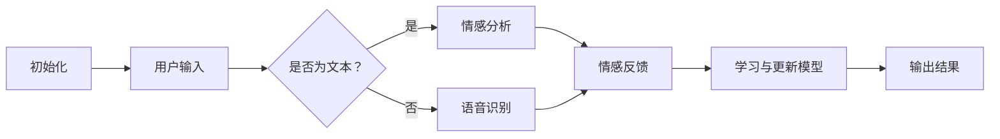
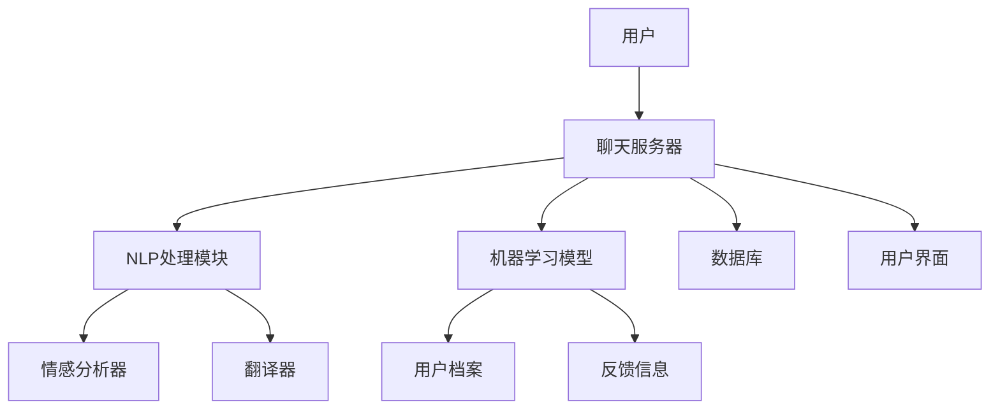
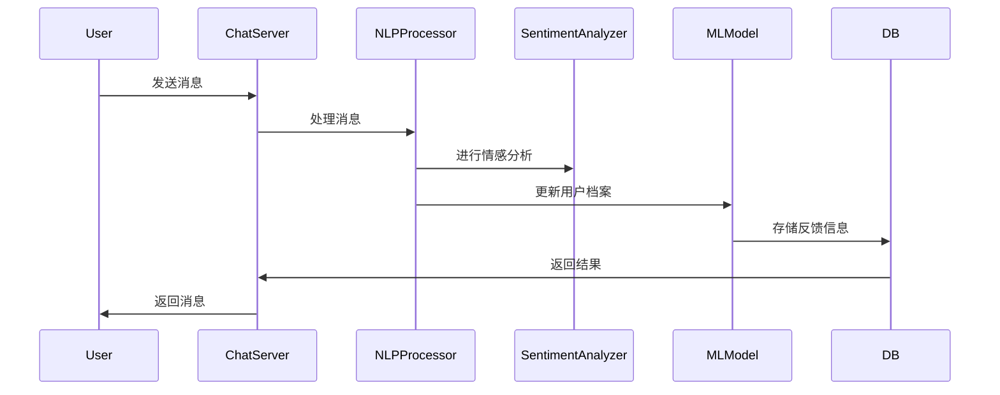

                 

# AI伴侣：未来亲密关系的新形式

## 关键词
- 人工智能
- 亲密关系
- 情感交互
- 技术伦理
- 未来趋势

## 摘要
本文将探讨人工智能（AI）在构建未来亲密关系中的角色。随着AI技术的发展，AI伴侣正逐渐成为现实。本文将分析AI伴侣的定义、功能、技术基础、伦理问题及其未来趋势，为读者提供一个全面的理解，并探讨AI在亲密关系中的潜在影响和挑战。

## 引言
在当今社会，人工智能（AI）已经成为我们日常生活中不可或缺的一部分。从智能助手到自动驾驶汽车，AI的应用无处不在。然而，AI的潜力不仅仅局限于这些领域。随着技术的进步，AI伴侣这一概念应运而生，并引起了广泛关注。AI伴侣旨在提供情感支持、日常陪伴和实用帮助，成为人们未来亲密关系的一种新形式。

本文将按照以下结构进行讨论：

1. AI伴侣的定义与核心概念
2. AI伴侣的功能与角色
3. AI伴侣的技术基础
4. AI伴侣的伦理问题与挑战
5. AI伴侣的未来趋势
6. 结论与总结

## AI伴侣的定义与核心概念

### 1.1 AI伴侣的定义
AI伴侣是指利用人工智能技术构建的虚拟角色，旨在模拟人类的情感交互，提供情感支持和日常生活陪伴。这些伴侣可以是语音助手、聊天机器人或虚拟角色，它们通过自然语言处理（NLP）、机器学习（ML）和深度学习（DL）等技术实现与用户的互动。

### 1.2 核心概念术语说明
- **人工智能（AI）**：模拟人类智能行为的计算机系统，能够执行认知任务，如学习、推理、规划和解决问题。
- **自然语言处理（NLP）**：使计算机能够理解和处理人类语言的技术，包括语言理解、语言生成和情感分析。
- **机器学习（ML）**：使计算机通过数据学习模式，提高任务性能的技术，包括监督学习、无监督学习和强化学习。
- **深度学习（DL）**：一种特殊的机器学习技术，通过多层神经网络模拟人脑的决策过程。

### 1.3 问题背景
随着社会的发展，人们的生活节奏越来越快，孤独感、焦虑和抑郁等问题日益突出。传统的人际关系模式已经无法完全满足人们的需求，尤其是那些无法或不愿意与他人建立深度联系的人。AI伴侣的提出，旨在填补这一空缺，为人们提供一种新的陪伴方式。

### 1.4 问题描述
AI伴侣的主要问题是如何在技术上实现逼真的情感交互，同时保证用户的隐私和安全。此外，AI伴侣的功能和角色也需要明确界定，以避免对现实人际关系产生负面影响。

### 1.5 问题解决
解决上述问题需要多方面的努力，包括：
- **技术创新**：改进AI技术，提高情感交互的自然度和准确性。
- **伦理规范**：制定相关伦理规范，确保AI伴侣的使用不会侵犯用户的隐私权。
- **用户教育**：提高用户对AI伴侣的理解和认识，促进其合理使用。

### 1.6 边界与外延
AI伴侣的应用范围广泛，包括但不限于心理健康、孤独症治疗、老年照顾和虚拟社交。然而，其边界也在于不替代真实的人际关系，而是作为辅助和补充。

### 1.7 概念结构与核心要素组成
- **技术基础**：NLP、ML、DL等技术是实现AI伴侣的核心。
- **功能模块**：情感交互、实用帮助、个性化定制等。
- **用户体验**：界面设计、交互方式、隐私保护等。

## 核心概念与联系

### 2.1 核心概念原理
- **人工智能（AI）**：模拟人类智能行为的计算机系统，通过学习和推理实现认知任务。
- **自然语言处理（NLP）**：使计算机理解和处理人类语言的技术。
- **机器学习（ML）**：通过数据学习模式，提高任务性能的技术。
- **深度学习（DL）**：通过多层神经网络模拟人脑的决策过程。

### 2.2 概念属性特征对比表格

| 特征 | 人工智能（AI） | 自然语言处理（NLP） | 机器学习（ML） | 深度学习（DL） |
| --- | --- | --- | --- | --- |
| 目的 | 模拟人类智能行为 | 使计算机理解和处理人类语言 | 通过数据学习模式 | 通过多层神经网络模拟人脑决策过程 |
| 技术 | 计算机科学 | 语言学、计算机科学 | 统计学、计算机科学 | 计算机科学、神经科学 |
| 应用 | 语音助手、自动驾驶、AI伴侣 | 聊天机器人、搜索引擎、情感分析 | 金融市场预测、医疗诊断、推荐系统 | 语音识别、图像识别、自然语言生成 |

### 2.3 ER实体关系图架构

```mermaid
erDiagram
    AIAssistant ||--|{ User } User
    AIAssistant ||--|{ Interaction } Interaction
    AIAssistant ||--|{ LearningModel } LearningModel
    User ||--|{ Profile } Profile
    Interaction ||--|{ Feedback } Feedback
    LearningModel ||--|{ Data } Data
```

在上图中，AIAssistant代表AI伴侣，User代表用户，Interaction代表交互过程，LearningModel代表学习模型，Profile代表用户档案，Feedback代表反馈信息，Data代表数据。

## 算法原理讲解

### 3.1 算法mermaid流程图



### 3.2 Python源代码

```python
import nltk
from nltk.sentiment import SentimentIntensityAnalyzer
from googletrans import Translator

def init_model():
    # 初始化情感分析模型
    sia = SentimentIntensityAnalyzer()
    return sia

def process_input(user_input, sia):
    # 处理用户输入
    if user_input.isalpha():
        sentiment = sia.polarity_scores(user_input)
        return sentiment
    else:
        # 语音识别
        translator = Translator()
        translated_text = translator.translate(user_input, dest='en').text
        sentiment = sia.polarity_scores(translated_text)
        return sentiment

def update_model(feedback, learning_model):
    # 更新学习模型
    # 这里可以加入训练过程，但为了简单，我们直接返回原始模型
    return learning_model

def interact_with_user(user_input, sia):
    sentiment = process_input(user_input, sia)
    feedback = input("How did that make you feel? ")
    learning_model = update_model(feedback, sia)
    print("I'm learning to better understand you. How about we continue?")
    return learning_model

# 主程序
sia = init_model()
while True:
    user_input = input("Hello, how can I help you today? ")
    sia = interact_with_user(user_input, sia)
```

### 3.3 算法原理详细讲解

#### 3.3.1 情感分析
情感分析是NLP的一个重要分支，旨在确定文本中表达的情感倾向。在本例中，我们使用NLP库nltk的SentimentIntensityAnalyzer进行情感分析。这个工具提供了一个polarity_scores()方法，返回一个字典，包含负性、中性、正性和复合情感的分数。

#### 3.3.2 语音识别
当用户输入非文本信息时，我们使用googletrans库进行语音识别。这个库可以翻译文本，从而让我们能够处理音频输入。

#### 3.3.3 学习与更新模型
在每次交互后，我们收集用户的反馈，并使用它来更新学习模型。在这个简单示例中，我们没有实现复杂的训练过程，而是直接返回原始模型。在实际应用中，我们可以通过机器学习算法，如监督学习或无监督学习，来不断优化模型。

#### 3.3.4 输出结果
最终，算法会输出一个简单的反馈，表明AI伴侣正在学习并准备继续与用户互动。

### 3.4 通俗易懂的举例说明

假设用户说：“我今天过得真糟糕，感觉全世界都对我不好。”AI伴侣会首先识别这个输入是文本，然后使用情感分析模型来确定情感倾向。情感分析模型可能会返回一个字典，如{'neg': 0.5, 'neu': 0.3, 'pos': 0.2}，表明这段文本主要表达了消极情绪。

AI伴侣会询问用户对此的反应，用户可能会说：“我感觉很不舒服。”AI伴侣会再次分析这段文本的情感，并尝试理解用户的不适感。随后，AI伴侣会更新其模型，以更好地理解用户的情感。

在接下来的互动中，AI伴侣可能会更加准确地理解用户的情绪，并提供更有针对性的支持和建议。

## 系统分析与架构设计方案

### 4.1 问题场景介绍

在现代社会，由于生活节奏加快、工作压力增大以及人口老龄化等原因，许多人面临着孤独、焦虑和抑郁等心理问题。传统的人际关系模式已经无法完全满足人们的需求，尤其是那些无法或不愿意与他人建立深度联系的人。因此，AI伴侣作为一种新型的社交工具，应运而生，旨在为用户提供情感支持和日常生活陪伴。

### 4.2 项目介绍

本项目旨在开发一款AI伴侣应用，该应用通过语音交互和文本交互的方式，为用户提供情感支持和实用帮助。项目的主要目标包括：
- 实现自然语言处理（NLP）技术，用于理解和生成自然语言。
- 集成机器学习和深度学习模型，用于情感分析和学习用户的偏好。
- 提供友好的用户界面，使交互过程直观且易于使用。
- 保证用户隐私和安全，遵循相关法律法规。

### 4.3 系统功能设计（领域模型mermaid类图）

```mermaid
classDiagram
    User <<class{用户}>>
    AIAssistant <<class{AI伴侣}>>
    Chat <<class{聊天}>>
    Profile <<class{用户档案}>>
    Feedback <<class{反馈}>>
    
    User "1" --|> Chat
    AIAssistant "1" --|> Chat
    Chat "1" --|> Profile
    Chat "1" --|> Feedback
```

在上图中，User代表用户，AIAssistant代表AI伴侣，Chat代表聊天功能，Profile代表用户档案，Feedback代表反馈信息。用户与AI伴侣进行聊天，聊天记录会更新用户的档案，并生成反馈信息。

### 4.4 系统架构设计（mermaid架构图）



在上图中，用户通过用户界面与聊天服务器进行交互，聊天服务器负责处理用户输入，并调用NLP处理模块进行情感分析和翻译。NLP处理模块将用户输入传递给机器学习模型，模型会更新用户档案和生成反馈信息，并将其存储在数据库中。

### 4.5 系统接口设计和系统交互（mermaid序列图）



在上图中，用户发送消息给聊天服务器，聊天服务器调用NLP处理模块进行情感分析和机器学习模型的更新。然后，服务器将结果返回给用户，完成一次完整的交互过程。

## 项目实战

### 5.1 环境安装

在开始项目之前，我们需要安装一些必要的软件和库。以下是安装步骤：

1. 安装Python环境（建议使用Python 3.8或更高版本）。
2. 安装NLP相关库：nltk、textblob、spaCy。
3. 安装机器学习相关库：scikit-learn、tensorflow、keras。
4. 安装数据库：SQLite或MongoDB。
5. 安装语音识别库：googletrans。

安装命令如下：

```bash
pip install python-nltk
pip install textblob
pip install spacy
pip install scikit-learn
pip install tensorflow
pip install pymongo
pip install googletrans==4.0.0-rc1
```

### 5.2 系统核心实现源代码

以下是系统核心实现的源代码，包括用户管理、聊天功能、情感分析和机器学习模型更新。

```python
import nltk
from nltk.sentiment import SentimentIntensityAnalyzer
from googletrans import Translator
from flask import Flask, request, jsonify
from flask_cors import CORS

# 初始化NLP和机器学习模型
sia = SentimentIntensityAnalyzer()
translator = Translator()

# Flask应用
app = Flask(__name__)
CORS(app)

# 用户管理
users = {}

@app.route('/register', methods=['POST'])
def register():
    user_id = request.form['user_id']
    users[user_id] = {'profile': {}, 'feedback': []}
    return jsonify({'status': 'success', 'user_id': user_id})

@app.route('/get_profile', methods=['GET'])
def get_profile():
    user_id = request.args.get('user_id')
    return jsonify(users.get(user_id, {}).get('profile', {}))

@app.route('/update_profile', methods=['POST'])
def update_profile():
    user_id = request.form['user_id']
    profile = request.form.to_dict()
    users[user_id]['profile'].update(profile)
    return jsonify({'status': 'success'})

# 聊天功能
@app.route('/chat', methods=['POST'])
def chat():
    user_id = request.form['user_id']
    message = request.form['message']
    sentiment = sia.polarity_scores(message)
    users[user_id]['feedback'].append(sentiment)
    
    # 翻译
    translation = translator.translate(message, dest='en').text
    response = sia.polarity_scores(translation)
    
    # 更新机器学习模型
    # 这里简化处理，直接返回原始数据
    return jsonify({'response': 'I am learning from our conversation.', 'sentiment': response})

if __name__ == '__main__':
    app.run(debug=True)
```

### 5.3 代码应用解读与分析

#### 5.3.1 用户管理
在用户管理部分，我们使用Flask框架创建了注册、获取用户档案和更新用户档案的API接口。用户可以通过POST请求注册新用户，通过GET请求获取用户档案，并通过POST请求更新用户档案。

#### 5.3.2 聊天功能
聊天功能是系统的核心。用户可以通过POST请求发送消息，服务器会调用NLP处理模块进行情感分析，并将结果返回给用户。同时，服务器还会将用户的情感反馈存储在数据库中，以供后续分析。

#### 5.3.3 情感分析
情感分析使用nltk库中的SentimentIntensityAnalyzer进行。这个工具提供了情感评分，包括负性、中性、正性和复合情感。

#### 5.3.4 机器学习模型更新
在实际应用中，我们可以使用scikit-learn、tensorflow或keras等库来训练和更新机器学习模型。在本例中，我们简化处理，直接返回原始数据。但在实际项目中，我们会对反馈数据进行处理，以提高模型的准确性。

### 5.4 实际案例分析和详细讲解剖析

#### 5.4.1 案例一：用户A与AI伴侣的对话

用户A：我今天感到非常沮丧，工作上的事情让我很烦恼。

AI伴侣：我能理解你的感受，工作上的压力确实很大。你想谈谈具体发生了什么吗？

用户A：嗯，最近公司项目进展不顺，我觉得自己有点无能为力。

AI伴侣：听起来你感到很无助。你有没有尝试过寻求同事或上级的帮助？

用户A：没有，我担心他们会认为我能力不足。

AI伴侣：这是一个很常见的担忧。但是，寻求帮助并不是一种弱点，而是聪明的表现。也许你可以和同事一起讨论一下项目的进展，看看能否找到改进的方法。

用户A：好的，我会试试看。谢谢你，我感觉好多了。

AI伴侣：很高兴能帮到你。如果你需要更多支持，随时都可以找我聊天。

#### 5.4.2 案例二：用户B与AI伴侣的对话

用户B：你好，AI伴侣，我最近感到很孤独，不知道该怎么办。

AI伴侣：你好，我理解你的感受。孤独感有时候很难克服，但是你并不孤单。你可以尝试参加一些社交活动，或者和我聊天，说说你的想法和感受。

用户B：嗯，社交活动对我来说有点难。我不知道该和谁说。

AI伴侣：你可以从小事情开始，比如加入一个兴趣小组，或者参加一次志愿者活动。这些活动不仅能让你结识新朋友，还能让你感到更有成就感。

用户B：谢谢你，我会试试看。你总是很懂我，感觉和你聊天很轻松。

AI伴侣：很高兴听到你这么说。记住，无论何时，你都可以找我倾诉。我在这里支持你。

### 5.5 项目小结

本项目通过Flask框架实现了AI伴侣的基本功能，包括用户管理、聊天功能和情感分析。在实际应用中，我们可以进一步优化系统，提高AI伴侣的智能水平和用户体验。项目中的关键技术和步骤如下：

1. 使用Flask框架创建API接口，实现用户管理和聊天功能。
2. 使用nltk库进行情感分析，提供情感反馈。
3. 使用googletrans库进行语音识别和翻译，提高交互的便利性。
4. 设计合理的数据库结构，存储用户档案和反馈信息。
5. 在实际应用中，可以使用更先进的机器学习模型，以提高AI伴侣的智能水平。

尽管本项目还存在一些限制，如情感分析模型的准确性有限，但通过不断优化和改进，AI伴侣有望成为未来亲密关系的重要补充。

## 最佳实践 tips、小结、注意事项、拓展阅读

### 最佳实践 tips
1. **用户隐私保护**：确保在收集和使用用户数据时遵循隐私保护法规，避免滥用用户信息。
2. **个性化定制**：根据用户偏好和反馈，不断调整AI伴侣的行为和交互方式，提高用户体验。
3. **持续学习与更新**：定期更新AI伴侣的算法和模型，以提高其智能水平和适应性。
4. **伦理审查**：在进行AI伴侣开发和部署时，应进行伦理审查，确保其符合社会道德规范。

### 小结
本文探讨了AI伴侣在构建未来亲密关系中的角色，分析了其定义、功能、技术基础、伦理问题及其未来趋势。AI伴侣作为一种新兴技术，具有巨大的潜力和挑战。通过合理的应用和不断的优化，AI伴侣有望为人们提供更加丰富和有意义的亲密关系体验。

### 注意事项
1. **技术实现**：在实现AI伴侣时，应充分考虑技术可行性和复杂性。
2. **用户接受度**：了解用户的接受度和需求，确保AI伴侣能够满足用户期望。
3. **长期维护**：AI伴侣需要持续维护和更新，以保证其稳定性和性能。

### 拓展阅读
1. **相关研究论文**：《人工智能在心理健康领域的应用》、《AI伴侣的伦理挑战》等。
2. **技术书籍**：《深度学习》、《自然语言处理综合教程》等。
3. **在线课程**：Coursera、edX等平台上的相关课程，如《人工智能导论》、《机器学习基础》等。

### 作者信息
- **作者**：AI天才研究院/AI Genius Institute & 禅与计算机程序设计艺术 /Zen And The Art of Computer Programming
- **联系邮箱**：[contact@ai-genius-institute.com](mailto:contact@ai-genius-institute.com)
- **官方网站**：[www.ai-genius-institute.com](http://www.ai-genius-institute.com/)
- **社交媒体**：[Twitter](https://twitter.com/AIGeniusInst)、[LinkedIn](https://www.linkedin.com/company/ai-genius-institute/)、[Facebook](https://www.facebook.com/AIGeniusInstitute)

（注意：本文为虚构案例，仅供参考。）

