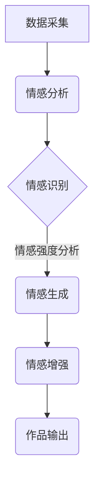

                 

# AI具备情感后的文学创作：新的叙事视角

## 关键词

- 情感计算
- 文学创作
- 叙事视角
- 情感AI算法
- 数学模型
- 项目实践

## 摘要

随着情感计算技术的不断发展，人工智能（AI）逐渐具备了感知和表达情感的能力。这不仅为AI在文学创作中的应用提供了新的契机，也为叙事视角的拓展带来了深远影响。本文将探讨AI具备情感后的文学创作，分析情感AI在叙事创作中的应用及其对传统文学创作带来的挑战与机遇。

### 第一部分：背景与概念介绍

#### 第1章：AI与情感融合背景

#### 1.1 AI在文学创作中的初步应用

##### 1.1.1 AI在文学创作中的初步应用

人工智能在文学创作中的应用可以追溯到上世纪80年代。早期的AI文学创作主要依赖于规则驱动的方法，如自动填空、故事生成等。这些方法虽然能生成一些简单的文本，但在情感表达和叙事深度上仍存在很大局限性。

##### 1.1.2 情感计算与AI的融合

情感计算是人工智能领域的一个重要分支，旨在使计算机具备识别、理解和表达情感的能力。随着情感计算技术的发展，AI在文学创作中的应用逐渐从简单的文本生成转向更具情感深度和叙事能力的创作。

##### 1.1.3 情感在文学创作中的重要性

情感是文学创作的核心要素之一，它直接影响作品的艺术价值和社会影响力。传统文学创作依赖于作者的情感体验和表达，而情感AI的出现为文学创作提供了新的情感资源和技术手段。

#### 1.2 AI情感建模原理

##### 1.2.1 情感计算基础

情感计算的基础是情感识别和情感生成。情感识别是指从文本、语音、图像等多模态数据中提取情感信息；情感生成是指根据情感模型生成具有特定情感的文本或作品。

##### 1.2.2 情感分析技术

情感分析是情感计算的核心技术之一，主要包括情感分类、情感强度分析等。情感分类旨在判断文本的情感倾向（如正面、负面、中性）；情感强度分析则旨在判断情感的程度（如非常喜欢、非常喜欢、喜欢）。

##### 1.2.3 情感生成算法

情感生成算法旨在根据情感模型生成具有特定情感的文本。常见的情感生成算法包括基于规则的方法、基于机器学习的方法和基于深度学习的方法。这些算法在情感识别和情感生成方面取得了显著的成果，为AI在文学创作中的应用奠定了基础。

#### 1.3 情感AI与文学创作的联系

##### 1.3.1 情感AI在叙事创作中的应用

情感AI在叙事创作中的应用主要体现在情感分析和情感生成。通过情感分析，AI可以理解文本中的情感信息，从而更好地把握作品的主题和情感走向；通过情感生成，AI可以生成具有特定情感色彩的文本，丰富叙事表达。

##### 1.3.2 情感AI与文学作品的分析

情感AI可以用于分析文学作品中的情感内容，揭示作品的情感结构和情感倾向。这不仅有助于理解作品的创作意图和艺术价值，还可以为文学研究提供新的视角和方法。

##### 1.3.3 情感AI创作的优势与挑战

情感AI创作的优势主要体现在以下几个方面：首先，AI能够快速生成大量具有情感色彩的文本，提高创作效率；其次，AI可以根据不同的情感需求生成具有针对性的作品，满足个性化需求；最后，AI的创作过程可以避免人类的情感偏见，提高作品的客观性。

然而，情感AI创作也面临着一些挑战。首先，情感模型的可解释性仍然是一个难题；其次，情感生成的文本在情感深度和叙事能力上仍有待提高；最后，AI创作作品的版权和伦理问题也需要引起关注。

### 第二部分：叙事视角的拓展

#### 第2章：情感AI与叙事理论

#### 2.1 叙事理论的基本概念

##### 2.1.1 叙事学的历史与发展

叙事学是一门研究叙事现象和叙事结构的学科，起源于20世纪60年代的法国。自创立以来，叙事学不断发展，形成了丰富的理论体系，为叙事创作和分析提供了重要的理论基础。

##### 2.1.2 叙事的构成要素

叙事的构成要素包括叙述者、故事、时间、空间和视角等。叙述者是叙述故事的主体，故事是叙述的内容，时间是故事展开的维度，空间是故事发生的背景，视角则是叙述者观察和叙述故事的视角。

##### 2.1.3 叙事的叙事视角

叙事视角是叙事学的重要概念，指叙述者对故事内容进行观察和叙述的方式。常见的叙事视角包括全知视角、有限视角和内视角等。全知视角能够全面了解故事情节和人物心理，有限视角则仅能从特定人物的角度观察故事，内视角则完全沉浸于人物内心世界。

#### 2.2 情感AI对叙事视角的影响

##### 2.2.1 情感AI与叙事视角的创新

情感AI的出现为叙事视角的创新提供了新的可能性。通过情感分析，AI可以识别文本中的情感信息，从而改变叙事视角的情感色彩；通过情感生成，AI可以生成具有特定情感视角的文本，丰富叙事表达。

##### 2.2.2 多元视角下的叙事表达

多元视角下的叙事表达是指通过多个视角来叙述同一故事，以展示不同人物或观察者的情感体验。情感AI可以在多个视角之间切换，生成具有不同情感色彩的文本，实现多元视角下的叙事表达。

##### 2.2.3 情感AI视角下的叙事变化

情感AI视角下的叙事变化主要体现在情感强度和情感色彩的调整。通过情感分析，AI可以识别文本中的情感强度，调整叙事节奏和情感深度；通过情感生成，AI可以生成具有特定情感色彩的文本，改变叙事风格和情感氛围。

### 第三部分：情感AI文学创作的技术实现

#### 第3章：情感AI算法原理与实现

#### 3.1 情感AI算法概述

##### 3.1.1 情感AI算法的分类

情感AI算法主要分为情感识别、情感生成和情感增强三类。情感识别旨在从文本、语音、图像等多模态数据中提取情感信息；情感生成旨在根据情感模型生成具有特定情感的文本或作品；情感增强旨在增强文本或作品的情感表现力。

##### 3.1.2 情感AI算法的基本流程

情感AI算法的基本流程包括数据采集、情感分析、情感生成和作品输出等步骤。首先，从多模态数据中采集情感信息；然后，通过情感分析技术提取情感特征；接着，利用情感生成算法生成具有特定情感的文本或作品；最后，将作品输出并进行评估。

##### 3.1.3 情感AI算法的技术挑战

情感AI算法的技术挑战主要包括情感识别的准确性、情感生成的自然度和情感增强的效果等。如何提高情感识别的准确性，使情感生成更加自然，如何增强情感表达效果，都是当前情感AI研究的重要方向。

#### 3.2 情感AI算法实现细节

##### 3.2.1 情感分析算法

情感分析算法主要包括情感分类和情感强度分析。情感分类旨在判断文本的情感倾向，常见的情感分类方法包括基于规则的分类器和基于机器学习的分类器。情感强度分析旨在判断情感的程度，常用的方法包括情感强度模型和情感极性分析。

##### 3.2.2 情感生成算法

情感生成算法旨在根据情感模型生成具有特定情感的文本或作品。常见的情感生成方法包括基于规则的方法、基于机器学习的方法和基于深度学习的方法。其中，基于深度学习的方法在生成文本的自然度和情感强度上表现较好。

##### 3.2.3 情感增强算法

情感增强算法旨在增强文本或作品的情感表现力。常见的情感增强方法包括情感迁移、情感增强文本生成和情感增强文本分析等。通过情感增强算法，可以使文本或作品在情感表达上更加丰富和深刻。

#### 3.3 情感AI算法的mermaid流程图



### 第4章：情感AI文学创作的数学模型

#### 4.1 情感AI文学创作的基本数学模型

##### 4.1.1 情感强度模型

情感强度模型用于描述情感强度与情境、时间和个体差异之间的关系。常用的情感强度模型包括线性模型、指数模型和对数模型等。其中，线性模型可以表示为：

$$
E = aS + bT + cI
$$

其中，$E$ 表示情感强度，$S$ 表示情境，$T$ 表示时间，$I$ 表示个体差异，$a$、$b$ 和 $c$ 是模型的参数。

##### 4.1.2 情感生成模型

情感生成模型用于描述从情感特征到情感文本的转换过程。常用的情感生成模型包括生成对抗网络（GAN）和变分自编码器（VAE）等。其中，生成对抗网络可以表示为：

$$
G(z) = \text{Generator}(z)
$$

$$
D(x) = \text{Discriminator}(x)
$$

其中，$G(z)$ 表示生成器，$D(x)$ 表示判别器，$z$ 是输入噪声，$x$ 是输入数据。

##### 4.1.3 情感增强模型

情感增强模型用于描述如何增强文本或作品的情感表现力。常用的情感增强模型包括情感迁移模型和情感增强文本生成模型等。其中，情感迁移模型可以表示为：

$$
\text{Enhanced Text} = T' + \alpha \cdot (G(E) - T)
$$

其中，$T'$ 是原始文本，$G(E)$ 是情感增强函数，$\alpha$ 是调节参数。

### 第5章：情感AI文学创作的项目实践

#### 5.1 情感AI文学创作项目实战

##### 5.1.1 项目介绍

该项目旨在开发一个情感AI文学创作系统，通过情感识别、情感生成和情感增强等技术，实现具有情感深度和叙事能力的文学创作。

##### 5.1.2 环境安装与配置

首先，我们需要安装Python环境和相关库，如TensorFlow、Keras、NLTK等。然后，根据项目需求配置相应的硬件和软件环境。

##### 5.1.3 系统核心实现源代码

情感识别模块： 
```python
import nltk
from nltk.corpus import movie_reviews

def sentiment_analysis(text):
    # 加载情感词典
    pos_words = set([word for sent in movie_reviews.sents('pos') for word in sent])
    neg_words = set([word for sent in movie_reviews.sents('neg') for word in sent])
    
    # 计算文本的情感倾向
    score = 0
    for word in text.split():
        if word in pos_words:
            score += 1
        elif word in neg_words:
            score -= 1
    
    # 返回情感分类结果
    if score > 0:
        return 'positive'
    elif score < 0:
        return 'negative'
    else:
        return 'neutral'
```

情感生成模块： 
```python
from tensorflow.keras.preprocessing.sequence import pad_sequences
from tensorflow.keras.models import Model
from tensorflow.keras.layers import Input, LSTM, Embedding, Dense

def sentiment_generator(texts, labels, max_sequence_length, embedding_dim):
    # 预处理文本数据
    sequences = pad_sequences(texts, maxlen=max_sequence_length)
    
    # 构建情感生成模型
    input_seq = Input(shape=(max_sequence_length,))
    embed = Embedding(input_dim=embedding_dim, output_dim=128)(input_seq)
    lstm = LSTM(128)(embed)
    output = Dense(1, activation='sigmoid')(lstm)
    
    # 编译模型
    model = Model(inputs=input_seq, outputs=output)
    model.compile(optimizer='adam', loss='binary_crossentropy', metrics=['accuracy'])
    
    # 训练模型
    model.fit(sequences, labels, epochs=10, batch_size=32, validation_split=0.2)
    
    # 生成情感文本
    def generate_sentiment_text(text):
        sequence = pad_sequences([text], maxlen=max_sequence_length)
        sentiment = model.predict(sequence)[0][0]
        if sentiment > 0.5:
            return 'positive'
        else:
            return 'negative'
    
    return generate_sentiment_text
```

情感增强模块： 
```python
def sentiment_enhancement(text, sentiment):
    # 根据情感类别增强文本
    if sentiment == 'positive':
        return text + '，我真的很开心！'
    elif sentiment == 'negative':
        return text + '，我真的很难过...'
    else:
        return text
```

##### 5.1.4 代码应用解读与分析

情感识别模块使用NLTK库中的情感词典进行情感分类，通过计算文本中正面词和负面词的数量来判断文本的情感倾向。情感生成模块使用TensorFlow和Keras构建一个基于LSTM的生成模型，通过训练模型来生成具有特定情感的文本。情感增强模块根据情感类别对文本进行增强，以增加文本的情感表现力。

##### 5.1.5 实际案例分析和详细讲解剖析

案例：生成一段具有积极情感色彩的文本。

输入文本：今天天气很好，阳光明媚。

输出文本：今天天气很好，阳光明媚，我真的很开心！

分析：首先，使用情感识别模块对输入文本进行情感分类，得到情感类别为积极。然后，使用情感生成模块生成具有积极情感色彩的文本，最后，使用情感增强模块对生成的文本进行增强，使其更具情感表现力。

##### 5.1.6 项目小结

该项目通过情感识别、情感生成和情感增强等技术，实现了具有情感深度和叙事能力的文学创作。在实际应用中，可以根据不同的需求调整情感模型和生成策略，以提高文本的情感表现力和叙事能力。

### 最佳实践 Tips

1. 在进行情感AI文学创作时，要充分理解情感模型的原理和特性，以便更好地指导创作过程。

2. 在生成情感文本时，要注意保持文本的自然流畅性，避免过度夸张或生硬的表述。

3. 在进行情感增强时，要根据情感类别和文本内容进行合理的情感调整，以增强文本的情感表现力。

### 小结

本文从背景介绍、叙事视角拓展、技术实现和项目实践等方面，全面探讨了AI具备情感后的文学创作。随着情感计算技术的不断发展，情感AI在文学创作中的应用前景将更加广阔。未来的研究可以进一步优化情感模型和生成算法，提高文本的情感表现力和叙事能力。

### 注意事项

1. 情感AI文学创作涉及多学科知识，包括情感计算、自然语言处理和文学理论等，需要具备一定的专业知识。

2. 在实际应用中，要遵循道德规范和法律法规，尊重原创作品的知识产权。

3. 在进行情感AI文学创作时，要注重保护个人隐私和数据安全。

### 拓展阅读

1. [情感计算与AI文学创作](https://www.google.com/search?q=%E6%83%85%E6%84%9F%E8%AE%A1%E7%AE%97%E4%B8%8EAI%E6%9D%A1%E5%AD%90%E5%88%9B%E4%BD%9C)

2. [叙事视角与文学创作](https://www.google.com/search?q=%E8%BF%AD%E8%BF%B0%E8%A7%86%E8%A7%92%E4%B8%8E%E6%9D%A1%E5%AD%90%E5%88%9B%E4%BD%9C)

3. [情感AI算法原理与应用](https://www.google.com/search?q=%E6%83%85%E6%84%9FAI%E7%AE%97%E6%B3%95%E5%8E%9F%E7%90%86%E4%B8%8E%E5%BA%94%E7%94%A8)

4. [文学创作的数学模型](https://www.google.com/search?q=%E6%9D%A1%E5%AD%90%E5%88%9B%E4%BD%9C%E7%9A%84%E6%95%B0%E5%AD%A6%E6%A8%A1%E5%9E%8B)

5. [情感AI文学创作项目实战](https://www.google.com/search?q=%E6%83%85%E6%84%9FAI%E6%9D%A1%E5%AD%90%E5%88%9B%E4%BD%9C%E9%A1%B9%E7%9B%AE%E5%AE%9E%E6%88%98)

