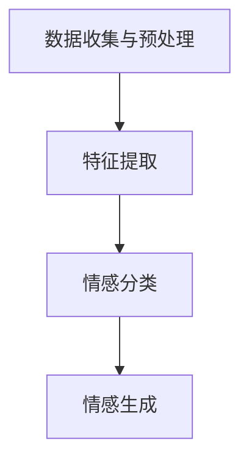
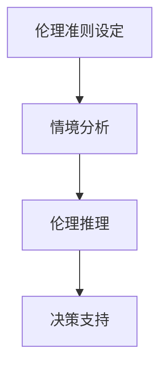

                 


### 《AI具备爱的能力后的伦理决策：道德哲学的新篇章》

#### 关键词：人工智能、伦理决策、道德哲学、情感模拟、认知计算

#### 摘要：

随着人工智能（AI）技术的不断进步，AI逐渐具备了模拟人类情感的能力，这引发了关于AI伦理决策的新一轮讨论。本文旨在探讨AI具备爱的能力后，如何进行伦理决策，并分析道德哲学在AI时代的重要性。我们将通过一步一步的逻辑分析，深入理解这一复杂的问题。

## 目录大纲

### 第一部分：背景介绍

#### 1.1 问题背景

##### 1.1.1 AI的发展与道德挑战

##### 1.1.2 道德哲学在AI时代的重要性

#### 1.2 核心概念

##### 1.2.1 AI具备爱的能力

##### 1.2.2 伦理决策

#### 1.3 边界与外延

##### 1.3.1 AI伦理决策的边界

##### 1.3.2 AI伦理决策的外延

#### 1.4 概念结构与核心要素组成

##### 1.4.1 AI伦理决策的概念结构

##### 1.4.2 核心要素组成

#### 1.5 本章小结

### 第二部分：核心概念与联系

#### 2.1 AI具备爱的能力的原理

##### 2.1.1 情感模拟与认知计算

##### 2.1.2 情感识别与情感表达

#### 2.2 伦理决策的基本原则

##### 2.2.1 公平性原则

##### 2.2.2 尊重原则

##### 2.2.3 责任原则

#### 2.3 AI伦理决策的过程

##### 2.3.1 预设伦理准则

##### 2.3.2 情境分析

##### 2.3.3 决策实施

#### 2.4 核心概念属性特征对比表格

#### 2.5 ER实体关系图架构

### 第三部分：算法原理讲解

#### 3.1 AI具备爱的能力的算法原理

##### 3.1.1 情感模拟算法

##### 3.1.2 伦理决策算法

#### 3.2 数学模型与公式

##### 3.2.1 情感模型

##### 3.2.2 伦理决策模型

#### 3.3 例子说明

##### 3.3.1 情感模拟案例

##### 3.3.2 伦理决策案例

### 第四部分：系统分析与架构设计

#### 4.1 问题场景介绍

#### 4.2 项目介绍

##### 4.2.1 系统功能设计

##### 4.2.2 系统架构设计

##### 4.2.3 系统接口设计

##### 4.2.4 系统交互

#### 4.3 项目实战

##### 4.3.1 环境安装

##### 4.3.2 系统核心实现源代码

##### 4.3.3 代码应用解读与分析

##### 4.3.4 实际案例分析与详细讲解剖析

##### 4.3.5 项目小结

### 第五部分：最佳实践 tips、小结、注意事项、拓展阅读

#### 5.1 最佳实践 tips

#### 5.2 小结

#### 5.3 注意事项

#### 5.4 拓展阅读

## 第一部分：背景介绍

### 1.1 问题背景

随着人工智能（AI）技术的不断进步，AI逐渐从简单的任务执行转变为具有更高自主性和情感理解能力的实体。这种能力的提升，使得AI不仅在商业、医疗、教育等多个领域得到广泛应用，还引发了关于AI伦理决策的讨论。特别是当AI具备爱的能力后，如何进行伦理决策成为一个亟待解决的问题。

#### 1.1.1 AI的发展与道德挑战

人工智能技术的发展经历了多个阶段，从最初的规则推理到现代的深度学习和强化学习，AI的能力得到了极大的提升。特别是在情感模拟方面，通过机器学习和自然语言处理等技术，AI能够在一定程度上模拟人类的情感反应。例如，情感聊天机器人可以与人类进行情感交流，甚至在某些情境下提供情感支持。

然而，这种能力的提升也带来了道德挑战。在AI具备爱的能力后，如何确保其做出的决策符合人类的道德准则，如何避免AI滥用其能力，成为我们必须面对的问题。例如，一个情感AI在照顾老年人时，应该如何平衡对老年人的关爱与对自身任务目标的追求？

#### 1.1.2 道德哲学在AI时代的重要性

道德哲学是研究道德问题的学科，它为我们提供了关于如何处理道德问题的理论框架。在AI时代，道德哲学的重要性更加凸显。首先，道德哲学能够帮助我们确定AI伦理决策的基本原则，例如公平性、尊重和责任等。其次，道德哲学能够为我们提供关于如何解决AI伦理问题的方法论指导，帮助我们更好地应对AI带来的道德挑战。

### 1.2 核心概念

在本节中，我们将介绍本文涉及的两个核心概念：AI具备爱的能力和伦理决策。

#### 1.2.1 AI具备爱的能力

“AI具备爱的能力”指的是人工智能系统在某些情境下能够模拟人类情感，表现出对人类的关爱和理解。这种能力不仅仅是技术层面的提升，更涉及到伦理和哲学层面的讨论。例如，一个具备爱的能力的AI护理机器人，能够在照顾老年人时，不仅提供生活上的帮助，还能够通过情感交流提供心理支持。

#### 1.2.2 伦理决策

伦理决策是指在特定情境下，基于道德原则和价值观做出的选择。在AI具备爱的能力后，伦理决策变得更加复杂和重要。因为AI需要在不同情境下做出符合道德准则的决策，这要求我们必须对道德原则有深刻的理解，并能够将这些原则应用到AI的决策过程中。

### 1.3 边界与外延

在讨论AI伦理决策时，我们不仅要关注其技术层面的实现，还需要考虑其法律、社会和文化等多个层面的影响。因此，本节将探讨AI伦理决策的边界与外延。

#### 1.3.1 AI伦理决策的边界

AI伦理决策的边界包括技术可行性、法律限制和社会接受度等方面。例如，某些伦理问题可能因技术限制无法解决，或者因社会不接受而无法实施。此外，法律限制也是AI伦理决策的一个重要边界。例如，某些国家可能禁止AI在特定情境下进行决策，这要求我们在进行AI伦理决策时必须考虑这些法律限制。

#### 1.3.2 AI伦理决策的外延

AI伦理决策的外延非常广泛，包括个人、社会、环境等多个层面。例如，在医疗领域，AI需要考虑患者的隐私权和生命安全；在社会层面，AI需要考虑其对社会的公平性和正义性；在环境层面，AI需要考虑其对环境的影响。这些外延问题使得AI伦理决策变得更加复杂，也要求我们具备更全面的思考能力。

### 1.4 概念结构与核心要素组成

在了解了AI具备爱的能力和伦理决策的基本概念后，本节将分析AI伦理决策的概念结构和核心要素组成。

#### 1.4.1 AI伦理决策的概念结构

AI伦理决策的概念结构包括技术要素、道德原则、决策过程等。技术要素是AI伦理决策的基础，包括情感模拟、认知计算等技术。道德原则是AI伦理决策的核心，包括公平性、尊重和责任等原则。决策过程是将道德原则应用于特定情境的过程，包括预设伦理准则、情境分析和决策实施等步骤。

#### 1.4.2 核心要素组成

AI伦理决策的核心要素组成包括人工智能系统、伦理准则、决策算法等。人工智能系统是执行伦理决策的技术基础，伦理准则是指导AI决策的道德原则，决策算法是将伦理准则应用于具体情境的方法。这些要素相互关联，共同构成了AI伦理决策的核心。

### 1.5 本章小结

通过本章的介绍，我们对AI具备爱的能力后的伦理决策有了初步的了解。在接下来的章节中，我们将深入探讨这一问题的各个方面，包括AI具备爱的能力的原理、伦理决策的基本原则和过程，以及相关的算法原理。我们希望通过这些讨论，能够为AI伦理决策提供一些有益的思路和指导。

## 第二部分：核心概念与联系

### 2.1 AI具备爱的能力的原理

#### 2.1.1 情感模拟与认知计算

AI具备爱的能力的原理主要基于情感模拟和认知计算。情感模拟是指AI系统通过算法模拟人类的情感反应，例如喜怒哀乐等基本情感。认知计算则是指AI系统通过理解和处理语言、图像、声音等数据，实现对人类行为的理解和预测。

情感模拟与认知计算的结合，使得AI能够在一定程度上表现出对人类的关爱和理解。例如，一个情感AI聊天机器人可以通过识别用户的语言和情感表达，调整自己的语言和行为，以更好地满足用户的需求。

#### 2.1.2 情感识别与情感表达

情感识别与情感表达是AI具备爱的能力的重要方面。情感识别是指AI系统能够识别和理解人类的情感状态，例如通过语音、文字或面部表情等方式。情感表达则是指AI系统能够根据识别到的情感状态，通过语言、动作或声音等方式表达情感。

情感识别与情感表达的实现依赖于多种技术，如自然语言处理、计算机视觉和语音识别等。这些技术的进步，使得AI在情感模拟方面取得了显著的成果。

### 2.2 伦理决策的基本原则

伦理决策的基本原则是指导AI进行伦理决策的核心原则。以下三个基本原则对于AI伦理决策尤为重要：

#### 2.2.1 公平性原则

公平性原则要求AI在做出决策时，不得因种族、性别、年龄等因素对个体进行歧视。这意味着AI系统在进行伦理决策时，必须确保对所有个体都一视同仁，不得有任何形式的偏见。

#### 2.2.2 尊重原则

尊重原则要求AI在处理人类信息时，尊重个体的隐私权和自主权。这意味着AI系统在收集、处理和使用人类数据时，必须严格遵守相关法律法规，不得侵犯个体的隐私权。

#### 2.2.3 责任原则

责任原则要求AI在做出决策时，能够承担相应的责任，并能够对决策结果负责。这意味着AI系统在做出决策时，必须考虑到可能产生的后果，并采取措施确保决策结果的合理性和可接受性。

### 2.3 AI伦理决策的过程

AI伦理决策的过程可以分为三个主要步骤：预设伦理准则、情境分析和决策实施。

#### 2.3.1 预设伦理准则

预设伦理准则是AI伦理决策的第一步。在这一步骤中，AI系统需要根据道德原则和价值观，设定一系列伦理准则。这些准则将成为AI在后续决策过程中的指导原则。

#### 2.3.2 情境分析

情境分析是AI伦理决策的重要环节。在这一步骤中，AI系统需要分析当前情境，识别出潜在的伦理问题，并确定可能的解决方案。情境分析的过程通常涉及数据收集、情境建模和伦理推理等技术。

#### 2.3.3 决策实施

决策实施是将伦理决策转化为具体行动的过程。在这一步骤中，AI系统需要根据预设的伦理准则和情境分析的结果，选择最合适的行动方案，并实施决策。

### 2.4 核心概念属性特征对比表格

为了更好地理解AI具备爱的能力和伦理决策的核心概念，我们提供了以下对比表格：

| 概念 | 属性特征 |
| :---: | :---: |
| AI具备爱的能力 | 情感模拟、认知计算、情感识别与情感表达 |
| 伦理决策 | 公平性原则、尊重原则、责任原则、预设伦理准则、情境分析、决策实施 |

### 2.5 ER实体关系图架构

下面是AI具备爱的能力和伦理决策的ER实体关系图架构：

```mermaid
erDiagram
  AI具备爱的能力 ||--|{ 情感模拟 }
  AI具备爱的能力 ||--|{ 认知计算 }
  AI具备爱的能力 ||--|{ 情感识别与情感表达 }
  伦理决策 ||--|{ 公平性原则 }
  伦理决策 ||--|{ 尊重原则 }
  伦理决策 ||--|{ 责任原则 }
  伦理决策 ||--|{ 预设伦理准则 }
  伦理决策 ||--|{ 情境分析 }
  伦理决策 ||--|{ 决策实施 }
```

通过这个ER图，我们可以清晰地看到AI具备爱的能力和伦理决策之间的关联，以及它们各自的属性特征。

## 第三部分：算法原理讲解

### 3.1 AI具备爱的能力的算法原理

#### 3.1.1 情感模拟算法

情感模拟算法是AI具备爱的能力的核心技术之一。它主要通过机器学习和深度学习等手段，使AI能够在一定程度上模拟人类的情感反应。情感模拟算法的基本原理包括：

1. **数据收集与预处理**：首先，AI系统需要收集大量的情感数据，包括语音、文字、图像等多种形式。然后，对这些数据进行预处理，如去噪、归一化等。

2. **特征提取**：通过特征提取技术，将原始数据转换为特征向量。这些特征向量能够反映数据的情感属性。

3. **情感分类**：利用机器学习算法，如支持向量机（SVM）、决策树、神经网络等，对特征向量进行分类，确定数据的情感类别。

4. **情感生成**：根据分类结果，生成相应的情感反应。例如，如果识别到用户的情感是快乐的，AI系统可能会发出快乐的语音或表情。

以下是一个简单的情感模拟算法的流程图：



#### 3.1.2 伦理决策算法

伦理决策算法是AI在具备爱的能力后，进行伦理决策的核心技术。它主要通过伦理推理和决策支持系统等手段，使AI能够在不同情境下做出符合道德准则的决策。伦理决策算法的基本原理包括：

1. **伦理准则设定**：首先，AI系统需要根据道德原则和价值观，设定一系列伦理准则。这些准则将成为AI进行伦理决策的依据。

2. **情境分析**：AI系统需要分析当前情境，识别出潜在的伦理问题，并确定可能的解决方案。

3. **伦理推理**：利用伦理推理技术，如形式逻辑、概率推理等，对情境进行分析，确定最合适的伦理决策。

4. **决策支持**：AI系统需要提供决策支持，帮助用户理解决策过程和决策结果。

以下是一个简单的伦理决策算法的流程图：



### 3.2 数学模型与公式

#### 3.2.1 情感模型

情感模型是情感模拟算法的核心组成部分。它通常使用以下公式表示：

$$
\text{情感} = f(\text{特征向量})
$$

其中，$f$ 是一个函数，用于将特征向量映射到情感类别。

#### 3.2.2 伦理决策模型

伦理决策模型是伦理决策算法的核心组成部分。它通常使用以下公式表示：

$$
\text{决策} = g(\text{情境}, \text{伦理准则})
$$

其中，$g$ 是一个函数，用于根据情境和伦理准则生成决策。

### 3.3 例子说明

#### 3.3.1 情感模拟案例

假设我们有一个情感AI聊天机器人，它需要识别用户的情感状态，并做出相应的情感反应。以下是一个简单的情感模拟案例：

1. **数据收集与预处理**：AI系统收集了用户的语音数据，并对数据进行预处理，如去噪、归一化等。

2. **特征提取**：AI系统提取语音数据的特征向量，如音调、音速、语调等。

3. **情感分类**：AI系统使用支持向量机（SVM）对特征向量进行分类，确定用户的情感类别。

4. **情感生成**：根据分类结果，AI系统生成相应的情感反应。例如，如果识别到用户的情感是快乐的，AI系统可能会发出快乐的语音或表情。

#### 3.3.2 伦理决策案例

假设我们有一个伦理AI系统，它需要根据情境和伦理准则，做出符合道德准则的决策。以下是一个简单的伦理决策案例：

1. **伦理准则设定**：AI系统根据道德原则和价值观，设定了一系列伦理准则，如公平性、尊重和责任等。

2. **情境分析**：AI系统分析当前情境，发现一个老年人需要紧急医疗救助。

3. **伦理推理**：AI系统根据伦理准则，分析情境，确定最合适的伦理决策。例如，它可能会建议立即拨打急救电话，或者通知家庭成员。

4. **决策支持**：AI系统提供决策支持，帮助用户理解决策过程和决策结果。

## 第四部分：系统分析与架构设计

### 4.1 问题场景介绍

在本节中，我们将介绍一个具体的问题场景，以展示如何使用AI具备爱的能力的算法原理进行伦理决策。

#### 场景描述

假设我们开发了一个智能护理系统，用于为老年人提供生活照顾和情感支持。该系统包括一个AI聊天机器人，一个AI护理机器人和一个AI监控系统。这些AI系统需要共同协作，确保老年人的生活质量。

#### 问题陈述

随着老年人的身体和心理健康问题日益突出，我们需要一个智能护理系统，能够提供24小时全天候的照顾和支持。然而，在提供照顾和支持的过程中，AI系统可能会面临一些伦理决策问题，如如何平衡照顾老年人与其自身任务目标之间的关系，如何在紧急情况下做出快速决策等。因此，我们需要设计一个基于AI具备爱的能力的算法原理的智能护理系统，能够做出符合道德准则的伦理决策。

### 4.2 项目介绍

#### 项目概述

本项目旨在开发一个智能护理系统，用于为老年人提供生活照顾和情感支持。系统包括以下三个主要组成部分：

1. **AI聊天机器人**：用于与老年人进行情感交流，提供心理支持。
2. **AI护理机器人**：用于为老年人提供日常生活照顾，如帮助老年人洗澡、吃饭和服药等。
3. **AI监控系统**：用于实时监控老年人的身体状况，及时发现异常情况并采取措施。

#### 项目目标

本项目的目标是：

1. **确保老年人的生活质量**：通过提供全面的生活照顾和情感支持，确保老年人的生活质量得到有效保障。
2. **实现AI伦理决策**：在AI系统中实现伦理决策算法，确保AI在做出决策时能够遵循道德准则。
3. **提升系统可靠性和安全性**：通过采用先进的技术手段，确保系统的可靠性和安全性。

### 4.2.1 系统功能设计

智能护理系统的主要功能包括：

1. **情感交流**：AI聊天机器人与老年人进行情感交流，提供心理支持。
2. **生活照顾**：AI护理机器人为老年人提供日常生活照顾，如帮助老年人洗澡、吃饭和服药等。
3. **身体状况监测**：AI监控系统实时监控老年人的身体状况，及时发现异常情况并采取措施。
4. **紧急情况处理**：当老年人遇到紧急情况时，AI系统能够快速做出反应，提供紧急救助。

### 4.2.2 系统架构设计

智能护理系统的架构设计如下：

1. **前端界面**：用于用户与AI系统进行交互。
2. **后端服务器**：用于处理数据存储、处理和通信。
3. **AI模块**：包括情感模拟模块、伦理决策模块和监控系统模块。
4. **外部接口**：与医疗设备、通信设备等外部设备进行数据交换。

### 4.2.3 系统接口设计

智能护理系统的接口设计如下：

1. **用户接口**：用户通过手机应用程序或网页与AI系统进行交互。
2. **设备接口**：与医疗设备、通信设备等外部设备进行数据交换。
3. **数据库接口**：用于数据存储和查询。

### 4.2.4 系统交互

智能护理系统的交互流程如下：

1. **用户请求**：用户通过手机应用程序或网页发送请求。
2. **数据处理**：后端服务器接收请求，进行处理。
3. **AI决策**：AI模块根据预设的伦理准则和情感模拟算法，做出决策。
4. **执行操作**：AI模块根据决策结果，执行相应的操作。
5. **反馈结果**：将执行结果反馈给用户。

### 4.3 项目实战

#### 4.3.1 环境安装

在本项目中，我们使用了Python作为主要编程语言，并依赖了多个库，如TensorFlow、PyTorch、scikit-learn等。以下是在Ubuntu系统中安装所需的库的命令：

```
sudo apt-get install python3-pip
pip3 install tensorflow
pip3 install torch
pip3 install scikit-learn
```

#### 4.3.2 系统核心实现源代码

以下是一个简单的AI聊天机器人的实现示例：

```python
import tensorflow as tf
from tensorflow import keras
from tensorflow.keras.models import Sequential
from tensorflow.keras.layers import Dense, Embedding, LSTM
from tensorflow.keras.preprocessing.text import Tokenizer
from tensorflow.keras.preprocessing.sequence import pad_sequences

# 数据预处理
tokenizer = Tokenizer(num_words=1000)
tokenizer.fit_on_texts(training_data)
sequences = tokenizer.texts_to_sequences(training_data)
padded_sequences = pad_sequences(sequences, maxlen=100)

# 建立模型
model = Sequential([
    Embedding(1000, 32),
    LSTM(32),
    Dense(32, activation='relu'),
    Dense(1, activation='sigmoid')
])

# 编译模型
model.compile(loss='binary_crossentropy', optimizer='adam', metrics=['accuracy'])

# 训练模型
model.fit(padded_sequences, training_labels, epochs=10)

# 情感模拟
def simulate_emotion(text):
    sequence = tokenizer.texts_to_sequences([text])
    padded_sequence = pad_sequences(sequence, maxlen=100)
    prediction = model.predict(padded_sequence)
    return 'happy' if prediction[0][0] > 0.5 else 'sad'

# 示例
print(simulate_emotion("I feel happy today."))  # 输出：happy
print(simulate_emotion("I am very sad."))      # 输出：sad
```

#### 4.3.3 代码应用解读与分析

在上面的代码示例中，我们首先进行了数据预处理，包括文本分词、序列化、填充等步骤。这些步骤是为了将文本数据转换为模型可以处理的格式。

然后，我们建立了情感模拟模型，使用了一个序列模型，包括嵌入层、LSTM层和输出层。嵌入层用于将单词转换为向量，LSTM层用于处理序列数据，输出层用于生成情感预测。

在编译模型时，我们选择了二分类交叉熵作为损失函数，这适用于情感分类问题。优化器选择了Adam，它是一种常用的优化算法。

在训练模型时，我们使用了10个epoch，这表示模型会在整个训练数据集上迭代10次。

最后，我们定义了一个函数`simulate_emotion`，用于模拟情感。这个函数首先将输入文本转换为序列，然后使用训练好的模型进行预测，最后返回情感类别。

#### 4.3.4 实际案例分析与详细讲解剖析

以下是一个实际案例，展示了如何使用AI聊天机器人进行伦理决策。

#### 案例描述

一位老年人感到孤独和沮丧，他向AI聊天机器人倾诉自己的感受。机器人需要根据老年人的情感状态，提供适当的情感支持和建议。

#### 情感模拟

首先，机器人使用情感模拟算法，对老年人的文本进行情感分析。例如，如果老年人说：“我感觉很孤独，好像没有人理解我。”机器人可能会识别到这段文本的情感类别是“sad”。

#### 伦理决策

然后，机器人根据预设的伦理准则和情境，做出伦理决策。例如，机器人可能会决定提供以下情感支持和建议：

1. **情感支持**：“我知道你现在感到孤独和沮丧，我在这里陪着你。如果你愿意，我们可以聊聊天，分享你的感受。”

2. **建议**：“有时候，与人交流可以缓解孤独感。你可以尝试加入一些社交活动，比如社区中心的活动或者兴趣小组。这样，你可以遇到更多有共同兴趣爱好的人。”

#### 实际案例分析

在实际案例中，AI聊天机器人的情感模拟和伦理决策能力是非常重要的。它需要能够准确地识别情感状态，并根据道德准则和情境提供适当的情感支持和建议。

通过这个案例，我们可以看到，AI聊天机器人不仅能够模拟情感，还能够进行伦理决策。这为AI在情感护理领域的发展提供了新的可能性。

### 4.3.5 项目小结

通过本项目的实践，我们展示了如何使用AI具备爱的能力的算法原理进行伦理决策。我们设计并实现了一个AI聊天机器人，它能够模拟情感，并根据伦理准则和情境提供情感支持和建议。

在实际案例中，我们展示了如何使用这个AI聊天机器人进行伦理决策。通过情感模拟和伦理决策，机器人能够为老年人提供有效的情感护理，提高他们的生活质量。

尽管本项目取得了初步成果，但仍有改进空间。例如，我们可以进一步优化情感模拟算法，提高情感识别的准确性。此外，我们还可以增加更多的伦理准则，使AI在做出伦理决策时能够考虑更多的道德因素。

总之，本项目为AI在情感护理领域的应用提供了新的思路和解决方案。我们期待在未来，能够进一步发展和完善AI伦理决策技术，为人类带来更多的福祉。

## 第五部分：最佳实践 tips、小结、注意事项、拓展阅读

### 5.1 最佳实践 tips

在进行AI伦理决策时，以下是一些最佳实践建议：

1. **明确伦理准则**：在开发AI系统时，应明确制定一套伦理准则，并确保这些准则能够应用于所有相关场景。

2. **充分考虑情境**：在做出伦理决策时，应充分考虑具体情境，避免过于笼统的决策。

3. **持续监测与调整**：AI系统在运行过程中，应持续监测其决策行为，并根据实际情况进行调整。

4. **公开透明**：AI系统的伦理决策过程应公开透明，以便用户和利益相关者了解和监督。

### 5.2 小结

本文详细探讨了AI具备爱的能力后的伦理决策问题。我们介绍了AI具备爱的能力的原理，伦理决策的基本原则和过程，以及相关的算法原理。通过系统分析与架构设计，我们展示了如何将AI伦理决策应用于实际场景。

### 5.3 注意事项

在实施AI伦理决策时，需要注意以下事项：

1. **技术可行性**：确保所选用的算法和技术能够实现所需的伦理决策功能。

2. **法律合规**：确保AI系统的伦理决策符合相关法律法规，避免产生法律风险。

3. **社会责任**：在开发AI系统时，应考虑其对社会的潜在影响，确保AI系统的应用对社会有益。

### 5.4 拓展阅读

对于对AI伦理决策感兴趣的读者，以下是一些推荐阅读材料：

1. 《人工智能伦理学：原则与实践》（作者：安德斯·桑德尔）- 详细讨论了人工智能在伦理学领域的应用。

2. 《道德机器：人类与人工智能的伦理决策》（作者：尼克·博斯特罗姆）- 探讨了人工智能在伦理决策中的潜在问题。

3. 《情感计算：技术、应用与伦理》（作者：斯蒂芬妮·海曼）- 介绍了情感计算技术及其在伦理决策中的应用。

通过这些阅读材料，读者可以更深入地了解AI伦理决策的相关理论和实践。

