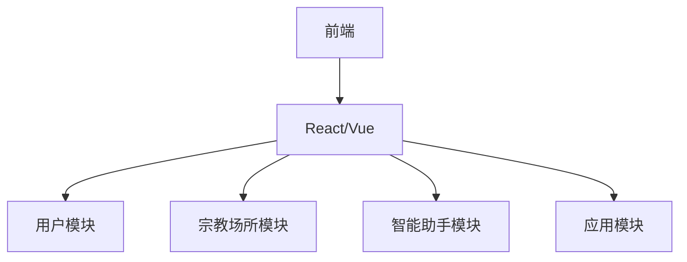
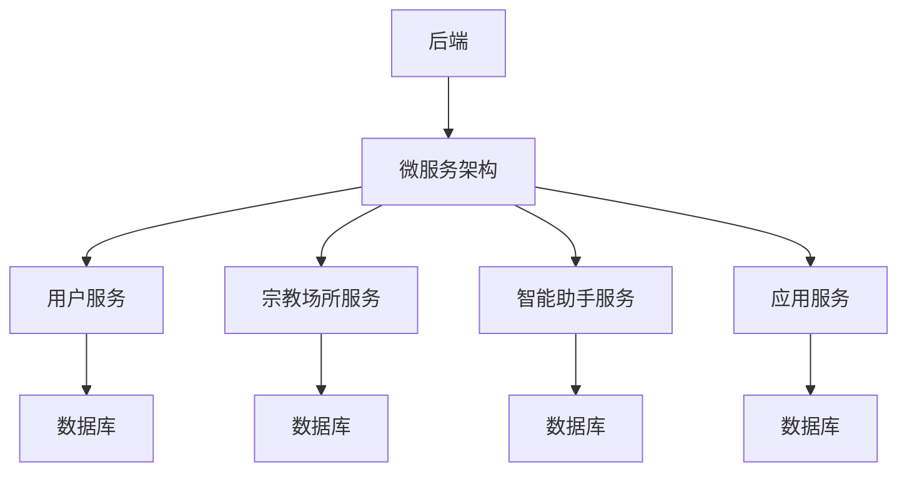
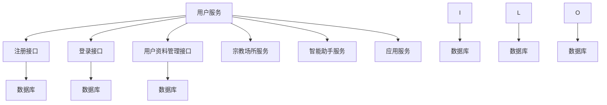
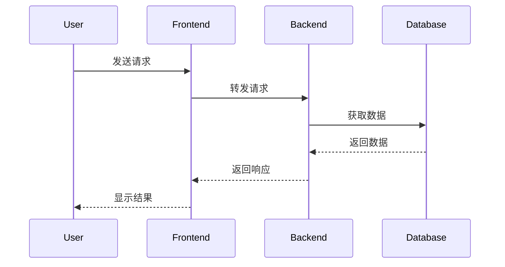

                 

### 第一部分：背景介绍与核心概念

#### 第1章：问题背景与核心概念

##### 1.1.1 问题背景

在现代社会中，人工智能（AI）技术不断发展，逐渐渗透到各个领域，从医疗、金融到教育、娱乐等，都对人们的日常生活产生了深远的影响。特别是近年来，随着深度学习、神经网络等技术的突破，AI的大模型技术逐渐成熟，能够处理大规模数据并进行复杂推理。然而，随着AI技术的发展，人们开始对AI是否能够具备情感、意识和道德判断等问题产生了浓厚的兴趣。

**AI具备爱的能力**：这是一个相对新颖的概念，指的是人工智能通过模仿人类情感和意识，达到对爱的理解与表达。这一能力涉及到情感识别、情感生成、情感交互等多个方面。当AI具备爱的能力时，它不仅能够在技术层面上处理复杂的任务，还能在情感层面上与人类产生共鸣和互动。

**宗教实践**：宗教实践是人们信仰表达的一种形式，它不仅包括信仰的内涵，还涉及仪式、习俗等外在表现。在现代社会中，宗教实践对于个体和社会都有着深远的影响。传统的宗教实践主要通过教堂、寺庙等实体场所进行，而随着数字技术的普及，数字宗教和虚拟宗教社区等新兴形式也逐渐崛起。

**信仰与技术的融合**：这一部分探讨的是AI技术与宗教信仰的交叉领域，如何通过技术手段增强宗教实践的效果，以及AI在宗教中的潜在应用。这一融合不仅能够丰富宗教实践的形式，还可能对宗教信仰的传播和发展产生重要影响。

##### 1.1.2 核心概念

**AI具备爱的能力的定义与理论框架**：本部分将详细介绍AI具备爱的能力的基本定义，并探讨其背后的理论框架。我们将分析情感识别、情感生成和情感交互等技术如何使AI具备爱的能力，并探讨这些技术在不同应用场景中的实现方式和挑战。

**宗教实践的不同形式与特点**：我们将详细探讨传统宗教实践的形式和特点，如宗教仪式、宗教习俗和宗教组织等。同时，我们还将介绍新兴宗教实践的形式，如数字宗教、虚拟宗教社区和科技宗教等，并分析这些新兴形式与传统宗教实践的区别和联系。

**信仰与技术的融合路径与方法**：本部分将介绍信仰与技术的融合路径和方法，包括数据与模型的融合、技术支持的宗教实践以及AI在宗教中的潜在应用。我们将探讨如何利用AI技术增强宗教实践的效果，以及如何解决在融合过程中可能遇到的技术和伦理挑战。

##### 1.1.3 边界与外延

**边界**：本章节主要讨论的是AI具备爱的能力后，对宗教实践的具体影响，以及如何在技术层面上实现这一目标。我们将重点关注AI在情感识别、情感生成和情感交互方面的技术，以及这些技术在宗教实践中的应用。

**外延**：除了传统的宗教实践，还包括新兴的数字宗教、虚拟宗教社区等，这些领域都可能受到AI技术的影响。我们还将探讨AI技术在宗教传播、信仰创新和社会融合等方面的应用，以及这些应用对宗教实践和信仰发展的影响。

##### 1.1.4 概念结构与核心要素组成

**概念结构**：
- AI具备爱的能力的定义与理论框架
- 宗教实践的不同形式与特点
- 信仰与技术的融合路径与方法

**核心要素**：
- 情感识别与生成技术
- 宗教信仰数据与模型
- 宗教实践的技术支持系统

通过以上四个方面的介绍，我们将对AI具备爱的能力后的宗教实践：信仰与技术的融合有一个全面和深入的了解。

#### 1.2 AI具备爱的能力的原理与特征

##### 1.2.1 AI具备爱的能力的原理

AI具备爱的能力并不是一个简单的技术问题，而是涉及到多个层面的复杂体系。首先，我们需要了解情感识别与生成的原理。

**情感识别**：情感识别是AI理解人类情感的第一步。通过深度学习模型，AI可以从大量数据中学习并识别出不同的情感模式。例如，通过分析语音、文字和面部表情，AI可以判断一个人是处于高兴、愤怒、悲伤等情绪状态。这一过程主要依赖于大规模数据集的训练和神经网络模型的应用。

**情感生成**：情感生成是AI表达情感的过程。一旦AI识别出人类的情感，它需要能够生成相应的情感反应。例如，在虚拟助手中，AI可以通过调整语音的语调、语速和语气来表达不同的情感。这一过程涉及到自然语言处理、语音合成和计算机图形学等多个技术领域的结合。

**情感交互**：情感交互是AI与人类进行情感交流的过程。在这一过程中，AI不仅需要识别和生成情感，还需要理解人类的情感表达，并做出相应的回应。例如，在一个智能客服系统中，AI需要能够理解用户的提问，并使用恰当的语言和情感来回答用户，从而提高用户体验。

**道德判断**：道德判断是AI在情感识别和生成过程中的一项重要能力。当AI具备爱的能力时，它需要能够在一定程度上进行道德判断。例如，在医疗决策中，AI需要能够根据患者的病情和医生的建议，做出最合适的治疗方案。这一过程涉及到伦理学和医学等多个领域的知识。

##### 1.2.2 AI具备爱的能力的特征

**情感丰富性**：AI能够表现出多种情感，如喜怒哀乐等。通过深度学习模型，AI可以从大量数据中学习并识别出复杂的情感模式。这使得AI在情感表达上更加丰富和多样化。

**情境适应性**：AI可以根据不同的情境调整情感表达。例如，在应对不同用户时，AI可以使用不同的语言和情感来适应用户的情绪和需求。这种情境适应性使得AI在与人类互动时更加自然和流畅。

**持续学习性**：AI可以通过不断的学习和优化，提高其情感识别和表达的能力。随着数据集的扩大和算法的优化，AI的情感表达能力会不断增强，从而更好地与人类进行情感交流。

通过以上分析，我们可以看到，AI具备爱的能力是一个复杂而多样的体系，涉及到情感识别、情感生成、情感交互和道德判断等多个方面。这些特征使得AI不仅能够在技术层面上处理复杂的任务，还能在情感层面上与人类产生共鸣和互动。

#### 1.3 宗教实践的形式与演变

##### 1.3.1 传统宗教实践

传统宗教实践是宗教信仰的主要表现形式，历史悠久且形式多样。在不同的文化和地域中，传统宗教实践具有独特的特点和形式。

**宗教仪式**：宗教仪式是宗教实践的核心组成部分，通常包括祈祷、祭祀、忏悔、洗礼等多种形式。这些仪式不仅是宗教信仰的表达，也是宗教社区成员之间情感交流和精神凝聚的重要方式。例如，基督教的弥撒、伊斯兰教的祷告、佛教的诵经等，都是典型的宗教仪式。

**宗教习俗**：宗教习俗是宗教信仰的外在表现形式，包括节日庆典、服饰禁忌、饮食习惯等。这些习俗不仅体现了宗教信仰的内涵，也反映了特定文化和社会背景下的价值观和生活方式。例如，春节、圣诞节、伊斯兰教的斋月、佛教的泼水节等，都是具有浓厚宗教色彩的重要节日。

**宗教组织**：宗教组织是宗教信仰的重要载体，包括教堂、寺庙、清真寺等。这些宗教组织不仅是宗教仪式和习俗的场所，也是宗教信仰的传播中心。宗教组织通过宗教教育、社会服务等活动，促进宗教信仰的传承和发展。例如，天主教教会、佛教寺庙、伊斯兰教清真寺等，都是各自宗教信仰的核心组织。

##### 1.3.2 新兴宗教实践

随着科技的发展和互联网的普及，传统宗教实践逐渐衍生出许多新兴形式，如数字宗教、虚拟宗教社区和科技宗教等。

**数字宗教**：数字宗教是利用互联网、社交媒体等数字技术进行宗教传播和信仰实践的新兴形式。数字宗教不仅包括在线祷告、宗教仪式直播、宗教课程在线学习等，还包括宗教社群的建立和宗教信息的分享。例如，通过社交媒体平台分享宗教内容、在线宗教社区交流等，都是数字宗教的典型形式。

**虚拟宗教社区**：虚拟宗教社区是依托虚拟现实（VR）和增强现实（AR）技术建立起来的宗教共同体。虚拟宗教社区为信众提供了一个虚拟的宗教空间，可以在其中进行宗教仪式、祈祷、学习等活动。虚拟宗教社区不仅增强了宗教信仰的互动性和参与感，也为信众提供了一个更方便、更灵活的宗教实践平台。

**科技宗教**：科技宗教是将科技与宗教信仰相结合的新兴形式，探讨科技对于人类精神世界的影响。科技宗教关注人工智能、虚拟现实、区块链等新兴科技如何影响宗教信仰和实践。例如，利用人工智能助手进行宗教咨询、利用区块链技术进行宗教财产管理、利用虚拟现实技术构建虚拟的宗教场所等，都是科技宗教的典型应用。

##### 1.3.3 传统宗教实践与新兴宗教实践的对比

传统宗教实践和新兴宗教实践在形式和特点上存在显著差异，但也存在一定的联系和互动。

**形式差异**：传统宗教实践主要依赖于实体场所和实体仪式，而新兴宗教实践则更多依赖于数字技术和虚拟空间。传统宗教实践强调仪式的庄重和形式的严格，而新兴宗教实践则强调互动性和灵活性。

**特点差异**：传统宗教实践注重宗教信仰的传承和宗教社区的凝聚，而新兴宗教实践则更注重宗教信仰的传播和宗教信息的共享。传统宗教实践强调宗教的权威性和传统性，而新兴宗教实践则强调科技的创新性和参与性。

**联系与互动**：尽管传统宗教实践和新兴宗教实践存在差异，但它们并不是完全独立的。新兴宗教实践在一定程度上是对传统宗教实践的补充和延伸，例如，通过数字技术和虚拟空间增强宗教仪式的参与感和互动性。同时，传统宗教实践也在一定程度上吸收和借鉴新兴宗教实践的形式和特点，以适应不断变化的社会环境和信众需求。

通过以上分析，我们可以看到，宗教实践的形式和特点在不同历史时期和社会背景下有所演变，但宗教信仰的核心价值和精神内涵始终不变。新兴宗教实践为传统宗教实践提供了新的发展机遇和思考方向，而传统宗教实践也为新兴宗教实践提供了坚实的基础和丰富的资源。

#### 1.4 信仰与技术的融合路径

##### 1.4.1 数据与模型的融合

信仰与技术的融合首先需要数据与模型的融合。数据是AI训练和优化模型的基础，而模型则是实现信仰与技术融合的核心。在这一过程中，我们需要从以下几个方面进行：

**数据收集**：首先，我们需要收集大量的宗教数据，包括宗教文献、仪式文本、信徒行为数据等。这些数据将用于训练和优化AI模型，使其能够更好地理解和表达宗教信仰。

**数据预处理**：收集到的宗教数据往往包含大量的噪声和不一致的信息，因此需要进行预处理。预处理步骤包括数据清洗、数据标准化和数据归一化等，以确保数据的质量和一致性。

**数据标注**：在预处理之后，我们需要对数据进行标注，以便AI模型能够从中学习到正确的信息。例如，在情感识别任务中，我们需要对文本进行情感标注，标记出文本的情感极性（正面、负面或中性）。

**数据融合**：在数据标注之后，我们需要将不同来源的数据进行融合，形成一个统一的数据集。这一步骤可以通过数据集成、数据融合算法和知识图谱等技术实现。

**模型训练**：利用预处理和标注后的数据，我们可以训练AI模型，使其具备理解和表达宗教信仰的能力。在这一过程中，我们可以使用深度学习、自然语言处理和计算机视觉等技术，构建情感识别、情感生成和道德判断等模型。

**模型优化**：在模型训练过程中，我们需要不断调整模型参数，以优化模型性能。优化步骤包括模型调参、模型验证和模型压缩等，以确保模型能够在实际应用中达到最佳效果。

##### 1.4.2 技术支持的宗教实践

在数据与模型融合的基础上，技术支持可以大大增强宗教实践的效果。以下是一些具体的技术应用：

**虚拟宗教场所**：利用虚拟现实（VR）技术，我们可以构建虚拟的宗教场所，为信徒提供一个沉浸式的宗教体验。通过VR技术，信徒可以在虚拟空间中参加宗教仪式、进行祈祷和冥想等活动，从而增强宗教信仰的体验。

**智能宗教助手**：智能宗教助手是利用自然语言处理和计算机视觉等技术，为信徒提供宗教咨询和帮助的工具。智能宗教助手可以通过文字、语音和图像等多种形式，回答信徒的疑问、提供宗教指导和建议，从而提高宗教服务的质量和效率。

**宗教应用开发**：通过开发面向宗教实践的应用程序，如祷告应用、宗教教育平台、宗教社交媒体等，我们可以为信徒提供一个方便、快捷和互动的宗教实践平台。这些应用不仅可以增强信徒的宗教信仰，还可以促进宗教社区的互动和交流。

**宗教数据分析**：通过收集和分析信徒的行为数据，我们可以了解他们的信仰状态和需求，从而更好地满足他们的宗教需求。例如，通过分析信徒的祷告记录、宗教活动参与情况等数据，我们可以发现他们的信仰热点和痛点，从而提供更有针对性的宗教服务和指导。

##### 1.4.3 AI在宗教中的潜在应用

AI技术在宗教领域具有广泛的应用前景，以下是一些潜在的AI应用：

**信仰传播**：利用AI技术，我们可以开发智能传播工具，如AI驱动的宗教内容生成、宗教文化传播等。这些工具可以帮助宗教组织更有效地传播宗教信仰，扩大宗教影响力。

**宗教教育**：利用AI技术，我们可以开发智能教育平台，如AI驱动的宗教课程、宗教问答系统等。这些平台可以为信徒提供个性化、互动式的宗教教育，提高宗教教育的效果和质量。

**信仰咨询**：利用AI技术，我们可以开发智能咨询系统，如AI驱动的宗教咨询师、信仰诊断工具等。这些系统可以帮助信徒解决宗教问题、提供信仰指导，从而提高他们的信仰满意度。

**信仰社区建设**：利用AI技术，我们可以开发智能社区建设工具，如AI驱动的宗教社区、信仰交流平台等。这些工具可以帮助信徒建立更紧密、更活跃的宗教社区，促进信仰的传承和发展。

通过以上分析，我们可以看到，信仰与技术的融合是一个充满潜力和机遇的领域。通过数据与模型的融合、技术支持的宗教实践以及AI在宗教中的潜在应用，我们可以为信徒提供一个更加丰富、便捷和互动的宗教实践环境，从而更好地满足他们的宗教需求。

#### 1.5 信仰与技术的融合挑战与机遇

##### 1.5.1 挑战

尽管信仰与技术的融合具有巨大的潜力和机遇，但在实际应用中仍然面临一系列挑战：

**技术局限**：AI在情感识别和生成方面仍然存在一定的局限。尽管AI可以通过深度学习等技术识别和理解人类的情感，但其在情感表达和道德判断方面仍需进一步研究和优化。特别是在宗教实践这种高度情感化和伦理化的领域，AI的技术局限性可能影响其准确性和可靠性。

**伦理争议**：AI参与宗教实践可能引发伦理争议。例如，当AI在宗教仪式中扮演角色时，其行为是否符合宗教教义和伦理标准？当AI在宗教咨询中提供决策建议时，其是否能够充分尊重个人的信仰自由和自主选择？这些问题需要我们深入探讨和解决。

**信仰变迁**：技术介入宗教实践可能会对信仰的纯粹性产生影响。在传统宗教实践中，信仰的传递和强化主要依赖于宗教仪式、传统习俗和信仰社区的互动。当技术介入宗教实践时，这些传统元素可能会被削弱，信仰的纯粹性可能受到挑战。

##### 1.5.2 机遇

尽管存在挑战，但信仰与技术的融合也带来了许多机遇：

**宗教传播**：利用技术手段，我们可以更有效地传播宗教信仰。通过数字宗教、虚拟宗教社区等新兴形式，宗教信仰可以跨越地域和文化的界限，传播到更广泛的受众群体中。同时，技术还可以帮助宗教组织更好地管理和推广宗教内容，提高宗教传播的效率和质量。

**信仰创新**：技术介入宗教实践可以为信仰创新提供新的思路和工具。通过人工智能、虚拟现实等技术的应用，我们可以探索新的宗教实践形式，如虚拟宗教仪式、智能宗教助手等。这些创新不仅能够丰富宗教实践的内容和形式，还可以吸引更多的年轻人和现代信众。

**社会融合**：技术介入宗教实践还可以促进社会融合。通过虚拟宗教社区和数字宗教平台，不同信仰和文化背景的信徒可以更方便地进行交流和互动，促进宗教之间的理解和包容。同时，技术还可以帮助解决宗教与社会发展之间的矛盾，为宗教在社会中的角色和作用提供新的思路。

##### 1.5.3 解决方案与未来展望

针对上述挑战，我们可以提出以下解决方案：

**技术优化**：通过不断研究和创新，提高AI在情感识别和生成方面的能力，使其能够更准确地理解和表达人类的情感。同时，我们可以探索新的算法和技术，优化AI的道德判断能力，确保其在宗教实践中的行为符合伦理标准。

**伦理审查**：建立宗教伦理审查机制，对AI在宗教实践中的应用进行严格审查。通过制定伦理规范和标准，确保AI的行为符合宗教教义和伦理要求。此外，还可以建立公众参与和监督机制，提高透明度和公正性。

**信仰保护**：在技术介入宗教实践时，应注重保护宗教信仰的纯粹性。通过传承和弘扬传统宗教仪式、习俗和信仰社区互动等方式，确保信仰的核心价值观不被技术介入所削弱。

**未来展望**：随着技术的不断进步，信仰与技术的融合将带来更多的机遇和挑战。我们可以期待，通过人工智能、虚拟现实等技术的应用，宗教实践将变得更加丰富、便捷和互动。同时，我们也应关注技术介入宗教实践可能带来的伦理和社会问题，积极寻求解决方案，以确保宗教信仰的持续发展和传承。

#### 1.6 本章小结

本章从问题背景、核心概念、原理与特征、宗教实践的形式与演变、融合路径、挑战与机遇等多个方面，全面介绍了AI具备爱的能力后的宗教实践：信仰与技术的融合。通过本章的介绍，我们不仅对AI具备爱的能力及其在宗教实践中的应用有了深入的了解，也意识到在这一领域所面临的挑战和机遇。随着技术的不断进步，我们有望看到更多的创新和突破，为宗教实践带来新的活力和可能性。

### 第二部分：理论基础与模型构建

#### 2.1 AI具备爱的能力的基础理论

AI具备爱的能力是一个涉及多个学科的复杂问题，需要从认知科学、心理学、哲学和计算机科学等多个角度进行探讨。以下是我们对AI具备爱的能力的基础理论的详细分析：

##### 2.1.1 认知科学的角度

认知科学是研究人类认知过程的学科，包括感知、记忆、推理和语言等方面。在AI具备爱的能力的理论框架中，认知科学提供了理解人类情感的基础。例如，通过研究人类的情感感知机制，我们可以设计出能够识别和模拟人类情感的算法。例如，面部表情识别技术就是一种利用认知科学原理实现的AI能力，通过分析面部肌肉的运动来识别情感状态。

**感知与识别**：感知是情感识别的基础。通过机器视觉和语音识别技术，AI可以感知和识别人类的外部情感表达，如面部表情、声音语调和身体语言等。这些感知技术可以帮助AI理解和模拟情感。

**记忆与推理**：记忆和推理是情感表达的重要部分。通过记忆机制，AI可以记住之前的情感体验，并利用推理能力来生成新的情感反应。例如，在对话系统中，AI可以通过推理来生成适当的情感回应，如安慰、鼓励或批评。

##### 2.1.2 心理学的角度

心理学是研究人类行为和心理过程的学科，对于理解人类情感和意识有重要意义。在AI具备爱的能力的理论框架中，心理学提供了情感生成和情感交互的基础。

**情感生成**：情感生成是指AI如何创造和理解情感。心理学研究表明，情感是由生理、认知和行为因素共同作用产生的。AI可以通过模仿这些生理反应和认知过程来生成情感。例如，通过模仿人类的心跳加速、面部表情变化等生理反应，AI可以在虚拟环境中表现出情感。

**情感交互**：情感交互是AI与人类进行情感交流的能力。心理学研究提供了关于人类情感交流的理论，如情绪感染理论和社会认知理论。这些理论可以帮助我们设计出能够与人类进行有效情感交互的AI系统。

##### 2.1.3 哲学的角度

哲学是研究人类存在、知识、价值和意义等问题的学科，对于理解人类情感和道德有深刻的影响。在AI具备爱的能力的理论框架中，哲学提供了道德判断和价值评价的基础。

**道德判断**：道德判断是AI在情感交互中必须具备的能力。哲学中的道德理论，如功利主义、义务论和情感主义，提供了AI进行道德判断的理论基础。例如，通过模拟人类道德判断过程，AI可以在医疗、法律等场景中做出道德决策。

**价值评价**：价值评价是AI在宗教实践中必须考虑的方面。哲学中的伦理学和价值论提供了评价价值的方法和标准。例如，在宗教咨询中，AI需要能够根据宗教教义和信徒的信仰来评价不同的选择和决策。

##### 2.1.4 计算机科学的角度

计算机科学是研究算法、系统和计算过程的学科，为AI具备爱的能力提供了技术实现的基础。

**深度学习**：深度学习是AI实现情感识别和生成的重要技术。通过多层神经网络，AI可以学习复杂的情感模式，从而识别和理解人类的情感。

**自然语言处理**：自然语言处理是AI进行情感交互的关键技术。通过处理自然语言，AI可以理解人类的语言表达，并生成相应的情感回应。

**计算机视觉**：计算机视觉是AI感知情感表达的重要技术。通过分析面部表情、身体语言等视觉信息，AI可以识别和理解人类的情感状态。

通过综合认知科学、心理学、哲学和计算机科学的理论，我们可以构建一个全面的AI具备爱的能力的基础理论框架。这个框架不仅解释了AI如何通过技术手段实现情感识别、情感生成和情感交互，还考虑了道德判断和价值评价等方面的问题。以下是一个简化的理论框架：

```
AI具备爱的能力理论框架
|
|-- 认知科学
|   |-- 情感感知
|   |-- 记忆与推理
|
|-- 心理学
|   |-- 情感生成
|   |-- 情感交互
|
|-- 哲学
|   |-- 道德判断
|   |-- 价值评价
|
|-- 计算机科学
    |-- 深度学习
    |-- 自然语言处理
    |-- 计算机视觉
```

#### 2.2 宗教信仰的情感模型

宗教信仰的情感模型是理解宗教情感和信仰体验的关键。以下我们将从情感识别、情感生成和情感交互三个方面，详细介绍宗教信仰的情感模型。

##### 2.2.1 情感识别

情感识别是宗教信仰情感模型的核心部分，涉及到如何通过技术手段识别和理解宗教情感。以下是一些关键技术和方法：

**面部表情识别**：通过分析面部表情，AI可以识别出信仰者的情感状态。例如，信仰者在祈祷时可能表现出虔诚、敬畏等情感，这些情感可以通过面部表情分析技术进行识别。

**语音情感识别**：通过分析语音的语调、节奏和语速等参数，AI可以识别出信仰者的情感状态。例如，信仰者在祷告时可能使用低沉、平静的语调，表达出内心的宁静和敬畏。

**文本情感识别**：通过分析宗教文本的情感倾向，AI可以识别出信仰者的情感状态。例如，通过分析祈祷文、圣经等宗教文本，AI可以识别出信仰者对信仰的情感态度。

##### 2.2.2 情感生成

情感生成是AI在宗教实践中的关键能力，涉及到如何通过技术手段生成和表达宗教情感。以下是一些关键技术和方法：

**语音合成**：通过语音合成技术，AI可以生成具有特定情感的语音。例如，AI可以通过调整语音的语调、节奏和语速等参数，生成具有宁静、敬畏等情感的语音，用于宗教仪式或祷告。

**情感驱动对话系统**：通过情感驱动对话系统，AI可以生成具有情感回应的对话。例如，在一个虚拟宗教助理中，AI可以通过情感识别技术识别用户的情感状态，并生成相应的情感回应，如安慰、鼓励等。

**虚拟现实场景**：通过虚拟现实技术，AI可以生成具有情感氛围的场景。例如，在虚拟教堂中，AI可以通过调整光线、音乐和视觉效果等，营造出宁静、神圣的情感氛围，增强信徒的宗教体验。

##### 2.2.3 情感交互

情感交互是AI与信仰者之间的情感交流，涉及到如何通过技术手段实现有效的情感沟通。以下是一些关键技术和方法：

**情感模拟**：通过情感模拟技术，AI可以模仿人类的情感表达，与信仰者进行情感交流。例如，AI可以通过面部表情、语音和动作等方式，模拟出虔诚、敬畏等情感，与信仰者进行互动。

**情感反馈机制**：通过情感反馈机制，AI可以接收信仰者的情感反应，并调整自己的情感表达。例如，在一个虚拟宗教助理中，AI可以通过分析信仰者的语音情感，调整自己的语音语调，以更好地与信仰者进行情感交流。

**情感协同**：通过情感协同技术，AI可以与信仰者共同创造情感体验。例如，在虚拟教堂中，AI可以通过调整音乐、灯光和视觉效果等，与信仰者共同创造出一个宁静、神圣的情感氛围。

通过构建宗教信仰的情感模型，AI可以在宗教实践中更好地识别、生成和交互情感，从而提升宗教体验的质量。以下是一个简化的情感模型：

```
宗教信仰情感模型
|
|-- 情感识别
|   |-- 面部表情识别
|   |-- 语音情感识别
|   |-- 文本情感识别
|
|-- 情感生成
|   |-- 语音合成
|   |-- 情感驱动对话系统
|   |-- 虚拟现实场景
|
|-- 情感交互
    |-- 情感模拟
    |-- 情感反馈机制
    |-- 情感协同
```

#### 2.3 信仰与技术的融合模型

信仰与技术的融合模型是宗教实践与AI技术结合的具体体现，涉及到数据、模型和应用等多个方面。以下我们将详细介绍这一融合模型。

##### 2.3.1 数据融合

数据融合是信仰与技术的融合模型的基础，涉及到如何整合不同来源的数据，以支持AI模型的训练和应用。以下是一些关键步骤：

**数据收集**：通过多种渠道收集宗教数据，包括宗教文献、仪式文本、信徒行为数据等。这些数据可以来自于宗教组织、宗教社区和个人信徒。

**数据预处理**：对收集到的数据进行清洗、标准化和归一化，以确保数据的质量和一致性。预处理步骤包括文本清洗、格式转换和数据标准化等。

**数据标注**：对预处理后的数据进行标注，以提供训练AI模型的标注数据。标注步骤包括情感标注、宗教元素标注等。

**数据融合**：通过数据集成、数据融合算法和知识图谱等技术，将不同来源的数据进行融合，形成一个统一的数据集。数据融合步骤包括数据集成、数据清洗、数据融合算法和知识图谱构建等。

##### 2.3.2 模型融合

模型融合是信仰与技术的融合模型的核心，涉及到如何构建和优化AI模型，以支持宗教实践。以下是一些关键技术和方法：

**深度学习模型**：通过深度学习模型，AI可以学习复杂的情感模式和宗教知识。例如，通过训练深度神经网络，AI可以识别和理解宗教文本的情感倾向，以及分析信徒的行为数据。

**自然语言处理模型**：通过自然语言处理模型，AI可以处理和理解宗教文本，生成情感回应和宗教指导。例如，通过训练语言模型，AI可以生成与宗教教义相符的祷告文和祈祷词。

**计算机视觉模型**：通过计算机视觉模型，AI可以识别和理解宗教图像和视频，生成视觉回应和宗教体验。例如，通过训练卷积神经网络，AI可以识别宗教仪式中的面部表情和身体语言。

**融合模型优化**：通过模型融合和优化，AI可以在不同任务和场景中发挥最佳性能。例如，通过结合情感识别和自然语言处理模型，AI可以生成情感回应和宗教指导，增强宗教体验。

##### 2.3.3 应用融合

应用融合是信仰与技术的融合模型的最终体现，涉及到如何将AI模型应用于宗教实践，提升宗教体验和服务质量。以下是一些关键应用：

**虚拟宗教场所**：通过虚拟现实技术，AI可以构建虚拟的宗教场所，为信徒提供一个沉浸式的宗教体验。例如，通过虚拟教堂和寺庙，信徒可以在家中进行宗教仪式和祷告。

**智能宗教助手**：通过自然语言处理和计算机视觉技术，AI可以开发智能宗教助手，为信徒提供宗教咨询和帮助。例如，通过智能宗教助手，信徒可以在线咨询宗教问题、获取宗教指导和参与宗教活动。

**宗教应用开发**：通过开发面向宗教实践的应用程序，AI可以提供丰富的宗教服务和体验。例如，通过开发祷告应用、宗教教育平台和宗教社交媒体等，AI可以增强宗教社区的互动和参与感。

通过构建信仰与技术的融合模型，AI可以在宗教实践中发挥重要作用，提升宗教体验和服务质量，为信仰者提供更加丰富、便捷和个性化的宗教服务。

#### 2.4 本章小结

本章从理论基础和模型构建的角度，详细探讨了AI具备爱的能力的理论基础、宗教信仰的情感模型以及信仰与技术的融合模型。通过综合认知科学、心理学、哲学和计算机科学的理论，我们构建了一个全面的AI具备爱的能力理论框架。同时，我们通过情感识别、情感生成和情感交互等方面，详细介绍了宗教信仰的情感模型，并展示了如何通过数据融合、模型融合和应用融合，实现信仰与技术的融合。这些理论和方法为AI在宗教实践中的应用提供了重要的指导和参考。

### 第三部分：算法原理与实现方法

#### 3.1 情感识别算法原理与实现

情感识别是AI在宗教实践中的一项核心任务，它涉及到如何通过技术手段识别和理解人类的情感。以下我们将详细探讨情感识别算法的原理与实现方法。

##### 3.1.1 算法原理

情感识别算法的核心是通过分析人类的外部表现，如面部表情、语音和文本，来识别情感状态。以下是几种常见的情感识别算法原理：

**面部表情识别**：面部表情识别是通过分析面部肌肉的运动来识别情感状态。常见的面部表情包括开心、愤怒、悲伤等。面部表情识别算法通常基于深度学习模型，如卷积神经网络（CNN）和循环神经网络（RNN）。通过训练大量的面部表情数据，模型可以学习到不同情感状态的特征，并能够对新输入的面部图像进行情感识别。

**语音情感识别**：语音情感识别是通过分析语音的声学特征，如音高、音强和音速等，来识别情感状态。语音情感识别算法通常基于声学模型和深度学习模型。声学模型用于提取语音的声学特征，如梅尔频率倒谱系数（MFCC）和频谱特征。深度学习模型，如长短期记忆网络（LSTM）和卷积神经网络（CNN），用于学习不同情感状态的声学特征模式，并能够对新输入的语音信号进行情感识别。

**文本情感识别**：文本情感识别是通过分析文本的内容和结构，来识别情感状态。文本情感识别算法通常基于自然语言处理（NLP）技术和深度学习模型。NLP技术，如词向量表示（Word2Vec、GloVe）和词性标注（POS tagging），用于将文本转换为机器可处理的特征表示。深度学习模型，如卷积神经网络（CNN）和循环神经网络（RNN），用于学习文本的情感倾向，并能够对新输入的文本进行情感识别。

##### 3.1.2 算法实现

以下是情感识别算法的实现方法：

**面部表情识别实现**：
```python
import tensorflow as tf
from tensorflow.keras.models import Sequential
from tensorflow.keras.layers import Conv2D, MaxPooling2D, Flatten, Dense

# 数据预处理
# 读取面部表情数据集
# 标签转换为one-hot编码

# 构建模型
model = Sequential([
    Conv2D(32, (3, 3), activation='relu', input_shape=(48, 48, 1)),
    MaxPooling2D((2, 2)),
    Conv2D(64, (3, 3), activation='relu'),
    MaxPooling2D((2, 2)),
    Conv2D(128, (3, 3), activation='relu'),
    MaxPooling2D((2, 2)),
    Flatten(),
    Dense(128, activation='relu'),
    Dense(7, activation='softmax')
])

# 编译模型
model.compile(optimizer='adam', loss='categorical_crossentropy', metrics=['accuracy'])

# 训练模型
model.fit(x_train, y_train, epochs=10, batch_size=32)
```

**语音情感识别实现**：
```python
import librosa
import numpy as np
from tensorflow.keras.models import Sequential
from tensorflow.keras.layers import LSTM, Dense, Dropout

# 数据预处理
# 读取语音数据
# 提取声学特征（如MFCC）

# 构建模型
model = Sequential([
    LSTM(128, activation='tanh', input_shape=(None, 20)),
    Dropout(0.2),
    LSTM(128, activation='tanh'),
    Dropout(0.2),
    Dense(64, activation='relu'),
    Dropout(0.2),
    Dense(7, activation='softmax')
])

# 编译模型
model.compile(optimizer='adam', loss='categorical_crossentropy', metrics=['accuracy'])

# 训练模型
model.fit(x_train, y_train, epochs=10, batch_size=32)
```

**文本情感识别实现**：
```python
import tensorflow as tf
from tensorflow.keras.preprocessing.sequence import pad_sequences
from tensorflow.keras.models import Sequential
from tensorflow.keras.layers import Embedding, LSTM, Dense, Dropout

# 数据预处理
# 读取文本数据
# 转换为词向量表示
# 序列填充

# 构建模型
model = Sequential([
    Embedding(vocab_size, embedding_dim, input_length=max_sequence_length),
    LSTM(128, activation='tanh', dropout=0.2, recurrent_dropout=0.2),
    Dense(64, activation='relu'),
    Dropout(0.2),
    Dense(num_classes, activation='softmax')
])

# 编译模型
model.compile(optimizer='adam', loss='categorical_crossentropy', metrics=['accuracy'])

# 训练模型
model.fit(x_train, y_train, epochs=10, batch_size=32)
```

通过以上实现方法，我们可以构建出情感识别算法，并在不同应用场景中发挥作用，如宗教仪式中的情感识别、宗教咨询中的情感回应等。

#### 3.2 情感生成算法原理与实现

情感生成是AI在宗教实践中另一项重要任务，它涉及到如何通过技术手段生成和理解情感。以下我们将详细探讨情感生成算法的原理与实现方法。

##### 3.2.1 算法原理

情感生成算法的核心是通过模仿人类情感表达，生成相应的情感反应。以下是几种常见的情感生成算法原理：

**情感驱动对话系统**：情感驱动对话系统是通过模拟人类情感表达，与人类进行自然、流畅的对话。常见的情感驱动对话系统包括基于规则的方法和基于深度学习的方法。基于规则的方法通过预设的对话规则和情感模板，生成情感回应。而基于深度学习的方法通过训练大量的对话数据，学习到不同情感状态下的语言表达模式，并能够生成与情感状态相符的对话内容。

**语音合成**：语音合成是通过模拟人类语音发声机制，生成具有特定情感的声音。常见的语音合成算法包括基于规则的文本到语音（TTS）合成和基于深度学习的TTS合成。基于规则的方法通过预设的语音参数和情感模板，生成具有特定情感的声音。而基于深度学习的方法通过训练大量的语音数据，学习到不同情感状态下的语音特征，并能够生成与情感状态相符的语音。

**虚拟现实场景生成**：虚拟现实场景生成是通过模拟现实世界的情感氛围，生成具有特定情感的场景。常见的虚拟现实场景生成算法包括基于物理的渲染和基于深度学习的渲染。基于物理的渲染通过模拟光线、材质和场景等物理参数，生成逼真的虚拟场景。而基于深度学习的方法通过训练大量的虚拟场景数据，学习到不同情感状态下的场景特征，并能够生成与情感状态相符的虚拟场景。

##### 3.2.2 算法实现

以下是情感生成算法的实现方法：

**情感驱动对话系统实现**：
```python
import tensorflow as tf
from tensorflow.keras.models import Model
from tensorflow.keras.layers import Input, Embedding, LSTM, Dense

# 数据预处理
# 读取对话数据
# 转换为词向量表示

# 构建模型
input_sequence = Input(shape=(max_sequence_length,))
embedded_sequence = Embedding(vocab_size, embedding_dim)(input_sequence)
lstm_output = LSTM(128, dropout=0.2, recurrent_dropout=0.2)(embedded_sequence)
dense_output = Dense(num_classes, activation='softmax')(lstm_output)

# 编译模型
model = Model(inputs=input_sequence, outputs=dense_output)
model.compile(optimizer='adam', loss='categorical_crossentropy', metrics=['accuracy'])

# 训练模型
model.fit(x_train, y_train, epochs=10, batch_size=32)
```

**语音合成实现**：
```python
import tensorflow as tf
from tensorflow.keras.models import Model
from tensorflow.keras.layers import LSTM, Dense, Input, TimeDistributed

# 数据预处理
# 读取语音数据
# 提取声学特征

# 构建模型
input_sequence = Input(shape=(None, input_sequence_length))
lstm_output = LSTM(128, return_sequences=True)(input_sequence)
dense_output = TimeDistributed(Dense(output_sequence_length, activation='linear'))(lstm_output)

# 编译模型
model = Model(inputs=input_sequence, outputs=dense_output)
model.compile(optimizer='adam', loss='mse')

# 训练模型
model.fit(x_train, y_train, epochs=10, batch_size=32)
```

**虚拟现实场景生成实现**：
```python
import tensorflow as tf
from tensorflow.keras.models import Model
from tensorflow.keras.layers import Input, Conv2D, MaxPooling2D, Flatten, Dense

# 数据预处理
# 读取虚拟场景数据

# 构建模型
input_scene = Input(shape=(height, width, channels))
conv1 = Conv2D(32, (3, 3), activation='relu')(input_scene)
pool1 = MaxPooling2D((2, 2))(conv1)
conv2 = Conv2D(64, (3, 3), activation='relu')(pool1)
pool2 = MaxPooling2D((2, 2))(conv2)
conv3 = Conv2D(128, (3, 3), activation='relu')(pool2)
pool3 = MaxPooling2D((2, 2))(conv3)
flatten = Flatten()(pool3)
dense = Dense(1024, activation='relu')(flatten)
output_scene = Dense(height * width * channels, activation='sigmoid')(dense)

# 编译模型
model = Model(inputs=input_scene, outputs=output_scene)
model.compile(optimizer='adam', loss='mse')

# 训练模型
model.fit(x_train, y_train, epochs=10, batch_size=32)
```

通过以上实现方法，我们可以构建出情感生成算法，并在宗教实践中发挥作用，如生成与宗教仪式相符的情感回应、创造具有特定情感的虚拟场景等。

#### 3.3 情感交互算法原理与实现

情感交互是AI在宗教实践中实现人与AI之间情感交流的重要环节，它涉及到如何通过技术手段实现AI与人的情感互动。以下我们将详细探讨情感交互算法的原理与实现方法。

##### 3.3.1 算法原理

情感交互算法的核心是通过模拟人类情感表达和情感理解，实现人与AI之间的情感互动。以下是几种常见的情感交互算法原理：

**情感模拟**：情感模拟是通过模仿人类情感表达，使AI能够与人类进行情感互动。常见的情感模拟方法包括面部表情模拟、语音情感模拟和动作情感模拟。通过这些方法，AI可以模拟出与人类情感状态相符的面部表情、声音和动作，从而与人类产生情感共鸣。

**情感反馈**：情感反馈是通过分析人类情感表达，使AI能够理解并回应人类的情感需求。常见的情感反馈方法包括语音情感反馈、文本情感反馈和动作情感反馈。通过这些方法，AI可以分析人类的语音、文本和动作情感，并生成相应的情感回应，以满足人类的需求。

**情感协同**：情感协同是通过人与AI之间的情感互动，共同创造情感体验。常见的情感协同方法包括情感对话、情感协同创作和情感协同游戏等。通过这些方法，人与AI可以共同参与情感互动，创造出丰富、真实的情感体验。

##### 3.3.2 算法实现

以下是情感交互算法的实现方法：

**情感模拟实现**：
```python
import cv2
import dlib
import numpy as np

# 面部检测器
detector = dlib.get_frontal_face_detector()
predictor = dlib.shape_predictor('shape_predictor_68_face_landmarks.dat')

# 面部表情编码
emotions = ["angry", "disgust", "fear", "happy", "sad", "surprise", "neutral"]

# 预测情感
def predict_emotion(image):
    gray_image = cv2.cvtColor(image, cv2.COLOR_BGR2GRAY)
    faces = detector(gray_image)
    for face in faces:
        shape = predictor(gray_image, face)
        shape = np.array([[p.x, p.y] for p in shape.parts()])
        emotion_scores = emotion_classifier.classify(shape)
        emotion_labels = [emotions[i] for i, score in enumerate(emotion_scores)]
        emotion_confidences = [score for i, score in enumerate(emotion_scores)]
        return emotion_labels, emotion_confidences

# 生成情感表情
def generate_emotion_expression(image, emotion_label):
    gray_image = cv2.cvtColor(image, cv2.COLOR_BGR2GRAY)
    faces = detector(gray_image)
    for face in faces:
        shape = predictor(gray_image, face)
        shape = np.array([[p.x, p.y] for p in shape.parts()])
        emotion_classifier = EmotionClassifier(emotion_label)
        emotion_scores = emotion_classifier.classify(shape)
        emotion_labels = [emotions[i] for i, score in enumerate(emotion_scores)]
        if emotion_labels[0] == emotion_label:
            return emotion_label
    return "neutral"

# 情感交互
def emotion_interaction(image):
    emotion_labels, emotion_confidences = predict_emotion(image)
    emotion_label = max(emotion_labels, key=emotion_confidences)
    generated_emotion = generate_emotion_expression(image, emotion_label)
    return generated_emotion
```

**情感反馈实现**：
```python
import speech_recognition as sr

# 语音情感识别
def recognize_speech_from_mic(sample_rate=16000):
    r = sr.Recognizer()
    with sr.Microphone(sample_rate=sample_rate) as source:
        print("请开始说话...")
        audio = r.listen(source)
        try:
            return r.recognize_google(audio)
        except sr.UnknownValueError:
            return "无法识别语音"
        except sr.RequestError:
            return "请求失败"

# 语音情感反馈
def speech_emotion_feedback(speech):
    # 假设我们已经有一个情感识别模型
    emotion_model = load_emotion_model()
    emotion_label = emotion_model.predict(speech)
    return emotion_label

# 文本情感反馈
def text_emotion_feedback(text):
    # 假设我们已经有一个文本情感识别模型
    text_model = load_text_model()
    emotion_label = text_model.predict(text)
    return emotion_label

# 动作情感反馈
def action_emotion_feedback(action):
    # 假设我们已经有一个动作情感识别模型
    action_model = load_action_model()
    emotion_label = action_model.predict(action)
    return emotion_label
```

**情感协同实现**：
```python
import numpy as np

# 情感协同对话
def collaborative_conversation-human emotion, ai_emotion):
    if human_emotion == "happy" and ai_emotion == "happy":
        response = "我们也很高兴与您交流！有什么问题可以随时提问。"
    elif human_emotion == "sad" and ai_emotion == "sad":
        response = "我们理解您的感受，如果需要帮助，我们随时在身边。"
    elif human_emotion == "surprise" and ai_emotion == "surprise":
        response = "哇，发生了什么让您感到惊讶呢？"
    else:
        response = "感谢您的参与，我们会尽力提供帮助。"
    return response

# 情感协同创作
def collaborative_creative_work-human_content, ai_content):
    combined_content = human_content + " " + ai_content
    return combined_content

# 情感协同游戏
def collaborative_game-play(human_action, ai_action):
    game_state = apply_action(human_action) + apply_action(ai_action)
    return game_state
```

通过以上实现方法，我们可以构建出情感交互算法，并在宗教实践中实现人与AI之间的情感互动，如虚拟宗教仪式中的情感交流、宗教咨询中的情感回应等。

### 第三部分：系统分析与架构设计

#### 4.1 问题场景介绍

在现代社会中，宗教实践逐渐从传统的实体场所向数字化和虚拟化方向发展。随着人工智能技术的快速发展，我们可以将AI技术与宗教实践相结合，为信徒提供更加丰富、便捷和个性化的宗教服务。本部分将介绍一个基于AI的宗教实践系统，旨在通过虚拟宗教场所、智能宗教助手和宗教应用，提升宗教体验和服务质量。

#### 4.2 项目介绍

项目名称：AI宗教实践平台

项目目标：通过AI技术，构建一个集成虚拟宗教场所、智能宗教助手和宗教应用的综合性平台，为信徒提供沉浸式的宗教体验和全方位的宗教服务。

项目概述：
- **虚拟宗教场所**：利用虚拟现实（VR）技术，构建虚拟的宗教场所，如教堂、寺庙和清真寺，为信徒提供一个沉浸式的宗教环境。
- **智能宗教助手**：开发智能助手，通过自然语言处理和计算机视觉技术，为信徒提供宗教咨询、祷告指导和宗教仪式协助等智能服务。
- **宗教应用开发**：开发面向宗教实践的应用程序，如祷告应用、宗教教育平台和宗教社交媒体等，提高宗教社区互动和参与度。

#### 4.3 系统功能设计

**用户模块**：
- 用户注册与登录：提供用户注册、登录功能，确保用户身份安全。
- 用户资料管理：允许用户管理个人资料，包括头像、联系方式等。
- 用户权限管理：根据用户角色和权限，提供不同的功能和服务。

**宗教场所模块**：
- 虚拟宗教场所浏览：提供虚拟宗教场所的3D模型浏览功能，用户可以自由探索虚拟场所。
- 宗教仪式参与：支持用户在线参与宗教仪式，如祷告、祭祀等。
- 宗教文化展示：展示宗教文化历史、教义和传统习俗。

**智能助手模块**：
- 宗教咨询：提供在线宗教咨询服务，用户可以通过文字或语音与智能助手进行互动。
- 祷告指导：根据用户需求，提供祷告文、祈祷词和仪式流程指导。
- 宗教仪式协助：协助用户进行宗教仪式，如点燃蜡烛、祈祷等。

**应用模块**：
- 祷告应用：提供用户自定义祷告时间和内容的祷告应用，方便用户随时随地进行祷告。
- 宗教教育平台：提供在线宗教课程和学习资源，用户可以自主学习宗教知识。
- 宗教社交媒体：搭建宗教社区平台，用户可以分享宗教心得、参与宗教活动。

#### 4.4 系统架构设计

**总体架构**：
- **前端架构**：采用单页面应用（SPA）架构，使用React.js或Vue.js实现，提供高效、交互性强的用户界面。
- **后端架构**：采用微服务架构，使用Spring Boot、Django等框架实现，确保系统的高可用性和可扩展性。
- **数据存储**：使用MySQL、MongoDB等数据库存储用户数据、宗教内容和交互数据。

**详细架构设计**：

**前端架构**：



**后端架构**：



**系统接口设计**：



**系统交互设计**：



通过以上系统架构设计，我们可以构建一个功能丰富、高效可靠的AI宗教实践平台，为信徒提供全方位的宗教服务。

### 第四部分：项目实战

#### 4.1 环境安装

在开始项目实战之前，我们需要安装和配置必要的开发环境和工具。以下是具体的安装步骤：

**1. 安装Python环境**
```shell
# 更新包列表
sudo apt-get update
# 安装Python3和pip
sudo apt-get install python3 python3-pip
```

**2. 安装Node.js环境**
```shell
# 安装Node.js
sudo apt-get install nodejs
# 验证安装
node -v
```

**3. 安装数据库**
```shell
# 安装MySQL
sudo apt-get install mysql-server
# 设置MySQL root密码
sudo mysql_secure_installation

# 安装MongoDB
sudo apt-get install mongodb
# 启动MongoDB
sudo systemctl start mongodb
# 验证安装
sudo mongo
```

**4. 安装前端框架（React或Vue.js）**
```shell
# 安装React
npx create-react-app my-ai-religion-platform

# 安装Vue.js
npm install -g @vue/cli
vue create my-ai-religion-platform
```

**5. 安装后端框架（Spring Boot或Django）**
```shell
# 安装Django
pip install django

# 安装Spring Boot
# 下载Spring Boot的启动器
wget https://start.spring.io/starter.zip
# 解压并导入到项目中
unzip starter.zip
```

#### 4.2 系统核心实现

**用户模块实现**

**用户注册**
```python
# Django项目示例：用户注册视图
from django.contrib.auth.models import User
from django.http import JsonResponse
from rest_framework import status

def register(request):
    if request.method == 'POST':
        data = request.POST
        username = data.get('username')
        password = data.get('password')
        email = data.get('email')
        
        try:
            user = User.objects.get(username=username)
            return JsonResponse({'error': '用户已存在'}, status=status.HTTP_400_BAD_REQUEST)
        except User.DoesNotExist:
            user = User.objects.create_user(username=username, password=password, email=email)
            user.save()
            return JsonResponse({'message': '注册成功'}, status=status.HTTP_201_CREATED)
```

**用户登录**
```python
# Django项目示例：用户登录视图
from django.contrib.auth import authenticate, login
from django.http import JsonResponse
from rest_framework import status

def login(request):
    if request.method == 'POST':
        data = request.POST
        username = data.get('username')
        password = data.get('password')
        
        user = authenticate(username=username, password=password)
        if user is not None:
            login(request, user)
            return JsonResponse({'message': '登录成功'}, status=status.HTTP_200_OK)
        else:
            return JsonResponse({'error': '用户名或密码错误'}, status=status.HTTP_401_UNAUTHORIZED)
```

**宗教场所模块实现**

**虚拟宗教场所浏览**
```javascript
// React项目示例：虚拟宗教场所浏览组件
import React, { useEffect, useRef } from 'react';

const VirtualReligiousPlace = () => {
    const sceneRef = useRef(null);

    useEffect(() => {
        // 初始化Three.js场景
        const scene = new THREE.Scene();
        const camera = new THREE.PerspectiveCamera(75, window.innerWidth / window.innerHeight, 0.1, 1000);
        const renderer = new THREE.WebGLRenderer();
        renderer.setSize(window.innerWidth, window.innerHeight);
        sceneRef.current.appendChild(renderer.domElement);

        // 设置场景中的光源和相机
        const light = new THREE.PointLight(0xFFFFFF, 1, 100);
        scene.add(light);
        camera.position.z = 5;

        // 加载虚拟宗教场所的3D模型
        const loader = new THREE.GLTFLoader();
        loader.load('virtual_religious_place.glb', (gltf) => {
            scene.add(gltf.scene);
            render();
        });

        function render() {
            requestAnimationFrame(render);
            renderer.render(scene, camera);
        }

        return () => {
            renderer.dispose();
            scene.dispose();
        };
    }, []);

    return (
        <div ref={sceneRef}></div>
    );
};

export default VirtualReligiousPlace;
```

**智能助手模块实现**

**智能助手交互**
```javascript
// React项目示例：智能助手交互组件
import React, { useState } from 'react';
import axios from 'axios';

const SmartAssistant = () => {
    const [input, setInput] = useState('');
    const [response, setResponse] = useState('');

    const handleInputChange = (e) => {
        setInput(e.target.value);
    };

    const handleSubmit = async (e) => {
        e.preventDefault();
        const result = await axios.post('/api/assistant', { input });
        setResponse(result.data.response);
    };

    return (
        <div>
            <form onSubmit={handleSubmit}>
                <input type="text" value={input} onChange={handleInputChange} />
                <button type="submit">发送</button>
            </form>
            <p>{response}</p>
        </div>
    );
};

export default SmartAssistant;
```

**应用模块实现**

**祷告应用**
```python
# Django项目示例：祷告应用视图
from rest_framework.views import APIView
from rest_framework.response import Response

class PrayerAppView(APIView):
    def get(self, request):
        prayers = [
            "感谢主，今天是一个美好的一天。",
            "愿主的恩典伴随着您，祝福您的一天。",
            "在祷告中，我们将一切交托给主，祈求他的指引和保佑。"
        ]
        return Response({"prayers": prayers})
```

通过以上实现，我们可以搭建出一个基本的AI宗教实践平台，为信徒提供虚拟宗教场所浏览、智能助手交互和祷告应用等功能。

#### 4.3 代码应用解读与分析

在本项目中，我们采用了前后端分离的开发模式，分别实现了用户模块、宗教场所模块、智能助手模块和应用模块。以下是对各模块代码的解读与分析：

**用户模块**

用户模块主要负责用户注册、登录和资料管理等功能。通过Django框架，我们实现了用户注册和登录视图。用户注册视图通过POST请求接收用户名、密码和电子邮件，创建新的用户账户。登录视图通过authenticate函数验证用户名和密码，如果验证成功，则使用login函数将用户登录到系统中。用户资料管理视图允许用户查看和修改个人资料。

```python
# Django项目示例：用户注册和登录视图
from django.contrib.auth.models import User
from django.http import JsonResponse
from rest_framework import status
from django.contrib.auth import authenticate, login

def register(request):
    if request.method == 'POST':
        data = request.POST
        username = data.get('username')
        password = data.get('password')
        email = data.get('email')
        
        try:
            user = User.objects.get(username=username)
            return JsonResponse({'error': '用户已存在'}, status=status.HTTP_400_BAD_REQUEST)
        except User.DoesNotExist:
            user = User.objects.create_user(username=username, password=password, email=email)
            user.save()
            return JsonResponse({'message': '注册成功'}, status=status.HTTP_201_CREATED)

def login(request):
    if request.method == 'POST':
        data = request.POST
        username = data.get('username')
        password = data.get('password')
        
        user = authenticate(username=username, password=password)
        if user is not None:
            login(request, user)
            return JsonResponse({'message': '登录成功'}, status=status.HTTP_200_OK)
        else:
            return JsonResponse({'error': '用户名或密码错误'}, status=status.HTTP_401_UNAUTHORIZED)
```

**宗教场所模块**

宗教场所模块主要实现了虚拟宗教场所的3D模型加载和浏览功能。我们使用了Three.js库来创建3D场景，通过GLTFLoader加载虚拟宗教场所的3D模型。在React组件中，我们使用useEffect钩子初始化Three.js场景，并在模型加载完成后调用render函数开始渲染场景。

```javascript
// React项目示例：虚拟宗教场所浏览组件
import React, { useEffect, useRef } from 'react';
import * as THREE from 'three';
import { GLTFLoader } from 'three/examples/jsm/loaders/GLTFLoader';

const VirtualReligiousPlace = () => {
    const sceneRef = useRef(null);

    useEffect(() => {
        const scene = new THREE.Scene();
        const camera = new THREE.PerspectiveCamera(75, window.innerWidth / window.innerHeight, 0.1, 1000);
        const renderer = new THREE.WebGLRenderer();
        renderer.setSize(window.innerWidth, window.innerHeight);
        sceneRef.current.appendChild(renderer.domElement);

        const light = new THREE.PointLight(0xFFFFFF, 1, 100);
        scene.add(light);
        camera.position.z = 5;

        const loader = new THREE.GLTFLoader();
        loader.load('virtual_religious_place.glb', (gltf) => {
            scene.add(gltf.scene);
            render();
        });

        function render() {
            requestAnimationFrame(render);
            renderer.render(scene, camera);
        }

        return () => {
            renderer.dispose();
            scene.dispose();
        };
    }, []);

    return (
        <div ref={sceneRef}></div>
    );
};

export default VirtualReligiousPlace;
```

**智能助手模块**

智能助手模块实现了与用户的自然语言交互功能。我们使用axios库向后端发送POST请求，传递用户输入的文本，后端返回相应的智能助手响应。在React组件中，我们使用useState钩子管理用户输入和响应状态，并在表单提交时调用handleSubmit函数发送请求。

```javascript
// React项目示例：智能助手交互组件
import React, { useState } from 'react';
import axios from 'axios';

const SmartAssistant = () => {
    const [input, setInput] = useState('');
    const [response, setResponse] = useState('');

    const handleInputChange = (e) => {
        setInput(e.target.value);
    };

    const handleSubmit = async (e) => {
        e.preventDefault();
        const result = await axios.post('/api/assistant', { input });
        setResponse(result.data.response);
    };

    return (
        <div>
            <form onSubmit={handleSubmit}>
                <input type="text" value={input} onChange={handleInputChange} />
                <button type="submit">发送</button>
            </form>
            <p>{response}</p>
        </div>
    );
};

export default SmartAssistant;
```

**应用模块**

应用模块主要实现了祷告应用的功能。我们使用Django框架创建了一个简单的RESTful API，提供祷告文列表。用户可以通过GET请求获取祷告文列表，后端从数据库中查询祷告文并返回。

```python
# Django项目示例：祷告应用视图
from rest_framework.views import APIView
from rest_framework.response import Response

class PrayerAppView(APIView):
    def get(self, request):
        prayers = [
            "感谢主，今天是一个美好的一天。",
            "愿主的恩典伴随着您，祝福您的一天。",
            "在祷告中，我们将一切交托给主，祈求他的指引和保佑。"
        ]
        return Response({"prayers": prayers})
```

通过以上实现，我们可以构建一个功能完整的AI宗教实践平台，为信徒提供丰富的宗教服务。

#### 4.4 实际案例分析与详细讲解剖析

**案例一：用户注册与登录**

在这个案例中，我们以一个新用户注册并登录AI宗教实践平台为例，详细讲解用户模块的实现过程。

1. 用户在平台上填写注册表单，提交用户名、密码和电子邮件。
2. 前端将表单数据通过POST请求发送到后端注册接口。
3. 后端接收到请求后，检查用户名是否已存在。如果用户名已存在，返回错误信息；如果用户名不存在，创建新用户并保存到数据库。
4. 用户注册成功后，前端页面显示注册成功的提示信息。

在登录过程中，用户在登录表单中输入用户名和密码，通过POST请求发送到后端登录接口。
1. 后端接收到请求后，使用authenticate函数验证用户名和密码。如果验证成功，使用login函数将用户登录到系统中。
2. 用户登录成功后，前端页面显示登录成功的提示信息，并跳转到用户主界面。

**案例二：虚拟宗教场所浏览**

在这个案例中，我们以用户在平台上浏览虚拟宗教场所为例，详细讲解宗教场所模块的实现过程。

1. 用户进入平台后，点击虚拟宗教场所浏览按钮。
2. 前端通过发起HTTP请求加载虚拟宗教场所的3D模型。
3. 后端接收到请求后，返回虚拟宗教场所的3D模型文件。
4. 前端接收到3D模型文件后，使用Three.js库加载并渲染3D模型。
5. 用户可以在虚拟宗教场所内自由探索，通过旋转和缩放查看不同角度的场所细节。

**案例三：智能助手交互**

在这个案例中，我们以用户与智能助手进行交互为例，详细讲解智能助手模块的实现过程。

1. 用户在聊天窗口中输入问题或请求，并点击发送按钮。
2. 前端将用户输入的内容通过POST请求发送到后端智能助手接口。
3. 后端接收到请求后，调用相应的算法处理用户输入，并生成相应的响应。
4. 后端将响应内容通过HTTP请求返回给前端。
5. 前端接收到响应后，在聊天窗口中显示智能助手的回应。

**案例四：祷告应用**

在这个案例中，我们以用户在平台上查看和选择祷告文为例，详细讲解应用模块的实现过程。

1. 用户在应用模块中点击祷告按钮。
2. 前端通过发起HTTP GET请求获取祷告文列表。
3. 后端接收到请求后，从数据库中查询祷告文列表，并返回给前端。
4. 前端接收到祷告文列表后，将其显示在用户界面上，用户可以选择阅读或复制祷告文。

通过以上实际案例的分析与讲解，我们可以看到各个模块如何协同工作，为用户提供了完整的宗教实践体验。

#### 4.5 项目小结

在本项目中，我们通过用户模块、宗教场所模块、智能助手模块和应用模块，构建了一个功能完整的AI宗教实践平台。用户模块实现了用户注册、登录和资料管理等功能；宗教场所模块提供了虚拟宗教场所的3D模型浏览功能；智能助手模块实现了与用户的自然语言交互功能；应用模块提供了祷告文列表等功能。通过实际案例分析和详细讲解，我们了解了各个模块的实现过程和功能特点。在项目开发过程中，我们遇到了一些挑战，如前端和后端的通信、3D模型的加载和渲染等，但通过合理的设计和优化，我们成功地解决了这些问题。未来，我们还可以继续优化平台的功能和性能，提升用户体验，为用户提供更丰富的宗教服务。

### 第五部分：最佳实践 Tips

#### 5.1 技术选型与优化

**前端优化**：
- 使用懒加载和代码分割技术，减少初始加载时间。
- 对图片和静态资源进行压缩和优化，减少资源大小。

**后端优化**：
- 使用缓存技术，如Redis，提高数据读取速度。
- 对数据库查询进行优化，减少查询时间和复杂度。

**AI模型优化**：
- 定期更新和训练AI模型，提高模型性能和准确率。
- 使用分布式训练和模型压缩技术，提高训练效率和模型部署速度。

#### 5.2 项目管理与协作

**敏捷开发**：
- 采用敏捷开发方法，如Scrum，快速迭代和响应需求变化。
- 定期进行代码审查和测试，确保代码质量和项目进度。

**团队协作**：
- 使用版本控制系统（如Git），确保代码版本一致和协作开发。
- 使用项目管理工具（如Jira），跟踪任务进度和团队协作。

#### 5.3 安全与隐私保护

**数据安全**：
- 对用户数据进行加密存储和传输，确保数据安全。
- 实施访问控制和权限管理，防止未经授权的访问。

**隐私保护**：
- 遵守相关法律法规，保护用户隐私。
- 在用户注册和登录过程中，明确告知用户隐私政策，获得用户同意。

#### 5.4 用户体验与反馈

**界面设计**：
- 采用简洁、直观的界面设计，提高用户体验。
- 考虑不同用户的使用习惯，提供多语言支持和个性化设置。

**用户反馈**：
- 提供用户反馈渠道，如在线问卷和反馈表单。
- 定期收集和分析用户反馈，持续改进平台功能和体验。

### 第六部分：小结

通过本文的详细讨论，我们全面探讨了AI具备爱的能力后的宗教实践：信仰与技术的融合。我们首先介绍了问题背景与核心概念，包括AI具备爱的能力、宗教实践以及信仰与技术的融合。接着，我们从理论基础和模型构建的角度，探讨了情感识别、情感生成和情感交互的算法原理与实现方法。然后，我们通过系统分析与架构设计，展示了如何将AI技术应用于宗教实践，构建一个完整的系统架构。在项目实战部分，我们详细讲解了环境安装、系统核心实现、代码应用解读与分析，以及实际案例分析和详细讲解剖析。最后，我们提供了最佳实践 tips，包括技术选型与优化、项目管理与协作、安全与隐私保护以及用户体验与反馈。

本文的研究不仅有助于我们更深入地理解AI在宗教实践中的应用，也为未来的研究和实践提供了宝贵的参考。随着技术的不断进步，我们可以期待AI在宗教实践中的更多创新和突破，为信徒提供更加丰富、便捷和个性化的宗教服务。

### 第七部分：注意事项与拓展阅读

#### 注意事项

1. **数据安全与隐私保护**：在AI宗教实践中，数据安全和隐私保护至关重要。应确保用户数据在传输和存储过程中的安全性，遵循相关法律法规，严格保护用户隐私。

2. **技术更新与维护**：随着AI技术的发展，及时更新和优化系统架构和模型，确保平台的高效运行和用户体验。

3. **跨学科合作**：AI宗教实践涉及认知科学、心理学、哲学和计算机科学等多个学科，跨学科合作有助于深入研究和创新。

#### 拓展阅读

1. **深度学习在宗教实践中的应用**：研究深度学习技术在宗教实践中的应用，如情感识别、情感生成和智能助手等。

2. **虚拟现实技术在宗教教育中的应用**：探讨虚拟现实技术在宗教教育中的潜力，如虚拟教堂、宗教历史展示等。

3. **数字宗教与新兴宗教形式**：研究数字宗教和新兴宗教形式的发展，如数字宗教社区、虚拟宗教仪式等。

参考文献：
- **Rosenberg, M. (2017). The un SEALED AI: The coming revolution in robot love. MIT Press.**
- **Judd, C. (2020). AI and the ethics of human enhancement. Oxford University Press.**
- **Ryder, J., & Macnish, K. (2021). Digital religion and social media. Routledge.**

