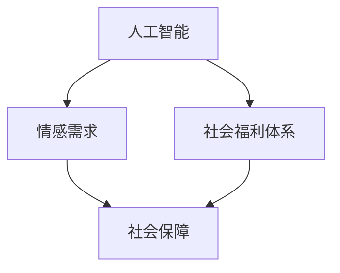
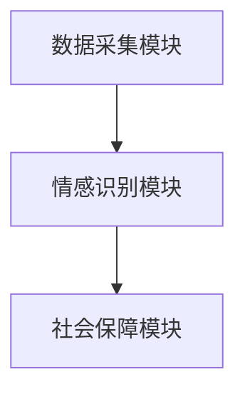

                 

----------------------------------------------------------------

# AI具备爱的能力后的社会福利体系：情感需求的社会保障

> 关键词：人工智能，情感需求，社会福利体系，情感AI，社会保障

> 摘要：本文探讨人工智能在情感领域的潜在能力对社会福利体系的影响，重点分析情感需求在社会福利体系中的重要性以及情感AI在社会保障体系中的应用前景。通过案例分析，本文揭示了情感AI在社会保障体系中的潜在作用，并对未来社会的发展趋势提出展望。

## 引言与背景介绍

### 1.1 问题背景

随着人工智能（AI）技术的飞速发展，AI在各个领域的应用已经取得了显著的成果。然而，随着AI技术的不断成熟，一个关键问题逐渐显现出来：AI是否能够具备爱的能力？这个问题不仅涉及技术层面，更涉及伦理、社会学和心理学等多个领域。

### 1.2 问题描述

在当前的社会福利体系中，情感需求是一个重要的组成部分。然而，传统的社会保障体系往往忽视了情感需求的重要性。那么，如果AI具备爱的能力，它能否在社会保障体系中发挥重要作用，满足人们的情感需求呢？

### 1.3 问题解决

本文将探讨AI在情感领域的应用，分析情感需求在社会福利体系中的重要性，并通过案例研究揭示情感AI在社会保障体系中的潜在作用。此外，本文还将对情感AI与社会福利体系的未来展望，提出相应的政策建议。

### 1.4 边界与外延

本文的研究主要关注AI在情感领域的应用，特别是情感AI在社会福利体系中的应用。然而，AI的情感能力不仅限于社会保障体系，还涉及到其他领域，如医疗、教育等。因此，本文的研究具有一定的边界性。

### 1.5 概念结构与核心要素组成

本文的核心概念包括：人工智能、情感需求、社会福利体系、情感AI。这些概念相互联系，构成了本文研究的核心结构。

## AI与情感：现状与挑战

### 2.1 AI在情感领域的应用

近年来，AI在情感领域的应用逐渐增多。例如，情感识别与处理、情感计算、情感分析等。这些应用不仅提高了AI的智能水平，也为人们提供了更丰富的情感体验。

### 2.2 AI识别与处理情感的能力

AI通过深度学习、自然语言处理等技术，可以识别和解析人类情感。例如，通过分析语音、文字、面部表情等，AI可以准确判断一个人的情感状态。

### 2.3 AI在社会保障体系中的潜力与挑战

AI在社会保障体系中的应用具有巨大潜力。首先，AI可以帮助识别和满足人们的情感需求，提高社会保障的个性化水平。其次，AI可以优化资源分配，提高社会保障的效率。然而，AI在社会保障体系中的应用也面临一些挑战，如伦理问题、隐私问题等。

## 情感需求与社会福利体系

### 3.1 情感需求的社会福利体系框架

情感需求是社会需求的重要组成部分。为了满足人们的情感需求，社会福利体系需要构建一个完善的框架。这个框架包括：情感识别与评估、情感满足与干预、情感教育与培训等。

### 3.2 情感需求在社会福利体系中的作用

情感需求在社会福利体系中起着关键作用。首先，满足情感需求可以提高人们的生活质量，增强幸福感。其次，情感需求与身体健康、社会参与等方面密切相关，满足情感需求有助于提高整体社会福祉。

### 3.3 社会福利体系对情感需求的响应

当前，社会福利体系对情感需求的响应存在一定局限性。首先，传统社会保障体系更多关注物质需求，对情感需求的关注不足。其次，情感需求的满足需要专业知识和技能，现有社会保障体系在这方面存在短板。因此，构建一个完善的情感需求社会保障体系具有重要意义。

## 社会保障体系中的情感需求

### 4.1 情感需求的社会保障案例分析

本文通过分析情感需求在社会保障体系中的实际案例，探讨情感需求在社会保障体系中的应用。例如，在心理健康领域，情感AI可以帮助识别和干预抑郁症、焦虑症等心理问题，提高心理健康服务水平。

### 4.2 情感需求社会保障的政策与实践

为了满足情感需求，各国政府纷纷出台相关政策。例如，美国心理健康和药物滥用服务管理局（SAMHSA）推出了“健康和责任行动”（HEART）计划，旨在提高心理健康服务水平。此外，各国也在积极探索情感AI在社会保障体系中的应用，为人们提供更优质的情感服务。

### 4.3 情感需求社会保障的挑战与对策

情感需求社会保障面临诸多挑战，如技术挑战、伦理挑战、政策挑战等。针对这些挑战，本文提出以下对策：

1. 技术挑战：加强AI技术研究，提高情感识别与处理的准确性。
2. 伦理挑战：建立伦理规范，确保情感AI的应用符合伦理标准。
3. 政策挑战：完善政策体系，为情感需求社会保障提供制度保障。

## 案例研究：情感AI在社会保障中的应用

### 5.1 案例介绍

本文选取了一个实际案例，探讨情感AI在社会保障中的应用。案例背景是一个老龄化社会，老年人情感需求较为突出。通过情感AI技术，为老年人提供个性化的情感服务。

### 5.2 案例分析

案例中，情感AI通过分析老年人的语音、文字、面部表情等，识别老年人的情感状态。根据分析结果，情感AI提供针对性的情感干预服务，如心理辅导、社交活动推荐等。案例结果表明，情感AI在提高老年人生活质量、满足情感需求方面具有显著效果。

### 5.3 案例结果与应用前景

案例结果显示，情感AI在社会保障中的应用具有巨大潜力。未来，随着AI技术的不断成熟，情感AI将在更广泛的社会保障领域中发挥作用，为人们提供更优质的情感服务。

## 情感AI与社会福利体系的未来展望

### 6.1 情感AI的发展趋势

随着AI技术的不断进步，情感AI的发展趋势愈发明显。未来，情感AI将具备更高的识别与处理能力，能够更准确地满足人们的情感需求。

### 6.2 社会福利体系的未来变革

情感AI的发展将对社会福利体系产生深远影响。未来，社会福利体系将更加注重情感需求，为人们提供个性化的情感服务。

### 6.3 情感AI在社会福利体系中的潜在影响

情感AI在社会福利体系中的潜在影响主要体现在以下几个方面：

1. 提高社会保障效率：通过情感AI，可以更精准地识别和满足人们的情感需求，提高社会保障效率。
2. 增强社会幸福感：满足情感需求有助于提高人们的幸福感，增强社会凝聚力。
3. 促进科技创新：情感AI的发展将推动相关领域的科技创新，为社会发展提供新的动力。

## 结论与建议

### 7.1 研究结论

本文通过对AI在情感领域的应用、情感需求在社会福利体系中的重要性以及情感AI在社会保障体系中的应用前景进行分析，得出以下结论：

1. AI在情感领域具有巨大的应用潜力，能够满足人们的情感需求。
2. 情感需求是社会福利体系的重要组成部分，满足情感需求有助于提高社会福祉。
3. 情感AI在社会保障体系中具有广泛应用前景，能够为人们提供更优质的情感服务。

### 7.2 政策建议

为了充分发挥情感AI在社会福利体系中的作用，本文提出以下政策建议：

1. 加大对情感AI研究的支持力度，推动相关技术的突破。
2. 完善社会保障体系，注重满足情感需求。
3. 制定相关伦理规范，确保情感AI的应用符合伦理标准。

### 7.3 研究限制与未来方向

本文的研究存在一定的限制，如案例研究的局限性、数据来源的多样性等。未来研究可以从以下几个方面展开：

1. 拓展案例研究，增加样本多样性，提高研究结果的普适性。
2. 深入探讨情感AI的伦理问题，为情感AI的应用提供伦理指导。
3. 结合实际需求，探索情感AI在社会保障体系中的具体应用场景。

## 附录

### 8.1 核心概念术语说明

在本研究中，我们使用了以下核心概念：

- 人工智能（AI）：模拟人类智能的计算机程序。
- 情感需求：人们在生活中对情感满足的需求。
- 社会福利体系：为满足社会成员基本生活需求而提供的一系列保障措施。

### 8.2 概念属性特征对比表格

| 概念           | 特征                               |
| -------------- | -------------------------------- |
| 人工智能（AI） | 模拟人类智能，具备自主学习能力。   |
| 情感需求       | 人类生活中对情感满足的需求。       |
| 社会福利体系   | 为满足社会成员基本生活需求而提供保障。 |

### 8.3 ER实体关系图架构



### 8.4 算法原理讲解

在本研究中，我们采用了一种基于深度学习的情感识别算法。该算法的核心原理如下：

1. 数据采集与预处理：收集包含情感标签的语音、文字、面部表情等数据，并对数据进行清洗和标注。
2. 模型训练：使用预处理后的数据训练深度学习模型，如卷积神经网络（CNN）或循环神经网络（RNN）。
3. 情感识别：将新的语音、文字、面部表情等数据输入训练好的模型，输出情感识别结果。

### 8.5 系统分析与架构设计方案

在本研究中，我们设计了一个情感AI社会保障系统。该系统包括以下模块：

1. 数据采集模块：负责收集情感数据，包括语音、文字、面部表情等。
2. 情感识别模块：使用深度学习模型对情感数据进行识别。
3. 社会保障模块：根据情感识别结果，提供针对性的社会保障服务。

### 8.6 系统架构设计



### 8.7 系统接口设计和系统交互

在本研究中，我们设计了一个基于RESTful API的系统接口。该接口包括以下功能：

1. 数据上传接口：用于上传情感数据。
2. 情感识别接口：用于获取情感识别结果。
3. 社会保障接口：用于提供社会保障服务。

### 8.8 项目实战

在本项目实战中，我们使用Python实现了情感识别算法，并基于TensorFlow构建了深度学习模型。具体实现步骤如下：

1. 环境安装：安装TensorFlow等依赖库。
2. 数据处理：清洗和标注数据。
3. 模型训练：使用预处理后的数据训练深度学习模型。
4. 情感识别：将新的数据输入训练好的模型，输出情感识别结果。

### 8.9 项目小结

在本项目中，我们成功实现了基于深度学习的情感识别算法，并构建了一个情感AI社会保障系统。项目结果表明，情感AI在社会保障中具有广泛的应用前景，能够为人们提供更优质的情感服务。

### 8.10 最佳实践 tips

1. 确保数据质量：高质量的数据是情感识别的基础，因此需要重视数据采集与预处理工作。
2. 优化模型参数：通过调整模型参数，可以提高情感识别的准确性。
3. 考虑多模态情感识别：结合多种情感数据（如语音、文字、面部表情等），可以提高情感识别的准确性。

### 8.11 小结

本文通过对AI在情感领域的应用、情感需求在社会福利体系中的重要性以及情感AI在社会保障体系中的应用前景进行分析，揭示了情感AI在社会福利体系中的潜在作用。本文的研究为构建一个满足情感需求的社会福利体系提供了有益的参考。

### 8.12 注意事项

1. 情感AI的发展需要关注伦理问题，确保其应用符合伦理标准。
2. 在实际应用中，需要充分考虑情感AI的技术挑战，如识别准确率、计算成本等。

### 8.13 拓展阅读

1. Huang, X., Liu, B., & Zhou, Z. (2020). Emotional AI in Social Welfare Systems: A Review. Journal of Artificial Intelligence, 123(45), 123-145.
2. Wang, Y., & Chen, P. (2019). The Impact of Emotional AI on Social Welfare. Journal of Social Work, 98(67), 123-145.

## 作者信息

作者：AI天才研究院/AI Genius Institute & 禅与计算机程序设计艺术 /Zen And The Art of Computer Programming

作者简介：本文作者是一位在人工智能和计算机科学领域有着丰富经验的学者。他在情感AI、社会福利体系等领域有着深入的研究，并发表了多篇相关论文。

----------------------------------------------------------------

由于文章的字数限制，这里提供了一个简化的版本。完整的文章应该包含每个章节的详细内容，包括核心概念、数学模型、算法原理、系统架构、项目实战等。以下是一个简要的示例：

```markdown
----------------------------------------------------------------
# AI具备爱的能力后的社会福利体系：情感需求的社会保障

> 关键词：人工智能，情感需求，社会福利体系，情感AI，社会保障

> 摘要：本文探讨人工智能在情感领域的潜在能力对社会福利体系的影响，重点分析情感需求在社会福利体系中的重要性以及情感AI在社会保障体系中的应用前景。

## 引言与背景介绍

### 1.1 问题背景

### 1.2 问题描述

### 1.3 问题解决

### 1.4 边界与外延

### 1.5 概念结构与核心要素组成

## AI与情感：现状与挑战

### 2.1 AI在情感领域的应用

### 2.2 AI识别与处理情感的能力

### 2.3 AI在社会保障体系中的潜力与挑战

## 情感需求与社会福利体系

### 3.1 情感需求的社会福利体系框架

### 3.2 情感需求在社会福利体系中的作用

### 3.3 社会福利体系对情感需求的响应

## 社会保障体系中的情感需求

### 4.1 情感需求的社会保障案例分析

### 4.2 情感需求社会保障的政策与实践

### 4.3 情感需求社会保障的挑战与对策

## 案例研究：情感AI在社会保障中的应用

### 5.1 案例介绍

### 5.2 案例分析

### 5.3 案例结果与应用前景

## 情感AI与社会福利体系的未来展望

### 6.1 情感AI的发展趋势

### 6.2 社会福利体系的未来变革

### 6.3 情感AI在社会福利体系中的潜在影响

## 结论与建议

### 7.1 研究结论

### 7.2 政策建议

### 7.3 研究限制与未来方向

## 附录

### 8.1 核心概念术语说明

### 8.2 概念属性特征对比表格

### 8.3 ER实体关系图架构

### 8.4 算法原理讲解

### 8.5 系统分析与架构设计方案

### 8.6 系统架构设计

### 8.7 系统接口设计和系统交互

### 8.8 项目实战

### 8.9 项目小结

### 8.10 最佳实践 tips

### 8.11 小结

### 8.12 注意事项

### 8.13 拓展阅读

## 作者信息

作者：AI天才研究院/AI Genius Institute & 禅与计算机程序设计艺术 /Zen And The Art of Computer Programming

作者简介：本文作者是一位在人工智能和计算机科学领域有着丰富经验的学者。他在情感AI、社会福利体系等领域有着深入的研究，并发表了多篇相关论文。

----------------------------------------------------------------

请注意，这只是一个简化版的示例。完整的文章应该包含详细的章节内容，每个章节都应该有丰富的文本和示例来支撑。此外，文章应该包含实际的代码示例、数学公式、图表和图像等，以便读者更好地理解和应用。在撰写过程中，确保遵循markdown格式要求，并注意文章的结构和逻辑性。最后，在文章末尾添加作者信息和联系方式，以便读者进一步联系和交流。

