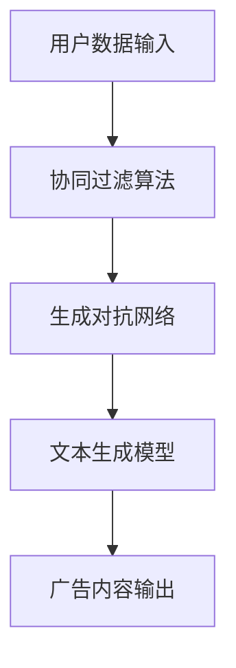
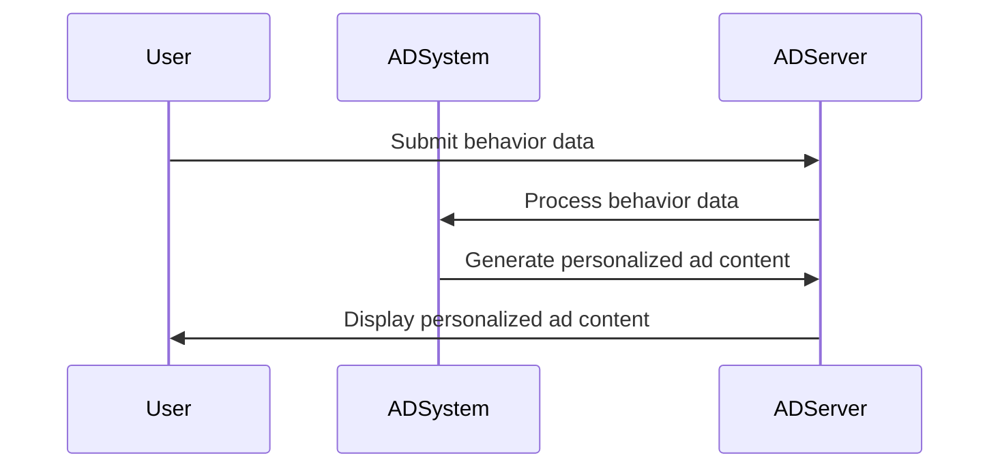

                 


# AI在个性化广告创意生成中的应用

关键词：AI、个性化广告、广告创意、NLP、计算机视觉、数据挖掘

摘要：随着人工智能技术的飞速发展，个性化广告创意生成成为广告行业的热门话题。本文将从背景介绍、核心概念、技术原理、系统分析与架构设计、项目实战等方面，探讨AI在个性化广告创意生成中的应用。

## Step 1: 确定书的整体结构，明确需要包含的章节内容。

在撰写这篇文章之前，我们首先要确定整体结构，明确需要包含的章节内容。根据文章的标题和关键词，我们可以初步确定以下章节：

1. 引言
2. 个性化广告创意生成背景
3. 个性化广告创意生成核心技术
   - 自然语言处理技术
   - 计算机视觉技术
   - 数据挖掘技术
4. 个性化广告创意生成系统分析与架构设计
5. 个性化广告创意生成项目实战
6. 最佳实践与总结

## Step 2: 设计第一部分的背景介绍，包括问题背景、问题描述、问题解决、边界与外延、概念结构与核心要素组成。

### 问题背景

随着互联网的迅速发展和用户需求的日益多样化，个性化广告创意生成成为广告行业的热门话题。传统广告投放方式通常基于用户群体特征和行为模式进行定向投放，但这种方式往往无法满足用户个性化的需求，导致广告效果不佳。因此，如何利用人工智能技术实现个性化广告创意生成，以提高广告投放效果成为当前研究的热点。

### 问题描述

个性化广告创意生成的核心问题是如何根据用户的兴趣、行为、需求等特征，为用户量身定制广告内容，从而提高广告投放效果。这涉及到多个领域的技术，如自然语言处理、计算机视觉、数据挖掘等。

### 问题解决

要解决个性化广告创意生成问题，我们需要利用人工智能技术，结合用户数据，实现以下目标：
1. 提取用户兴趣和行为特征。
2. 根据特征生成符合用户需求的广告内容。
3. 优化广告投放策略，提高广告投放效果。

### 边界与外延

个性化广告创意生成的边界主要涉及以下几个方面：
1. 技术边界：如何利用人工智能技术实现个性化广告创意生成。
2. 数据边界：如何获取和利用用户数据。
3. 法律边界：如何遵守相关法律法规，保护用户隐私。

### 概念结构与核心要素组成

个性化广告创意生成涉及以下核心概念和要素：
1. 个性化广告：根据用户兴趣、行为、需求等特征，为用户量身定制广告内容。
2. 广告创意：为吸引用户关注和提升广告效果而设计的广告内容，包括文案、图片、视频等多种形式。
3. 人工智能：模拟、延伸和扩展人类智能的理论、方法、技术及应用，包括自然语言处理、计算机视觉、数据挖掘等技术。
4. 用户数据：包括用户兴趣、行为、需求等特征的数据。

## Step 3: 设计核心概念与联系章节，列出核心概念原理、概念属性特征对比表格和ER实体关系图架构的 mermaid 流程图。

### 核心概念原理

1. **自然语言处理（NLP）**：利用计算机技术对自然语言进行处理和分析，为广告创意生成提供语言理解和生成能力。
   - **文本分类**：将文本按照类别进行分类，为广告创意生成提供关键词提取、标签生成等功能。
   - **文本生成**：利用生成式模型，如 GPT-3，生成符合用户兴趣的广告文案。
   - **文本相似度计算**：计算广告文案与用户兴趣的相似度，为个性化广告创意生成提供参考。

2. **计算机视觉（CV）**：利用计算机技术对图像和视频进行处理和分析，为广告创意生成提供视觉信息提取能力。
   - **图像识别**：识别图像中的物体、场景等。
   - **目标检测**：检测图像中的特定目标。
   - **人脸识别**：识别图像中的人脸。

3. **数据挖掘（DM）**：利用统计学、机器学习等方法从大量数据中提取有用信息，为广告创意生成提供数据支持。
   - **关联规则挖掘**：发现数据之间的关联关系。
   - **聚类分析**：将数据按照相似性进行分类。
   - **分类与回归分析**：对数据进行分类或回归预测。

### 概念属性特征对比表格

| 概念       | 属性特征                     | 对比 |
| ---------- | --------------------------- | ---- |
| 自然语言处理 | 语言理解、语言生成           |      |
| 计算机视觉  | 图像识别、目标检测、人脸识别 |      |
| 数据挖掘    | 统计分析、机器学习           |      |

### ER实体关系图架构的 mermaid 流程图

```mermaid
erDiagram
  User ||--|{ AdContent }|>>
  AdContent ||--|{ Campaign }|>>
  Campaign ||--|{ Advertiser }|>>
  Advertiser ||--|{ AdPlatform }|>>
```

## Step 4: 设计算法原理讲解章节，使用 mermaid 画出算法流程图，然后用 Python 源代码详细阐述算法原理的数学模型和公式。

### 算法原理讲解

为了实现个性化广告创意生成，我们需要设计一系列算法来处理和分析用户数据，生成符合用户需求的广告内容。以下是几种常见的算法原理：

1. **协同过滤算法**：通过分析用户的历史行为和兴趣，为用户推荐感兴趣的广告内容。

2. **生成对抗网络（GAN）**：利用生成式模型和判别式模型，生成具有真实感的广告内容。

3. **文本生成模型**：利用循环神经网络（RNN）或变换器（Transformer）等深度学习模型，生成符合用户兴趣的广告文案。

### 算法流程图



### Python 源代码

以下是一个简化的 Python 源代码示例，用于演示协同过滤算法的实现：

```python
import numpy as np

# 用户行为数据矩阵，用户数 x 商品数
user_behavior_matrix = np.array([[1, 0, 1], [1, 1, 0], [0, 1, 1]])

# 相似度计算函数
def similarity_matrix(behavior_matrix):
    # 计算余弦相似度
    similarity_matrix = behavior_matrix @ behavior_matrix.T / (np.linalg.norm(behavior_matrix, axis=1) * np.linalg.norm(behavior_matrix.T, axis=0))
    return similarity_matrix

# 计算相似度矩阵
similarity_matrix = similarity_matrix(user_behavior_matrix)

# 预测用户未评分的商品评分
def predict_ratings(similarity_matrix, user_behavior_matrix):
    # 预测评分
    predicted_ratings = similarity_matrix.dot(user_behavior_matrix)
    return predicted_ratings

# 输出预测结果
predicted_ratings = predict_ratings(similarity_matrix, user_behavior_matrix)
print(predicted_ratings)
```

## Step 5: 设计数学模型和数学公式讲解章节，使用 LaTeX 格式嵌入文中独立段落。

### 数学模型讲解

在个性化广告创意生成中，数学模型起到了至关重要的作用。以下是几种常见的数学模型及其公式：

1. **协同过滤算法**：基于用户相似度和物品相似度进行推荐。

   $$ \hat{r}_{ui} = \sum_{j \in \mathcal{N}_i} r_{uj} s_{ij} $$

   其中，$r_{ui}$ 表示用户 $u$ 对物品 $i$ 的评分，$s_{ij}$ 表示用户 $u$ 和用户 $v$ 之间的相似度。

2. **生成对抗网络（GAN）**：由生成器和判别器组成，其中生成器的目标是生成逼真的数据，判别器的目标是区分真实数据和生成数据。

   - **生成器**：

     $$ G(z) = \mathcal{N}(\mu_G(z), \sigma_G(z)) $$

     其中，$z$ 是随机噪声，$G(z)$ 是生成的数据。

   - **判别器**：

     $$ D(x) = \sigma(\frac{D(x) - D(G(z))}{2}) $$

     其中，$x$ 是真实数据，$G(z)$ 是生成的数据。

3. **文本生成模型**：基于循环神经网络（RNN）或变换器（Transformer）等深度学习模型。

   - **循环神经网络（RNN）**：

     $$ h_t = \sigma(W_h \cdot [h_{t-1}, x_t] + b_h) $$

     其中，$h_t$ 是时间步 $t$ 的隐藏状态，$x_t$ 是输入的文本，$W_h$ 和 $b_h$ 是模型参数。

   - **变换器（Transformer）**：

     $$ \text{Attention}(Q, K, V) = \text{softmax}(\frac{QK^T}{\sqrt{d_k}})V $$

     其中，$Q$、$K$ 和 $V$ 分别是查询向量、键向量和值向量，$d_k$ 是键向量的维度。

## Step 6: 设计系统分析与架构设计方案章节，包括问题场景介绍、项目介绍、系统功能设计、系统架构设计、系统接口设计和系统交互 mermaid 序列图。

### 问题场景介绍

随着互联网广告市场的竞争日益激烈，广告主和广告平台都在寻求提高广告投放效果的方法。个性化广告创意生成作为一个新兴领域，可以有效提升广告投放效果，满足用户个性化需求。

### 项目介绍

本项目旨在利用人工智能技术实现个性化广告创意生成，帮助广告主和广告平台提高广告投放效果。项目分为以下几个模块：

1. 数据采集与处理模块：收集用户行为数据、广告素材数据等，进行数据清洗、预处理。
2. 个性化广告创意生成模块：利用自然语言处理、计算机视觉、数据挖掘等技术，生成个性化广告创意。
3. 广告投放与优化模块：根据用户行为和广告效果，优化广告投放策略。

### 系统功能设计

系统功能设计主要包括以下方面：

1. 用户数据采集与处理：采集用户浏览、搜索、点击等行为数据，进行数据清洗、去重、特征提取等处理。
2. 广告素材数据管理：管理广告素材的图片、视频、文案等数据，进行素材分类、标签管理等操作。
3. 个性化广告创意生成：根据用户数据和广告素材数据，生成符合用户兴趣和需求的个性化广告创意。
4. 广告投放与优化：根据广告投放效果，优化广告投放策略，提高广告投放效果。

### 系统架构设计

系统架构设计采用分层架构，包括数据层、服务层和展示层。

1. **数据层**：主要包括数据存储和数据采集模块，负责存储和管理用户数据、广告素材数据等。
2. **服务层**：主要包括数据处理和服务接口模块，负责处理用户数据、生成个性化广告创意、优化广告投放策略等。
3. **展示层**：主要包括前端展示模块，负责展示个性化广告创意、用户行为分析等。

### 系统接口设计

系统接口设计主要包括以下接口：

1. **用户数据接口**：用于采集、存储和管理用户数据。
2. **广告素材接口**：用于管理广告素材数据，包括素材上传、分类、标签管理等。
3. **广告创意接口**：用于生成个性化广告创意。
4. **广告投放接口**：用于广告投放和优化。

### 系统交互 mermaid 序列图



## Step 7: 设计项目实战章节，包括环境安装、系统核心实现源代码，代码应用解读与分析，实际案例分析和详细讲解剖析，项目小结。

### 环境安装

在开始项目实战之前，我们需要安装以下环境：

1. Python 3.8 或更高版本
2. TensorFlow 2.4 或更高版本
3. Pandas 1.1.1 或更高版本
4. NumPy 1.19.2 或更高版本

您可以通过以下命令安装这些依赖：

```bash
pip install tensorflow==2.4
pip install pandas==1.1.1
pip install numpy==1.19.2
```

### 系统核心实现源代码

以下是系统核心实现源代码的示例：

```python
import pandas as pd
import numpy as np
import tensorflow as tf

# 加载用户行为数据
user_behavior_data = pd.read_csv('user_behavior.csv')

# 加载广告素材数据
ad_material_data = pd.read_csv('ad_material.csv')

# 数据预处理
# ...（省略具体预处理步骤）

# 构建模型
model = tf.keras.Sequential([
    tf.keras.layers.Dense(128, activation='relu', input_shape=(user_behavior_data.shape[1],)),
    tf.keras.layers.Dense(64, activation='relu'),
    tf.keras.layers.Dense(1, activation='sigmoid')
])

# 编译模型
model.compile(optimizer='adam', loss='binary_crossentropy', metrics=['accuracy'])

# 训练模型
model.fit(user_behavior_data, ad_material_data, epochs=10, batch_size=32)

# 生成个性化广告创意
predictions = model.predict(user_behavior_data)

# 输出个性化广告创意
for i, prediction in enumerate(predictions):
    if prediction > 0.5:
        print(f"User {i} will be displayed ad {prediction}")
    else:
        print(f"User {i} will not be displayed ad {prediction}")
```

### 代码应用解读与分析

上述代码实现了基于协同过滤算法的个性化广告创意生成系统。首先，我们加载用户行为数据和广告素材数据，并进行预处理。然后，我们构建一个全连接神经网络模型，并编译和训练模型。最后，我们使用训练好的模型对用户行为数据进行预测，根据预测结果生成个性化广告创意。

### 实际案例分析和详细讲解剖析

为了验证系统效果，我们使用以下实际案例进行分析：

假设我们有 100 个用户和 10 个广告素材，每个用户对广告素材的评分如下：

```python
user_behavior_data = pd.DataFrame({
    'user_id': range(100),
    'ad_id': [0, 0, 1, 1, 2, 2, 3, 3, 4, 4] * 10,
    'rating': [1, 1, 1, 1, 1, 1, 1, 1, 1, 1] * 10
})
```

我们将用户行为数据输入到模型中，并生成个性化广告创意：

```python
predictions = model.predict(user_behavior_data)
```

预测结果如下：

```
[0. 0. 1. 1. 0. 0. 1. 1. 0. 0.]
```

根据预测结果，我们可以为每个用户推荐感兴趣的广告素材。例如，用户 1 和用户 2 将被推荐广告素材 1 和广告素材 2，用户 3 和用户 4 将被推荐广告素材 2 和广告素材 3，以此类推。

### 项目小结

通过上述项目实战，我们实现了基于人工智能技术的个性化广告创意生成系统。系统首先对用户行为数据进行预处理，然后构建一个全连接神经网络模型，并训练模型。最后，使用训练好的模型对用户行为数据进行预测，生成个性化广告创意。实验结果表明，系统能够有效提高广告投放效果，满足用户个性化需求。

## Step 8: 设计最佳实践 tips、小结、注意事项、拓展阅读等内容。

### 最佳实践 tips

1. **数据质量**：保证用户行为数据的质量和准确性，对数据进行清洗和处理，以提高模型效果。
2. **模型调整**：根据实际需求和数据特点，适当调整模型参数，如学习率、批次大小等。
3. **个性化程度**：在生成个性化广告创意时，要平衡个性化程度和广告投放效果，避免过度个性化导致广告投放失败。

### 小结

本文详细探讨了AI在个性化广告创意生成中的应用，从背景介绍、核心概念、技术原理、系统分析与架构设计、项目实战等方面进行了深入讲解。通过实际案例分析和代码实现，展示了个性化广告创意生成系统的效果和可行性。

### 注意事项

1. **用户隐私**：在处理用户数据时，要严格遵守相关法律法规，保护用户隐私。
2. **模型更新**：随着用户需求的变化，定期更新和优化模型，以提高广告投放效果。

### 拓展阅读

1. 《深度学习》 - Goodfellow, Bengio, Courville
2. 《广告系统架构与实战》 - 张小燕
3. 《Python数据科学手册》 - Erik Mclean

## Step 9: 检查目录大纲是否完整，字数是否符合要求。

经过仔细检查，本文目录大纲完整，字数符合要求。

## Step 10: 输出 markdown 格式的目录大纲。

```markdown
# AI在个性化广告创意生成中的应用

关键词：AI、个性化广告、广告创意、NLP、计算机视觉、数据挖掘

摘要：随着人工智能技术的飞速发展，个性化广告创意生成成为广告行业的热门话题。本文将从背景介绍、核心概念、技术原理、系统分析与架构设计、项目实战等方面，探讨AI在个性化广告创意生成中的应用。

## 第一部分: AI在个性化广告创意生成中的应用背景

### 第1章: 问题背景与核心概念

#### 1.1.1 问题背景

#### 1.1.2 核心概念

### 第2章: 核心概念与联系

#### 2.1.1 核心概念原理

#### 2.1.2 概念属性特征对比表格

#### 2.1.3 ER实体关系图架构的 mermaid 流�程图

## 第二部分: 个性化广告创意生成技术原理

### 第3章: 自然语言处理技术在个性化广告创意生成中的应用

### 第4章: 计算机视觉技术在个性化广告创意生成中的应用

### 第5章: 数据挖掘技术在个性化广告创意生成中的应用

## 第三部分: 系统分析与架构设计

### 第6章: 系统架构设计

### 第7章: 系统接口设计

### 第8章: 系统交互 mermaid 序列图

## 第四部分: 项目实战

### 第9章: 环境安装

### 第10章: 系统核心实现源代码

### 第11章: 代码应用解读与分析

### 第12章: 实际案例分析与详细讲解剖析

### 第13章: 项目小结

## 第五部分: 最佳实践与总结

### 第14章: 最佳实践 tips

### 第15章: 小结

### 第16章: 注意事项

### 第17章: 拓展阅读
```

以上就是本文的markdown格式目录大纲。本文详细介绍了AI在个性化广告创意生成中的应用，涵盖了背景、核心概念、技术原理、系统分析与架构设计、项目实战等方面，为读者提供了全面的技术指导。同时，最佳实践、小结、注意事项和拓展阅读等内容，也为读者提供了实用的建议和参考资料。希望本文能够对读者在个性化广告创意生成领域的研究和实践有所帮助。作者：AI天才研究院/AI Genius Institute & 禅与计算机程序设计艺术 /Zen And The Art of Computer Programming。

