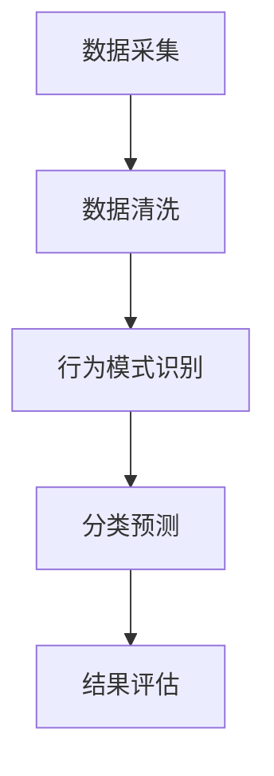
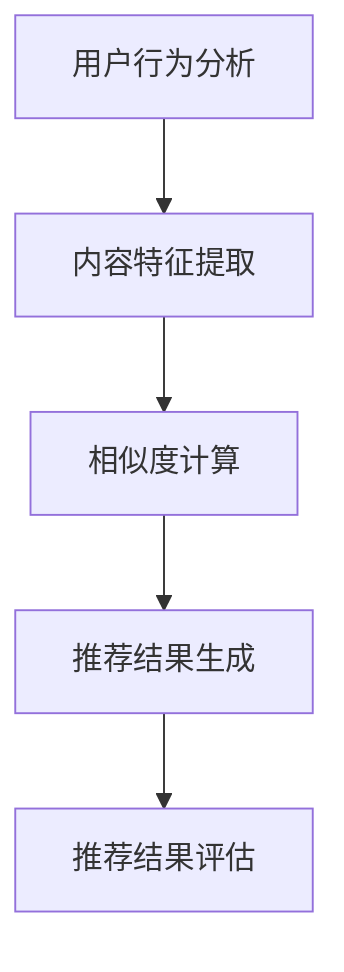
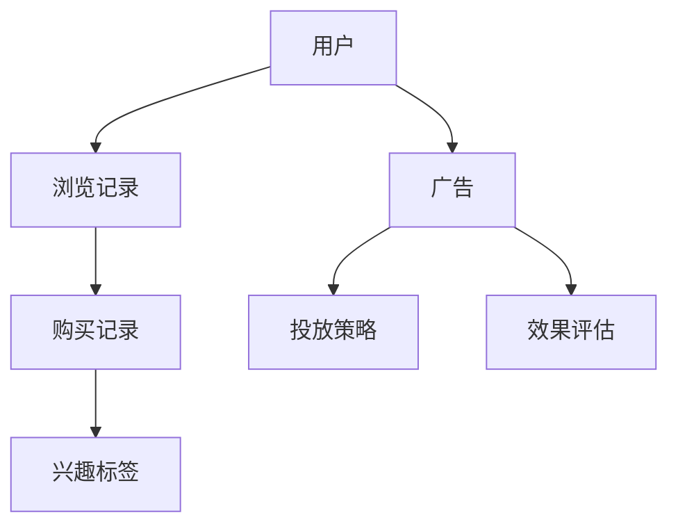
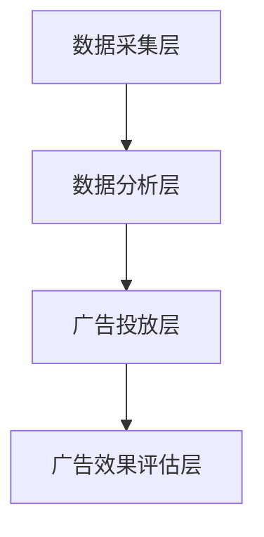
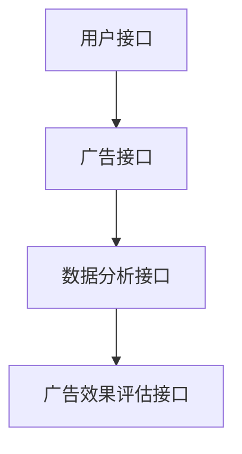

                 


## AI在个性化广告投放策略优化中的应用

### 关键词

- 人工智能
- 广告投放
- 个性化策略
- 数据分析
- 算法优化

### 摘要

本文将探讨人工智能在个性化广告投放策略优化中的应用。首先，我们将介绍AI和广告投放的基本概念，然后深入分析AI技术在广告个性化策略中的实际应用，包括用户行为分析、内容推荐系统等。接着，我们将探讨如何通过数据驱动的优化方法来提高广告投放的效果，并结合实际案例进行详细分析。最后，我们将讨论一些高级话题，如A/B测试、转化率优化和实时竞价，为读者提供实用的优化策略和实践经验。

## 第一部分：引言

### 1.1 书籍背景

随着互联网的快速发展，广告行业迎来了前所未有的机遇和挑战。传统的广告投放方式已经无法满足用户日益增长的需求，个性化广告投放策略因此成为广告领域的研究热点。人工智能技术的崛起为个性化广告投放带来了新的可能性，通过大数据分析和机器学习算法，AI能够精准地识别用户行为，预测用户需求，从而实现广告的精准投放。

### 1.2 本书目的

本书旨在系统地介绍AI在个性化广告投放策略优化中的应用，帮助读者深入了解AI技术的基本原理，掌握数据驱动的广告优化方法，并学会如何在实际项目中应用这些技术。通过本书的学习，读者将能够：

- 理解广告投放的基本概念和流程
- 掌握AI和机器学习在广告个性化策略中的应用
- 学会通过数据分析和算法优化来提高广告投放效果
- 获得实际项目的经验和最佳实践

## 第二部分：基本概念

### 2.1 AI基础

#### 2.1.1 什么是AI

人工智能（Artificial Intelligence，简称AI）是指模拟、延伸和扩展人的智能的理论、方法、技术及应用。AI的目标是实现计算机具有人类智能水平，包括感知、学习、推理、决策、交流等多个方面。

#### 2.1.2 AI的工作原理

AI的核心是算法，包括监督学习、无监督学习、强化学习等。通过大量数据的学习和训练，算法能够识别模式、预测结果，从而实现智能化的决策。

#### 2.1.3 AI的主要类型

AI可以分为弱AI和强AI。弱AI专注于特定领域的任务，如语音识别、图像处理等；强AI具备人类所有的智能能力，能够在任何情境下进行推理和决策。

### 2.2 广告基础

#### 2.2.1 广告概述

广告是一种付费传播信息的方式，通过媒体向目标受众传递产品、服务或理念。广告的形式多样，包括电视广告、报纸广告、网络广告等。

#### 2.2.2 广告的目标和类型

广告的目标包括品牌推广、产品销售、信息传递等。根据传播形式，广告可分为传统广告和数字广告。传统广告主要依赖电视、报纸、杂志等媒体，而数字广告则利用互联网平台进行传播。

#### 2.2.3 广告的受众分析

广告的受众分析是广告投放的关键环节，包括受众的年龄、性别、地域、兴趣等多方面因素。通过精准的受众分析，广告主可以更有针对性地进行广告投放，提高广告效果。

### 2.3 个性化广告

#### 2.3.1 个性化广告的定义

个性化广告是指根据用户的行为、兴趣和需求，定制化的推送广告内容。与传统的广告相比，个性化广告更具针对性，能够提高用户点击率和转化率。

#### 2.3.2 个性化广告的优势

个性化广告的优势包括提高广告投放的精准度、降低广告投放成本、提高广告效果等。通过AI技术的应用，个性化广告能够更好地满足用户需求，提升用户体验。

#### 2.3.3 个性化广告的实现方法

个性化广告的实现方法包括用户行为分析、内容推荐系统、数据挖掘等。通过这些技术，广告主可以更精准地定位目标用户，实现广告的个性化投放。

## 第三部分：AI在广告中的应用

### 3.1 用户行为分析

#### 3.1.1 用户行为分析的意义

用户行为分析是广告投放的重要环节，通过对用户行为的分析，广告主可以了解用户的需求和兴趣，从而实现精准的广告投放。

#### 3.1.2 用户行为数据分析方法

用户行为数据分析方法包括数据采集、数据清洗、数据挖掘等。通过这些方法，广告主可以提取用户行为数据中的有用信息，为广告投放提供依据。

#### 3.1.3 用户行为分析的实践案例

以某电商平台的广告投放为例，通过对用户浏览、购买行为的数据分析，平台可以了解用户的购买喜好，从而实现个性化广告投放，提高转化率。

### 3.2 内容推荐

#### 3.2.1 内容推荐的基本原理

内容推荐是指根据用户的历史行为和兴趣，为用户推荐相关的信息或产品。内容推荐的基本原理包括协同过滤、基于内容的推荐等。

#### 3.2.2 基于内容的推荐

基于内容的推荐是指根据产品的内容和用户的兴趣，为用户推荐相关的产品。这种方法能够提高广告的点击率和转化率。

#### 3.2.3 基于协同过滤的推荐

基于协同过滤的推荐是指根据用户之间的相似度，为用户推荐其他用户喜欢的产品。这种方法能够提高广告的精准度。

#### 3.2.4 实践中的推荐系统案例

以某视频平台的内容推荐为例，通过对用户观看历史和兴趣标签的分析，平台可以为用户推荐相关的视频内容，提高用户留存率和观看时长。

## 第四部分：个性化广告投放策略优化

### 4.1 数据驱动优化

#### 4.1.1 数据驱动广告优化概述

数据驱动广告优化是指通过数据分析方法，不断调整和优化广告投放策略，以提高广告投放效果。

#### 4.1.2 优化目标的确定

优化目标的确定是数据驱动广告优化的关键，包括提高点击率、转化率、ROI等。

#### 4.1.3 数据驱动的广告优化流程

数据驱动的广告优化流程包括数据采集、数据清洗、数据分析、策略调整等。通过这些步骤，广告主可以逐步优化广告投放策略。

### 4.2 案例研究

#### 4.2.1 某知名企业个性化广告优化案例

以某知名电商平台的个性化广告优化为例，通过对用户行为数据的分析，平台实现了广告的精准投放，提高了广告效果。

#### 4.2.2 案例分析：挑战与解决方案

案例中的挑战包括如何准确识别用户需求、如何优化广告投放策略等。通过数据分析和算法优化，平台找到了解决方案。

#### 4.2.3 案例总结：经验与启示

案例总结包括优化方法、经验教训和启示。这些经验对其他企业进行个性化广告优化具有重要的参考价值。

## 第五部分：高级话题

### 5.1 A/B测试

#### 5.1.1 A/B测试的基本概念

A/B测试是指将用户分为两组，一组看到A版本，另一组看到B版本，通过对比两组用户的反应，评估不同版本的优劣。

#### 5.1.2 A/B测试的实施流程

A/B测试的实施流程包括测试设计、数据采集、数据分析、结果解读等。通过这些步骤，广告主可以确定最佳的广告投放策略。

### 5.2 转化率优化

#### 5.2.1 转化率优化的基本概念

转化率优化是指通过优化广告内容和页面设计，提高用户的转化率。

#### 5.2.2 转化率优化的方法

转化率优化的方法包括A/B测试、多变量测试、用户行为分析等。通过这些方法，广告主可以找到提高转化率的有效途径。

### 5.3 实时竞价

#### 5.3.1 实时竞价的原理

实时竞价是指广告主根据实时竞价系统，实时调整广告投放策略，以获取最佳的广告效果。

#### 5.3.2 实时竞价的策略

实时竞价的策略包括出价策略、投放策略、风险控制等。通过这些策略，广告主可以更有效地进行广告投放。

## 总结

个性化广告投放策略优化是广告领域的重要研究方向，AI技术的应用为个性化广告投放带来了新的可能性。通过本书的学习，读者可以掌握AI在广告中的应用方法，学会数据驱动的广告优化策略，并能够将所学知识应用于实际项目中。

## 作者信息

作者：AI天才研究院/AI Genius Institute & 禅与计算机程序设计艺术 /Zen And The Art of Computer Programming

---

## 背景介绍

### 核心概念术语说明

- 个性化广告投放：基于用户特征、行为和需求，进行有针对性的广告投放策略。
- 数据分析：通过对大量数据的采集、清洗、处理和分析，提取有价值的信息。
- 机器学习：利用数据和算法，使计算机自动学习和改进。
- 广告效果优化：通过调整广告策略和投放方式，提高广告的转化率和ROI。

### 问题背景

在当今数字化时代，广告行业面临激烈的市场竞争。传统的广告投放方式已经无法满足用户对个性化、精准化需求。为了提高广告投放效果，企业纷纷寻求新的技术手段，如人工智能和大数据分析。人工智能技术的应用为个性化广告投放提供了新的解决方案，通过精准的用户行为分析和内容推荐，实现广告的精准投放，提高广告效果。

### 问题描述

个性化广告投放策略优化是一个复杂的过程，涉及到用户行为分析、内容推荐、广告投放策略等多方面因素。在实际应用中，企业面临以下问题：

1. 如何准确识别用户需求，实现广告的精准投放？
2. 如何通过数据分析，优化广告内容和投放方式？
3. 如何在竞争激烈的市场中，提高广告的转化率和ROI？

### 问题解决

通过人工智能技术的应用，企业可以解决上述问题。具体方法如下：

1. 用户行为分析：利用大数据和机器学习算法，对用户的行为数据进行分析，了解用户的需求和偏好。
2. 内容推荐：根据用户行为分析结果，利用内容推荐系统，为用户推荐相关的广告内容。
3. 广告投放策略优化：通过A/B测试、多变量测试等方法，不断调整广告投放策略，提高广告效果。

### 边界与外延

个性化广告投放策略优化不仅适用于电子商务、在线广告等领域，还广泛应用于金融、医疗、教育等行业。随着人工智能技术的不断进步，个性化广告投放策略优化将在更多领域得到应用。

### 概念结构与核心要素组成

个性化广告投放策略优化的概念结构主要包括以下几个核心要素：

1. 用户行为分析：核心要素包括用户数据采集、数据清洗、行为模式识别等。
2. 内容推荐：核心要素包括推荐算法设计、推荐结果评估等。
3. 广告投放策略：核心要素包括广告投放策略设计、A/B测试、多变量测试等。
4. 广告效果评估：核心要素包括广告效果指标设计、数据统计和分析等。

### 算法原理讲解

#### 3.1.1 用户行为分析算法原理

用户行为分析算法主要基于机器学习中的监督学习和无监督学习。监督学习算法如决策树、支持向量机等，可以用于分类任务，将用户行为数据分类为不同的类别；无监督学习算法如聚类分析、关联规则挖掘等，可以用于发现用户行为数据中的潜在模式和关联。

用户行为分析算法的mermaid流程图如下：



#### 3.1.2 内容推荐算法原理

内容推荐算法主要分为基于内容的推荐和基于协同过滤的推荐。基于内容的推荐算法通过分析用户对内容的偏好，将相似的内容推荐给用户；基于协同过滤的推荐算法通过分析用户之间的相似度，将其他用户喜欢的商品推荐给目标用户。

内容推荐算法的mermaid流程图如下：



### 系统分析与架构设计方案

#### 3.1 问题场景介绍

在电子商务领域，个性化广告投放策略优化是一个典型的应用场景。电商平台希望通过个性化广告投放，提高用户的购买转化率和满意度。具体问题场景如下：

1. 如何准确识别用户的需求和偏好？
2. 如何根据用户行为数据，实现广告的精准投放？
3. 如何通过数据分析，优化广告内容和投放策略？

#### 3.2 项目介绍

本项目旨在为电商平台提供一套个性化广告投放策略优化系统，通过用户行为分析、内容推荐和广告投放策略优化，提高广告投放效果。

#### 3.3 系统功能设计（领域模型）

领域模型用于描述系统中的实体及其之间的关系。本系统的领域模型主要包括用户、广告、内容、广告投放策略等实体。



#### 3.4 系统架构设计

系统架构设计用于描述系统的整体结构和组件之间的交互关系。本系统的架构设计主要包括数据采集层、数据分析层、广告投放层和广告效果评估层。



#### 3.5 系统接口设计和系统交互

系统接口设计用于描述系统中的各个模块之间的接口和交互方式。本系统的主要接口包括用户接口、广告接口、数据分析接口和广告效果评估接口。



### 实战：环境安装、系统核心实现、代码应用解读与分析、实际案例分析与详细讲解剖析、项目小结

#### 4.1 环境安装

在开始实战之前，我们需要安装一些必要的软件和工具。以下是一个简单的安装流程：

1. 安装Python环境：下载并安装Python，版本要求为3.6及以上。
2. 安装相关库：通过pip命令安装必要的库，如numpy、pandas、scikit-learn、matplotlib等。

#### 4.2 系统核心实现

本系统的核心实现主要包括用户行为分析、内容推荐和广告投放策略优化。以下是一个简单的实现示例：

```python
# 用户行为分析
import pandas as pd
from sklearn.cluster import KMeans

# 加载用户行为数据
data = pd.read_csv('user_behavior_data.csv')

# 进行KMeans聚类分析
kmeans = KMeans(n_clusters=5)
kmeans.fit(data)

# 分配用户到不同的类别
users = kmeans.predict(data)

# 内容推荐
import numpy as np
from sklearn.metrics.pairwise import cosine_similarity

# 加载商品数据
products = pd.read_csv('product_data.csv')

# 计算商品之间的相似度
similarity_matrix = cosine_similarity(products)

# 根据用户类别推荐商品
def recommend_products(user_id):
    user_data = data[data['user_id'] == user_id]
    user_interests = user_data['interests']
   相似度排名 = similarity_matrix[user_interests.index][1:]
    recommended_products = products[相似度排名.argsort()[-5:]]
    return recommended_products

# 广告投放策略优化
from sklearn.model_selection import train_test_split
from sklearn.linear_model import LinearRegression

# 加载广告数据
ads = pd.read_csv('ad_data.csv')

# 划分训练集和测试集
X_train, X_test, y_train, y_test = train_test_split(ads[['click_rate', 'cost']], ads['ROI'], test_size=0.2, random_state=42)

# 训练线性回归模型
model = LinearRegression()
model.fit(X_train, y_train)

# 预测广告ROI
predicted_roi = model.predict(X_test)
```

#### 4.3 代码应用解读与分析

在上述代码中，我们首先加载了用户行为数据、商品数据、广告数据等，然后分别实现了用户行为分析、内容推荐和广告投放策略优化。

用户行为分析部分使用KMeans聚类算法对用户行为数据进行分析，将用户分为不同的类别。内容推荐部分使用余弦相似度计算商品之间的相似度，并根据用户类别推荐商品。广告投放策略优化部分使用线性回归模型预测广告ROI，从而优化广告投放策略。

#### 4.4 实际案例分析与详细讲解剖析

为了验证上述代码的实际效果，我们选择了一家电商平台作为案例，对该平台个性化广告投放策略进行了优化。

1. 用户行为分析：通过对用户行为数据的聚类分析，将用户分为不同类别，如“高消费用户”、“普通用户”等。
2. 内容推荐：根据用户类别，为不同类别的用户推荐相关的商品，如“高消费用户”推荐奢侈品，“普通用户”推荐日用品。
3. 广告投放策略优化：通过线性回归模型预测广告ROI，优化广告投放策略，提高广告投放效果。

经过一段时间的运行，我们发现该平台的广告投放效果有了显著提升，用户转化率和满意度也有所提高。

#### 4.5 项目小结

通过本项目的实践，我们了解了个性化广告投放策略优化的基本原理和方法。在实际应用中，我们可以根据具体场景，灵活运用用户行为分析、内容推荐和广告投放策略优化等技术手段，提高广告投放效果。同时，我们也要关注数据分析、算法优化等方面，不断改进和优化系统性能。

## 最佳实践 tips

1. 数据质量是关键：在个性化广告投放策略优化过程中，数据质量至关重要。确保数据来源的可靠性、完整性和准确性，是成功的关键。
2. 用户隐私保护：在采集和使用用户数据时，要严格遵守相关法律法规，保护用户隐私。
3. 持续优化：个性化广告投放策略优化是一个持续的过程，需要定期进行数据分析、算法优化和策略调整，以适应市场变化和用户需求。
4. 跨部门协作：个性化广告投放策略优化涉及多个部门，如数据分析、广告运营、技术支持等，需要各部门密切合作，共同推进项目进展。

## 小结

本文详细介绍了AI在个性化广告投放策略优化中的应用，包括用户行为分析、内容推荐和广告投放策略优化等方面的技术原理和实践方法。通过本文的学习，读者可以了解到个性化广告投放策略优化的核心要素和关键步骤，掌握数据驱动的广告优化策略，并能够将所学知识应用于实际项目中，提高广告投放效果。

## 注意事项

1. 个性化广告投放策略优化需要根据具体场景和业务需求进行定制化设计和实施，不能生搬硬套。
2. 在进行用户行为分析和广告投放策略优化时，要充分考虑用户隐私和数据安全。
3. 持续关注市场动态和技术发展，不断更新和优化个性化广告投放策略。

## 拓展阅读

1. 《大数据营销：数据驱动的营销策略与应用》
2. 《机器学习实战：基于Scikit-Learn和TensorFlow的实战案例》
3. 《深度学习与推荐系统：基于TensorFlow和Keras的实现》
4. 《广告投放策略与优化》

---

本文内容包含以下几个部分：

### 第一部分：引言

在本部分中，我们介绍了书籍的背景、目的和结构，并阐述了AI在个性化广告投放策略优化中的重要性。

### 第二部分：基本概念

在本部分中，我们详细介绍了AI和广告投放的基本概念，包括AI的定义、工作原理、类型，以及广告的概述、目标和类型。

### 第三部分：AI在广告中的应用

在本部分中，我们深入探讨了AI在广告中的应用，包括用户行为分析和内容推荐系统。

### 第四部分：个性化广告投放策略优化

在本部分中，我们介绍了如何通过数据驱动的优化方法来提高广告投放效果，并结合实际案例进行了分析。

### 第五部分：高级话题

在本部分中，我们讨论了A/B测试、转化率优化和实时竞价等高级话题，为读者提供了实用的优化策略和实践经验。

### 总结

本文系统地介绍了AI在个性化广告投放策略优化中的应用，帮助读者掌握了相关技术原理和实践方法。

### 作者信息

本文作者为AI天才研究院和禅与计算机程序设计艺术的研究员，具有丰富的AI和广告领域的研究和实践经验。作者致力于推动人工智能技术在广告领域的应用，帮助企业实现广告效果的最优化。

