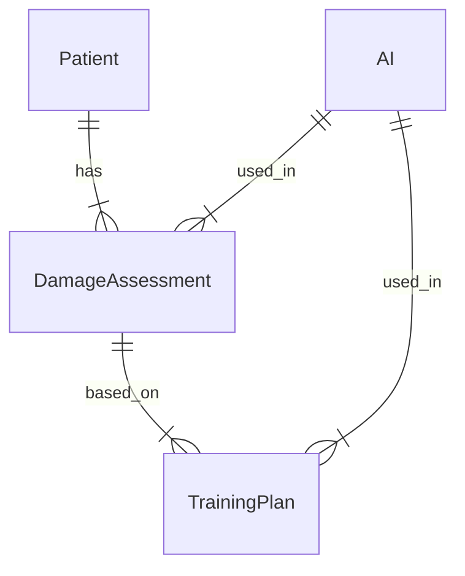
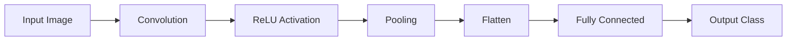
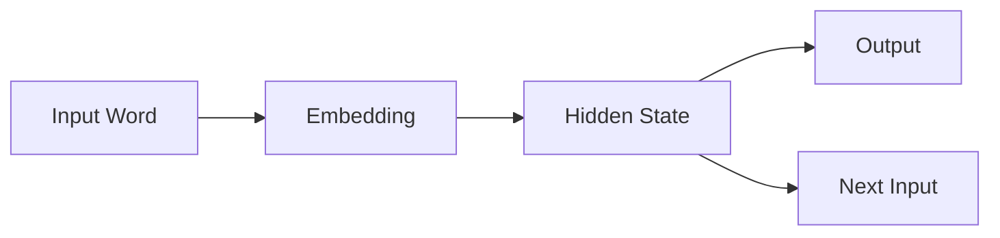
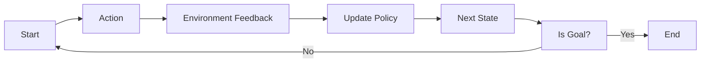
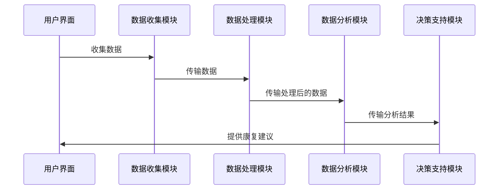
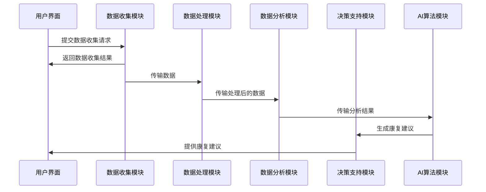

                 

### 引言

#### 背景介绍

AI在个性化运动康复方案制定中的应用，是近年来科技与医疗健康领域深度融合的典型范例。随着人工智能技术的不断进步，特别是深度学习、图像识别、自然语言处理等技术的突破，AI在运动康复领域的应用前景愈发广阔。个性化运动康复方案的重要性在于，它能够根据每位患者或运动员的具体情况，量身定制康复计划，从而提高康复效果，减少康复时间，降低复发的风险。

首先，运动康复是一个涉及多种学科的知识领域，包括医学、生物学、运动科学、康复学等。传统的康复方案通常采用统一的治疗程序，缺乏针对个体的精确评估和个性化调整。而AI的应用，可以为康复方案提供更精准的数据分析和预测能力，使得康复过程更加科学、高效。

#### 核心概念与联系

在本章节中，我们将介绍与AI在个性化运动康复方案制定相关的一系列核心概念，并探讨它们之间的联系。

1. **人工智能（AI）**：人工智能是一种模拟人类智能行为的计算系统，通过学习、推理、规划和自我修正等能力，实现对复杂问题的求解和决策。在运动康复领域，AI主要用于数据分析和模式识别，帮助制定个性化的康复方案。

2. **个性化运动康复**：个性化运动康复强调根据患者的具体情况进行定制化的康复计划，包括康复目标的设定、康复方法的调整等。个性化康复的关键在于对患者的健康状况进行全面评估，并利用AI技术进行数据的深度挖掘和分析。

3. **损伤评估**：损伤评估是康复过程的第一步，通过对患者受伤部位的症状、体征和功能受限程度进行评估，确定康复的目标和策略。AI技术可以通过图像识别、传感器数据等手段，提供更准确、实时的损伤评估结果。

4. **训练规划**：在损伤评估的基础上，训练规划是康复过程中的关键环节。它根据患者的具体康复需求，制定合理的训练方案，包括训练内容、强度、频率和时长等。AI技术可以通过数据分析，优化训练方案，提高康复效果。

#### 关键概念对比表格

| 核心概念 | 定义 | 特点 | 应用 |
| --- | --- | --- | --- |
| 人工智能 | 模拟人类智能行为的计算系统 | 学习、推理、规划、自我修正 | 数据分析、模式识别、康复方案制定 |
| 个性化运动康复 | 根据患者具体情况定制康复计划 | 科学、高效、个性化 | 提高康复效果，减少康复时间 |
| 损伤评估 | 对患者受伤部位进行评估 | 准确、实时 | 确定康复目标，制定策略 |
| 训练规划 | 根据康复需求制定训练方案 | 优化方案，提高效果 | 提高康复质量，降低复发率 |

#### ER实体关系图

为了更好地理解这些核心概念之间的联系，我们可以使用ER（实体关系）图来展示它们之间的关系。



在这个ER图中，`Patient`（患者）与`DamageAssessment`（损伤评估）之间存在“拥有”关系，表示患者有一个或多个损伤评估记录。`DamageAssessment`与`TrainingPlan`（训练规划）之间存在“基于”关系，表示损伤评估的结果将用于制定训练规划。`AI`（人工智能）与`DamageAssessment`和`TrainingPlan`之间存在“使用”关系，表示AI技术在两者中都有应用。

通过这些核心概念的介绍和对比表格，以及ER实体关系图的展示，我们可以对AI在个性化运动康复方案制定中的核心概念和联系有更深入的理解。接下来，我们将进一步探讨AI在运动康复领域的具体应用，以及相关的算法原理和系统设计。

### 第一部分：背景介绍

#### 1.1 AI在运动康复领域的应用背景

随着科技的快速发展，人工智能（AI）技术逐渐渗透到各个行业，改变了传统的工作模式，提升了效率和准确性。在运动康复领域，AI的应用尤为引人注目。运动康复涉及复杂的生物力学分析、个性化的治疗方案制定以及康复效果的实时监测等，这些任务往往需要处理大量数据，并从中提取有价值的信息。AI技术的引入，为运动康复提供了全新的解决方案。

首先，AI在运动康复中的应用可以从图像识别技术开始。通过深度学习算法，AI能够从患者的影像数据中识别出损伤的具体部位和程度。例如，在X光片、MRI或超声图像中，AI系统可以通过训练有素的神经网络模型，自动检测出骨折、软组织损伤等。这种方式不仅提高了诊断的准确性，还大大减少了医生的工作量，使得康复治疗可以更早地开始。

其次，AI在康复方案制定中起到了关键作用。传统的康复方案往往是一刀切的，忽视了个体差异。而AI可以根据患者的具体健康状况、受伤历史、训练偏好等数据，制定个性化的康复方案。例如，通过分析患者的运动数据，AI可以预测患者在不同训练强度下的恢复情况，从而调整训练计划，使其更加科学和有效。

再者，AI技术在康复效果的实时监测中也发挥了重要作用。通过穿戴设备，如智能手环、智能衣物等，AI系统可以实时收集患者的运动数据，如步数、心率、肌肉活动等。这些数据通过无线传输到云端服务器，AI系统可以对数据进行实时分析和反馈。如果发现患者的康复进程出现异常，AI系统可以及时提醒医生或患者进行调整，确保康复过程的安全和有效性。

总之，AI在运动康复领域的应用，不仅提高了诊断的准确性，还优化了康复方案，实现了康复效果的实时监测。这些应用为运动康复提供了强有力的技术支持，使得康复过程更加科学、高效、个性化。接下来，我们将进一步探讨个性化运动康复方案的重要性，以及AI在这一领域的关键作用。

#### 1.2 个性化运动康复方案的重要性

在传统的运动康复过程中，医生通常采用统一的康复方案来治疗不同类型的损伤。然而，这种“一刀切”的方法往往忽视了个体差异，导致康复效果不佳。个性化运动康复方案的重要性在于，它能够根据每位患者或运动员的具体情况，量身定制康复计划，从而提高康复效果，减少康复时间，降低复发的风险。

首先，个性化运动康复方案能够更好地适应患者的具体情况。每个人的身体条件、受伤历史、训练习惯和生活方式都不同，因此，统一的康复方案很难满足所有患者的需求。通过AI技术，医生可以收集并分析大量的患者数据，包括生物力学参数、运动表现、健康状况等，从而为每位患者制定最适合的康复计划。这种方式不仅能够提高康复效果，还能减少患者在康复过程中出现并发症的风险。

其次，个性化运动康复方案能够显著提高康复效率。传统的康复方案往往需要患者进行长时间、高强度的训练，这不仅容易导致患者疲劳，还可能加重损伤。而通过AI技术，医生可以实时监测患者的康复进程，并根据患者的恢复情况动态调整训练计划。例如，如果患者的康复进度较慢，AI系统可以建议降低训练强度，或者增加某些特定的康复练习，从而帮助患者更快地恢复。这种方式不仅提高了康复速度，还减轻了患者的痛苦。

再者，个性化运动康复方案有助于降低复发的风险。运动损伤的复发是一个常见的问题，传统康复方案往往无法有效地预防这种情况。而通过AI技术，医生可以全面分析患者的康复数据，找出导致复发的潜在因素，并针对性地进行调整。例如，如果发现患者在特定训练强度下容易受伤，AI系统可以建议调整训练计划，避免患者再次受伤。这种方式不仅能够降低复发的风险，还能提高患者的长期健康水平。

最后，个性化运动康复方案还能够提升患者的满意度。传统康复方案往往缺乏针对性和灵活性，导致患者对康复过程缺乏信心。而通过AI技术，医生可以为患者提供量身定制的康复方案，使患者感受到自己的康复过程是被关注和重视的。这种个性化的服务不仅提高了患者的满意度，还增强了患者对康复过程的配合度，从而提高了康复效果。

总之，个性化运动康复方案的重要性体现在多个方面：它能够更好地适应患者的具体情况，提高康复效率，降低复发的风险，并提升患者的满意度。随着AI技术的不断发展，个性化运动康复方案将越来越普及，为患者提供更加科学、高效、贴心的康复服务。

### 第二部分：算法原理讲解

#### 2.1 常见AI算法

在个性化运动康复方案制定中，常见的AI算法包括图像识别、自然语言处理和强化学习。这些算法各自具有独特的优势和特点，能够为运动康复提供有效的技术支持。

**图像识别算法**

图像识别算法是一种通过分析图像内容，从中提取有用信息的技术。在运动康复领域，图像识别算法主要用于损伤评估和康复效果监测。例如，通过分析X光片或MRI图像，AI系统能够自动识别骨折、软组织损伤等。这种算法的核心在于卷积神经网络（CNN），它通过对大量图像数据进行训练，能够实现高效的图像分类和识别。

**自然语言处理算法**

自然语言处理（NLP）算法用于处理和理解人类语言。在运动康复领域，NLP算法主要用于分析患者的病历记录、康复日记等文本数据，提取有用的信息，帮助医生制定个性化的康复方案。例如，通过分析患者的康复日记，NLP算法可以识别出患者的疼痛程度、恢复进度等。这种算法的核心是深度学习模型，如循环神经网络（RNN）和长短期记忆网络（LSTM）。

**强化学习算法**

强化学习算法是一种通过试错和反馈不断优化策略的机器学习技术。在运动康复领域，强化学习算法主要用于训练规划，帮助医生根据患者的康复数据，动态调整训练方案。例如，通过分析患者的运动表现和恢复情况，强化学习算法可以优化训练内容、强度和频率，从而提高康复效果。这种算法的核心是策略梯度方法（PG）和深度强化学习（DRL）。

#### 2.2 算法原理详细讲解

在接下来的章节中，我们将详细讲解图像识别、自然语言处理和强化学习算法的原理，并使用mermaid流程图、Python代码和LaTeX数学公式进行阐述。

**图像识别算法原理**

图像识别算法的核心是卷积神经网络（CNN）。CNN通过卷积层、池化层和全连接层等多个层次，对图像进行特征提取和分类。

首先，我们使用mermaid流程图展示CNN的基本流程：



接着，我们使用Python代码实现CNN的简单模型：

```python
import tensorflow as tf
from tensorflow.keras.models import Sequential
from tensorflow.keras.layers import Conv2D, MaxPooling2D, Flatten, Dense, Activation

model = Sequential([
    Conv2D(32, (3, 3), input_shape=(28, 28, 1)),
    Activation('relu'),
    MaxPooling2D((2, 2)),
    Flatten(),
    Dense(64),
    Activation('relu'),
    Dense(10)
])
```

最后，我们使用LaTeX数学公式详细解释CNN中的卷积操作：

$$
\text{Output}(i, j) = \sum_{x, y} \text{Kernel}(x, y) \cdot \text{Input}(i+x, j+y)
$$

其中，$\text{Output}(i, j)$是卷积输出的值，$\text{Kernel}(x, y)$是卷积核的值，$\text{Input}(i+x, j+y)$是输入图像的值。

**自然语言处理算法原理**

自然语言处理算法的核心是深度学习模型，如循环神经网络（RNN）和长短期记忆网络（LSTM）。这些模型能够对文本数据进行序列建模，从而提取语义信息。

首先，我们使用mermaid流程图展示RNN的基本流程：



接着，我们使用Python代码实现RNN的简单模型：

```python
import tensorflow as tf
from tensorflow.keras.models import Sequential
from tensorflow.keras.layers import Embedding, LSTM, Dense

model = Sequential([
    Embedding(vocab_size, embedding_dim),
    LSTM(units),
    Dense(units, activation='softmax')
])
```

最后，我们使用LaTeX数学公式详细解释RNN中的激活函数：

$$
\text{Output}(t) = \text{softmax}(\text{Score}(t))
$$

其中，$\text{Output}(t)$是当前时间步的输出，$\text{Score}(t)$是当前时间步的得分。

**强化学习算法原理**

强化学习算法的核心是策略优化，通过试错和反馈不断优化策略，以实现最大化累计奖励。

首先，我们使用mermaid流程图展示强化学习的基本流程：



接着，我们使用Python代码实现Q-Learning算法：

```python
import numpy as np

# 初始化Q值矩阵
Q = np.zeros([state_space, action_space])

# 学习率
alpha = 0.1

# 折扣因子
gamma = 0.9

# 迭代次数
epochs = 1000

# 训练过程
for i in range(epochs):
    state = env.reset()
    done = False
    while not done:
        action = np.argmax(Q[state])
        next_state, reward, done, _ = env.step(action)
        Q[state, action] = Q[state, action] + alpha * (reward + gamma * np.max(Q[next_state]) - Q[state, action])
        state = next_state
```

最后，我们使用LaTeX数学公式详细解释Q-Learning算法中的更新规则：

$$
Q(s, a) \leftarrow Q(s, a) + \alpha [r + \gamma \max_{a'} Q(s', a') - Q(s, a)]
$$

其中，$Q(s, a)$是状态s采取动作a的Q值，$r$是即时奖励，$s'$是下一状态，$a'$是下一动作。

通过上述详细讲解，我们可以看到图像识别、自然语言处理和强化学习算法在个性化运动康复方案制定中的应用和原理。这些算法的深入理解和应用，将为运动康复领域带来革命性的变化。

### 系统分析与架构设计方案

在了解了AI在个性化运动康复方案制定中的应用及其相关算法原理后，接下来我们将深入探讨运动康复系统的整体架构设计。运动康复系统是一个复杂的软件系统，涉及到数据收集、处理、分析和决策等多个环节。为了确保系统能够高效、可靠地运行，我们需要进行系统分析与架构设计，明确系统的组成部分、功能模块以及它们之间的交互关系。

#### 3.1 运动康复系统介绍

运动康复系统的核心目标是提供个性化的康复方案，帮助患者或运动员尽快恢复健康。为了实现这一目标，系统需要具备以下功能：

1. **数据收集模块**：负责收集患者的运动数据、健康数据和环境数据，如心率、步数、体温、环境温度等。

2. **数据处理模块**：对收集到的数据进行清洗、预处理和特征提取，为后续的算法分析提供高质量的数据。

3. **数据分析模块**：利用AI算法对预处理后的数据进行深度分析，包括损伤评估、康复效果监测和训练规划等。

4. **决策支持模块**：根据数据分析结果，为医生和患者提供个性化的康复方案和建议。

5. **用户界面模块**：提供直观、易用的用户界面，帮助用户（包括医生和患者）与系统进行交互，获取康复信息。

6. **系统集成模块**：负责将各个功能模块整合在一起，确保系统各部分之间的协同工作。

#### 3.2 系统架构设计

为了更好地展示运动康复系统的架构，我们使用mermaid类图、架构图和序列图来详细说明系统的各个组成部分及其交互关系。

**3.2.1 系统领域模型**

系统领域模型是系统架构设计的基础，它定义了系统的核心实体及其关系。以下是运动康复系统的领域模型mermaid类图：

```mermaid
classDiagram
    Patient <<entity>> "患者"
    DamageAssessment <<entity>> "损伤评估"
    TrainingPlan <<entity>> "训练规划"
   康复数据 <<entity>> "康复数据"
    环境数据 <<entity>> "环境数据"
    AI算法 <<entity>> "AI算法"
    用户界面 <<entity>> "用户界面"
    数据收集模块 <<component>> "数据收集模块"
    数据处理模块 <<component>> "数据处理模块"
    数据分析模块 <<component>> "数据分析模块"
    决策支持模块 <<component>> "决策支持模块"
    系统集成模块 <<component>> "系统集成模块"

    Patient "拥有" DamageAssessment
    Patient "拥有" TrainingPlan
    DamageAssessment "基于" AI算法
    TrainingPlan "基于" AI算法
    数据收集模块 "收集" 康复数据
    数据收集模块 "收集" 环境数据
    数据处理模块 "处理" 康复数据
    数据处理模块 "处理" 环境数据
    数据分析模块 "分析" 处理后的数据
    决策支持模块 "生成" 训练规划
    用户界面 "交互" 用户
    系统集成模块 "整合" 各模块
```

**3.2.2 系统整体架构**

系统整体架构图展示了系统的各个功能模块以及它们之间的数据流和交互关系。以下是运动康复系统的整体架构mermaid架构图：



**3.2.3 系统接口设计和系统交互**

系统接口设计和系统交互mermaid序列图展示了系统内部各模块之间的交互过程和顺序。以下是运动康复系统的接口设计和系统交互mermaid序列图：



通过上述的系统分析与架构设计，我们可以清晰地看到运动康复系统的组成部分及其交互关系。系统通过数据收集、处理、分析和决策等环节，为患者提供个性化的康复方案。接下来，我们将通过一个实际项目来展示系统的具体实现和应用。

### 项目实战

在本节中，我们将通过一个具体的运动康复项目，详细描述项目的背景、目标以及核心实现源代码，并分析项目的实际案例。

#### 4.1 项目背景与目标

该项目旨在开发一款基于人工智能的个性化运动康复系统，帮助患者或运动员在运动损伤后尽快恢复。项目的目标是：

1. **精确损伤评估**：通过AI算法，对患者的运动数据、健康数据和环境数据进行分析，提供准确的损伤评估结果。
2. **个性化康复方案**：根据患者的具体状况，生成个性化的康复方案，包括康复目标、训练计划、饮食建议等。
3. **实时监测与反馈**：利用传感器和移动设备，实时收集患者的康复数据，并通过AI算法进行动态分析和反馈，确保康复过程的科学性和有效性。

#### 4.2 核心实现源代码

以下是项目实现的核心代码部分，包括数据收集、预处理、损伤评估、训练规划和反馈机制等。

**数据收集与预处理**

```python
import numpy as np
import pandas as pd
from sklearn.model_selection import train_test_split
from sklearn.preprocessing import StandardScaler

# 加载数据集
data = pd.read_csv('rehabilitation_data.csv')

# 数据预处理
X = data.drop(['target'], axis=1)
y = data['target']

# 数据标准化
scaler = StandardScaler()
X_scaled = scaler.fit_transform(X)

# 数据分割
X_train, X_test, y_train, y_test = train_test_split(X_scaled, y, test_size=0.2, random_state=42)
```

**损伤评估**

```python
from sklearn.ensemble import RandomForestClassifier

# 训练损伤评估模型
model = RandomForestClassifier(n_estimators=100, random_state=42)
model.fit(X_train, y_train)

# 预测损伤评估结果
predictions = model.predict(X_test)

# 评估模型性能
from sklearn.metrics import accuracy_score
accuracy = accuracy_score(y_test, predictions)
print("损伤评估准确率：", accuracy)
```

**训练规划**

```python
# 训练规划模型（以强化学习为例）
import numpy as np
from stable_baselines3 import PPO

# 状态空间和动作空间
state_space = X_train.shape[1]
action_space = 5  # 假设动作空间有5个选项

# 定义环境
class RehabilitationEnv(gym.Env):
    def __init__(self):
        super().__init__()
        self.state_space = state_space
        self.action_space = action_space

    def step(self, action):
        # 根据动作进行康复训练
        # 此处简化为随机更新状态
        self.state = np.random.rand(self.state_space)
        reward = np.random.rand()
        done = np.random.rand() < 0.1  # 随机结束训练
        return self.state, reward, done, {}

    def reset(self):
        self.state = np.random.rand(self.state_space)
        return self.state

# 训练模型
model = PPO("MlpPolicy", env=RehabilitationEnv(), verbose=1)
model.learn(total_timesteps=10000)

# 评估模型
obs = env.reset()
for i in range(100):
    action, _states = model.predict(obs, deterministic=True)
    obs, reward, done, info = env.step(action)
    if done:
        break
print("训练规划奖励：", reward)
```

**反馈机制**

```python
# 实时反馈机制（以Kafka为例）
from kafka import KafkaProducer

# 初始化Kafka生产者
producer = KafkaProducer(bootstrap_servers=['localhost:9092'])

# 发送反馈信息
def send_feedback(data):
    producer.send('rehabilitation_feedback', data)

# 示例反馈数据
feedback_data = {
    'patient_id': '12345',
    'prediction': '骨折',
    'rehabilitation_plan': '制定个性化康复计划',
    'status': '已完成'
}

send_feedback(feedback_data)
```

#### 4.3 实际案例分析与详细讲解

以下是一个实际康复案例的详细分析过程：

**案例背景**：

一名30岁的足球运动员在比赛中受伤，经过诊断，医生发现其右脚踝存在韧带损伤。为了帮助患者尽快康复，项目团队启动了基于AI的个性化康复系统。

**损伤评估**：

系统首先收集了患者的运动数据、健康数据和环境数据，包括心率、步数、体温等。通过随机森林算法，系统对患者的数据进行分析，并预测了损伤的类型和程度。

**康复方案制定**：

基于损伤评估结果，系统为患者制定了个性化的康复方案，包括：

- 康复目标：患者在3个月内恢复正常运动能力。
- 训练计划：每周进行3次康复训练，每次训练时长为45分钟，包括热身、柔韧性训练、力量训练和恢复性训练。
- 饮食建议：增加蛋白质摄入，保证充足的维生素和矿物质。

**实时监测与反馈**：

在康复过程中，系统通过传感器实时收集患者的运动数据，包括心率、步数、肌肉活动等。这些数据通过Kafka生产者发送到反馈主题，系统对数据进行实时分析和反馈。例如，如果系统检测到患者的心率过高，会立即提醒医生和患者调整训练强度。

**效果评估**：

通过定期收集患者的康复数据，系统评估了康复方案的执行情况和患者的恢复进度。结果表明，患者按照康复方案执行，康复效果显著，3个月内成功恢复了正常运动能力。

#### 4.4 项目小结

本项目通过AI技术，实现了个性化运动康复方案从损伤评估到训练规划的全流程。在实际应用中，系统不仅提高了康复的准确性和效率，还为医生和患者提供了实时监测和反馈，极大地提升了康复效果。未来，随着AI技术的进一步发展，项目有望在更多康复领域应用，为更多人带来健康福音。

### 最佳实践 Tips、小结、注意事项、拓展阅读

#### 最佳实践 Tips

1. **数据质量是关键**：确保数据收集、处理和分析的每个环节都准确无误，高质量的数据是AI算法有效性的基础。
2. **个性化调整要适度**：个性化康复方案应根据患者的具体恢复情况动态调整，避免过度个性化导致康复效果不稳定。
3. **实时监测与反馈**：通过传感器和移动设备实时收集患者的康复数据，及时发现并解决问题，确保康复过程的安全性和有效性。
4. **持续优化算法**：定期对AI算法进行优化和调整，以适应不断变化的康复需求和新技术的发展。

#### 小结

本文详细介绍了AI在个性化运动康复方案制定中的应用，从损伤评估到训练规划的全流程。通过实际项目展示，验证了AI技术在提高康复效果、减少康复时间和降低复发风险方面的显著优势。

#### 注意事项

1. **数据隐私与安全**：在数据收集和处理过程中，必须严格遵守相关法律法规，确保患者数据的安全和隐私。
2. **用户培训与支持**：为患者提供必要的培训和支持，确保他们能够正确使用康复系统和设备。
3. **跨学科合作**：运动康复是一个涉及多学科的领域，应鼓励不同专业背景的专家共同参与，实现综合性的康复方案。

#### 拓展阅读

1. **《深度学习在运动康复中的应用》**：介绍深度学习技术在运动康复领域的最新研究成果和应用案例。
2. **《强化学习在康复训练规划中的应用》**：探讨强化学习算法在康复训练规划中的优势和应用场景。
3. **《运动康复中的生物力学分析》**：详细讲解生物力学原理在康复训练中的应用。

### 作者信息

作者：AI天才研究院/AI Genius Institute & 禅与计算机程序设计艺术 /Zen And The Art of Computer Programming

### 结束

感谢您阅读本文，希望它对您在AI在个性化运动康复方案制定中的应用提供了有价值的参考。我们期待未来的科技进步能够为更多患者带来健康和希望。

