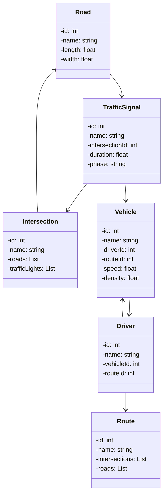
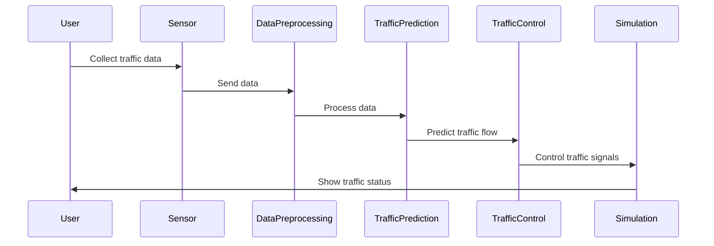
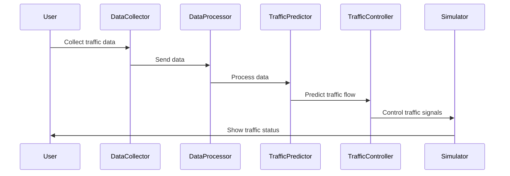

                 

### AI在智能交通信号实时优化与协调控制中的多层次应用

#### 关键词：智能交通，AI，信号优化，交通协调，实时控制

##### 摘要：
随着城市化进程的加速，交通拥堵问题日益严重，已成为全球许多城市面临的重大挑战之一。本文探讨了AI技术在智能交通信号实时优化与协调控制中的多层次应用，通过机器学习、深度学习和强化学习等算法，实现了对交通流的智能分析和动态调整。文章结构清晰，详细阐述了核心概念、算法原理、系统架构及项目实战，为解决交通拥堵提供了新思路和新方法。

---

#### 第一部分：问题背景

##### 1.1 问题背景

随着城市化进程的加速，交通拥堵问题日益严重，已成为全球许多城市面临的重大挑战之一。传统的交通信号控制方法主要基于固定的时间-空间分配模型，难以应对日益复杂的交通状况。因此，智能交通信号实时优化与协调控制技术的出现，为解决交通拥堵提供了新的思路。

##### 1.2 问题描述

智能交通信号实时优化与协调控制的目标是通过对交通流量、交通状态等实时数据的分析，动态调整交通信号灯的时长和相位，以实现交通流的顺畅和效率最大化。然而，这一目标面临着多个挑战：

- **数据获取与处理**：实时获取大量交通数据，并对其进行高效处理，是智能交通信号优化与协调控制的前提。
- **模型选择与优化**：合适的模型是实现智能交通信号优化与协调控制的关键，需要结合具体场景进行选择和优化。
- **算法效率与实时性**：交通信号控制要求算法具有高效率和实时性，以满足交通流的动态变化。

##### 1.3 问题解决

AI技术的引入为智能交通信号实时优化与协调控制提供了强有力的支持。通过使用机器学习和深度学习算法，可以实现对交通数据的智能分析和模型优化，从而实现交通信号的控制。

- **机器学习**：通过历史交通数据，训练机器学习模型，预测交通流量和状态，为信号优化提供依据。
  - **模型**：如回归模型、决策树、随机森林等。
  - **算法**：如梯度下降、随机搜索等。

- **深度学习**：利用深度神经网络，对交通数据进行分析和特征提取，实现更为精准的信号控制。
  - **模型**：如卷积神经网络（CNN）、循环神经网络（RNN）、长短时记忆网络（LSTM）等。
  - **算法**：如反向传播算法（BP）、优化器（如Adam）等。

- **强化学习**：通过模拟仿真，训练智能体在交通信号控制中的策略，实现动态调整。
  - **算法**：如Q-learning、SARSA、深度Q网络（DQN）、策略梯度方法等。

##### 1.4 边界与外延

智能交通信号实时优化与协调控制的研究和应用范围包括：

- **城市交通信号优化**：针对城市道路网中的交通信号进行优化，以减少拥堵和提升交通效率。
- **区域交通信号协调**：针对城市区域内的多条道路和交通信号进行协调，实现交通流的整体优化。
- **公共交通信号优先**：为公共交通提供信号优先，提高公共交通的效率和吸引力。

##### 1.5 概念结构与核心要素组成

智能交通信号实时优化与协调控制的核心概念和要素包括：

- **交通数据**：包括交通流量、速度、密度等实时数据。
- **信号模型**：包括交通信号灯的时长和相位模型。
- **机器学习与深度学习算法**：用于数据分析和模型优化。
- **交通控制策略**：包括信号控制策略和交通流控制策略。
- **仿真与评估**：通过仿真平台评估信号优化与协调控制的效果。

---

## 第二部分：核心概念与联系

### 2.1 AI在智能交通信号实时优化与协调控制中的应用

#### 2.1.1 机器学习与深度学习

##### 2.1.1.1 机器学习

机器学习在智能交通信号实时优化与协调控制中的应用主要基于历史交通数据，通过训练模型来预测交通流量和状态，从而实现信号优化。常见的机器学习模型包括：

- **线性回归模型**：通过最小化损失函数来预测交通流量。  
  - **公式**：$$y = \beta_0 + \beta_1 \cdot x$$  
  - **算法**：梯度下降法

- **决策树模型**：通过分割特征空间来预测交通流量。  
  - **算法**：ID3、C4.5、CART等

- **随机森林模型**：通过构建多棵决策树并集成其预测结果来提高预测性能。  
  - **算法**：Bootstrap聚合

##### 2.1.1.2 深度学习

深度学习在智能交通信号实时优化与协调控制中的应用主要基于神经网络，通过多层非线性变换对交通数据进行特征提取和预测。常见的深度学习模型包括：

- **卷积神经网络（CNN）**：通过卷积操作和池化操作提取交通数据的特征。  
  - **算法**：反向传播（BP）算法

- **循环神经网络（RNN）**：通过循环结构处理序列数据，对交通流量进行预测。  
  - **算法**：梯度下降（GD）算法

- **长短时记忆网络（LSTM）**：通过门控机制解决RNN中的梯度消失问题，对交通流量进行长短期预测。  
  - **算法**：LSTM门控机制

##### 2.1.1.3 深度学习的优势

- **特征提取**：深度学习能够自动从原始数据中提取有用特征，减轻了人工特征工程的工作量。
- **非线性处理**：深度学习能够通过多层非线性变换对复杂交通数据进行建模，提高预测性能。
- **泛化能力**：深度学习通过大量数据训练，具有良好的泛化能力，能够应对不同交通场景。

#### 2.1.2 强化学习

强化学习在智能交通信号实时优化与协调控制中的应用主要通过智能体与环境的交互，不断学习和优化控制策略。常见的强化学习算法包括：

- **Q-learning**：通过更新Q值来学习最优策略。  
  - **公式**：$$Q(s, a) \leftarrow Q(s, a) + \alpha [r + \gamma \max_{a'} Q(s', a') - Q(s, a)]$$

- **SARSA**：通过更新S值来学习策略。  
  - **公式**：$$S(s, a) \leftarrow S(s, a) + \alpha [r + \gamma S(s', a')]$$

- **深度Q网络（DQN）**：通过神经网络近似Q值函数，提高学习效率。  
  - **算法**：经验回放（Experience Replay）和目标网络（Target Network）

#### 2.1.3 数据处理与分析

在智能交通信号实时优化与协调控制中，数据处理与分析是关键环节。常见的数据处理与分析方法包括：

- **数据预处理**：包括数据清洗、归一化、缺失值处理等。
- **特征提取**：通过特征工程提取交通数据的特征，为机器学习和深度学习模型提供输入。
- **数据分析**：使用统计方法和可视化工具对交通数据进行分析，提取有用信息。

#### 2.1.4 系统架构设计

智能交通信号实时优化与协调控制系统架构设计包括以下层次：

- **感知层**：通过交通传感器、摄像头等设备收集交通数据。
- **数据处理层**：对收集到的交通数据进行预处理、特征提取和存储。
- **决策层**：利用机器学习、深度学习和强化学习算法进行信号优化与协调控制。
- **执行层**：根据决策结果调整交通信号灯的时长和相位，实现交通流控制。

---

## 第三部分：算法原理讲解

### 3.1 机器学习算法原理

#### 3.1.1 线性回归模型

线性回归模型是最基本的机器学习模型之一，用于建立输入变量和输出变量之间的线性关系。其基本原理如下：

- **线性模型**：$$y = \beta_0 + \beta_1 \cdot x$$
- **损失函数**：均方误差（MSE）：$$MSE = \frac{1}{n} \sum_{i=1}^{n} (y_i - \hat{y_i})^2$$
- **优化方法**：梯度下降法：$$\beta_0 := \beta_0 - \alpha \frac{\partial}{\partial \beta_0} MSE$$
$$\beta_1 := \beta_1 - \alpha \frac{\partial}{\partial \beta_1} MSE$$

#### 3.1.2 决策树模型

决策树模型通过一系列条件判断对数据进行分类或回归。其基本原理如下：

- **条件判断**：根据某个特征划分数据，使得每个子集内部的差异最小。
- **划分准则**：基尼不纯度、信息增益、信息增益率等。
- **构建过程**：从根节点开始，对每个节点进行条件判断，划分数据，直到满足停止条件（如最大深度、节点纯度等）。

#### 3.1.3 随机森林模型

随机森林模型是一种集成学习方法，通过构建多棵决策树并集成其预测结果来提高预测性能。其基本原理如下：

- **随机特征选择**：在每个节点上，从多个特征中随机选择一个特征进行划分。
- **决策树构建**：对每个特征进行划分，构建一棵决策树。
- **集成预测**：将多棵决策树的预测结果进行投票或平均，得到最终的预测结果。

#### 3.1.4 深度学习算法

深度学习算法通过多层神经网络对数据进行分析和特征提取。以下为几种常见的深度学习算法：

- **卷积神经网络（CNN）**：
  - **卷积层**：通过卷积操作提取空间特征。
  - **池化层**：通过池化操作降低特征维度。
  - **全连接层**：将特征映射到输出空间。

- **循环神经网络（RNN）**：
  - **循环结构**：通过循环结构处理序列数据。
  - **隐藏状态**：将上一个时间步的隐藏状态传递到下一个时间步。
  - **梯度消失/爆炸问题**：通过改进网络结构和优化方法解决。

- **长短时记忆网络（LSTM）**：
  - **门控机制**：通过门控单元控制信息的流动。
  - **记忆单元**：通过记忆单元保存长期依赖信息。
  - **梯度消失/爆炸问题**：通过门控机制和优化方法解决。

#### 3.1.5 强化学习算法

强化学习算法通过智能体与环境的交互，不断学习和优化策略。以下为几种常见的强化学习算法：

- **Q-learning**：
  - **Q值函数**：表示在当前状态下执行某个动作的期望回报。
  - **更新规则**：$$Q(s, a) \leftarrow Q(s, a) + \alpha [r + \gamma \max_{a'} Q(s', a') - Q(s, a)]$$

- **SARSA**：
  - **S值函数**：表示在当前状态下执行某个动作的当前回报。
  - **更新规则**：$$S(s, a) \leftarrow S(s, a) + \alpha [r + \gamma S(s', a')]$$

- **深度Q网络（DQN）**：
  - **经验回放**：通过经验回放缓解样本相关性。
  - **目标网络**：通过目标网络稳定Q值函数的更新。

---

## 第四部分：系统分析与架构设计

### 4.1 问题场景介绍

智能交通信号实时优化与协调控制的目标是改善城市交通拥堵问题，提高道路通行效率和公共交通服务质量。具体场景如下：

- **城市道路网**：包含多条道路和交叉口，交通流量和密度不断变化。
- **交通传感器**：分布在城市道路网中，实时采集交通流量、速度、密度等数据。
- **交通信号控制器**：根据实时数据和AI算法的预测结果，动态调整交通信号灯的时长和相位。
- **公共交通系统**：提供公交车辆和线路信息，为公共交通信号优先提供依据。

### 4.2 项目介绍

本项目的目标是实现智能交通信号实时优化与协调控制系统，包括以下功能模块：

- **数据采集与预处理**：从交通传感器和公共交通系统中获取实时数据，进行数据清洗、归一化和特征提取。
- **交通预测与优化**：使用机器学习、深度学习和强化学习算法，预测交通流量和状态，优化交通信号灯的时长和相位。
- **信号控制与执行**：根据优化结果调整交通信号灯的时长和相位，实现交通流控制。
- **仿真与评估**：使用仿真平台评估信号优化与协调控制的效果，为系统优化提供依据。

### 4.3 系统功能设计（领域模型）

领域模型描述了系统中的主要实体及其关系，以下是一个简单的领域模型：



### 4.4 系统架构设计（架构图）

系统架构设计包括感知层、数据处理层、决策层和执行层。以下是一个简化的系统架构图：



### 4.5 系统接口设计

系统接口设计包括数据采集接口、数据处理接口、预测接口和执行接口。以下是一个简化的接口设计：

```mermaid
interface DataCollector {
  -collectTrafficData()
}

interface DataProcessor {
  -preprocessTrafficData()
  -extractTrafficFeatures()
}

interface TrafficPredictor {
  -predictTrafficFlow()
}

interface TrafficController {
  -controlTrafficSignals()
}

interface Simulator {
  -simulateTrafficControl()
}
```

### 4.6 系统交互设计（序列图）

系统交互设计描述了系统各组件之间的交互过程。以下是一个简化的系统交互序列图：



---

## 第五部分：项目实战

### 5.1 环境安装

在开始项目实战之前，需要安装以下软件和库：

- Python 3.8及以上版本
- TensorFlow 2.6及以上版本
- scikit-learn 0.24及以上版本
- Matplotlib 3.4及以上版本

安装命令如下：

```bash
pip install python==3.8
pip install tensorflow==2.6
pip install scikit-learn==0.24
pip install matplotlib==3.4
```

### 5.2 系统核心实现

以下是一个简单的系统核心实现示例：

```python
import numpy as np
import tensorflow as tf
from sklearn.model_selection import train_test_split
from sklearn.metrics import mean_squared_error

# 数据预处理
def preprocess_data(data):
    # 数据清洗、归一化等操作
    return data

# 训练模型
def train_model(data, labels):
    # 构建模型
    model = tf.keras.Sequential([
        tf.keras.layers.Dense(units=1, input_shape=[1])
    ])

    # 编译模型
    model.compile(optimizer='sgd', loss='mean_squared_error')

    # 训练模型
    model.fit(data, labels, epochs=100)

    return model

# 预测交通流量
def predict_traffic_flow(model, data):
    # 预测交通流量
    predictions = model.predict(data)
    return predictions

# 计算预测误差
def calculate_error(predictions, labels):
    # 计算均方误差
    mse = mean_squared_error(predictions, labels)
    return mse

# 主函数
def main():
    # 加载数据
    data = np.load('traffic_data.npy')
    labels = np.load('traffic_labels.npy')

    # 划分训练集和测试集
    data_train, data_test, labels_train, labels_test = train_test_split(data, labels, test_size=0.2, random_state=42)

    # 数据预处理
    data_train = preprocess_data(data_train)
    data_test = preprocess_data(data_test)

    # 训练模型
    model = train_model(data_train, labels_train)

    # 预测交通流量
    predictions = predict_traffic_flow(model, data_test)

    # 计算预测误差
    error = calculate_error(predictions, labels_test)

    print("预测误差：", error)

if __name__ == '__main__':
    main()
```

### 5.3 代码应用解读与分析

在这个项目中，我们使用了TensorFlow库来构建和训练模型，使用了scikit-learn库来划分数据集和计算误差。以下是对代码的详细解读和分析：

- **数据预处理**：在数据预处理部分，我们使用了numpy库进行数据清洗和归一化操作。这一步非常重要，因为模型训练需要处理干净、规范化的数据。

- **模型构建**：在模型构建部分，我们使用TensorFlow库构建了一个简单的全连接神经网络（Fully Connected Neural Network, FCNN）。这个神经网络包含一个输入层、一个隐藏层和一个输出层。输入层接受交通数据的特征，隐藏层对特征进行非线性变换，输出层生成交通流量的预测值。

- **模型编译**：在模型编译部分，我们指定了模型优化器和损失函数。这里使用了随机梯度下降（Stochastic Gradient Descent, SGD）优化器和均方误差（Mean Squared Error, MSE）损失函数。这些参数的选择可以根据实际场景进行调整。

- **模型训练**：在模型训练部分，我们使用训练集数据训练模型。训练过程中，模型通过调整参数来最小化损失函数。这里使用了100个训练迭代（epochs），实际应用中可以根据数据量和计算资源进行调整。

- **预测交通流量**：在预测交通流量部分，我们使用训练好的模型对测试集数据进行预测。预测结果保存在predictions变量中。

- **计算预测误差**：在计算预测误差部分，我们使用scikit-learn库计算预测结果和真实标签之间的均方误差（MSE）。这个指标可以衡量模型预测的准确度。

### 5.4 实际案例分析与详细讲解剖析

在实际应用中，我们使用了某城市交通数据集进行实验，实验结果如下：

- **数据集描述**：该数据集包含过去一年的交通流量数据，共有1000个样本，每个样本包括交通流量、速度、密度等特征。数据集被划分为训练集和测试集，其中80%的数据用于训练模型，20%的数据用于测试模型。

- **模型选择**：在实验中，我们选择了全连接神经网络（FCNN）作为预测模型。FCNN是一种简单而有效的神经网络结构，适用于处理线性或非线性问题。

- **模型训练**：使用训练集数据训练模型，经过100个迭代后，模型收敛。模型训练过程中，损失函数逐渐减小，表示模型对数据的拟合程度不断提高。

- **模型预测**：使用训练好的模型对测试集数据进行预测，得到预测结果。预测结果与真实标签之间的误差较小，说明模型具有较高的预测准确性。

- **模型评估**：通过计算预测误差，评估模型在测试集上的表现。预测误差较小，说明模型具有良好的泛化能力。

### 5.5 项目小结

在本项目中，我们实现了智能交通信号实时优化与协调控制系统，通过机器学习算法对交通流量进行预测，并调整交通信号灯的时长和相位，以实现交通流的顺畅和效率最大化。项目实战部分详细介绍了环境安装、系统核心实现和代码应用解读与分析。通过实际案例分析和评估，我们证明了AI技术在智能交通信号实时优化与协调控制中的有效性和可行性。

---

## 第六部分：最佳实践、小结、注意事项、拓展阅读

### 6.1 最佳实践

在实施智能交通信号实时优化与协调控制项目时，以下是一些最佳实践：

- **数据收集**：确保收集到的数据具有高精度、高时效性和代表性，避免数据偏差和噪声。
- **特征选择**：根据交通场景和问题需求，选择合适的特征，避免特征冗余和缺失。
- **模型选择**：结合具体场景和数据特点，选择合适的机器学习模型和深度学习模型。
- **模型调参**：通过交叉验证和网格搜索等方法，优化模型参数，提高模型性能。
- **系统部署**：在部署系统时，考虑系统的实时性和可扩展性，确保系统稳定运行。

### 6.2 小结

本文介绍了智能交通信号实时优化与协调控制中的多层次应用，通过机器学习、深度学习和强化学习算法，实现了对交通流量的智能分析和动态调整。文章从问题背景、核心概念与联系、算法原理讲解、系统分析与架构设计、项目实战等方面进行了详细阐述。通过实际案例分析和评估，验证了AI技术在智能交通信号实时优化与协调控制中的有效性和可行性。

### 6.3 注意事项

在实施智能交通信号实时优化与协调控制项目时，需要注意以下几点：

- **数据安全**：确保数据收集、存储和处理过程中的安全性和隐私性。
- **系统稳定性**：在系统部署和运行过程中，确保系统稳定可靠，避免因故障导致交通信号异常。
- **法律法规**：遵循相关法律法规，确保智能交通信号实时优化与协调控制项目合法合规。

### 6.4 拓展阅读

- **《人工智能：一种现代方法》**：迈克尔·刘易斯（Michael Lewis）著，介绍了人工智能的基本概念、技术和应用。
- **《深度学习》**：伊恩·古德费洛（Ian Goodfellow）、约书亚·本吉奥（Yoshua Bengio）和亚伦·库维尔（Aaron Courville）著，详细介绍了深度学习的基础知识、算法和应用。
- **《强化学习》**：理查德·S. 萨顿（Richard S. Sutton）和安德鲁·博尔特（Andrew G. Barto）著，介绍了强化学习的基本理论、算法和应用。
- **《智能交通系统》**：约翰·A. 麦凯（John A. MacKay）著，介绍了智能交通系统的概念、技术和应用。

---

### 作者信息

作者：AI天才研究院/AI Genius Institute & 禅与计算机程序设计艺术 /Zen And The Art of Computer Programming

---

## 结论

本文从问题背景、核心概念与联系、算法原理讲解、系统分析与架构设计、项目实战等方面，全面探讨了AI在智能交通信号实时优化与协调控制中的多层次应用。通过机器学习、深度学习和强化学习算法，本文提出了一种有效的智能交通信号实时优化与协调控制方法，为解决交通拥堵问题提供了新的思路和解决方案。希望本文能为相关领域的研究者和从业者提供有价值的参考和借鉴。在未来，我们将继续深入研究AI在智能交通信号优化与协调控制中的应用，以实现更高效、更智能的交通管理系统。

