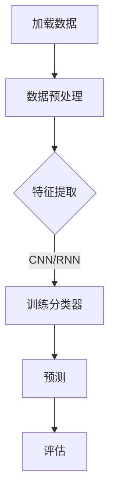
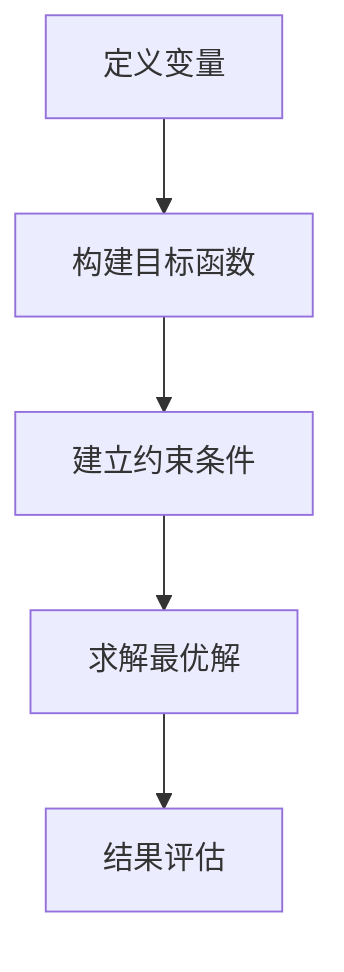
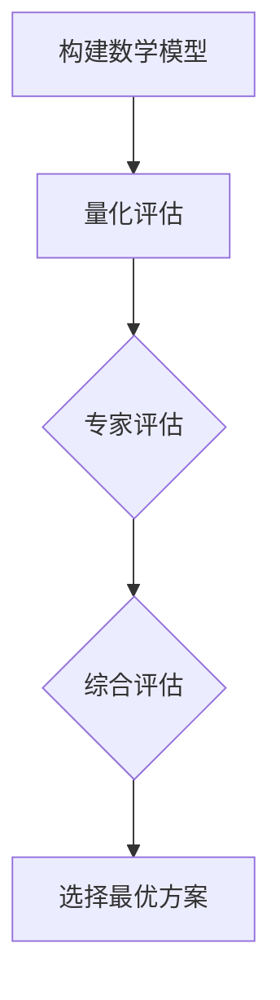

                 

### AI在智能交通紧急事件响应与资源调度中的多方案评估应用

**关键词：**智能交通系统，AI技术，紧急事件响应，资源调度，多方案评估

**摘要：**本文将探讨AI在智能交通紧急事件响应与资源调度中的应用，通过多方案评估，分析不同技术的优劣，为实际项目提供决策依据。

## 第一部分：背景介绍与核心概念

### 1.1 问题背景

智能交通系统（Intelligent Transportation System, ITS）在现代城市发展中的作用日益显著。它通过整合交通信息、信号控制、车辆监控等技术，提高交通效率、减少拥堵、降低交通事故率。然而，随着城市化进程的加速和交通流量的激增，智能交通系统面临着诸多挑战，尤其是紧急事件响应与资源调度问题。AI技术的引入为解决这些问题提供了新的思路和手段。

### 1.2 问题描述

智能交通紧急事件响应与资源调度问题主要包括以下方面：

- **紧急事件的识别与分类：**如何快速准确地识别交通事件，并进行合理的分类？
- **资源调度：**在紧急事件发生后，如何高效地调度交通资源，如警车、救护车、交通管制设备等？
- **事件响应策略：**如何制定合理的响应策略，以最大限度地减少事件对交通系统的影响？

### 1.3 问题解决

AI技术在智能交通紧急事件响应与资源调度中的应用主要包括以下方面：

- **数据分析与挖掘：**利用大数据分析技术，对交通数据、历史事件数据进行深度挖掘，以发现潜在的问题和规律。
- **机器学习与深度学习：**通过机器学习算法，如决策树、神经网络等，对交通事件进行分类和预测。
- **优化算法：**利用优化算法，如遗传算法、蚁群算法等，进行资源调度和路线规划。
- **实时监测与响应：**通过实时数据监测和事件响应系统，实现紧急事件的快速识别和响应。

### 1.4 边界与外延

智能交通紧急事件响应与资源调度的边界主要涉及交通事件的识别、分类、调度和响应。其外延包括但不限于城市交通、高速公路、公共交通系统等领域。

### 1.5 概念结构与核心要素组成

- **智能交通系统（ITS）：**包括交通信息采集、交通状态监测、交通信号控制、交通事件处理等核心功能。
- **紧急事件：**包括交通事故、道路施工、恶劣天气等对交通造成重大影响的突发事件。
- **资源调度：**指在紧急事件发生后，根据事件类型和交通状况，合理分配和调度各类交通资源。
- **AI技术：**包括数据分析、机器学习、深度学习、优化算法等，用于辅助交通事件的识别、分类、调度和响应。

### 1.6 核心概念原理

#### 1.6.1 AI技术在智能交通紧急事件响应中的应用

- **机器学习算法：**用于交通事件的分类和预测，如决策树、支持向量机、神经网络等。
- **深度学习算法：**用于复杂交通场景的识别和模拟，如卷积神经网络（CNN）、循环神经网络（RNN）等。
- **优化算法：**用于资源调度和路线规划，如遗传算法、蚁群算法、线性规划等。

#### 1.6.2 AI技术在智能交通资源调度中的应用

- **数据挖掘：**用于挖掘交通数据中的潜在规律，为资源调度提供依据。
- **优化模型：**构建数学模型，通过优化算法求解资源调度问题。
- **实时监测与响应：**利用传感器和监控系统，实现交通事件的实时监测和响应。

### 1.7 概念属性特征对比表格

#### 1.7.1 机器学习算法与深度学习算法对比

| 算法 | 特点 | 适用场景 |
| ---- | ---- | ---- |
| 机器学习算法 | 需要手动提取特征，适用于有明确特征的数据集 | 数据量较小，特征工程要求高 |
| 深度学习算法 | 自动提取特征，适用于数据量大、特征复杂的数据集 | 数据量较大，特征工程需求低 |
| 优势 | 易于理解和实现，对数据量要求不高 | 自动化特征提取，适用于复杂数据分析 |
| 劣势 | 特征提取效率低，对数据质量要求高 | 需要大量数据和计算资源，调参复杂 |

### 1.8 ER实体关系图架构

#### 1.8.1 智能交通紧急事件响应与资源调度ER图

```mermaid
erDiagram
  TrafficEvent ||--|{ EmergencyResponse } : 处理
  TrafficResource ||--|{ ResourceAllocation } : 分配
  TrafficEventType ||--|{ TrafficEventType } : 分类
  TrafficMonitoring ||--|{ TrafficMonitoringData } : 监测
```

## 第二部分：AI在智能交通紧急事件响应中的应用

### 2.1 AI在紧急事件识别中的应用

#### 2.1.1 紧急事件的分类方法

- **数据预处理：**对交通数据进行清洗和预处理，包括数据去噪、缺失值处理等。
- **特征提取：**利用深度学习算法提取交通数据中的关键特征。
- **分类算法：**使用支持向量机（SVM）、决策树（DT）等机器学习算法进行分类。

#### 2.1.2 紧急事件识别的算法原理

1. **数据预处理**

   数据预处理是紧急事件识别的第一步，主要包括以下任务：

   - **去噪：**去除噪声数据，确保数据质量。
   - **缺失值处理：**处理缺失值，如插值、删除等。
   - **数据标准化：**将数据缩放至同一尺度，以消除不同特征间的尺度差异。

2. **特征提取**

   特征提取是紧急事件识别的核心，深度学习算法如卷积神经网络（CNN）可以自动提取交通数据中的关键特征。以下是几种常见的特征提取方法：

   - **基于CNN的特征提取：**CNN可以自动学习图像数据中的低级和高级特征，适用于交通场景的图像数据。
   - **基于RNN的特征提取：**RNN可以捕捉时间序列数据中的长期依赖关系，适用于交通流量的时间序列数据。

3. **分类算法**

   使用机器学习算法对提取的特征进行分类。以下是几种常用的分类算法：

   - **支持向量机（SVM）：**SVM通过找到一个最佳的超平面，将不同类别的数据分隔开。
   - **决策树（DT）：**DT通过一系列的决策规则，将数据分类为不同的类别。

#### 2.1.3 紧急事件识别的Python代码示例

```python
import numpy as np
from sklearn import svm
from sklearn.model_selection import train_test_split
from sklearn.metrics import accuracy_score

# 加载数据
X, y = load_data()

# 数据预处理
X = preprocess_data(X)

# 数据分割
X_train, X_test, y_train, y_test = train_test_split(X, y, test_size=0.2, random_state=42)

# 特征提取
features = extract_features(X_train)

# 训练分类器
clf = svm.SVC()
clf.fit(features, y_train)

# 预测
y_pred = clf.predict(extract_features(X_test))

# 评估
accuracy = accuracy_score(y_test, y_pred)
print("Accuracy:", accuracy)
```

#### 2.1.4 紧急事件识别的mermaid流程图



## 第三部分：AI在智能交通资源调度中的应用

### 3.1 资源调度的算法原理

#### 3.1.1 优化算法

优化算法在资源调度中扮演着关键角色。以下是一些常用的优化算法：

- **遗传算法（GA）：**遗传算法模拟自然进化过程，通过遗传、交叉、变异等操作寻找最优解。
- **蚁群算法（ACO）：**蚁群算法模拟蚂蚁觅食过程，通过信息素更新和路径选择寻找最优路径。
- **线性规划（LP）：**线性规划通过构建线性数学模型，求解资源调度的最优解。

#### 3.1.2 优化模型的构建

优化模型的构建主要包括以下步骤：

- **定义变量：**定义决策变量，如车辆数量、路线选择等。
- **构建目标函数：**根据资源调度的目标，构建目标函数，如最小化响应时间、最大化资源利用率等。
- **建立约束条件：**根据实际情况，建立约束条件，如交通流量限制、资源容量限制等。

#### 3.1.3 优化模型的Python代码示例

```python
from scipy.optimize import linprog

# 定义目标函数
c = [-1, -1]  # 最小化总时间

# 定义约束条件
A = [[1, 0], [0, 1]]
b = [10, 5]  # 总时间不超过15分钟

# 定义变量
x = linprog(c, A_ub=A, b_ub=b)
print(x)
```

#### 3.1.4 资源调度的mermaid流程图



## 第四部分：多方案评估与应用

### 4.1 多方案评估的原理

多方案评估是智能交通紧急事件响应与资源调度中至关重要的一环。其原理主要包括：

- **比较不同方案的优劣：**通过评估不同方案的响应时间、资源利用率、响应精度等指标，比较不同方案的优劣。
- **综合评估：**综合考虑各种因素，如技术可行性、成本效益等，进行综合评估，选择最优方案。

### 4.2 多方案评估的方法

多方案评估的方法主要包括以下几种：

- **定量评估：**通过构建数学模型，量化评估不同方案的优劣。
- **定性评估：**通过专家评估、问卷调查等方法，定性评估不同方案的优劣。
- **综合评估：**结合定量评估和定性评估，进行综合评估，选择最优方案。

### 4.3 多方案评估的mermaid流程图



## 第五部分：总结与展望

### 5.1 总结

本文通过逐步分析推理，探讨了AI在智能交通紧急事件响应与资源调度中的应用。从紧急事件的识别与分类，到资源调度和优化，再到多方案评估，我们详细阐述了各个方面的原理和方法。AI技术在智能交通领域的应用，不仅提高了紧急事件响应的效率，也为资源调度提供了科学依据。

### 5.2 展望

未来的智能交通系统将更加依赖于AI技术。我们期待看到：

- **更高效的紧急事件识别与分类算法：**通过深度学习和强化学习，提高紧急事件识别的精度和速度。
- **更优的资源调度策略：**结合多智能体系统和强化学习，实现更智能、更高效的资源调度。
- **更全面的综合评估体系：**引入更多维度和更复杂的评估模型，实现更全面、更准确的方案评估。

**作者：AI天才研究院/AI Genius Institute & 禅与计算机程序设计艺术 /Zen And The Art of Computer Programming**

