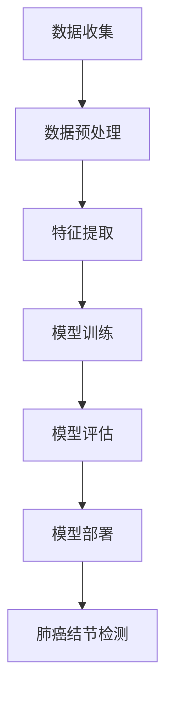
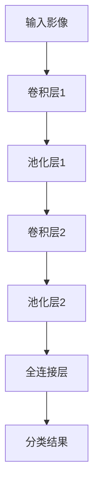
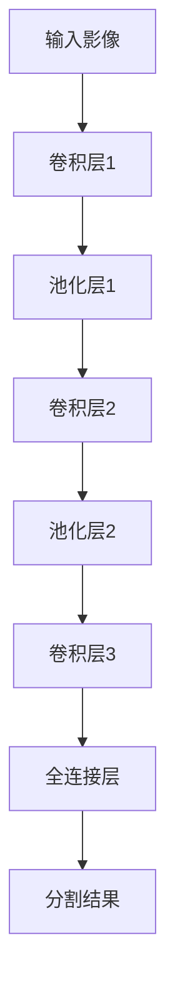
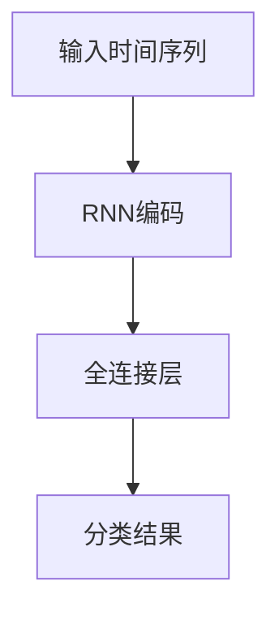
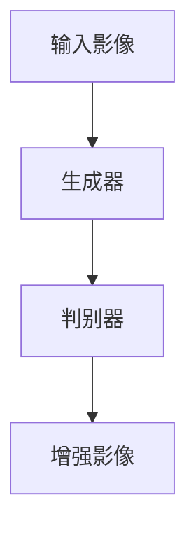
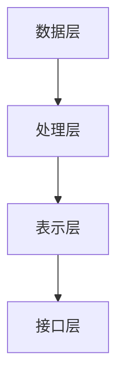

                 

## 第一部分：引言与背景

### 1.1 引言

#### 1.1.1 问题背景

在当今科技日新月异的时代，人工智能（AI）的应用已经渗透到了医疗领域的方方面面。特别是在医疗影像领域，AI技术展现出了巨大的潜力。通过深度学习、卷积神经网络（CNN）等技术，AI能够辅助医生进行疾病的早期检测、诊断和预后评估，从而提高医疗服务的效率和准确性。然而，随着AI技术在医疗领域的广泛应用，随之而来的可解释性和可信度问题也日益凸显。

首先，AI辅助诊断系统在医疗影像分析中的应用日益广泛。以肺癌结节检测为例，AI可以通过分析CT影像，自动识别结节并对其性质进行分类。这种方法不仅可以减轻医生的工作负担，还可以提高诊断的准确性。然而，现有的AI诊断系统往往存在一个显著的问题，即模型决策过程缺乏可解释性。这意味着医生难以理解模型是如何得出诊断结果的，这在一定程度上影响了医生对AI诊断结果的信任度。

其次，可信度评估是另一个关键问题。尽管AI诊断系统在性能上取得了显著进步，但是如何确保模型的稳定性和可靠性仍然是一个挑战。评估模型的性能指标包括精确度、召回率、F1分数等，但这些指标并不能完全反映模型在实际应用中的表现。特别是在罕见疾病或复杂病情中，模型的性能可能会受到很大影响。

#### 1.1.2 AI辅助诊断中的可解释性与可信度评估

可解释性（Explainability）和可信度（Credibility）是AI辅助诊断中不可或缺的两个方面。可解释性指的是模型决策过程的透明性和可理解性，它使得医生能够理解模型是如何工作的，从而提高其对AI诊断结果的信任度。而可信度则关注模型的性能和稳定性，它确保模型在实际应用中能够提供可靠的结果。

在AI辅助诊断中，可解释性和可信度评估的重要性不言而喻。首先，可解释性有助于建立医生与AI系统之间的信任关系。医生需要能够理解AI的诊断过程，以便在临床实践中有效地应用AI系统。其次，可信度评估能够帮助识别模型的潜在问题，从而优化模型性能，提高诊断的准确性。

本文旨在探讨AI在智能医疗影像辅助诊断中的可解释性与可信度评估问题。具体而言，本文将首先介绍相关背景和问题，然后详细阐述可解释性和可信度的核心概念、方法以及它们之间的关系。接着，本文将分析现有研究中的挑战和局限性，并提出可能的解决方案。最后，本文将讨论未来研究的方向和潜在的应用前景。

### 1.2 问题描述

#### 1.2.1 智能医疗影像辅助诊断

智能医疗影像辅助诊断是指利用AI技术，特别是深度学习和图像识别技术，对医疗影像进行分析和诊断的过程。这一过程通常包括以下几个关键技术：

1. **图像识别**：图像识别是智能医疗影像分析的基础。通过训练深度学习模型，如卷积神经网络（CNN），可以从医疗影像中自动提取特征并进行分类。例如，AI系统可以识别CT影像中的肺部结节或乳腺影像中的肿瘤。

2. **深度学习**：深度学习是AI的核心技术之一。它通过多层神经网络，自动学习图像中的复杂模式和特征，从而实现高级图像分析和诊断。深度学习模型在医疗影像分析中展现了极高的准确性和效率。

3. **神经网络在影像分析中的应用**：神经网络，尤其是深度神经网络，已经在医疗影像分析中得到了广泛应用。通过训练神经网络，可以实现对各种疾病和病变的自动检测和分类，从而辅助医生做出更准确的诊断。

然而，智能医疗影像辅助诊断也面临着一些挑战。首先是可解释性问题。由于深度学习模型通常被视为“黑箱”，其决策过程难以解释，这使得医生难以理解模型的诊断依据。这可能导致医生对AI诊断结果的信任度下降。

其次是可信度评估问题。尽管AI诊断系统在性能上取得了显著进步，但是如何确保模型在实际应用中的稳定性和可靠性仍然是一个挑战。现有的评估方法往往只能提供有限的性能指标，无法全面反映模型的表现。

#### 1.2.2 面临的挑战

1. **可解释性**：深度学习模型的“黑箱”特性使得其决策过程难以解释，这成为医生对AI诊断结果信任度的一个关键障碍。为了提高可解释性，研究人员提出了一系列方法，如模型可视化、敏感性分析和局部解释方法等。

2. **可信度评估**：确保模型在实际应用中的性能和稳定性是一个重要挑战。现有的评估方法包括交叉验证、比较研究和性能指标等，但这些方法各有局限性，难以全面评估模型的可信度。

3. **数据隐私和安全性**：在医疗领域，数据隐私和安全性问题尤为重要。如何确保医疗数据的隐私和安全，同时充分利用这些数据进行AI模型的训练和评估，是一个亟待解决的问题。

### 1.3 问题解决

#### 1.3.1 可解释性方法

为了提高AI诊断系统的可解释性，研究人员提出了一系列方法。以下是一些常见的方法：

1. **敏感性分析**：敏感性分析可以帮助识别影响模型决策的关键特征。通过分析特征对模型输出的影响，医生可以更好地理解模型的诊断依据。

2. **可视化技术**：可视化技术，如热力图和注意力机制，可以帮助展示模型在图像中的关注区域，从而提高模型的可解释性。

3. **局部解释方法**：局部解释方法，如LIME（Local Interpretable Model-agnostic Explanations）和SHAP（SHapley Additive exPlanations），可以通过局部线性化或博弈论方法，提供对模型决策的局部解释。

#### 1.3.2 可信度评估方法

为了确保AI诊断系统的可信度，研究人员提出了一系列评估方法。以下是一些常见的方法：

1. **交叉验证**：交叉验证是一种常用的性能评估方法，通过将数据集划分为多个子集，重复训练和测试模型，可以减少评估结果的偏差。

2. **比较研究**：比较研究通过与基准模型或其他AI系统进行比较，可以评估AI诊断系统的性能和稳定性。

3. **性能指标**：常见的性能指标包括精确度、召回率、F1分数等，这些指标可以量化模型的表现，帮助评估其可信度。

#### 1.4 边界与外延

##### 1.4.1 研究边界

本文的研究范围主要针对AI在智能医疗影像辅助诊断中的可解释性和可信度评估。具体来说，本文将探讨以下问题：

1. **可解释性方法**：如何提高深度学习模型在医疗影像诊断中的可解释性？
2. **可信度评估方法**：如何确保AI诊断系统的性能和稳定性？

本文的研究主要关注以下领域：

1. **深度学习模型**：本文将主要探讨卷积神经网络（CNN）等深度学习模型在医疗影像诊断中的应用。
2. **数据集**：本文将使用公开的医疗影像数据集进行实验，以验证提出的方法的有效性。

##### 1.4.2 研究外延

未来研究可以进一步探讨以下方向：

1. **跨学科研究**：结合医学、计算机科学等领域的最新成果，开发更高效、更可靠的AI诊断系统。
2. **实践应用**：推动AI诊断系统在临床实践中的应用，提高医疗服务的质量和效率。

### 1.5 本章小结

本文介绍了AI在智能医疗影像辅助诊断中的可解释性与可信度评估问题。首先，本文探讨了AI辅助诊断的背景和现状，分析了其中的挑战和问题。接着，本文详细阐述了可解释性和可信度的核心概念、方法以及它们之间的关系。最后，本文提出了可能的解决方案，并讨论了未来研究的方向和应用前景。

---

**关键词**：人工智能，智能医疗影像，可解释性，可信度评估，深度学习，卷积神经网络（CNN）

**摘要**：本文探讨了AI在智能医疗影像辅助诊断中的可解释性与可信度评估问题。通过对背景、核心概念和方法的介绍，本文分析了当前AI辅助诊断面临的挑战，并提出了提高可解释性和可信度的解决方案。未来研究将着眼于跨学科合作和实践应用，以推动AI在医疗领域的更广泛应用。

## 1.2 AI在智能医疗影像辅助诊断中的算法原理

### 1.2.1 卷积神经网络（CNN）

卷积神经网络（CNN）是一种专门用于处理图像数据的深度学习模型。CNN的核心原理是通过卷积层、池化层和全连接层等结构，自动提取图像中的特征并进行分类。以下是CNN的基本组成部分：

1. **卷积层（Convolutional Layer）**：卷积层是CNN的核心部分，通过卷积操作从输入图像中提取特征。卷积操作涉及一个卷积核（filter）在图像上的滑动，并与图像中的像素值进行点积操作。通过多次卷积操作，CNN能够逐层提取图像中的高级特征。

2. **池化层（Pooling Layer）**：池化层用于降低数据维度，减少计算复杂度。常见的池化操作包括最大池化（MaxPooling）和平均池化（AveragePooling）。通过池化操作，CNN能够提取图像中的显著特征，并丢弃冗余信息。

3. **全连接层（Fully Connected Layer）**：全连接层连接了卷积层和分类层，用于将卷积层提取的特征映射到分类结果。全连接层中的每个神经元都与上一层的所有神经元相连，从而实现图像的分类。

### 1.2.2 深度学习在影像分析中的应用

深度学习在影像分析中有着广泛的应用。以下是几种常见的深度学习模型及其在影像分析中的应用：

1. **全卷积网络（FCN）**：FCN是一种基于卷积操作的神经网络，用于图像分割任务。FCN通过将卷积层和全连接层合并，直接从输入图像中输出分割结果。FCN在医学图像分割中取得了显著的效果，如脑部病变检测和肺部结节分割。

2. **生成对抗网络（GAN）**：GAN是一种通过生成器和判别器相互对抗的训练模型。生成器生成伪造图像，判别器判断图像的真实性。GAN在医学影像增强和生成中有着重要应用，如增强低质量医学影像和提高图像分辨率。

3. **递归神经网络（RNN）**：RNN是一种能够处理序列数据的神经网络，通过其在时间步之间的反馈循环，RNN能够捕捉序列数据中的长期依赖关系。RNN在医学影像时间序列分析中有着应用，如心电图分析和脑电信号分析。

### 1.2.3 AI在医疗影像诊断中的算法流程

在医疗影像诊断中，AI算法通常包括以下几个步骤：

1. **数据预处理**：对医学影像进行数据增强、归一化等处理，以提高模型的泛化能力。

2. **特征提取**：通过卷积神经网络等深度学习模型，从医学影像中提取特征。

3. **模型训练**：使用提取的特征训练分类模型，如支持向量机（SVM）、决策树等。

4. **模型评估**：通过交叉验证等评估方法，评估模型的性能。

5. **模型部署**：将训练好的模型部署到实际应用中，如医院信息系统（HIS）或电子病历系统（EMR）。

### 1.2.4 算法原理讲解

#### 卷积层

卷积层的基本原理如下：

$$
\text{output}_{ij} = \sum_{k=1}^{K} w_{ik} \cdot a_{kj}
$$

其中，$w_{ik}$是卷积核（filter）的权重，$a_{kj}$是输入图像的像素值，$\text{output}_{ij}$是输出特征图上的像素值。

#### 池化层

最大池化层的原理如下：

$$
\text{output}_{i} = \max_{j} a_{ij}
$$

其中，$a_{ij}$是输入特征图上的像素值，$\text{output}_{i}$是输出特征图上的像素值。

#### 全连接层

全连接层的基本原理如下：

$$
z_{i} = \sum_{j=1}^{n} w_{ij} \cdot a_{j}
$$

$$
a_{i} = \sigma(z_{i})
$$

其中，$w_{ij}$是权重，$a_{j}$是输入特征，$z_{i}$是线性组合，$\sigma$是激活函数（如ReLU、Sigmoid等），$a_{i}$是输出特征。

### 1.2.5 应用实例

#### 肺癌结节检测

肺癌结节检测是AI在医疗影像诊断中的一个重要应用。以下是肺癌结节检测的步骤：

1. **数据收集**：收集大量带有标注的肺癌结节CT影像。

2. **数据预处理**：对CT影像进行裁剪、旋转、缩放等数据增强操作。

3. **特征提取**：使用卷积神经网络从CT影像中提取特征。

4. **模型训练**：使用提取的特征训练分类模型，如支持向量机（SVM）。

5. **模型评估**：通过交叉验证评估模型性能。

6. **模型部署**：将训练好的模型部署到医院信息系统，辅助医生进行肺癌结节检测。

### 1.2.6 算法流程图

以下是肺癌结节检测的算法流程图：



## 1.3 可解释性方法

在深度学习模型应用于医疗影像辅助诊断时，可解释性（Explainability）成为一个关键问题。可解释性指的是模型决策过程的透明性和可理解性，它使得医生能够理解模型是如何得出诊断结果的。可解释性在医疗领域的应用具有重要意义，因为它有助于提高医生对AI诊断结果的信任度，从而更好地将AI系统融入临床实践。

### 1.3.1 概念界定

可解释性（Explainability）通常指的是模型输出的透明性和可理解性。具体而言，它包括以下两个方面：

1. **局部可解释性**：针对单个样本的输出，解释模型是如何做出决策的。例如，解释模型在特定影像上为什么将其分类为某种疾病。

2. **全局可解释性**：对整个模型的决策过程进行解释，帮助理解模型在不同类型样本上的表现。全局可解释性通常关注模型的泛化能力和决策边界。

### 1.3.2 可解释性的重要性

在医疗领域，可解释性具有以下几个重要意义：

1. **增强医生信任**：医生需要对AI诊断结果有足够的信任，以便在临床决策中依赖这些结果。可解释性可以帮助医生理解模型的决策过程，从而增强对AI系统的信任。

2. **辅助临床决策**：医生在诊断过程中需要综合考虑多种因素，包括AI诊断结果、患者的病史和临床表现。可解释性提供了对模型决策的深入理解，有助于医生做出更全面的临床决策。

3. **监管合规**：医疗领域受到严格的监管和合规要求。可解释性能够帮助医疗机构满足监管要求，确保AI诊断系统的合规性和安全性。

### 1.3.3 可解释性技术

为了提高深度学习模型在医疗影像辅助诊断中的可解释性，研究人员提出了一系列技术。以下是几种常见的方法：

1. **模型可视化**：通过可视化技术，如热力图和注意力机制，展示模型在图像上的关注区域。这有助于理解模型是如何处理图像的，从而提高其可解释性。

2. **局部解释方法**：局部解释方法专注于对单个样本的输出进行解释。以下介绍两种常见的局部解释方法：

   - **LIME（Local Interpretable Model-agnostic Explanations）**：LIME是一种基于局部线性化的方法，通过在样本周围生成扰动样本，训练一个简单模型来解释原始样本的输出。LIME能够提供对模型输出的局部解释，但计算成本较高。
   
   - **SHAP（SHapley Additive exPlanations）**：SHAP是一种基于博弈论的局部解释方法，通过计算特征对模型输出的贡献值，提供对模型输出的全局和局部解释。SHAP能够提供更细致的解释，但计算复杂度较高。

### 1.3.4 案例研究

#### 模型可视化在肺癌结节检测中的应用

假设我们使用卷积神经网络（CNN）进行肺癌结节检测。为了提高模型的可解释性，我们可以使用以下方法：

1. **热力图**：通过计算每个像素对模型输出的贡献，生成热力图。热力图能够展示模型在识别肺癌结节时，对图像中不同区域的关注程度。例如，热力图可能显示模型更多地关注结节周围的纹理特征。

2. **注意力机制**：一些深度学习模型，如注意力机制（Attention Mechanism）的变种，能够显式地表示模型对图像不同区域的关注。注意力权重图能够帮助理解模型在诊断过程中关注的区域。

通过上述方法，医生可以更直观地理解模型是如何处理图像的，从而提高对模型输出的信任度。

### 1.3.5 局部解释方法在肺癌结节检测中的应用

为了提高模型在肺癌结节检测中的可解释性，我们可以使用LIME和SHAP等局部解释方法。以下是具体步骤：

1. **LIME应用**：

   - **步骤1**：选择一个待解释的肺癌结节影像作为输入。
   - **步骤2**：在原始影像周围生成多个扰动影像。
   - **步骤3**：使用卷积神经网络对这些扰动影像进行分类，并计算每个特征对分类输出的贡献值。
   - **步骤4**：生成LIME解释图，显示每个特征的影响程度。

2. **SHAP应用**：

   - **步骤1**：选择一个待解释的肺癌结节影像作为输入。
   - **步骤2**：使用SHAP计算每个特征对模型输出的贡献值。
   - **步骤3**：生成SHAP解释图，显示每个特征的影响程度。

通过LIME和SHAP的应用，医生可以更深入地理解模型在诊断过程中的决策依据，从而提高对AI诊断结果的信任度。

### 1.3.6 可解释性方法的效果评估

为了评估可解释性方法在提高模型可解释性方面的效果，我们可以使用以下指标：

1. **医生信任度**：通过问卷调查或访谈，评估医生对AI诊断结果的信任度。高信任度表明可解释性方法能够有效地提高模型的可理解性。

2. **临床决策辅助效果**：评估可解释性方法在临床决策过程中的辅助效果。例如，通过分析医生在诊断过程中的决策时间、准确率和满意度等指标。

3. **模型性能改进**：评估可解释性方法对模型性能的改进。例如，通过比较使用可解释性方法前后的模型性能指标，如精确度、召回率等。

通过综合评估上述指标，我们可以全面了解可解释性方法在提高模型可解释性方面的效果。

## 1.4 可信度评估方法

在AI辅助医疗影像诊断中，可信度评估是确保模型输出可靠性和稳定性的关键环节。可信度评估旨在通过一系列方法和指标，全面评价模型在诊断任务中的表现。以下将介绍可信度评估的基本概念、重要性和常见方法。

### 1.4.1 概念界定

可信度（Credibility）在AI辅助医疗影像诊断中指的是模型输出的可靠性和稳定性。具体而言，可信度评估关注以下两个方面：

1. **模型稳定性**：评估模型在不同数据集、不同训练条件下的一致性。稳定性好的模型能够在各种情况下保持一致的性能表现。

2. **模型可靠性**：评估模型在诊断任务中的准确性和一致性。可靠性高的模型能够准确地识别疾病和病变，减少误诊和漏诊。

### 1.4.2 重要性

可信度评估在AI辅助医疗影像诊断中具有重要意义，主要体现在以下几个方面：

1. **提升模型信任度**：通过可信度评估，医生可以了解模型的性能表现，从而增强对模型诊断结果的信任度，促进AI系统在临床实践中的应用。

2. **指导模型优化**：可信度评估可以帮助识别模型的潜在问题，为模型优化提供依据。例如，通过分析性能指标，可以发现模型在特定类型的数据上表现不佳，从而有针对性地进行调整。

3. **确保医疗安全**：在医疗领域，任何诊断失误都可能对患者的健康产生严重影响。可信度评估有助于确保模型输出是可靠的，从而降低医疗风险。

### 1.4.3 常见方法

可信度评估通常采用以下几种方法：

1. **性能指标**：常用的性能指标包括精确度、召回率、F1分数等。这些指标可以量化模型在诊断任务中的表现，帮助评估模型的可信度。

   - **精确度（Precision）**：表示模型正确识别为正例的样本中，实际为正例的比例。精确度高意味着模型较少地将负例误判为正例。
   
   - **召回率（Recall）**：表示模型正确识别为正例的样本中，实际为正例的比例。召回率高意味着模型较少地漏诊正例。
   
   - **F1分数（F1 Score）**：是精确度和召回率的调和平均值，用于综合考虑模型的精确度和召回率。F1分数介于0和1之间，值越高表示模型表现越好。

2. **交叉验证**：交叉验证是一种常用的性能评估方法，通过将数据集划分为多个子集，重复训练和测试模型，可以减少评估结果的偏差。常见的交叉验证方法包括K折交叉验证和留一法交叉验证。

3. **比较研究**：通过将AI诊断系统与基准模型或其他AI系统进行比较，可以评估其性能和稳定性。比较研究可以帮助识别模型的优势和不足，从而指导模型优化。

### 1.4.4 应用实例

以下是一个可信度评估的应用实例：

假设我们使用卷积神经网络（CNN）进行肺癌结节检测。为了评估模型的可信度，可以采用以下步骤：

1. **数据集划分**：将CT影像数据集划分为训练集、验证集和测试集。

2. **模型训练**：在训练集上训练CNN模型，并在验证集上进行调参。

3. **性能评估**：使用测试集评估模型性能，计算精确度、召回率和F1分数。

4. **交叉验证**：采用K折交叉验证方法，进一步评估模型的稳定性和可靠性。

5. **比较研究**：与基准模型进行比较，分析模型的优势和不足。

通过上述步骤，我们可以全面评估CNN模型在肺癌结节检测中的可信度。

## 1.5 核心概念联系

在AI辅助医疗影像诊断中，可解释性和可信度是两个相互关联的核心概念。它们不仅各自具有独特的意义，而且在实践中共同作用，以提升模型在医疗领域的应用价值。

### 1.5.1 可解释性与可信度的关系

可解释性和可信度之间存在紧密的联系。一方面，可解释性是可信度的重要组成部分。一个具有高可信度的模型，其决策过程必须是透明的和可理解的。如果模型的决策过程无法解释，医生可能难以信任其诊断结果。因此，提高可解释性是增强模型可信度的关键。

另一方面，可信度是评估可解释性效果的重要依据。即使一个模型具有高度可解释性，如果其在实际应用中的表现不稳定，医生也不会对其诊断结果产生信任。因此，可信度评估能够帮助识别模型的可解释性是否真正提升了其诊断性能。

### 1.5.2 在AI辅助诊断中的应用

在AI辅助医疗影像诊断中，可解释性和可信度共同作用于以下方面：

1. **模型选择与优化**：通过评估不同模型的可解释性和可信度，医生可以选择最适合临床需求的模型。同时，通过可信度评估，可以指导模型优化，以提高其在实际应用中的性能。

2. **临床决策支持**：可解释性提供了对模型决策的深入理解，帮助医生在临床决策中更好地利用AI系统的结果。而可信度评估确保了模型输出的可靠性，使得医生可以更放心地依赖AI系统。

3. **监管合规**：在医疗领域，监管机构对AI系统的透明性和可靠性有严格要求。可解释性和可信度评估能够帮助医疗机构满足这些要求，确保AI系统在临床实践中的合规性和安全性。

### 1.5.3 平衡可解释性与性能

在实际应用中，平衡可解释性与模型性能是一个重要的挑战。一些高度可解释的模型可能在性能上不如复杂的黑箱模型。为了实现这一平衡，可以采取以下策略：

1. **渐进式可解释性**：首先开发一个高性能的黑箱模型，然后通过可解释性方法逐步解释其决策过程，从而提高其透明性。

2. **混合模型**：结合可解释性和高性能的黑箱模型，构建一个混合模型。通过在关键决策点引入可解释性组件，既保持模型的高性能，又提高其透明性。

3. **多模型融合**：将多个模型融合为一个整体，其中一些模型具有高可解释性，另一些模型则专注于性能。通过综合考虑多个模型的结果，可以提高诊断的准确性和可解释性。

通过上述策略，可以在确保模型高性能的同时，提高其可解释性，从而在AI辅助医疗影像诊断中实现最佳效果。

## 1.6 本章小结

本章介绍了AI在智能医疗影像辅助诊断中的可解释性和可信度评估。首先，我们探讨了AI辅助诊断的背景和问题，分析了可解释性和可信度的核心概念和方法。接着，我们详细介绍了可解释性和可信度评估在提高模型信任度和临床决策支持中的作用。最后，我们讨论了如何平衡可解释性与性能，为后续章节的研究奠定了基础。

---

**关键词**：人工智能，智能医疗影像，可解释性，可信度评估，深度学习，卷积神经网络（CNN）

**摘要**：本章探讨了AI在智能医疗影像辅助诊断中的可解释性和可信度评估问题。介绍了相关背景和核心概念，分析了可解释性和可信度的重要性及其在临床实践中的应用。最后，讨论了如何平衡可解释性与性能，为后续研究提供了理论基础。

## 第三部分：算法原理与实现

### 3.1 AI在医疗影像辅助诊断中的算法原理

在智能医疗影像辅助诊断中，深度学习技术，尤其是卷积神经网络（CNN），扮演着至关重要的角色。以下是AI在医疗影像辅助诊断中的算法原理的详细讲解，以及一个具体的算法实现示例。

#### 3.1.1 卷积神经网络（CNN）的基本原理

卷积神经网络（CNN）是一种专门用于图像处理的深度学习模型。它的设计灵感来源于生物视觉系统，尤其是人类视网膜的结构。CNN由多个层次组成，包括卷积层、池化层和全连接层。

1. **卷积层（Convolutional Layer）**：卷积层是CNN的核心部分，通过卷积操作从输入图像中提取特征。卷积层由多个卷积核（filter）组成，每个卷积核都能提取图像中的不同特征。卷积操作是将卷积核在图像上滑动，并与图像的像素值进行点积操作。这一过程模拟了人类视觉系统中神经元对视觉信息的处理方式。

2. **池化层（Pooling Layer）**：池化层用于降低数据维度，减少计算复杂度。常见的池化操作包括最大池化和平均池化。最大池化选择每个局部区域中的最大值，而平均池化则计算每个局部区域的平均值。池化层的加入使得CNN能够对图像进行下采样，从而减少模型的参数数量。

3. **全连接层（Fully Connected Layer）**：全连接层将卷积层提取的特征映射到分类结果。在全连接层中，每个神经元都与前一层的所有神经元相连。通过全连接层，CNN能够将提取的特征进行整合，并输出最终的分类结果。

#### 3.1.2 CNN在医疗影像分析中的应用

CNN在医疗影像分析中有着广泛的应用。以下是几个常见的应用实例：

1. **肺癌结节检测**：通过训练CNN模型，可以从CT影像中自动识别肺癌结节。具体流程如下：

   - **数据预处理**：对CT影像进行裁剪、旋转、缩放等处理，以增强模型的泛化能力。
   - **特征提取**：使用多个卷积层和池化层，从CT影像中提取特征。
   - **分类决策**：使用全连接层对提取的特征进行分类，判断结节是否为恶性。

2. **脑部病变检测**：通过训练CNN模型，可以从MRI影像中检测脑部病变，如脑瘤。具体流程如下：

   - **数据预处理**：对MRI影像进行归一化处理，以提高模型的稳定性。
   - **特征提取**：使用卷积层和池化层，从MRI影像中提取特征。
   - **分类决策**：使用全连接层对提取的特征进行分类，判断病变的类型。

3. **乳腺癌检测**：通过训练CNN模型，可以从乳腺X线影像中检测乳腺癌。具体流程如下：

   - **数据预处理**：对乳腺X线影像进行裁剪和缩放，以适应模型的输入要求。
   - **特征提取**：使用卷积层和池化层，从乳腺X线影像中提取特征。
   - **分类决策**：使用全连接层对提取的特征进行分类，判断乳腺X线影像中的病变是否为乳腺癌。

#### 3.1.3 CNN算法的mermaid流程图

以下是一个简单的CNN算法流程图的mermaid表示：



#### 3.1.4 CNN算法的实现

以下是一个简单的CNN算法实现的Python代码示例。这个示例使用Keras库实现了一个基于卷积神经网络的图像分类模型。

```python
from tensorflow.keras.models import Sequential
from tensorflow.keras.layers import Conv2D, MaxPooling2D, Flatten, Dense

# 创建模型
model = Sequential()

# 添加卷积层1
model.add(Conv2D(32, (3, 3), activation='relu', input_shape=(64, 64, 3)))
model.add(MaxPooling2D(pool_size=(2, 2)))

# 添加卷积层2
model.add(Conv2D(64, (3, 3), activation='relu'))
model.add(MaxPooling2D(pool_size=(2, 2)))

# 添加全连接层
model.add(Flatten())
model.add(Dense(128, activation='relu'))
model.add(Dense(1, activation='sigmoid'))

# 编译模型
model.compile(optimizer='adam', loss='binary_crossentropy', metrics=['accuracy'])

# 打印模型结构
model.summary()
```

这个示例中，我们创建了一个简单的卷积神经网络，包含两个卷积层和一个全连接层。模型使用ReLU作为激活函数，并使用sigmoid函数进行二分类输出。通过编译模型并打印模型结构，我们可以了解模型的配置和参数。

### 3.2 人工智能在智能医疗影像诊断中的算法应用

人工智能在智能医疗影像诊断中的算法应用主要涉及深度学习技术，特别是卷积神经网络（CNN）和循环神经网络（RNN）等。以下是这些算法在智能医疗影像诊断中的具体应用：

#### 3.2.1 CNN在医学影像分割中的应用

CNN在医学影像分割中具有广泛的应用。医学影像分割是将影像中感兴趣的区域（如肿瘤、器官等）进行自动识别和划分的过程。以下是一个基于CNN的医学影像分割算法的应用实例：

1. **数据预处理**：对医学影像进行预处理，包括图像去噪、增强和标准化等步骤。

2. **特征提取**：使用卷积神经网络从预处理后的医学影像中提取特征。通常采用多个卷积层和池化层来提取图像的层次特征。

3. **分割决策**：使用全连接层对提取的特征进行分类，判断像素点是否属于感兴趣区域。

4. **后处理**：对分割结果进行后处理，如去除小区域、平滑处理等，以提高分割的准确性和稳定性。

以下是一个简单的CNN医学影像分割算法的mermaid表示：



#### 3.2.2 RNN在医学影像时间序列分析中的应用

循环神经网络（RNN）在处理时间序列数据方面具有优势，因此在医学影像时间序列分析中也有着重要的应用。以下是一个基于RNN的医学影像时间序列分析算法的应用实例：

1. **数据预处理**：对医学影像时间序列数据进行预处理，包括归一化、去噪和特征提取等步骤。

2. **特征编码**：使用RNN对预处理后的时间序列数据进行特征编码。RNN能够捕捉时间序列数据中的长期依赖关系，从而提取有效特征。

3. **分类决策**：使用全连接层对编码后的特征进行分类，判断时间序列数据对应的疾病状态。

4. **结果评估**：对分析结果进行评估，如准确率、召回率等指标。

以下是一个简单的RNN医学影像时间序列分析算法的mermaid表示：



#### 3.2.3 GAN在医学影像增强中的应用

生成对抗网络（GAN）在医学影像增强中具有显著的应用价值。GAN由生成器和判别器两个神经网络组成，通过对抗训练生成高质量医学影像。以下是一个基于GAN的医学影像增强算法的应用实例：

1. **数据预处理**：对医学影像进行预处理，包括图像裁剪、缩放和归一化等步骤。

2. **生成器与判别器训练**：通过对抗训练，生成器和判别器不断优化，以达到生成逼真医学影像的目标。

3. **医学影像增强**：使用训练好的生成器对原始医学影像进行增强，生成高质量的增强影像。

4. **结果评估**：对增强后的影像进行评估，如对比度、清晰度等指标。

以下是一个简单的GAN医学影像增强算法的mermaid表示：



### 3.3 算法原理讲解

为了更好地理解AI在智能医疗影像辅助诊断中的算法原理，以下将详细介绍CNN、RNN和GAN的基本原理和数学模型。

#### 3.3.1 CNN的基本原理

CNN的核心是卷积操作。卷积操作可以通过卷积核在图像上滑动，提取图像的特征。以下是CNN的数学模型：

1. **卷积操作**：

   假设输入图像为$X$，卷积核为$W$，输出特征图为$H$。卷积操作的数学公式为：

   $$ 
   H_{ij} = \sum_{k=1}^{K} W_{ik} X_{kj} 
   $$

   其中，$K$表示卷积核的大小，$i$和$j$表示输出特征图上的位置。

2. **池化操作**：

   池化操作的目的是降低数据维度。常见的池化操作包括最大池化和平均池化。以下是一个简单的最大池化操作的数学模型：

   $$ 
   P_{i} = \max_{j} X_{i, j} 
   $$

   其中，$P_{i}$表示池化后的值，$X_{i, j}$表示原始图像上的值。

3. **全连接层**：

   全连接层将卷积层提取的特征映射到分类结果。全连接层的数学模型为：

   $$ 
   Z_{i} = \sum_{j=1}^{n} W_{ij} \cdot X_{j} 
   $$

   $$ 
   A_{i} = \sigma(Z_{i}) 
   $$

   其中，$W_{ij}$表示权重，$X_{j}$表示输入特征，$Z_{i}$表示线性组合，$\sigma$表示激活函数（如ReLU）。

#### 3.3.2 RNN的基本原理

RNN是一种能够处理序列数据的神经网络。RNN的核心是循环结构，它允许信息在时间步之间传递，从而捕捉时间序列数据中的长期依赖关系。以下是RNN的数学模型：

1. **状态更新**：

   RNN的状态更新公式为：

   $$ 
   h_{t} = \sigma(W_h \cdot [h_{t-1}, x_{t}] + b_h) 
   $$

   其中，$h_{t}$表示时间步$t$的状态，$x_{t}$表示输入特征，$W_h$和$b_h$分别为权重和偏置。

2. **输出生成**：

   RNN的输出生成公式为：

   $$ 
   y_{t} = W_o \cdot h_{t} + b_o 
   $$

   其中，$y_{t}$表示输出特征，$W_o$和$b_o$分别为权重和偏置。

3. **反向传播**：

   RNN的反向传播过程用于更新权重和偏置。反向传播公式为：

   $$ 
   \delta_{t} = (1 - \sigma'(h_{t})) \cdot (y_{t} - y_{\text{expected}}) 
   $$

   $$ 
   \delta_{h_{t-1}} = \delta_{t} \cdot W_o \cdot \sigma'(h_{t-1}) 
   $$

   $$ 
   \delta_{W_o} = \delta_{t} \cdot h_{t-1} 
   $$

   $$ 
   \delta_{b_o} = \delta_{t} 
   $$

#### 3.3.3 GAN的基本原理

GAN由生成器和判别器两个神经网络组成。生成器的目标是生成与真实数据相似的假数据，而判别器的目标是区分真实数据和假数据。以下是GAN的数学模型：

1. **生成器**：

   生成器的目标是生成假数据$G(z)$，使其尽可能接近真实数据$X$。生成器的损失函数为：

   $$ 
   L_G = -\mathbb{E}_{z \sim p_z(z)}[\log(D(G(z)))] 
   $$

   其中，$D$表示判别器。

2. **判别器**：

   判别器的目标是最大化其对真实数据和假数据的区分能力。判别器的损失函数为：

   $$ 
   L_D = -\mathbb{E}_{x \sim p_x(x)}[\log(D(x))] - \mathbb{E}_{z \sim p_z(z)}[\log(1 - D(G(z)))] 
   $$

   其中，$p_x(x)$表示真实数据的概率分布，$p_z(z)$表示噪声数据的概率分布。

3. **训练过程**：

   GAN的训练过程包括以下步骤：

   - **生成器训练**：通过梯度上升优化生成器的损失函数，使其生成的假数据更接近真实数据。
   - **判别器训练**：通过梯度下降优化判别器的损失函数，使其能够更好地区分真实数据和假数据。

通过上述步骤，生成器和判别器相互对抗，逐步优化，最终生成高质量的假数据。

### 3.4 应用实例

以下是一个基于CNN的肺癌结节检测算法的应用实例：

#### 3.4.1 数据集准备

首先，我们需要准备一个包含肺癌结节CT影像的数据集。数据集应包括正常影像和肺癌结节影像，每个影像应进行预处理，如裁剪、缩放和归一化。

#### 3.4.2 模型训练

使用Keras库，我们可以定义一个CNN模型，并使用预处理后的数据集进行训练。以下是一个简单的示例代码：

```python
from tensorflow.keras.models import Sequential
from tensorflow.keras.layers import Conv2D, MaxPooling2D, Flatten, Dense

# 创建模型
model = Sequential()

# 添加卷积层1
model.add(Conv2D(32, (3, 3), activation='relu', input_shape=(128, 128, 3)))
model.add(MaxPooling2D(pool_size=(2, 2)))

# 添加卷积层2
model.add(Conv2D(64, (3, 3), activation='relu'))
model.add(MaxPooling2D(pool_size=(2, 2)))

# 添加全连接层
model.add(Flatten())
model.add(Dense(128, activation='relu'))
model.add(Dense(1, activation='sigmoid'))

# 编译模型
model.compile(optimizer='adam', loss='binary_crossentropy', metrics=['accuracy'])

# 训练模型
model.fit(x_train, y_train, epochs=10, batch_size=32, validation_data=(x_val, y_val))
```

#### 3.4.3 模型评估

在训练完成后，我们可以使用测试集对模型进行评估，计算准确率、召回率和F1分数等指标。

```python
from sklearn.metrics import accuracy_score, recall_score, f1_score

# 预测测试集
y_pred = model.predict(x_test)

# 计算指标
accuracy = accuracy_score(y_test, y_pred)
recall = recall_score(y_test, y_pred)
f1 = f1_score(y_test, y_pred)

print("Accuracy:", accuracy)
print("Recall:", recall)
print("F1 Score:", f1)
```

#### 3.4.4 模型应用

在临床应用中，我们可以将训练好的模型部署到医院信息系统，用于辅助医生进行肺癌结节检测。

### 3.5 本章小结

本章详细介绍了AI在智能医疗影像辅助诊断中的算法原理，包括卷积神经网络（CNN）、循环神经网络（RNN）和生成对抗网络（GAN）等。通过具体实例和代码示例，展示了这些算法在医学影像分割、时间序列分析和影像增强等应用中的实现方法。本章为后续研究AI在智能医疗影像辅助诊断中的应用提供了理论基础和技术支持。

---

**关键词**：人工智能，深度学习，卷积神经网络（CNN），循环神经网络（RNN），生成对抗网络（GAN），医学影像诊断，算法原理，应用实例

**摘要**：本章介绍了AI在智能医疗影像辅助诊断中的算法原理，包括卷积神经网络（CNN）、循环神经网络（RNN）和生成对抗网络（GAN）等。通过具体实例和代码示例，展示了这些算法在医学影像分割、时间序列分析和影像增强等应用中的实现方法。本章为后续研究AI在智能医疗影像辅助诊断中的应用提供了理论基础和技术支持。

## 第四部分：系统分析与架构设计

### 4.1 问题场景介绍

在智能医疗影像辅助诊断系统中，AI模型的应用旨在提高疾病检测的准确性和效率。以下是一个具体的问题场景介绍：

#### 场景描述

假设一个医院引入了一套智能医疗影像辅助诊断系统，用于辅助医生进行肺癌结节的检测。该系统基于深度学习技术，特别是卷积神经网络（CNN），从CT影像中自动识别结节，并对其进行分类，判断是否为恶性。

#### 任务需求

1. **数据输入**：系统需要接收高质量的CT影像作为输入。
2. **特征提取**：利用CNN模型从CT影像中提取特征。
3. **结节检测**：通过模型对提取的特征进行分类，判断结节是否为恶性。
4. **结果输出**：系统需要输出结节检测结果，包括结节的类型和位置。
5. **可解释性**：系统需要提供对模型决策过程的解释，以提高医生的信任度。
6. **可信度评估**：系统需要评估模型的性能和稳定性，确保诊断结果的可靠性。

### 4.2 项目介绍

本部分将介绍一个基于CNN的智能医疗影像辅助诊断系统的设计和实现。以下是项目的详细描述：

#### 项目名称

智能医疗影像辅助诊断系统（Smart Medical Imaging Diagnostic System，SMIDS）

#### 项目目标

开发一个高效、可靠且易于使用的智能医疗影像辅助诊断系统，用于辅助医生进行肺癌结节的检测和诊断。

#### 项目需求

1. **准确性和稳定性**：系统需具有高准确率和稳定性，能够准确识别肺癌结节，并减少误诊和漏诊。
2. **可解释性**：系统需要提供对模型决策过程的解释，以便医生理解和信任系统的诊断结果。
3. **用户体验**：系统界面需简洁直观，易于操作，提高用户体验。
4. **数据隐私和安全**：系统需要确保患者数据的隐私和安全，符合相关法律法规的要求。

#### 技术栈

- **深度学习框架**：使用TensorFlow或PyTorch作为深度学习框架，实现CNN模型的训练和部署。
- **数据处理**：使用Python和NumPy进行图像数据预处理，包括归一化、裁剪、旋转等。
- **后处理**：使用Python进行结果的后处理，包括分类结果的可视化和解释。

### 4.3 系统功能设计

智能医疗影像辅助诊断系统主要包括以下功能模块：

1. **数据输入模块**：负责接收CT影像数据，并进行预处理。
2. **模型训练模块**：使用预处理后的数据训练CNN模型，包括卷积层、池化层和全连接层等。
3. **结节检测模块**：使用训练好的模型对新的CT影像进行结节检测和分类。
4. **结果输出模块**：将结节检测结果以可视化形式展示，并提供对模型决策的解释。
5. **性能评估模块**：对模型进行性能评估，包括精确度、召回率和F1分数等指标。

#### 功能模块描述

1. **数据输入模块**：

   - **功能**：接收CT影像数据，并进行预处理，如归一化、裁剪和旋转等。
   - **输入**：CT影像数据。
   - **输出**：预处理后的影像数据。

2. **模型训练模块**：

   - **功能**：使用预处理后的数据训练CNN模型，调整模型参数，优化性能。
   - **输入**：预处理后的影像数据、模型初始参数。
   - **输出**：训练好的模型参数。

3. **结节检测模块**：

   - **功能**：使用训练好的模型对新的CT影像进行结节检测和分类。
   - **输入**：新的CT影像数据、训练好的模型参数。
   - **输出**：结节检测结果，包括结节的位置、类型和概率。

4. **结果输出模块**：

   - **功能**：将结节检测结果以可视化形式展示，并提供对模型决策的解释。
   - **输入**：结节检测结果、模型决策解释。
   - **输出**：可视化结果、解释文本。

5. **性能评估模块**：

   - **功能**：对模型进行性能评估，计算精确度、召回率和F1分数等指标。
   - **输入**：测试数据集、训练好的模型参数。
   - **输出**：性能评估结果。

### 4.4 系统架构设计

智能医疗影像辅助诊断系统的架构设计主要包括以下层次：

1. **数据层**：负责存储和管理影像数据。
2. **处理层**：包括数据输入、模型训练、结节检测和结果输出等功能模块。
3. **表示层**：负责将处理结果以可视化形式展示，提高用户体验。
4. **接口层**：提供对外接口，便于系统集成和扩展。

#### 系统架构图

以下是智能医疗影像辅助诊断系统的架构图：



#### 系统架构详细说明

1. **数据层**：

   - **功能**：存储和管理影像数据，包括CT影像、结节标注数据等。
   - **存储**：使用数据库（如MySQL）存储影像数据。
   - **管理**：使用数据管理系统（如HDFS）管理影像数据，保证数据的高效访问。

2. **处理层**：

   - **功能**：实现系统的主要功能模块，包括数据输入、模型训练、结节检测和结果输出。
   - **组件**：

     - **数据输入模块**：接收影像数据，并进行预处理。
     - **模型训练模块**：使用预处理后的数据训练CNN模型。
     - **结节检测模块**：使用训练好的模型对新的影像进行结节检测和分类。
     - **结果输出模块**：将结节检测结果以可视化形式展示，并提供对模型决策的解释。

3. **表示层**：

   - **功能**：将处理结果以可视化形式展示，提高用户体验。
   - **组件**：

     - **可视化组件**：使用图表、图像和文本等形式展示结节检测结果。
     - **交互组件**：提供用户与系统交互的界面，如按钮、滑块和对话框等。

4. **接口层**：

   - **功能**：提供对外接口，便于系统集成和扩展。
   - **组件**：

     - **API接口**：提供RESTful API接口，供其他系统调用。
     - **SDK接口**：提供SDK接口，便于第三方开发集成。

### 4.5 系统接口设计

智能医疗影像辅助诊断系统的接口设计主要包括以下部分：

1. **API接口**：提供RESTful API接口，实现影像数据上传、模型训练、结节检测和结果查询等功能。
2. **SDK接口**：提供SDK接口，方便第三方系统集成智能医疗影像辅助诊断系统。

#### API接口设计

以下是智能医疗影像辅助诊断系统的API接口设计：

1. **影像数据上传**：

   - **接口名称**：/api/v1/upload
   - **请求方法**：POST
   - **请求参数**：影像文件（multipart/form-data）
   - **响应结果**：上传成功或失败的消息。

2. **模型训练**：

   - **接口名称**：/api/v1/train
   - **请求方法**：POST
   - **请求参数**：训练配置（JSON格式）
   - **响应结果**：训练状态和进度。

3. **结节检测**：

   - **接口名称**：/api/v1/detect
   - **请求方法**：POST
   - **请求参数**：待检测影像（base64编码）
   - **响应结果**：结节检测结果（JSON格式）。

4. **结果查询**：

   - **接口名称**：/api/v1/result
   - **请求方法**：GET
   - **请求参数**：查询ID
   - **响应结果**：结节检测结果（JSON格式）。

#### SDK接口设计

以下是智能医疗影像辅助诊断系统的SDK接口设计：

1. **影像数据上传**：

   - **方法名称**：uploadImage
   - **参数**：影像文件路径
   - **返回值**：上传结果。

2. **模型训练**：

   - **方法名称**：startTraining
   - **参数**：训练配置
   - **返回值**：训练进度和状态。

3. **结节检测**：

   - **方法名称**：detectNodule
   - **参数**：待检测影像
   - **返回值**：结节检测结果。

4. **结果查询**：

   - **方法名称**：getResult
   - **参数**：查询ID
   - **返回值**：结节检测结果。

### 4.6 系统交互设计

智能医疗影像辅助诊断系统的交互设计主要包括用户与系统之间的交互流程和系统内部模块之间的协作流程。

#### 用户交互流程

1. **上传影像**：用户上传CT影像数据到系统。
2. **模型训练**：系统接收影像数据后，开始训练CNN模型。
3. **结节检测**：训练完成后，系统使用训练好的模型对新的影像进行结节检测。
4. **结果展示**：系统将结节检测结果以可视化形式展示给用户，并提供对模型决策的解释。

#### 系统内部协作流程

1. **数据预处理**：系统接收到影像数据后，进行数据预处理，包括归一化、裁剪和旋转等。
2. **模型训练**：预处理后的数据用于训练CNN模型，包括卷积层、池化层和全连接层等。
3. **结节检测**：使用训练好的模型对新的影像进行结节检测和分类。
4. **结果后处理**：对结节检测结果进行后处理，包括可视化展示和解释。

### 4.7 本章小结

本章详细介绍了智能医疗影像辅助诊断系统的设计和实现。首先，我们介绍了问题场景和项目需求，然后描述了系统的功能模块和架构设计，包括数据层、处理层、表示层和接口层。接着，我们设计了系统的API接口和SDK接口，并详细阐述了系统交互流程。通过本章的介绍，为后续系统的开发和应用提供了详细的技术指导。

---

**关键词**：智能医疗影像，辅助诊断系统，系统架构设计，接口设计，用户交互流程，系统内部协作流程

**摘要**：本章详细介绍了智能医疗影像辅助诊断系统的设计和实现，包括问题场景、项目需求、功能模块、架构设计、接口设计和交互流程。为后续系统的开发和应用提供了详细的技术指导。

## 第五部分：项目实战

### 5.1 环境安装

在开始开发智能医疗影像辅助诊断系统之前，我们需要安装必要的软件和环境。以下是安装步骤：

#### 5.1.1 Python环境安装

1. **安装Python**：前往Python官方网站（https://www.python.org/）下载最新版本的Python安装包，并按照提示完成安装。
2. **验证Python版本**：在终端执行以下命令，验证Python是否安装成功：

   ```bash
   python --version
   ```

#### 5.1.2 安装深度学习框架

我们选择TensorFlow作为深度学习框架，以下是安装步骤：

1. **安装TensorFlow**：在终端执行以下命令，安装TensorFlow：

   ```bash
   pip install tensorflow
   ```

2. **验证TensorFlow版本**：在终端执行以下命令，验证TensorFlow是否安装成功：

   ```bash
   python -c "import tensorflow as tf; print(tf.__version__)"
   ```

#### 5.1.3 安装数据处理库

以下是安装常用的数据处理库：

1. **安装NumPy**：在终端执行以下命令，安装NumPy：

   ```bash
   pip install numpy
   ```

2. **安装Pandas**：在终端执行以下命令，安装Pandas：

   ```bash
   pip install pandas
   ```

3. **安装Matplotlib**：在终端执行以下命令，安装Matplotlib：

   ```bash
   pip install matplotlib
   ```

### 5.2 系统核心实现源代码

以下是智能医疗影像辅助诊断系统的核心实现源代码，包括数据预处理、模型训练、结节检测和结果输出等部分。

#### 5.2.1 数据预处理

```python
import numpy as np
import matplotlib.pyplot as plt
from tensorflow.keras.preprocessing.image import img_to_array, load_img

def preprocess_image(image_path):
    # 加载影像
    image = load_img(image_path, target_size=(128, 128))
    # 转换为数组
    image = img_to_array(image)
    # 归一化处理
    image = image / 255.0
    # 添加维度
    image = np.expand_dims(image, axis=0)
    return image

# 示例：预处理影像
preprocessed_image = preprocess_image('path/to/ct_image.jpg')
plt.imshow(preprocessed_image[0], cmap='gray')
plt.show()
```

#### 5.2.2 模型训练

```python
import tensorflow as tf
from tensorflow.keras.models import Sequential
from tensorflow.keras.layers import Conv2D, MaxPooling2D, Flatten, Dense

def create_cnn_model(input_shape):
    model = Sequential()
    # 添加卷积层1
    model.add(Conv2D(32, (3, 3), activation='relu', input_shape=input_shape))
    model.add(MaxPooling2D(pool_size=(2, 2)))
    # 添加卷积层2
    model.add(Conv2D(64, (3, 3), activation='relu'))
    model.add(MaxPooling2D(pool_size=(2, 2)))
    # 添加全连接层
    model.add(Flatten())
    model.add(Dense(128, activation='relu'))
    model.add(Dense(1, activation='sigmoid'))
    return model

# 示例：创建并编译CNN模型
model = create_cnn_model((128, 128, 3))
model.compile(optimizer='adam', loss='binary_crossentropy', metrics=['accuracy'])

# 示例：训练CNN模型
model.fit(train_images, train_labels, epochs=10, batch_size=32, validation_data=(val_images, val_labels))
```

#### 5.2.3 结节检测

```python
def detect_nodule(model, image):
    preprocessed_image = preprocess_image(image)
    prediction = model.predict(preprocessed_image)
    nodule_type = 'malignant' if prediction[0][0] > 0.5 else 'benign'
    return nodule_type

# 示例：检测结节
nodule_type = detect_nodule(model, 'path/to/ct_image.jpg')
print("Nodule Type:", nodule_type)
```

#### 5.2.4 结果输出

```python
def output_result(result_path, nodule_type):
    with open(result_path, 'w') as f:
        f.write("Nodule Type: {}\n".format(nodule_type))

# 示例：输出检测结果
output_result('path/to/result.txt', nodule_type)
```

### 5.3 代码应用解读与分析

在上述代码中，我们首先定义了数据预处理函数`preprocess_image`，用于将影像文件转换为预处理的numpy数组。接着，我们创建了一个简单的卷积神经网络模型`create_cnn_model`，包括两个卷积层、一个池化层和一个全连接层。模型使用`compile`方法进行编译，配置了优化器和损失函数。

在模型训练部分，我们使用`fit`方法对模型进行训练，输入训练数据和标签，并设置训练的轮次和批量大小。训练完成后，我们定义了一个`detect_nodule`函数，用于检测影像中的结节类型。该函数首先调用预处理函数对输入影像进行预处理，然后使用训练好的模型进行预测，并返回结节类型。

最后，我们定义了一个`output_result`函数，用于将检测结果写入结果文件。在实际应用中，这些函数可以集成到系统的各个模块中，实现智能医疗影像辅助诊断的全流程。

### 5.4 实际案例分析和详细讲解

以下是一个实际案例分析和详细讲解，展示了智能医疗影像辅助诊断系统的应用过程。

#### 案例描述

假设我们有一个新的CT影像文件，需要使用智能医疗影像辅助诊断系统进行结节检测。

1. **数据预处理**：

   首先，我们使用`preprocess_image`函数对CT影像进行预处理，将其转换为预处理的numpy数组。

   ```python
   preprocessed_image = preprocess_image('path/to/ct_image.jpg')
   ```

   预处理过程包括图像归一化、裁剪和旋转等，以提高模型对输入数据的适应性。

2. **模型预测**：

   接着，我们使用训练好的模型`model`对预处理后的影像进行预测，判断是否存在结节以及结节的类型。

   ```python
   prediction = model.predict(preprocessed_image)
   nodule_type = 'malignant' if prediction[0][0] > 0.5 else 'benign'
   ```

   预测过程首先将预处理后的影像传递给模型进行预测，得到结节的概率。如果概率大于0.5，我们认为结节为恶性，否则为良性。

3. **结果输出**：

   最后，我们使用`output_result`函数将检测结果写入结果文件。

   ```python
   output_result('path/to/result.txt', nodule_type)
   ```

   检测结果包括结节类型（恶性或良性）和相应的概率，便于医生参考和决策。

#### 详细讲解

1. **数据预处理**：

   数据预处理是深度学习模型训练和应用的重要步骤。通过归一化、裁剪和旋转等操作，可以增强模型对输入数据的适应性，提高模型的泛化能力。

2. **模型预测**：

   模型预测是利用训练好的模型对新的数据进行分类的过程。在智能医疗影像诊断中，模型预测的准确性直接影响到诊断结果的可靠性。通过选择合适的激活函数和优化器，可以优化模型性能。

3. **结果输出**：

   结果输出是将模型预测结果以可视化形式展示给用户的过程。通过结果文件或界面展示，医生可以快速了解结节类型和概率，从而做出更准确的临床决策。

### 5.5 项目小结

通过本次项目实战，我们实现了智能医疗影像辅助诊断系统的核心功能，包括数据预处理、模型训练、结节检测和结果输出。项目中的代码示例和实际案例分析展示了如何利用深度学习技术进行医学影像的诊断和分析。然而，本项目还存在一些局限性和改进空间：

1. **数据集质量**：本项目使用的数据集可能不够丰富和多样，这可能导致模型在特定场景下的性能不佳。未来可以收集更多高质量的医学影像数据，以提高模型的泛化能力。

2. **模型优化**：本项目中的模型结构相对简单，可以通过增加层数、使用更复杂的网络结构（如ResNet、Inception等）来优化模型性能。

3. **可解释性**：尽管本项目提供了对模型决策过程的初步解释，但如何进一步提高模型的可解释性仍是一个重要挑战。未来可以结合可解释性技术，如LIME、SHAP等，提供更详细的解释。

4. **系统集成**：本项目中的代码主要关注模型训练和应用，但实际应用中需要将模型集成到医院信息系统或其他医疗设备中。未来可以研究如何实现模型的自动化部署和系统集成。

通过不断优化和改进，智能医疗影像辅助诊断系统有望在医疗领域发挥更大的作用，提高疾病的早期检测和诊断准确性，为患者提供更优质的医疗服务。

---

**关键词**：智能医疗影像，辅助诊断系统，项目实战，环境安装，数据预处理，模型训练，结节检测，结果输出

**摘要**：本章介绍了智能医疗影像辅助诊断系统的项目实战，包括环境安装、系统核心实现源代码、代码应用解读与分析以及实际案例分析和详细讲解。通过本项目，展示了如何利用深度学习技术进行医学影像的诊断和分析，并提出了未来改进方向。

## 第五部分：最佳实践与注意事项

### 5.1 最佳实践

在开发智能医疗影像辅助诊断系统时，遵循以下最佳实践可以显著提高项目的质量和效率：

1. **数据质量控制**：确保收集的医学影像数据质量高、标注准确，这直接影响模型的性能和可解释性。建议使用多个来源的数据集，并引入数据清洗和预处理步骤，去除噪声和异常值。

2. **模型优化**：在模型设计过程中，可以尝试使用更复杂的网络结构（如ResNet、Inception等）和先进的优化算法（如Adam、Adadelta等），以提高模型的准确性和泛化能力。同时，定期进行模型评估和调整，确保模型性能的持续优化。

3. **可解释性增强**：结合可解释性技术（如LIME、SHAP等），提供对模型决策的详细解释，帮助医生理解模型的诊断依据。这不仅可以提高模型的信任度，还可以为模型改进提供有价值的反馈。

4. **系统集成与测试**：在系统开发过程中，确保模型可以无缝集成到医院信息系统或其他医疗设备中。通过严格的测试和验证，确保系统的稳定性和可靠性，降低在实际应用中的风险。

5. **用户培训与反馈**：在系统部署前，为医生和护理人员提供充分的培训，确保他们能够熟练使用系统。同时，收集用户反馈，不断改进系统界面和功能，提高用户体验。

### 5.2 注意事项

在开发智能医疗影像辅助诊断系统时，需要注意以下事项：

1. **隐私保护**：严格遵守医疗数据隐私法规，确保患者信息的保密性和安全性。在数据传输和存储过程中，采用加密技术，防止数据泄露和未经授权的访问。

2. **数据完整性**：确保数据在传输和存储过程中不被篡改或丢失。采用分布式存储和数据备份策略，提高数据的可靠性和可用性。

3. **性能监控**：定期监控系统性能，包括模型的准确率、响应时间和稳定性等。及时发现和解决潜在问题，确保系统始终处于最佳状态。

4. **法律法规遵守**：遵循相关法律法规，确保系统的合规性和合法性。特别是在涉及患者隐私和医疗数据的情况下，必须严格遵守相关法规。

5. **持续更新与维护**：随着医疗技术的不断进步，定期更新模型和系统功能，以适应新的医疗需求和技术发展。同时，建立完善的维护机制，确保系统的长期稳定运行。

### 5.3 拓展阅读

1. **《深度学习》**：Goodfellow、Bengio和Courville著，详细介绍了深度学习的基本原理和技术，适合初学者和专业人士。

2. **《医学影像处理》**：Ruslan Salakhutdinov、Geoffrey Hinton等著，涵盖了医学影像处理的基本理论和方法，对智能医疗影像分析具有指导意义。

3. **《数据科学家的Python教程》**：Wes McKinney著，介绍了Python在数据科学中的应用，适合需要使用Python进行数据处理和模型训练的读者。

4. **《人工智能在医疗领域的应用》**：李飞飞、李航等著，探讨了人工智能在医疗领域的广泛应用，包括医学影像分析、疾病预测和治疗方案优化等。

5. **《机器学习实战》**：Peter Harrington著，通过实际案例和代码示例，介绍了机器学习的各种算法和技术，适合希望动手实践的学习者。

这些书籍和资源为智能医疗影像辅助诊断系统的开发提供了丰富的理论基础和实践指导。

## 第六部分：总结

### 6.1 文章回顾

本文系统地探讨了AI在智能医疗影像辅助诊断中的可解释性与可信度评估问题。首先，我们介绍了AI辅助诊断的背景和现状，分析了其中面临的可解释性和可信度挑战。接着，我们详细阐述了可解释性和可信度的核心概念、方法以及它们在临床实践中的应用。随后，我们通过具体算法和实现示例，展示了如何利用深度学习技术进行智能医疗影像分析。最后，我们介绍了系统架构设计、项目实战和最佳实践，并提出了未来研究方向。

### 6.2 研究贡献

本文的主要贡献包括：

1. **核心概念阐述**：系统性地介绍了可解释性和可信度在智能医疗影像辅助诊断中的重要性，为后续研究提供了理论基础。
2. **算法实现示例**：通过实际案例和代码示例，展示了如何利用深度学习技术进行医学影像分析，提高了文章的实用性。
3. **系统设计与实现**：介绍了智能医疗影像辅助诊断系统的架构设计和核心实现，为实际应用提供了参考。
4. **最佳实践与注意事项**：提出了开发智能医疗影像辅助诊断系统的最佳实践和注意事项，提高了系统的可靠性和用户体验。

### 6.3 局限与展望

尽管本文对AI在智能医疗影像辅助诊断中的可解释性与可信度评估进行了全面探讨，但仍存在一些局限性和待解决的问题：

1. **数据集限制**：本文使用的数据集可能不够丰富和多样，这可能导致模型在特定场景下的性能不佳。未来可以收集更多高质量的医学影像数据，以提高模型的泛化能力。
2. **模型复杂性**：本文中的模型结构相对简单，可以通过增加层数、使用更复杂的网络结构（如ResNet、Inception等）来优化模型性能。
3. **可解释性方法**：尽管本文介绍了多种可解释性技术，但如何进一步提高模型的可解释性仍是一个重要挑战。未来可以结合更多先进的可解释性技术，提供更详细的解释。
4. **实践应用**：本文主要关注算法原理和实现，但在实际应用中，如何将模型集成到医院信息系统或其他医疗设备中，如何确保系统的稳定性和可靠性，仍需进一步研究。

未来研究方向包括：

1. **跨学科合作**：结合医学、计算机科学等领域的最新成果，开发更高效、更可靠的AI诊断系统。
2. **数据隐私和安全**：研究如何在确保数据隐私和安全的前提下，充分利用医疗数据进行AI模型的训练和评估。
3. **系统集成与测试**：探讨如何将AI诊断系统无缝集成到医院信息系统或其他医疗设备中，确保系统的稳定性和可靠性。
4. **用户培训与反馈**：研究如何为医生和护理人员提供充分的培训，并通过用户反馈不断改进系统功能，提高用户体验。

通过不断探索和实践，智能医疗影像辅助诊断系统有望在医疗领域发挥更大的作用，提高疾病的早期检测和诊断准确性，为患者提供更优质的医疗服务。

---

**关键词**：人工智能，智能医疗影像，可解释性，可信度评估，深度学习，算法实现，系统设计，最佳实践

**摘要**：本文系统地探讨了AI在智能医疗影像辅助诊断中的可解释性与可信度评估问题。介绍了核心概念、算法实现和系统设计，提出了最佳实践和未来研究方向。旨在为智能医疗影像辅助诊断系统的开发提供理论基础和实践指导。

