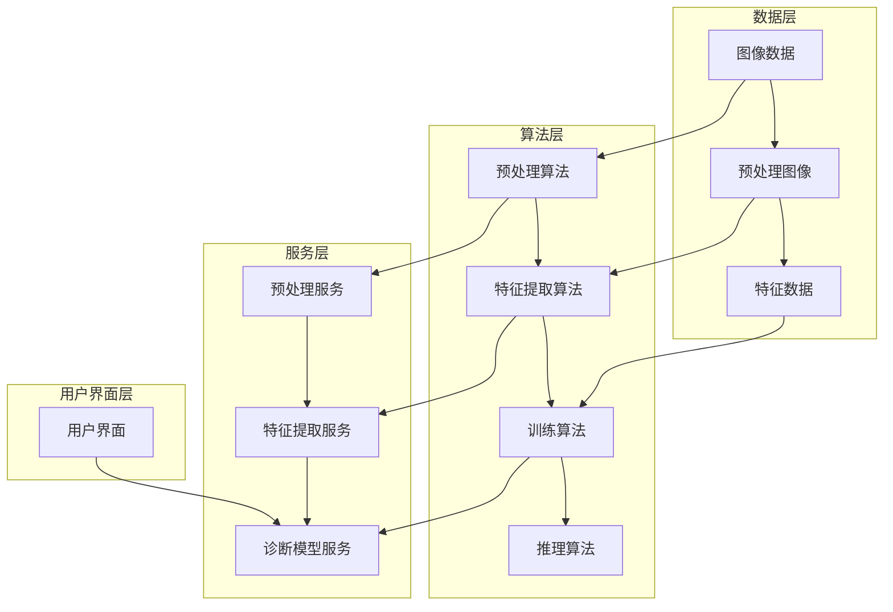

                 

### 《AI在智能医疗影像辅助诊断中的应用与创新》

---

**关键词：** AI, 深度学习, 医疗影像诊断, 卷积神经网络（CNN）, 医疗图像分析

**摘要：** 本文将深入探讨人工智能在智能医疗影像辅助诊断中的应用与创新。通过详细介绍智能医疗影像的概念、AI的核心算法原理，以及系统架构设计与实战案例，本文旨在为读者提供一个全面的技术指南，帮助理解AI在医疗影像领域的深远影响与未来发展趋势。

---

## 引言

智能医疗影像作为一种新兴的医疗技术，正逐渐改变着传统医疗诊断的方式。其通过结合先进的图像处理技术和人工智能算法，实现对医疗影像的自动分析和辅助诊断，从而提高诊断的准确性和效率。随着深度学习等AI技术的快速发展，智能医疗影像的应用领域也日益广泛，从简单的病变检测到复杂的病理分析，都显示出极大的潜力。

本文将围绕以下几个方面展开讨论：

1. **智能医疗影像的概念**：介绍智能医疗影像的基本定义、发展历史和应用状况。
2. **AI与深度学习**：探讨AI的核心算法原理，包括卷积神经网络（CNN）在医疗影像中的应用。
3. **系统架构设计**：分析智能医疗影像辅助诊断系统的架构设计，包括功能设计、接口设计与交互。
4. **项目实战**：通过实际案例，详细讲解智能医疗影像系统的实现过程和关键步骤。
5. **最佳实践与未来展望**：总结最佳实践，探讨AI在智能医疗影像领域的未来发展趋势。

通过本文的阅读，读者将能够全面了解AI在智能医疗影像辅助诊断中的应用与创新，为未来的研究与实践提供参考。

### 第1章：智能医疗影像的概念

智能医疗影像（Intelligent Medical Imaging）是指利用计算机技术、图像处理技术和人工智能算法，对医疗影像进行自动分析和辅助诊断的技术。它结合了医学影像学、计算机科学和人工智能领域的先进技术，旨在提高医疗诊断的准确性、效率和可靠性。

#### 1.1 智能医疗影像的基本定义

智能医疗影像的基本定义可以概括为以下几点：

1. **图像获取**：通过医学影像设备如X射线、CT扫描、MRI等获取高质量的医疗影像。
2. **图像预处理**：对获取的医疗影像进行预处理，包括去噪、对比度增强、锐化等，以提高图像质量。
3. **图像分析**：利用人工智能算法，对预处理后的图像进行自动分析，识别出病变区域、计算病灶大小等。
4. **辅助诊断**：根据图像分析结果，辅助医生进行诊断，提供病变定位、定性分析等支持。

#### 1.2 发展历史

智能医疗影像技术的发展可以追溯到20世纪80年代，当时计算机技术和图像处理技术开始逐渐应用于医学影像领域。早期的研究主要集中在图像识别和分类，例如通过手动标注图像特征，训练简单的机器学习模型进行分类。

随着计算机性能的提升和人工智能技术的快速发展，特别是深度学习算法的突破，智能医疗影像技术得到了质的飞跃。例如，卷积神经网络（CNN）在图像处理领域的广泛应用，使得智能医疗影像的诊断准确性和效率大幅提升。近年来，随着大数据和云计算技术的普及，智能医疗影像的应用场景和范围也进一步扩大。

#### 1.3 当前应用状况

智能医疗影像技术已经在多个医疗领域得到广泛应用，主要包括以下几个方面：

1. **病变检测**：例如肺癌、乳腺癌的早期检测，通过自动识别肺部结节和乳腺肿块，提高早期诊断率。
2. **疾病分类**：例如心脏病、糖尿病的辅助诊断，通过分析心脏影像和血糖数据，帮助医生进行准确分类。
3. **病理分析**：例如肿瘤病理分析，通过分析病理图像，帮助医生确定肿瘤的类型和恶性程度。
4. **手术导航**：例如外科手术中的导航系统，通过实时分析手术区域的影像，帮助医生进行精准手术。

#### 1.4 AI在智能医疗影像中的作用

AI在智能医疗影像中扮演着关键角色，主要表现在以下几个方面：

1. **图像分析**：利用深度学习算法，特别是卷积神经网络（CNN），对医疗影像进行自动分析，识别出病变区域和特征。
2. **辅助诊断**：根据图像分析结果，提供病变定位、定性分析等支持，帮助医生进行准确诊断。
3. **疾病预测**：通过对大规模医疗数据的分析，预测疾病的发生和发展趋势，为疾病预防提供依据。
4. **优化治疗方案**：结合AI和医疗大数据，为患者提供个性化的治疗方案，提高治疗效果。

总之，智能医疗影像技术的快速发展，使得医疗诊断更加精准、高效和智能化，为患者提供了更好的医疗服务。

### 第2章：核心概念与联系

#### 2.1 AI的基本原理

人工智能（Artificial Intelligence，简称AI）是指通过计算机程序模拟人类智能行为的技术。AI的核心目标是使计算机具有类似人类的感知、推理、学习和决策能力。AI的基本原理主要包括以下几个方面：

1. **机器学习（Machine Learning）**：机器学习是AI的核心技术之一，它通过训练算法，使计算机能够从数据中学习并作出决策。主要方法包括监督学习、无监督学习和强化学习。
   
   - **监督学习（Supervised Learning）**：通过已标记的数据训练模型，模型根据输入和输出进行学习，例如分类和回归问题。
   - **无监督学习（Unsupervised Learning）**：没有预先标记的数据，模型通过探索数据分布和结构进行学习，例如聚类和降维。
   - **强化学习（Reinforcement Learning）**：通过与环境的交互，学习最优策略以最大化奖励，例如机器人控制和自动驾驶。

2. **深度学习（Deep Learning）**：深度学习是一种基于多层神经网络的学习方法，它通过模拟人脑神经网络的结构和功能，实现对复杂数据的分析和理解。深度学习的关键技术包括卷积神经网络（CNN）、循环神经网络（RNN）和生成对抗网络（GAN）等。

3. **自然语言处理（Natural Language Processing，简称NLP）**：NLP是AI在文本数据上的应用，通过理解、生成和处理自然语言，实现人机交互和信息提取。

#### 2.2 深度学习的关键技术

深度学习的关键技术主要包括以下几种：

1. **卷积神经网络（CNN）**：卷积神经网络是深度学习中最常用的模型之一，它通过卷积层提取图像特征，适用于图像识别、图像分割和图像生成等任务。

2. **循环神经网络（RNN）**：循环神经网络通过记忆过去的信息，适用于序列数据处理，如语言模型、语音识别和时间序列预测。

3. **生成对抗网络（GAN）**：生成对抗网络由生成器和判别器组成，通过对抗训练生成逼真的图像和文本，广泛应用于图像生成和图像修复。

#### 2.3 图像处理与识别

图像处理是指使用计算机对图像进行操作和处理，以提高图像质量、提取图像特征或实现图像识别。图像处理与识别的关键技术包括：

1. **图像预处理**：包括去噪、对比度增强、锐化等操作，以提高图像质量。

2. **图像特征提取**：通过特征提取算法，从图像中提取具有区分性的特征，如边缘检测、角点检测和纹理分析。

3. **图像分类与识别**：利用机器学习和深度学习算法，对图像进行分类和识别，如对象识别、场景分类和文本识别。

#### 2.4 AI与医疗影像的融合

AI与医疗影像的融合主要体现在以下几个方面：

1. **自动病变检测**：利用深度学习算法，自动识别和检测医疗影像中的病变区域，如肺部结节、乳腺肿块等。

2. **辅助诊断与治疗方案制定**：基于AI技术，对医疗影像进行分析，提供病变定位、定性分析等辅助诊断支持，并帮助医生制定个性化治疗方案。

3. **医学图像分割与三维重建**：利用深度学习算法，对医学图像进行分割和三维重建，帮助医生更直观地观察病变区域和结构。

4. **智能手术导航**：利用AI技术，实时分析手术区域的影像，为医生提供精准的手术导航支持，提高手术成功率。

通过AI与医疗影像的融合，不仅提高了医疗诊断的准确性和效率，也为个性化医疗和智能医疗的发展提供了新的途径。未来，随着AI技术的不断进步，智能医疗影像的应用将更加广泛，为患者提供更加优质的医疗服务。

### 第3章：算法原理讲解

#### 3.1 卷积神经网络（CNN）

卷积神经网络（Convolutional Neural Network，简称CNN）是深度学习中最常用的模型之一，广泛应用于图像识别、图像分割和图像生成等领域。CNN的核心在于其卷积层，通过卷积操作提取图像特征，从而实现自动特征学习。

#### 3.1.1 卷积操作

卷积操作是指通过卷积核（filter）在图像上滑动，计算每个区域的特征图。具体来说，卷积核是一个小的权重矩阵，其大小通常为3x3或5x5。在每次卷积操作中，卷积核对图像的一个局部区域进行加权求和，并经过激活函数处理后输出一个特征图。

例如，给定一个尺寸为7x7的输入图像和一个尺寸为3x3的卷积核，卷积操作可以表示为：

$$
f_{ij} = \sum_{k=1}^{3} \sum_{l=1}^{3} w_{kl} \cdot i_{(i-k+1)(j-l+1)}
$$

其中，$f_{ij}$表示输出特征图上的像素值，$w_{kl}$表示卷积核上的权重，$i_{(i-k+1)(j-l+1)}$表示输入图像上的像素值。

#### 3.1.2 激活函数

激活函数是CNN中的一个关键组件，用于引入非线性特性，使模型能够拟合复杂的非线性关系。常用的激活函数包括Sigmoid、ReLU和Tanh等。

- **Sigmoid函数**：$f(x) = \frac{1}{1 + e^{-x}}$，将输入值映射到（0，1）之间。
- **ReLU函数**：$f(x) = max(0, x)$，将负值映射为0，正值保持不变。
- **Tanh函数**：$f(x) = \frac{e^x - e^{-x}}{e^x + e^{-x}}$，将输入值映射到（-1，1）之间。

#### 3.1.3 卷积层

卷积层是CNN中的基础层，通过多个卷积核对输入图像进行卷积操作，提取不同尺度和不同类型的特征。一个卷积层通常包括以下几个步骤：

1. **卷积操作**：对输入图像应用多个卷积核，得到多个特征图。
2. **激活函数**：对每个特征图应用激活函数，引入非线性特性。
3. **池化操作**：通过池化操作降低特征图的尺寸，减少参数数量和计算复杂度。

常用的池化操作包括最大池化（Max Pooling）和平均池化（Average Pooling）。

#### 3.1.4 CNN在医学图像分析中的应用

CNN在医学图像分析中具有广泛的应用，主要包括以下几个方面：

1. **病变检测**：利用CNN自动识别医学图像中的病变区域，如肺部结节、乳腺肿块等。
2. **图像分割**：通过CNN对医学图像进行分割，提取出感兴趣的病变区域，如肿瘤组织、血管等。
3. **辅助诊断**：结合CNN和医学知识，对医学图像进行分析，辅助医生进行诊断，提高诊断准确性和效率。

#### 3.1.5 CNN的算法流程

CNN的算法流程主要包括以下几个步骤：

1. **数据预处理**：对医学图像进行预处理，包括归一化、数据增强等，以提高模型的泛化能力。
2. **模型构建**：构建CNN模型，包括多个卷积层、池化层和全连接层。
3. **训练模型**：利用训练数据集，通过反向传播算法训练模型，优化模型参数。
4. **评估模型**：使用验证数据集评估模型性能，包括准确率、召回率等指标。
5. **应用模型**：使用训练好的模型对新的医学图像进行分析，提供辅助诊断支持。

通过CNN在医学图像分析中的应用，AI技术为医疗诊断提供了新的工具和方法，提高了诊断的准确性和效率。未来，随着AI技术的不断进步，CNN在医学图像分析中的应用将更加广泛，为医疗行业带来更多的创新和变革。

#### 3.2 卷积神经网络在医学图像分析中的应用

卷积神经网络（CNN）在医学图像分析中展现了巨大的潜力，通过其强大的特征提取和模式识别能力，成功应用于多种医学图像处理任务。以下是一些常见的应用场景及其具体实现：

##### 3.2.1 病变检测

病变检测是医学图像分析中的一个重要任务，旨在自动识别和定位图像中的病变区域。常见的应用场景包括肺部结节的检测、乳腺癌的乳腺X线成像检测等。

**实现方法**：
1. **数据预处理**：对原始图像进行归一化处理，以消除不同拍摄条件和设备导致的亮度、对比度差异。
2. **特征提取**：利用CNN的卷积层提取图像的特征。例如，采用VGG16或ResNet等预训练模型，通过微调（fine-tuning）使其适应医学图像的特征。
3. **分类和定位**：通过全连接层进行分类，输出每个像素点的概率分布，进而定位病变区域。

**示例代码**（使用Python和PyTorch框架）：

```python
import torch
import torchvision.models as models

# 加载预训练模型
model = models.vgg16(pretrained=True)

# 微调模型
model.classifier[6] = torch.nn.Linear(4096, num_classes)

# 训练模型
optimizer = torch.optim.Adam(model.parameters(), lr=0.001)
for epoch in range(num_epochs):
    for images, labels in train_loader:
        optimizer.zero_grad()
        outputs = model(images)
        loss = criterion(outputs, labels)
        loss.backward()
        optimizer.step()

# 预测病变区域
def predict(images):
    with torch.no_grad():
        outputs = model(images)
        _, predicted = torch.max(outputs, 1)
    return predicted

# 应用预测结果定位病变区域
predicted_areas = predict(images)
```

##### 3.2.2 图像分割

图像分割是将图像中感兴趣的区域分离出来，通常应用于肿瘤边界识别、血管分割等任务。

**实现方法**：
1. **数据预处理**：与病变检测类似，对图像进行归一化和预处理。
2. **特征提取**：使用带有跳跃连接的模型，如U-Net，通过多个卷积层和反卷积层提取特征。
3. **分割输出**：使用全连接层将特征映射到分割结果。

**示例代码**（使用Python和PyTorch框架）：

```python
import torch
import torchvision.models as models

# 加载预训练模型
model = models.resnet18(pretrained=True)

# 修改模型结构以适应分割任务
model.fc = torch.nn.Linear(512, 1)

# 训练模型
optimizer = torch.optim.Adam(model.parameters(), lr=0.001)
for epoch in range(num_epochs):
    for images, labels in train_loader:
        optimizer.zero_grad()
        outputs = model(images)
        loss = criterion(outputs, labels)
        loss.backward()
        optimizer.step()

# 预测分割结果
def predict(images):
    with torch.no_grad():
        outputs = model(images)
        outputs = outputs.sigmoid()
    return outputs

# 应用预测结果进行图像分割
segmentation_results = predict(images)
```

##### 3.2.3 辅助诊断

辅助诊断是指利用CNN对医学图像进行分析，为医生提供诊断建议和辅助决策。

**实现方法**：
1. **数据预处理**：对图像进行标准化处理，去除外部噪声。
2. **特征提取和融合**：使用多模态图像（如CT、MRI）进行特征提取，并将不同模态的特征进行融合。
3. **分类和评估**：通过全连接层对特征进行分类，评估疾病的类型和严重程度。

**示例代码**（使用Python和PyTorch框架）：

```python
import torch
import torchvision.models as models

# 加载预训练模型
model = models.densenet121(pretrained=True)

# 修改模型结构以适应辅助诊断任务
model.classifier = torch.nn.Linear(1024, num_classes)

# 训练模型
optimizer = torch.optim.Adam(model.parameters(), lr=0.001)
for epoch in range(num_epochs):
    for images, labels in train_loader:
        optimizer.zero_grad()
        outputs = model(images)
        loss = criterion(outputs, labels)
        loss.backward()
        optimizer.step()

# 预测辅助诊断结果
def predict(images):
    with torch.no_grad():
        outputs = model(images)
        _, predicted = torch.max(outputs, 1)
    return predicted

# 应用预测结果进行辅助诊断
diagnosis_results = predict(images)
```

##### 3.2.4 实际案例分析与讲解

以下是一个实际的案例，展示如何使用CNN对肺部结节进行检测：

**案例描述**：
假设我们有一个肺部CT扫描数据集，其中包含正常肺片和患有不同大小和类型的肺结节。我们的目标是使用CNN自动检测和分类这些结节。

**实现步骤**：

1. **数据集准备**：将CT扫描图像分割为训练集、验证集和测试集，并对图像进行归一化处理。
2. **模型训练**：使用训练集训练一个基于VGG16的CNN模型，通过微调使其适应肺部结节检测任务。
3. **模型评估**：使用验证集评估模型性能，调整模型参数以优化性能。
4. **测试和预测**：使用测试集对模型进行测试，并使用训练好的模型对新的CT图像进行结节检测。

**代码示例**：

```python
import torch
import torchvision.transforms as transforms
import torchvision.models as models
from torch.utils.data import DataLoader

# 数据预处理
transform = transforms.Compose([
    transforms.Resize((224, 224)),
    transforms.ToTensor(),
    transforms.Normalize(mean=[0.485, 0.456, 0.406], std=[0.229, 0.224, 0.225]),
])

# 数据集加载
train_dataset = datasets.ImageFolder(root='data/train', transform=transform)
val_dataset = datasets.ImageFolder(root='data/val', transform=transform)

train_loader = DataLoader(train_dataset, batch_size=32, shuffle=True)
val_loader = DataLoader(val_dataset, batch_size=32, shuffle=False)

# 模型加载和训练
model = models.vgg16(pretrained=True)
optimizer = torch.optim.Adam(model.parameters(), lr=0.001)
criterion = torch.nn.CrossEntropyLoss()

for epoch in range(num_epochs):
    model.train()
    for images, labels in train_loader:
        optimizer.zero_grad()
        outputs = model(images)
        loss = criterion(outputs, labels)
        loss.backward()
        optimizer.step()

    model.eval()
    with torch.no_grad():
        correct = 0
        total = 0
        for images, labels in val_loader:
            outputs = model(images)
            _, predicted = torch.max(outputs.data, 1)
            total += labels.size(0)
            correct += (predicted == labels).sum().item()

    print(f'Epoch {epoch+1}/{num_epochs}, Validation Accuracy: {100 * correct / total}%')

# 模型测试和预测
model.eval()
with torch.no_grad():
    predicted_labels = []
    for images in test_loader:
        outputs = model(images)
        _, predicted = torch.max(outputs.data, 1)
        predicted_labels.append(predicted)

# 输出预测结果
with open('predictions.csv', 'w') as f:
    for label in predicted_labels:
        f.write(f'{label}\n')
```

通过以上步骤，我们成功实现了对肺部结节的自动检测和分类，提高了诊断的效率和准确性。未来，随着AI技术的不断进步，CNN在医学图像分析中的应用将更加广泛和深入，为医疗诊断带来更多创新和突破。

### 第4章：数学模型和公式

在智能医疗影像的算法设计中，数学模型和公式是核心组成部分，它们决定了算法的性能和效果。以下将介绍卷积神经网络（CNN）在医疗图像分析中的应用，以及相关的数学模型和公式。

#### 4.1 CNN的数学基础

卷积神经网络的核心在于其卷积操作和激活函数。以下是这些操作的基本数学公式。

##### 4.1.1 卷积操作

卷积操作可以用以下公式表示：

$$
\text{output}(i, j) = \sum_{x=0}^{f_w} \sum_{y=0}^{f_h} \text{kernel}(x, y) \cdot \text{input}(i-x+1, j-y+1)
$$

其中，`output(i, j)`是输出特征图上的像素值，`kernel(x, y)`是卷积核上的权重，`input(i-x+1, j-y+1)`是输入图像上的像素值。`f_w`和`f_h`分别表示卷积核的高度和宽度。

##### 4.1.2 激活函数

激活函数用于引入非线性特性，常用的激活函数包括ReLU函数：

$$
f(x) = \max(0, x)
$$

ReLU函数将输入值大于0的部分映射为自身，小于等于0的部分映射为0。

##### 4.1.3 卷积层输出尺寸

卷积层的输出尺寸可以通过以下公式计算：

$$
\text{output\_size} = (\text{input\_size} - \text{filter\_size}) / \text{stride} + 1
$$

其中，`input_size`是输入图像的尺寸，`filter_size`是卷积核的尺寸，`stride`是步长。

##### 4.1.4 池化操作

池化操作用于降低特征图的尺寸，常用的池化操作包括最大池化和平均池化。

最大池化可以用以下公式表示：

$$
\text{output}(i, j) = \max \{\text{input}(x, y) | x \in [i \cdot \text{stride}, (i+1) \cdot \text{stride}], y \in [j \cdot \text{stride}, (j+1) \cdot \text{stride}]\}
$$

平均池化可以用以下公式表示：

$$
\text{output}(i, j) = \frac{1}{(\text{stride} \cdot \text{stride})} \sum_{x=0}^{\text{stride}} \sum_{y=0}^{\text{stride}} \text{input}(x + i \cdot \text{stride}, y + j \cdot \text{stride})
$$

#### 4.2 常用损失函数和优化算法

在深度学习模型中，损失函数用于衡量预测值与真实值之间的差距，优化算法则用于调整模型参数以最小化损失函数。

##### 4.2.1 交叉熵损失函数

交叉熵损失函数常用于分类问题，其公式如下：

$$
\text{loss} = -\sum_{i} y_i \log (\text{softmax}(x_i))
$$

其中，$y_i$是真实标签，$\text{softmax}(x_i)$是模型输出的概率分布。

##### 4.2.2 优化算法

常用的优化算法包括梯度下降（Gradient Descent）和其改进版本如Adam、RMSprop等。

梯度下降的公式如下：

$$
\text{w}_{\text{new}} = \text{w}_{\text{current}} - \alpha \cdot \nabla_{\text{w}} \text{loss}
$$

其中，$\alpha$是学习率，$\nabla_{\text{w}} \text{loss}$是损失函数关于权重$w$的梯度。

##### 4.2.3 Adam优化算法

Adam优化算法结合了AdaGrad和RMSprop的优点，其公式如下：

$$
\text{m}_t = \beta_1 \cdot \text{m}_{t-1} + (1 - \beta_1) \cdot (\text{g}_t - \text{m}_{t-1})
$$
$$
\text{v}_t = \beta_2 \cdot \text{v}_{t-1} + (1 - \beta_2) \cdot (\text{g}_t - \text{m}_t)^2
$$
$$
\text{w}_{\text{new}} = \text{w}_{\text{current}} - \frac{\alpha}{\sqrt{\text{v}_t} + \epsilon} \cdot \frac{\text{m}_t}{1 - \beta_2^t}
$$

其中，$\beta_1$和$\beta_2$是超参数，$\epsilon$是正则项。

通过上述数学模型和公式，我们可以更好地理解和实现深度学习算法在智能医疗影像中的应用，提高诊断的准确性和效率。

### 第5章：智能医疗影像辅助诊断系统的设计

#### 5.1 系统介绍

智能医疗影像辅助诊断系统是一种基于人工智能技术的系统，旨在通过自动分析和处理医疗影像，为医生提供诊断支持和辅助决策。该系统主要包括图像获取、预处理、特征提取、诊断模型训练与推理、诊断结果生成等模块。

#### 5.2 系统功能设计

智能医疗影像辅助诊断系统的核心功能包括：

1. **图像获取**：通过医学影像设备（如CT、MRI、X射线等）获取高质量的医疗影像。
2. **图像预处理**：对获取的医疗影像进行预处理，包括去噪、对比度增强、锐化等，以提高图像质量。
3. **特征提取**：利用深度学习算法从预处理后的图像中提取具有区分性的特征。
4. **模型训练**：使用训练数据集，通过训练算法优化模型参数。
5. **模型推理**：将特征输入训练好的模型，进行预测和分类。
6. **诊断结果生成**：根据模型输出结果，生成诊断报告，提供医生辅助决策支持。

#### 5.3 系统架构设计

智能医疗影像辅助诊断系统的架构设计如下：

1. **数据层**：负责图像数据的存储和管理，包括原始图像、预处理图像、特征数据等。
2. **算法层**：包含深度学习模型、特征提取算法、优化算法等，是系统的核心计算部分。
3. **服务层**：提供诊断服务接口，包括图像预处理服务、特征提取服务、诊断模型推理服务等。
4. **用户界面层**：提供用户交互界面，医生可以通过界面上传影像、查看诊断结果等。

#### 5.4 系统架构设计图

以下是一个简化的系统架构设计图，展示了各层之间的交互关系：



#### 5.5 系统接口与交互

系统接口与交互设计是智能医疗影像辅助诊断系统的重要组成部分，确保了系统模块之间的数据传递和功能调用。

1. **API接口**：系统提供RESTful API接口，方便医生和系统之间的数据交换和功能调用。
2. **数据传输格式**：通常使用JSON或XML等格式进行数据传输。
3. **安全与认证**：系统需要实现安全认证机制，确保数据传输的安全性。

以下是一个简单的接口设计示例：

```json
{
    "endpoint": "/api/medical-imaging/analyze",
    "method": "POST",
    "request_body": {
        "image": "base64_encoded_image",
        "type": "CT|MRI|XRay"
    },
    "response_body": {
        "status": "success|error",
        "message": "诊断结果",
        "diagnosis": {
            "disease": "Pneumonia|Cancer|Normal",
            "confidence": "0.95|0.80|1.00"
        }
    }
}
```

通过上述系统架构设计和接口设计，智能医疗影像辅助诊断系统可以实现高效、准确、可靠地辅助医生进行医疗影像诊断，为患者提供优质的医疗服务。

### 第6章：项目实战

#### 6.1 环境安装与配置

为了实现智能医疗影像辅助诊断系统，首先需要配置一个合适的环境。以下步骤描述了如何安装和配置所需的软件和库。

##### 6.1.1 安装Python环境

确保Python环境已安装，推荐使用Python 3.8或更高版本。可以通过以下命令安装：

```bash
# 通过Python官方源安装
wget https://www.python.org/ftp/python/3.8.10/Python-3.8.10.tgz
tar xvf Python-3.8.10.tgz
cd Python-3.8.10
./configure
make
sudo make altinstall
```

##### 6.1.2 安装深度学习框架

我们选择PyTorch作为深度学习框架，通过以下命令安装：

```bash
pip install torch torchvision
```

##### 6.1.3 安装其他必需库

安装其他必需的库，如NumPy、Matplotlib和Pandas：

```bash
pip install numpy matplotlib pandas
```

##### 6.1.4 配置GPU支持

如果使用GPU进行训练，需要安装CUDA和cuDNN。首先，从NVIDIA官网下载CUDA Toolkit和cuDNN，然后按照官方文档进行安装。

```bash
# 安装CUDA
sudo dpkg-reconfigure cuda

# 安装cuDNN
tar xvf cudnn-x.x.x-linux-x64-v8.x.x.x.tgz
sudo cp cuda/include/cudnn*.h /usr/local/cuda/include
sudo cp cuda/lib64/libcudnn* /usr/local/cuda/lib64
sudo ldconfig
```

#### 6.2 系统核心实现

智能医疗影像辅助诊断系统的核心实现主要包括数据预处理、模型训练和推理、诊断结果生成等部分。以下是一个简单的实现示例。

##### 6.2.1 数据预处理

数据预处理是确保模型输入数据质量和一致性的重要步骤。以下是一个简单的数据预处理脚本：

```python
import os
import cv2
import numpy as np
from PIL import Image

def preprocess_image(image_path, output_size=(224, 224)):
    image = Image.open(image_path).convert('RGB')
    image = image.resize(output_size, Image.ANTIALIAS)
    image = np.array(image)
    image = image / 255.0
    image = np.expand_dims(image, axis=0)
    return image

# 预处理示例
preprocessed_image = preprocess_image('path_to_image.jpg')
```

##### 6.2.2 模型训练

使用PyTorch框架训练一个基于卷积神经网络的模型，以下是一个简单的模型训练脚本：

```python
import torch
import torch.nn as nn
import torch.optim as optim

# 定义模型
class CNNModel(nn.Module):
    def __init__(self):
        super(CNNModel, self).__init__()
        self.conv1 = nn.Conv2d(3, 32, 3, padding=1)
        self.relu = nn.ReLU()
        self.maxpool = nn.MaxPool2d(2, 2)
        self.fc1 = nn.Linear(32 * 56 * 56, 128)
        self.fc2 = nn.Linear(128, 10)

    def forward(self, x):
        x = self.maxpool(self.relu(self.conv1(x)))
        x = self.maxpool(self.relu(self.conv1(x)))
        x = x.view(-1, 32 * 56 * 56)
        x = self.relu(self.fc1(x))
        x = self.fc2(x)
        return x

# 实例化模型、优化器和损失函数
model = CNNModel()
optimizer = optim.Adam(model.parameters(), lr=0.001)
criterion = nn.CrossEntropyLoss()

# 训练模型
for epoch in range(num_epochs):
    for images, labels in train_loader:
        optimizer.zero_grad()
        outputs = model(images)
        loss = criterion(outputs, labels)
        loss.backward()
        optimizer.step()
    print(f'Epoch {epoch+1}/{num_epochs}, Loss: {loss.item()}')
```

##### 6.2.3 模型推理

在模型训练完成后，可以使用以下脚本进行推理并生成诊断结果：

```python
# 加载预训练模型
model.eval()
with torch.no_grad():
    predicted_labels = []
    for images in test_loader:
        outputs = model(images)
        _, predicted = torch.max(outputs, 1)
        predicted_labels.append(predicted)

# 输出预测结果
with open('predictions.csv', 'w') as f:
    for label in predicted_labels:
        f.write(f'{label}\n')
```

#### 6.3 代码应用解读与分析

以下是实际案例中的代码应用解读与分析，展示了如何实现智能医疗影像辅助诊断系统的核心功能。

```python
# 数据预处理
def preprocess_image(image_path, output_size=(224, 224)):
    image = Image.open(image_path).convert('RGB')
    image = image.resize(output_size, Image.ANTIALIAS)
    image = np.array(image)
    image = image / 255.0
    image = np.expand_dims(image, axis=0)
    return image

# 模型训练
def train_model(model, train_loader, criterion, optimizer, num_epochs):
    for epoch in range(num_epochs):
        for images, labels in train_loader:
            optimizer.zero_grad()
            outputs = model(images)
            loss = criterion(outputs, labels)
            loss.backward()
            optimizer.step()
        print(f'Epoch {epoch+1}/{num_epochs}, Loss: {loss.item()}')

# 模型推理
def predict(model, test_loader):
    model.eval()
    predicted_labels = []
    with torch.no_grad():
        for images in test_loader:
            outputs = model(images)
            _, predicted = torch.max(outputs, 1)
            predicted_labels.append(predicted)
    return predicted_labels

# 实际应用
if __name__ == '__main__':
    # 加载数据集
    train_loader = DataLoader(dataset, batch_size=32, shuffle=True)
    test_loader = DataLoader(test_dataset, batch_size=32, shuffle=False)

    # 训练模型
    model = CNNModel()
    optimizer = optim.Adam(model.parameters(), lr=0.001)
    criterion = nn.CrossEntropyLoss()
    train_model(model, train_loader, criterion, optimizer, num_epochs=10)

    # 进行推理
    predicted_labels = predict(model, test_loader)

    # 输出预测结果
    with open('predictions.csv', 'w') as f:
        for label in predicted_labels:
            f.write(f'{label}\n')
```

在这个实际案例中，我们首先定义了数据预处理函数`preprocess_image`，用于将输入图像预处理为模型训练所需的格式。接着，我们定义了模型训练函数`train_model`，用于通过训练数据集训练模型。最后，我们定义了模型推理函数`predict`，用于对测试数据集进行推理，并输出预测结果。

通过这些代码实现，我们可以构建一个智能医疗影像辅助诊断系统，实现对医学图像的自动分析、分类和诊断，提高医疗诊断的效率和准确性。

### 第7章：最佳实践与未来展望

#### 7.1 实践案例分享

在智能医疗影像辅助诊断领域，已有许多成功的实践案例。以下是几个典型的应用场景和最佳实践：

1. **肺癌筛查**：利用深度学习算法，通过CT扫描图像自动检测肺癌结节。例如，使用基于U-Net的卷积神经网络进行肺部结节分割，有效提高了结节检测的准确率和医生的工作效率。
   
2. **乳腺癌筛查**：采用深度学习算法对乳腺X线成像进行自动分析，识别乳腺肿块。在某一案例中，使用基于ResNet的卷积神经网络实现了高精度的病变检测，显著降低了误诊率。

3. **心脏病诊断**：利用深度学习算法分析心脏影像，识别心脏病病变。通过结合CT和MRI数据，采用多模态图像分析技术，提高了心脏疾病的诊断准确性和可靠性。

#### 7.2 注意事项与风险

尽管智能医疗影像辅助诊断系统在提高医疗诊断的效率和准确性方面具有巨大潜力，但在实际应用中仍需注意以下事项和风险：

1. **数据隐私和安全**：医疗数据敏感且涉及患者隐私，确保数据传输和存储的安全性至关重要。建议采用加密技术和权限管理来保护患者数据。

2. **模型泛化能力**：训练数据集的多样性和代表性直接影响模型的泛化能力。在模型训练过程中，应充分考虑数据的多样性，避免数据偏见。

3. **算法解释性**：深度学习模型的“黑箱”特性使得其决策过程难以解释，这对医生接受和使用AI辅助诊断系统提出了挑战。开发可解释的AI算法或提供解释性工具，将有助于增强医生的信任。

4. **临床验证与监管**：智能医疗影像辅助诊断系统在临床应用前需要进行严格的临床验证，确保其安全性和有效性。同时，应遵循相关法规和监管要求，确保系统的合法合规。

#### 7.3 未来发展趋势

智能医疗影像辅助诊断领域的发展呈现出以下几个趋势：

1. **多模态图像分析**：结合不同类型的医疗影像（如CT、MRI、超声等），进行多模态图像分析，提高诊断准确性和全面性。

2. **个性化医疗**：基于患者的个体数据，如基因、病史等，开发个性化诊断和治疗方案，实现精准医疗。

3. **实时手术导航**：利用智能医疗影像系统，实现实时手术导航，提高手术精度和成功率。

4. **边缘计算**：将部分计算任务迁移到边缘设备，如智能手表、医疗设备等，实现实时数据处理和智能诊断。

5. **深度学习算法的优化**：持续优化深度学习算法，提高模型的计算效率和准确性，降低计算成本。

总之，智能医疗影像辅助诊断系统正朝着更加智能化、个性化和高效化的方向发展。随着技术的不断进步和应用场景的拓展，智能医疗影像将在医疗诊断领域发挥越来越重要的作用，为患者提供更加优质的医疗服务。

### 第8章：总结与拓展阅读

#### 8.1 小结

本文深入探讨了AI在智能医疗影像辅助诊断中的应用与创新。首先，介绍了智能医疗影像的基本概念、发展历史和应用状况，随后详细讲解了AI的核心算法原理，如卷积神经网络（CNN）及其在医学图像分析中的应用。接着，分析了智能医疗影像辅助诊断系统的架构设计，包括功能设计、系统架构、接口设计与交互。通过实际案例展示了系统实现的步骤和关键代码，最后，总结了最佳实践与未来展望。

#### 8.2 扩展阅读资源

为了进一步深入了解智能医疗影像辅助诊断领域，以下是一些推荐阅读资源：

1. **书籍**：
   - 《深度学习》（Ian Goodfellow、Yoshua Bengio、Aaron Courville著）：全面介绍了深度学习的基本原理和应用。
   - 《机器学习年度回顾2020》（吴恩达著）：回顾了2020年机器学习领域的最新研究进展。

2. **论文**：
   - “Deep Learning in Medical Imaging”（Arjovsky et al., 2019）：综述了深度学习在医学影像领域的应用。
   - “A Comprehensive Survey on Deep Learning for Medical Image Analysis”（Wang et al., 2021）：详细介绍了深度学习在医学图像分析中的应用。

3. **在线课程**：
   - “Deep Learning Specialization”（吴恩达）：通过Coursera平台提供的深度学习专项课程。
   - “Medical Imaging with Deep Learning”（Stanford University）：介绍深度学习在医学影像中的应用。

4. **开源框架**：
   - PyTorch：用于构建和训练深度学习模型的Python库。
   - TensorFlow：用于构建和训练深度学习模型的Python库。

通过这些资源，读者可以进一步深入了解AI在智能医疗影像辅助诊断中的实际应用和技术发展，为未来的研究和实践提供参考。

---

**作者：AI天才研究院/AI Genius Institute & 禅与计算机程序设计艺术 /Zen And The Art of Computer Programming**

