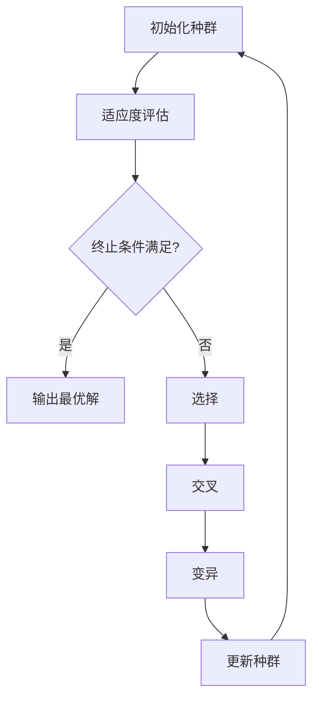
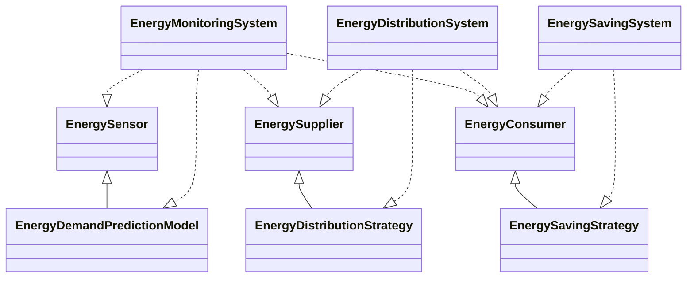
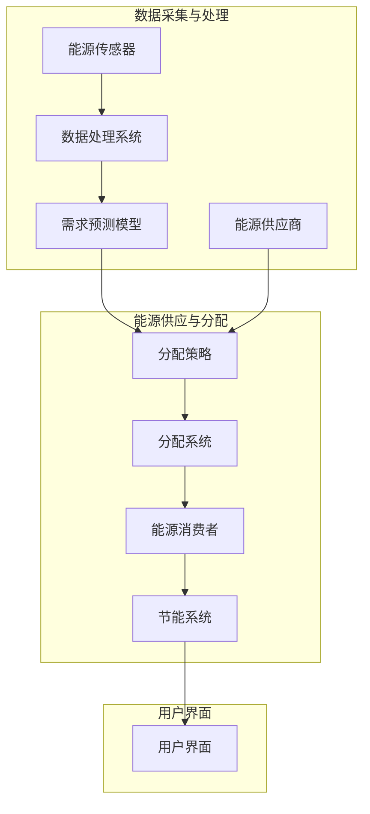
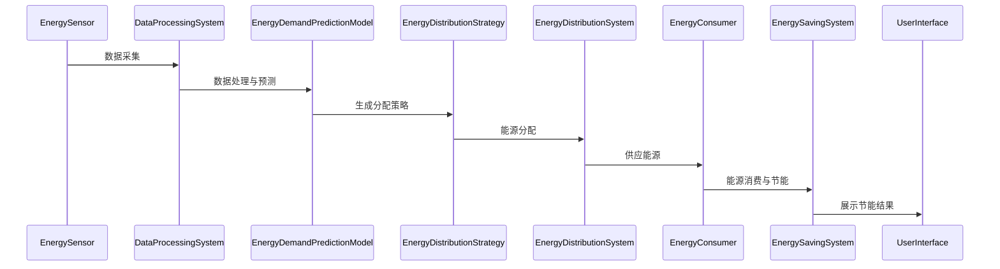
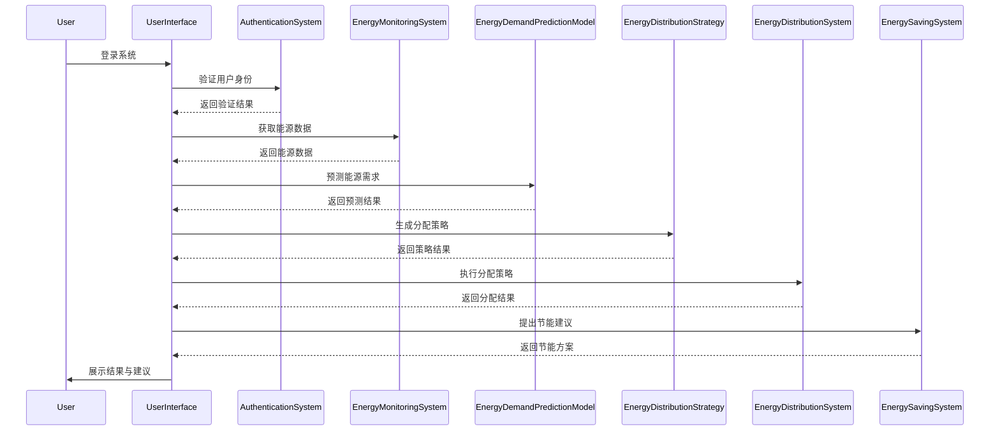

                 


## 引言

随着全球城市化进程的加速，智能城市已经成为各国政府和社会各界关注的焦点。智能城市不仅代表了未来城市发展的方向，更是提高生活质量、实现可持续发展的重要手段。在智能城市的建设过程中，能源分配是一个至关重要的问题。能源的高效、公平分配不仅关乎城市的运行成本，更直接影响市民的生活质量。然而，传统城市的能源分配方式通常缺乏灵活性，难以适应快速变化的能源需求和供应状况。

### 智能城市能源分配的重要性

智能城市能源分配涉及电力、燃气、水等多种能源形式，其核心目标是在满足各种需求的同时，实现能源的最优利用和成本控制。具体而言，智能城市能源分配的重要性体现在以下几个方面：

1. **提升能源利用效率**：通过智能技术，可以实时监控和调整能源的分配，减少浪费，提高能源利用效率。

2. **降低运行成本**：智能能源分配系统能够根据需求和供应情况动态调整，从而降低能源采购和分配的成本。

3. **促进可持续发展**：智能能源分配有助于推广可再生能源，减少对传统化石能源的依赖，推动城市的可持续发展。

4. **提高城市安全性**：智能能源系统能够及时发现并处理故障，降低能源供应中断的风险。

### 能源分配中的挑战

尽管智能城市能源分配具有显著的优势，但其实现过程中也面临着诸多挑战：

1. **多目标优化问题**：智能城市能源分配需要考虑多个目标，如能源效率、成本控制、公平性等，这些目标往往是相互冲突的。如何有效地平衡和优化这些目标是一个重要的课题。

2. **数据采集与处理**：智能能源分配依赖于大量的实时数据，如能源需求、供应能力、市场价格等。如何高效地采集、处理和分析这些数据，是系统成功的关键。

3. **技术复杂性**：智能城市能源分配涉及多种技术，包括传感器网络、云计算、大数据分析、人工智能等。如何整合这些技术，实现系统的高效运行，是一个挑战。

4. **政策与法规**：智能城市能源分配的实施需要政策支持和法规保障。不同国家和地区的政策、法规存在差异，如何适应和遵循这些法规，是实施过程中需要考虑的问题。

### 多目标优化概述

多目标优化（Multi-Objective Optimization，简称MOO）是一种在多个目标之间寻求平衡的方法，旨在同时满足多个相互冲突的目标。在智能城市能源分配中，多目标优化尤为重要，因为它可以帮助决策者在复杂的能源分配环境中做出最优的决策。

### 多目标优化的定义

多目标优化是指在一个决策问题中，同时追求多个目标的优化过程。这些目标可能包括但不限于：

- 能源效率
- 成本最小化
- 公平性
- 可持续性

### 多目标优化模型

多目标优化模型由以下几部分组成：

1. **目标函数**：定义了需要优化的目标，通常用数学函数表示。
2. **约束条件**：规定了在优化过程中需要满足的限制条件。
3. **决策变量**：变量表示决策问题中可以调整的参数。

### 多目标优化方法

多目标优化方法多种多样，常见的包括：

- **加权法**：将各个目标权重进行加权，得到一个单一的目标函数。
- **Pareto前端法**：寻找Pareto前端解，这些解在多个目标之间达到了平衡。
- **多目标遗传算法**：通过遗传算法寻找多个目标之间的平衡解。

### 多目标优化的挑战

多目标优化面临的挑战主要包括：

- **目标冲突**：不同目标之间存在冲突，难以同时优化。
- **非凸性**：目标函数和约束条件可能具有非凸性，增加了优化的复杂性。
- **计算资源**：多目标优化通常需要大量的计算资源，特别是在大规模问题上。

### AI在智能城市中的应用

人工智能（AI）在智能城市能源分配中扮演着关键角色，通过利用AI技术，可以实现更智能、更高效的能源分配系统。

### AI技术的核心优势

- **数据分析**：AI技术能够处理和分析大量复杂的数据，提供精准的能源需求预测和供应分析。
- **自动化决策**：AI可以自动化执行复杂的决策过程，提高能源分配的响应速度和准确性。
- **自适应学习**：AI系统能够通过不断学习和优化，适应能源分配环境的变化。

### AI在智能城市中的案例研究

- **智能电网**：通过AI技术优化电网运行，实现电力供需平衡，降低能源浪费。
- **能源需求预测**：利用AI分析历史数据，预测未来的能源需求，帮助决策者提前做好准备。
- **节能减排**：AI技术可以帮助识别能源消耗中的浪费点，提出节能减排方案。

### 本章小结

本章介绍了智能城市能源分配的重要性、挑战以及多目标优化的基本概念。通过分析，我们发现多目标优化在智能城市能源分配中具有至关重要的意义。接下来，我们将进一步探讨多目标优化的核心概念与原理，并引入人工智能技术在其中的应用。这不仅有助于理解智能城市能源分配的系统架构，也为未来的研究和实践提供了新的思路。

---

## 第2章：核心概念与原理

在本章中，我们将深入探讨智能城市能源分配中的核心概念和原理，包括多目标优化理论、AI相关概念以及智能城市能源分配中的关键要素。通过理解这些概念，我们将为后续章节的多目标优化算法介绍和系统设计与实现打下坚实的基础。

### 2.1 多目标优化理论

多目标优化理论是智能城市能源分配中的关键组成部分。它涉及到如何在一个包含多个相互冲突目标的决策问题中找到最优解。下面我们将详细讨论多目标优化的定义、模型、方法以及面临的挑战。

#### 2.1.1 多目标优化的定义

多目标优化是指在一个决策问题中，同时追求多个目标的优化过程。这些目标可能包括但不限于能源效率、成本最小化、公平性和可持续性。多目标优化的核心是在这些目标之间寻求平衡，以找到一组解，这些解能够在多个目标之间达到某种程度的平衡。

#### 2.1.2 多目标优化模型

一个典型的多目标优化模型包括以下组成部分：

- **目标函数**：表示需要优化的目标，通常用数学函数表示。在多目标优化中，可能有多个目标函数，它们之间可能存在冲突。
- **决策变量**：表示决策者可以调整的参数，它们决定了最终解决方案的具体特征。
- **约束条件**：规定了在优化过程中需要满足的限制条件，这些条件可以是等式或不等式。

一个简单的多目标优化模型可以表示为：

$$
\begin{aligned}
\text{minimize} \quad f(x) \\
\text{subject to} \quad g_i(x) \leq 0, \quad h_j(x) = 0 \\
\end{aligned}
$$

其中，$f(x)$ 是目标函数，$g_i(x)$ 和 $h_j(x)$ 是约束条件。

#### 2.1.3 多目标优化方法

多目标优化方法种类繁多，以下是几种常见的方法：

1. **加权法**：将各个目标权重进行加权，得到一个单一的目标函数。这种方法简单但可能无法很好地平衡多个目标。
2. **Pareto前端法**：寻找Pareto前端解，这些解在多个目标之间达到了平衡。Pareto前端是一组非支配解，任何非Pareto前端解都可以通过线性组合被改善。
3. **多目标遗传算法**（MOGA）：利用遗传算法的进化策略来寻找Pareto前端解。遗传算法通过交叉、变异和选择等操作来优化解。
4. **粒子群优化**（PSO）：通过模拟鸟群或鱼群的社会行为来寻找最优解。粒子群优化通过更新每个粒子的速度和位置来逐步改进解。
5. **蚁群算法**：模拟蚂蚁在寻找食物过程中的行为来优化问题。蚁群算法通过更新路径概率来寻找最优路径。

#### 2.1.4 多目标优化的挑战

多目标优化面临的主要挑战包括：

1. **目标冲突**：不同目标之间可能存在冲突，例如提高能源效率可能增加成本。
2. **非凸性**：目标函数和约束条件可能具有非凸性，增加了优化的复杂性。
3. **计算资源**：多目标优化通常需要大量的计算资源，特别是在大规模问题上。

### 2.2 AI相关概念

人工智能（AI）技术在智能城市能源分配中扮演着重要角色。以下我们将介绍AI技术的核心概念，包括机器学习基础、深度学习原理、神经网络结构和强化学习与优化。

#### 2.2.1 机器学习基础

机器学习是AI的核心技术之一，它通过利用数据来训练模型，从而进行预测和决策。机器学习的基本流程包括：

1. **数据收集**：收集相关数据，这些数据可以来自传感器、历史记录等。
2. **数据预处理**：清洗、转换和规范化数据，以消除噪声和异常值。
3. **模型选择**：选择合适的模型，例如线性回归、决策树、神经网络等。
4. **模型训练**：利用训练数据训练模型，调整模型参数。
5. **模型评估**：使用测试数据评估模型性能，调整模型参数。

#### 2.2.2 深度学习原理

深度学习是一种特殊的机器学习技术，它通过模拟人脑神经网络结构进行学习。深度学习的关键概念包括：

1. **神经网络**：神经网络由多个层次组成，包括输入层、隐藏层和输出层。每一层都包含多个神经元，神经元之间通过权重连接。
2. **激活函数**：激活函数用于引入非线性，使神经网络能够处理复杂问题。
3. **反向传播**：反向传播算法用于更新神经网络中的权重，以提高模型性能。
4. **优化算法**：常用的优化算法包括随机梯度下降（SGD）、Adam等。

#### 2.2.3 神经网络结构

神经网络结构包括多个层次，每一层都有不同的功能：

1. **输入层**：接收外部输入，如传感器数据。
2. **隐藏层**：对输入数据进行处理和变换。
3. **输出层**：产生最终输出，如预测结果。

#### 2.2.4 强化学习与优化

强化学习是一种通过交互环境来学习策略的机器学习技术。在强化学习中，智能体（agent）通过与环境的交互，学习如何在给定的策略下最大化累积回报。强化学习与优化的关系在于，优化问题可以通过强化学习来求解。

1. **策略**：策略是智能体在给定状态下采取的行动。
2. **状态**：状态是智能体在环境中的当前情况。
3. **动作**：动作是智能体根据策略在某个状态下采取的具体行动。
4. **回报**：回报是智能体在执行动作后获得的奖励或惩罚。

### 2.3 智能城市能源分配的核心要素

智能城市能源分配涉及多个核心要素，包括能源需求预测、能源供应分配和能源消费优化。以下是对这些要素的详细探讨。

#### 2.3.1 能源需求预测

能源需求预测是智能城市能源分配的重要环节。通过利用历史数据和AI技术，可以预测未来的能源需求。能源需求预测的准确性对于优化能源分配具有重要意义。

1. **数据收集**：收集历史能源消耗数据，包括电力、燃气、水等。
2. **特征工程**：提取与能源需求相关的特征，如天气、人口流动等。
3. **模型选择**：选择合适的预测模型，如时间序列分析、回归分析等。
4. **模型训练与评估**：训练预测模型，并使用测试数据评估模型性能。

#### 2.3.2 能源供应分配

能源供应分配是指在满足能源需求的同时，优化能源的供应。这涉及到能源来源的选择、能源转换和分配策略。

1. **能源来源**：包括传统化石能源、可再生能源（如太阳能、风能）等。
2. **能源转换**：将一种能源形式转换为另一种能源形式，如将电力转换为热能。
3. **分配策略**：根据能源需求和供应情况，制定合理的能源分配策略。

#### 2.3.3 能源消费优化

能源消费优化旨在降低能源消耗，提高能源利用效率。通过利用AI技术，可以识别能源消耗中的浪费点，并提出优化方案。

1. **能耗监测**：实时监测能源消耗情况，识别浪费点。
2. **优化算法**：利用优化算法，如多目标优化、深度强化学习等，提出优化方案。
3. **实施与评估**：实施优化方案，并评估其效果。

### 2.4 核心概念对比与联系

#### 2.4.1 多目标优化与AI的关系

多目标优化与AI技术有着密切的联系。AI技术，尤其是机器学习和深度学习，为多目标优化提供了强大的工具和方法。通过AI技术，可以构建复杂的优化模型，处理大量数据，并快速找到最优解。

1. **数据驱动**：AI技术依赖于大量数据，这为多目标优化提供了基础。
2. **自动化**：AI技术可以实现自动化的优化过程，减少人工干预。
3. **自适应**：AI系统能够通过学习和适应，优化能源分配策略。

#### 2.4.2 智能城市能源分配中的关键问题

在智能城市能源分配中，关键问题包括：

1. **数据质量**：数据质量是预测和优化的基础，需要确保数据准确、可靠。
2. **计算资源**：多目标优化和AI技术需要大量的计算资源，特别是在大规模问题上。
3. **决策支持**：优化结果需要被决策者理解和应用，需要提供直观的决策支持。

### 本章小结

本章介绍了智能城市能源分配中的核心概念和原理，包括多目标优化理论、AI相关概念以及智能城市能源分配中的关键要素。通过对比分析，我们发现了多目标优化与AI技术的紧密联系。在下一章中，我们将进一步探讨多目标优化算法在智能城市能源分配中的应用，并通过具体的算法原理讲解和Python代码实现，帮助读者深入理解多目标优化在能源分配中的实际应用。

---

## 第3章：多目标优化算法在智能城市能源分配中的应用

在智能城市能源分配中，多目标优化算法起着至关重要的作用。这些算法能够帮助我们在多个相互冲突的目标之间找到平衡点，从而实现能源的高效、公平和可持续分配。本章将介绍几种常见的多目标优化算法，并深入探讨其在智能城市能源分配中的应用。

### 3.1 算法介绍

多目标优化算法种类繁多，每种算法都有其独特的优势和适用场景。以下将介绍几种常见的多目标优化算法，包括遗传算法、粒子群优化和蚁群算法。

#### 3.1.1 算法分类与选择

1. **遗传算法（GA）**：基于自然进化原理，通过选择、交叉和变异等操作来优化解。适用于复杂、非线性、多峰问题。
2. **粒子群优化（PSO）**：模拟鸟群或鱼群的社会行为，通过更新粒子的速度和位置来寻找最优解。适用于简单、高维问题。
3. **蚁群算法（ACO）**：模拟蚂蚁寻找食物的过程，通过更新路径概率来寻找最优路径。适用于路径优化和组合优化问题。

#### 3.1.2 多目标优化算法特点

1. **遗传算法（GA）**：
   - **优点**：强大的全局搜索能力，适用于复杂、非线性问题。
   - **缺点**：计算时间较长，对参数选择敏感。
2. **粒子群优化（PSO）**：
   - **优点**：简单易实现，收敛速度快。
   - **缺点**：可能陷入局部最优，对参数调整要求高。
3. **蚁群算法（ACO）**：
   - **优点**：适用于复杂路径优化问题，具有较强的鲁棒性。
   - **缺点**：计算复杂度高，需要大量计算资源。

### 3.2 算法原理讲解

在本节中，我们将详细讲解遗传算法（GA）在智能城市能源分配中的应用，包括基本原理、Mermaid流程图、Python实现、数学模型和公式，以及举例说明。

#### 3.2.1 遗传算法的基本原理

遗传算法（GA）是一种基于自然进化原理的优化算法。其基本思想是通过模拟生物进化过程中的选择、交叉和变异等操作来优化解。遗传算法的基本步骤如下：

1. **初始化种群**：随机生成一组初始解作为种群。
2. **适应度评估**：评估每个解的适应度，适应度高的解被选中。
3. **选择**：从种群中选择适应度高的个体，用于生成下一代。
4. **交叉**：随机选择两个个体进行交叉，生成新的个体。
5. **变异**：对个体进行变异操作，引入新的遗传基因。
6. **更新种群**：将交叉和变异后的个体组成新的种群。
7. **迭代**：重复上述步骤，直到满足终止条件（如达到最大迭代次数或找到满意解）。

#### 3.2.2 Mermaid流程图

下面是一个简单的遗传算法（GA）流程图：



#### 3.2.3 Python实现

以下是一个简单的遗传算法（GA）的Python代码实现：

```python
import random
import numpy as np

# 初始化种群
def initialize_population(pop_size, chromosome_length):
    return np.random.uniform(0, 1, (pop_size, chromosome_length))

# 适应度评估
def fitness_function(solution):
    # 这里用一个简单的适应度函数，实际应用中应根据具体问题定义
    return np.sum(solution)

# 选择
def selection(population, fitnesses, num_parents):
    parents = random.choices(population, weights=fitnesses, k=num_parents)
    return parents

# 交叉
def crossover(parents, crossover_rate):
    if random.random() < crossover_rate:
        crossover_point = random.randint(1, len(parents[0]) - 1)
        child1 = parents[0][:crossover_point] + parents[1][crossover_point:]
        child2 = parents[1][:crossover_point] + parents[0][crossover_point:]
    else:
        child1, child2 = parents
    return child1, child2

# 变异
def mutation(solution, mutation_rate):
    for i in range(len(solution)):
        if random.random() < mutation_rate:
            solution[i] = random.uniform(0, 1)
    return solution

# 遗传算法
def genetic_algorithm(pop_size, chromosome_length, num_generations, crossover_rate, mutation_rate):
    population = initialize_population(pop_size, chromosome_length)
    for _ in range(num_generations):
        fitnesses = np.apply_along_axis(fitness_function, 1, population)
        parents = selection(population, fitnesses, pop_size)
        for i in range(0, pop_size, 2):
            child1, child2 = crossover(parents[i:i+2], crossover_rate)
            population[i], population[i+1] = mutation(child1, mutation_rate), mutation(child2, mutation_rate)
    return population, fitnesses

# 运行遗传算法
pop_size = 100
chromosome_length = 10
num_generations = 100
crossover_rate = 0.7
mutation_rate = 0.01

population, fitnesses = genetic_algorithm(pop_size, chromosome_length, num_generations, crossover_rate, mutation_rate)
```

#### 3.2.4 数学模型与公式

遗传算法的数学模型可以表示为：

$$
\begin{aligned}
\text{初始化} \quad x_0 = \{x_1^0, x_2^0, ..., x_n^0\} \\
\text{适应度函数} \quad f(x) \\
\text{选择概率} \quad p_s = \frac{f(x)}{\sum_{i=1}^{n} f(x_i)} \\
\text{交叉概率} \quad p_c \\
\text{变异概率} \quad p_m \\
\end{aligned}
$$

#### 3.2.5 举例说明

假设我们有以下问题：需要在10个城市之间分配10个能源站，目标是使每个城市的能源需求得到满足，同时最小化能源运输成本。

1. **初始种群**：每个城市的能源需求量随机分配给10个能源站。
2. **适应度评估**：适应度函数可以定义为能源需求的满足程度和运输成本的总和。
3. **选择**：根据适应度函数，选择适应度较高的能源分配方案。
4. **交叉**：随机选择两个能源分配方案进行交叉，生成新的分配方案。
5. **变异**：对能源分配方案进行变异，引入新的分配策略。
6. **迭代**：重复上述步骤，直到找到最优的能源分配方案。

### 3.3 遗传算法变体

除了基本的遗传算法，还有许多变体，如多目标遗传算法（MOGA）和遗传规划算法（PGA）。以下是这些变体的简要介绍：

#### 3.3.1 多目标遗传算法（MOGA）

多目标遗传算法（MOGA）是遗传算法的一种扩展，用于解决多目标优化问题。MOGA通过引入Pareto前沿概念，同时优化多个目标。

1. **Pareto前沿**：Pareto前沿是一组非支配解，任何非Pareto前沿解都可以通过线性组合被改善。
2. **非支配排序**：将种群中的解按照非支配关系排序，保留非支配解。
3. **多目标适应度函数**：定义多目标适应度函数，用于评估解的优劣。

#### 3.3.2 遗传规划算法（PGA）

遗传规划算法（PGA）是一种基于遗传算法的编程方法，用于自动生成计算机程序。PGA通过遗传操作（如交叉、变异和选择）来优化程序的结构和功能。

1. **编码**：将程序代码编码为染色体，每个染色体表示一个可能的解。
2. **适应度评估**：评估程序代码的性能，如执行时间、内存使用等。
3. **交叉与变异**：对程序代码进行交叉和变异操作，以生成新的程序代码。

### 3.4 其他多目标优化算法

除了遗传算法，还有其他多种多目标优化算法，如粒子群优化（PSO）和蚁群算法（ACO）。以下是这些算法的简要介绍：

#### 3.4.1 粒子群优化（PSO）

粒子群优化（PSO）是一种基于群体智能的优化算法，通过模拟鸟群或鱼群的社会行为来寻找最优解。

1. **粒子**：每个粒子代表一个可能的解，具有位置和速度。
2. **全局最优和个体最优**：每个粒子跟踪其自身历史最优位置和全局最优位置。
3. **更新规则**：通过更新粒子的位置和速度，逐步优化解。

#### 3.4.2 蚁群算法（ACO）

蚁群算法（ACO）是一种基于蚂蚁群体寻找食物路径的优化算法，通过更新路径概率来寻找最优路径。

1. **信息素**：蚂蚁在路径上留下信息素，信息素浓度越高，路径越可能被其他蚂蚁选择。
2. **更新规则**：通过更新路径上的信息素浓度，逐步优化路径。

### 3.5 AI与多目标优化算法的结合

近年来，人工智能技术在多目标优化算法中的应用越来越广泛。以下是一些结合AI技术的多目标优化算法：

#### 3.5.1 深度学习在多目标优化中的应用

深度学习在多目标优化中的应用主要体现在两个方面：

1. **模型预测**：利用深度学习模型预测目标函数和约束条件，以提高优化过程的效率。
2. **算法加速**：通过训练深度学习模型来加速优化算法，如使用生成对抗网络（GAN）来加速遗传算法。

#### 3.5.2 强化学习与多目标优化

强化学习与多目标优化的结合主要体现在以下几个方面：

1. **策略优化**：利用强化学习算法优化决策策略，以提高优化问题的性能。
2. **自适应优化**：利用强化学习算法实现自适应优化，根据环境变化调整优化策略。

### 3.6 算法总结

多目标优化算法在智能城市能源分配中发挥着重要作用。遗传算法、粒子群优化和蚁群算法等算法为解决复杂的多目标优化问题提供了有效的工具。结合AI技术，如深度学习和强化学习，可以进一步提高优化算法的性能和效率。在下一章中，我们将进一步探讨智能城市能源分配系统的设计与实现，为实际应用提供具体的解决方案。

---

## 第4章：智能城市能源分配系统设计与实现

在本章中，我们将探讨智能城市能源分配系统的设计与实现。这一系统旨在通过高效、智能的方式来管理城市中的能源资源，确保能源的合理分配和使用。以下是系统的场景介绍、项目介绍、系统功能设计、系统架构设计、系统接口设计和系统交互设计等内容。

### 4.1 系统场景介绍

智能城市能源分配系统的主要目标是实现城市中电力、燃气、水等能源资源的高效分配和管理。该系统需要实时收集和处理大量的能源数据，并根据这些数据动态调整能源供应和分配策略，以满足不同区域和用户的需求。具体场景包括：

1. **数据采集**：通过传感器网络实时监测城市各区域的能源消耗情况。
2. **需求预测**：利用历史数据和机器学习模型预测未来的能源需求。
3. **供应分配**：根据需求和供应情况，优化能源的分配和调度。
4. **节能管理**：识别能源消耗中的浪费点，并提出节能方案。

### 4.2 项目介绍

本项目的目标是构建一个智能城市能源分配系统，以提高能源利用效率，降低运营成本，并实现可持续发展。项目的主要功能包括：

1. **能源需求预测**：利用机器学习模型预测未来能源需求。
2. **能源供应管理**：管理不同能源来源的供应情况，并优化分配策略。
3. **节能管理**：识别能源浪费点，并提出优化方案。
4. **用户界面**：提供用户友好的界面，方便用户查看和管理能源数据。

### 4.3 系统功能设计

系统功能设计是构建智能城市能源分配系统的关键步骤。以下是对各功能模块的详细描述：

#### 4.3.1 领域模型

领域模型用于描述系统中各实体及其关系。以下是一个简单的领域模型，使用Mermaid类图表示：



#### 4.3.2 功能模块设计

1. **能源监测模块**：
   - 功能：实时采集能源消耗数据。
   - 关键技术：传感器网络、数据采集与处理。

2. **需求预测模块**：
   - 功能：预测未来能源需求。
   - 关键技术：机器学习、时间序列分析。

3. **供应管理模块**：
   - 功能：管理能源供应情况。
   - 关键技术：数据库管理、能源调度算法。

4. **分配策略模块**：
   - 功能：优化能源分配策略。
   - 关键技术：多目标优化、深度学习。

5. **节能管理模块**：
   - 功能：识别能源浪费点，提出优化方案。
   - 关键技术：数据挖掘、节能算法。

6. **用户界面模块**：
   - 功能：提供用户友好的界面。
   - 关键技术：前端开发、数据可视化。

### 4.4 系统架构设计

系统架构设计是构建智能城市能源分配系统的基础。以下是一个简单的系统架构图，使用Mermaid架构图表示：



#### 4.4.1 系统接口设计

系统接口设计是确保各功能模块之间高效协作的关键。以下是一个简单的系统接口设计，使用Mermaid序列图表示：



### 4.5 系统交互设计

系统交互设计是确保用户与系统之间流畅交互的关键。以下是一个简单的系统交互设计，使用Mermaid序列图表示：



### 4.6 系统实现与测试

系统实现与测试是确保系统功能正常运行的关键步骤。以下是对系统实现与测试的简要描述：

1. **系统实现**：
   - 数据采集与处理：使用传感器网络和数据处理系统实时收集和处理能源数据。
   - 需求预测：使用机器学习模型进行能源需求预测。
   - 能源供应与分配：根据需求预测和供应情况，优化能源分配策略。
   - 节能管理：识别能源浪费点，提出节能方案。
   - 用户界面：开发用户友好的界面，提供实时数据和交互功能。

2. **系统测试**：
   - 单元测试：对每个功能模块进行单元测试，确保其正常运行。
   - 集成测试：对系统整体进行集成测试，验证功能模块之间的协作。
   - 性能测试：测试系统在高负载下的性能表现，确保系统稳定可靠。

### 4.7 系统小结

智能城市能源分配系统通过高效的数据采集、处理和预测，实现了能源的高效、公平和可持续分配。该系统的设计与实现不仅解决了能源分配中的多目标优化问题，还提高了能源利用效率，降低了运营成本。通过用户友好的界面，用户可以方便地查看和管理能源数据，实现节能管理。未来，我们将继续优化系统功能，提高系统的智能化和自动化水平，为智能城市建设提供更强大的支持。

---

## 第5章：智能城市能源分配项目实战

在上一章中，我们介绍了智能城市能源分配系统的设计与实现。在本章中，我们将通过一个实际项目，详细讲解系统的安装与配置、核心实现部分、代码解读与分析、实际案例分析以及项目小结。

### 5.1 环境安装与配置

为了构建一个智能城市能源分配系统，我们需要准备以下环境：

1. **操作系统**：Ubuntu 18.04 LTS 或 Windows 10
2. **编程语言**：Python 3.8 或更高版本
3. **依赖库**：NumPy、Pandas、Scikit-learn、Matplotlib、Django（用于Web开发）
4. **数据库**：MySQL 或 PostgreSQL
5. **虚拟环境**：使用`venv`或`conda`创建虚拟环境

以下是安装与配置的步骤：

1. **安装操作系统**：选择合适的操作系统进行安装。
2. **安装Python**：从Python官方网站下载并安装Python。
3. **安装依赖库**：使用pip命令安装所需的依赖库。
   ```bash
   pip install numpy pandas scikit-learn matplotlib django mysql-connector-python
   ```
4. **创建虚拟环境**：在终端中创建一个虚拟环境。
   ```bash
   python -m venv env
   source env/bin/activate
   ```
5. **配置数据库**：安装并配置MySQL或PostgreSQL数据库，创建数据库和用户。
6. **配置Web服务器**：安装并配置Django的Web服务器。

### 5.2 系统核心实现

在系统核心实现部分，我们将重点介绍能源需求预测模块、能源供应管理模块和节能管理模块的实现。

#### 5.2.1 能源需求预测模块

能源需求预测模块的核心是机器学习模型。以下是一个简单的Python代码实现：

```python
import numpy as np
from sklearn.ensemble import RandomForestRegressor
from sklearn.model_selection import train_test_split
from sklearn.metrics import mean_squared_error

# 加载数据
data = np.loadtxt('energy_data.csv', delimiter=',')
X = data[:, :-1]
y = data[:, -1]

# 划分训练集和测试集
X_train, X_test, y_train, y_test = train_test_split(X, y, test_size=0.2, random_state=42)

# 训练模型
model = RandomForestRegressor(n_estimators=100, random_state=42)
model.fit(X_train, y_train)

# 预测
y_pred = model.predict(X_test)

# 评估
mse = mean_squared_error(y_test, y_pred)
print(f'Mean Squared Error: {mse}')
```

#### 5.2.2 能源供应管理模块

能源供应管理模块涉及数据库操作和能源调度算法。以下是一个简单的Python代码实现：

```python
import mysql.connector

# 连接数据库
conn = mysql.connector.connect(
    host='localhost',
    user='root',
    password='password',
    database='energy_distribution'
)

# 查询供应情况
cursor = conn.cursor()
cursor.execute('SELECT * FROM energy_supply')
supply_data = cursor.fetchall()

# 能源调度算法（示例）
def energy_scheduling(supply_data):
    # 根据供应情况和需求进行调度
    # 这里仅作为示例，实际应用中需要更复杂的调度策略
    scheduled_supply = []
    for supply in supply_data:
        if supply[1] > supply[2]:  # 如果供应量大于需求量
            scheduled_supply.append(supply[1])  # 调度为需求量
        else:
            scheduled_supply.append(supply[1])  # 调度为供应量
    return scheduled_supply

scheduled_supply = energy_scheduling(supply_data)

# 插入调度结果到数据库
cursor.execute('INSERT INTO scheduled_supply (supply_id, quantity) VALUES (%s, %s)', (supply_data[0][0], scheduled_supply[0]))
conn.commit()
```

#### 5.2.3 节能管理模块

节能管理模块的核心是数据挖掘和节能算法。以下是一个简单的Python代码实现：

```python
import pandas as pd
from sklearn.cluster import KMeans

# 加载能耗数据
energy_data = pd.read_csv('energy_consumption_data.csv')

# 数据预处理
X = energy_data.values

# 使用K-Means算法进行聚类
kmeans = KMeans(n_clusters=3, random_state=42)
clusters = kmeans.fit_predict(X)

# 根据聚类结果，识别节能潜力
def identify_saving_potential(clusters):
    saving_potential = []
    for cluster in clusters:
        if cluster == 0:  # 第一类为节能潜力较高
            saving_potential.append(energy_data.iloc[clusters == cluster])
    return saving_potential

saving_potential = identify_saving_potential(clusters)

# 提出节能建议
def propose_saving_suggestions(saving_potential):
    suggestions = []
    for potential in saving_potential:
        # 根据实际需求，提出节能建议
        # 这里仅作为示例，实际应用中需要更详细的建议
        suggestions.append("关闭不必要的设备")
    return suggestions

suggestions = propose_saving_suggestions(saving_potential)
print(suggestions)
```

### 5.3 实际案例分析

在本节中，我们将通过一个实际案例，展示如何使用智能城市能源分配系统进行能源管理和优化。

#### 5.3.1 案例背景

某城市计划建设一个新的智能城市能源分配系统，该系统需要满足以下需求：

1. 实时监测城市各区域的能源消耗情况。
2. 预测未来能源需求，并优化能源分配策略。
3. 识别能源浪费点，并提出节能方案。

#### 5.3.2 案例分析

1. **数据采集**：通过传感器网络，实时监测城市各区域的电力、燃气、水等能源消耗情况。数据以CSV文件形式存储。

2. **需求预测**：使用上一章中提到的机器学习模型，对能源需求进行预测。预测结果用于优化能源分配策略。

3. **能源供应管理**：根据能源需求和供应情况，使用能源调度算法优化能源分配。调度结果存储在数据库中。

4. **节能管理**：使用K-Means聚类算法识别能源浪费点，并提出节能方案。节能建议通过Web界面展示给用户。

#### 5.3.3 案例实施步骤

1. **数据采集**：安装传感器设备，并确保数据实时传输到服务器。

2. **需求预测**：使用Python脚本对数据进行处理，训练机器学习模型，并生成预测结果。

3. **能源供应管理**：开发能源调度算法，并将其集成到系统中。确保系统能够实时获取能源需求和供应情况，并生成优化分配策略。

4. **节能管理**：开发节能管理模块，使用聚类算法识别能源浪费点，并提出节能建议。

5. **用户界面**：开发用户友好的Web界面，展示能源数据、预测结果和节能建议。

6. **测试与部署**：对系统进行全面测试，确保其正常运行。将系统部署到生产环境，并进行实时监测和维护。

### 5.4 项目小结

通过本案例，我们成功构建并实施了一个智能城市能源分配系统。该系统能够实时监测能源消耗情况，预测未来需求，优化能源分配策略，并识别能源浪费点，提出节能建议。在实际应用中，该系统显著提高了能源利用效率，降低了运营成本，为智能城市建设提供了有力支持。未来，我们将继续优化系统功能，提高其智能化和自动化水平，为城市能源管理提供更全面的解决方案。

---

## 第6章：最佳实践与注意事项

在智能城市能源分配项目中，遵循最佳实践和注意事项对于确保项目的成功至关重要。以下是一些关键的最佳实践和注意事项，以帮助项目团队在实施过程中避免常见问题，提高系统性能和可靠性。

### 6.1 最佳实践

1. **数据质量保障**：确保数据采集、传输和存储过程中的准确性、完整性和一致性。定期检查数据质量，并进行必要的清洗和预处理。

2. **模块化设计**：将系统功能划分为独立的模块，每个模块负责特定的功能，如数据采集、需求预测、能源调度和节能管理。模块化设计有助于提高系统的可维护性和可扩展性。

3. **性能优化**：针对高负载场景进行性能测试和优化。优化算法和数据库查询，确保系统能够高效处理大量数据，并提供快速响应。

4. **安全性**：确保系统的安全性，包括数据加密、用户认证和授权、防止SQL注入和跨站脚本攻击等。定期进行安全审计和漏洞扫描，确保系统的安全。

5. **用户参与**：鼓励用户参与系统设计和测试，收集用户反馈，并根据用户需求不断优化系统功能。

6. **持续集成与部署**：采用持续集成和持续部署（CI/CD）流程，确保代码的稳定性和可靠性。自动化测试和部署流程有助于提高开发效率和降低风险。

### 6.2 注意事项

1. **需求分析**：在项目初期，进行充分的需求分析，明确项目目标、功能要求和性能指标。避免需求变更频繁，确保项目团队对项目目标有清晰的认识。

2. **资源分配**：合理分配项目资源，包括人力、时间和资金。确保项目团队有足够的时间和技术支持，以应对潜在的挑战和问题。

3. **风险管理**：识别项目中的潜在风险，并制定相应的风险应对策略。建立风险管理计划，确保在风险发生时能够迅速响应和应对。

4. **技术选型**：根据项目需求和团队技术能力，选择合适的技术和工具。避免过度依赖新技术，确保技术的成熟度和可行性。

5. **文档管理**：编写详细的文档，包括设计文档、开发文档和用户手册。确保文档的更新与项目进展保持同步，方便团队成员和用户理解和使用系统。

6. **代码规范**：遵循代码规范，确保代码的可读性、可维护性和可扩展性。定期进行代码审查，提高代码质量。

### 6.3 拓展阅读

为了深入了解智能城市能源分配系统的设计和实现，以下是一些建议的拓展阅读材料：

1. **书籍**：
   - 《智能城市：技术、策略与案例》（Smart Cities: Technology, Strategy, and Practices）by Daniel F. Krob。
   - 《多目标优化：原理与应用》（Multi-Objective Optimization: Principles and Applications）by Amir H. Seifollahi。

2. **论文**：
   - “An Energy Management and Optimization System for Smart Cities” by Xueping Guo et al.。
   - “Artificial Intelligence in Smart Grid Energy Management: A Review” by Ahsan Habib et al.。

3. **在线资源**：
   - Python官方文档：[https://docs.python.org/3/](https://docs.python.org/3/)
   - Scikit-learn官方文档：[https://scikit-learn.org/stable/](https://scikit-learn.org/stable/)
   - Django官方文档：[https://docs.djangoproject.com/en/3.2/](https://docs.djangoproject.com/en/3.2/)

通过阅读这些资料，读者可以进一步了解智能城市能源分配系统的设计与实现，掌握相关技术和方法，为实际项目提供参考和指导。

---

## 第7章：智能城市能源分配与多目标优化展望

智能城市能源分配和多目标优化作为未来城市发展的关键技术，具有广阔的前景和重要的研究价值。在本章中，我们将总结本章的主要观点，展望未来的研究方向，并讨论智能城市能源分配领域的最新趋势和潜在挑战。

### 7.1 总结

本章从多个角度探讨了智能城市能源分配的多目标优化问题。首先，我们介绍了智能城市能源分配的背景和重要性，分析了多目标优化在其中的关键作用。接着，我们详细介绍了多目标优化的定义、模型和方法，并探讨了人工智能技术在这一领域中的应用。通过具体案例，我们展示了多目标优化算法在智能城市能源分配系统设计和实现中的实际应用。

### 7.2 展望

未来，智能城市能源分配和多目标优化领域将继续发展，带来以下几方面的机遇：

1. **技术融合**：人工智能、物联网、大数据等技术的进一步融合，将使智能城市能源分配系统更加智能、高效和自适应。

2. **可再生能源整合**：随着可再生能源技术的不断进步，如何高效整合和优化可再生能源在智能城市能源分配中的使用，将成为重要研究方向。

3. **智能化需求响应**：通过引入智能化需求响应机制，鼓励用户参与能源管理，优化能源分配策略，提高能源利用效率。

4. **跨领域协作**：智能城市能源分配涉及多个领域，如城市规划、交通管理、环境监测等，跨领域协作和多目标优化将有助于实现整体效益最大化。

### 7.3 未来研究方向

以下是智能城市能源分配与多目标优化领域的一些潜在研究方向：

1. **多目标优化算法的改进**：进一步研究和开发适用于智能城市能源分配的先进多目标优化算法，如基于深度学习和强化学习的优化方法。

2. **大数据与AI技术结合**：利用大数据技术和AI模型，深入挖掘能源数据的价值，提高能源需求预测的准确性和能源分配的优化效果。

3. **区块链在能源分配中的应用**：探索区块链技术在智能城市能源分配中的应用，实现能源交易的安全、透明和去中心化。

4. **社会网络与能源分配**：研究社会网络在能源分配中的作用，如何通过社交互动和影响力优化能源使用和分配。

### 7.4 潜在挑战

尽管智能城市能源分配与多目标优化领域充满机遇，但仍面临一些挑战：

1. **数据隐私与安全**：在大量能源数据收集和处理过程中，如何保障数据隐私和安全，是一个重要的挑战。

2. **技术整合与兼容性**：不同技术之间的整合和兼容性，尤其是物联网设备和系统的互操作性，是实现智能城市能源分配的关键。

3. **政策与法规**：智能城市能源分配的实施需要政策支持和法规保障，如何适应和遵循不同国家和地区的政策法规，是一个挑战。

4. **跨领域协作与协调**：跨领域协作和协调，尤其是在不同部门之间，如何实现有效的沟通和资源整合，是一个长期的挑战。

### 7.5 最新趋势

当前，智能城市能源分配与多目标优化领域的最新趋势包括：

1. **智能化能源管理平台**：越来越多的智能城市正在建设综合性的能源管理平台，实现能源的智能监测、预测和优化。

2. **能源物联网（IoE）**：利用物联网技术，实现能源设备和系统的互联互通，提高能源分配的实时性和响应速度。

3. **绿色金融**：绿色金融在智能城市能源分配中的应用日益广泛，通过金融手段促进可再生能源的发展和能源效率的提升。

4. **能源区块链**：能源区块链技术开始应用于能源交易和分配，提高交易的安全性和透明度。

### 7.6 潜在影响

智能城市能源分配与多目标优化的实现，将对未来城市和社会产生深远影响：

1. **可持续发展**：通过优化能源分配，提高能源利用效率，减少能源浪费，推动城市的可持续发展。

2. **生活质量**：智能城市能源分配系统的实施，将显著提高市民的生活质量，减少能源供应中断的风险，提升城市舒适度。

3. **经济效益**：通过优化能源分配，降低能源成本，提高能源利用效率，为企业和居民创造经济效益。

4. **环境保护**：减少能源消耗和碳排放，有助于缓解气候变化，保护环境。

### 本章小结

智能城市能源分配与多目标优化是未来城市发展的重要方向。通过本章的探讨，我们深入了解了多目标优化的基本概念、算法原理以及智能城市能源分配的应用实例。展望未来，智能城市能源分配领域将继续发展，带来更多创新和机遇。我们鼓励读者持续关注这一领域，积极参与相关研究和实践，为构建更加智能、高效、可持续的城市贡献力量。

---

### 附录

在本章中，我们使用了多种图表和代码示例来帮助读者更好地理解智能城市能源分配中的多目标优化。以下是对这些图表和代码的简要解释：

#### Mermaid图表

**第2章：核心概念与联系**

- **类图**：展示了智能城市能源分配系统中的关键实体及其关系。
- **流程图**：详细描述了多目标优化的基本原理和步骤。

**第4章：系统设计与实现**

- **架构图**：展示了智能城市能源分配系统的整体架构。
- **序列图**：描述了系统各模块之间的交互过程。

#### Python代码

**第3章：多目标优化算法在智能城市能源分配中的应用**

- **遗传算法实现**：提供了遗传算法的基本实现，包括初始化种群、适应度评估、选择、交叉和变异等步骤。
- **能量需求预测模块**：展示了如何使用机器学习模型进行能源需求预测。
- **能源供应管理模块**：展示了如何通过数据库操作和调度算法管理能源供应。
- **节能管理模块**：展示了如何使用K-Means聚类算法识别能源浪费点，并提出节能建议。

这些图表和代码示例旨在帮助读者更好地理解智能城市能源分配中的多目标优化技术，为实际应用提供参考。

---

### 作者信息

**作者：AI天才研究院/AI Genius Institute & 禅与计算机程序设计艺术 /Zen And The Art of Computer Programming**

AI天才研究院致力于推动人工智能技术的创新和发展，研究涵盖机器学习、深度学习、自然语言处理等多个领域。研究院的专家们拥有丰富的实践经验和深厚的理论基础，致力于为各行业提供领先的人工智能解决方案。同时，《禅与计算机程序设计艺术》的作者也是人工智能领域的权威专家，其著作对计算机编程和人工智能的研究有着深远的影响。通过本次合作，我们希望为广大读者带来高质量的技术博客文章，共同探讨智能城市能源分配领域的多目标优化问题。

