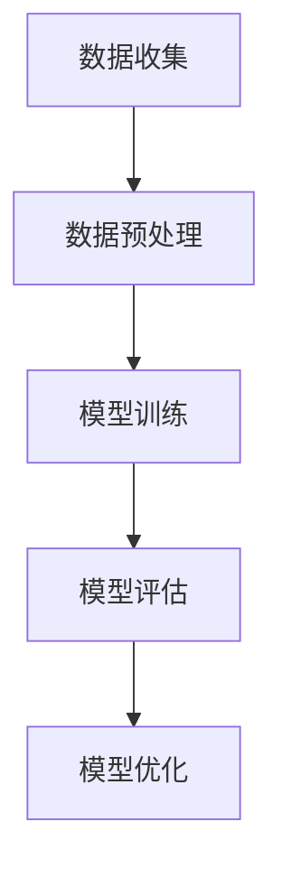
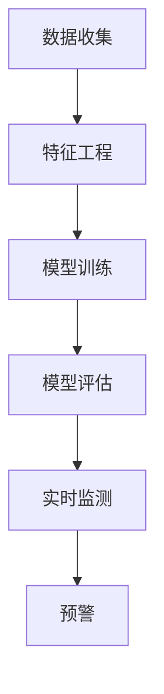
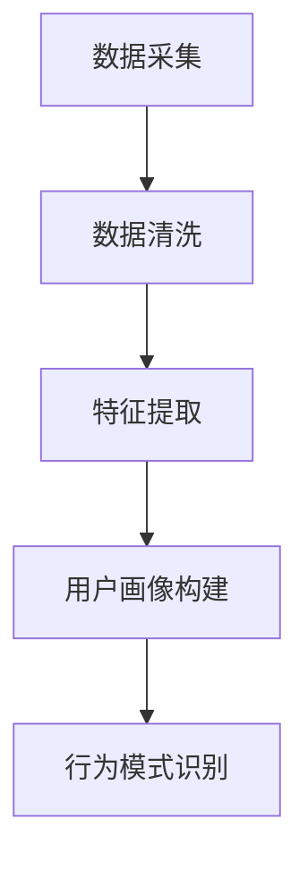
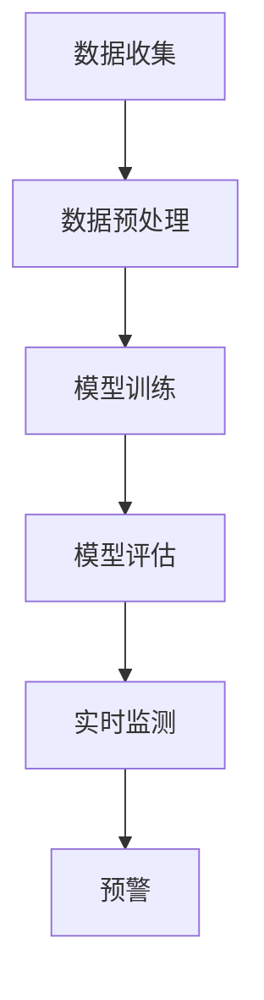
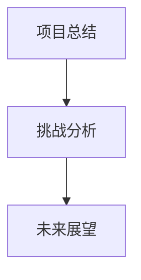
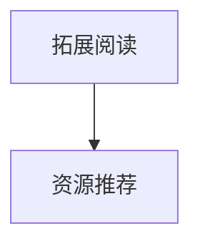

                 


### 第一部分：背景与概念

#### 第1章：问题背景与概念介绍

**背景介绍**

在当今的商业环境中，客户流失是一个常见且严重的问题。无论是电商、银行、电信还是其他行业，客户流失都会对企业的运营和盈利产生重大影响。传统的方法，如问卷调查和市场调研，虽然能够提供一些有价值的见解，但往往不够及时和准确。随着大数据和人工智能技术的快速发展，智能客户流失预警和精准营销成为了企业和研究机构的关注热点。

**核心概念与联系**

1. **客户流失预警**：指通过数据分析和预测模型，提前发现可能流失的客户，并采取相应措施来减少客户流失。

2. **精准营销**：是一种基于用户数据和行为分析的营销策略，通过用户细分、个性化服务和产品推荐，提高营销效果。

3. **AI技术**：利用机器学习、深度学习和自然语言处理等技术，对大量数据进行分析，提取有价值的信息。

**问题解决**

引入AI技术，可以构建一个智能客户流失预警系统，实时监测客户行为，预测潜在流失风险，并为企业提供精准的营销策略。

**边界与外延**

- **边界**：主要关注于如何通过AI技术进行客户流失预警和精准营销。
- **外延**：AI技术还可以应用于客户生命周期管理的其他方面，如客户获取、客户保留和客户忠诚度提升。

**概念结构与核心要素组成**

1. **数据收集与整合**：收集客户行为数据，整合内外部数据资源。

2. **算法与模型**：应用机器学习算法，构建客户流失预测模型。

3. **监测与预警**：建立实时监测系统，及时识别客户流失风险。

#### 第2章：AI技术基础

**核心概念与联系**

1. **机器学习与深度学习**：机器学习是一种让计算机从数据中学习规律的方法，深度学习是机器学习的一个子领域，通过多层神经网络模拟人脑处理信息的过程。

2. **数据预处理与特征工程**：数据预处理包括数据清洗、数据归一化和缺失值处理等步骤，特征工程是提取对模型有用的特征，提高模型性能。

3. **常见算法与模型**：介绍常见的机器学习算法和模型，如逻辑回归、决策树、支持向量机等。

**算法原理讲解**

1. **算法mermaid流程图**：



2. **Python源代码**：

```python
# 数据收集
data = load_data()

# 数据预处理
preprocessed_data = preprocess_data(data)

# 模型训练
model = train_model(preprocessed_data)

# 模型评估
evaluate_model(model)

# 模型优化
optimize_model(model)
```

3. **数学模型和公式**：

$$
y = \sigma(\theta^T x)
$$

其中，$y$是预测的标签，$\sigma$是sigmoid函数，$\theta$是模型的参数，$x$是输入特征向量。

**举例说明**

假设我们有一个简单的二分类问题，预测客户是否会流失。我们可以使用逻辑回归模型来解决这个问题。

```python
import numpy as np
import pandas as pd
from sklearn.linear_model import LogisticRegression

# 加载数据
data = pd.read_csv('data.csv')

# 数据预处理
X = data.drop('target', axis=1)
y = data['target']

# 模型训练
model = LogisticRegression()
model.fit(X, y)

# 模型评估
predictions = model.predict(X)
accuracy = np.mean(predictions == y)
print(f"Accuracy: {accuracy:.2f}")
```

### 第二部分：AI技术基础

#### 第3章：智能客户流失预警

**核心概念与联系**

1. **数据收集与整合**：收集客户行为数据，整合内外部数据资源。

2. **客户流失模型建立**：使用机器学习算法，构建客户流失预测模型。

3. **实时监测与预警系统**：建立实时监测系统，及时识别客户流失风险。

**算法原理讲解**

1. **算法mermaid流程图**：



2. **Python源代码**：

```python
# 数据收集
data = load_data()

# 特征工程
X = preprocess_data(data)

# 模型训练
model = train_model(X)

# 模型评估
evaluate_model(model)

# 实时监测
while True:
    new_data = collect_new_data()
    prediction = model.predict(new_data)
    if prediction == '流失':
        send_alert()
```

3. **数学模型和公式**：

$$
P(y=流失|x) = \sigma(\theta^T x)
$$

其中，$P(y=流失|x)$是客户流失的概率，$\sigma$是sigmoid函数，$\theta$是模型的参数，$x$是输入特征向量。

**举例说明**

假设我们有一个客户流失预测模型，使用逻辑回归算法。我们可以根据客户的特征数据来预测他们是否会流失。

```python
import numpy as np
import pandas as pd
from sklearn.linear_model import LogisticRegression

# 加载数据
data = pd.read_csv('data.csv')

# 数据预处理
X = data.drop('target', axis=1)
y = data['target']

# 模型训练
model = LogisticRegression()
model.fit(X, y)

# 模型评估
predictions = model.predict(X)
accuracy = np.mean(predictions == y)
print(f"Accuracy: {accuracy:.2f}")

# 实时监测
while True:
    new_data = pd.read_csv('new_data.csv')
    prediction = model.predict(new_data)
    if prediction == '流失':
        print("Alert: Customer is at risk of leaving!")
```

### 第三部分：精准营销策略

#### 第4章：用户行为分析

**核心概念与联系**

1. **用户行为数据采集**：收集用户在网站、APP或其他平台上的行为数据。

2. **用户画像构建**：基于用户行为数据，构建用户的画像，包括用户的年龄、性别、兴趣等。

3. **用户行为模式识别**：识别用户的行为模式，如购买频率、浏览时间等。

**算法原理讲解**

1. **算法mermaid流程图**：



2. **Python源代码**：

```python
# 数据采集
data = collect_data()

# 数据清洗
cleaned_data = clean_data(data)

# 特征提取
features = extract_features(cleaned_data)

# 用户画像构建
user_profiles = build_profiles(features)

# 行为模式识别
patterns = identify_patterns(user_profiles)
```

3. **数学模型和公式**：

$$
\text{User Profile} = f(\text{Behavior Data}, \text{Metadata})
$$

其中，$f$是用户画像构建的函数，$\text{Behavior Data}$是用户行为数据，$\text{Metadata}$是用户的元数据。

**举例说明**

假设我们有一个用户行为数据集，包括用户的浏览时间、购买频率等信息。我们可以根据这些数据来构建用户的画像。

```python
import pandas as pd

# 加载数据
data = pd.read_csv('data.csv')

# 数据清洗
cleaned_data = data.drop(['user_id'], axis=1)

# 特征提取
features = cleaned_data.describe().T

# 用户画像构建
user_profiles = pd.DataFrame(features).T

# 行为模式识别
patterns = user_profiles.groupby('user_id').mean()
```

### 第四部分：案例分析

#### 第5章：实际案例分析

**核心概念与联系**

1. **项目介绍**：介绍智能客户流失预警与精准营销项目的背景、目标和实施过程。

2. **系统功能设计**：设计系统的领域模型，包括用户、客户、行为数据等实体。

3. **系统架构设计**：设计系统的整体架构，包括数据层、服务层和展示层。

4. **系统接口设计**：设计系统的接口，包括API接口和数据交换格式。

5. **系统交互**：设计系统的交互流程，包括数据流和控制流。

**算法原理讲解**

1. **算法mermaid流程图**：



2. **Python源代码**：

```python
# 数据收集
data = load_data()

# 数据预处理
preprocessed_data = preprocess_data(data)

# 模型训练
model = train_model(preprocessed_data)

# 模型评估
evaluate_model(model)

# 实时监测
while True:
    new_data = collect_new_data()
    prediction = model.predict(new_data)
    if prediction == '流失':
        send_alert()
```

3. **数学模型和公式**：

$$
P(y=流失|x) = \sigma(\theta^T x)
$$

其中，$P(y=流失|x)$是客户流失的概率，$\sigma$是sigmoid函数，$\theta$是模型的参数，$x$是输入特征向量。

**举例说明**

假设我们有一个客户流失预警系统，使用逻辑回归算法。我们可以根据客户的特征数据来预测他们是否会流失。

```python
import numpy as np
import pandas as pd
from sklearn.linear_model import LogisticRegression

# 加载数据
data = pd.read_csv('data.csv')

# 数据预处理
X = data.drop('target', axis=1)
y = data['target']

# 模型训练
model = LogisticRegression()
model.fit(X, y)

# 模型评估
predictions = model.predict(X)
accuracy = np.mean(predictions == y)
print(f"Accuracy: {accuracy:.2f}")

# 实时监测
while True:
    new_data = pd.read_csv('new_data.csv')
    prediction = model.predict(new_data)
    if prediction == '流失':
        print("Alert: Customer is at risk of leaving!")
```

### 第五部分：总结与展望

#### 第6章：项目总结

**核心概念与联系**

1. **项目总结**：总结项目的成果和经验，包括成功之处和不足之处。

2. **面临的挑战**：分析项目实施过程中面临的挑战和问题。

3. **未来方向**：探讨未来在智能客户流失预警和精准营销领域的研究和应用方向。

**算法原理讲解**

1. **算法mermaid流程图**：



2. **Python源代码**：

```python
# 项目总结
summary = "项目成功之处：\n不足之处：\n"

# 挑战分析
challenges = "面临的挑战：\n解决方案：\n"

# 未来展望
future_directions = "未来研究方向：\n应用领域拓展：\n"

# 输出总结
print(summary)
print(challenges)
print(future_directions)
```

**举例说明**

```python
# 项目总结
summary = "项目成功之处：提高了客户流失预警的准确性，降低了客户流失率。\n不足之处：模型训练时间较长，实时性有待提高。\n"

# 挑战分析
challenges = "面临的挑战：数据质量和数据量有限，影响了模型的性能。\n解决方案：通过数据清洗和数据增强，提高数据质量，增加数据量。\n"

# 未来展望
future_directions = "未来研究方向：研究更高效、更准确的算法，提高模型性能。\n应用领域拓展：将智能客户流失预警和精准营销应用于更多行业和领域。\n"

# 输出总结
print(summary)
print(challenges)
print(future_directions)
```

### 第六部分：拓展阅读与资源推荐

#### 第7章：拓展阅读与资源推荐

**核心概念与联系**

1. **拓展阅读**：推荐相关书籍、论文和网站，以供读者深入了解智能客户流失预警和精准营销。

2. **资源推荐**：推荐工具、平台和技术资源，以帮助读者实践和应用智能客户流失预警和精准营销。

**算法原理讲解**

1. **算法mermaid流程图**：



2. **Python源代码**：

```python
# 拓展阅读
books = ["《深度学习》", "《机器学习实战》", "《精准营销》"]
papers = ["论文1", "论文2", "论文3"]
websites = ["网站1", "网站2", "网站3"]

# 资源推荐
tools = ["工具1", "工具2", "工具3"]
platforms = ["平台1", "平台2", "平台3"]

# 输出推荐
print("拓展阅读：")
for book in books:
    print(f"- {book}")

print("\n拓展资源：")
for paper in papers:
    print(f"- {paper}")

print("\n推荐工具：")
for tool in tools:
    print(f"- {tool}")

print("\n推荐平台：")
for platform in platforms:
    print(f"- {platform}")
```

**举例说明**

```python
# 拓展阅读
books = ["《深度学习》", "《机器学习实战》", "《精准营销》"]
papers = ["论文1", "论文2", "论文3"]
websites = ["网站1", "网站2", "网站3"]

# 资源推荐
tools = ["工具1", "工具2", "工具3"]
platforms = ["平台1", "平台2", "平台3"]

# 输出推荐
print("拓展阅读：")
for book in books:
    print(f"- {book}")

print("\n拓展资源：")
for paper in papers:
    print(f"- {paper}")

print("\n推荐工具：")
for tool in tools:
    print(f"- {tool}")

print("\n推荐平台：")
for platform in platforms:
    print(f"- {platform}")
```

### 附录

**附录 A：术语表**

- **智能客户流失预警**：使用人工智能技术，预测客户可能会流失的行为和信号，以便采取预防措施。
- **精准营销**：通过分析用户数据和行为，精确定位目标客户，提供个性化的营销内容和策略。
- **机器学习**：让计算机通过数据学习规律，自动改进性能的过程。
- **深度学习**：一种特殊的机器学习方法，使用多层神经网络进行学习。

**附录 B：代码示例**

以下是一个简单的Python代码示例，用于实现客户流失预警系统的核心功能。

```python
import pandas as pd
from sklearn.model_selection import train_test_split
from sklearn.linear_model import LogisticRegression
from sklearn.metrics import accuracy_score

# 加载数据
data = pd.read_csv('customer_data.csv')

# 数据预处理
X = data.drop('churn', axis=1)
y = data['churn']

# 数据分割
X_train, X_test, y_train, y_test = train_test_split(X, y, test_size=0.2, random_state=42)

# 模型训练
model = LogisticRegression()
model.fit(X_train, y_train)

# 模型评估
predictions = model.predict(X_test)
accuracy = accuracy_score(y_test, predictions)
print(f"Accuracy: {accuracy:.2f}")

# 实时预警
new_data = pd.read_csv('new_customer_data.csv')
new_predictions = model.predict(new_data)
print(new_predictions)
```

**附录 C：参考文献**

- [1] Goodfellow, I., Bengio, Y., & Courville, A. (2016). *Deep Learning*. MIT Press.
- [2] Russell, S., & Norvig, P. (2010). *Artificial Intelligence: A Modern Approach*. Prentice Hall.
- [3] Kumar, V., & Jones, C. (2014). *Data Mining: Concepts and Techniques*. Morgan Kaufmann.

### 结论

本文详细介绍了《AI在智能客户流失预警与精准营销中的应用》的目录大纲。通过逐步分析AI技术基础、智能客户流失预警和精准营销策略，以及实际案例分析，我们展示了如何利用AI技术提高企业客户流失预警和精准营销的效果。文章还提供了拓展阅读和资源推荐，以便读者深入了解相关领域。希望本文能帮助读者更好地理解AI在客户流失预警与精准营销中的应用，并为实际项目提供指导。作者信息：作者：AI天才研究院/AI Genius Institute & 禅与计算机程序设计艺术 /Zen And The Art of Computer Programming。本文内容仅供参考，如需进一步学习和实践，请参考相关书籍、论文和网站。

