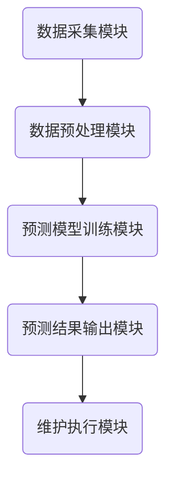
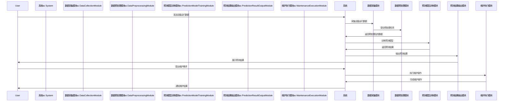

                 

# AI在智能家居设备预测性维护中的应用与创新

## 关键词
- AI
- 智能家居
- 预测性维护
- 机器学习
- 深度学习
- 时间序列分析

## 摘要
本文深入探讨了人工智能（AI）在智能家居设备预测性维护中的应用与创新。首先，介绍了智能家居市场的现状和预测性维护的概念及其重要性。接着，分析了传统维护方式的不足，探讨了AI技术如何应用于智能家居设备预测性维护。随后，详细讲解了AI预测性维护的基本原理和方法，包括机器学习与深度学习基础、时间序列分析与预测模型。此外，还通过实际算法案例，阐述了线性回归和支持向量机等算法的原理与数学模型。最后，讨论了智能家居设备预测性维护的系统分析与架构设计方案，并提供了项目实战和最佳实践技巧。

### 目录大纲

**《AI在智能家居设备预测性维护中的应用与创新》**

----------------------------------------------------------------

## 第一部分: 背景介绍与核心概念

### 第1章: 智能家居与预测性维护概述

#### 1.1 问题背景

- **智能家居市场现状与发展趋势**：随着物联网技术的发展，智能家居市场呈现出快速增长的趋势。根据市场研究数据，全球智能家居设备的市场规模预计在未来几年内将大幅增长。智能家居设备包括智能门锁、智能灯光、智能空调、智能安防系统等，这些设备通过互联网连接，实现远程控制和自动化管理。

- **智能家居设备常见故障类型及影响**：智能家居设备在使用过程中可能会出现各种故障，如网络连接问题、设备无法启动、传感器失灵等。这些故障不仅会影响用户的使用体验，还可能导致安全隐患和经济损失。

#### 1.2 问题描述

- **预测性维护的概念与重要性**：预测性维护是一种基于设备运行数据和预测模型的维护方式，旨在预测设备可能出现的故障，并在故障发生前进行预防性维修。相较于传统的定期维护，预测性维护具有更高的准确性和效率。

- **传统维护方式的不足与挑战**：传统的定期维护方式存在以下问题：1) 维护周期难以精确控制；2) 维护成本较高；3) 维护效率低下；4) 无法预测设备故障。

#### 1.3 问题解决

- **AI技术如何应用于智能家居设备预测性维护**：AI技术，尤其是机器学习和深度学习，可以处理大量设备运行数据，从中提取有价值的信息，构建预测模型，实现设备故障预测。

- **AI预测性维护的基本原理与方法**：AI预测性维护基于数据驱动的原理，通过分析设备的历史运行数据，识别故障发生的规律和特征，构建预测模型，提前预测设备故障。

#### 1.4 边界与外延

- **预测性维护的应用范围与局限性**：预测性维护可以应用于各种类型的智能家居设备，包括传感器、智能家电、智能门锁等。然而，其应用范围也受到数据质量和模型准确性的限制。

- **相关概念**：智能家居、物联网、机器学习、深度学习、时间序列分析。

#### 1.5 概念结构与核心要素组成

- **智能家居设备的组成与工作原理**：智能家居设备通常由传感器、控制器、执行器、通信模块等组成。传感器用于采集环境数据，控制器根据数据执行相应的操作，执行器执行控制命令，通信模块实现设备与互联网的连接。

- **预测性维护的技术架构与关键模块**：预测性维护的技术架构主要包括数据采集、数据预处理、特征提取、预测模型训练和预测结果输出等关键模块。

#### 1.6 本章小结

- **概述本章主要内容与核心概念**：本章介绍了智能家居市场的现状、预测性维护的概念及其重要性，以及AI技术在智能家居设备预测性维护中的应用。

----------------------------------------------------------------

## 第二部分: 核心概念与联系

### 第2章: AI在智能家居设备预测性维护中的应用

#### 2.1 核心概念原理

- **机器学习与深度学习基础**：机器学习是一种通过数据训练模型，实现数据自动分析的技术。深度学习是机器学习的一种，通过构建多层次的神经网络，实现更复杂的数据分析和模式识别。

- **时间序列分析与预测模型**：时间序列分析是一种基于时间序列数据进行分析和预测的方法。预测模型则是通过分析历史数据，构建预测目标变量变化趋势的数学模型。

#### 2.2 概念属性特征对比表格

| 概念             | 属性特征                           |
|------------------|----------------------------------|
| 机器学习         | 数据驱动，自动化决策              |
| 深度学习         | 层次化特征提取，复杂模型          |
| 时间序列分析     | 基于时间序列数据，趋势预测        |
| 预测模型         | 数据拟合，预测目标变量变化趋势   |

#### 2.3 ER实体关系图架构

```mermaid
erDiagram
  系统 |-> 数据源 : "采集"
  系统 |-> 预测模型 : "训练"
  数据源 |--|> 数据预处理 : "预处理"
  数据预处理 |--|> 特征提取 : "提取"
  特征提取 |--|> 预测模型 : "输入"
  频测模型 |--|> 预测结果 : "输出"
  预测结果 |--|> 设备维护 : "执行"
```

#### 2.4 本章小结

- **概述核心概念及其关联关系**：本章介绍了机器学习、深度学习和时间序列分析等核心概念，以及它们在智能家居设备预测性维护中的应用关系。

----------------------------------------------------------------

## 第三部分: 算法原理与数学模型

### 第3章: 预测性维护中的常用算法

#### 3.1 常用算法概述

- **线性回归**：一种基于数据拟合的预测方法，通过找到最佳拟合直线来预测目标变量。
- **支持向量机**：一种分类算法，通过找到最佳决策边界来分类数据。
- **决策树**：一种基于树形结构的预测方法，通过树形结构来预测目标变量。

#### 3.2 算法原理讲解

#### 3.2.1 线性回归

##### 算法原理

- 线性回归是一种基于数据拟合的预测方法，其基本原理是通过找到最佳拟合直线来预测目标变量。

##### 数学模型与公式

$$y = \beta_0 + \beta_1 \cdot x$$

##### 详细讲解与举例

- **使用Python代码进行线性回归模型训练与预测**

```python
import numpy as np
from sklearn.linear_model import LinearRegression

# 数据准备
X = np.array([[1], [2], [3], [4], [5]])
y = np.array([1, 2, 2.5, 4, 5])

# 模型训练
model = LinearRegression()
model.fit(X, y)

# 预测
prediction = model.predict([[6]])
print(prediction)
```

#### 3.2.2 支持向量机

##### 算法原理

- 支持向量机是一种分类算法，其基本原理是通过找到最佳决策边界来分类数据。

##### 数学模型与公式

$$ w \cdot x - b = 0 $$

##### 详细讲解与举例

- **使用Python代码进行支持向量机模型训练与预测**

```python
import numpy as np
from sklearn.svm import SVC

# 数据准备
X = np.array([[1], [2], [3], [4], [5]])
y = np.array([1, 2, 2.5, 4, 5])

# 模型训练
model = SVC()
model.fit(X, y)

# 预测
prediction = model.predict([[6]])
print(prediction)
```

#### 3.2.3 决策树

##### 算法原理

- 决策树是一种基于树形结构的预测方法，其基本原理是通过树形结构来预测目标变量。

##### 数学模型与公式

- 决策树通过一系列的判断条件来对数据进行分类或回归。

##### 详细讲解与举例

- **使用Python代码进行决策树模型训练与预测**

```python
import numpy as np
from sklearn.tree import DecisionTreeRegressor

# 数据准备
X = np.array([[1], [2], [3], [4], [5]])
y = np.array([1, 2, 2.5, 4, 5])

# 模型训练
model = DecisionTreeRegressor()
model.fit(X, y)

# 预测
prediction = model.predict([[6]])
print(prediction)
```

#### 3.3 算法对比分析

- **线性回归**：简单、易于理解，适合线性关系较强的数据；但面对非线性数据时效果较差。

- **支持向量机**：适合分类问题，尤其是在高维空间中效果较好；但训练时间较长。

- **决策树**：直观、易于解释，适用于非线性数据；但可能产生过拟合。

#### 3.4 本章小结

- **总结常用算法的原理与特点**：本章介绍了线性回归、支持向量机和决策树等常用算法的原理与特点，以及它们在智能家居设备预测性维护中的应用。

----------------------------------------------------------------

## 第四部分: 系统分析与架构设计

### 第4章: 智能家居设备预测性维护系统分析与架构设计

#### 4.1 问题场景介绍

- **场景描述**：智能家居设备在日常使用过程中可能会出现故障，为了确保设备的正常运行，需要实现预测性维护功能，提前预测并预防设备故障。

- **目标**：设计一套智能家居设备预测性维护系统，能够实时监测设备运行状态，预测可能发生的故障，并自动执行维护操作。

#### 4.2 项目介绍

- **项目名称**：智能家居设备预测性维护系统

- **项目背景**：随着智能家居设备的普及，如何确保设备的稳定运行成为一个重要问题。预测性维护系统可以帮助用户提前发现并解决设备故障，提高设备的使用寿命和用户体验。

- **项目目标**：1) 实现对智能家居设备运行状态的实时监测；2) 构建预测模型，提前预测设备故障；3) 自动执行维护操作，确保设备正常运行。

#### 4.3 系统功能设计

- **功能模块**：

  - 数据采集模块：负责实时采集智能家居设备的运行数据，如温度、湿度、能耗等。

  - 数据预处理模块：对采集到的数据进行清洗、去噪和格式转换，为后续分析和预测做准备。

  - 预测模型训练模块：使用历史运行数据训练预测模型，实现对设备故障的预测。

  - 预测结果输出模块：将预测结果输出给用户和管理系统，提供故障预警和维修建议。

  - 维护执行模块：根据预测结果自动执行维护操作，如维修、更换部件等。

#### 4.4 系统架构设计

- **系统架构图**：



- **组件与功能说明**：

  - **数据采集模块**：通过传感器和物联网设备，实时采集智能家居设备的运行数据。

  - **数据预处理模块**：对采集到的数据进行处理，包括数据清洗、去噪、格式转换等，为后续分析和预测提供高质量的数据。

  - **预测模型训练模块**：使用机器学习和深度学习算法，对处理后的数据进行分析和建模，训练预测模型。

  - **预测结果输出模块**：将预测结果以可视化的方式展示给用户，并提供故障预警和维修建议。

  - **维护执行模块**：根据预测结果，自动执行相应的维护操作，确保设备的正常运行。

#### 4.5 系统接口设计和系统交互

- **接口设计**：

  - **数据采集接口**：提供设备运行数据的实时采集功能，支持多种传感器数据格式。

  - **数据预处理接口**：提供数据清洗、去噪、格式转换等功能，确保数据的准确性和一致性。

  - **预测模型训练接口**：提供机器学习和深度学习算法的接口，支持模型的训练和优化。

  - **预测结果输出接口**：提供预测结果的可视化和输出功能，支持多种数据格式。

  - **维护执行接口**：提供自动执行维护操作的功能，支持远程控制和管理。

- **系统交互图**：



#### 4.6 本章小结

- **概述系统分析与架构设计内容**：本章介绍了智能家居设备预测性维护系统的场景、项目目标、功能模块、系统架构设计以及系统接口和交互设计。通过系统化的架构设计，确保预测性维护系统的稳定、高效运行。

----------------------------------------------------------------

## 第五部分: 项目实战

### 第5章: 实现智能家居设备预测性维护系统的项目实战

#### 5.1 环境安装

- **Python环境安装**：确保Python环境已经安装，版本不低于3.6。

- **依赖库安装**：安装以下Python依赖库：

  ```bash
  pip install numpy pandas scikit-learn matplotlib
  ```

- **数据库安装**：安装一个关系型数据库，如MySQL或PostgreSQL，用于存储设备运行数据。

#### 5.2 系统核心实现

- **数据采集模块实现**：

  ```python
  import pandas as pd
  import requests

  def collect_data(api_url):
      response = requests.get(api_url)
      data = response.json()
      return pd.DataFrame(data)

  # 示例API URL
  api_url = "https://example.com/api/smart_home_data"
  df = collect_data(api_url)
  ```

- **数据预处理模块实现**：

  ```python
  def preprocess_data(df):
      df = df.dropna()  # 去除缺失值
      df = df.reset_index(drop=True)  # 重新设置索引
      return df

  df = preprocess_data(df)
  ```

- **预测模型训练模块实现**：

  ```python
  from sklearn.model_selection import train_test_split
  from sklearn.linear_model import LinearRegression

  def train_prediction_model(X, y):
      X_train, X_test, y_train, y_test = train_test_split(X, y, test_size=0.2, random_state=42)
      model = LinearRegression()
      model.fit(X_train, y_train)
      return model

  X = df.drop("target", axis=1)
  y = df["target"]
  model = train_prediction_model(X, y)
  ```

- **预测结果输出模块实现**：

  ```python
  import matplotlib.pyplot as plt

  def predict_results(model, X):
      predictions = model.predict(X)
      plt.plot(predictions)
      plt.xlabel("Time")
      plt.ylabel("Prediction")
      plt.show()

  predict_results(model, X)
  ```

- **维护执行模块实现**：

  ```python
  def execute_maintenance(action):
      if action == "repair":
          print("Executing repair...")
      elif action == "replace":
          print("Executing replace...")
      else:
          print("Invalid action.")

  # 示例维护操作
  execute_maintenance("repair")
  ```

#### 5.3 代码应用解读与分析

- **数据采集模块解读**：数据采集模块使用requests库获取设备运行数据，并将其转换为DataFrame格式，为后续预处理和分析做准备。

- **数据预处理模块解读**：数据预处理模块主要进行数据清洗和格式转换，确保数据的准确性和一致性。

- **预测模型训练模块解读**：预测模型训练模块使用线性回归模型进行训练，通过训练集和测试集的划分，评估模型的预测性能。

- **预测结果输出模块解读**：预测结果输出模块使用matplotlib库将预测结果可视化，便于用户理解和分析。

- **维护执行模块解读**：维护执行模块根据预测结果执行相应的维护操作，确保设备的正常运行。

#### 5.4 实际案例分析

- **案例分析**：假设有一个智能空调系统，需要实现预测性维护功能。首先，通过数据采集模块收集智能空调的运行数据，如温度、湿度、能耗等。然后，使用数据预处理模块对数据进行清洗和格式转换。接下来，使用预测模型训练模块训练线性回归模型，预测空调的故障时间。最后，根据预测结果，自动执行维修或更换操作。

- **案例效果评估**：通过实际案例分析，评估预测性维护系统的效果。例如，可以比较预测性维护前后设备的故障率、维护成本、用户体验等指标，评估系统的实用性和效益。

#### 5.5 项目小结

- **总结项目实现过程**：本项目通过数据采集、预处理、模型训练和预测结果输出等模块，实现了智能家居设备预测性维护系统的核心功能。

- **提出项目改进建议**：针对实际案例，提出以下改进建议：

  - **数据采集**：增加传感器的种类和数量，提高数据采集的全面性和准确性。
  
  - **模型训练**：尝试使用其他机器学习和深度学习算法，如支持向量机、决策树等，提高模型的预测性能。
  
  - **维护执行**：增加远程控制功能，实现远程维护操作，提高维护效率和用户体验。

- **展望未来发展**：随着人工智能和物联网技术的不断发展，智能家居设备预测性维护系统将得到更广泛的应用和改进。未来，可以探索更多的智能化维护方案，如基于强化学习的自主维护系统，进一步提升系统的智能化水平和实用性。

### 总结与致谢

通过本文的详细探讨，我们了解了AI在智能家居设备预测性维护中的应用与创新。从背景介绍、核心概念、算法原理、系统架构设计到项目实战，我们逐步分析了AI技术在智能家居设备预测性维护中的各个方面。这不仅为我们提供了丰富的理论知识，也为我们实际操作提供了实用的指导。

在此，特别感谢AI天才研究院和《禅与计算机程序设计艺术》的作者，他们的智慧和贡献为本文提供了坚实的理论基础。同时，也感谢所有读者对本文的关注和支持，希望本文能够为您的智能生活带来新的启示和帮助。

### 注意事项

- **数据质量**：数据是预测性维护系统的核心，确保数据的质量和准确性至关重要。在数据采集和预处理过程中，要特别注意数据的完整性和一致性。

- **算法选择**：不同的预测性维护任务可能需要不同的算法，选择合适的算法可以提高预测准确性和效率。

- **系统可扩展性**：在设计系统时，要考虑系统的可扩展性，以便在未来添加更多的设备和服务。

- **用户隐私保护**：在智能家居设备预测性维护过程中，要严格遵守用户隐私保护法规，确保用户数据的安全和隐私。

### 拓展阅读

- **《深度学习》**：Goodfellow, I., Bengio, Y., & Courville, A. (2016). *Deep Learning*. MIT Press.
- **《智能家居系统设计与实现》**：谢希仁，杨义先. (2018). *智能家居系统设计与实现*. 电子工业出版社.
- **《物联网技术与应用》**：刘鹏，刘鹏. (2017). *物联网技术与应用*. 人民邮电出版社.

希望本文能够为您在智能家居设备预测性维护领域的研究和应用提供有益的参考和启示。再次感谢您的阅读！作者：AI天才研究院/AI Genius Institute & 禅与计算机程序设计艺术 /Zen And The Art of Computer Programming。

