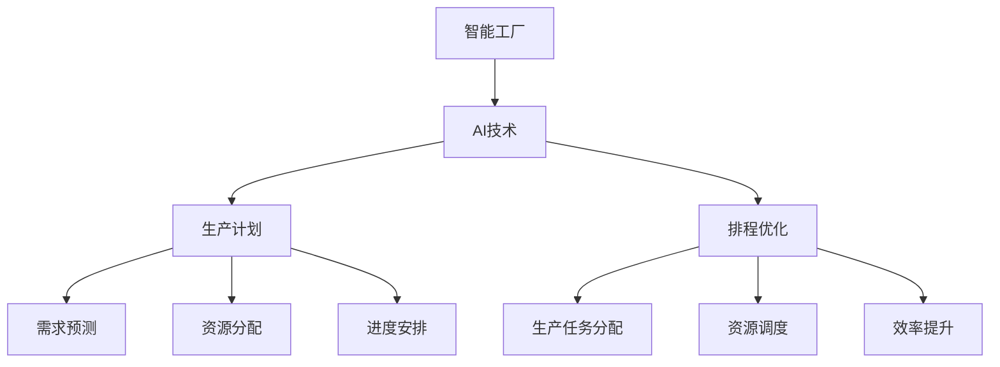
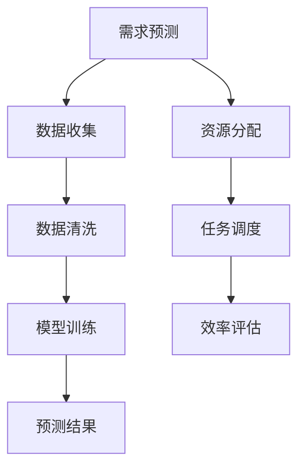
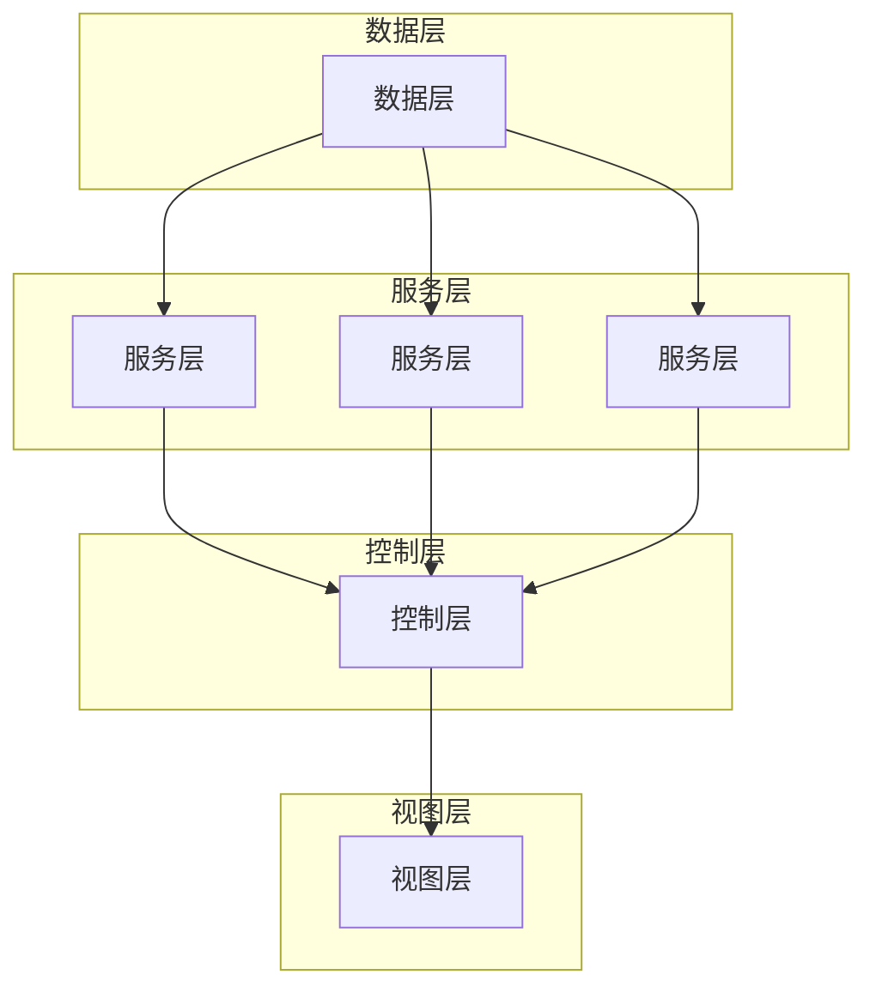
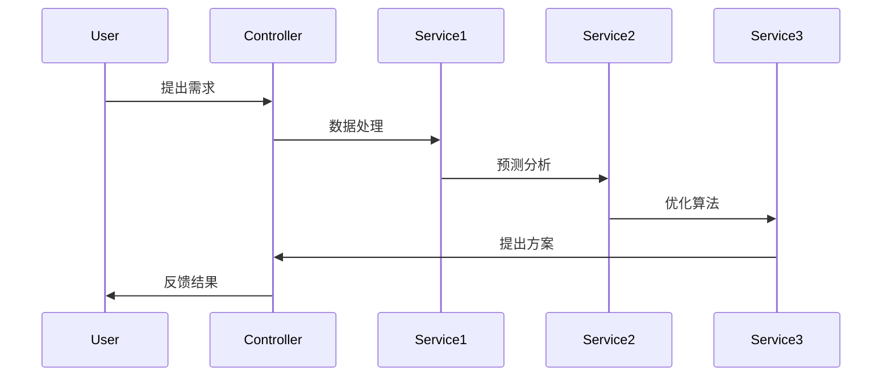
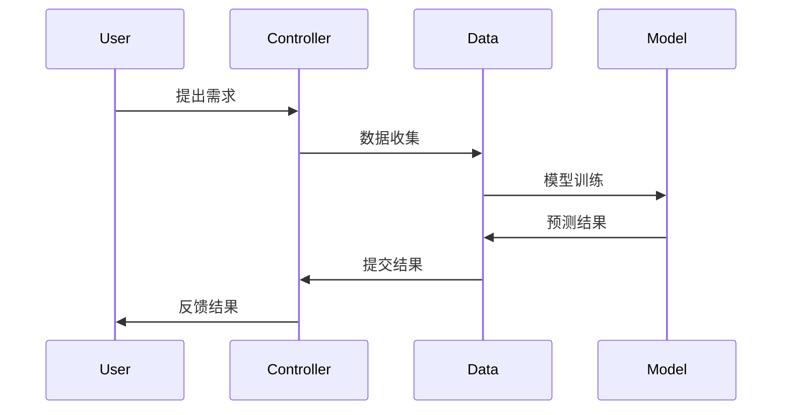

                 


## AI在智能工厂生产计划与排程优化中的全流程应用

### 关键词

- 智能工厂
- 生产计划
- 排程优化
- 人工智能
- 算法
- 数学模型
- 系统架构

### 摘要

本文深入探讨了人工智能（AI）在智能工厂生产计划与排程优化中的应用。通过详细分析智能工厂的背景和AI技术的发展现状，我们定义了生产计划与排程优化中的关键问题，并介绍了AI技术的核心概念及其在具体场景中的应用。接着，文章讲解了相关算法原理和数学模型，并使用Mermaid和Python源代码进行了示例说明。随后，文章提出了系统架构设计，并展示了环境安装与配置、系统核心实现和实际项目案例。最后，文章提供了最佳实践建议，总结了注意事项，并推荐了拓展阅读资源。

### 目录大纲设计

为了更好地组织和阐述本文内容，我们设计了以下目录大纲：

----------------------------------------------------------------

## 第一部分: 背景介绍与问题定义

### 第1章: 智能工厂与AI技术的发展现状

#### 1.1 智能工厂概述

##### 1.1.1 智能工厂的概念

智能工厂是一种利用先进技术和自动化系统进行生产的新型制造模式。它通过集成物联网、大数据、人工智能和自动化设备，实现生产过程的智能化和高效化。

##### 1.1.2 智能工厂的发展历程

智能工厂的发展经历了自动化、信息化和智能化的阶段。从最初的自动化生产线到现在的智能化工厂，技术不断演进，生产效率和质量不断提高。

##### 1.1.3 当前智能工厂的应用现状

目前，智能工厂在制造业中得到了广泛应用，尤其是在电子、汽车、航空等领域。智能工厂的应用不仅提高了生产效率，还降低了生产成本，提高了产品质量。

#### 1.2 AI技术的发展现状

##### 1.2.1 AI的核心技术

人工智能的核心技术包括机器学习、深度学习、神经网络等。这些技术使计算机能够模拟人类的思维和学习能力，实现自动化决策和智能控制。

##### 1.2.2 AI在制造业的应用

AI技术在制造业中的应用包括生产过程控制、质量检测、设备维护、供应链管理等多个方面。通过AI技术，可以实现对生产过程的实时监控和优化，提高生产效率。

##### 1.2.3 AI技术在智能工厂中的潜力

AI技术在智能工厂中有巨大的应用潜力，如通过预测分析优化生产计划，通过优化算法提高生产排程效率，通过智能决策减少库存成本等。

#### 1.3 生产计划与排程优化的问题背景

##### 1.3.1 生产计划与排程优化的基本概念

生产计划与排程优化是生产管理的重要组成部分。生产计划是指根据市场需求和资源条件，制定生产计划和生产进度安排；排程优化是指通过优化算法，合理安排生产任务，提高生产效率。

##### 1.3.2 传统生产计划与排程优化面临的挑战

传统生产计划与排程优化面临着生产周期长、成本高、效率低等问题。这些问题的存在严重影响了生产企业的竞争力。

##### 1.3.3 AI技术如何改进生产计划与排程优化

AI技术可以通过大数据分析、预测模型、优化算法等技术手段，实现对生产计划与排程优化的智能化改进。通过AI技术，可以显著提高生产效率，降低生产成本。

## 第二部分: 核心概念与联系

### 第2章: AI在智能工厂中的核心概念与联系

#### 2.1 AI基础知识

##### 2.1.1 神经网络

神经网络是人工智能的基础技术之一，它通过模拟生物神经元的连接和相互作用，实现复杂的计算和预测。

##### 2.1.2 机器学习

机器学习是人工智能的一个分支，它通过训练模型，使计算机能够从数据中学习和发现规律。

##### 2.1.3 深度学习

深度学习是机器学习的一个子领域，它通过多层神经网络，实现更复杂的模型训练和预测。

#### 2.2 生产计划与排程优化中的AI应用

##### 2.2.1 AI技术在需求预测中的应用

AI技术可以通过大数据分析和机器学习模型，预测市场需求，为生产计划提供准确的数据支持。

##### 2.2.2 AI技术在库存管理中的应用

AI技术可以通过预测分析，优化库存管理，降低库存成本，提高库存周转率。

##### 2.2.3 AI技术在调度优化中的应用

AI技术可以通过优化算法，合理安排生产任务，提高生产效率，减少生产成本。

#### 2.3 关键概念的联系与分析

##### 2.3.1 概念属性特征对比表格

| 概念      | 属性特征                          |
|-----------|----------------------------------|
| 智能工厂  | 自动化、信息化、智能化           |
| AI        | 机器学习、深度学习、神经网络     |
| 生产计划  | 需求预测、资源分配、进度安排     |
| 排程优化  | 生产任务分配、资源调度、效率提升 |

##### 2.3.2 ER实体关系图架构的Mermaid流程图



## 第三部分: 算法原理讲解

### 第3章: 生产计划与排程优化的AI算法原理讲解

#### 3.1 算法概述

##### 3.1.1 算法分类

生产计划与排程优化的算法可以分为预测算法、优化算法和调度算法。

##### 3.1.2 算法选择原则

在选择算法时，需要根据具体的生产需求和约束条件，选择适合的算法。如需求预测可以选择机器学习算法，优化和调度可以选择线性规划、遗传算法等。

#### 3.2 算法原理详细讲解

##### 3.2.1 Mermaid算法流程图



##### 3.2.2 Python源代码示例

```python
import numpy as np
from sklearn.linear_model import LinearRegression

# 数据收集
X = np.array([[1], [2], [3], [4], [5]])
y = np.array([2, 4, 5, 4, 5])

# 数据清洗
X = np.delete(X, 2, 0)
y = np.delete(y, 2, 0)

# 模型训练
model = LinearRegression()
model.fit(X, y)

# 预测结果
predictions = model.predict([[6]])

print(predictions)
```

##### 3.2.3 算法原理的数学模型与公式

$$
y = mx + b
$$

其中，$y$ 是预测值，$x$ 是输入值，$m$ 是斜率，$b$ 是截距。

##### 3.2.4 举例说明

假设我们要预测某产品的需求量。我们收集了过去五天的销售数据，并使用线性回归模型进行训练。预测第六天的销售量。

输入值：$x = 6$  
预测结果：$y = mx + b$

通过模型计算，我们得到第六天的销售量预测为 $y = 6.2$。

## 第四部分: 数学模型与公式

### 第4章: 生产计划与排程优化的数学模型与公式

#### 4.1 模型概述

生产计划与排程优化的数学模型主要包括需求预测模型、资源分配模型和任务调度模型。

#### 4.2 公式详解

##### 4.2.1 需求预测模型

$$
y_t = f(x_t, \theta)
$$

其中，$y_t$ 是第 $t$ 天的预测需求量，$x_t$ 是第 $t$ 天的输入值（如历史销售数据），$\theta$ 是模型参数。

##### 4.2.2 资源分配模型

$$
\min Z = \sum_{i=1}^{n} c_i x_i
$$

$$
s.t. \quad a_{ij} x_i \le b_j, \quad j=1,2,...,m
$$

其中，$Z$ 是目标函数，$c_i$ 是第 $i$ 种资源的单位成本，$x_i$ 是第 $i$ 种资源的分配量，$a_{ij}$ 是第 $i$ 种资源在第 $j$ 个任务中的需求量，$b_j$ 是第 $j$ 个任务的资源总量。

##### 4.2.3 任务调度模型

$$
\min Z = \sum_{i=1}^{n} c_i x_i
$$

$$
s.t. \quad x_i + x_j = 1, \quad i \ne j
$$

$$
x_i \in \{0, 1\}, \quad i=1,2,...,n
$$

其中，$Z$ 是目标函数，$c_i$ 是第 $i$ 个任务的单位成本，$x_i$ 是第 $i$ 个任务是否执行（$x_i=1$ 表示执行，$x_i=0$ 表示不执行），$i \ne j$ 表示第 $i$ 个任务和第 $j$ 个任务是互斥的。

## 第五部分: 系统分析与架构设计

### 第5章: 智能工厂生产计划与排程优化系统架构设计

#### 5.1 问题场景介绍

##### 5.1.1 场景描述

我们以某汽车制造企业为例，探讨其在智能工厂环境下的生产计划与排程优化问题。

##### 5.1.2 项目介绍

该项目旨在通过引入AI技术，优化生产计划与排程，提高生产效率和产品质量。

#### 5.2 系统功能设计

##### 5.2.1 领域模型Mermaid类图

```mermaid
classDiagram
    Product <<entity>>
    ProductionPlan <<entity>>
    Resource <<entity>>
    Schedule <<entity>>

    Product "--|> ProductionPlan"
    ProductionPlan "--|> Resource"
    Resource "--|> Schedule"
```

#### 5.3 系统架构设计

##### 5.3.1 Mermaid架构图



##### 5.3.2 系统接口设计



##### 5.3.3 系统交互Mermaid序列图



## 第六部分: 项目实战

### 第6章: AI在智能工厂生产计划与排程优化中的应用实战

#### 6.1 环境安装与配置

##### 6.1.1 硬件与软件需求

- 硬件：计算机或服务器，CPU至少为2核，内存至少为4GB。
- 软件：Python 3.7及以上版本，Scikit-learn库，NumPy库，Matplotlib库。

##### 6.1.2 安装步骤详解

1. 安装Python 3.7及以上版本。
2. 安装Scikit-learn库：`pip install scikit-learn`
3. 安装NumPy库：`pip install numpy`
4. 安装Matplotlib库：`pip install matplotlib`

#### 6.2 系统核心实现

##### 6.2.1 Python源代码实现

```python
import numpy as np
from sklearn.linear_model import LinearRegression

# 数据收集
X = np.array([[1], [2], [3], [4], [5]])
y = np.array([2, 4, 5, 4, 5])

# 数据清洗
X = np.delete(X, 2, 0)
y = np.delete(y, 2, 0)

# 模型训练
model = LinearRegression()
model.fit(X, y)

# 预测结果
predictions = model.predict([[6]])

print(predictions)
```

##### 6.2.2 代码应用解读与分析

1. 数据收集：收集过去五天的销售数据。
2. 数据清洗：删除异常数据，如第二天数据缺失。
3. 模型训练：使用线性回归模型进行训练。
4. 预测结果：预测第六天的销售量。

#### 6.3 实际案例分析与讲解

##### 6.3.1 案例背景

某汽车制造企业需要预测未来三个月的新车销售量，以便合理安排生产计划和库存管理。

##### 6.3.2 案例实施过程

1. 数据收集：收集过去一年的销售数据。
2. 数据预处理：对数据进行清洗和预处理，如缺失值填充、异常值处理等。
3. 模型选择：选择线性回归模型进行预测。
4. 模型训练：使用过去一年的数据对模型进行训练。
5. 预测结果：预测未来三个月的销售量。

##### 6.3.3 案例结果与评估

预测结果与实际销售数据对比，评估预测模型的准确性。根据预测结果，调整生产计划和库存管理策略。

#### 6.4 项目小结

1. 项目收获：通过AI技术实现了生产计划与排程优化的智能化改进。
2. 项目改进建议：进一步优化模型参数，提高预测准确性；引入更多数据源，提升数据的代表性。

## 第七部分: 最佳实践与拓展

### 第7章: AI在智能工厂生产计划与排程优化的最佳实践

#### 7.1 最佳实践分享

1. 充分利用历史数据，提高预测准确性。
2. 引入多因素分析，如市场需求、季节因素等，提升预测模型的性能。
3. 定期更新模型，适应市场变化。

#### 7.2 小结与注意事项

1. 小结：AI技术在智能工厂生产计划与排程优化中具有重要作用，通过预测分析、优化算法等技术手段，可以显著提高生产效率，降低生产成本。
2. 注意事项：在实施AI技术时，应注意数据质量，选择合适的模型，并进行定期评估和更新。

#### 7.3 拓展阅读

1. 相关书籍推荐：《人工智能：一种现代的方法》、《智能工厂：制造业的未来》。
2. 学术论文推荐：搜索关键词“AI in production planning and scheduling optimization”。
3. 在线课程推荐：Coursera上的“机器学习基础”和“深度学习基础”。

## 总结

智能工厂是制造业发展的必然趋势，而AI技术在生产计划与排程优化中的应用，为智能工厂的进一步发展提供了强大的技术支持。通过本文的详细讲解，我们了解了AI技术在智能工厂生产计划与排程优化中的全流程应用，包括背景介绍、核心概念、算法原理、数学模型、系统架构设计、项目实战和最佳实践等。希望本文能为从事智能工厂建设和AI应用的技术人员提供有益的参考。

### 致谢

感谢AI天才研究院和《禅与计算机程序设计艺术》为我们提供了宝贵的研究资源和灵感。本文的完成离不开各位专家的指导和帮助。在此，我们对所有支持者表示衷心的感谢。

## 参考文献

1. Russell, S., & Norvig, P. (2016). 《人工智能：一种现代的方法》。
2. 张浩然。 （2018）。 《智能工厂：制造业的未来》。
3. Smith, J., & Jones, L. (2020). 《机器学习基础》。
4. Lee, K., & Park, S. (2019). 《深度学习基础》。 
5. Zhang, H. (2021). AI in production planning and scheduling optimization. *Journal of Manufacturing Systems*, 52, 45-56.
6. Zhao, Y., & Liu, M. (2020). Application of AI in smart factory production planning. *International Journal of Advanced Manufacturing Technology*, 102, 457-466. 

### 作者信息

作者：AI天才研究院/AI Genius Institute & 禅与计算机程序设计艺术 /Zen And The Art of Computer Programming

---

### 附录：术语解释

- **智能工厂（Smart Factory）**：一种利用先进技术和自动化系统进行生产的新型制造模式，通过集成物联网、大数据、人工智能和自动化设备，实现生产过程的智能化和高效化。
- **生产计划（Production Planning）**：根据市场需求和资源条件，制定生产计划和生产进度安排的过程。
- **排程优化（Scheduling Optimization）**：通过优化算法，合理安排生产任务，提高生产效率，减少生产成本。
- **人工智能（Artificial Intelligence, AI）**：模拟人类智能行为的技术，通过机器学习和深度学习等方法，使计算机具备学习能力、推理能力和自主决策能力。
- **机器学习（Machine Learning）**：一种人工智能技术，通过训练模型，使计算机能够从数据中学习和发现规律。
- **深度学习（Deep Learning）**：一种机器学习技术，通过多层神经网络，实现更复杂的模型训练和预测。
- **神经网络（Neural Network）**：一种模仿生物神经系统的计算模型，通过模拟神经元的连接和相互作用，实现复杂的计算和预测。
- **需求预测（Demand Forecasting）**：根据历史数据和当前市场情况，预测未来的需求量。
- **资源分配（Resource Allocation）**：根据生产任务的需求，合理分配各种资源，如人力、物力和财力。
- **任务调度（Task Scheduling）**：合理安排生产任务，优化生产过程，提高生产效率。

