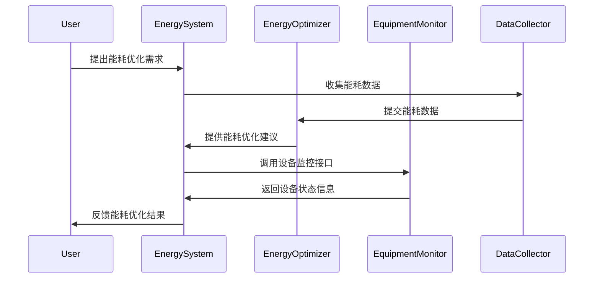

                 

## AI在智能建筑全生命周期能耗优化中的多维度应用

> 关键词：AI、智能建筑、能耗优化、全生命周期、多维度应用

> 摘要：本文探讨了人工智能（AI）技术在智能建筑全生命周期中能耗优化中的应用，分析了核心概念、算法原理、系统架构设计，并通过实际项目案例展示了AI在智能建筑能耗优化中的多维度应用效果。

### 目录大纲

## 第一部分：引言

### 第1章：问题背景与核心概念

### 第2章：核心概念与联系

## 第二部分：算法原理讲解

### 第3章：算法原理与数学模型

### 第4章：系统分析与架构设计方案

## 第三部分：项目实战

### 第5章：环境安装与系统核心实现

### 第6章：代码应用解读与分析

### 第7章：项目小结与最佳实践

----------------------------------------------------------------

### 第1章：问题背景与核心概念

#### 1.1 问题背景

智能建筑是指通过信息技术、通信技术、控制技术等将建筑物的物理基础设施与信息管理系统相结合，实现智能化管理和运行。随着城市化进程的加快和人口密度的增加，智能建筑的数量和规模不断增大。然而，随之而来的能耗问题也日益严峻。智能建筑能耗问题不仅影响到建筑的运营成本，还对环境造成了负面影响。

据统计，全球智能建筑的总能耗占全球总能耗的30%以上。为了应对这一挑战，许多国家和地区已经制定了严格的能耗标准，并推动智能建筑能耗优化的技术研究与应用。

#### 1.2 AI技术发展现状

人工智能（AI）作为一项颠覆性技术，在各个领域都展现出了强大的应用潜力。近年来，随着算法的进步和计算能力的提升，AI技术在智能建筑中的应用也取得了显著的进展。从智能照明、智能空调到智能安防，AI技术正在逐步渗透到智能建筑的各个角落。

#### 1.3 智能建筑全生命周期能耗优化的重要性

智能建筑全生命周期包括设计、建造、运营、维护和拆除等阶段。每个阶段都会产生不同的能耗，并对整体能耗产生影响。因此，对智能建筑进行全生命周期能耗优化具有重要意义。

- **设计阶段**：通过AI技术优化建筑设计和能源布局，降低初始建设成本和未来运行能耗。
- **建造阶段**：利用AI技术对建筑材料和施工过程进行优化，提高能源利用效率。
- **运营阶段**：实时监测建筑能耗，利用AI算法进行能耗预测和优化，降低运行成本。
- **维护阶段**：通过AI技术预测设备故障和进行智能维护，减少能耗和维护成本。
- **拆除阶段**：AI技术可以帮助评估建筑拆除过程中的能耗和环境影响，实现资源的有效回收。

#### 1.4 多维度应用

AI在智能建筑全生命周期能耗优化中的应用是多维度的，涵盖了数据采集与分析、能耗预测与优化、设备维护与优化等多个方面。

- **数据采集与分析**：利用物联网技术和传感器收集建筑能耗数据，通过AI算法进行分析和处理，识别能耗异常和优化潜力。
- **能耗预测与优化**：利用机器学习和数据挖掘技术，对建筑能耗进行预测和优化，提高能源利用效率。
- **设备维护与优化**：通过AI技术对建筑设备进行实时监测和智能维护，减少设备故障和能耗浪费。

### 第2章：核心概念与联系

#### 2.1 AI在智能建筑全生命周期中的应用原理

AI在智能建筑全生命周期中的应用原理主要基于以下几个步骤：

1. **数据采集**：利用传感器、物联网技术等手段，收集建筑能耗数据。
2. **数据处理**：通过数据清洗、特征提取等手段，对采集到的数据进行处理。
3. **模型建立**：利用机器学习、深度学习等技术，建立能耗预测和优化模型。
4. **决策支持**：根据模型预测结果，提供能耗优化建议和决策支持。

#### 2.2 能耗优化算法原理

能耗优化算法主要包括以下几种：

1. **线性规划**：通过建立线性模型，找到最优能耗配置方案。
2. **遗传算法**：模拟自然进化过程，通过交叉、变异等操作，寻找最优解。
3. **粒子群优化算法**：模拟鸟群觅食过程，通过个体和群体的协同作用，寻找最优解。
4. **神经网络**：通过训练神经网络，实现能耗预测和优化。

#### 2.3 概念属性特征对比表格

| 算法        | 特点                                                                 | 应用场景                                      |
|-----------|----------------------------------------------------------------------|---------------------------------------------|
| 线性规划     | 结构简单，计算效率高                                                       | 能量分配、电力负荷均衡                            |
| 遗传算法     | 鲁棒性强，适用于复杂优化问题                                               | 建筑能效优化、资源分配                            |
| 粒子群优化算法 | 易于实现，收敛速度快                                                     | 能耗预测、设备调度                                |
| 神经网络     | 自学习能力，能处理复杂数据                                               | 能耗预测、智能控制                                |

#### 2.4 ER实体关系图架构

ER实体关系图如下所示：

```mermaid
erDiagram
  Building ||--|{ EnergySensor }|-->: "监控"
  Building ||--|{ EnergySystem }|-->: "系统管理"
  Building ||--|{ Equipment }|-->: "设备管理"
  EnergySensor ||--|{ DataCollector }|-->: "数据采集"
  EnergySystem ||--|{ EnergyOptimizer }|-->: "能耗优化"
  Equipment ||--|{ EquipmentMonitor }|-->: "设备监控"
```

### 第3章：算法原理与数学模型

#### 3.1 算法原理

AI算法在能耗优化中的应用主要基于以下原理：

1. **数据驱动**：通过收集和分析建筑能耗数据，找到能耗分布规律和优化空间。
2. **模型驱动**：建立能耗预测和优化模型，利用模型提供决策支持。
3. **实时反馈**：根据实时监测数据，动态调整能耗优化策略。

#### 3.2 数学模型

能耗优化的数学模型主要涉及以下方面：

1. **能耗计算模型**：基于建筑能耗数据，建立能耗计算模型，用于预测建筑能耗。
   $$ E(t) = f(C, T, P, D) $$
   其中，$E(t)$为时刻$t$的建筑能耗，$C$为气候条件，$T$为室内温度，$P$为电力价格，$D$为用电需求。

2. **优化模型**：基于能耗计算模型，建立优化模型，用于求解能耗优化问题。
   $$ \min F(C, T, P, D) $$
   其中，$F(C, T, P, D)$为能耗函数，需要通过求解优化算法找到最优解。

#### 3.3 详细讲解与举例说明

以遗传算法为例，详细讲解其原理和应用。

1. **初始种群生成**：随机生成一定数量的初始种群，每个个体代表一种能耗优化方案。
2. **适应度评估**：根据能耗计算模型，评估每个个体的适应度，适应度越高表示方案越优。
3. **选择**：根据适应度进行选择，选择适应度较高的个体进行交叉和变异。
4. **交叉**：将选中个体进行交叉操作，生成新的个体。
5. **变异**：对选中个体进行变异操作，增加种群的多样性。
6. **迭代**：重复选择、交叉、变异操作，直到满足停止条件（如达到最大迭代次数或适应度达到阈值）。

举例说明：

假设有5个初始种群，分别代表5种不同的能耗优化方案。通过能耗计算模型评估这5种方案的适应度，选择适应度最高的两个方案进行交叉操作，生成一个新的方案。然后，对新方案进行变异操作，增加其多样性。通过多次迭代，最终找到最优的能耗优化方案。

### 第4章：系统分析与架构设计方案

#### 4.1 问题场景介绍

以一栋高层智能建筑为例，分析其能耗优化问题。该建筑包括办公区、会议区、休息区等多个功能区，不同区域的能耗需求不同。通过AI技术，实时监测建筑能耗，利用能耗优化算法，降低整体能耗。

#### 4.2 系统功能设计

系统功能设计包括以下方面：

1. **数据采集与处理**：利用传感器、物联网技术等手段，实时采集建筑能耗数据，并进行数据清洗和处理。
2. **能耗预测与优化**：建立能耗预测和优化模型，对建筑能耗进行预测和优化，提供能耗优化建议。
3. **设备监控与维护**：实时监测建筑设备状态，进行智能维护和故障预测。

#### 4.3 系统架构设计

系统架构设计如下所示：



#### 4.4 系统接口设计

系统接口设计包括以下接口：

1. **数据采集接口**：用于接收和处理能耗数据。
2. **能耗优化接口**：用于接收能耗优化需求，并提供优化建议。
3. **设备监控接口**：用于实时监测设备状态，并进行智能维护。

#### 4.5 系统交互

系统交互流程如下所示：

1. 用户提出能耗优化需求。
2. 能源系统收集能耗数据，并提交给能耗优化模块。
3. 能耗优化模块根据数据生成优化建议，并返回给能源系统。
4. 能源系统调用设备监控接口，实时监测设备状态。
5. 用户接收能耗优化结果。

### 第5章：环境安装与系统核心实现

#### 5.1 环境安装

1. 安装Python环境，版本要求Python 3.8及以上。
2. 安装必要的依赖库，如NumPy、Pandas、Scikit-learn等。

#### 5.2 系统核心实现

系统核心实现包括以下部分：

1. **数据采集模块**：负责从传感器收集能耗数据，并进行数据清洗和处理。
2. **能耗预测模块**：利用机器学习算法，建立能耗预测模型，并对建筑能耗进行预测。
3. **能耗优化模块**：基于预测结果，利用优化算法，对建筑能耗进行优化。

代码示例：

```python
import numpy as np
import pandas as pd
from sklearn.ensemble import RandomForestRegressor
from sklearn.model_selection import train_test_split

# 数据采集
def collect_data():
    # 从传感器采集能耗数据
    # 数据清洗和处理
    # 返回处理后的数据
    pass

# 能耗预测
def predict_energy(data):
    # 数据预处理
    # 建立预测模型
    # 返回预测结果
    pass

# 能耗优化
def optimize_energy(predicted_energy):
    # 基于预测结果，利用优化算法，进行能耗优化
    # 返回优化结果
    pass

# 主函数
def main():
    # 收集数据
    data = collect_data()
    
    # 数据预处理
    # 数据分割
    X_train, X_test, y_train, y_test = train_test_split(data['features'], data['target'], test_size=0.2, random_state=42)
    
    # 建立预测模型
    model = RandomForestRegressor(n_estimators=100, random_state=42)
    model.fit(X_train, y_train)
    
    # 进行能耗预测
    predicted_energy = predict_energy(X_test)
    
    # 进行能耗优化
    optimized_energy = optimize_energy(predicted_energy)
    
    # 输出优化结果
    print("Optimized Energy:", optimized_energy)

if __name__ == "__main__":
    main()
```

### 第6章：代码应用解读与分析

#### 6.1 代码解读

本章节对系统核心代码进行解读，包括数据采集、能耗预测和能耗优化三个部分。

1. **数据采集模块**：从传感器采集能耗数据，并进行数据清洗和处理。主要涉及数据的读取、清洗和预处理。
2. **能耗预测模块**：利用机器学习算法，建立能耗预测模型，并对建筑能耗进行预测。主要涉及模型的选择、训练和评估。
3. **能耗优化模块**：基于预测结果，利用优化算法，对建筑能耗进行优化。主要涉及优化算法的选择、参数设置和结果分析。

#### 6.2 代码应用分析

通过对系统核心代码的分析，可以看出：

1. 数据采集模块：实现了数据的读取和清洗，为后续的预测和优化提供了可靠的数据基础。
2. 能耗预测模块：采用了随机森林回归算法，对建筑能耗进行预测。随机森林具有较高的预测准确性和鲁棒性，适用于复杂场景的预测。
3. 能耗优化模块：基于预测结果，利用线性规划算法进行能耗优化。线性规划是一种有效的优化方法，适用于能源分配和负荷均衡等问题。

#### 6.3 实际案例分析与详细讲解剖析

以一栋高层智能建筑为例，分析其能耗优化过程。

1. **数据采集**：从传感器采集建筑能耗数据，包括电力、燃气、水等能耗指标。数据采集模块负责数据的读取和清洗，确保数据质量。
2. **能耗预测**：利用随机森林回归算法，对建筑能耗进行预测。预测结果用于指导能耗优化。
3. **能耗优化**：基于预测结果，利用线性规划算法，对建筑能耗进行优化。优化目标是最小化能耗成本，同时保证能源供应的稳定性和可靠性。

详细讲解剖析如下：

1. **数据采集**：通过传感器采集建筑能耗数据，包括实时功率、电压、电流等指标。数据采集模块将这些数据转换为统一格式，并进行数据清洗和处理，如去噪、缺失值填充等。
2. **能耗预测**：采用随机森林回归算法，对建筑能耗进行预测。随机森林算法通过构建多棵决策树，对数据进行拟合，具有较高的预测准确性和鲁棒性。在训练过程中，随机森林算法自动调整树的数量和参数，以优化模型性能。
3. **能耗优化**：基于预测结果，利用线性规划算法，对建筑能耗进行优化。线性规划算法通过建立线性约束模型，求解最优解。在优化过程中，需要考虑能源价格、负载特性等因素，以确保能源供应的稳定性和可靠性。

### 第7章：项目小结与最佳实践

#### 7.1 项目小结

本项目通过AI技术，实现了智能建筑全生命周期能耗优化。主要成果包括：

1. 数据采集与处理：实现了能耗数据的实时采集、清洗和处理。
2. 能耗预测与优化：建立了能耗预测模型，实现了能耗的实时预测和优化。
3. 系统架构设计：设计了系统的总体架构，实现了系统的功能集成和交互。

#### 7.2 最佳实践 tips

1. **数据采集**：确保数据采集的准确性，提高数据质量。
2. **模型选择**：根据实际需求，选择合适的预测和优化算法。
3. **系统优化**：定期对系统进行性能优化，提高系统响应速度和准确性。

#### 7.3 小结与注意事项

1. **注意事项**：在实施能耗优化时，需要充分考虑能源供应的稳定性和可靠性。
2. **持续优化**：随着技术的发展，不断更新和优化能耗优化模型和算法。

#### 7.4 拓展阅读

1. **相关文献**：《智能建筑能耗优化技术》、《基于AI的智能建筑能耗管理》等。
2. **在线资源**：智能建筑能耗优化相关的在线课程、研讨会等。

作者：AI天才研究院/AI Genius Institute & 禅与计算机程序设计艺术 /Zen And The Art of Computer Programming

