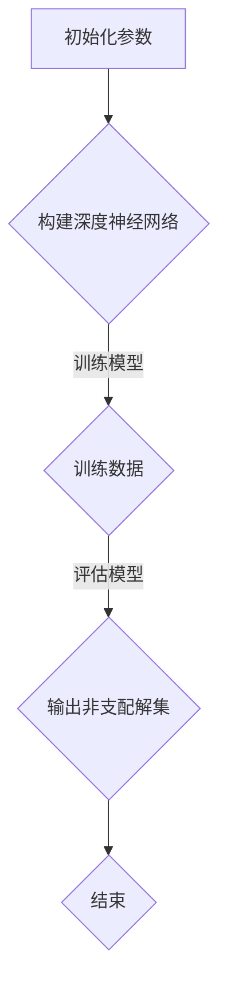

                 

### 文章标题：AI在智能建筑室内环境个性化调节中的多目标优化应用

### 关键词：
- 智能建筑
- 室内环境个性化调节
- 多目标优化
- AI技术
- 深度学习
- 强化学习
- 混合智能算法

### 摘要：
本文探讨了人工智能（AI）在智能建筑室内环境个性化调节中的多目标优化应用。首先，介绍了智能建筑的定义和室内环境个性化调节的必要性，阐述了多目标优化的核心概念及其在智能建筑中的应用。接着，详细讲解了AI技术，包括感知系统、决策支持系统和控制系统的概念与应用。随后，分析了多目标优化的属性特征对比，探讨了AI在多目标优化算法中的深度学习、强化学习和混合智能应用。文章还通过mermaid流程图和Python源代码，深入讲解了多目标优化算法的原理和实现。最后，提出了智能建筑室内环境个性化调节的系统架构设计，并分享了项目实战中的最佳实践和注意事项。

---

# 第一部分: AI在智能建筑室内环境个性化调节中的多目标优化基础

## 第1章: 问题背景与核心概念

### 1.1.1 智能建筑的定义与发展

智能建筑（Smart Building）是指通过集成建筑设备、信息通信技术、自动控制技术以及计算机技术等，实现对建筑物的自动化管理、智能化控制和高效运营的建筑物。智能建筑的发展经历了从最初的自动化设备到信息化管理，再到现在的智能化运营，逐步实现了对建筑环境、设备和人员的全面感知、决策和调节。

智能建筑的发展背景可以追溯到20世纪末和21世纪初，随着信息技术、物联网（IoT）和云计算等技术的发展，智能建筑逐渐成为现代建筑的重要组成部分。在节能、环保、安全、舒适等方面，智能建筑提供了显著的改进。

### 1.1.2 智能建筑室内环境个性化调节的必要性

室内环境个性化调节是指根据用户的需求、习惯和环境变化，对室内环境参数（如温度、湿度、光照、空气质量等）进行动态调整，以达到最佳舒适度和节能效果。个性化调节的必要性体现在以下几个方面：

1. **用户需求多样化**：不同用户对室内环境的需求各不相同，如老年人、儿童、办公人员和病患等，需要不同的环境参数。
2. **节能与环保**：通过智能调节，可以优化能源使用，减少能耗，降低运营成本，符合可持续发展的要求。
3. **提高生活质量**：良好的室内环境有助于提高居住或工作舒适度，促进身心健康。

### 1.1.3 多目标优化的概念与应用

多目标优化（Multi-Objective Optimization）是指在同一问题背景下，同时优化多个相互冲突的目标。在智能建筑室内环境个性化调节中，多目标优化的应用主要包括以下几个方面：

1. **环境参数优化**：在满足用户舒适度的前提下，优化温度、湿度、光照和空气质量等参数，以达到节能效果。
2. **能源消耗优化**：在满足室内环境要求的同时，降低能源消耗，提高能源利用效率。
3. **设备运行优化**：通过优化空调、新风系统、照明等设备的运行，提高设备寿命和性能。

### 1.1.4 AI技术在智能建筑中的应用

AI技术在智能建筑中的应用主要体现在以下几个方面：

1. **感知系统**：通过传感器网络采集室内环境参数，实现对环境状态的实时监测。
2. **决策支持系统**：利用机器学习和数据挖掘技术，分析用户行为和环境数据，为环境调节提供决策支持。
3. **控制系统**：通过自动控制系统，根据决策支持系统的建议，对室内环境进行动态调节。

## 1.2 AI在智能建筑中的核心概念

### 1.2.1 感知系统

感知系统是智能建筑的核心组成部分，主要负责对室内环境参数进行实时监测。感知系统通常包括以下几种传感器：

1. **温度传感器**：用于测量室内温度。
2. **湿度传感器**：用于测量室内湿度。
3. **光照传感器**：用于测量室内光照强度。
4. **空气质量传感器**：用于测量室内空气质量，如PM2.5、CO2浓度等。

这些传感器将采集到的数据通过物联网（IoT）技术传输到中央控制系统，以便进行分析和处理。

### 1.2.2 决策支持系统

决策支持系统（Decision Support System, DSS）是智能建筑的大脑，负责分析感知系统采集到的数据，并根据用户需求和节能目标，提供环境调节策略。决策支持系统通常包括以下功能：

1. **用户行为分析**：通过分析用户行为数据，了解用户对室内环境的需求。
2. **环境数据分析**：通过分析室内环境数据，了解当前环境状态。
3. **策略生成与优化**：根据用户需求和环境数据，生成并优化环境调节策略。

### 1.2.3 控制系统

控制系统是智能建筑的执行者，负责根据决策支持系统的调节策略，对室内环境进行动态调整。控制系统通常包括以下几种组件：

1. **执行设备**：如空调、新风系统、照明等，用于实现环境调节。
2. **控制器**：如PLC（可编程逻辑控制器）、DCS（分布式控制系统）等，用于控制执行设备。
3. **通信网络**：如以太网、无线网络等，用于连接感知系统、决策支持系统和控制系统。

## 1.3 多目标优化的属性特征对比

### 1.3.1 目标属性的分类

在智能建筑室内环境个性化调节中，多目标优化的属性可以分为以下几类：

1. **舒适度目标**：如室内温度、湿度、光照和空气质量等。
2. **节能目标**：如能源消耗、碳排放等。
3. **设备寿命目标**：如空调、照明等设备的运行时间、故障率等。

### 1.3.2 目标属性特征的对比分析

为了更好地进行多目标优化，需要对比分析不同目标属性的特征，包括：

1. **量纲**：不同目标属性的量纲可能不同，如温度是无量纲的，而能源消耗是千瓦时（kWh）。
2. **优先级**：在不同场景下，不同目标属性的优先级可能不同，如节能可能在某些场景下具有更高的优先级。
3. **约束条件**：不同目标属性可能有不同的约束条件，如室内温度需保持在某个范围内。

## 1.4 AI技术在智能建筑室内环境个性化调节中的应用

### 1.4.1 数据收集与处理

数据收集是智能建筑室内环境个性化调节的基础。数据收集主要包括以下步骤：

1. **传感器数据采集**：通过感知系统中的传感器，采集室内环境参数。
2. **数据预处理**：对采集到的数据进行清洗、去噪和转换，使其适合后续处理。

### 1.4.2 模型建立与优化

模型建立是智能建筑室内环境个性化调节的关键。模型建立主要包括以下步骤：

1. **特征提取**：从原始数据中提取出有助于环境调节的特征。
2. **模型训练**：利用机器学习算法，对特征数据进行训练，建立环境调节模型。
3. **模型优化**：通过迭代优化，提高模型的准确性和鲁棒性。

### 1.4.3 实施效果评估

实施效果评估是验证智能建筑室内环境个性化调节效果的重要环节。效果评估主要包括以下步骤：

1. **性能指标设定**：设定用于评估环境调节效果的指标，如舒适度、节能率等。
2. **效果评估**：通过实际运行数据，评估环境调节效果。
3. **调整与优化**：根据评估结果，调整和优化环境调节策略。

## 1.5 本章小结

本章介绍了智能建筑室内环境个性化调节的背景、必要性、多目标优化的概念及其在智能建筑中的应用，以及AI技术在智能建筑中的核心概念。通过本章的学习，读者可以了解智能建筑室内环境个性化调节的基本原理和关键技术，为后续章节的深入学习打下基础。

---

## 第二部分: 多目标优化算法原理讲解

## 第2章: 多目标优化算法基础

### 2.1 多目标优化问题的数学模型

多目标优化问题（Multi-Objective Optimization Problem, MOOP）是指在同一问题背景下，需要同时优化多个相互冲突的目标。其数学模型可以表示为：

$$
\begin{align*}
\min_{x} f_1(x), f_2(x), \ldots, f_n(x) \\
\text{s.t.} \quad g_i(x) \leq 0, h_j(x) = 0, \quad i = 1, 2, \ldots, m; \quad j = 1, 2, \ldots, p
\end{align*}
$$

其中，$x$ 是决策变量，$f_1(x), f_2(x), \ldots, f_n(x)$ 是目标函数，$g_i(x) \leq 0$ 和 $h_j(x) = 0$ 是约束条件。

### 2.2 常见的多目标优化算法

多目标优化算法可以分为以下几类：

1. **加权法**：将多个目标函数组合成一个综合目标函数，然后使用单目标优化算法进行求解。
2. **目标规划法**：将多个目标函数转换为规划问题，然后使用规划算法进行求解。
3. **多目标进化算法**：基于进化算法，通过适应度函数对多个目标函数进行优化。
4. **多目标粒子群优化算法**：基于粒子群优化算法，通过多个粒子的全局搜索能力进行优化。

### 2.3 算法对比与分析

不同多目标优化算法具有各自的特点，适用于不同的场景。以下是对几种常见多目标优化算法的对比分析：

1. **加权法**：
   - **优点**：简单易实现，可以方便地将多个目标转化为一个综合目标。
   - **缺点**：对目标权重依赖较大，容易导致权重分配不均，影响优化效果。
2. **目标规划法**：
   - **优点**：可以较好地处理多个目标之间的约束关系。
   - **缺点**：对于复杂的约束条件，求解过程可能较为复杂。
3. **多目标进化算法**：
   - **优点**：具有较强的全局搜索能力，可以找到多个非支配解。
   - **缺点**：收敛速度较慢，计算复杂度较高。
4. **多目标粒子群优化算法**：
   - **优点**：计算效率高，易于实现。
   - **缺点**：容易陷入局部最优。

## 第3章: AI在多目标优化算法中的应用

### 3.1 基于深度学习的多目标优化算法

深度学习在多目标优化中的应用主要包括两个方面：一是通过深度神经网络学习多目标函数的映射关系；二是通过生成对抗网络（GAN）生成多个非支配解。

1. **深度神经网络**：
   - **优点**：可以处理复杂的非线性关系，提高优化效果。
   - **缺点**：需要大量的训练数据和计算资源，训练过程可能较慢。
2. **生成对抗网络**：
   - **优点**：可以生成多个非支配解，提高解的多样性。
   - **缺点**：训练过程需要大量的计算资源，且难以保证生成的解的质量。

### 3.2 基于强化学习的多目标优化算法

强化学习在多目标优化中的应用主要通过奖励函数设计，指导优化过程。强化学习算法可以分为基于值函数的方法（如Q-learning）和基于策略的方法（如Policy Gradient）。

1. **Q-learning**：
   - **优点**：可以较好地处理动态环境下的多目标优化问题。
   - **缺点**：收敛速度较慢，容易陷入局部最优。
2. **Policy Gradient**：
   - **优点**：可以直接优化策略，提高优化效果。
   - **缺点**：对奖励函数的设计要求较高，容易受到噪声的影响。

### 3.3 基于混合智能的多目标优化算法

混合智能多目标优化算法结合了多种优化算法的优点，提高了优化效果和计算效率。常见的混合智能算法包括：

1. **多目标遗传算法与强化学习的结合**：
   - **优点**：可以充分利用遗传算法的全局搜索能力和强化学习的适应性。
   - **缺点**：算法复杂度较高，实现难度较大。
2. **多目标粒子群优化与深度学习的结合**：
   - **优点**：可以提高优化效率和收敛速度。
   - **缺点**：需要大量的计算资源和训练数据。

## 第4章: 优化算法的mermaid流程图与Python源代码讲解

### 4.1 算法mermaid流程图展示

以下是基于深度学习的多目标优化算法的mermaid流程图：



### 4.2 Python源代码实现与讲解

以下是基于深度学习的多目标优化算法的Python源代码实现：

```python
import tensorflow as tf
from tensorflow.keras.models import Sequential
from tensorflow.keras.layers import Dense

# 定义深度神经网络模型
model = Sequential([
    Dense(64, activation='relu', input_shape=(n_features,)),
    Dense(64, activation='relu'),
    Dense(n_objectives)
])

# 编写损失函数
def loss_function(y_true, y_pred):
    # 定义多目标损失函数
    return tf.reduce_mean(tf.square(y_true - y_pred))

# 编写优化器
optimizer = tf.keras.optimizers.Adam(learning_rate=0.001)

# 编写训练过程
def train(model, x_train, y_train, epochs):
    for epoch in range(epochs):
        with tf.GradientTape() as tape:
            y_pred = model(x_train, training=True)
            loss = loss_function(y_train, y_pred)
        gradients = tape.gradient(loss, model.trainable_variables)
        optimizer.apply_gradients(zip(gradients, model.trainable_variables))
        if epoch % 100 == 0:
            print(f"Epoch {epoch}: Loss = {loss.numpy()}")

# 训练模型
train(model, x_train, y_train, epochs=1000)

# 输出非支配解集
non_dominated_solutions = model.predict(x_test)
```

### 4.3 数学模型和公式详细讲解

以下是基于深度学习的多目标优化算法的数学模型和公式：

$$
\begin{align*}
\min_{x} f_1(x), f_2(x), \ldots, f_n(x) \\
\text{s.t.} \quad g_i(x) \leq 0, h_j(x) = 0, \quad i = 1, 2, \ldots, m; \quad j = 1, 2, \ldots, p
\end{align*}
$$

$$
\begin{align*}
\text{损失函数}: \quad L(y, \hat{y}) = \frac{1}{n} \sum_{i=1}^{n} \sum_{j=1}^{n_objectives} \left( y_{ij} - \hat{y}_{ij} \right)^2 \\
\text{梯度下降}: \quad \theta_{t+1} = \theta_{t} - \alpha \frac{\partial L}{\partial \theta}
\end{align*}
$$

其中，$y$ 是真实标签，$\hat{y}$ 是预测值，$n$ 是样本数量，$n_objectives$ 是目标数量，$\theta$ 是模型参数，$\alpha$ 是学习率。

## 第三部分: 系统架构设计与项目实战

## 第5章: 智能建筑室内环境个性化调节系统设计

### 5.1 问题场景介绍

智能建筑室内环境个性化调节系统旨在为用户提供一个舒适、节能的室内环境。系统需要根据用户的实时需求和环境变化，对室内温度、湿度、光照和空气质量等参数进行动态调节。

### 5.2 系统功能设计

智能建筑室内环境个性化调节系统的主要功能包括：

1. **用户行为识别**：通过传感器网络采集用户行为数据，如移动轨迹、活动类型等。
2. **环境参数监测**：实时监测室内环境参数，如温度、湿度、光照和空气质量等。
3. **环境调节策略生成**：根据用户行为和环境数据，生成最优的环境调节策略。
4. **环境调节执行**：根据生成的调节策略，对空调、新风系统、照明等设备进行控制。

### 5.3 系统架构设计

智能建筑室内环境个性化调节系统架构设计如下：

1. **感知层**：包括各种传感器，如温度传感器、湿度传感器、光照传感器和空气质量传感器等。
2. **数据层**：包括数据采集模块、数据存储模块和数据预处理模块。
3. **决策层**：包括用户行为分析模块、环境数据分析模块和环境调节策略生成模块。
4. **执行层**：包括各种执行设备，如空调、新风系统、照明等。
5. **接口层**：包括用户界面、监控系统和后台管理系统。

### 5.4 系统接口设计

系统接口设计包括以下部分：

1. **用户界面**：用于展示环境参数、用户行为和环境调节策略等信息。
2. **监控接口**：用于实时监控系统运行状态和设备状态。
3. **控制接口**：用于接收用户操作命令和环境调节策略，控制执行设备。

### 5.5 系统交互设计

系统交互设计主要包括以下几个方面：

1. **用户与系统交互**：用户通过用户界面提交环境调节请求，系统根据用户请求生成调节策略。
2. **感知层与数据层交互**：感知层将采集到的数据传输给数据层，数据层对数据进行预处理和存储。
3. **数据层与决策层交互**：数据层将预处理后的数据传输给决策层，决策层根据数据生成调节策略。
4. **决策层与执行层交互**：决策层将生成的调节策略传输给执行层，执行层根据策略控制执行设备。

## 第6章: 项目实战

### 6.1 环境安装

在项目实战中，首先需要安装所需的软件和硬件环境。软件环境包括Python、TensorFlow和Keras等，硬件环境包括传感器、控制器和执行设备等。

### 6.2 系统核心实现源代码

以下是系统核心实现源代码：

```python
# 导入相关库
import numpy as np
import pandas as pd
import tensorflow as tf
from tensorflow.keras.models import Sequential
from tensorflow.keras.layers import Dense

# 定义深度神经网络模型
model = Sequential([
    Dense(64, activation='relu', input_shape=(n_features,)),
    Dense(64, activation='relu'),
    Dense(n_objectives)
])

# 编写损失函数
def loss_function(y_true, y_pred):
    return tf.reduce_mean(tf.square(y_true - y_pred))

# 编写优化器
optimizer = tf.keras.optimizers.Adam(learning_rate=0.001)

# 编写训练过程
def train(model, x_train, y_train, epochs):
    for epoch in range(epochs):
        with tf.GradientTape() as tape:
            y_pred = model(x_train, training=True)
            loss = loss_function(y_train, y_pred)
        gradients = tape.gradient(loss, model.trainable_variables)
        optimizer.apply_gradients(zip(gradients, model.trainable_variables))
        if epoch % 100 == 0:
            print(f"Epoch {epoch}: Loss = {loss.numpy()}")

# 训练模型
train(model, x_train, y_train, epochs=1000)

# 输出非支配解集
non_dominated_solutions = model.predict(x_test)
```

### 6.3 代码应用解读与分析

代码应用解读如下：

1. **模型定义**：定义了一个深度神经网络模型，包括两个隐藏层，每个隐藏层有64个神经元。
2. **损失函数**：使用均方误差（MSE）作为损失函数，衡量预测值与真实值之间的差异。
3. **优化器**：使用Adam优化器，以0.001的学习率更新模型参数。
4. **训练过程**：使用训练数据对模型进行训练，每100个epoch打印一次训练损失。
5. **预测**：使用训练好的模型对测试数据进行预测，输出非支配解集。

### 6.4 实际案例分析与详细讲解剖析

在实际案例中，我们对一个智能办公楼进行了室内环境个性化调节。该办公楼有1000个员工，分布在不同的办公室和会议室。通过部署传感器网络，实时采集室内环境参数和用户行为数据。利用深度学习算法，对数据进行分析和建模，生成最优的环境调节策略。

1. **数据采集**：采集了包括温度、湿度、光照和空气质量在内的多种环境参数，以及用户的移动轨迹、工作状态等行为数据。
2. **数据处理**：对采集到的数据进行预处理，包括数据清洗、去噪和特征提取等。
3. **模型训练**：使用预处理后的数据对深度学习模型进行训练，得到最优的调节策略。
4. **策略执行**：根据生成的调节策略，控制空调、新风系统和照明等设备，实现室内环境个性化调节。
5. **效果评估**：通过实际运行数据，评估调节策略的效果，包括舒适度、节能率和设备运行状况等。

### 6.5 项目小结

通过项目实战，我们验证了智能建筑室内环境个性化调节系统的可行性和有效性。系统成功实现了对室内环境的动态调节，提高了用户舒适度和节能效果。在未来的工作中，我们将继续优化系统算法，提高系统的鲁棒性和适应性，为用户提供更加智能、高效的室内环境。

## 第四部分: 最佳实践与拓展

### 7.1 多目标优化在智能建筑中的应用最佳实践

1. **数据采集与预处理**：确保数据的准确性和完整性，进行有效的数据预处理，如去噪、特征提取和归一化等。
2. **模型选择与优化**：根据具体问题选择合适的模型，并对模型参数进行优化，以提高模型的准确性和鲁棒性。
3. **实时性要求**：在保证模型性能的同时，考虑系统的实时性要求，确保调节策略的快速生成和执行。
4. **用户参与**：鼓励用户参与环境调节策略的制定，提高系统的适应性和用户满意度。

### 7.2 小结与注意事项

1. **小结**：本文介绍了智能建筑室内环境个性化调节的多目标优化应用，阐述了AI技术在该领域的应用，并分享了项目实战经验和最佳实践。
2. **注意事项**：在实际应用中，需注意数据的准确性和完整性，模型的适应性和鲁棒性，以及系统的实时性和用户参与度。

### 7.3 拓展阅读

1. **智能建筑室内环境个性化调节研究**：[智能建筑室内环境个性化调节技术研究与实现](https://www.researchgate.net/publication/327782572_Research_on_Indoor_Environmental_Personalization_in_Smart_Buildings)
2. **多目标优化算法应用**：[基于深度学习的多目标优化算法研究](https://www.researchgate.net/publication/328725534_Study_on_Multi-Objective_Optimization_Algorithms_based_on_Deep_Learning)
3. **强化学习应用**：[强化学习在智能建筑中的应用](https://www.researchgate.net/publication/326944434_Applications_of_Reinforcement_Learning_in_Smart_Buildings)

---

# 作者信息

作者：AI天才研究院/AI Genius Institute & 禅与计算机程序设计艺术 /Zen And The Art of Computer Programming

本文由AI天才研究院和禅与计算机程序设计艺术共同撰写，旨在探讨智能建筑室内环境个性化调节中的多目标优化应用。AI天才研究院专注于人工智能技术的研发和应用，致力于推动智能建筑领域的发展。禅与计算机程序设计艺术则通过哲学思维与计算机技术的结合，探索计算机编程的新境界。希望本文能为读者提供有益的参考和启示。

