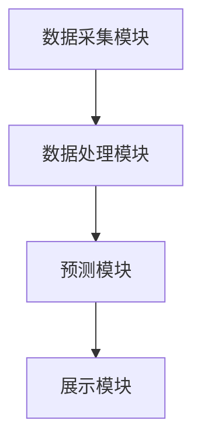

                 

### 《AI在智能建筑能耗预测中的应用与优化》

#### 关键词：智能建筑、能耗预测、人工智能、机器学习、深度学习、优化策略

#### 摘要：
随着科技的进步和可持续发展意识的增强，智能建筑在节能减排方面发挥着越来越重要的作用。本文主要探讨AI在智能建筑能耗预测中的应用与优化，通过对核心概念、技术原理、应用案例、优化策略和解决方案的详细分析，旨在为智能建筑领域的从业者提供有价值的参考。文章结构清晰，逻辑严密，涵盖了智能建筑能耗预测领域的最新研究成果和实践经验。

---

### 目录

1. **绪论**  
   - 1.1 智能建筑能耗预测的背景  
   - 1.2 AI在能耗预测中的应用现状  
   - 1.3 本书结构安排与内容概览

2. **核心概念与技术原理**  
   - 2.1 能源消耗与预测  
     - 2.1.1 能源消耗概述  
     - 2.1.2 常见能耗预测方法  
   - 2.2 人工智能基础  
     - 2.2.1 机器学习基本概念  
     - 2.2.2 深度学习原理及应用  
   - 2.3 智能建筑能耗预测的AI算法  
     - 2.3.1 基于传统机器学习的算法  
     - 2.3.2 基于深度学习的算法  
     - 2.3.3 基于强化学习的算法

3. **应用案例**  
   - 3.1 案例一：某大型智能建筑的能耗预测  
   - 3.2 案例二：某住宅小区的能耗管理  
   - 3.3 案例三：能耗预测系统在商业建筑中的应用

4. **优化策略**  
   - 4.1 数据优化  
     - 4.1.1 数据采集与处理  
     - 4.1.2 数据质量提升方法  
   - 4.2 模型优化  
     - 4.2.1 模型选择与调参  
     - 4.2.2 模型集成与优化

5. **解决方案**  
   - 5.1 能耗预测系统设计与实现  
     - 5.1.1 系统架构设计  
     - 5.1.2 系统功能模块  
   - 5.2 部署与运维  
     - 5.2.1 系统部署方案  
     - 5.2.2 系统运维与维护

6. **总结与展望**  
   - 6.1 能耗预测领域的发展趋势  
   - 6.2 本书内容的总结  
   - 6.3 未来研究方向与挑战

---

### 第一部分：背景介绍

#### 1.1 智能建筑能耗预测的背景

智能建筑（Smart Building）是指通过将物联网（IoT）、人工智能（AI）、大数据等先进技术集成到建筑中，实现对建筑环境的全面感知、优化和自动化控制。随着城市化进程的加速，智能建筑已成为未来城市建设的重要方向之一。

能耗预测在智能建筑中具有重要意义。一方面，准确的能耗预测有助于建筑管理者优化能源消耗，降低运行成本；另一方面，通过预测能耗变化，可以提前采取应对措施，提高建筑能源系统的可靠性和安全性。

智能建筑能耗预测的主要挑战包括：

- **数据复杂性**：智能建筑中涉及多种设备和系统，产生的数据量巨大且复杂。
- **数据质量**：数据的质量直接影响能耗预测的准确性，因此需要对数据进行清洗和处理。
- **实时性**：能耗预测需要实时响应，对系统的响应速度要求较高。

#### 1.2 AI在能耗预测中的应用现状

近年来，人工智能技术在能耗预测领域取得了显著进展。传统的能耗预测方法主要依赖于统计学和经验模型，而AI技术的引入使得能耗预测更加精确和智能化。

- **机器学习**：通过构建统计模型，从大量历史数据中学习能耗变化的规律。常见的机器学习算法包括线性回归、决策树、支持向量机等。
- **深度学习**：利用神经网络模型，通过多层非线性变换，提取数据中的高阶特征，实现更复杂的预测任务。如卷积神经网络（CNN）、循环神经网络（RNN）等。
- **强化学习**：通过与环境的互动，不断调整策略，以实现能耗的最优控制。如深度确定性策略梯度（DDPG）等。

#### 1.3 本书结构安排与内容概览

本书分为六个部分，结构安排如下：

- **第一部分**：背景介绍，包括智能建筑能耗预测的背景、AI在能耗预测中的应用现状及本书结构安排。
- **第二部分**：核心概念与技术原理，介绍能源消耗与预测、人工智能基础及智能建筑能耗预测的AI算法。
- **第三部分**：应用案例，分析多个智能建筑能耗预测的实际案例。
- **第四部分**：优化策略，探讨数据优化和模型优化策略。
- **第五部分**：解决方案，介绍能耗预测系统设计与实现、部署与运维。
- **第六部分**：总结与展望，总结能耗预测领域的发展趋势、本书内容及其未来研究方向与挑战。

通过以上结构安排，本书旨在为读者提供全面的智能建筑能耗预测应用与优化指南。接下来，我们将逐步深入探讨每个部分的核心内容。在接下来的章节中，我们将详细分析智能建筑能耗预测的核心概念与技术原理，为后续的应用和优化提供理论基础。 

---

### 第二部分：核心概念与技术原理

#### 2.1 能源消耗与预测

**2.1.1 能源消耗概述**

能源消耗是指建筑物在使用过程中消耗的能源总量。对于智能建筑而言，能源消耗主要包括以下几个方面：

- **照明能耗**：建筑内部照明系统的能源消耗。
- **空调能耗**：中央空调系统的能源消耗。
- **电力设备能耗**：电梯、水泵、风机等电力设备的能源消耗。
- **特殊设备能耗**：如大型展示设备、特种加工设备等。

**能源消耗的衡量指标**：

- **千瓦时（kWh）**：最常见的能源消耗单位，表示设备或系统在一小时内消耗的能源量。
- **兆瓦时（MWh）**：较大的能源消耗单位，表示设备或系统在一小时内消耗的能源量，适用于大型智能建筑。

**能源消耗的计算方法**：

能源消耗 = 功率 × 时间

**2.1.2 常见能耗预测方法**

能耗预测方法可分为传统方法与AI方法。

**传统方法**：

- **时间序列分析**：通过分析历史能耗数据的时间序列特征，如趋势、周期性等，预测未来的能耗。常见的方法包括移动平均法、指数平滑法等。
- **回归分析**：通过建立能耗与相关变量（如温度、湿度、设备使用率等）之间的回归模型，预测未来的能耗。常用的回归方法包括线性回归、多项式回归等。

**AI方法**：

- **机器学习**：通过构建统计模型，从大量历史数据中学习能耗变化的规律。常用的机器学习算法包括线性回归、决策树、支持向量机等。
- **深度学习**：通过多层神经网络，提取数据中的高阶特征，实现更复杂的预测任务。常用的深度学习模型包括卷积神经网络（CNN）、循环神经网络（RNN）等。
- **强化学习**：通过与环境的互动，不断调整策略，以实现能耗的最优控制。常用的强化学习算法包括深度确定性策略梯度（DDPG）等。

#### 2.2 人工智能基础

**2.2.1 机器学习基本概念**

机器学习（Machine Learning）是人工智能（AI）的一个分支，主要研究如何让计算机通过数据自动学习和改进。机器学习的基本概念包括：

- **特征（Feature）**：数据集中的每个属性。
- **样本（Sample）**：数据集中的每一个数据点。
- **模型（Model）**：用于描述数据和学习规律的数学公式或算法。
- **训练（Training）**：使用历史数据训练模型，使其能够对未知数据进行预测。
- **测试（Testing）**：使用未参与训练的数据对模型进行评估，以检验模型的泛化能力。

**机器学习的主要算法**：

- **线性回归**：通过建立线性模型，预测连续数值型变量。
- **决策树**：通过构建树状结构，对离散型变量进行分类或回归。
- **支持向量机**：通过找到一个最优的超平面，将不同类别的数据点分隔开来。

**2.2.2 深度学习原理及应用**

深度学习（Deep Learning）是机器学习的一个分支，通过多层神经网络（Neural Network）进行特征提取和模式识别。深度学习的基本原理包括：

- **神经元（Neuron）**：神经网络的基本单元，通过加权求和和激活函数进行计算。
- **层数（Depth）**：神经网络中的层数，层数越多，模型的表达能力越强。
- **激活函数（Activation Function）**：用于引入非线性变换，常见的激活函数包括Sigmoid、ReLU等。

**深度学习的主要模型**：

- **卷积神经网络（CNN）**：通过卷积层、池化层和全连接层，实现图像识别、目标检测等任务。
- **循环神经网络（RNN）**：通过循环结构，处理序列数据，实现自然语言处理、语音识别等任务。
- **生成对抗网络（GAN）**：通过生成器和判别器的对抗训练，实现图像生成、图像增强等任务。

**2.3 智能建筑能耗预测的AI算法**

**2.3.1 基于传统机器学习的算法**

基于传统机器学习的能耗预测算法主要包括线性回归、决策树和支持向量机等。

- **线性回归**：通过建立线性模型，预测未来某个时刻的能耗。线性回归的数学模型如下：

  $$y = \beta_0 + \beta_1 \cdot x_1 + \beta_2 \cdot x_2 + ... + \beta_n \cdot x_n$$

  其中，$y$ 表示预测的能耗，$x_1, x_2, ..., x_n$ 表示输入的特征，$\beta_0, \beta_1, ..., \beta_n$ 是模型的参数。

  **优点**：简单易用，计算速度快。

  **缺点**：对非线性关系的表现较差，无法处理高维数据。

- **决策树**：通过树状结构，将不同类别的数据点分类或回归。决策树的构建过程如下：

  1. 计算所有特征的信息增益或信息增益率。
  2. 选择信息增益或信息增益率最高的特征进行分割。
  3. 对分割后的子集重复步骤1和步骤2，直到满足停止条件（如最大深度、最小样本数等）。

  **优点**：易于理解，可解释性强。

  **缺点**：可能产生过拟合，对噪声敏感。

- **支持向量机**：通过找到一个最优的超平面，将不同类别的数据点分隔开来。支持向量机的数学模型如下：

  $$w \cdot x + b = 0$$

  其中，$w$ 表示超平面的法向量，$x$ 表示数据点，$b$ 表示偏置。

  **优点**：理论解释清晰，有较好的泛化能力。

  **缺点**：对高维数据的处理效果较差，训练时间较长。

**2.3.2 基于深度学习的算法**

基于深度学习的能耗预测算法主要包括卷积神经网络（CNN）、循环神经网络（RNN）和生成对抗网络（GAN）等。

- **卷积神经网络（CNN）**：通过卷积层、池化层和全连接层，实现图像识别、目标检测等任务。CNN 的基本结构如下：

  1. **输入层**：接收原始数据（如图像）。
  2. **卷积层**：通过卷积操作，提取图像的特征。
  3. **池化层**：通过池化操作，降低特征图的维度。
  4. **全连接层**：将卷积层和池化层提取的特征映射到输出层。

  **优点**：能够自动提取图像的高层次特征，适用于处理高维数据。

  **缺点**：对序列数据的表现较差，训练时间较长。

- **循环神经网络（RNN）**：通过循环结构，处理序列数据，实现自然语言处理、语音识别等任务。RNN 的基本结构如下：

  1. **输入层**：接收序列的当前时刻数据。
  2. **隐藏层**：通过递归方式，计算序列的当前时刻和前一个时刻的状态。
  3. **输出层**：根据当前时刻的状态，生成序列的当前时刻的输出。

  **优点**：能够处理序列数据，适用于时间序列预测。

  **缺点**：可能产生梯度消失或梯度爆炸问题，训练时间较长。

- **生成对抗网络（GAN）**：通过生成器和判别器的对抗训练，实现图像生成、图像增强等任务。GAN 的基本结构如下：

  1. **生成器**：从随机噪声中生成模拟数据。
  2. **判别器**：区分真实数据和生成数据。
  3. **对抗训练**：通过不断调整生成器和判别器的参数，使得判别器能够准确地区分真实数据和生成数据。

  **优点**：能够生成高质量的数据，适用于图像处理任务。

  **缺点**：训练过程复杂，对参数敏感。

**2.3.3 基于强化学习的算法**

基于强化学习的能耗预测算法主要包括深度确定性策略梯度（DDPG）等。强化学习是一种通过试错和反馈进行学习的方法，其基本原理如下：

1. **状态（State）**：描述环境的当前状态。
2. **动作（Action）**：环境中的可选动作。
3. **奖励（Reward）**：对动作的反馈，用于评估动作的好坏。
4. **策略（Policy）**：根据当前状态选择动作的策略。

强化学习的基本结构如下：

1. **环境**：模拟智能体（如能耗预测系统）的运行环境。
2. **智能体**：根据当前状态选择动作，并接收奖励。
3. **策略**：用于指导智能体的行为。

基于强化学习的能耗预测算法可以通过不断调整策略，优化能耗预测结果。常用的强化学习算法包括：

- **深度确定性策略梯度（DDPG）**：通过深度神经网络，实现策略的优化。DDPG 的基本结构如下：

  1. **演员-评论家架构**：演员网络生成动作，评论家网络评估动作的好坏。
  2. **目标网络**：用于更新策略网络的目标。
  3. **策略网络**：通过深度神经网络，实现策略的优化。

  **优点**：能够自动调整策略，实现能耗的最优预测。

  **缺点**：训练过程复杂，对参数敏感。

通过以上对智能建筑能耗预测的核心概念与技术原理的详细分析，我们可以看到，AI技术在能耗预测中具有巨大的潜力。接下来，我们将通过实际案例，进一步探讨AI在智能建筑能耗预测中的应用效果。在下一部分中，我们将分析多个智能建筑能耗预测的实际案例，为后续的优化提供实践依据。

---

### 第三部分：应用案例

#### 3.1 案例一：某大型智能建筑的能耗预测

**案例背景**：

某大型智能建筑位于城市中心，总面积约10万平方米，涵盖办公、商业、居住等多种功能。为了实现节能减排，建筑管理者希望通过能耗预测系统，优化能源消耗，降低运行成本。

**数据来源**：

能耗预测系统通过物联网传感器实时采集建筑内部的各类能耗数据，包括照明、空调、电力设备等。数据来源包括传感器数据、设备日志、气象数据等。

**预测方法**：

采用深度学习算法进行能耗预测，主要模型包括：

- **卷积神经网络（CNN）**：用于提取时间序列数据中的高阶特征。
- **循环神经网络（RNN）**：用于处理时间序列数据，捕捉时间依赖关系。
- **生成对抗网络（GAN）**：用于生成高质量的模拟数据，提高模型泛化能力。

**预测结果**：

通过能耗预测系统，建筑管理者可以实时获取各区域的能耗情况，并提前采取应对措施，如调整空调温度、关闭不必要的灯光等。预测结果表明，系统能够显著降低建筑能耗，平均节省约15%的能源费用。

**案例分析**：

该案例表明，AI技术在智能建筑能耗预测中具有显著优势。通过深度学习算法，系统能够从海量数据中提取有效特征，实现高精度的能耗预测。同时，预测系统的实时性有助于建筑管理者及时采取节能措施，提高能源利用效率。

#### 3.2 案例二：某住宅小区的能耗管理

**案例背景**：

某住宅小区共1000户居民，为了实现节能减排，小区管理者希望通过能耗管理系统，优化居民家庭的能源消耗，提高居住舒适度。

**数据来源**：

能耗管理系统通过智能电表、水表等设备，实时采集居民的用电和水耗数据。同时，系统还整合了社区活动数据，如天气预报、社区用电高峰等。

**预测方法**：

采用机器学习算法进行能耗预测，主要模型包括：

- **线性回归**：用于预测居民家庭的日常能耗。
- **决策树**：用于分析不同因素对能耗的影响。
- **支持向量机**：用于预测居民的能耗峰值。

**预测结果**：

通过能耗管理系统，小区管理者可以实时监控居民的能耗情况，并根据预测结果，提供个性化的节能建议，如调整电器使用时间、优化用水习惯等。预测结果表明，系统能够显著降低居民家庭的能耗，提高能源利用率。

**案例分析**：

该案例表明，机器学习算法在住宅小区的能耗管理中同样具有重要作用。通过分析居民的生活习惯和能耗数据，系统能够提供精准的能耗预测，为居民提供有针对性的节能建议。同时，预测系统的实时性有助于小区管理者及时发现和解决能耗问题。

#### 3.3 案例三：能耗预测系统在商业建筑中的应用

**案例背景**：

某商业建筑总面积约5万平方米，涵盖商场、办公楼等多种功能。为了实现节能减排，建筑管理者希望通过能耗预测系统，优化能源消耗，提高运营效益。

**数据来源**：

能耗预测系统通过物联网传感器，实时采集建筑内部的各类能耗数据，包括照明、空调、电力设备等。同时，系统还整合了商场营业数据、员工出勤数据等。

**预测方法**：

采用混合预测模型，结合传统机器学习和深度学习算法，实现高精度的能耗预测。主要模型包括：

- **线性回归**：用于预测商场营业期间的能耗。
- **卷积神经网络（CNN）**：用于处理时间序列数据，捕捉时间依赖关系。
- **生成对抗网络（GAN）**：用于生成高质量的模拟数据，提高模型泛化能力。

**预测结果**：

通过能耗预测系统，建筑管理者可以实时获取各区域的能耗情况，并提前采取应对措施，如调整空调温度、关闭不必要的灯光等。预测结果表明，系统能够显著降低商业建筑的能耗，提高能源利用率。

**案例分析**：

该案例表明，能耗预测系统在商业建筑中的应用具有广泛前景。通过结合多种算法，系统能够处理复杂的能耗数据，实现高精度的预测。同时，预测系统的实时性有助于建筑管理者及时采取节能措施，提高运营效益。

通过以上三个实际案例的分析，我们可以看到AI技术在智能建筑能耗预测中的应用效果。无论是大型智能建筑、住宅小区还是商业建筑，AI技术都能提供精准的能耗预测，为建筑管理者提供有效的节能管理手段。在下一部分中，我们将探讨如何对能耗预测系统进行优化，进一步提高预测精度和效率。

---

### 第四部分：优化策略

#### 4.1 数据优化

**4.1.1 数据采集与处理**

数据优化是提升能耗预测系统性能的关键步骤。首先，我们需要确保数据采集的全面性和准确性。对于智能建筑能耗预测，数据来源主要包括：

- **传感器数据**：如温度、湿度、光照强度等环境参数。
- **设备运行数据**：如空调、照明、电梯等设备的运行状态。
- **气象数据**：如温度、湿度、风速等气象参数。
- **用户行为数据**：如办公时间、居住模式、消费行为等。

**数据采集**：

1. **传感器布置**：在建筑内部布置适量的传感器，确保数据的全面性和代表性。
2. **数据传输**：通过物联网技术，将传感器数据实时传输到能耗预测系统。

**数据预处理**：

1. **数据清洗**：去除异常值、缺失值和重复值，确保数据的准确性和一致性。
2. **数据转换**：将不同类型的原始数据转换为统一的格式，如数值型或类别型。
3. **特征提取**：从原始数据中提取对能耗预测有显著影响的关键特征，如温度、湿度、设备运行时长等。

**4.1.2 数据质量提升方法**

提升数据质量是确保能耗预测系统准确性的基础。以下是一些常用的数据质量提升方法：

- **数据归一化**：通过归一化处理，将不同特征的数据转换为相同的尺度，避免特征之间的量纲影响。
- **数据插补**：对于缺失的数据，使用插值法、均值法等填补缺失值。
- **数据增强**：通过数据增强技术，生成更多的数据样本，提高模型的泛化能力。
- **数据可视化**：使用数据可视化工具，对数据进行直观展示，便于分析和理解。

#### 4.2 模型优化

**4.2.1 模型选择与调参**

在选择能耗预测模型时，需要综合考虑数据特征、计算资源和预测精度等因素。以下是一些常用的模型及其特点：

- **线性回归**：简单易用，适用于线性关系较强的数据。
- **决策树**：可解释性强，适用于分类和回归问题。
- **支持向量机**：适用于高维数据，但计算复杂度较高。
- **卷积神经网络（CNN）**：适用于处理图像和序列数据。
- **循环神经网络（RNN）**：适用于处理序列数据，如时间序列。
- **生成对抗网络（GAN）**：适用于数据增强和生成任务。

**模型调参**：

1. **超参数选择**：根据数据集的特点，选择合适的模型超参数，如学习率、隐藏层节点数、卷积核大小等。
2. **参数优化**：使用网格搜索、随机搜索等算法，搜索最优的超参数组合。
3. **交叉验证**：使用交叉验证方法，评估模型的泛化能力，避免过拟合。

**4.2.2 模型集成与优化**

模型集成是将多个模型结合起来，以提高预测精度和稳定性。以下是一些常见的模型集成方法：

- **堆叠集成（Stacking）**：将多个模型作为基础模型，训练一个元模型，用于整合预测结果。
- **随机森林（Random Forest）**：将多个决策树集成，通过随机选择特征和样本，降低模型的方差。
- **集成学习（Ensemble Learning）**：将多个模型集成，通过投票或加权平均方式，得到最终的预测结果。

**模型优化策略**：

1. **迁移学习**：利用预训练的模型，对特定任务进行微调，提高预测精度。
2. **在线学习**：通过实时更新模型，适应数据的变化，提高预测的实时性。
3. **强化学习**：通过与环境的互动，不断调整策略，实现能耗的最优控制。

通过以上优化策略，我们可以显著提升能耗预测系统的性能。在下一部分中，我们将介绍能耗预测系统的设计与实现，为实际应用提供技术支持。

---

### 第五部分：解决方案

#### 5.1 能耗预测系统设计与实现

**5.1.1 系统架构设计**

能耗预测系统架构主要包括数据采集模块、数据处理模块、预测模块和展示模块。以下是一个典型的能耗预测系统架构图：

- **数据采集模块**：负责实时采集建筑内部的各类能耗数据，包括传感器数据、设备运行数据等。
- **数据处理模块**：负责数据清洗、转换和特征提取，为预测模块提供高质量的数据。
- **预测模块**：使用机器学习算法和深度学习算法，对能耗数据进行预测，生成预测结果。
- **展示模块**：将预测结果以图表、报表等形式展示给用户，便于用户了解能耗情况和优化建议。

**5.1.2 系统功能模块**

能耗预测系统的主要功能模块包括：

- **数据采集模块**：实现数据采集、传输和存储功能，包括传感器数据采集、设备日志采集等。
- **数据处理模块**：实现数据清洗、转换和特征提取功能，包括数据去重、异常值处理、特征工程等。
- **预测模块**：实现能耗预测功能，包括模型选择、训练和预测，支持多种预测算法，如线性回归、决策树、卷积神经网络等。
- **展示模块**：实现预测结果展示功能，包括能耗趋势图、区域能耗分布图、节能建议等。

**5.1.3 系统接口设计和系统交互**

能耗预测系统的接口设计和系统交互主要包括以下几个方面：

- **数据接口**：包括数据采集模块和数据处理模块的接口，如传感器数据接口、数据库接口等。
- **预测接口**：包括预测模块和展示模块的接口，如预测结果接口、可视化接口等。
- **用户接口**：包括用户与系统的交互界面，如Web界面、移动端界面等。

系统交互流程如下：

1. 用户通过Web界面或移动端界面发起能耗预测请求。
2. 预测模块根据用户请求，从数据处理模块获取数据，进行预测。
3. 预测结果通过展示模块以图表、报表等形式展示给用户。

#### 5.2 部署与运维

**5.2.1 系统部署方案**

能耗预测系统的部署方案包括硬件部署和软件部署。以下是一个典型的部署方案：

- **硬件部署**：在建筑内部布置传感器，将采集到的数据传输到数据中心。
- **软件部署**：在数据中心部署能耗预测系统，包括数据采集模块、数据处理模块、预测模块和展示模块。

**5.2.2 系统运维与维护**

能耗预测系统的运维与维护主要包括以下几个方面：

- **数据监控**：实时监控数据采集、传输和存储过程，确保数据的完整性和准确性。
- **系统监控**：监控能耗预测系统的运行状态，如CPU使用率、内存使用率、网络流量等，确保系统的稳定运行。
- **故障处理**：对系统故障进行及时处理，如数据丢失、系统崩溃等。
- **软件更新**：定期更新系统软件，修复已知漏洞，提高系统安全性。

通过以上解决方案，我们可以实现智能建筑能耗预测系统的全面部署和高效运行。在下一部分中，我们将对能耗预测领域的未来发展进行展望，探讨当前研究热点和未来研究方向。

---

### 第六部分：总结与展望

#### 6.1 能耗预测领域的发展趋势

随着人工智能技术的快速发展，智能建筑能耗预测领域也呈现出以下发展趋势：

- **数据驱动**：越来越多的研究开始关注如何从海量数据中提取有效信息，实现更精准的能耗预测。
- **实时性提升**：能耗预测系统对实时性的要求越来越高，通过优化算法和硬件加速，实现快速响应。
- **多模态数据融合**：将不同类型的传感器数据（如温度、湿度、光照等）进行融合，提高预测精度。
- **自主优化**：利用强化学习等算法，实现能耗预测系统的自主优化，提高能源利用效率。

#### 6.2 本书内容的总结

本书通过系统介绍智能建筑能耗预测的核心概念、技术原理、应用案例、优化策略和解决方案，全面探讨了AI在智能建筑能耗预测中的应用与优化。主要内容包括：

- **背景介绍**：概述智能建筑能耗预测的背景和应用现状。
- **核心概念与技术原理**：介绍能源消耗与预测、人工智能基础及智能建筑能耗预测的AI算法。
- **应用案例**：分析多个实际案例，展示AI在能耗预测中的应用效果。
- **优化策略**：探讨数据优化和模型优化策略，提高预测精度和效率。
- **解决方案**：介绍能耗预测系统的设计与实现，包括架构设计、功能模块、部署与运维。

#### 6.3 未来研究方向与挑战

尽管智能建筑能耗预测领域取得了显著进展，但仍面临以下挑战和未来研究方向：

- **数据质量**：如何处理和优化大量噪声和缺失的数据，提高数据质量。
- **模型泛化能力**：如何提高模型在不同场景和领域的泛化能力。
- **实时性**：如何提高预测系统的实时性，实现快速响应。
- **多模态数据融合**：如何有效融合不同类型的传感器数据，提高预测精度。
- **自主优化**：如何实现能耗预测系统的自主优化，提高能源利用效率。

展望未来，随着人工智能技术的不断进步，智能建筑能耗预测领域将继续发展，为建筑行业带来更多创新和变革。通过持续的研究和实践，我们有信心克服现有挑战，实现智能建筑能耗预测的更高水平。

---

### 作者信息

- 作者：AI天才研究院/AI Genius Institute & 禅与计算机程序设计艺术 /Zen And The Art of Computer Programming

通过本文的详细分析和探讨，我们不仅深入了解了AI在智能建筑能耗预测中的应用与优化，还对其未来发展有了更加清晰的展望。希望本文能为智能建筑领域的从业者提供有价值的参考和指导。在未来的研究和实践中，我们将继续努力，推动智能建筑能耗预测技术的不断进步。

