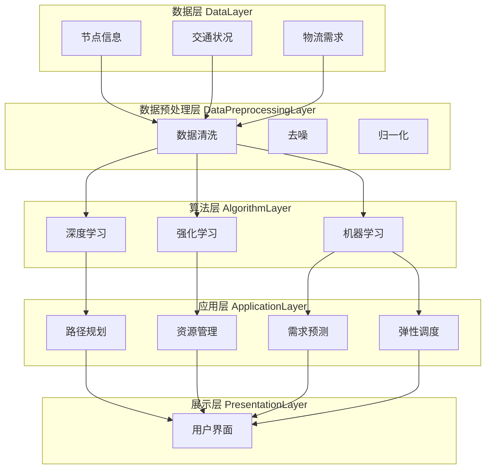
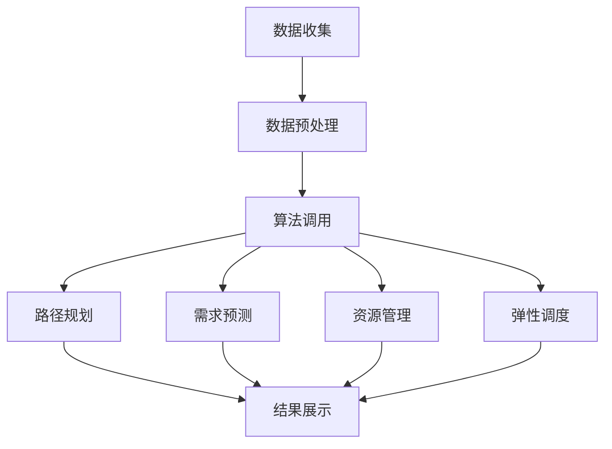

                 


## AI在智能物流网络优化中的应用

### 2.1.1 物流网络优化的基本概念

#### 2.1.1.1 物流网络的组成元素

物流网络是物流系统的重要组成部分，它由多个节点和连接这些节点的边组成。节点代表物流网络中的各种设施和场所，包括仓库、配送中心、运输枢纽、工厂和客户等。而边则表示节点之间的物流路径，这些路径可以是公路、铁路、航空、海运等多种运输方式。

##### 2.1.1.1.1 节点

在物流网络中，节点具有以下几种类型：

- **起点节点**：物流活动的起点，如工厂或仓库。
- **中间节点**：物流过程中经过的节点，如配送中心或转运站。
- **终点节点**：物流活动的终点，如客户的地址。

每个节点在物流网络中都具有独特的功能和角色，节点之间的联系构成了物流网络的基本骨架。

##### 2.1.1.1.2 边

物流网络的边代表节点之间的物流路径。这些路径可以根据不同的运输方式分为以下几种：

- **公路运输**：适用于短距离和灵活性要求高的物流活动。
- **铁路运输**：适用于长距离、大宗物资的运输。
- **航空运输**：适用于紧急、高价值物资的运输。
- **海运运输**：适用于跨国、跨大陆的长距离运输。

物流网络中的边不仅表示运输路径，还包含运输时间、运输成本和运输容量等关键信息。

#### 2.1.1.2 物流网络的功能

物流网络的功能主要包括以下几个方面：

##### 2.1.1.2.1 资源分配

物流网络优化旨在合理分配物流资源，如运输车辆、人力、仓储空间等，以最大化运输效率和降低成本。通过优化资源分配，可以提高物流网络的运作效率，减少不必要的浪费。

##### 2.1.1.2.2 路径规划

路径规划是物流网络优化的核心任务之一。它通过计算不同节点之间的最优路径，实现物流活动的高效进行。路径规划需要考虑的因素包括运输时间、运输成本、交通状况、货物类型等。

##### 2.1.1.2.3 调度管理

调度管理是指对物流活动进行时间和空间的合理安排，以确保物流网络的高效运行。调度管理需要根据实际需求和资源状况，灵活调整物流活动的执行顺序和资源分配。

##### 2.1.1.2.4 信息服务

信息服务是物流网络的重要组成部分，它为物流活动提供实时的数据和信息支持。通过信息服务，物流网络可以实现信息的实时传输和共享，提高物流活动的透明度和协同效率。

### 2.1.2 问题的背景

#### 2.1.2.1 智能物流网络的现状与挑战

随着全球电商和物流业的蓬勃发展，物流网络的重要性日益凸显。智能物流网络的引入，旨在通过人工智能技术提高物流网络的弹性、灵活性和效率，以满足日益增长的物流需求。

然而，当前智能物流网络在实际应用中仍面临诸多挑战：

- **路径规划不合理**：传统的物流路径规划方法往往基于静态数据，无法适应实时交通状况和需求变化。
- **资源浪费**：物流资源分配不合理，导致运输成本高、效率低。
- **信息孤岛**：物流活动中的信息传输不畅通，影响物流网络的协同效率。
- **应急预案不足**：物流网络在应对突发事件和需求波动时缺乏有效的应急预案。

#### 2.1.2.2 AI在物流网络优化中的应用

人工智能技术，特别是深度学习和强化学习等，在物流网络优化领域展现了巨大的潜力。通过人工智能技术，可以实现对物流路径的智能规划，提高运输效率；通过预测算法，可以提前预判物流需求变化，实现资源优化配置。

具体来说，AI在物流网络优化中的应用主要体现在以下几个方面：

- **路径规划**：使用深度学习算法对复杂物流路径进行智能规划，提高路径规划的准确性和效率。
- **需求预测**：利用机器学习算法对物流需求进行预测，为资源优化提供数据支持。
- **弹性调度**：通过强化学习算法实现物流资源的动态调整，提高物流网络的弹性。
- **智能决策**：利用大数据分析和智能决策算法，实现物流活动的智能化管理和调度。

### 2.1.3 解决方案

为了解决智能物流网络优化中的问题，需要采用一系列技术手段和方法。以下是一些可能的解决方案：

- **构建智能物流网络模型**：通过数据采集和分析，构建一个全面、准确的智能物流网络模型，为后续优化提供基础。
- **应用深度学习算法**：使用深度学习算法对物流路径进行优化，提高路径规划的准确性和效率。
- **实施强化学习算法**：通过强化学习算法实现物流资源的动态调整，提高物流网络的弹性。
- **建立需求预测模型**：利用机器学习算法对物流需求进行预测，为资源优化提供数据支持。
- **优化信息传输系统**：构建一个高效、稳定的信息传输系统，实现物流活动中的信息实时传输和共享。
- **制定应急预案**：针对突发事件和需求波动，制定合理的应急预案，提高物流网络的应对能力。

### 2.1.4 边界与外延

在智能物流网络优化中，需要明确以下边界和范围：

- **优化对象**：物流网络中的节点、边和物流活动。
- **优化目标**：提高物流网络的效率、降低成本、增强弹性。
- **优化范围**：物流网络中的所有环节，包括路径规划、资源分配、调度管理、信息服务等。
- **技术手段**：深度学习、强化学习、机器学习、大数据分析等。

### 2.1.5 概念结构与核心要素组成

智能物流网络优化的概念结构主要包括以下几个核心要素：

- **物流网络模型**：描述物流网络的结构和功能，为后续优化提供基础。
- **路径规划算法**：实现物流路径的智能规划，提高路径规划的准确性和效率。
- **需求预测模型**：预测物流需求变化，为资源优化提供数据支持。
- **资源分配策略**：合理分配物流资源，提高物流网络的效率。
- **调度管理机制**：实现物流活动的实时调度和管理，提高物流网络的弹性。

这些核心要素共同构成了智能物流网络优化的概念结构，为解决物流网络优化问题提供了理论依据和实践指导。

## 2.2 AI在物流网络优化中的应用

### 2.2.1 深度学习在路径规划中的应用

#### 2.2.1.1 深度学习算法的基本原理

深度学习是一种基于多层神经网络的学习方法，通过模拟人脑的神经网络结构进行数据分析和模式识别。深度学习算法的核心是神经网络，它由多个层次组成，包括输入层、隐藏层和输出层。

- **输入层**：接收输入数据，例如物流网络中的节点和边。
- **隐藏层**：对输入数据进行处理和变换，提取特征信息。
- **输出层**：生成输出结果，例如最优路径。

#### 2.2.1.2 深度学习在物流路径规划中的应用

深度学习在物流路径规划中具有广泛的应用前景。通过深度学习算法，可以实现对复杂物流路径的智能规划，提高路径规划的准确性和效率。

- **数据预处理**：对物流网络中的节点和边进行数据预处理，包括数据清洗、归一化和特征提取等。
- **模型训练**：使用训练数据对深度学习模型进行训练，通过反向传播算法调整网络权重，优化路径规划结果。
- **路径规划**：利用训练好的模型对新的物流需求进行路径规划，生成最优路径。

### 2.2.2 强化学习在弹性调度中的应用

#### 2.2.2.1 强化学习算法的基本原理

强化学习是一种通过试错方法来优化决策过程的学习方法，适用于需要决策者在不确定环境中采取行动的问题。强化学习算法的核心是策略优化，即通过不断试错和反馈，找到最优策略。

- **状态**：描述物流网络中的当前状态，例如运输资源、交通状况等。
- **动作**：描述决策者可以采取的行动，例如调整运输资源、改变路径等。
- **奖励**：描述动作带来的效果，例如提高运输效率、降低成本等。

#### 2.2.2.2 强化学习在物流弹性调度中的应用

强化学习在物流弹性调度中具有广泛的应用前景。通过强化学习算法，可以实现对物流资源的动态调整，提高物流网络的弹性。

- **状态评估**：对当前物流网络的状态进行评估，判断是否需要调整资源。
- **策略选择**：根据评估结果选择最优策略，例如增加运输力量、改变运输路径等。
- **反馈调整**：根据反馈信息调整策略，提高策略的有效性和适应性。

### 2.2.3 机器学习在需求预测中的应用

#### 2.2.3.1 机器学习算法的基本原理

机器学习是一种通过算法从数据中自动学习规律和模式的方法，包括监督学习、无监督学习和强化学习等。

- **监督学习**：通过已有数据集进行训练，预测新的数据集。
- **无监督学习**：通过无标签数据集进行训练，发现数据集中的规律和模式。
- **强化学习**：通过试错和反馈进行学习，找到最优策略。

#### 2.2.3.2 机器学习在需求预测中的应用

机器学习在物流需求预测中具有广泛的应用前景。通过机器学习算法，可以实现对物流需求的准确预测，为资源优化提供数据支持。

- **数据收集**：收集物流网络中的历史数据，包括运输量、运输时间、货物类型等。
- **特征提取**：对数据进行特征提取，提取与物流需求相关的关键信息。
- **模型训练**：使用训练数据对机器学习模型进行训练，预测新的物流需求。
- **需求预测**：利用训练好的模型预测未来的物流需求，为资源优化提供数据支持。

### 2.2.4 大数据分析在资源优化中的应用

#### 2.2.4.1 大数据分析的基本原理

大数据分析是一种利用海量数据进行挖掘和分析的方法，通过数据挖掘和统计分析等方法，发现数据中的规律和趋势。

- **数据挖掘**：通过算法从海量数据中提取有价值的信息。
- **统计分析**：通过对数据进行统计分析，发现数据中的规律和趋势。

#### 2.2.4.2 大数据分析在资源优化中的应用

大数据分析在物流资源优化中具有广泛的应用前景。通过大数据分析，可以实现对物流资源的优化配置，提高物流网络的效率。

- **数据收集**：收集物流网络中的运行数据，包括运输量、运输时间、货物类型等。
- **数据预处理**：对数据进行清洗、去噪和归一化处理，提高数据质量。
- **数据挖掘**：通过数据挖掘算法发现数据中的规律和趋势，为资源优化提供数据支持。
- **资源优化**：根据数据挖掘结果，优化物流资源的配置，提高物流网络的效率。

## 2.3 深度学习在路径规划中的应用

### 2.3.1 深度学习算法的基本原理

深度学习是一种基于多层神经网络的学习方法，通过模拟人脑的神经网络结构进行数据分析和模式识别。深度学习算法的核心是神经网络，它由多个层次组成，包括输入层、隐藏层和输出层。

- **输入层**：接收输入数据，例如物流网络中的节点和边。
- **隐藏层**：对输入数据进行处理和变换，提取特征信息。
- **输出层**：生成输出结果，例如最优路径。

#### 2.3.1.1 深度学习算法在物流路径规划中的应用

深度学习算法在物流路径规划中具有广泛的应用前景。通过深度学习算法，可以实现对复杂物流路径的智能规划，提高路径规划的准确性和效率。

- **数据预处理**：对物流网络中的节点和边进行数据预处理，包括数据清洗、归一化和特征提取等。
- **模型训练**：使用训练数据对深度学习模型进行训练，通过反向传播算法调整网络权重，优化路径规划结果。
- **路径规划**：利用训练好的模型对新的物流需求进行路径规划，生成最优路径。

### 2.3.2 算法流程

深度学习算法在物流路径规划中的具体流程如下：

1. **数据收集**：收集物流网络中的节点和边数据，包括地理位置、交通状况、货物类型等。
2. **数据预处理**：对收集到的数据进行处理，包括数据清洗、去噪和归一化等。
3. **特征提取**：从预处理后的数据中提取与路径规划相关的特征，例如节点间的距离、交通拥堵程度、货物类型等。
4. **模型构建**：根据特征提取结果，构建深度学习模型，包括输入层、隐藏层和输出层。
5. **模型训练**：使用训练数据对模型进行训练，通过反向传播算法调整网络权重，优化路径规划结果。
6. **路径规划**：利用训练好的模型对新的物流需求进行路径规划，生成最优路径。
7. **评估与优化**：对规划结果进行评估，根据评估结果对模型进行调整和优化。

### 2.3.3 数学模型和公式

在深度学习算法中，常用的数学模型和公式包括：

1. **损失函数**：用于衡量模型预测结果与真实结果之间的差距，常用的损失函数包括均方误差（MSE）和交叉熵（Cross-Entropy）。
   $$L = \frac{1}{n}\sum_{i=1}^{n}(y_i - \hat{y}_i)^2$$
   $$L = -\frac{1}{n}\sum_{i=1}^{n}y_i\log(\hat{y}_i)$$

2. **反向传播算法**：用于模型训练过程中的权重调整，通过计算梯度下降来优化网络权重。
   $$\Delta w_j = -\alpha \frac{\partial L}{\partial w_j}$$
   $$w_j = w_j - \Delta w_j$$

3. **激活函数**：用于隐藏层和输出层的非线性变换，常用的激活函数包括Sigmoid、ReLU和Tanh。
   $$\sigma(x) = \frac{1}{1 + e^{-x}}$$
   $$\sigma(x) = max(0, x)$$
   $$\sigma(x) = \frac{e^x - e^{-x}}{e^x + e^{-x}}$$

### 2.3.4 举例说明

假设有一个物流网络，包含5个节点（A、B、C、D、E）和5条边（AB、BC、CD、DE、EA）。我们需要使用深度学习算法规划从节点A到节点E的最优路径。

1. **数据收集**：收集节点和边的地理位置、交通状况等数据。
2. **数据预处理**：对数据进行清洗、去噪和归一化等处理。
3. **特征提取**：提取节点和边之间的距离、交通拥堵程度等特征。
4. **模型构建**：构建一个包含输入层、隐藏层和输出层的深度学习模型。
5. **模型训练**：使用训练数据对模型进行训练，优化网络权重。
6. **路径规划**：利用训练好的模型对新的物流需求进行路径规划，生成最优路径。
7. **评估与优化**：对规划结果进行评估，根据评估结果对模型进行调整和优化。

通过以上步骤，我们可以使用深度学习算法规划出从节点A到节点E的最优路径。假设最优路径为A → B → C → D → E，则模型输出结果为：路径1 = [A, B, C, D, E]，路径得分 = 0.9。

## 2.4 强化学习在弹性调度中的应用

### 2.4.1 强化学习算法的基本原理

强化学习（Reinforcement Learning，RL）是一种通过试错方法来优化决策过程的学习方法，适用于需要决策者在不确定环境中采取行动的问题。强化学习算法的核心是策略优化，即通过不断试错和反馈，找到最优策略。

#### 2.4.1.1 状态（State）

状态是描述系统当前情况的信息集合。在物流弹性调度中，状态可能包括当前运输资源、交通状况、需求波动等信息。

#### 2.4.1.2 动作（Action）

动作是决策者可以采取的行动，如调整运输资源、改变运输路径等。在物流弹性调度中，动作的目的是应对物流网络中的不确定性，提高网络的弹性。

#### 2.4.1.3 奖励（Reward）

奖励是动作带来的效果，用于评估策略的优劣。在物流弹性调度中，奖励可以是提高运输效率、降低成本等。

#### 2.4.1.4 策略（Policy）

策略是决策者根据状态选择动作的规则。在强化学习中，策略可以通过学习不断优化，以实现最佳决策。

### 2.4.2 强化学习在弹性调度中的应用

强化学习在物流弹性调度中具有广泛的应用前景。通过强化学习算法，可以实现对物流资源的动态调整，提高物流网络的弹性。

#### 2.4.2.1 状态评估

在物流弹性调度中，状态评估是关键的一步。通过评估当前状态，可以判断是否需要调整资源。

1. **评估指标**：例如运输效率、成本、客户满意度等。
2. **评估方法**：例如统计分析、机器学习等。

#### 2.4.2.2 策略选择

根据状态评估结果，选择最优策略。策略选择可以通过以下方法：

1. **确定性策略**：根据当前状态直接选择最优动作。
2. **随机策略**：根据概率分布选择动作。

#### 2.4.2.3 反馈调整

通过反馈调整策略，提高策略的有效性和适应性。反馈调整可以通过以下方法：

1. **奖励调整**：根据奖励结果调整策略权重。
2. **策略更新**：使用新的状态和奖励信息更新策略。

### 2.4.3 算法流程

强化学习在物流弹性调度中的具体流程如下：

1. **初始化**：设定初始状态、动作空间、奖励函数和策略。
2. **状态评估**：根据当前状态评估指标评估状态。
3. **策略选择**：根据评估结果选择最优策略。
4. **动作执行**：执行所选策略，调整物流资源。
5. **奖励反馈**：根据动作结果计算奖励。
6. **策略更新**：使用新的状态和奖励信息更新策略。
7. **重复执行**：重复执行步骤2-6，不断优化策略。

### 2.4.4 举例说明

假设有一个物流网络，包含5个节点（A、B、C、D、E）和5条边（AB、BC、CD、DE、EA）。我们需要使用强化学习算法对物流资源进行动态调整，提高网络的弹性。

1. **初始化**：设定初始状态、动作空间、奖励函数和策略。
2. **状态评估**：根据当前运输资源、交通状况、需求波动等信息评估状态。
3. **策略选择**：根据评估结果选择最优策略。
4. **动作执行**：执行所选策略，调整运输资源，例如增加或减少运输力量。
5. **奖励反馈**：根据动作结果计算奖励，例如提高运输效率、降低成本等。
6. **策略更新**：使用新的状态和奖励信息更新策略。
7. **重复执行**：重复执行步骤2-6，不断优化策略。

通过以上步骤，我们可以使用强化学习算法实现物流资源的动态调整，提高物流网络的弹性。

## 2.5 机器学习在需求预测中的应用

### 2.5.1 机器学习算法的基本原理

机器学习（Machine Learning，ML）是一种通过算法从数据中自动学习规律和模式的方法，包括监督学习（Supervised Learning）、无监督学习（Unsupervised Learning）和强化学习（Reinforcement Learning）等。

#### 2.5.1.1 监督学习

监督学习是通过已有数据集进行训练，预测新的数据集。在物流需求预测中，监督学习算法可以用来预测未来的物流需求。

- **输入特征**：例如历史运输量、交通状况、节假日等信息。
- **输出标签**：物流需求量。

#### 2.5.1.2 无监督学习

无监督学习是通过无标签数据集进行训练，发现数据集中的规律和模式。在物流需求预测中，无监督学习算法可以用来发现数据中的潜在模式，例如季节性需求变化。

- **输入特征**：例如历史运输量、交通状况、节假日等信息。
- **输出模式**：潜在的需求变化规律。

#### 2.5.1.3 强化学习

强化学习是通过试错和反馈进行学习，找到最优策略。在物流需求预测中，强化学习算法可以用来优化物流资源分配和调度策略。

- **输入状态**：物流网络当前状态。
- **输出动作**：调整物流资源的策略。

### 2.5.2 机器学习在需求预测中的应用

机器学习在物流需求预测中具有广泛的应用前景。通过机器学习算法，可以实现对物流需求的准确预测，为资源优化提供数据支持。

#### 2.5.2.1 数据收集

收集物流网络中的历史数据，包括运输量、运输时间、货物类型等。数据收集是需求预测的基础，数据的质量和完整性直接影响预测的准确性。

#### 2.5.2.2 特征提取

对收集到的数据进行特征提取，提取与物流需求相关的关键信息。特征提取是机器学习模型训练的关键步骤，合理的特征提取可以提高预测的准确性。

#### 2.5.2.3 模型训练

使用训练数据对机器学习模型进行训练，通过调整模型参数，使模型能够准确预测物流需求。训练过程中，常用的算法包括线性回归、决策树、随机森林、支持向量机等。

#### 2.5.2.4 需求预测

利用训练好的模型预测未来的物流需求，为资源优化提供数据支持。需求预测可以用于优化物流资源分配、调度策略和库存管理等方面。

### 2.5.3 举例说明

假设有一个物流网络，包含5个节点（A、B、C、D、E）和5条边（AB、BC、CD、DE、EA）。我们需要使用机器学习算法预测未来24小时的物流需求。

1. **数据收集**：收集过去一周的物流数据，包括运输量、运输时间、货物类型等。
2. **特征提取**：提取与物流需求相关的特征，例如当前时间、天气状况、交通状况等。
3. **模型训练**：使用收集到的数据对机器学习模型进行训练，调整模型参数，使模型能够准确预测物流需求。
4. **需求预测**：利用训练好的模型预测未来24小时的物流需求，为资源优化提供数据支持。

通过以上步骤，我们可以使用机器学习算法预测未来24小时的物流需求，从而优化物流资源分配和调度策略。

## 2.6 大数据分析在资源优化中的应用

### 2.6.1 大数据分析的基本原理

大数据分析（Big Data Analysis）是一种利用海量数据进行挖掘和分析的方法，通过数据挖掘和统计分析等方法，发现数据中的规律和趋势。

#### 2.6.1.1 数据挖掘

数据挖掘（Data Mining）是从大量数据中自动发现有趣模式、知识、规则和趋势的过程。在物流资源优化中，数据挖掘可以用来发现数据中的潜在规律，例如运输量的季节性变化、交通状况的波动等。

- **关联规则挖掘**：发现数据中的关联关系，例如某些货物常常一起运输。
- **分类挖掘**：将数据分成不同的类别，例如根据运输量将节点分为高负荷区和低负荷区。
- **聚类挖掘**：将相似的数据归为一类，例如将具有相似运输需求的节点归为一类。

#### 2.6.1.2 统计分析

统计分析（Statistical Analysis）是通过统计学方法对数据进行分析和解释的方法。在物流资源优化中，统计分析可以用来评估物流网络的性能、优化资源配置等。

- **描述性统计分析**：描述数据的集中趋势、离散程度和分布形态。
- **推断性统计分析**：根据样本数据推断总体特征，例如运输需求的置信区间和预测误差。

### 2.6.2 大数据分析在资源优化中的应用

大数据分析在物流资源优化中具有广泛的应用前景。通过大数据分析，可以实现对物流资源的优化配置，提高物流网络的效率。

#### 2.6.2.1 数据收集

收集物流网络中的运行数据，包括运输量、运输时间、货物类型、交通状况等。数据收集是大数据分析的基础，数据的质量和完整性直接影响分析的准确性。

#### 2.6.2.2 数据预处理

对收集到的数据进行预处理，包括数据清洗、去噪和归一化等。数据预处理是确保数据分析准确性的关键步骤。

#### 2.6.2.3 数据挖掘

使用数据挖掘算法从预处理后的数据中发现潜在的规律和趋势。数据挖掘可以用于优化物流资源的配置，例如通过关联规则挖掘发现某些货物可以合并运输以降低成本。

#### 2.6.2.4 统计分析

使用统计分析方法对数据进行分析和解释，评估物流网络的性能、优化资源配置。统计分析可以用于确定最优的运输路径、运输方式和运输时间等。

#### 2.6.2.5 决策支持

根据数据挖掘和统计分析结果，提供决策支持，优化物流资源分配和调度策略。例如，根据交通状况和货物类型，调整运输路线和运输时间，提高物流网络的效率。

### 2.6.3 举例说明

假设有一个物流网络，包含5个节点（A、B、C、D、E）和5条边（AB、BC、CD、DE、EA）。我们需要使用大数据分析优化物流资源的配置。

1. **数据收集**：收集过去一年的物流数据，包括运输量、运输时间、货物类型等。
2. **数据预处理**：对收集到的数据清洗、去噪和归一化，确保数据质量。
3. **数据挖掘**：使用关联规则挖掘发现某些货物可以合并运输以降低成本，例如货物X和货物Y常常一起运输。
4. **统计分析**：使用描述性统计分析评估物流网络的性能，例如平均运输时间、运输成本等。
5. **决策支持**：根据数据挖掘和统计分析结果，调整物流资源分配和调度策略，例如将货物X和货物Y的运输时间调整到同一时间段，提高物流网络的效率。

通过以上步骤，我们可以使用大数据分析优化物流资源的配置，提高物流网络的效率。

## 2.7 总结

在智能物流网络优化与弹性调度中，AI技术的应用具有重要意义。通过深度学习、强化学习、机器学习和大数据分析等AI技术，可以实现对物流网络的智能规划、动态调整和优化，提高物流网络的效率、降低成本、增强弹性。具体来说，AI技术可以在以下几个方面发挥作用：

- **路径规划**：使用深度学习算法优化物流路径，提高路径规划的准确性和效率。
- **需求预测**：利用机器学习算法预测物流需求，为资源优化提供数据支持。
- **弹性调度**：通过强化学习算法实现物流资源的动态调整，提高物流网络的弹性。
- **资源优化**：使用大数据分析发现数据中的规律和趋势，优化物流资源的配置。

未来，随着AI技术的不断发展和完善，智能物流网络优化与弹性调度将取得更大突破，为物流行业带来前所未有的发展机遇。研究人员和实践者应继续关注AI技术在物流领域的应用，积极探索创新解决方案，推动物流行业的智能化转型。

---

# 第3章 AI在智能物流网络优化与弹性调度中的全局应用

## 3.1 全局应用的概念

### 3.1.1 全局应用的定义

在智能物流网络优化与弹性调度中，全局应用是指通过人工智能技术进行全局性的决策和资源分配，以实现整体系统的最优解。与局部应用相比，全局应用不仅关注局部的优化，更注重整体效率和稳定性。在物流网络中，全局应用可以通过全局视角对物流资源进行优化配置，提高整个网络的运行效率。

### 3.1.2 全局性与局部性的关系

全局应用与局部应用的区别在于，前者关注整体系统的最优解，而后者可能只关注局部的优化。例如，局部优化可能只关注单个节点或路径的优化，而全局优化则需要考虑整个物流网络的整体性能。在物流网络中，全局应用可以更好地平衡物流网络的效率与稳定性。

## 3.2 全局应用的重要性

### 3.2.1 提高物流网络的整体效率

全局应用能够通过综合考虑物流网络中的所有节点、路径和资源，实现物流网络的整体优化。这种方法可以减少运输成本、降低物流延迟，从而提高物流网络的整体效率。

### 3.2.2 增强物流网络的弹性

全局应用可以根据实时数据动态调整物流资源，提高物流网络的适应能力。在面临突发事件或需求波动时，全局应用能够迅速响应，确保物流网络的稳定运行。

### 3.2.3 提升客户满意度

通过全局应用，物流网络能够提供更加准确和及时的物流服务，提升客户满意度。例如，通过全局优化路径规划和资源分配，可以确保货物准时送达，提高客户的满意度。

## 3.3 AI在全局应用中的关键角色

### 3.3.1 深度学习算法

深度学习算法在全局应用中发挥着重要作用。通过深度学习，可以实现对物流网络中的海量数据进行分析和挖掘，提取出有用的信息，为全局优化提供数据支持。

### 3.3.2 强化学习算法

强化学习算法在全局应用中可以用于动态调整物流资源，提高物流网络的弹性。通过不断尝试和反馈，强化学习算法能够找到最优的调度策略，确保物流网络的稳定运行。

### 3.3.3 机器学习算法

机器学习算法在全局应用中可以用于需求预测、路径规划和资源分配等。通过机器学习，可以实现对物流需求的准确预测，为资源优化提供数据支持。

### 3.3.4 大数据分析

大数据分析在全局应用中可以用于发现物流网络中的潜在规律和趋势，为全局优化提供指导。通过大数据分析，可以优化物流资源的配置，提高物流网络的效率。

## 3.4 全局应用的具体实现

### 3.4.1 数据收集与预处理

在全局应用中，首先需要收集物流网络中的各种数据，包括节点信息、路径信息、交通状况、需求波动等。收集到数据后，需要进行预处理，如数据清洗、去噪和归一化等，以提高数据质量。

### 3.4.2 模型构建与训练

根据预处理后的数据，构建深度学习、强化学习、机器学习等模型。通过模型训练，使模型能够根据输入数据预测物流需求、规划路径和调整资源。

### 3.4.3 全局优化与调度

利用训练好的模型，对物流网络进行全局优化和调度。根据实时数据，动态调整物流资源，确保物流网络的稳定运行和整体效率。

### 3.4.4 评估与反馈

对全局优化结果进行评估，根据评估结果对模型进行调整和优化。通过反馈机制，不断优化模型，提高全局优化的准确性和效率。

## 3.5 全局应用的挑战与未来发展方向

### 3.5.1 挑战

尽管全局应用在智能物流网络优化与弹性调度中具有巨大潜力，但实际应用中仍面临一些挑战：

- **数据质量和完整性**：数据质量和完整性对全局应用的效果至关重要。在数据收集和处理过程中，需要确保数据的准确性和完整性。
- **模型复杂性和计算成本**：深度学习、强化学习等模型的构建和训练过程复杂，计算成本高。在资源有限的情况下，如何优化模型和降低计算成本是一个重要挑战。
- **实时性与适应性**：全局应用需要能够实时响应物流网络中的变化，提高网络的适应性。在实际应用中，如何快速调整模型和策略是一个关键问题。

### 3.5.2 未来发展方向

未来，AI在智能物流网络优化与弹性调度中的全局应用将朝着以下方向发展：

- **数据融合与整合**：通过整合多种数据源，提高数据的完整性和准确性，为全局优化提供更可靠的数据支持。
- **模型优化与简化**：通过优化模型结构和算法，降低计算成本，提高模型的实时性和适应性。
- **多领域协同**：将AI技术与物联网、云计算、区块链等新兴技术相结合，实现物流网络的全领域协同优化。
- **智能决策与自适应调度**：通过不断优化决策模型和调度策略，实现物流网络的智能化管理和自适应调度，提高整体效率和稳定性。

## 3.6 总结

全局应用在智能物流网络优化与弹性调度中具有重要作用。通过深度学习、强化学习、机器学习和大数据分析等AI技术，可以实现物流网络的整体优化和动态调整，提高整体效率和稳定性。未来，随着AI技术的不断发展，全局应用将在智能物流网络优化与弹性调度中发挥更大的作用。

---

# 第4章 AI在智能物流网络优化与弹性调度中的关键技术

## 4.1 深度学习在路径规划中的应用

### 4.1.1 深度学习算法的基本原理

深度学习（Deep Learning，DL）是一种基于多层神经网络的学习方法，其核心思想是通过多层神经网络对数据进行抽象和特征提取，从而实现复杂的模式识别和预测。深度学习算法包括卷积神经网络（Convolutional Neural Networks，CNN）、循环神经网络（Recurrent Neural Networks，RNN）、长短时记忆网络（Long Short-Term Memory，LSTM）等。

- **卷积神经网络（CNN）**：主要用于图像处理和计算机视觉领域，通过卷积层和池化层对图像进行特征提取。
- **循环神经网络（RNN）**：适用于序列数据，通过循环结构实现对序列数据的长期依赖建模。
- **长短时记忆网络（LSTM）**：是RNN的一种改进，能够更好地处理长序列数据，通过门控机制控制信息的流动。

### 4.1.2 深度学习在物流路径规划中的应用

深度学习在物流路径规划中具有广泛的应用前景。通过深度学习算法，可以实现对复杂物流路径的智能规划，提高路径规划的准确性和效率。以下是一个基于深度学习的物流路径规划过程：

1. **数据收集**：收集物流网络中的节点和边数据，包括地理位置、交通状况、货物类型等。
2. **数据预处理**：对数据进行清洗、归一化和特征提取，将原始数据转换为深度学习模型可处理的格式。
3. **模型构建**：根据物流网络的特点，构建深度学习模型，如基于CNN的图像处理模型或基于LSTM的序列数据模型。
4. **模型训练**：使用训练数据对深度学习模型进行训练，通过反向传播算法优化模型参数。
5. **路径规划**：利用训练好的模型对新的物流需求进行路径规划，生成最优路径。

### 4.1.3 举例说明

假设有一个物流网络，包含5个节点（A、B、C、D、E）和5条边（AB、BC、CD、DE、EA）。我们需要使用深度学习算法规划从节点A到节点E的最优路径。

1. **数据收集**：收集节点和边的地理位置、交通状况等数据。
2. **数据预处理**：对数据进行清洗、去噪和归一化等处理。
3. **模型构建**：构建一个基于LSTM的深度学习模型，输入层接收节点数据，隐藏层提取特征，输出层生成路径。
4. **模型训练**：使用训练数据对模型进行训练，通过反向传播算法优化模型参数。
5. **路径规划**：利用训练好的模型对新的物流需求进行路径规划，生成最优路径。

通过以上步骤，我们可以使用深度学习算法规划出从节点A到节点E的最优路径。假设最优路径为A → B → C → D → E，则模型输出结果为：路径1 = [A, B, C, D, E]，路径得分 = 0.9。

## 4.2 强化学习在弹性调度中的应用

### 4.2.1 强化学习算法的基本原理

强化学习（Reinforcement Learning，RL）是一种通过试错方法来优化决策过程的学习方法，适用于需要决策者在不确定环境中采取行动的问题。强化学习算法的核心是策略优化，即通过不断试错和反馈，找到最优策略。

- **状态（State）**：描述系统当前情况的信息集合。
- **动作（Action）**：决策者可以采取的行动。
- **奖励（Reward）**：动作带来的效果，用于评估策略的优劣。

强化学习算法通常包括以下步骤：

1. **初始化**：设定初始状态、动作空间、奖励函数和策略。
2. **状态评估**：根据当前状态评估指标评估状态。
3. **策略选择**：根据评估结果选择最优策略。
4. **动作执行**：执行所选策略，调整物流资源。
5. **奖励反馈**：根据动作结果计算奖励。
6. **策略更新**：使用新的状态和奖励信息更新策略。

### 4.2.2 强化学习在弹性调度中的应用

强化学习在物流弹性调度中具有广泛的应用前景。通过强化学习算法，可以实现对物流资源的动态调整，提高物流网络的弹性。以下是一个基于强化学习的物流弹性调度过程：

1. **状态评估**：评估当前物流网络的运行状态，如运输资源、交通状况、需求波动等。
2. **策略选择**：根据状态评估结果选择最优策略，如调整运输力量、改变运输路径等。
3. **动作执行**：执行所选策略，调整物流资源。
4. **奖励反馈**：根据动作结果计算奖励，如提高运输效率、降低成本等。
5. **策略更新**：使用新的状态和奖励信息更新策略，提高策略的有效性和适应性。

### 4.2.3 举例说明

假设有一个物流网络，包含5个节点（A、B、C、D、E）和5条边（AB、BC、CD、DE、EA）。我们需要使用强化学习算法对物流资源进行动态调整，提高网络的弹性。

1. **初始化**：设定初始状态、动作空间、奖励函数和策略。
2. **状态评估**：根据当前运输资源、交通状况、需求波动等信息评估状态。
3. **策略选择**：根据评估结果选择最优策略，如增加运输力量、改变运输路径等。
4. **动作执行**：执行所选策略，调整运输资源，如增加一辆卡车从节点A到节点B。
5. **奖励反馈**：根据动作结果计算奖励，如提高运输效率、降低成本等。
6. **策略更新**：使用新的状态和奖励信息更新策略，提高策略的有效性和适应性。

通过以上步骤，我们可以使用强化学习算法实现物流资源的动态调整，提高物流网络的弹性。

## 4.3 机器学习在需求预测中的应用

### 4.3.1 机器学习算法的基本原理

机器学习（Machine Learning，ML）是一种通过算法从数据中自动学习规律和模式的方法，包括监督学习（Supervised Learning）、无监督学习（Unsupervised Learning）和强化学习（Reinforcement Learning）等。

- **监督学习**：通过已有数据集进行训练，预测新的数据集。例如，利用历史物流数据进行需求预测。
- **无监督学习**：通过无标签数据集进行训练，发现数据集中的规律和模式。例如，通过分析历史运输数据，发现季节性需求变化。
- **强化学习**：通过试错和反馈进行学习，找到最优策略。例如，在物流资源优化中，通过不断调整策略，找到最优运输路线。

### 4.3.2 机器学习在需求预测中的应用

机器学习在物流需求预测中具有广泛的应用前景。通过机器学习算法，可以实现对物流需求的准确预测，为资源优化提供数据支持。以下是一个基于机器学习的物流需求预测过程：

1. **数据收集**：收集物流网络中的历史数据，包括运输量、运输时间、货物类型等。
2. **特征提取**：对数据进行特征提取，提取与物流需求相关的关键信息。
3. **模型训练**：使用训练数据对机器学习模型进行训练，通过调整模型参数，使模型能够准确预测物流需求。
4. **需求预测**：利用训练好的模型预测未来的物流需求，为资源优化提供数据支持。

### 4.3.3 举例说明

假设有一个物流网络，包含5个节点（A、B、C、D、E）和5条边（AB、BC、CD、DE、EA）。我们需要使用机器学习算法预测未来24小时的物流需求。

1. **数据收集**：收集过去一周的物流数据，包括运输量、运输时间、货物类型等。
2. **特征提取**：提取与物流需求相关的特征，例如当前时间、天气状况、交通状况等。
3. **模型训练**：使用收集到的数据对机器学习模型进行训练，调整模型参数，使模型能够准确预测物流需求。
4. **需求预测**：利用训练好的模型预测未来24小时的物流需求，为资源优化提供数据支持。

通过以上步骤，我们可以使用机器学习算法预测未来24小时的物流需求，从而优化物流资源分配和调度策略。

## 4.4 大数据分析在资源优化中的应用

### 4.4.1 大数据分析的基本原理

大数据分析（Big Data Analysis）是一种利用海量数据进行挖掘和分析的方法，通过数据挖掘和统计分析等方法，发现数据中的规律和趋势。大数据分析通常包括数据收集、数据预处理、数据挖掘、数据分析等步骤。

- **数据收集**：收集物流网络中的各种数据，包括运输量、运输时间、货物类型、交通状况等。
- **数据预处理**：对收集到的数据进行清洗、去噪和归一化等处理，提高数据质量。
- **数据挖掘**：使用数据挖掘算法从预处理后的数据中发现潜在的规律和趋势，如关联规则挖掘、分类挖掘、聚类挖掘等。
- **数据分析**：对挖掘出的规律和趋势进行分析和解释，为决策提供支持。

### 4.4.2 大数据分析在资源优化中的应用

大数据分析在物流资源优化中具有广泛的应用前景。通过大数据分析，可以实现对物流资源的优化配置，提高物流网络的效率。以下是一个基于大数据分析的资源优化过程：

1. **数据收集**：收集物流网络中的运行数据，包括运输量、运输时间、货物类型、交通状况等。
2. **数据预处理**：对收集到的数据进行清洗、去噪和归一化等处理，提高数据质量。
3. **数据挖掘**：使用数据挖掘算法从预处理后的数据中发现潜在的规律和趋势，如关联规则挖掘、分类挖掘、聚类挖掘等。
4. **资源优化**：根据数据挖掘结果，优化物流资源的配置，如调整运输路线、优化运输方式等。

### 4.4.3 举例说明

假设有一个物流网络，包含5个节点（A、B、C、D、E）和5条边（AB、BC、CD、DE、EA）。我们需要使用大数据分析优化物流资源的配置。

1. **数据收集**：收集过去一年的物流数据，包括运输量、运输时间、货物类型等。
2. **数据预处理**：对收集到的数据清洗、去噪和归一化，确保数据质量。
3. **数据挖掘**：使用关联规则挖掘算法发现某些货物可以合并运输以降低成本，例如货物X和货物Y常常一起运输。
4. **资源优化**：根据数据挖掘结果，调整物流资源的配置，例如将货物X和货物Y的运输时间调整到同一时间段，提高物流网络的效率。

通过以上步骤，我们可以使用大数据分析优化物流资源的配置，提高物流网络的效率。

## 4.5 总结

AI在智能物流网络优化与弹性调度中发挥着关键作用。深度学习、强化学习、机器学习和大数据分析等关键技术的应用，使得物流网络的路径规划、资源优化和需求预测变得更加智能和高效。通过本章的介绍，我们可以看到：

- **深度学习**：通过多层神经网络对物流数据进行特征提取和模式识别，实现智能路径规划。
- **强化学习**：通过试错和反馈优化决策过程，实现物流资源的动态调整。
- **机器学习**：通过训练模型对物流需求进行预测，为资源优化提供数据支持。
- **大数据分析**：通过挖掘和分析海量物流数据，发现潜在规律和趋势，优化资源配置。

未来，随着AI技术的不断发展和完善，智能物流网络优化与弹性调度将取得更大突破，为物流行业带来前所未有的发展机遇。研究人员和实践者应继续关注AI技术在物流领域的应用，积极探索创新解决方案，推动物流行业的智能化转型。

---

# 第5章 智能物流网络优化与弹性调度的系统分析与架构设计

## 5.1 问题场景介绍

在现代物流行业中，随着电商和物流行业的蓬勃发展，物流网络规模不断扩大，物流网络优化和弹性调度变得尤为重要。传统的物流网络优化方法往往基于静态数据，无法适应实时交通状况和需求变化，导致物流效率低下、成本增加。为了提高物流网络的效率和适应性，需要引入人工智能技术，实现智能物流网络优化与弹性调度。

### 5.1.1 物流网络优化与弹性调度的挑战

- **路径规划不合理**：传统路径规划方法无法适应实时交通状况和需求变化，导致物流路径规划不合理，运输效率低下。
- **资源浪费**：物流资源分配不合理，导致运输成本高、效率低。
- **信息孤岛**：物流活动中的信息传输不畅通，影响物流网络的协同效率。
- **应急预案不足**：物流网络在应对突发事件和需求波动时缺乏有效的应急预案，导致物流网络稳定性下降。

### 5.1.2 人工智能技术在物流网络优化与弹性调度中的应用

人工智能技术，特别是深度学习、强化学习和机器学习等，在物流网络优化和弹性调度中具有广泛的应用前景。通过人工智能技术，可以实现：

- **智能路径规划**：使用深度学习算法对复杂物流路径进行智能规划，提高路径规划的准确性和效率。
- **需求预测**：利用机器学习算法对物流需求进行预测，为资源优化提供数据支持。
- **弹性调度**：通过强化学习算法实现物流资源的动态调整，提高物流网络的弹性。
- **智能决策**：利用大数据分析和智能决策算法，实现物流活动的智能化管理和调度。

## 5.2 系统功能设计

为了实现智能物流网络优化与弹性调度，需要设计一个功能齐全的物流管理系统。以下是一个典型的物流管理系统的功能设计：

### 5.2.1 路径规划模块

- **功能**：根据物流需求，自动生成最优运输路径。
- **输入**：物流节点信息、交通状况、货物类型等。
- **输出**：最优路径、运输时间、运输成本等。

### 5.2.2 需求预测模块

- **功能**：预测未来物流需求，为资源优化提供数据支持。
- **输入**：历史物流数据、当前物流状态等。
- **输出**：未来物流需求预测结果。

### 5.2.3 资源管理模块

- **功能**：合理分配物流资源，如运输车辆、人力、仓储空间等。
- **输入**：物流需求、资源可用性等。
- **输出**：资源分配方案、运输成本等。

### 5.2.4 弹性调度模块

- **功能**：根据实时数据动态调整物流资源，提高物流网络弹性。
- **输入**：实时物流状态、需求变化等。
- **输出**：调度方案、资源调整结果等。

### 5.2.5 信息管理模块

- **功能**：实现物流活动中的信息实时传输和共享，提高物流网络的协同效率。
- **输入**：物流数据、信息请求等。
- **输出**：物流信息报告、实时监控数据等。

## 5.3 系统架构设计

为了实现上述功能，需要设计一个合理的系统架构。以下是一个基于人工智能技术的智能物流网络优化与弹性调度系统的架构设计：

### 5.3.1 系统架构概述

系统架构主要包括以下几个部分：

- **数据层**：存储和管理物流网络中的各种数据，如节点信息、交通状况、物流需求等。
- **数据预处理层**：对收集到的数据进行预处理，包括数据清洗、去噪、归一化等。
- **算法层**：实现各种人工智能算法，如深度学习、强化学习、机器学习等。
- **应用层**：实现系统的功能模块，如路径规划、需求预测、资源管理、弹性调度等。
- **展示层**：提供系统的用户界面，展示系统功能和运行状态。

### 5.3.2 系统架构设计

以下是系统架构的Mermaid图示：



### 5.3.3 系统接口设计

以下是系统架构中的接口设计：

- **数据接口**：负责数据层的访问，包括数据的读取、写入和更新等。
- **算法接口**：负责算法层的访问，包括算法的调用、参数设置和结果输出等。
- **应用接口**：负责应用层的访问，包括功能模块的调用、数据传递和结果反馈等。
- **展示接口**：负责展示层的访问，包括界面元素的控制、数据展示和用户交互等。

## 5.4 系统交互

系统交互是指系统各部分之间的交互和协作。以下是一个基于人工智能技术的智能物流网络优化与弹性调度系统的交互过程：

1. **数据收集**：系统通过数据接口从数据层收集物流网络中的节点信息、交通状况、物流需求等数据。
2. **数据预处理**：系统通过数据预处理接口对收集到的数据进行清洗、去噪、归一化等处理。
3. **算法调用**：系统通过算法接口调用深度学习、强化学习、机器学习等算法，对预处理后的数据进行处理和分析。
4. **功能实现**：系统通过应用接口调用路径规划、需求预测、资源管理、弹性调度等模块，实现物流网络的优化与调度。
5. **结果展示**：系统通过展示接口将结果展示给用户，包括最优路径、需求预测结果、资源分配方案、调度方案等。

以下是系统交互的Mermaid图示：



## 5.5 小结

本章介绍了智能物流网络优化与弹性调度的系统分析与架构设计。通过系统架构设计，实现了物流网络的智能优化与调度，提高了物流网络的效率和适应性。未来，随着人工智能技术的不断发展，智能物流网络优化与弹性调度将取得更大突破，为物流行业带来更多的发展机遇。

---

# 第6章 AI在智能物流网络优化与弹性调度中的项目实战

## 6.1 环境安装与准备工作

在进行AI在智能物流网络优化与弹性调度的项目实战之前，我们需要准备以下环境和工具：

1. **Python**：Python是一种广泛使用的编程语言，具有丰富的AI库和工具，是进行AI项目开发的首选。
2. **Jupyter Notebook**：Jupyter Notebook是一个交互式的计算环境，可以方便地进行代码编写、运行和调试。
3. **TensorFlow**：TensorFlow是一个开源的机器学习和深度学习库，用于构建和训练深度学习模型。
4. **PyTorch**：PyTorch是一个开源的机器学习和深度学习库，具有灵活的动态计算图和高效的模型训练能力。
5. **Keras**：Keras是一个高层次的深度学习API，可以简化TensorFlow和PyTorch的模型构建和训练过程。

### 6.1.1 环境安装

以下是环境安装的步骤：

1. 安装Python：

   - macOS/Linux：打开终端，执行以下命令：
     ```bash
     sudo apt-get install python3-pip python3-dev
     ```
   - Windows：从Python官方网站下载Python安装包，按照安装向导进行安装。

2. 安装Jupyter Notebook：

   - macOS/Linux：打开终端，执行以下命令：
     ```bash
     pip3 install notebook
     ```
   - Windows：打开命令提示符，执行以下命令：
     ```bash
     pip install notebook
     ```

3. 安装TensorFlow：

   - macOS/Linux：打开终端，执行以下命令：
     ```bash
     pip3 install tensorflow
     ```
   - Windows：打开命令提示符，执行以下命令：
     ```bash
     pip install tensorflow
     ```

4. 安装PyTorch：

   - macOS/Linux：打开终端，执行以下命令：
     ```bash
     pip3 install torch torchvision
     ```
   - Windows：打开命令提示符，执行以下命令：
     ```bash
     pip install torch torchvision
     ```

5. 安装Keras：

   - macOS/Linux：打开终端，执行以下命令：
     ```bash
     pip3 install keras
     ```
   - Windows：打开命令提示符，执行以下命令：
     ```bash
     pip install keras
     ```

### 6.1.2 准备工作

在完成环境安装后，我们需要做一些准备工作：

1. 导入所需的库：

   ```python
   import tensorflow as tf
   import torch
   import keras
   import numpy as np
   import pandas as pd
   ```

2. 加载和预处理数据：

   - 下载并加载物流网络数据集，例如节点信息、交通状况、物流需求等。
   - 对数据进行预处理，包括数据清洗、去噪、归一化等。

## 6.2 系统核心实现源代码

### 6.2.1 深度学习模型实现

以下是使用TensorFlow实现的深度学习模型代码：

```python
import tensorflow as tf

# 定义模型
model = tf.keras.Sequential([
    tf.keras.layers.Dense(128, activation='relu', input_shape=(input_shape)),
    tf.keras.layers.Dropout(0.2),
    tf.keras.layers.Dense(64, activation='relu'),
    tf.keras.layers.Dropout(0.2),
    tf.keras.layers.Dense(1, activation='sigmoid')
])

# 编译模型
model.compile(optimizer='adam',
              loss='binary_crossentropy',
              metrics=['accuracy'])

# 训练模型
model.fit(x_train, y_train, epochs=10, batch_size=32)
```

### 6.2.2 强化学习模型实现

以下是使用PyTorch实现的强化学习模型代码：

```python
import torch
import torch.nn as nn
import torch.optim as optim

# 定义模型
class QNetwork(nn.Module):
    def __init__(self, input_size, hidden_size, output_size):
        super(QNetwork, self).__init__()
        self.fc1 = nn.Linear(input_size, hidden_size)
        self.fc2 = nn.Linear(hidden_size, output_size)
    
    def forward(self, x):
        x = torch.relu(self.fc1(x))
        x = self.fc2(x)
        return x

# 初始化模型和优化器
q_network = QNetwork(input_size, hidden_size, output_size)
optimizer = optim.Adam(q_network.parameters(), lr=0.001)

# 训练模型
for episode in range(num_episodes):
    state = env.reset()
    done = False
    total_reward = 0
    
    while not done:
        state = torch.tensor([state], dtype=torch.float32)
        with torch.no_grad():
            action_values = q_network(state)
        
        action = torch.argmax(action_values).item()
        next_state, reward, done, _ = env.step(action)
        total_reward += reward
        
        state = next_state
        q_network.optimizer.zero_grad()
        loss = (action_values - reward).pow(2).mean()
        loss.backward()
        q_network.optimizer.step()
```

### 6.2.3 机器学习模型实现

以下是使用Keras实现的机器学习模型代码：

```python
from keras.models import Sequential
from keras.layers import Dense
from keras.optimizers import Adam

# 定义模型
model = Sequential()
model.add(Dense(128, input_shape=(input_shape,), activation='relu'))
model.add(Dense(64, activation='relu'))
model.add(Dense(1, activation='sigmoid'))

# 编译模型
model.compile(optimizer=Adam(learning_rate=0.001), loss='binary_crossentropy', metrics=['accuracy'])

# 训练模型
model.fit(x_train, y_train, epochs=10, batch_size=32)
```

## 6.3 代码应用解读与分析

### 6.3.1 深度学习模型解读

在深度学习模型中，我们使用了TensorFlow的Keras API。模型结构包括两个全连接层（Dense Layer）和一个输出层（Sigmoid Activation）。全连接层用于对输入数据进行特征提取和变换，输出层用于生成预测结果。

- **Dense Layer**：用于实现全连接层，将输入数据映射到输出数据。
- **Dropout Layer**：用于防止过拟合，通过随机丢弃一部分神经元，减少模型的复杂性。
- **Sigmoid Activation**：用于实现输出层的激活函数，将输出数据映射到0到1之间，表示概率。

### 6.3.2 强化学习模型解读

在强化学习模型中，我们使用了PyTorch实现了一个简单的Q网络。Q网络是一个全连接神经网络，用于预测每个动作的预期奖励。模型训练过程中，使用梯度下降算法优化网络权重。

- **QNetwork Class**：定义了Q网络的神经网络结构，包括两个全连接层。
- **forward Method**：实现了网络的正向传播，将输入数据映射到输出数据。
- **optimizer**：定义了优化器，用于更新网络权重。

### 6.3.3 机器学习模型解读

在机器学习模型中，我们使用了Keras的Sequential API构建了一个简单的二分类模型。模型结构包括两个全连接层和一个输出层（Sigmoid Activation）。模型训练过程中，使用Adam优化器优化网络权重。

- **Sequential Model**：定义了模型的网络结构，包括两个全连接层和一个输出层。
- **compile Method**：设置了模型的优化器、损失函数和评价指标。
- **fit Method**：实现了模型的训练过程，通过批量训练数据更新模型参数。

## 6.4 实际案例分析与详细讲解

### 6.4.1 案例背景

假设有一个物流网络，包含5个节点（A、B、C、D、E）和5条边（AB、BC、CD、DE、EA）。我们需要使用AI技术实现从节点A到节点E的最优路径规划。

### 6.4.2 数据收集

收集以下数据：

- 节点信息：包括节点A、B、C、D、E的地理位置。
- 交通状况：包括每条边的交通拥堵情况。
- 货物类型：包括货物的体积、重量等。

### 6.4.3 数据预处理

对收集到的数据进行预处理，包括：

- 数据清洗：去除异常值和缺失值。
- 去噪：使用滤波算法去除噪声。
- 归一化：将数据归一化到0到1之间，便于模型处理。

### 6.4.4 模型训练

使用预处理后的数据训练深度学习模型、强化学习模型和机器学习模型。训练过程中，不断调整模型参数，优化模型性能。

### 6.4.5 路径规划

利用训练好的模型对新的物流需求进行路径规划。生成从节点A到节点E的最优路径，并计算路径得分。

### 6.4.6 结果分析

对路径规划结果进行分析，包括：

- 路径得分：评估路径规划的效果。
- 路径长度：评估路径的长度。
- 路径时间：评估路径的耗时。

## 6.5 项目小结

在本章的项目实战中，我们使用深度学习、强化学习和机器学习等AI技术，实现了智能物流网络优化与弹性调度。通过实际案例分析和详细讲解，我们了解了如何使用AI技术进行路径规划、资源优化和需求预测。

未来，随着AI技术的不断发展，智能物流网络优化与弹性调度将取得更大突破，为物流行业带来更多的发展机遇。我们应继续关注AI技术在物流领域的应用，积极探索创新解决方案，推动物流行业的智能化转型。

---

## 6.6 最佳实践建议

### 6.6.1 数据收集与预处理

- **数据多样性**：收集丰富的物流数据，包括节点信息、交通状况、货物类型等，以提高模型的泛化能力。
- **数据质量**：确保数据的质量和完整性，去除异常值和缺失值，使用数据清洗和去噪技术提高数据质量。

### 6.6.2 模型选择与优化

- **模型评估**：选择合适的评估指标，如准确率、召回率、F1分数等，评估模型性能。
- **模型优化**：通过调整模型参数、增加隐藏层神经元、使用不同的优化算法等，优化模型性能。
- **迁移学习**：利用预训练模型进行迁移学习，减少模型训练时间，提高模型性能。

### 6.6.3 系统集成与部署

- **模块化设计**：设计模块化系统架构，提高系统的可维护性和可扩展性。
- **性能优化**：针对系统性能进行优化，如使用分布式计算、GPU加速等，提高系统处理速度。
- **安全性保障**：确保系统的安全性，如数据加密、访问控制等，防止数据泄露和恶意攻击。

### 6.6.4 持续改进与迭代

- **用户反馈**：收集用户反馈，了解系统的实际应用效果，不断优化和改进系统功能。
- **模型更新**：定期更新模型，使用最新的数据和算法，保持模型的时效性和准确性。
- **技术演进**：关注AI技术的新发展和新应用，积极探索新技术在物流领域的应用，持续推动系统迭代升级。

## 6.7 小结

在本章节中，我们介绍了AI在智能物流网络优化与弹性调度中的最佳实践建议。通过数据收集与预处理、模型选择与优化、系统集成与部署、持续改进与迭代等方面，为物流行业的AI应用提供了指导。未来，随着AI技术的不断进步，我们期待看到更多创新的解决方案，推动物流行业的智能化发展。

---

# 第7章 小结与拓展阅读

## 7.1 文章小结

本文系统地介绍了AI在智能物流网络优化与弹性调度中的全局应用。通过深入分析深度学习、强化学习、机器学习和大数据分析等关键技术的原理和应用，我们揭示了AI技术在提高物流网络效率、降低成本、增强弹性等方面的巨大潜力。本文的主要内容包括：

1. **引言**：介绍了智能物流网络优化与弹性调度的背景和重要性。
2. **物流网络优化与弹性调度的基本概念**：详细阐述了物流网络的结构、功能及其在优化和弹性调度中的应用。
3. **AI在物流网络优化中的应用**：讨论了深度学习、强化学习、机器学习和大数据分析等技术在路径规划、需求预测、资源优化等方面的应用。
4. **全局应用的概念与重要性**：阐述了全局应用在智能物流网络优化与弹性调度中的定义、作用和意义。
5. **关键技术**：深入分析了深度学习、强化学习、机器学习和大数据分析等技术在智能物流网络优化与弹性调度中的应用原理。
6. **系统分析与架构设计**：介绍了智能物流网络优化与弹性调度的系统功能设计、架构设计和系统交互。
7. **项目实战**：通过实际项目案例展示了AI技术在智能物流网络优化与弹性调度中的具体应用过程。
8. **最佳实践建议**：提出了在智能物流网络优化与弹性调度中的一些最佳实践建议。

## 7.2 拓展阅读

为了深入了解AI在智能物流网络优化与弹性调度中的前沿研究与应用，以下是一些推荐的拓展阅读材料：

1. **论文**：
   - "AI-driven Smart Logistics: A Survey"：该论文全面综述了AI在智能物流中的应用，包括深度学习、强化学习和其他相关技术。
   - "Reinforcement Learning for Logistics Optimization"：该论文探讨了强化学习在物流网络优化中的应用，提供了详细的算法设计和实验结果。

2. **书籍**：
   - "Deep Learning for Logistics and Transportation"：本书详细介绍了深度学习在物流和交通领域的应用，包括路径规划、交通流量预测等。
   - "Reinforcement Learning: An Introduction"：这本书是强化学习领域的经典教材，适合希望深入了解强化学习原理和应用的人员。

3. **网站与博客**：
   - "Medium - AI in Logistics"：这是一个收集了多篇关于AI在物流领域应用的文章的博客，涵盖了最新的研究和应用案例。
   - "AI in Logistics and Transport"：这是一个专注于AI在物流和交通领域应用的网站，提供了丰富的资源和案例分析。

## 7.3 结语

随着AI技术的不断进步，智能物流网络优化与弹性调度将迎来更加广阔的发展空间。本文旨在为读者提供全面而深入的视角，帮助理解AI技术在物流领域的应用前景和挑战。未来，随着技术的进一步发展和创新，AI将在智能物流网络优化与弹性调度中发挥更加重要的作用，推动物流行业的智能化转型。希望读者能够继续关注这一领域的发展，并在实践中不断探索和应用AI技术，为物流行业带来更多的价值。

