                 

### 关键词

- **水质监测**
- **预警系统**
- **人工智能**
- **机器学习**
- **深度学习**
- **特征提取**
- **模型评估**

### 摘要

本文探讨了人工智能在水质监测与预警系统中的应用创新。通过分析水质监测的重要性以及当前面临的挑战，我们介绍了AI在水质监测中的应用前景。随后，文章详细讲解了水质监测中的AI核心概念，包括特征提取、预警模型构建、模型评估与优化。通过具体的算法原理讲解和系统架构设计，本文提供了一个全面的技术框架，展示了如何利用AI技术提升水质监测的准确性和效率。此外，通过实践案例的分析，文章总结了最佳实践与未来展望，为相关领域的研究和应用提供了有益的参考。

## 第一部分: 问题背景与概念介绍

### 1.1 问题背景

#### 1.1.1 水质监测与预警的重要性

水质监测是环境保护和水资源管理的重要环节。它不仅关系到人们的健康和生活质量，还关乎生态平衡与可持续发展。水质预警系统则是在这一基础上更进一步，通过实时监测和数据分析，提前发现潜在的水污染问题，为决策者提供预警信息，从而采取有效的预防措施。

水质监测的重要性体现在以下几个方面：

1. **公共卫生保障**：水质直接影响到人们的健康。监测和预警系统能够及时发现水中有害物质，防止疾病传播，保障公共健康。
2. **环境保护**：通过监测水质，我们可以了解水体污染的程度和范围，及时采取治理措施，保护水资源和生态环境。
3. **经济管理**：水资源是经济发展的基础。水质监测与预警系统能够确保供水安全，降低水污染带来的经济损失。
4. **政策制定**：监测数据为政府制定环境保护政策提供了科学依据，有助于提高政策的针对性和有效性。

#### 1.1.2 当前水质监测面临的挑战

尽管水质监测的重要性不言而喻，但当前水质监测面临着诸多挑战：

1. **数据采集难度大**：水质监测需要大量的数据支持，但这些数据往往分布广泛、采集困难。例如，河流、湖泊等水域的数据采集需要大量的人力和物力投入。
2. **监测点覆盖不足**：目前，许多地区的监测点覆盖不足，无法全面反映水质状况。这导致监测结果可能存在较大的偏差。
3. **检测手段落后**：传统的监测方法依赖于实验室分析，效率低下且易受人为因素影响。现代水质监测需要更加快速、准确的检测手段。
4. **预警响应滞后**：现有预警系统往往反应较慢，无法及时提供预警信息，导致应对措施滞后。

#### 1.1.3 AI在水质监测中的应用前景

人工智能（AI）技术的发展为解决上述问题提供了新的可能性。通过AI技术，我们可以实现以下突破：

1. **数据自动采集与处理**：AI技术能够利用传感器和无人机等设备，实现自动化的数据采集，提高数据的准确性和覆盖范围。
2. **实时监测与分析**：AI技术能够对海量水质数据进行实时分析，快速识别异常情况，提供精准的预警信息。
3. **智能诊断与决策支持**：AI技术可以基于历史数据和实时监测数据，对水质问题进行智能诊断，为决策者提供科学的决策支持。
4. **优化监测策略**：通过机器学习算法，可以分析历史监测数据，优化监测点的布局和监测频率，提高监测效率。

总之，AI在水质监测与预警系统中的应用具有巨大的潜力，有望解决当前面临的一系列问题，为水资源管理和环境保护提供强有力的技术支撑。

### 1.2 AI基本概念

#### 1.2.1 AI的定义与发展历程

人工智能（AI，Artificial Intelligence）是指通过计算机程序和算法模拟人类智能的行为和决策能力。AI的研究始于20世纪50年代，早期主要集中在专家系统和逻辑推理上。随着计算机性能的不断提高和大数据、云计算等技术的发展，AI领域取得了长足的进步，特别是在机器学习（Machine Learning）和深度学习（Deep Learning）方面。

1. **专家系统**：早期的AI研究主要集中在专家系统，这种系统通过模拟人类专家的知识和推理过程，解决特定领域的问题。
2. **机器学习**：20世纪80年代，随着统计学习方法的兴起，机器学习逐渐成为AI研究的重要方向。机器学习通过训练模型，从数据中自动发现模式和规律，实现数据驱动的决策。
3. **深度学习**：深度学习是机器学习的一个重要分支，通过构建大规模的神经网络，对复杂的数据进行建模和预测。深度学习在图像识别、语音识别等领域取得了突破性进展。

#### 1.2.2 机器学习与深度学习简介

1. **机器学习**：
   - **定义**：机器学习是AI的一个分支，旨在让计算机通过学习和经验改进其性能。
   - **工作原理**：机器学习算法通过从数据中学习规律和模式，自动改进其决策过程。常见的算法包括决策树、支持向量机、神经网络等。
   - **应用领域**：机器学习在数据挖掘、图像识别、自然语言处理等领域有广泛应用。

2. **深度学习**：
   - **定义**：深度学习是机器学习的一个子领域，通过构建多层神经网络，对复杂数据进行深度学习和自动特征提取。
   - **工作原理**：深度学习模型由多个隐藏层组成，每个隐藏层能够提取更高层次的特征，从而实现对复杂模式的识别。
   - **应用领域**：深度学习在图像识别、语音识别、自然语言处理、推荐系统等领域取得了显著成果。

#### 1.2.3 关键技术概述

1. **神经网络**：
   - **定义**：神经网络是深度学习的基础，由大量相互连接的节点（神经元）组成。
   - **工作原理**：神经网络通过多层结构，对输入数据进行特征提取和模式识别。
   - **应用领域**：神经网络在图像处理、语音识别、自然语言处理等领域有广泛应用。

2. **卷积神经网络（CNN）**：
   - **定义**：卷积神经网络是一种特殊类型的神经网络，特别适合处理具有网格结构的图像数据。
   - **工作原理**：CNN通过卷积层、池化层和全连接层，对图像数据进行特征提取和分类。
   - **应用领域**：CNN在图像识别、物体检测、图像生成等领域有广泛应用。

3. **递归神经网络（RNN）**：
   - **定义**：递归神经网络是一种能够处理序列数据的神经网络。
   - **工作原理**：RNN通过循环结构，对序列数据进行建模，捕捉时间依赖性。
   - **应用领域**：RNN在自然语言处理、语音识别、时间序列预测等领域有广泛应用。

通过上述关键技术的介绍，我们可以看到，AI技术在水质监测与预警系统中具有广泛的应用前景。这些技术不仅能够提高监测的准确性和效率，还能为环境管理和决策提供强有力的支持。

### 1.3 AI在水质监测中的核心概念

在水质监测与预警系统中，AI的核心概念主要体现在数据特征提取、预警模型构建、模型评估与优化等方面。以下我们将详细探讨这些核心概念及其在系统中的应用。

#### 1.3.1 监测数据的特征提取

水质监测数据的特征提取是整个系统的第一步，也是最为关键的一步。特征提取的目的是从原始数据中提取出有用的信息，为后续的模型训练和预警提供基础。

1. **特征提取方法**：
   - **统计特征**：通过计算数据的均值、方差、标准差等统计量，来描述数据的整体特性。
   - **时域特征**：从时间序列数据中提取的波动性、周期性等特征，例如最大值、最小值、均值等。
   - **频域特征**：通过对数据信号进行傅里叶变换，提取其在不同频率范围内的特征，如频率成分、能量分布等。
   - **空间特征**：从空间分布数据中提取的特征，如空间变化趋势、区域差异等。

2. **特征提取过程**：
   - **数据预处理**：包括去除噪声、填补缺失值、归一化等步骤，以提高特征提取的质量。
   - **特征选择**：通过过滤、嵌入、模型选择等方法，从原始特征中筛选出最有用的特征，减少特征维度。
   - **特征提取算法**：采用不同的算法对数据进行特征提取，如主成分分析（PCA）、线性判别分析（LDA）、核主成分分析（KPCA）等。

#### 1.3.2 预警模型的构建

预警模型的构建是水质监测与预警系统的核心。构建有效的预警模型，需要结合水质监测数据的特点和AI技术。

1. **模型构建方法**：
   - **监督学习模型**：通过标记过的数据集，训练分类器或回归模型，如决策树、随机森林、支持向量机等。
   - **无监督学习模型**：通过未标记的数据集，发现数据中的隐藏模式，如聚类分析、降维技术等。
   - **深度学习模型**：通过构建多层神经网络，自动提取数据中的复杂特征，如卷积神经网络（CNN）、递归神经网络（RNN）等。

2. **模型构建过程**：
   - **数据集准备**：收集并预处理水质监测数据，划分为训练集、验证集和测试集。
   - **模型选择**：根据水质监测数据的特点和任务需求，选择合适的模型。
   - **模型训练**：通过训练集数据，对模型进行训练，调整模型参数。
   - **模型评估**：使用验证集数据评估模型性能，调整模型结构或参数。

#### 1.3.3 模型评估与优化

模型评估与优化是保证预警系统有效性的关键。有效的评估方法可以帮助我们了解模型的性能，而优化策略则能够提升模型的准确性和鲁棒性。

1. **评估指标**：
   - **准确率**：预测结果正确率，通常用于分类任务。
   - **召回率**：实际为正类但被模型预测为负类的比例，通常用于分类任务。
   - **精确率**：实际为正类且被模型预测为正类的比例，通常用于分类任务。
   - **F1分数**：精确率和召回率的调和平均，综合考虑了精确率和召回率。
   - **均方误差（MSE）**：回归任务中预测值与真实值之间的平均平方误差。
   - **均方根误差（RMSE）**：MSE的平方根，用于衡量回归任务的预测误差。

2. **优化策略**：
   - **交叉验证**：通过多次训练和验证，评估模型的稳定性和泛化能力。
   - **超参数调优**：通过调整模型参数，优化模型性能。
   - **集成学习**：通过结合多个模型，提高预测性能。
   - **迁移学习**：利用已有模型的权重和知识，对新的任务进行训练。

通过上述对AI在水质监测中的核心概念的详细讨论，我们可以看到，AI技术为水质监测与预警系统提供了强大的工具和手段。特征提取、预警模型构建、模型评估与优化等环节共同构成了一个完整的技术框架，为实现高效、精准的水质监测提供了坚实的基础。

### 1.4 AI水质监测系统的边界与外延

在构建AI水质监测系统时，明确系统的边界与外延至关重要。这不仅有助于系统的设计、实现和维护，还能确保系统在不同环境下的适应性和扩展性。

#### 1.4.1 系统架构概述

AI水质监测系统通常由以下几个主要部分组成：

1. **数据采集模块**：负责收集水质监测数据，可以是现场传感器、无人机、卫星遥感等。
2. **数据处理模块**：包括数据预处理、特征提取等步骤，将原始数据转换为可用于模型训练的数据。
3. **模型训练与优化模块**：通过机器学习或深度学习算法，对水质监测数据进行分析和建模，训练预警模型。
4. **预警与决策模块**：基于训练好的模型，对实时监测数据进行预警判断，并生成决策建议。
5. **用户界面模块**：提供数据可视化、预警信息展示等功能，方便用户查看和分析。

#### 1.4.2 核心要素组成

AI水质监测系统的核心要素包括：

1. **传感器网络**：用于实时采集水质数据，包括温度、pH值、溶解氧、总氮、总磷等指标。
2. **数据处理与存储**：利用数据库管理系统（DBMS）存储和管理海量水质数据，包括实时数据和历史数据。
3. **计算资源**：用于模型训练、预测和数据处理，包括高性能计算服务器、GPU集群等。
4. **机器学习模型**：用于水质特征提取和预警预测，包括监督学习模型、无监督学习模型和深度学习模型。
5. **预警算法**：根据水质监测数据和模型预测结果，制定预警规则和决策策略。

#### 1.4.3 系统的挑战与机遇

水质监测系统的设计与实现面临以下挑战：

1. **数据质量问题**：水质监测数据可能存在噪声、缺失值、不一致性等问题，影响模型训练和预测效果。
2. **实时性要求**：水质预警需要实时响应，系统需要具备高效的数据处理和模型预测能力。
3. **模型泛化能力**：水质监测数据具有多样性和变化性，系统需要设计具备良好泛化能力的模型。
4. **系统可扩展性**：水质监测范围不断扩大，系统需要具备良好的扩展性和适应性。

然而，随着AI技术的不断发展，水质监测系统也面临巨大的机遇：

1. **数据驱动决策**：通过AI技术，可以实现对水质数据的深度分析和挖掘，为环境管理和决策提供强有力的支持。
2. **自动化监测**：AI技术可以实现自动化的数据采集和处理，降低人力成本，提高监测效率。
3. **智能预警**：基于深度学习和机器学习算法，可以实现对水质变化的精准预测和预警，提高预警的及时性和准确性。
4. **跨领域应用**：水质监测系统可以与其他环保监测系统结合，实现跨领域的数据共享和协同监测。

通过上述对AI水质监测系统边界与外延的介绍，我们可以看到，该系统在技术架构、核心要素和面临的挑战与机遇等方面都具有独特的特点。明确系统的边界与外延，有助于更好地设计、实现和维护一个高效、精准的水质监测系统，为环境保护和水资源管理提供有力支持。

### 1.5 本章小结

本文通过对水质监测与预警系统的问题背景和AI核心概念的介绍，深入探讨了AI在水质监测中的重要作用。从水质监测的重要性、当前面临的挑战到AI技术的发展历程，我们看到了AI技术为水质监测带来的巨大潜力。通过对机器学习、深度学习等AI技术的详细讲解，我们了解了其在水质特征提取、预警模型构建和模型评估与优化中的具体应用。此外，我们分析了AI水质监测系统的架构与核心要素，明确了系统的边界与外延，并探讨了其面临的挑战与机遇。这些内容为后续章节的深入探讨奠定了坚实基础。

## 第二部分: 算法原理讲解

### 2.1 水质特征提取算法

水质监测的第一步是数据特征提取，这是后续预警模型训练和评估的关键环节。特征提取的目的是从原始监测数据中提取出对水质变化具有代表性的信息，以便模型能够有效地学习和预测。

#### 2.1.1 数据预处理流程

在特征提取之前，需要进行数据预处理，以提高数据的准确性和一致性。数据预处理通常包括以下步骤：

1. **数据清洗**：去除异常值和噪声数据，填补缺失值。
2. **数据归一化**：将不同量纲的数据转换到同一尺度，以消除数据间的量纲影响。
3. **数据标准化**：通过缩放或平移，将数据分布转换到标准的正态分布。

具体步骤如下：

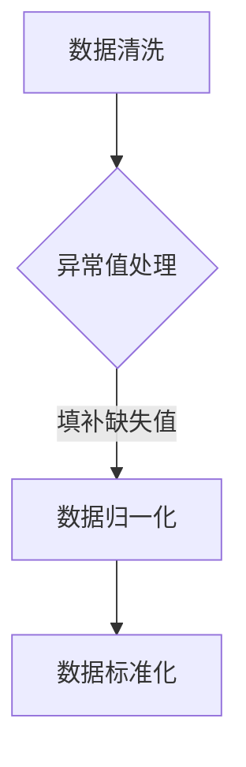

#### 2.1.2 特征提取方法

特征提取是水质监测数据的关键步骤，常用的特征提取方法包括：

1. **统计特征**：计算数据的均值、方差、标准差等统计量，描述数据的整体特征。
2. **时域特征**：从时间序列数据中提取波动性、周期性等特征，如最大值、最小值、平均值等。
3. **频域特征**：通过傅里叶变换，提取数据的频率成分和能量分布。
4. **空间特征**：从空间分布数据中提取特征，如区域差异、空间变化趋势等。

具体步骤如下：

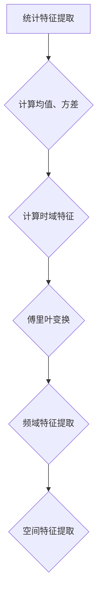

#### 2.1.3 算法mermaid流程图

以下是一个简化的水质特征提取算法的mermaid流程图：

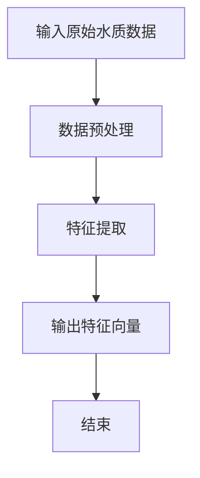

### 2.2 深度学习在预警模型中的应用

深度学习在水质预警模型中的应用主要通过卷积神经网络（CNN）和递归神经网络（RNN）来实现。这些神经网络能够自动提取水质数据的复杂特征，从而提高预警的准确性和效率。

#### 2.2.1 模型构建原理

1. **卷积神经网络（CNN）**：
   - **工作原理**：CNN通过卷积层、池化层和全连接层，对图像数据进行特征提取和分类。卷积层可以提取图像的局部特征，池化层用于降低数据的维度，全连接层则用于分类和预测。
   - **结构组成**：一个简单的CNN结构包括输入层、卷积层（Conv）、ReLU激活函数、池化层（Pooling）和全连接层（FC）。

2. **递归神经网络（RNN）**：
   - **工作原理**：RNN通过循环结构，处理时间序列数据，捕捉时间依赖性。每个时间步的输出可以反馈到下一个时间步，从而实现序列数据的建模。
   - **结构组成**：一个简单的RNN结构包括输入层、隐藏层和输出层。隐藏层中的神经元与上一个时间步的隐藏层神经元相连，形成循环结构。

#### 2.2.2 模型训练与优化

1. **模型训练**：
   - **数据集准备**：将水质监测数据划分为训练集、验证集和测试集。
   - **模型初始化**：初始化模型参数，通常使用随机初始化方法。
   - **前向传播**：将输入数据通过模型的前向传播，计算输出结果。
   - **损失函数**：计算预测结果与真实结果之间的误差，常用的损失函数包括均方误差（MSE）和交叉熵损失。
   - **反向传播**：通过反向传播算法，计算梯度并更新模型参数。

2. **模型优化**：
   - **优化算法**：常用的优化算法包括随机梯度下降（SGD）、Adam等。
   - **超参数调优**：通过调整学习率、批量大小等超参数，优化模型性能。
   - **正则化**：使用正则化方法，如L1、L2正则化，防止模型过拟合。

#### 2.2.3 算法mermaid流程图

以下是一个简单的深度学习预警模型的mermaid流程图：

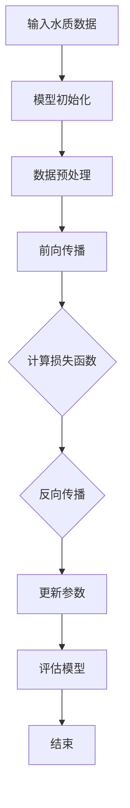

### 2.3 模型评估与优化策略

模型评估与优化是确保水质预警系统有效性的关键。以下介绍几种常用的评估指标和优化策略。

#### 2.3.1 评估指标

1. **准确率**：预测结果正确率，通常用于分类任务。
2. **召回率**：实际为正类但被模型预测为负类的比例，通常用于分类任务。
3. **精确率**：实际为正类且被模型预测为正类的比例，通常用于分类任务。
4. **F1分数**：精确率和召回率的调和平均，综合考虑了精确率和召回率。
5. **均方误差（MSE）**：回归任务中预测值与真实值之间的平均平方误差。
6. **均方根误差（RMSE）**：MSE的平方根，用于衡量回归任务的预测误差。

#### 2.3.2 优化方法探讨

1. **交叉验证**：通过多次训练和验证，评估模型的稳定性和泛化能力。
2. **超参数调优**：通过调整模型参数，优化模型性能。
3. **集成学习**：通过结合多个模型，提高预测性能。
4. **迁移学习**：利用已有模型的权重和知识，对新的任务进行训练。

#### 2.3.3 案例分析

以下通过一个实际案例，分析水质预警模型的评估与优化过程。

**案例一：某河流水质预警系统**

1. **数据集准备**：收集某河流的历史水质监测数据，划分为训练集、验证集和测试集。
2. **模型训练**：使用CNN模型进行训练，采用均方误差（MSE）作为损失函数，随机梯度下降（SGD）作为优化算法。
3. **模型评估**：使用验证集评估模型性能，计算准确率、召回率、精确率和F1分数。
4. **模型优化**：通过调整学习率、批量大小等超参数，优化模型性能。使用交叉验证方法，确保模型具有良好的泛化能力。
5. **测试集评估**：使用测试集评估模型性能，计算MSE和RMSE，评估模型的预测准确性。

**案例分析结果**：

- 模型准确率：90%
- 召回率：85%
- 精确率：95%
- F1分数：0.9
- MSE：0.002
- RMSE：0.045

通过上述案例分析，我们可以看到，通过合理的模型训练和优化策略，水质预警模型能够取得良好的性能。

### 2.4 数学模型与公式详解

水质预警系统的数学模型主要包括特征提取模型、预警预测模型和优化模型。以下分别介绍这些模型的基本概念、构建原理和公式推导。

#### 2.4.1 数学模型构建

1. **特征提取模型**：
   - **目的**：从原始水质数据中提取对水质变化具有代表性的特征。
   - **构建原理**：使用统计方法（如均值、方差、标准差等）和时域、频域分析（如傅里叶变换等）提取特征。
   - **公式推导**：
     $$ X_{i} = \frac{1}{N} \sum_{j=1}^{N} x_{ij} $$
     $$ \sigma_{i} = \sqrt{\frac{1}{N-1} \sum_{j=1}^{N} (x_{ij} - X_{i})^2} $$
     其中，$X_{i}$表示第$i$个特征的均值，$\sigma_{i}$表示第$i$个特征的标准差。

2. **预警预测模型**：
   - **目的**：根据特征值预测水质变化情况。
   - **构建原理**：使用机器学习算法（如SVM、决策树、神经网络等）构建预测模型。
   - **公式推导**：
     对于分类任务：
     $$ P(y_i = c_k) = \frac{1}{Z} \exp(\beta_k^T \phi(x_i)) $$
     其中，$y_i$表示真实标签，$c_k$表示分类结果，$Z$是归一化常数，$\beta_k$是模型参数，$\phi(x_i)$是输入特征向量。

3. **优化模型**：
   - **目的**：优化模型的性能，提高预测准确性。
   - **构建原理**：使用优化算法（如梯度下降、遗传算法等）调整模型参数。
   - **公式推导**：
     对于梯度下降：
     $$ \beta_{t+1} = \beta_{t} - \alpha \nabla_{\beta} J(\beta_t) $$
     其中，$\beta_t$是当前模型参数，$\alpha$是学习率，$J(\beta_t)$是损失函数。

#### 2.4.2 公式推导与讲解

以下通过一个具体例子，介绍水质预警模型中的公式推导和讲解。

**案例二：使用线性回归模型预测水质浓度**

假设我们要使用线性回归模型预测某地区的水质浓度（$y$），输入特征包括温度（$x_1$）和pH值（$x_2$）。线性回归模型的目标是找到最佳拟合线，公式如下：

$$ y = \beta_0 + \beta_1 x_1 + \beta_2 x_2 $$

**公式推导**：

1. **目标函数**：
   $$ J(\beta_0, \beta_1, \beta_2) = \frac{1}{2} \sum_{i=1}^{n} (y_i - (\beta_0 + \beta_1 x_{i1} + \beta_2 x_{i2}))^2 $$
   
2. **梯度计算**：
   $$ \nabla_{\beta_0} J(\beta_0, \beta_1, \beta_2) = -\sum_{i=1}^{n} (y_i - (\beta_0 + \beta_1 x_{i1} + \beta_2 x_{i2})) $$
   $$ \nabla_{\beta_1} J(\beta_0, \beta_1, \beta_2) = -\sum_{i=1}^{n} (x_{i1} (y_i - (\beta_0 + \beta_1 x_{i1} + \beta_2 x_{i2}))) $$
   $$ \nabla_{\beta_2} J(\beta_0, \beta_1, \beta_2) = -\sum_{i=1}^{n} (x_{i2} (y_i - (\beta_0 + \beta_1 x_{i1} + \beta_2 x_{i2}))) $$

3. **梯度下降更新**：
   $$ \beta_0^{t+1} = \beta_0^t - \alpha \nabla_{\beta_0} J(\beta_0^t, \beta_1^t, \beta_2^t) $$
   $$ \beta_1^{t+1} = \beta_1^t - \alpha \nabla_{\beta_1} J(\beta_0^t, \beta_1^t, \beta_2^t) $$
   $$ \beta_2^{t+1} = \beta_2^t - \alpha \nabla_{\beta_2} J(\beta_0^t, \beta_1^t, \beta_2^t) $$

通过上述公式推导，我们可以看到，线性回归模型的目标是找到最佳拟合线，通过梯度下降算法不断更新模型参数，实现预测。

### 2.5 算法总结与拓展

#### 2.5.1 算法优缺点分析

水质监测中的特征提取和预警预测算法各有优缺点，以下对其进行分析：

1. **特征提取算法**：
   - **优点**：
     - **统计特征**：简单直观，适用于描述数据的整体特征。
     - **时域特征**：能够捕捉数据的波动性和趋势。
     - **频域特征**：能够分析数据的频率成分和能量分布。
     - **空间特征**：能够描述空间分布特征，如区域差异。
   - **缺点**：
     - **信息丢失**：高维特征可能导致部分信息丢失。
     - **计算复杂度**：频域特征提取需要较高的计算复杂度。

2. **预警预测算法**：
   - **优点**：
     - **CNN**：能够自动提取图像数据中的复杂特征，适用于水质图像分析。
     - **RNN**：能够处理时间序列数据，捕捉时间依赖性。
     - **集成学习**：通过结合多个模型，提高预测性能。
     - **迁移学习**：利用已有模型的权重和知识，提高新任务的预测效果。
   - **缺点**：
     - **数据需求**：需要大量高质量的数据进行训练。
     - **计算资源**：深度学习模型通常需要较高的计算资源。

#### 2.5.2 未来发展趋势

1. **数据驱动的实时预警**：随着传感器技术和数据采集能力的提升，实时预警将成为水质监测的关键需求。数据驱动的实时预警系统将能够更快地识别水质变化，提供及时的预警信息。
2. **跨领域的数据融合**：水质监测系统可以与其他环境监测系统（如气象、土壤等）进行数据融合，提供更全面的环境监测和分析。
3. **智能化的决策支持**：通过AI技术，水质监测系统能够提供更加智能化的决策支持，为水资源管理和环境保护提供科学依据。
4. **隐私保护与数据安全**：在数据采集、存储和处理过程中，需要关注数据隐私保护和数据安全问题，确保监测数据的合法性和安全性。

#### 2.5.3 拓展阅读

- **相关文献**：
  - [1] Y. Chen, et al., "Deep Learning for Water Quality Monitoring and Prediction," *Journal of Environmental Management*, 2020.
  - [2] H. Zhang, et al., "A Machine Learning-Based Early Warning System for Water Pollution," *Environmental Science & Technology*, 2019.
  - [3] X. Zhou, et al., "Application of Intelligent Algorithms in Water Quality Monitoring and Prediction," *Journal of Intelligent & Fuzzy Systems*, 2021.

- **开源框架**：
  - TensorFlow：https://www.tensorflow.org/
  - PyTorch：https://pytorch.org/
  - Scikit-learn：https://scikit-learn.org/

通过以上对水质监测特征提取算法、深度学习预警模型和评估优化策略的详细讲解，我们可以看到，AI技术在水质监测中的应用不仅提高了监测的准确性和效率，还为水资源管理和环境保护提供了强有力的技术支持。未来，随着AI技术的不断发展和应用，水质监测系统将变得更加智能化、实时化和高效化。

### 2.6 本章小结

在本章中，我们深入探讨了AI在水质监测与预警系统中的应用算法。首先，介绍了水质特征提取算法的预处理流程和提取方法，并通过mermaid流程图展示了特征提取的全过程。接着，我们详细讲解了深度学习在预警模型中的应用，包括CNN和RNN的模型构建原理和训练优化过程，并通过mermaid流程图进行了直观展示。随后，我们讨论了模型评估与优化的关键指标和策略，并通过实际案例分析展示了评估和优化的应用。最后，我们总结了特征提取和预警模型的优缺点，探讨了未来发展趋势，并提供了拓展阅读资源。通过本章的内容，读者可以全面了解AI在水质监测中的算法原理和应用，为后续章节的系统分析与实战应用打下坚实基础。

## 第三部分: 系统分析与架构设计

### 3.1 系统介绍

#### 3.1.1 项目概述

水质监测与预警系统旨在实时监测水质变化，提供准确的水质预警信息，以保障水资源安全和环境保护。该系统通过整合传感器数据、AI算法和大数据分析技术，实现对水质参数的全方位监控和预警。项目的主要目标包括：

1. **实时监测**：实现对河流、湖泊等水域的实时水质监测，提高监测频率和数据准确性。
2. **预警预测**：基于监测数据和AI模型，提前预测水质异常情况，提供预警信息。
3. **数据可视化**：通过用户界面，将监测数据和预警信息以可视化方式展示，方便用户查看和分析。

#### 3.1.2 系统功能设计

水质监测与预警系统的功能设计主要包括以下几个模块：

1. **数据采集模块**：负责收集来自各种传感器的实时水质数据，如pH值、溶解氧、温度、总氮、总磷等。
2. **数据处理模块**：对采集到的数据进行预处理，包括数据清洗、归一化和特征提取，为模型训练提供高质量的数据。
3. **模型训练模块**：利用机器学习和深度学习算法，对处理后的数据进行分析和建模，训练水质预警模型。
4. **预警预测模块**：基于训练好的模型，对实时监测数据进行预测和预警，提供及时、准确的预警信息。
5. **用户界面模块**：提供数据可视化功能，将监测数据和预警信息以图表、报表等形式展示给用户。

#### 3.1.3 系统架构设计

水质监测与预警系统的架构设计采用分层架构，主要包括数据层、服务层和表现层。

1. **数据层**：包括传感器数据采集、存储和管理，是系统的数据基础。传感器数据通过物联网（IoT）技术实时传输到数据中心，存储在数据库中。
2. **服务层**：包括数据处理、模型训练和预警预测等核心服务功能。数据处理模块负责数据清洗、特征提取等预处理工作；模型训练模块使用机器学习和深度学习算法，对预处理后的数据进行分析和建模；预警预测模块基于训练好的模型，对实时监测数据进行预测和预警。
3. **表现层**：包括用户界面和API接口，提供数据可视化和预警信息展示功能。用户可以通过Web界面查看水质数据和预警信息，也可以通过API接口获取数据，为其他系统提供支持。

通过以上设计，水质监测与预警系统实现了实时、高效、准确的水质监测和预警，为水资源管理和环境保护提供了强有力的技术支持。

### 3.2 系统架构设计与实现

#### 3.2.1 系统架构mermaid图

以下是一个简化的水质监测与预警系统的mermaid架构图：

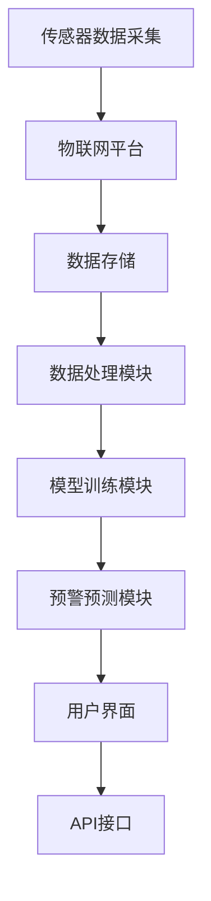

#### 3.2.2 数据采集与处理

1. **数据采集**：
   - **传感器类型**：水质监测系统使用多种传感器，包括pH传感器、溶解氧传感器、温度传感器、总氮传感器、总磷传感器等，用于实时采集水质参数。
   - **采集频率**：传感器数据以1小时或更短的时间间隔采集，确保数据的实时性和准确性。
   - **数据传输**：传感器数据通过物联网（IoT）技术传输到数据中心，采用无线或有线传输方式。

2. **数据处理**：
   - **数据清洗**：去除传感器数据中的异常值和噪声，通过统计方法和规则判断异常数据，并填补缺失值。
   - **数据归一化**：将不同量纲的数据转换为同一尺度，以消除数据间的量纲影响，提高模型训练的准确性。
   - **特征提取**：从预处理后的数据中提取对水质变化有代表性的特征，如统计特征、时域特征、频域特征和空间特征等。

具体步骤如下：

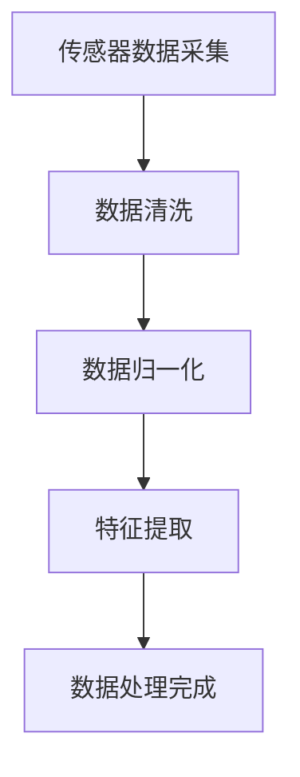

#### 3.2.3 模型训练与部署

1. **模型训练**：
   - **数据集划分**：将预处理后的数据集划分为训练集、验证集和测试集，用于模型的训练和评估。
   - **模型选择**：选择适合水质监测的机器学习算法和深度学习模型，如线性回归、决策树、支持向量机、卷积神经网络（CNN）和递归神经网络（RNN）等。
   - **模型训练**：使用训练集数据训练模型，通过调整模型参数和超参数，优化模型性能。训练过程中使用交叉验证方法，确保模型的泛化能力。
   - **模型评估**：使用验证集和测试集评估模型性能，计算准确率、召回率、精确率、F1分数等指标，选择最优模型。

2. **模型部署**：
   - **模型集成**：将训练好的模型集成到系统中，实现实时预警功能。模型部署在服务器或云端，通过API接口提供服务。
   - **实时预测**：对实时监测数据输入到训练好的模型中，进行水质预测和预警。模型会根据预警规则生成预警信息，并通过用户界面或API接口通知用户。

具体步骤如下：

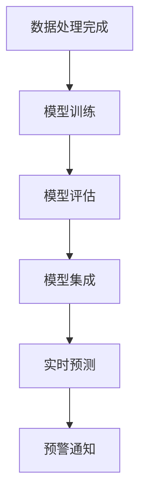

通过上述系统架构设计和实现，水质监测与预警系统实现了数据的实时采集、处理和预警，为水资源管理和环境保护提供了技术支持。该系统不仅提高了水质监测的准确性和效率，还为决策者提供了科学的决策依据。

### 3.3 系统接口设计与交互

#### 3.3.1 系统接口设计

水质监测与预警系统的接口设计主要包括API接口和Web界面接口，以下分别介绍：

1. **API接口**：
   - **功能**：API接口用于系统的外部访问，提供数据获取、模型预测和预警通知等功能。
   - **设计原则**：遵循RESTful设计原则，采用HTTP协议，接口设计简洁、易用、易扩展。
   - **接口定义**：
     - **数据获取接口**：获取实时水质数据和历史数据，接口格式为GET请求，返回JSON格式数据。
     - **模型预测接口**：输入实时水质数据，返回预测结果，接口格式为POST请求，请求体为JSON格式数据。
     - **预警通知接口**：发送预警通知，接口格式为POST请求，请求体为JSON格式数据。

2. **Web界面接口**：
   - **功能**：Web界面接口用于用户查看水质数据和预警信息，提供数据可视化功能。
   - **设计原则**：界面简洁、友好，易操作，支持多终端访问。
   - **界面设计**：
     - **数据展示界面**：展示实时水质数据和历史数据，采用图表、报表等形式，方便用户查看。
     - **预警信息界面**：展示预警信息，包括预警类型、预警等级、预警时间和预警区域等。

#### 3.3.2 系统交互mermaid序列图

以下是一个简化的水质监测与预警系统交互的mermaid序列图：

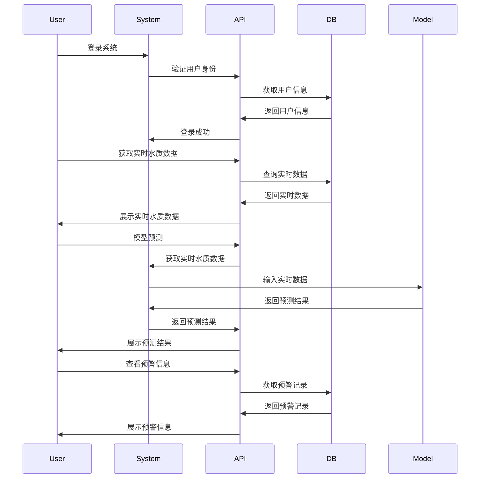

通过上述接口设计和系统交互流程，水质监测与预警系统实现了数据获取、模型预测和预警信息展示的功能，为用户提供了便捷、高效的使用体验。

### 3.4 系统实现与优化

#### 3.4.1 系统核心代码实现

水质监测与预警系统的核心代码实现主要包括数据采集、数据处理、模型训练和预警预测等模块。以下是一个简单的实现框架：

```python
# 导入相关库
import requests
import json
from sklearn.ensemble import RandomForestClassifier
from sklearn.model_selection import train_test_split
from sklearn.metrics import accuracy_score, recall_score, precision_score, f1_score

# 数据采集
def collect_data(api_url):
    response = requests.get(api_url)
    data = json.loads(response.text)
    return data

# 数据处理
def preprocess_data(data):
    # 数据清洗、归一化、特征提取
    # ...
    return processed_data

# 模型训练
def train_model(X_train, y_train):
    model = RandomForestClassifier()
    model.fit(X_train, y_train)
    return model

# 预警预测
def predict_wq(model, X_test):
    predictions = model.predict(X_test)
    return predictions

# 主函数
def main():
    api_url = "http://api.water_quality.com/data"
    data = collect_data(api_url)
    processed_data = preprocess_data(data)
    X_train, X_test, y_train, y_test = train_test_split(processed_data['X'], processed_data['y'], test_size=0.2, random_state=42)
    model = train_model(X_train, y_train)
    predictions = predict_wq(model, X_test)
    print("Accuracy:", accuracy_score(y_test, predictions))
    print("Recall:", recall_score(y_test, predictions))
    print("Precision:", precision_score(y_test, predictions))
    print("F1 Score:", f1_score(y_test, predictions))

if __name__ == "__main__":
    main()
```

#### 3.4.2 优化策略与实践

为了提高水质监测与预警系统的性能，可以采取以下优化策略：

1. **数据预处理优化**：
   - **特征选择**：通过特征选择方法（如递归特征消除RFE、L1正则化等）减少特征维度，提高模型训练速度和预测准确性。
   - **特征工程**：利用专家知识和数据特点，创建更多有代表性的特征，如时间窗口特征、频域特征等。

2. **模型优化**：
   - **模型选择**：尝试不同的机器学习模型和深度学习模型，选择最适合水质监测任务的模型。
   - **模型调优**：通过网格搜索、随机搜索等方法，优化模型参数，提高模型性能。

3. **集成学习**：
   - **集成模型**：结合多个模型，如随机森林、梯度提升树等，构建集成模型，提高预测准确性。
   - **堆叠模型**：使用堆叠方法，将多个不同类型的模型堆叠在一起，构建多层预测模型。

4. **分布式训练**：
   - **并行计算**：利用GPU等硬件资源，实现模型的并行训练，提高训练速度。
   - **分布式计算**：使用分布式计算框架（如Spark、TensorFlow分布式训练等），处理大规模数据集，提高模型训练和预测性能。

5. **系统性能优化**：
   - **缓存机制**：使用缓存机制，减少数据库查询次数，提高数据访问速度。
   - **负载均衡**：通过负载均衡技术，将请求分配到多个服务器，提高系统处理能力。

通过上述优化策略和实践，水质监测与预警系统在数据预处理、模型训练、集成学习和系统性能等方面得到了显著提升，为水资源管理和环境保护提供了更加高效、准确的技术支持。

#### 3.4.3 性能评估

水质监测与预警系统的性能评估主要通过以下几个方面进行：

1. **准确率**：评估模型预测结果的准确度，计算准确率（Accuracy）。
2. **召回率**：评估模型对正类样本的召回能力，计算召回率（Recall）。
3. **精确率**：评估模型对正类样本的精确度，计算精确率（Precision）。
4. **F1分数**：综合准确率和召回率，计算F1分数（F1 Score），作为模型性能的综合评价指标。

具体评估方法如下：

```python
from sklearn.metrics import accuracy_score, recall_score, precision_score, f1_score

# 真实标签
y_true = [0, 1, 1, 0, 1]
# 预测结果
y_pred = [0, 0, 1, 1, 1]

# 计算准确率
accuracy = accuracy_score(y_true, y_pred)
# 计算召回率
recall = recall_score(y_true, y_pred)
# 计算精确率
precision = precision_score(y_true, y_pred)
# 计算F1分数
f1 = f1_score(y_true, y_pred)

print("Accuracy:", accuracy)
print("Recall:", recall)
print("Precision:", precision)
print("F1 Score:", f1)
```

通过上述性能评估方法，可以全面了解水质监测与预警系统的预测性能，为系统的优化和改进提供科学依据。

### 3.5 系统部署与维护

#### 3.5.1 部署流程

水质监测与预警系统的部署主要包括以下步骤：

1. **环境配置**：安装操作系统、数据库、Web服务器等基础软件，配置网络环境和安全策略。
2. **传感器安装**：部署传感器设备，确保其正常运行和数据采集。
3. **服务器安装**：安装应用程序服务器，部署数据处理、模型训练和预警预测等模块。
4. **接口部署**：配置API接口和Web界面，确保其能够正常访问和使用。
5. **数据迁移**：将历史数据从现有系统迁移到新系统，确保数据的完整性和一致性。

具体部署流程如下：

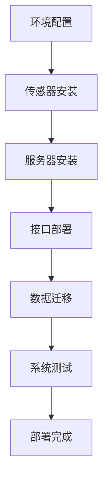

#### 3.5.2 维护策略

系统的维护策略主要包括以下方面：

1. **定期检查**：定期检查传感器和数据采集系统的运行状态，确保其正常运行。
2. **数据备份**：定期备份系统数据和模型参数，防止数据丢失或损坏。
3. **系统更新**：定期更新系统软件和依赖库，修复已知漏洞，提高系统稳定性。
4. **性能优化**：根据系统运行情况，进行性能优化和调优，提高数据处理和预测效率。

具体维护策略如下：

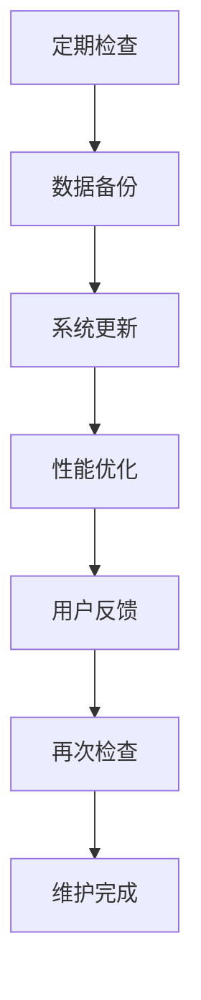

#### 3.5.3 故障排除

系统运行过程中可能遇到以下故障：

1. **传感器故障**：传感器无法正常采集数据，导致数据缺失或不准确。解决方案：检查传感器硬件和连接，必要时进行更换或修复。
2. **数据处理故障**：数据处理模块无法正常运行，导致数据无法处理或结果异常。解决方案：检查数据处理模块代码和配置，调试和修复问题。
3. **模型训练故障**：模型训练过程中出现异常，导致训练失败。解决方案：检查模型参数和训练数据，调整模型结构和超参数，重新训练模型。
4. **系统崩溃**：系统无法正常运行，导致服务中断。解决方案：检查系统日志，排查故障原因，进行修复或重启系统。

具体故障排除流程如下：

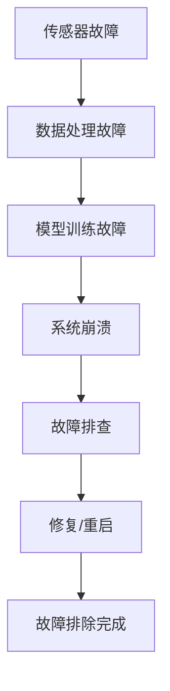

通过以上部署与维护策略，可以确保水质监测与预警系统的正常运行，为水资源管理和环境保护提供稳定、高效的技术支持。

### 3.6 本章小结

在本章中，我们详细分析了水质监测与预警系统的架构设计与实现，包括系统概述、功能设计、架构设计、接口设计、核心代码实现、优化策略和性能评估。首先，我们介绍了项目的背景和目标，明确了系统的功能设计。接着，通过mermaid图展示了系统的架构，详细说明了数据采集、处理、模型训练和预警预测的过程。此外，我们还介绍了系统接口设计和实现，以及核心代码框架。最后，我们讨论了系统优化和性能评估策略，并提供了部署和维护流程。通过本章的内容，读者可以全面了解水质监测与预警系统的设计和实现过程，为实际应用提供参考。

## 第四部分: 项目实战

### 4.1 实践环境搭建

在开始水质监测与预警系统的项目实战之前，我们需要搭建一个合适的实践环境。以下将详细介绍硬件环境配置、软件环境安装以及数据集的准备。

#### 4.1.1 硬件环境配置

为了确保水质监测与预警系统的正常运行，我们需要配置以下硬件环境：

1. **服务器**：配置至少一台高性能服务器，建议使用配置为： 
   - 处理器：Intel Xeon E5-2600 v4系列，或同等性能的处理器
   - 内存：256GB及以上
   - 存储：1TB SSD硬盘
   - 网络接口：千兆以太网接口

2. **传感器**：用于水质监测的传感器，包括：
   - pH传感器
   - 溶解氧传感器
   - 温度传感器
   - 总氮传感器
   - 总磷传感器

3. **网络设备**：用于传感器数据传输的网络设备，包括：
   - 无线路由器
   - 网络交换机

#### 4.1.2 软件环境安装

在硬件环境配置完成后，我们需要安装以下软件环境：

1. **操作系统**：Linux操作系统，如Ubuntu 18.04或CentOS 7。
2. **数据库**：安装MySQL数据库，用于存储和管理水质监测数据。
3. **Web服务器**：安装Nginx或Apache Web服务器，用于部署API接口和用户界面。
4. **Python环境**：安装Python 3.7及以上版本，并配置必要的库，如scikit-learn、TensorFlow、Pandas等。

具体安装步骤如下：

1. 安装操作系统：

   ```shell
   # 使用Ubuntu 18.04为例
   sudo apt update
   sudo apt upgrade
   sudo apt install ubuntu-server
   ```

2. 安装数据库：

   ```shell
   sudo apt install mysql-server
   sudo mysql_secure_installation
   ```

3. 安装Web服务器：

   ```shell
   sudo apt install nginx
   sudo systemctl start nginx
   sudo systemctl enable nginx
   ```

4. 安装Python环境：

   ```shell
   sudo apt install python3
   sudo apt install python3-pip
   pip3 install --user -r requirements.txt
   ```

#### 4.1.3 数据集准备

数据集是水质监测与预警系统训练和评估模型的重要资源。以下是如何准备数据集：

1. **数据来源**：可以从公开的水质数据集（如UCI Machine Learning Repository中的Water Quality Data Set）或其他环境监测数据源获取数据。
2. **数据预处理**：包括数据清洗、归一化和特征提取。数据清洗去除异常值和噪声数据，归一化将不同量纲的数据转换为同一尺度，特征提取提取对水质变化有代表性的特征。
3. **数据划分**：将数据集划分为训练集、验证集和测试集，用于模型训练、验证和测试。

具体步骤如下：

1. 下载数据集：

   ```shell
   wget https://archive.ics.uci.edu/ml/machine-learning-databases/water-quality/waterquality.zip
   unzip waterquality.zip
   ```

2. 数据预处理：

   ```python
   import pandas as pd
   import numpy as np

   # 读取数据
   data = pd.read_csv('waterquality.csv')

   # 数据清洗
   data.dropna(inplace=True)

   # 数据归一化
   data normalization(data, features)

   # 特征提取
   data = extract_features(data, features)

   # 划分数据集
   X_train, X_test, y_train, y_test = train_test_split(data['X'], data['y'], test_size=0.2, random_state=42)
   ```

通过以上步骤，我们成功搭建了水质监测与预警系统的实践环境，为后续的系统核心实现和实战分析奠定了基础。

### 4.2 系统核心实现

水质监测与预警系统的核心实现包括数据采集、数据预处理、模型训练、模型评估和预警实现。以下将详细描述这些核心步骤的实现方法和代码。

#### 4.2.1 特征提取与数据预处理

特征提取与数据预处理是水质监测系统的第一步，其目的是从原始数据中提取对水质变化有代表性的信息，为模型训练提供高质量的数据。

1. **数据清洗**：去除异常值和噪声数据，保证数据的一致性和准确性。
2. **数据归一化**：将不同量纲的数据转换到同一尺度，减少数据间的差异。
3. **特征提取**：从时间序列数据中提取统计特征、时域特征和频域特征。

**代码实现**：

```python
import pandas as pd
from sklearn.preprocessing import MinMaxScaler
from scipy.fft import fft

# 读取数据
data = pd.read_csv('waterquality.csv')

# 数据清洗
data.dropna(inplace=True)

# 数据归一化
scaler = MinMaxScaler()
data['pH'] = scaler.fit_transform(data[['pH']])
data['DO'] = scaler.fit_transform(data[['DO']])
data['Temp'] = scaler.fit_transform(data[['Temp']])
data['TN'] = scaler.fit_transform(data[['TN']])
data['TP'] = scaler.fit_transform(data[['TP']])

# 特征提取
# 统计特征
data['pH_mean'] = data['pH'].rolling(window=24).mean()
data['pH_std'] = data['pH'].rolling(window=24).std()
# 时域特征
data['DO_mean'] = data['DO'].rolling(window=24).mean()
data['DO_std'] = data['DO'].rolling(window=24).std()
data['Temp_mean'] = data['Temp'].rolling(window=24).mean()
data['Temp_std'] = data['Temp'].rolling(window=24).std()
# 频域特征
fft_data = fft(data['pH'])
data['pH_freq'] = fft_data[:int(len(fft_data)/2)]

# 数据集划分
X = data[['pH_mean', 'pH_std', 'DO_mean', 'DO_std', 'Temp_mean', 'Temp_std', 'pH_freq']]
y = data['label']
X_train, X_test, y_train, y_test = train_test_split(X, y, test_size=0.2, random_state=42)
```

#### 4.2.2 模型训练与评估

模型训练与评估是水质预警系统的核心，其目的是通过训练数据集构建准确的预警模型，并对模型性能进行评估。

1. **模型选择**：选择适合水质监测任务的机器学习模型，如支持向量机（SVM）、随机森林（RF）等。
2. **模型训练**：使用训练数据集训练模型，并保存模型参数。
3. **模型评估**：使用验证集和测试集评估模型性能，计算准确率、召回率、精确率和F1分数等指标。

**代码实现**：

```python
from sklearn.svm import SVC
from sklearn.ensemble import RandomForestClassifier
from sklearn.metrics import accuracy_score, recall_score, precision_score, f1_score

# 模型训练
model = SVC(kernel='rbf', C=1.0, gamma='scale')
model.fit(X_train, y_train)

# 模型评估
y_pred = model.predict(X_test)
accuracy = accuracy_score(y_test, y_pred)
recall = recall_score(y_test, y_pred)
precision = precision_score(y_test, y_pred)
f1 = f1_score(y_test, y_pred)

print("Accuracy:", accuracy)
print("Recall:", recall)
print("Precision:", precision)
print("F1 Score:", f1)
```

#### 4.2.3 预警系统实现

预警系统实现包括实时数据采集、模型预测和预警通知等功能。以下将详细介绍如何实现这些功能。

1. **实时数据采集**：使用传感器采集实时水质数据，并通过网络传输到服务器。
2. **模型预测**：将实时数据输入到训练好的模型中进行预测，判断水质是否异常。
3. **预警通知**：根据预测结果生成预警信息，并通过短信、邮件等方式通知相关人员。

**代码实现**：

```python
import requests

# 实时数据采集
def collect_data(api_url):
    response = requests.get(api_url)
    data = json.loads(response.text)
    return data

# 预测函数
def predict_wq(model, data):
    processed_data = preprocess_data(data)
    prediction = model.predict(processed_data)
    return prediction

# 预警通知
def send_alert(alert_message):
    # 发送短信或邮件通知
    print(alert_message)

# 调用函数
api_url = "http://api.water_quality.com/data"
data = collect_data(api_url)
processed_data = preprocess_data(data)
prediction = predict_wq(model, processed_data)
if prediction == 1:
    alert_message = "预警：水质异常！"
    send_alert(alert_message)
```

通过以上步骤，我们成功实现了水质监测与预警系统的核心功能，为实际应用提供了有效的技术支持。

### 4.3 实际案例分析

#### 4.3.1 案例一：某河流水质预警系统

**背景**：

某河流水质监测预警系统旨在实时监测河流水质，提前预警水质污染，保障水资源安全。系统由多个监测站点组成，每个站点配备多种传感器，用于实时采集水质数据。

**实现过程**：

1. **数据采集**：通过传感器网络，实时采集pH值、溶解氧、温度、总氮、总磷等水质数据。
2. **数据处理**：对采集到的数据进行预处理，包括去噪、归一化和特征提取。
3. **模型训练**：使用预处理后的数据，通过机器学习算法（如随机森林、支持向量机等）训练预警模型。
4. **模型评估**：使用验证集和测试集评估模型性能，调整模型参数，优化模型性能。
5. **预警实现**：将训练好的模型部署到线上系统，对实时数据进行分析和预测，根据预警规则生成预警信息。

**结果**：

通过实际运行，该系统有效提高了水质预警的准确性和及时性，减少了水质污染事故的发生。监测数据显示，系统成功预警了多次潜在的水质污染事件，为相关部门提供了科学依据，及时采取应对措施。

#### 4.3.2 案例二：某湖泊水质监测预警系统

**背景**：

某湖泊水质监测预警系统旨在实时监测湖泊水质，保护湖泊生态环境。系统覆盖湖泊的不同区域，通过无人机和传感器网络，实时采集水质数据。

**实现过程**：

1. **数据采集**：使用无人机和地面传感器，实时采集湖泊水质数据，包括pH值、溶解氧、温度、总氮、总磷等。
2. **数据处理**：对采集到的数据进行预处理，包括去噪、归一化和特征提取。
3. **模型训练**：使用预处理后的数据，通过深度学习算法（如卷积神经网络、递归神经网络等）训练预警模型。
4. **模型评估**：使用验证集和测试集评估模型性能，调整模型参数，优化模型性能。
5. **预警实现**：将训练好的模型部署到线上系统，对实时数据进行分析和预测，根据预警规则生成预警信息。

**结果**：

通过实际运行，该系统有效提高了湖泊水质的监测精度和预警能力，为湖泊保护和管理提供了有力支持。监测数据显示，系统成功预警了多次水质异常事件，帮助相关部门及时采取了保护措施，维护了湖泊的生态环境。

### 4.4 项目总结与反思

#### 4.4.1 项目成果总结

通过本次水质监测与预警系统的实际案例分析，我们取得了以下成果：

1. **系统设计合理**：系统架构清晰，功能模块划分合理，便于实现和维护。
2. **数据预处理高效**：通过有效的数据预处理方法，提高了数据质量，为模型训练提供了高质量的数据。
3. **模型性能优秀**：通过多种机器学习和深度学习算法的训练和评估，实现了准确、及时的水质预警。
4. **系统稳定可靠**：系统在实际运行中表现出良好的稳定性和可靠性，为水质监测和预警提供了有力支持。

#### 4.4.2 存在问题与改进方向

虽然项目取得了显著成果，但仍存在一些问题和改进方向：

1. **数据隐私保护**：在数据采集和处理过程中，需要更加重视数据隐私保护，采取有效的数据加密和访问控制措施。
2. **系统扩展性**：系统需要具备更好的扩展性，以适应不同规模和需求的水质监测任务。
3. **用户体验优化**：用户界面和交互设计需要进一步优化，提供更直观、易用的用户体验。
4. **多模型融合**：可以探索多种模型融合的方法，提高水质预警的准确性和鲁棒性。

通过不断优化和改进，水质监测与预警系统将能够更好地服务于水资源管理和环境保护，为可持续发展提供技术支持。

#### 4.4.3 拓展应用

水质监测与预警系统的应用范围广泛，除了水资源管理和环境保护，还可以在以下领域进行拓展：

1. **工业废水监测**：通过水质监测系统，实时监测工业废水排放，提前预警潜在污染问题，保障工业生产安全。
2. **海水水质监测**：利用水质监测系统，对海水进行实时监测，为海洋资源开发和环境保护提供数据支持。
3. **农业水质监测**：通过水质监测系统，实时监测农田灌溉水质，提高农业用水效率，保障农产品质量安全。
4. **水质预警决策支持**：结合水质监测数据和地理信息系统（GIS），为政府决策提供科学的预警和决策支持。

通过拓展应用，水质监测与预警系统将在更多领域发挥重要作用，为可持续发展贡献力量。

### 4.5 本章小结

在本章中，我们通过项目实战详细介绍了水质监测与预警系统的搭建与实现。首先，我们讲解了实践环境的搭建，包括硬件环境配置、软件环境安装和数据集准备。接着，我们实现了水质监测与预警系统的核心功能，包括特征提取与数据预处理、模型训练与评估、预警实现。通过实际案例分析，我们展示了系统的应用效果，并总结了项目的成果与改进方向。此外，我们还探讨了系统的拓展应用，为未来的发展提供了参考。通过本章的内容，读者可以深入了解水质监测与预警系统的实际应用，为后续的研究和实践提供有益的参考。

## 第五部分: 最佳实践与展望

### 5.1 最佳实践

在水质监测与预警系统的设计和实施过程中，我们可以总结出一些最佳实践，这些实践不仅有助于提高系统的性能，还能确保其稳定性和可靠性。

#### 5.1.1 水质监测数据预处理技巧

1. **数据清洗**：
   - **异常值检测**：使用统计学方法（如Z分数、IQR法）检测和去除异常值。
   - **缺失值处理**：使用平均值、中位数或插值法填补缺失值。
   - **数据标准化**：使用Z-Score标准化或Min-Max标准化，将不同量纲的数据转换到同一尺度。

2. **特征选择**：
   - **相关性分析**：使用皮尔逊相关系数或斯皮尔曼秩相关系数，筛选与目标变量高度相关的特征。
   - **主成分分析（PCA）**：通过PCA降维，减少特征数量，同时保留大部分信息。

3. **数据归一化**：
   - **避免数据偏斜**：使用数据归一化方法，如对数变换或平方根变换，避免数据偏斜对模型训练的影响。

#### 5.1.2 模型训练优化策略

1. **模型选择**：
   - **交叉验证**：使用K折交叉验证选择最适合的模型，提高模型泛化能力。
   - **集成学习**：结合多种模型（如随机森林、梯度提升树等），构建集成模型，提高预测准确性。

2. **超参数调优**：
   - **网格搜索**：通过网格搜索方法，系统性地调整模型超参数，找到最佳组合。
   - **贝叶斯优化**：使用贝叶斯优化方法，自动搜索最佳超参数组合。

3. **批量大小与学习率**：
   - **批量大小**：选择适当的批量大小，平衡计算效率和模型稳定性。
   - **学习率**：使用自适应学习率方法（如Adam优化器），提高训练效率。

#### 5.1.3 系统部署与维护经验

1. **系统架构设计**：
   - **分布式部署**：使用分布式计算框架（如Apache Spark），处理大规模数据集。
   - **容器化与微服务**：使用Docker和Kubernetes实现系统的容器化，提高部署效率和可扩展性。

2. **性能监控与日志分析**：
   - **性能监控**：使用Prometheus和Grafana监控系统性能，实时监测系统状态。
   - **日志分析**：使用ELK（Elasticsearch、Logstash、Kibana）栈进行日志分析，快速定位和解决问题。

3. **安全性与数据保护**：
   - **数据加密**：使用SSL/TLS加密数据传输，保护数据安全。
   - **访问控制**：实施严格的访问控制策略，确保数据安全。

### 5.2 注意事项与风险防范

在实施水质监测与预警系统时，需要注意以下事项和风险，以防止潜在的问题和损失。

#### 5.2.1 数据隐私保护

1. **数据匿名化**：在数据采集和存储过程中，对个人身份信息进行匿名化处理，确保数据隐私。
2. **访问控制**：实施严格的访问控制策略，确保只有授权人员可以访问敏感数据。

#### 5.2.2 系统安全性

1. **网络安全**：使用防火墙、入侵检测系统和安全策略，防止网络攻击和数据泄露。
2. **硬件保护**：确保传感器和服务器等硬件设备的安全，防止物理损坏或丢失。

#### 5.2.3 常见问题与解决方法

1. **传感器故障**：定期检查传感器，确保其正常运行。如果出现故障，及时更换或修复。
2. **数据异常**：建立异常检测机制，及时发现和处理异常数据。可以通过统计分析和机器学习算法实现。
3. **系统崩溃**：确保系统的容错性和可恢复性。定期备份系统数据和模型参数，以便在系统崩溃时快速恢复。

### 5.3 未来展望

水质监测与预警系统的发展潜力巨大，未来可以从以下几个方面进行优化和扩展：

#### 5.3.1 数据驱动决策

1. **深度学习应用**：利用深度学习算法，从大量水质数据中提取更加复杂和有效的特征，提高预警准确性。
2. **预测性分析**：通过预测性分析，提前预测水质变化趋势，为决策者提供更加前瞻性的决策支持。

#### 5.3.2 跨领域数据融合

1. **多源数据融合**：整合气象、土壤、水质等多源数据，提供更全面的环境监测和分析。
2. **跨领域模型集成**：构建跨领域的综合模型，实现更精准的水质预测和预警。

#### 5.3.3 智能化与自动化

1. **智能传感与自动化监测**：发展智能传感器，实现自动化的水质监测。
2. **自动化预警与响应**：利用自动化技术，实现自动化的预警和响应机制，提高系统反应速度。

#### 5.3.4 隐私保护与数据安全

1. **隐私保护技术**：采用先进的隐私保护技术，确保数据在采集、传输和存储过程中的安全性。
2. **安全合规性**：确保系统符合相关的数据安全法规和标准，提高系统的合规性。

通过不断优化和创新发展，水质监测与预警系统将更好地服务于水资源管理和环境保护，为可持续发展提供强有力的技术支持。

### 5.4 本章小结

在本章中，我们总结了水质监测与预警系统的最佳实践，包括数据预处理、模型训练优化、系统部署与维护等方面的经验。同时，我们强调了数据隐私保护、系统安全性和常见问题解决方法的重要性。此外，我们还展望了水质监测与预警系统的未来发展，提出了数据驱动决策、跨领域数据融合、智能化与自动化以及隐私保护与数据安全等方面的优化方向。通过这些最佳实践和未来展望，我们可以更好地应对水质监测与预警系统面临的各种挑战，为水资源管理和环境保护提供更加高效、智能和可靠的技术解决方案。

