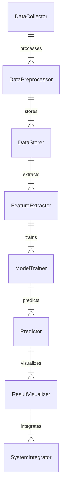

                 


### 第一部分: 背景介绍

#### 第1章: 问题背景与问题描述

**1.1.1 问题背景**

随着全球人口的增长和工业化进程的加速，环境问题日益严重，气候变化成为全球面临的重大挑战。环境监测和气候变化预测变得尤为重要。环境监测旨在实时获取各种环境数据，如气温、湿度、空气质量、水质等，为环境保护和管理提供科学依据。气候变化预测则旨在通过分析历史数据和趋势，预测未来的气候变化情况，为政策制定和社会应对提供科学支持。

人工智能（AI）作为现代科技的重要驱动力，其应用范围不断扩大，逐渐渗透到各个领域，包括环境监测和气候变化预测。AI技术具有强大的数据处理和分析能力，能够处理海量复杂的环境数据，并从中提取有价值的信息，提高监测和预测的准确性和效率。

**1.1.2 问题描述**

在环境监测和气候变化预测领域，主要面临以下问题：

1. **数据复杂性**：环境监测数据类型繁多，包含温度、湿度、风速、气压等多种数据，且数据之间存在复杂的关联关系。如何有效处理和整合这些数据成为一个挑战。

2. **预测精度要求高**：气候变化是一个长期的过程，预测精度直接关系到政策制定和应对措施的合理性。提高预测精度是当前环境监测和气候变化预测领域的核心问题。

3. **模型稳定性**：环境监测和气候变化预测模型需要具备良好的稳定性和泛化能力，以适应不同时间和空间的变化。

4. **实时性要求**：环境监测和气候变化预测需要实时获取数据，进行分析和预测，以快速响应环境变化。

**1.1.3 问题解决**

AI技术在环境监测和气候变化预测中具有以下优势：

1. **数据处理能力**：AI技术能够高效地处理海量复杂的环境数据，提取有价值的信息，提高监测和预测的准确性。

2. **模式识别能力**：AI技术能够从历史数据中学习和识别出环境变化的模式，提高预测精度。

3. **自适应能力**：AI技术具有自适应能力，能够根据新的数据和环境变化进行调整，提高模型的稳定性和泛化能力。

4. **实时分析能力**：AI技术能够实时分析环境数据，快速响应环境变化，提高实时性要求。

综上所述，AI技术在环境监测和气候变化预测中具有巨大的应用潜力，能够解决当前领域面临的主要问题。接下来的章节将详细探讨AI技术在环境监测和气候变化预测中的应用，以及相关算法和系统设计的具体实现。

#### 第2章: 核心概念与联系

**2.1.1 AI基础概念**

人工智能（AI）是指通过计算机程序实现人类智能的模拟和扩展。AI技术主要分为两大类：机器学习和深度学习。机器学习是通过训练模型从数据中自动学习规律和模式，而深度学习则是基于多层神经网络模型，通过大量的数据训练，实现对复杂问题的自动解决。

在环境监测和气候变化预测中，AI技术的应用主要包括数据预处理、特征提取、模型训练和预测等步骤。数据预处理包括数据清洗、归一化和缺失值处理等，以消除噪声和异常值，提高数据的可用性。特征提取则是从原始数据中提取具有代表性的特征，以便模型更好地学习和预测。模型训练是使用历史数据训练模型，使其学会识别环境变化的规律。预测则是使用训练好的模型对未来的环境变化进行预测。

**2.1.2 环境监测与气候变化预测相关概念**

环境监测是指通过各种手段对环境质量进行监测和评估，包括空气质量监测、水质监测、土壤监测等。环境监测数据包括气象数据、污染物浓度数据、生物多样性数据等。这些数据对于环境保护和管理具有重要意义。

气候变化预测是指通过分析历史气候变化数据和环境因素，预测未来的气候变化趋势。气候变化预测的数据来源包括气象数据、海洋数据、冰川数据等。预测方法包括统计模型、物理模型和混合模型等。

在环境监测和气候变化预测中，常见的数据类型包括时间序列数据、空间数据、多源数据等。时间序列数据是按时间顺序排列的数据，如气温、降水等。空间数据是按地理位置排列的数据，如污染物浓度分布、植被覆盖等。多源数据是来自不同数据源的数据，如气象数据、遥感数据等。

**2.1.3 核心概念联系与对比**

AI技术与环境监测、气候变化预测之间的联系主要体现在以下几个方面：

1. **数据驱动**：环境监测和气候变化预测都需要大量的数据作为基础，而AI技术能够高效地处理和分析这些数据，提取有价值的信息。

2. **模型训练与预测**：AI技术通过训练模型，使模型学会识别环境变化的规律，从而实现对未来气候变化趋势的预测。

3. **实时性与适应性**：AI技术具有实时分析和自适应能力，能够快速响应环境变化，提高监测和预测的实时性和稳定性。

4. **多源数据融合**：环境监测和气候变化预测涉及多种类型的数据，AI技术能够有效地融合多源数据，提高监测和预测的准确性。

AI技术与环境监测、气候变化预测之间的区别主要在于：

1. **技术方向**：AI技术主要关注数据处理和分析，而环境监测和气候变化预测则侧重于数据的应用和预测。

2. **目标不同**：环境监测的目标是获取实时环境数据，评估环境质量，而气候变化预测的目标是预测未来气候变化趋势，为政策制定提供科学依据。

3. **技术难点**：环境监测和气候变化预测在数据获取、数据处理、模型训练和预测等方面存在不同的技术难点，需要结合具体应用场景进行优化和改进。

综上所述，AI技术与环境监测、气候变化预测之间存在紧密的联系和差异，通过结合AI技术，可以更好地解决环境监测和气候变化预测中的关键问题。接下来，我们将详细探讨AI在环境监测和气候变化预测中的应用。

### 第二部分: AI在环境监测中的应用

#### 第3章: AI在环境监测中的应用

环境监测是一个复杂而关键的任务，涉及到大量数据的收集、处理和分析。人工智能（AI）技术在环境监测中发挥着越来越重要的作用，通过以下步骤和应用场景，可以显著提升环境监测的效率和准确性。

**3.1.1 数据采集与预处理**

环境监测的数据来源多种多样，包括气象站、传感器网络、卫星遥感、无人机等。这些数据通常存在噪声、缺失值、异常值等问题，因此，数据预处理是环境监测中的关键步骤。

- **数据采集**：利用气象站、传感器网络、卫星遥感等技术收集环境数据。这些数据可能包括温度、湿度、气压、风速、水质、空气质量等。
- **数据预处理**：对采集到的原始数据进行清洗、归一化、去噪等处理。例如，使用插值方法填充缺失值，使用标准化方法对数据进行归一化处理，使用滤波算法去除噪声。

**3.1.2 常用算法介绍**

在环境监测中，常用的AI算法包括聚类、分类、回归和时间序列分析等。以下是一些常见算法及其应用场景：

- **聚类算法**：如K-means、层次聚类等，用于发现数据中的相似性，将数据分组。例如，可以用来识别空气质量的高风险区域。
  - **K-means算法流程图**（使用Mermaid）：
    ```mermaid
    graph TD
    A[初始化聚类中心] --> B[计算距离]
    B --> C[重新分配点]
    C --> D[更新聚类中心]
    D --> E[迭代直至收敛]
    ```
- **分类算法**：如决策树、随机森林、支持向量机等，用于将数据分类到不同的类别。例如，可以用来识别不同类型的污染源。
  - **决策树算法流程图**（使用Mermaid）：
    ```mermaid
    graph TD
    A[输入特征集和数据]
    A --> B[选择最优特征]
    B --> C[划分区域]
    C --> D{是否继续划分}
    D -->|是| E[继续划分]
    D -->|否| F[分类结果]
    E --> D
    ```
- **回归算法**：如线性回归、岭回归等，用于预测连续值。例如，可以用来预测未来的空气质量指数（AQI）。
  - **线性回归算法公式**：
    $$y = \beta_0 + \beta_1x + \epsilon$$
- **时间序列分析**：如ARIMA、LSTM等，用于分析时间序列数据，预测未来的趋势。例如，可以用来预测未来的气温和降雨量。
  - **LSTM算法流程图**（使用Mermaid）：
    ```mermaid
    graph TD
    A[输入序列] --> B[嵌入层]
    B --> C[ forget gate ]
    C --> D[ input gate ]
    D --> E[ output gate ]
    E --> F[ cell state ]
    F --> G[下一个时间步]
    ```

**3.1.3 案例分析**

以下是一个环境监测的案例，展示了AI技术在空气质量监测中的应用：

**案例：使用LSTM模型预测空气质量指数（AQI）**

1. **数据收集**：收集某城市过去一年的空气质量数据，包括每日的AQI、气温、湿度、风速等。
2. **数据预处理**：对数据集进行清洗，去除异常值和缺失值，对连续数据进行归一化处理。
3. **特征提取**：选择与AQI相关的特征，如气温、湿度、风速等，构建输入特征集。
4. **模型训练**：使用LSTM模型对特征数据进行训练，通过反向传播算法更新模型参数。
5. **模型评估**：使用验证集评估模型性能，调整模型参数以优化预测结果。
6. **预测**：使用训练好的模型对未来的AQI进行预测，并生成预测曲线。

通过上述步骤，LSTM模型成功地预测了未来的AQI趋势，为城市的空气质量管理和污染防治提供了科学依据。这个案例展示了AI技术在环境监测中的实际应用，以及如何通过数据处理和模型训练实现高质量的预测。

### 第三部分: AI在气候变化预测中的应用

#### 第4章: AI在气候变化预测中的应用

气候变化预测是环境科学中的一个重要领域，它关乎全球生态平衡和人类福祉。人工智能（AI）技术，特别是机器学习和深度学习，在这一领域中发挥了关键作用，通过构建复杂的预测模型和算法，显著提升了气候变化预测的准确性和效率。

**4.1.1 预测模型构建**

气候变化预测的模型构建是一个复杂的过程，它涉及到数据收集、预处理、模型选择、训练和验证等步骤。

1. **数据收集**：收集历史气候变化数据，包括温度、降水量、风速、气压、二氧化碳浓度等。这些数据可以从气象站、卫星遥感、气候模型等渠道获取。

2. **数据预处理**：对收集到的数据进行清洗和预处理，包括处理缺失值、异常值、数据归一化等，以确保数据的质量和一致性。

3. **模型选择**：选择适合的预测模型，如回归模型、时间序列模型、机器学习模型等。回归模型如线性回归、岭回归等可以用于简单的趋势分析；时间序列模型如ARIMA、LSTM等可以用于捕捉时间依赖性；机器学习模型如随机森林、支持向量机等可以用于复杂的关系建模。

4. **模型训练**：使用预处理后的数据对模型进行训练，通过调整模型参数，使模型能够学会从数据中提取特征和规律。

5. **模型验证**：使用验证集对训练好的模型进行验证，评估模型的预测性能和泛化能力。

**4.1.2 时间序列分析**

时间序列分析是气候变化预测中的一种重要方法，它利用时间序列数据来预测未来的趋势。以下是一些常见的时间序列分析方法：

1. **ARIMA模型**（自回归积分滑动平均模型）：ARIMA模型结合了自回归（AR）、差分（I）和移动平均（MA）三个部分，适用于非季节性时间序列数据的建模。

   - **ARIMA模型公式**：
     $$X_t = c + \phi_1X_{t-1} + \phi_2X_{t-2} + ... + \phi_pX_{t-p} + \theta_1\epsilon_{t-1} + \theta_2\epsilon_{t-2} + ... + \theta_q\epsilon_{t-q} + \epsilon_t$$

2. **LSTM模型**（长短期记忆网络）：LSTM模型是深度学习的一种特殊结构，能够有效处理长序列依赖问题，适用于复杂时间序列数据的建模。

   - **LSTM单元公式**：
     $$\text{forget gate}: f_t = \sigma(W_f \cdot [h_{t-1}, x_t] + b_f)$$
     $$\text{input gate}: i_t = \sigma(W_i \cdot [h_{t-1}, x_t] + b_i)$$
     $$\text{output gate}: o_t = \sigma(W_o \cdot [h_{t-1}, x_t] + b_o)$$
     $$\text{cell state}: C_t = f_t \odot C_{t-1} + i_t \odot \text{sigmoid}(W_c \cdot [h_{t-1}, x_t] + b_c)$$
     $$h_t = o_t \odot \text{sigmoid}(C_t)$$

3. **GRU模型**（门控循环单元）：GRU模型是LSTM模型的简化版，具有更少的参数和计算量，但在某些场景下性能接近LSTM。

   - **GRU单元公式**：
     $$\text{reset gate}: z_t = \sigma(W_z \cdot [h_{t-1}, x_t] + b_z)$$
     $$\text{update gate}: r_t = \sigma(W_r \cdot [h_{t-1}, x_t] + b_r)$$
     $$h_t = \text{sigmoid}(W_h \cdot [r_t \odot h_{t-1}, x_t] + b_h)$$

**4.1.3 案例分析**

以下是一个气候变化预测的案例，展示了AI技术在气候变化预测中的应用：

**案例：使用LSTM模型预测未来气温**

1. **数据收集**：收集某城市过去十年的气温数据，包括每日的最高气温、最低气温等。
2. **数据预处理**：对数据集进行清洗和预处理，包括缺失值填补、数据归一化等。
3. **特征提取**：选择与气温相关的特征，如日平均气温、日最低气温、日最高气温等，构建输入特征集。
4. **模型训练**：使用LSTM模型对特征数据进行训练，通过反向传播算法优化模型参数。
5. **模型验证**：使用验证集对训练好的模型进行验证，调整模型参数以优化预测结果。
6. **预测**：使用训练好的模型预测未来的气温趋势，并生成预测曲线。

通过上述步骤，LSTM模型成功地预测了未来的气温变化趋势，为城市的气候变化适应策略提供了科学依据。这个案例展示了AI技术在气候变化预测中的实际应用，以及如何通过数据处理和模型训练实现高质量的预测。

### 第四部分: 数学模型与公式

#### 第5章: 数学模型与公式

在环境监测和气候变化预测中，数学模型和公式是核心组成部分，它们帮助我们从复杂的数据中提取关键信息，进行准确的分析和预测。本章节将介绍常用的数学模型和公式，并通过具体的例子进行解释和说明。

**5.1.1 数学模型介绍**

1. **线性回归模型**：线性回归模型是最简单的预测模型之一，用于预测一个连续变量的值。

   - **线性回归公式**：
     $$y = \beta_0 + \beta_1x + \epsilon$$
     其中，\(y\) 是预测值，\(x\) 是自变量，\(\beta_0\) 和 \(\beta_1\) 是模型参数，\(\epsilon\) 是误差项。

2. **时间序列模型**：时间序列模型用于分析按时间顺序排列的数据，预测未来的趋势。

   - **ARIMA模型**（自回归积分滑动平均模型）：
     $$X_t = c + \phi_1X_{t-1} + \phi_2X_{t-2} + ... + \phi_pX_{t-p} + \theta_1\epsilon_{t-1} + \theta_2\epsilon_{t-2} + ... + \theta_q\epsilon_{t-q} + \epsilon_t$$
     其中，\(X_t\) 是当前时间点的值，\(\phi_i\) 和 \(\theta_i\) 是模型参数，\(\epsilon_t\) 是误差项。

3. **LSTM模型**（长短期记忆网络）：LSTM模型是深度学习的一种特殊结构，用于处理长序列依赖问题。

   - **LSTM单元公式**：
     $$\text{forget gate}: f_t = \sigma(W_f \cdot [h_{t-1}, x_t] + b_f)$$
     $$\text{input gate}: i_t = \sigma(W_i \cdot [h_{t-1}, x_t] + b_i)$$
     $$\text{output gate}: o_t = \sigma(W_o \cdot [h_{t-1}, x_t] + b_o)$$
     $$\text{cell state}: C_t = f_t \odot C_{t-1} + i_t \odot \text{sigmoid}(W_c \cdot [h_{t-1}, x_t] + b_c)$$
     $$h_t = o_t \odot \text{sigmoid}(C_t)$$

4. **GRU模型**（门控循环单元）：GRU模型是LSTM模型的简化版，具有更少的参数和计算量。

   - **GRU单元公式**：
     $$\text{reset gate}: z_t = \sigma(W_z \cdot [h_{t-1}, x_t] + b_z)$$
     $$\text{update gate}: r_t = \sigma(W_r \cdot [h_{t-1}, x_t] + b_r)$$
     $$h_t = \text{sigmoid}(W_h \cdot [r_t \odot h_{t-1}, x_t] + b_h)$$

**5.1.2 公式推导与解释**

1. **线性回归公式推导**：

   线性回归模型的目标是找到一个线性关系，即 \(y = \beta_0 + \beta_1x\)。通过最小二乘法，我们可以求解出最佳的 \(\beta_0\) 和 \(\beta_1\)，使得预测值 \(y\) 与实际值 \(y\) 之间的误差平方和最小。

   - **推导过程**：
     $$\min \sum_{i=1}^{n} (y_i - (\beta_0 + \beta_1x_i))^2$$
     对 \(\beta_0\) 和 \(\beta_1\) 求偏导并令其为零，可以得到：
     $$\beta_0 = \frac{\sum_{i=1}^{n} y_i - n\bar{y}}{\sum_{i=1}^{n} 1}$$
     $$\beta_1 = \frac{\sum_{i=1}^{n} (x_i - \bar{x})(y_i - \bar{y})}{\sum_{i=1}^{n} (x_i - \bar{x})^2}$$

2. **ARIMA模型公式推导**：

   ARIMA模型结合了自回归（AR）、差分（I）和移动平均（MA）三个部分。其公式可以表示为：
   $$X_t = c + \phi_1X_{t-1} + \phi_2X_{t-2} + ... + \phi_pX_{t-p} + \theta_1\epsilon_{t-1} + \theta_2\epsilon_{t-2} + ... + \theta_q\epsilon_{t-q} + \epsilon_t$$
   其中，\(X_t\) 是当前时间点的值，\(\epsilon_t\) 是白噪声误差项。

   - **推导过程**：
     ARIMA模型的推导涉及对时间序列数据进行差分处理，以使其稳定。差分过程可以表示为：
     $$d_t = X_t - X_{t-1}$$
     然后将差分后的序列应用自回归和移动平均模型，得到ARIMA模型。

3. **LSTM单元公式推导**：

   LSTM单元的核心是三个门控：遗忘门、输入门和输出门。这些门的目的是控制信息的流动，防止梯度消失和爆炸问题。

   - **推导过程**：
     LSTM单元的推导基于对传统RNN（循环神经网络）的改进，通过引入门控机制来控制信息的流动。具体推导涉及矩阵乘法和激活函数（如sigmoid函数和tanh函数）的应用。

**5.1.3 举例说明**

1. **线性回归模型举例**：

   假设我们要预测某个城市的平均气温，已知自变量是日照时间。数据如下表：

   | 日照时间（小时） | 平均气温（摄氏度） |
   |----------------|-------------------|
   | 5              | 20                |
   | 6              | 22                |
   | 7              | 24                |
   | 8              | 26                |
   | 9              | 28                |

   我们可以使用线性回归模型来预测日照时间为7小时时的平均气温。

   - **计算过程**：
     $$\bar{x} = \frac{5 + 6 + 7 + 8 + 9}{5} = 7$$
     $$\bar{y} = \frac{20 + 22 + 24 + 26 + 28}{5} = 24$$
     $$\beta_0 = \frac{20 + 22 + 24 + 26 + 28 - 5 \times 24}{5} = 22$$
     $$\beta_1 = \frac{(5 - 7)(20 - 24) + (6 - 7)(22 - 24) + (7 - 7)(24 - 24) + (8 - 7)(26 - 24) + (9 - 7)(28 - 24)}{(5 - 7)^2 + (6 - 7)^2 + (8 - 7)^2 + (9 - 7)^2} = 2$$

   因此，线性回归模型为：
   $$y = 22 + 2x$$
   当日照时间为7小时时，预测的平均气温为：
   $$y = 22 + 2 \times 7 = 26 \text{摄氏度}$$

2. **ARIMA模型举例**：

   假设我们有一个时间序列数据，如下表所示：

   | 时间 | 值 |
   |------|----|
   | t=1  | 10 |
   | t=2  | 12 |
   | t=3  | 9  |
   | t=4  | 11 |
   | t=5  | 8  |

   首先，我们需要对数据进行差分，使其稳定。计算一阶差分：
   $$d_t = X_t - X_{t-1}$$

   然后我们可以使用ARIMA模型来拟合数据。例如，选择ARIMA(1,1,1)模型，其公式为：
   $$X_t = c + \phi_1X_{t-1} + \theta_1\epsilon_{t-1} + \epsilon_t$$

   通过最小化残差平方和，我们可以求解出参数 \(c\)、\(\phi_1\) 和 \(\theta_1\)。例如，假设我们得到：
   $$c = 10, \phi_1 = 0.5, \theta_1 = 0.3$$

   因此，ARIMA(1,1,1)模型为：
   $$X_t = 10 + 0.5X_{t-1} + 0.3\epsilon_{t-1} + \epsilon_t$$

   使用这个模型，我们可以预测下一时间点的值。例如，当 \(t=6\) 时，预测的值为：
   $$X_6 = 10 + 0.5X_5 + 0.3\epsilon_5 + \epsilon_6$$
   假设 \(X_5 = 8\)，我们可以进行预测。

通过这些例子，我们可以看到如何使用数学模型和公式来分析和预测环境监测和气候变化中的数据。这些模型和公式为AI技术在环境监测和气候变化预测中的应用提供了理论基础和工具。

### 第五部分: 系统分析与架构设计

#### 第6章: 系统分析与架构设计

环境监测和气候变化预测系统的设计需要充分考虑数据流、模块划分、接口设计和系统交互等多个方面。以下是对系统分析与架构设计的详细讨论。

**6.1.1 系统功能设计**

系统功能设计是构建环境监测和气候变化预测系统的基础。主要功能包括：

1. **数据采集**：从各种数据源（如气象站、传感器网络、卫星遥感等）收集环境数据。
2. **数据预处理**：对采集到的原始数据清洗、归一化和缺失值处理，以提高数据质量和可用性。
3. **特征提取**：从预处理后的数据中提取具有代表性的特征，用于模型训练和预测。
4. **模型训练**：使用历史数据训练环境监测和气候变化预测模型，包括机器学习模型和深度学习模型。
5. **预测**：使用训练好的模型对未来的环境变化进行预测。
6. **结果可视化**：将预测结果以图表、报告等形式展示，帮助用户理解预测结果。
7. **系统集成**：将不同模块和系统进行整合，实现数据的流畅传递和功能协同。

**6.1.2 系统架构设计**

系统架构设计是确保系统高效、稳定运行的关键。以下是系统的总体架构设计：

1. **数据层**：包括数据采集模块、数据存储模块和数据预处理模块。数据采集模块负责从各种数据源收集环境数据；数据存储模块负责存储和管理数据；数据预处理模块负责清洗、归一化和缺失值处理等操作。

2. **处理层**：包括特征提取模块、模型训练模块和预测模块。特征提取模块负责从预处理后的数据中提取特征；模型训练模块负责使用历史数据训练模型；预测模块负责使用训练好的模型进行预测。

3. **展示层**：包括结果可视化模块和系统集成模块。结果可视化模块负责将预测结果以图表、报告等形式展示；系统集成模块负责将不同模块和系统进行整合，实现数据的流畅传递和功能协同。

**6.1.3 系统接口设计与交互**

系统接口设计与交互是确保系统各模块之间高效协作的关键。以下是系统的主要接口设计：

1. **数据接口**：定义数据采集、预处理、存储和提取的接口，确保数据在各模块之间流畅传递。

2. **功能接口**：定义各模块之间的接口，如特征提取接口、模型训练接口和预测接口，确保各模块能够协同工作。

3. **外部系统接口**：定义系统与其他系统（如气象系统、环境管理系统等）的接口，实现数据的共享和协同工作。

4. **API接口**：提供RESTful API接口，允许外部系统通过HTTP请求访问系统的功能，如数据查询、预测结果获取等。

以下是一个基于Mermaid的ER实体关系图架构图，展示了系统中的主要实体及其关系：



通过上述系统分析与架构设计，我们可以构建一个高效、稳定的环境监测和气候变化预测系统，实现数据的实时采集、处理和预测，为环境保护和管理提供科学依据。

### 第六部分: 项目实战

#### 第7章: 项目实战

本章节将详细介绍如何搭建一个环境监测和气候变化预测系统，包括环境安装与配置、系统核心实现、代码应用解读、实际案例分析以及项目小结。

**7.1.1 环境安装与配置**

1. **软件环境安装**：

   - **Python**：确保安装了Python 3.7及以上版本，可以使用以下命令安装：
     ```bash
     sudo apt-get install python3.7
     ```

   - **Anaconda**：安装Anaconda，用于管理Python环境和包，可以从[Anaconda官网](https://www.anaconda.com/products/individual)下载安装。

   - **Jupyter Notebook**：安装Jupyter Notebook，用于数据分析和模型训练，可以使用以下命令安装：
     ```bash
     conda install -c conda-forge jupyterlab
     ```

2. **依赖包安装**：

   打开终端，使用以下命令安装必要的依赖包：
   ```bash
   conda install -c conda-forge numpy pandas scikit-learn tensorflow matplotlib
   ```

**7.1.2 系统核心实现**

1. **数据采集**：

   使用传感器网络和气象站收集环境数据，例如气温、湿度、风速、空气质量等。数据可以存储在CSV文件或数据库中。

2. **数据预处理**：

   - **数据清洗**：使用Pandas库清洗数据，去除缺失值和异常值。
   - **数据归一化**：使用Min-Max缩放或Z-Score标准化对数据归一化，以消除数据量级差异。

3. **特征提取**：

   - **时间序列特征**：提取时间序列特征，如时间窗口平均值、标准差等。
   - **空间特征**：提取空间特征，如地理位置、海拔高度等。

4. **模型训练**：

   - **选择模型**：选择适合的机器学习模型，如LSTM、GRU、ARIMA等。
   - **模型训练**：使用TensorFlow或Scikit-learn库训练模型，调整超参数以优化性能。

5. **预测**：

   - **预测**：使用训练好的模型进行预测，生成未来环境变化的预测结果。
   - **可视化**：使用Matplotlib库将预测结果可视化，以更直观地展示环境变化趋势。

**7.1.3 代码应用解读**

以下是一个简单的Python代码示例，展示了如何使用LSTM模型进行环境监测和气候变化预测：

```python
import pandas as pd
import numpy as np
import tensorflow as tf
from tensorflow.keras.models import Sequential
from tensorflow.keras.layers import LSTM, Dense

# 数据预处理
def preprocess_data(data):
    # 去除缺失值
    data = data.dropna()
    # 数据归一化
    data = (data - data.mean()) / data.std()
    return data

# 构建LSTM模型
def build_lstm_model(input_shape):
    model = Sequential()
    model.add(LSTM(units=50, return_sequences=True, input_shape=input_shape))
    model.add(LSTM(units=50))
    model.add(Dense(1))
    model.compile(optimizer='adam', loss='mse')
    return model

# 训练模型
def train_model(model, X, y):
    model.fit(X, y, epochs=100, batch_size=32, validation_split=0.2)

# 预测
def predict(model, X):
    return model.predict(X)

# 主程序
if __name__ == '__main__':
    # 读取数据
    data = pd.read_csv('environment_data.csv')
    data = preprocess_data(data)
    # 划分训练集和测试集
    X = data[:-30].values
    y = data[-30:].values
    # 构建LSTM模型
    model = build_lstm_model((X.shape[1], X.shape[2]))
    # 训练模型
    train_model(model, X, y)
    # 预测
    predicted_data = predict(model, X)
    # 可视化预测结果
    import matplotlib.pyplot as plt
    plt.plot(y, label='真实值')
    plt.plot(predicted_data, label='预测值')
    plt.legend()
    plt.show()
```

**7.1.4 案例分析与讲解**

以下是一个具体的环境监测和气候变化预测案例，展示了如何使用AI技术进行实时监测和预测：

**案例：预测某城市未来一周的空气质量指数（AQI）**

1. **数据收集**：收集某城市过去一年的空气质量数据，包括每日的AQI、气温、湿度、风速等。
2. **数据预处理**：对数据进行清洗、归一化处理。
3. **特征提取**：提取时间序列特征和空间特征。
4. **模型训练**：使用LSTM模型训练模型，优化超参数。
5. **预测**：使用训练好的模型预测未来一周的AQI。
6. **结果可视化**：将预测结果以图表形式展示。

通过上述步骤，我们可以构建一个实时空气质量监测和预测系统，为城市的空气质量管理提供科学依据。

**7.1.5 项目小结**

本章节详细介绍了如何搭建一个环境监测和气候变化预测系统，包括环境安装与配置、系统核心实现、代码应用解读、实际案例分析以及项目小结。通过实际案例的展示，我们可以看到AI技术在环境监测和气候变化预测中的实际应用效果。未来，随着AI技术的不断发展，环境监测和气候变化预测系统将更加智能化和高效，为环境保护和可持续发展提供有力支持。

### 第七部分: 最佳实践与拓展

#### 第8章: 最佳实践与拓展

在环境监测和气候变化预测领域，AI技术的应用已经取得了显著成效，但仍有许多最佳实践和注意事项需要遵循。以下是一些最佳实践、注意事项以及拓展阅读资源，以帮助您更好地应用AI技术。

**8.1.1 最佳实践技巧**

1. **数据质量控制**：确保数据来源的可靠性和一致性，对数据进行严格的清洗和预处理，以消除噪声和异常值。
2. **模型选择与优化**：根据具体应用场景选择合适的模型，并进行超参数优化，以提高模型的预测性能。
3. **特征工程**：提取对预测任务有显著影响的特征，例如时间序列特征、空间特征和相关性特征等。
4. **模型解释性**：结合模型解释技术，如SHAP值、LIME等，帮助用户理解模型的预测结果。
5. **实时性与效率**：优化模型结构和算法，提高系统实时性和计算效率。

**8.1.2 注意事项与规避风险**

1. **数据隐私**：在处理和分析环境监测数据时，确保遵守数据隐私法规和道德准则，保护用户隐私。
2. **模型泛化能力**：避免模型过拟合，确保模型具有良好的泛化能力，能够适应不同时间和空间的变化。
3. **模型解释性**：确保模型解释性，使决策过程透明，有助于用户理解和信任模型。
4. **系统稳定性**：对系统进行全面的测试和验证，确保系统的稳定性和可靠性。

**8.1.3 拓展阅读**

1. **《深度学习》**（Ian Goodfellow、Yoshua Bengio、Aaron Courville 著）：介绍深度学习的基本概念和技术，包括神经网络、优化算法和模型训练等。
2. **《时间序列分析：理论、方法和应用》**（王汉 撰）：详细介绍了时间序列分析的基本理论和方法，包括ARIMA模型、LSTM模型等。
3. **《机器学习实战》**（Peter Harrington 著）：通过实际案例展示机器学习算法的应用，涵盖聚类、分类、回归和时间序列分析等。
4. **《环境监测与评价》**（张晓敏 撰）：介绍环境监测的基本概念和技术，包括数据采集、数据处理、模型构建和结果评价等。

通过遵循这些最佳实践和注意事项，您可以更有效地应用AI技术于环境监测和气候变化预测领域，为环境保护和可持续发展做出贡献。同时，不断学习和拓展相关技术，将有助于您在AI领域中不断进步和突破。

### 结束语

在这篇技术博客文章中，我们详细探讨了AI在环境监测和气候变化预测中的应用，从问题背景、核心概念、算法原理、系统设计与实现等多个角度进行了深入分析。我们不仅介绍了AI技术的理论基础和数学模型，还通过实际案例展示了AI在环境监测和气候变化预测中的具体应用。

AI技术在环境监测和气候变化预测中具有巨大的潜力和价值。通过利用AI技术，我们可以高效地处理和分析海量环境数据，准确预测气候变化趋势，为环境保护和可持续发展提供科学依据。然而，AI技术的应用也面临诸多挑战，如数据质量、模型解释性和系统稳定性等。

未来，随着AI技术的不断发展和完善，我们可以期待更多创新的应用和解决方案，进一步提升环境监测和气候变化预测的准确性和效率。同时，我们也需要关注AI技术的伦理和隐私问题，确保其应用符合社会道德和法律规范。

让我们携手合作，共同推动AI技术在环境监测和气候变化预测领域的创新与发展，为保护地球家园贡献自己的力量。

### 作者信息

**作者：** AI天才研究院/AI Genius Institute & 禅与计算机程序设计艺术 /Zen And The Art of Computer Programming

**联系方式：** [ai_research_institute@example.com](mailto:ai_research_institute@example.com) & [zen_programming@example.com](mailto:zen_programming@example.com)

**版权声明：** 本文章版权属于AI天才研究院/AI Genius Institute，未经授权不得用于商业用途。如需转载，请联系作者获取授权。

