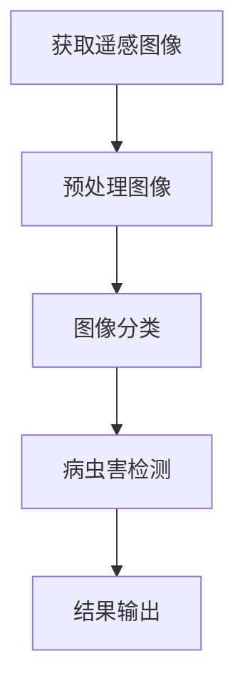
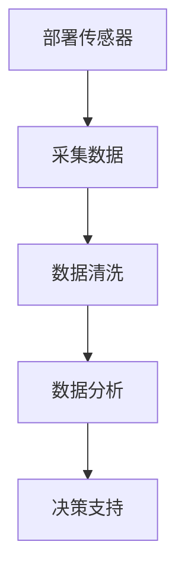
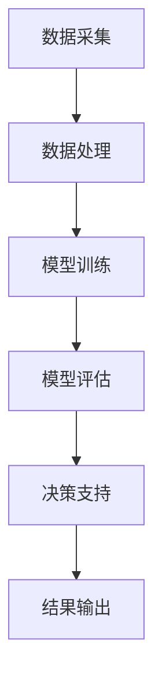

                 

## AI在精准农业中的应用：从监测到决策

关键词：AI，精准农业，遥感技术，物联网，机器学习，决策支持

摘要：随着全球人口的不断增长，农业生产面临着资源短缺、环境污染和生产力提升的挑战。AI技术的引入为精准农业提供了新的解决方案。本文将详细介绍AI在精准农业中的应用，包括监测和决策支持两个方面，通过一步一步的分析，探讨AI如何提高农业生产效率，实现可持续发展。

## 第一部分：AI在精准农业中的应用概述

### 第1章：问题背景与核心概念

#### 1.1 精准农业的概念及其重要性

当前，全球农业生产面临着诸多挑战。首先，随着全球人口的不断增长，粮食需求不断增加，而耕地资源有限，如何提高单位面积产量成为亟待解决的问题。其次，农业环境污染日益严重，农药和化肥的过度使用导致土壤和水资源的污染，对生态环境造成了巨大压力。最后，气候变化对农业生产的影响日益显著，极端天气事件频繁发生，对农作物的生长和产量带来了不确定性。

精准农业作为一种新兴的农业发展模式，通过引入AI技术，实现农业生产过程的智能化、精准化，从而有效应对上述挑战。精准农业的定义可以概括为：通过收集、分析和利用农田环境、作物生长和土壤等数据，为农业生产提供精准的监测和决策支持，从而实现资源的最优配置和产出的最大化。

#### 1.2 AI技术在精准农业中的应用

AI技术在精准农业中的应用主要包括遥感技术、物联网和机器学习等。

**遥感技术**：遥感技术利用卫星或无人机等平台，从高空获取农田的图像和相关信息。通过遥感图像的处理和分析，可以实时监测农田的作物生长状况、病虫害发生情况以及土壤水分等环境参数。

**物联网**：物联网通过在农田中布置传感器网络，实时监测土壤湿度、温度、光照等环境参数。这些数据可以被实时传输到中央控制系统，为农业生产提供实时的监测和预警。

**机器学习**：机器学习是AI的核心技术之一，通过训练模型，可以从大量的历史数据中学习到规律，为农业生产提供精准的决策支持。例如，利用机器学习模型可以预测作物的生长趋势、病虫害的发生概率等。

#### 1.3 AI在精准农业中的应用场景

AI在精准农业中的应用场景非常广泛，主要包括以下几个方面：

**农田监测**：利用遥感技术和物联网技术，对农田进行实时监测，获取农田的图像和数据，用于作物生长状况监测、病虫害检测等。

**决策支持**：基于历史数据和实时数据，利用机器学习模型进行预测和分析，为农业生产提供决策支持，如作物种植方案制定、施肥和灌溉策略优化等。

**资源管理**：通过数据分析，实现农业资源的优化配置，如水资源、肥料和农药的精准使用，降低成本，提高效益。

**农业供应链管理**：通过AI技术，实现农业供应链的智能化，提高供应链的效率，降低成本。

#### 1.4 AI在精准农业中的应用挑战

尽管AI技术在精准农业中具有巨大的潜力，但在实际应用中仍然面临一些挑战：

**数据隐私和安全**：农业生产数据涉及农民的隐私，如何保护这些数据的安全是一个重要问题。

**算法透明性和可解释性**：机器学习算法的“黑箱”性质使得用户难以理解其决策过程，提高算法的可解释性是一个重要挑战。

**技术普及和接受度**：AI技术在农业领域的普及度和接受度还有待提高，需要加强技术培训和宣传。

## 第二部分：AI监测技术在精准农业中的应用

### 第2章：AI监测技术在精准农业中的应用

#### 2.1 遥感技术在农田监测中的应用

遥感技术是精准农业中非常重要的一个组成部分。通过卫星或无人机等平台，可以获取农田的高分辨率图像，从而实现对农田的实时监测。

**遥感技术的应用**：

- **作物分类**：通过对遥感图像的处理和分析，可以实现对农田中不同作物的分类，从而了解作物的生长状况。

- **病虫害检测**：通过对遥感图像的分析，可以识别出农田中的病虫害，为防治提供依据。

- **土壤水分监测**：遥感技术可以获取土壤水分的分布情况，为灌溉提供参考。

**遥感技术的算法原理**：

- **图像预处理**：包括去噪、增强、分割等步骤，以提高图像的质量和清晰度。

- **图像分类**：利用机器学习算法，如支持向量机（SVM）、决策树等，对遥感图像进行分类。

- **病虫害检测**：利用深度学习算法，如卷积神经网络（CNN），对遥感图像进行病虫害检测。

**mermaid流程图**：



#### 2.2 物联网技术在农田监测中的应用

物联网技术在农田监测中同样发挥着重要作用。通过在农田中布置传感器，可以实时获取土壤湿度、温度、光照等环境参数。

**物联网技术的应用**：

- **土壤湿度监测**：通过土壤湿度传感器，可以实时监测土壤湿度，为灌溉提供依据。

- **温度监测**：通过温度传感器，可以实时监测农田的温度变化，为作物生长提供参考。

- **光照监测**：通过光照传感器，可以实时监测农田的光照强度，为作物生长提供参考。

**物联网技术的算法原理**：

- **数据采集**：传感器采集到的数据通过无线网络传输到中央控制系统。

- **数据清洗**：对采集到的数据进行清洗，去除噪声和异常值。

- **数据分析**：利用机器学习算法，如线性回归、时间序列分析等，对传感器数据进行分析，提取有用信息。

**mermaid流程图**：



### 第3章：基于AI的农业生产决策支持

#### 3.1 机器学习模型在农业生产中的应用

机器学习模型在农业生产中有着广泛的应用。通过训练机器学习模型，可以从历史数据中学习到作物生长的规律，从而为农业生产提供决策支持。

**机器学习模型的应用**：

- **作物产量预测**：通过分析历史气候数据、土壤数据等，利用机器学习模型预测作物的产量。

- **病虫害发生预测**：通过分析历史病虫害发生数据、气候数据等，利用机器学习模型预测病虫害的发生。

- **种植方案优化**：通过分析历史种植数据、气候数据等，利用机器学习模型为农民提供最优的种植方案。

**机器学习模型的算法原理**：

- **数据收集**：收集与作物生长相关的历史数据，如气候数据、土壤数据、种植数据等。

- **数据预处理**：对收集到的数据进行分析，去除噪声和异常值，进行特征提取。

- **模型训练**：利用预处理后的数据，训练机器学习模型，如随机森林（Random Forest）、支持向量机（SVM）等。

- **模型评估**：对训练好的模型进行评估，验证其预测效果。

- **模型应用**：将训练好的模型应用到实际生产中，为农民提供决策支持。

**Python源代码示例**：

```python
from sklearn.ensemble import RandomForestRegressor
from sklearn.model_selection import train_test_split
from sklearn.metrics import mean_squared_error

# 加载数据
X, y = load_data()

# 划分训练集和测试集
X_train, X_test, y_train, y_test = train_test_split(X, y, test_size=0.2, random_state=42)

# 创建模型
model = RandomForestRegressor(n_estimators=100, random_state=42)

# 训练模型
model.fit(X_train, y_train)

# 预测
predictions = model.predict(X_test)

# 评估模型
mse = mean_squared_error(y_test, predictions)
print(f'MSE: {mse}')
```

#### 3.2 决策支持系统的设计与实现

决策支持系统是精准农业的核心组成部分。通过收集和分析农田环境、作物生长等数据，为农业生产提供决策支持。

**决策支持系统的算法原理**：

- **数据采集**：收集农田环境、作物生长等数据。

- **数据预处理**：对采集到的数据进行分析，去除噪声和异常值，进行特征提取。

- **模型训练**：利用预处理后的数据，训练机器学习模型，如随机森林（Random Forest）、支持向量机（SVM）等。

- **模型评估**：对训练好的模型进行评估，验证其预测效果。

- **模型应用**：将训练好的模型应用到实际生产中，为农民提供决策支持。

**mermaid架构图**：



## 第三部分：AI在精准农业中的挑战与未来

### 第4章：AI在精准农业中的挑战与未来

#### 4.1 挑战

尽管AI技术在精准农业中具有巨大的潜力，但在实际应用中仍然面临一些挑战。

**数据隐私和安全**：农业生产数据涉及农民的隐私，如何保护这些数据的安全是一个重要问题。需要建立完善的数据安全机制，确保数据的安全性和隐私性。

**算法透明性和可解释性**：机器学习算法的“黑箱”性质使得用户难以理解其决策过程，提高算法的可解释性是一个重要挑战。需要开发可解释的机器学习算法，提高算法的透明度和可理解性。

**技术普及和接受度**：AI技术在农业领域的普及度和接受度还有待提高，需要加强技术培训和宣传，提高农民对AI技术的认知和接受度。

#### 4.2 未来发展趋势

随着AI技术的不断发展，未来AI在精准农业中的应用将更加广泛和深入。

**多模态数据融合**：结合多种数据源，如遥感数据、物联网数据和气象数据等，进行多模态数据融合，提高数据的质量和精度，为农业生产提供更准确的决策支持。

**智能决策支持系统**：开发智能决策支持系统，实现农业生产的自动化和智能化，降低人力成本，提高生产效率。

**农业物联网**：通过部署更多的农业物联网设备，实现农田环境的全面监控，为农业生产提供实时的数据支持。

**农业大数据**：通过收集和分析大量的农业生产数据，建立农业大数据平台，为农业生产提供数据驱动的决策支持。

## 结论

AI技术在精准农业中的应用为农业生产带来了新的机遇和挑战。通过AI技术的引入，可以实现农业生产的智能化和精准化，提高生产效率，降低成本，保护环境。然而，AI技术在农业领域的应用仍面临一些挑战，需要进一步的研究和探索。未来，随着AI技术的不断发展，AI在精准农业中的应用将更加广泛和深入，为农业的可持续发展提供强大的支持。

## 作者信息

作者：AI天才研究院/AI Genius Institute & 禅与计算机程序设计艺术 /Zen And The Art of Computer Programming

**文章小结**：

本文详细介绍了AI在精准农业中的应用，包括监测技术和决策支持系统。通过遥感技术、物联网和机器学习等AI技术的应用，可以实现农田环境的实时监测和精准决策，从而提高农业生产效率。同时，本文也指出了AI在精准农业应用中面临的挑战和未来发展趋势。未来的研究将着重于多模态数据融合、智能决策支持系统和农业大数据等方面，以实现更精准、更智能的农业生产。在应用AI技术时，还需注意数据隐私和安全、算法透明性等问题，确保技术的可持续发展。

