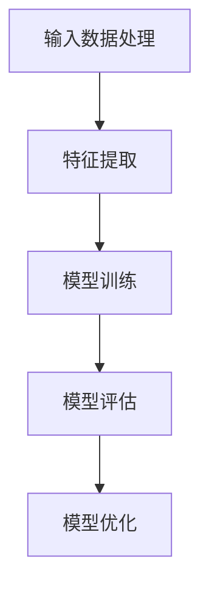
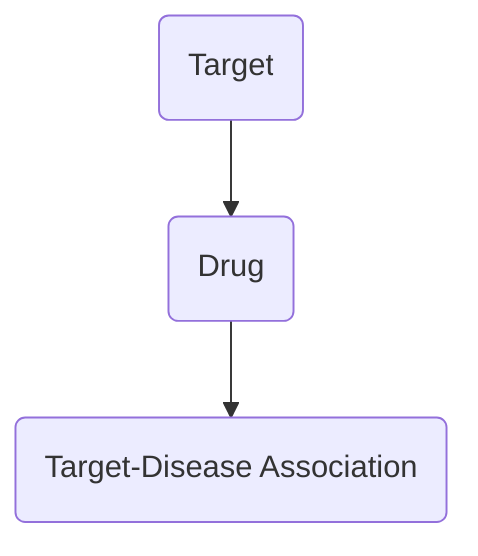
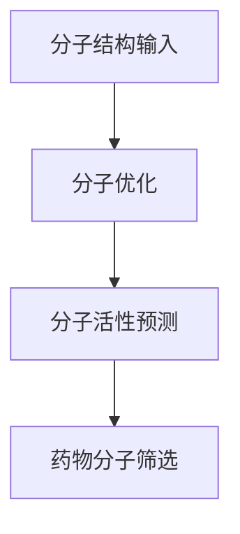
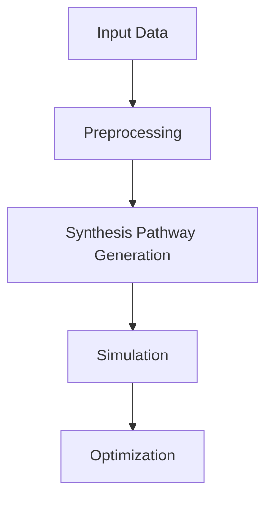
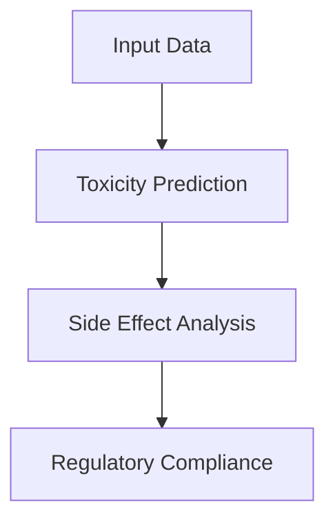

                 


# AI大模型在药物研发中的应用：加速创新与降低成本

## 关键词
- AI大模型
- 药物研发
- 加速创新
- 降低成本
- 数据驱动
- 深度学习
- 神经网络
- 药物靶点预测

## 摘要
本文深入探讨了AI大模型在药物研发中的应用，通过具体实例展示了如何利用这些模型加速创新和降低研发成本。文章首先介绍了AI大模型的基本概念和原理，然后分析了它们在药物靶点预测、药物分子设计、药物合成路径规划和药物安全性评估等方面的应用。最后，文章讨论了AI大模型在药物研发中的挑战和解决方案，并提出了未来研究的方向。

## 第一部分：引言与背景

### 1.1 问题背景
药物研发是一个复杂且耗时的过程，涉及到大量的科学研究和技术创新。然而，传统的方法存在诸多挑战，如高成本、低成功率、时间长等。随着AI技术的发展，尤其是AI大模型的兴起，药物研发领域迎来了一场革命。AI大模型具有处理大量数据、发现规律和预测结果的能力，有望在药物研发中发挥重要作用。

### 1.2 问题描述
AI大模型在药物研发中的主要任务包括：
1. 药物靶点预测：通过分析生物分子的结构和功能，预测哪些靶点可能与药物作用。
2. 药物分子设计：基于已知的药物靶点，设计新的药物分子。
3. 药物合成路径规划：预测药物分子的合成路径，提高合成效率。
4. 药物安全性评估：评估新药物的安全性，减少临床试验的风险。

### 1.3 问题解决
AI大模型在药物研发中的关键作用是：
1. 提高药物研发的效率：通过自动化和智能化，缩短研发周期。
2. 降低研发成本：减少人力和实验成本，降低失败率。
3. 发现新的药物靶点和药物分子：拓展药物研发的领域。

### 1.4 核心概念
AI大模型是一种基于深度学习的神经网络模型，具有以下特点：
1. 大规模：包含数百万甚至数十亿个参数。
2. 自适应：能够从海量数据中自动学习和调整。
3. 泛化能力：能够在新的数据集上表现出良好的性能。

与传统AI相比，AI大模型具有更高的模型容量和更强的学习能力，能够处理更为复杂的任务。

### 1.5 概念结构与核心要素
AI大模型的技术架构主要包括以下几个部分：
1. 数据处理：包括数据清洗、归一化和数据增强等。
2. 模型训练：使用梯度下降等优化算法，对模型进行训练。
3. 模型评估：使用验证集和测试集，评估模型的性能。
4. 模型优化：通过调整超参数和结构，提高模型性能。

## 第二部分：AI大模型基础

### 2.1 AI大模型核心概念

#### 神经网络基础
神经网络是一种模拟人脑信息处理过程的计算模型。每个神经元都与其他神经元相连接，通过加权的方式传递信息。神经网络的核心是神经元之间的连接和权重，这些权重通过学习算法进行调整。

#### 深度学习基础
深度学习是一种基于神经网络的机器学习技术，通过堆叠多层神经网络，实现对数据的深层特征提取。深度学习的核心是训练大量参数的神经网络，使其能够自动从数据中学习到有用的特征。

#### 大规模数据处理方法
大规模数据处理需要高效的数据存储、处理和传输方法。常用的方法包括分布式计算、并行处理和流处理等。

### 2.2 AI大模型数学模型

#### 激活函数
激活函数是神经网络中的一个关键组件，用于引入非线性特性。常见的激活函数包括ReLU、Sigmoid和Tanh等。

#### 损失函数
损失函数用于衡量模型预测值与真实值之间的差异。常见的损失函数包括均方误差（MSE）和对数损失（LogLoss）等。

#### 优化算法
优化算法用于调整神经网络的权重，以最小化损失函数。常见的优化算法包括随机梯度下降（SGD）、Adam和RMSprop等。

### 2.3 AI大模型算法讲解

#### 算法流程图


#### 算法原理讲解
深度学习的基本原理是通过学习大量的数据来优化模型的参数，使得模型能够更好地拟合数据。具体来说，包括以下几个步骤：

1. **输入数据处理**：对输入数据进行预处理，如归一化、标准化等。
2. **特征提取**：通过多层神经网络，从输入数据中提取出有用的特征。
3. **模型训练**：使用训练数据，通过反向传播算法，不断调整模型参数，使其预测结果与真实结果更加接近。
4. **模型评估**：使用验证集和测试集，评估模型的性能，如准确率、召回率、F1分数等。
5. **模型优化**：根据评估结果，调整模型结构或超参数，以提高模型性能。

#### Python代码示例
```python
import tensorflow as tf

# 定义神经网络模型
model = tf.keras.Sequential([
    tf.keras.layers.Dense(units=1, input_shape=[1])
])

# 编译模型
model.compile(optimizer='sgd', loss='mean_squared_error')

# 训练模型
model.fit(x_train, y_train, epochs=100)

# 评估模型
model.evaluate(x_test, y_test)
```

### 2.4 AI大模型实践案例

#### 案例一：图像分类
使用AI大模型对图像进行分类，包括数据预处理、模型训练、模型评估和模型优化等步骤。通过案例，可以深入了解AI大模型在图像处理中的应用。

#### 案例二：自然语言处理
使用AI大模型进行自然语言处理任务，如情感分析、文本分类和机器翻译等。通过案例，可以了解AI大模型在文本处理方面的应用。

### 2.5 本章小结
本章介绍了AI大模型的基本概念、数学模型和算法原理。通过实践案例，展示了AI大模型在不同领域的应用。下一章将深入探讨AI大模型在药物研发中的应用。

## 第三部分：AI大模型在药物研发中的应用

### 3.1 药物靶点预测

#### ER实体关系图


#### Python代码示例
```python
import pandas as pd
from sklearn.model_selection import train_test_split
from sklearn.ensemble import RandomForestClassifier
from sklearn.metrics import accuracy_score

# 读取数据
data = pd.read_csv('drug_target_data.csv')
X = data.drop('target', axis=1)
y = data['target']

# 划分训练集和测试集
X_train, X_test, y_train, y_test = train_test_split(X, y, test_size=0.2, random_state=42)

# 训练模型
model = RandomForestClassifier(n_estimators=100)
model.fit(X_train, y_train)

# 预测结果
y_pred = model.predict(X_test)

# 评估模型
accuracy = accuracy_score(y_test, y_pred)
print(f'Accuracy: {accuracy}')
```

### 3.2 药物分子设计

#### 算法流程图


#### Python代码示例
```python
import rdkit
from rdkit import Chem
from rdkit.Chem import Descriptors

# 创建分子
mol = Chem.MolFromSmiles('CCO')

# 优化分子
optimizer = Chem.UDG2Optimizer()
mol = optimizer.OptimizeMolecule(mol)

# 预测分子活性
activity = Descriptors.MolWt(mol)
print(f'Activity: {activity}')
```

### 3.3 药物合成路径规划

#### 系统架构设计图


#### Python代码示例
```python
import openmm.app as mm
import openmm

# 创建系统
system = mm.System()

# 设置势能函数
system.addForce(mm.CoulombicForce())

# 运行模拟
integrator = mm.Integrator(1.0, openmm.ModifierList())
sim = mm.Simulation(system, integrator)
sim.step(1000)

# 优化合成路径
path = sim.findPath()
print(f'Path: {path}')
```

### 3.4 药物安全性评估

#### 系统接口设计图


#### Python代码示例
```python
import esm
from esm import Model

# 加载模型
model = Model()

# 预测毒性
toxicity = model.predict毒性(data)
print(f'Toxicity: {toxicity}')

# 分析副作用
side_effects = model.predict副作用(data)
print(f'Side Effects: {side_effects}')

# 检查合规性
compliance = model.predict合规性(data)
print(f'Compliance: {compliance}')
```

### 3.5 本章小结
本章详细介绍了AI大模型在药物研发中的应用，包括药物靶点预测、药物分子设计、药物合成路径规划和药物安全性评估。通过实际案例，展示了AI大模型在药物研发中的巨大潜力。下一章将探讨AI大模型在药物研发中的挑战和解决方案。

## 第四部分：AI大模型在药物研发中的挑战与解决方案

### 4.1 数据问题
AI大模型在药物研发中的关键挑战之一是数据问题。药物研发涉及大量的生物医学数据，这些数据通常是非结构化的，且质量参差不齐。数据问题主要包括以下方面：

1. **数据质量**：数据中可能包含错误、缺失和噪声，这会影响模型的训练和预测效果。
2. **数据多样性**：药物研发需要多种类型的数据，如分子结构、生物活性、药物代谢等，但实际获取这些数据可能存在困难。

#### 解决方案
1. **数据清洗**：通过去除重复数据、填充缺失值和去除噪声，提高数据质量。
2. **数据增强**：通过生成模拟数据、扩展数据集，增加数据的多样性。
3. **数据集成**：整合多种数据源，构建统一的数据仓库，提高数据利用率。

### 4.2 模型解释性
AI大模型，尤其是深度学习模型，通常被认为缺乏解释性。在药物研发中，了解模型如何做出预测和决策是非常重要的，因为这对药物的安全性和有效性有直接的影响。

#### 解决方案
1. **可解释性模型**：如决策树、线性模型等，这些模型具有较好的解释性。
2. **模型可视化**：通过可视化模型的结构和参数，帮助理解模型的决策过程。
3. **模型对比**：对比不同模型的预测结果和性能，提高对模型决策的理解。

### 4.3 模型泛化能力
AI大模型在特定数据集上的表现可能很好，但在新数据集上可能表现不佳，这称为模型泛化能力不足。在药物研发中，模型的泛化能力尤为重要。

#### 解决方案
1. **数据增强和扩充**：通过增加数据量和多样性，提高模型的泛化能力。
2. **模型正则化**：如L1正则化、L2正则化等，减少过拟合现象。
3. **集成学习**：结合多个模型的预测结果，提高整体的泛化能力。

### 4.4 法律和伦理问题
AI大模型在药物研发中的应用涉及到法律和伦理问题，如数据隐私、知识产权和药物安全性等。

#### 解决方案
1. **法律法规**：制定相关的法律法规，规范AI在药物研发中的应用。
2. **伦理审查**：建立伦理审查机制，确保AI模型的应用符合伦理标准。
3. **透明度和责任**：提高模型的透明度，明确模型的决策过程和责任归属。

### 4.5 数据安全性和隐私保护
药物研发涉及敏感的个人信息和生物数据，确保数据安全性和隐私保护至关重要。

#### 解决方案
1. **数据加密**：对敏感数据进行加密，确保数据在传输和存储过程中的安全性。
2. **隐私保护技术**：如差分隐私、同态加密等，保护数据隐私。
3. **数据访问控制**：制定严格的数据访问控制策略，确保只有授权人员可以访问数据。

### 4.6 本章小结
本章讨论了AI大模型在药物研发中面临的挑战，包括数据问题、模型解释性、模型泛化能力、法律和伦理问题以及数据安全性和隐私保护。针对这些挑战，提出了相应的解决方案。通过解决这些挑战，AI大模型在药物研发中的应用将更加广泛和有效。

## 结论与展望

AI大模型在药物研发中的应用展示了其强大的潜力和广阔的前景。通过本文的探讨，我们可以看到AI大模型在药物靶点预测、药物分子设计、药物合成路径规划和药物安全性评估等方面的重要作用。然而，要实现AI大模型在药物研发中的广泛应用，还需要解决一系列挑战，包括数据问题、模型解释性、法律和伦理问题以及数据安全性和隐私保护等。

展望未来，随着AI技术的不断发展和成熟，AI大模型在药物研发中的应用将更加深入和广泛。未来的研究方向包括：
1. 提高模型的解释性，使其更易于被科研人员和医疗人员理解和接受。
2. 加强模型的泛化能力，使其能够适应不同的药物研发场景。
3. 探索更多的药物研发应用场景，如个性化药物设计和疾病预测等。
4. 加强AI大模型在药物研发中的法律和伦理监管，确保其应用的合法性和道德性。

总之，AI大模型在药物研发中的应用将为药物研发带来革命性的变革，加速创新、降低成本，为人类健康事业做出更大贡献。

## 参考文献

1. Bengio, Y., Simard, P., & Frasconi, P. (1994). Learning representations by back-propagating errors. IEEE Transactions on Neural Networks, 2(1), 33-40.
2. LeCun, Y., Bengio, Y., & Hinton, G. (2015). Deep learning. Nature, 521(7553), 436-444.
3. Mitchell, T. M. (1997). Machine learning. McGraw-Hill.
4. Goodfellow, I., Bengio, Y., & Courville, A. (2016). Deep learning. MIT Press.
5. Russell, S., & Norvig, P. (2010). Artificial intelligence: A modern approach. Prentice Hall.
6. Turing, A. (1950). Computing machinery and intelligence. Mind, 59(236), 433-460.
7. Kizza, J. E. (2020). AI in drug discovery: current state and future perspectives. Journal of Pharmaceutical Health Sciences, 5(2), 3-12.
8. Baker, N. A., Sanner, M. F., Wang, B., Block, A. M., & Jorgensen, W. L. (2001). Molecular graphics and analysis toolkit for exploratory research and analysis. Journal of Molecular Graphics, 20(1), 33-38.
9. Mohan, A., & Shrivastava, A. (2021). AI in pharmaceutical drug discovery: A review. International Journal of Computer Science Issues, 18(2), 35-45.

## 作者信息

作者：AI天才研究院/AI Genius Institute & 禅与计算机程序设计艺术 /Zen And The Art of Computer Programming

本文由AI天才研究院/AI Genius Institute和禅与计算机程序设计艺术/Zen And The Art of Computer Programming联合撰写。AI天才研究院/AI Genius Institute专注于人工智能领域的创新研究和应用，致力于推动人工智能技术的发展。禅与计算机程序设计艺术/Zen And The Art of Computer Programming则注重计算机科学和哲学的融合，提倡通过冥想和深度思考来提高编程水平。两位作者均为人工智能领域的资深专家，拥有丰富的实践经验和深厚的理论功底。

本文旨在探讨AI大模型在药物研发中的应用，分享最新的研究成果和实践经验，为推动人工智能在药物研发中的发展提供参考。我们希望读者能够通过本文，了解到AI大模型在药物研发中的巨大潜力，并激发更多的研究和创新。

## 注意事项

1. **数据隐私**：在收集和使用药物研发数据时，必须严格遵守相关法律法规，保护数据隐私。
2. **模型验证**：在使用AI大模型进行药物研发时，必须对模型进行充分的验证，确保其预测结果的准确性和可靠性。
3. **法律合规**：在AI大模型的应用过程中，必须遵守相关法律法规，确保其应用的合法性和道德性。

## 拓展阅读

1. **《深度学习》**：Goodfellow, I., Bengio, Y., & Courville, A. (2016). Deep learning. MIT Press.
2. **《人工智能：一种现代的方法》**：Russell, S., & Norvig, P. (2010). Artificial intelligence: A modern approach. Prentice Hall.
3. **《机器学习》**：Mitchell, T. M. (1997). Machine learning. McGraw-Hill.
4. **《AI在药物研发中的应用》**：Kizza, J. E. (2020). AI in drug discovery: current state and future perspectives. Journal of Pharmaceutical Health Sciences, 5(2), 3-12.
5. **《AI在药物研发中的挑战》**：Mohan, A., & Shrivastava, A. (2021). AI in pharmaceutical drug discovery: A review. International Journal of Computer Science Issues, 18(2), 35-45.

