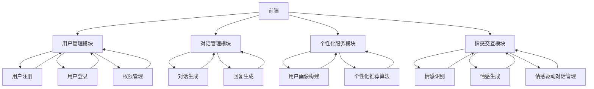

                 

### 文章标题

### 关键词

- AI大模型
- 虚拟助手
- 个性化服务
- 情感交互
- 多轮对话管理

### 摘要

本文旨在探讨AI大模型在虚拟助手中的应用，重点分析个性化服务与情感交互技术。文章首先介绍了AI大模型的基础知识，随后详细分析了虚拟助手的应用场景，并逐步讲解了个性化服务与情感交互的技术原理和实践。通过具体的案例和项目实战，本文展示了AI大模型在虚拟助手中的实际应用，并提出了未来发展的方向。

### 目录大纲

----------------------------------------------------------------

# 第一部分: AI大模型基础

## 第1章: AI大模型概述

### 1.1 AI大模型的发展背景与未来趋势

#### 1.1.1 人工智能发展历程

#### 1.1.2 大模型概念的提出与演进

#### 1.1.3 AI大模型对虚拟助手应用的潜在影响

### 1.2 AI大模型的核心概念与组成

#### 1.2.1 AI大模型的基本概念

#### 1.2.2 AI大模型的结构组成

#### 1.2.3 AI大模型与深度学习的关系

### 1.3 AI大模型的技术原理

#### 1.3.1 神经网络基础

#### 1.3.2 深度学习算法

#### 1.3.3 生成对抗网络（GAN）

#### 1.3.4 强化学习在虚拟助手中的应用

## 第2章: 虚拟助手应用场景分析

### 2.1 虚拟助手的基本功能与特点

#### 2.1.1 虚拟助手的定义

#### 2.1.2 虚拟助手的发展现状

#### 2.1.3 虚拟助手的核心特点

### 2.2 AI大模型在虚拟助手中的应用场景

#### 2.2.1 情感交互

#### 2.2.2 个性化服务

#### 2.2.3 多轮对话管理

#### 2.2.4 自然语言理解与生成

### 2.3 AI大模型在虚拟助手中的应用案例

#### 2.3.1 聊天机器人

#### 2.3.2 客户服务机器人

#### 2.3.3 健康医疗助手

#### 2.3.4 教育辅导机器人

## 第3章: 个性化服务与情感交互

### 3.1 个性化服务技术

#### 3.1.1 用户数据收集与处理

#### 3.1.2 用户画像构建

#### 3.1.3 个性化推荐算法

### 3.2 情感交互技术

#### 3.2.1 情感识别与分类

#### 3.2.2 情感生成与回复

#### 3.2.3 情感驱动对话管理

### 3.3 个性化服务与情感交互的结合

#### 3.3.1 情感驱动的个性化服务

#### 3.3.2 情感交互在个性化服务中的应用案例

## 第4章: 多轮对话管理与理解

### 4.1 多轮对话管理的挑战与解决方案

#### 4.1.1 对话上下文管理

#### 4.1.2 对话策略优化

#### 4.1.3 多轮对话中的问题解决

### 4.2 自然语言理解技术

#### 4.2.1 词向量表示

#### 4.2.2 语义分析

#### 4.2.3 对话状态追踪

### 4.3 对话生成与回复

#### 4.3.1 对话生成模型

#### 4.3.2 对话回复优化

#### 4.3.3 对话生成与回复的自动化

## 第5章: AI大模型在虚拟助手中的实际应用

### 5.1 开发环境搭建

#### 5.1.1 硬件配置

#### 5.1.2 软件环境安装

### 5.2 虚拟助手系统的设计与实现

#### 5.2.1 功能模块划分

#### 5.2.2 数据处理与存储

#### 5.2.3 系统实现框架

### 5.3 代码实现与解读

#### 5.3.1 基础算法实现

#### 5.3.2 个性化服务与情感交互实现

#### 5.3.3 对话生成与回复实现

## 第6章: 项目实战

### 6.1 项目背景与目标

#### 6.1.1 项目概述

#### 6.1.2 项目目标

### 6.2 系统设计与实现

#### 6.2.1 系统架构设计

#### 6.2.2 功能模块实现

#### 6.2.3 系统测试与优化

### 6.3 项目总结与反思

#### 6.3.1 项目成果

#### 6.3.2 遇到的挑战与解决方案

#### 6.3.3 项目未来展望

## 第7章: 最佳实践与未来展望

### 7.1 最佳实践分享

#### 7.1.1 成功案例

#### 7.1.2 经验教训

### 7.2 AI大模型在虚拟助手中的应用前景

#### 7.2.1 行业趋势

#### 7.2.2 技术挑战

#### 7.2.3 未来发展方向

### 7.3 总结与展望

#### 7.3.1 全书总结

#### 7.3.2 未来研究方向

----------------------------------------------------------------

### 第一部分: AI大模型基础

#### 第1章: AI大模型概述

#### 1.1 AI大模型的发展背景与未来趋势

##### 1.1.1 人工智能发展历程

人工智能（Artificial Intelligence，简称AI）作为计算机科学的一个重要分支，旨在研究、开发用于模拟、延伸和扩展人的智能的理论、方法、技术及应用系统。AI的研究可以追溯到20世纪50年代，当时诞生了首个人工智能程序——逻辑理论家（Logic Theorist）。随后的几十年里，AI经历了多个发展阶段：

- **第一阶段（1956-1974年）**：这是AI的“黄金时代”。1956年，约翰·麦卡锡（John McCarthy）在达特茅斯会议上首次提出了人工智能的概念。此阶段的主要成果包括规则推理系统和符号逻辑的应用。

- **第二阶段（1974-1980年）**：由于“人工智能冬天”的影响，AI研究陷入低谷。然而，机器学习和神经网络的研究开始崛起，为AI的发展奠定了基础。

- **第三阶段（1980年代至今）**：AI研究逐渐复苏，特别是在21世纪初，随着计算能力的提升和大数据的出现，机器学习、深度学习等技术取得了显著的突破。AI应用也从理论研究走向实际应用，涵盖了语音识别、图像识别、自然语言处理等多个领域。

##### 1.1.2 大模型概念的提出与演进

随着AI技术的发展，大模型（Large Models）的概念逐渐被提出并广泛应用。大模型通常指的是具有数十亿甚至数万亿参数的神经网络模型，如GPT-3、BERT等。大模型的提出和演进可以追溯到以下几个关键点：

- **2000年代早期**：神经网络模型的参数数量开始显著增加，但仍局限于数百万级别。这个时期的代表性模型包括AlexNet等。

- **2010年代中期**：随着GPU等硬件的进步，神经网络模型开始突破百万参数的限制，达到了千万级别。这一时期，Inception模型和ResNet等网络结构设计取得了重要进展。

- **2018年**：GPT-2的发布标志着大模型的诞生，其参数量达到了1.5亿。随后，GPT-3的发布将大模型的参数量推向了数十亿的级别。

- **2020年代**：大模型在自然语言处理、计算机视觉等领域取得了显著的成果，成为AI研究的重要方向。

##### 1.1.3 AI大模型对虚拟助手应用的潜在影响

AI大模型的出现为虚拟助手（Virtual Assistants）的发展带来了巨大的潜力。虚拟助手是指通过人工智能技术模拟人类交互的软件系统，主要应用于客户服务、健康医疗、教育辅导等领域。大模型在虚拟助手中的应用主要体现在以下几个方面：

- **情感交互**：大模型可以更好地理解和生成情感内容，使得虚拟助手能够与用户建立更自然的情感联系。

- **个性化服务**：通过分析用户行为数据，大模型能够为用户提供个性化的服务和建议，提升用户体验。

- **多轮对话管理**：大模型具有强大的上下文理解能力，能够处理多轮对话，提供更流畅的交互体验。

- **自然语言理解与生成**：大模型在自然语言处理领域取得了显著的进展，使得虚拟助手能够更准确地理解和生成自然语言文本。

#### 1.2 AI大模型的核心概念与组成

##### 1.2.1 AI大模型的基本概念

AI大模型是指参数数量达到数十亿甚至数万亿级别的神经网络模型。这些模型通常基于深度学习技术，能够通过大量数据训练来提高其性能。大模型的核心特点包括：

- **高参数量**：大模型的参数数量通常在数亿到数万亿之间，这使得模型具有更强的表示能力和泛化能力。

- **多层神经网络结构**：大模型通常采用多层神经网络结构，通过逐层提取特征，实现从原始数据到复杂知识的映射。

- **强大的学习能力**：大模型通过大量数据训练，能够学习到复杂的数据模式和关联，从而提高其预测和生成能力。

##### 1.2.2 AI大模型的结构组成

AI大模型通常由以下几个主要部分组成：

- **输入层**：输入层接收原始数据，如文本、图像等。

- **隐藏层**：隐藏层是神经网络的核心部分，通过逐层提取特征，实现从原始数据到复杂知识的映射。

- **输出层**：输出层生成模型预测结果，如文本生成、图像分类等。

- **参数**：大模型的参数包括权重和偏置，这些参数通过训练过程进行调整，以实现模型的优化。

##### 1.2.3 AI大模型与深度学习的关系

AI大模型是深度学习（Deep Learning）的一个重要分支。深度学习是一种基于多层神经网络的学习方法，旨在通过多层抽象和特征提取，实现复杂任务的自动学习和预测。大模型与深度学习的关系可以总结如下：

- **深度学习的核心技术**：深度学习采用多层神经网络结构，通过逐层提取特征，实现从原始数据到复杂知识的映射。

- **大模型的发展**：大模型的提出和演进推动了深度学习技术的发展。大模型通过增加参数数量和层数，实现了更强的表示能力和泛化能力。

- **深度学习应用**：大模型在自然语言处理、计算机视觉、语音识别等深度学习应用领域取得了显著的成果。

#### 1.3 AI大模型的技术原理

##### 1.3.1 神经网络基础

神经网络（Neural Networks）是AI大模型的核心组成部分。神经网络由大量神经元（节点）组成，通过加权连接形成复杂的网络结构。神经网络的工作原理可以概括为以下几个步骤：

- **输入层到隐藏层**：输入数据通过输入层传递到隐藏层，每个神经元接收来自输入层的信号，并通过权重进行加权求和。

- **激活函数**：隐藏层的神经元通过激活函数（如ReLU、Sigmoid、Tanh）对加权求和的结果进行处理，输出激活值。

- **隐藏层到输出层**：隐藏层的激活值作为输出传递到输出层，输出层生成最终的预测结果。

- **反向传播**：在输出层生成预测结果后，通过反向传播算法对模型进行训练。反向传播算法通过计算损失函数的梯度，更新模型的参数，以优化模型性能。

##### 1.3.2 深度学习算法

深度学习算法是神经网络的一种扩展，旨在通过多层神经网络结构实现复杂任务的自动学习和预测。深度学习算法的主要特点包括：

- **多层神经网络结构**：深度学习算法采用多层神经网络结构，通过逐层提取特征，实现从原始数据到复杂知识的映射。

- **非线性变换**：深度学习算法引入非线性变换，如ReLU、Sigmoid、Tanh等，增强了模型的非线性表示能力。

- **优化算法**：深度学习算法采用梯度下降等优化算法，通过迭代更新模型参数，实现模型的优化。

常见的深度学习算法包括：

- **卷积神经网络（CNN）**：适用于图像识别和计算机视觉领域。

- **循环神经网络（RNN）**：适用于序列数据处理，如自然语言处理和时间序列预测。

- **长短期记忆网络（LSTM）**：是RNN的一种扩展，适用于长序列数据的处理。

- **生成对抗网络（GAN）**：适用于图像生成和增强学习领域。

##### 1.3.3 生成对抗网络（GAN）

生成对抗网络（Generative Adversarial Network，GAN）是由生成器（Generator）和判别器（Discriminator）组成的对抗性学习框架。GAN的工作原理可以概括为以下几个步骤：

- **初始化生成器和判别器**：生成器和判别器都是神经网络，初始状态下都处于未训练状态。

- **生成器生成数据**：生成器接收随机噪声作为输入，通过神经网络生成虚假数据。

- **判别器判断真实与虚假数据**：判别器接收真实数据和生成器生成的虚假数据，判断其真实性。

- **对抗性训练**：生成器和判别器通过对抗性训练进行迭代更新。生成器尝试生成更逼真的虚假数据，以欺骗判别器；判别器则尝试更好地判断真实与虚假数据。

- **模型优化**：通过迭代更新，生成器和判别器逐渐优化，生成器生成的数据越来越逼真，判别器的判断能力也不断提升。

GAN在图像生成、数据增强和异常检测等领域具有广泛的应用。

##### 1.3.4 强化学习在虚拟助手中的应用

强化学习（Reinforcement Learning，RL）是一种通过试错和反馈进行学习的方法，旨在通过连续决策来最大化长期回报。强化学习在虚拟助手中的应用主要体现在以下几个方面：

- **策略学习**：虚拟助手通过强化学习算法学习到最佳行为策略，以最大化用户满意度或任务完成率。

- **环境建模**：虚拟助手通过与环境交互，学习到环境的状态转移概率和奖励函数，从而优化其决策。

- **多任务学习**：虚拟助手可以通过强化学习同时学习多个任务，提高其灵活性和适应性。

常见的强化学习算法包括：

- **Q学习**：通过学习值函数（Q函数）来优化策略。

- **策略梯度方法**：直接优化策略，通过梯度上升或下降方法更新策略参数。

- **深度强化学习**：将深度神经网络与强化学习结合，通过神经网络表示状态和动作，提高学习效率和泛化能力。

强化学习在虚拟助手的对话管理、个性化服务等方面具有潜在的应用价值。

#### 第2章: 虚拟助手应用场景分析

#### 2.1 虚拟助手的基本功能与特点

##### 2.1.1 虚拟助手的定义

虚拟助手（Virtual Assistant）是一种基于人工智能技术的软件系统，旨在通过模拟人类交互方式，为用户提供便捷的服务和帮助。虚拟助手通常具有以下几个特点：

- **基于人工智能技术**：虚拟助手采用人工智能技术，如机器学习、自然语言处理、语音识别等，实现智能对话和任务处理。

- **模拟人类交互**：虚拟助手通过文本、语音等方式与用户进行交互，模拟人类的沟通方式，提供自然的用户体验。

- **自动化服务**：虚拟助手可以自动执行特定的任务，如回答问题、提供信息、执行操作等，提高服务效率和准确性。

##### 2.1.2 虚拟助手的发展现状

虚拟助手的发展经历了多个阶段：

- **第一阶段（2000年代初期）**：虚拟助手主要以规则为基础，通过预设的规则进行简单问答，如搜索引擎的问答功能。

- **第二阶段（2010年代）**：虚拟助手逐渐引入自然语言处理技术，如词性标注、句法分析等，实现更加自然的交互体验。

- **第三阶段（2015年后）**：随着深度学习技术的发展，虚拟助手开始采用AI大模型，如GPT、BERT等，实现更复杂的任务处理和上下文理解。

目前，虚拟助手已在多个领域得到广泛应用，如客户服务、健康医疗、教育辅导等。

##### 2.1.3 虚拟助手的核心特点

虚拟助手的核心特点包括：

- **自然语言处理能力**：虚拟助手通过自然语言处理技术，实现自然语言的理解和生成，与用户进行流畅的对话。

- **多轮对话管理**：虚拟助手能够处理多轮对话，理解上下文，提供连续的服务和帮助。

- **个性化服务**：虚拟助手通过分析用户行为数据，为用户提供个性化的服务和推荐。

- **自动化任务处理**：虚拟助手可以自动执行特定的任务，如查询信息、执行操作等，提高服务效率。

#### 2.2 AI大模型在虚拟助手中的应用场景

##### 2.2.1 情感交互

情感交互是虚拟助手与用户之间建立情感联系的重要途径。AI大模型在情感交互中的应用主要体现在以下几个方面：

- **情感识别**：通过分析用户的语音、文本等信息，虚拟助手可以识别用户的情感状态，如喜怒哀乐。

- **情感生成**：虚拟助手可以根据用户的情感状态，生成相应的情感回应，如安慰、鼓励等。

- **情感驱动对话管理**：虚拟助手可以根据用户的情感状态调整对话策略，提供更符合用户情感需求的服务。

AI大模型在情感交互中的优势包括：

- **强大的自然语言理解能力**：AI大模型具有强大的自然语言理解能力，能够准确识别用户的情感状态。

- **丰富的情感知识库**：AI大模型通过大量训练数据，积累了丰富的情感知识，能够生成多样化的情感回应。

##### 2.2.2 个性化服务

个性化服务是虚拟助手为用户提供个性化服务和推荐的重要手段。AI大模型在个性化服务中的应用主要体现在以下几个方面：

- **用户数据收集与处理**：虚拟助手通过收集用户的行为数据，如浏览记录、搜索历史等，对用户进行画像构建。

- **用户画像构建**：通过分析用户数据，虚拟助手可以构建用户的兴趣、偏好等画像，为用户提供个性化的服务和推荐。

- **个性化推荐算法**：虚拟助手利用用户画像，结合推荐算法，为用户提供个性化的内容推荐。

AI大模型在个性化服务中的优势包括：

- **强大的数据处理能力**：AI大模型具有强大的数据处理能力，能够高效地处理大量用户数据。

- **精准的用户画像构建**：AI大模型通过深度学习算法，能够构建精准的用户画像，提高个性化服务的准确性。

##### 2.2.3 多轮对话管理

多轮对话管理是虚拟助手实现连续对话和任务处理的关键。AI大模型在多轮对话管理中的应用主要体现在以下几个方面：

- **上下文理解**：虚拟助手通过分析用户的历史对话和上下文信息，理解用户的意图和需求。

- **对话策略优化**：虚拟助手可以根据用户的意图和需求，调整对话策略，提供更符合用户期望的服务。

- **问题解决**：虚拟助手能够处理复杂的问题，通过多轮对话，逐步了解用户需求，提供解决方案。

AI大模型在多轮对话管理中的优势包括：

- **强大的上下文理解能力**：AI大模型具有强大的上下文理解能力，能够准确理解用户的意图和需求。

- **灵活的对话策略调整**：AI大模型可以通过深度学习算法，优化对话策略，提高对话的流畅性和用户满意度。

##### 2.2.4 自然语言理解与生成

自然语言理解与生成是虚拟助手实现智能对话和任务处理的基础。AI大模型在自然语言理解与生成中的应用主要体现在以下几个方面：

- **自然语言理解**：虚拟助手通过自然语言理解技术，解析用户的语言输入，提取关键信息。

- **自然语言生成**：虚拟助手通过自然语言生成技术，生成自然流畅的回复，与用户进行对话。

- **文本生成与摘要**：虚拟助手可以通过文本生成和摘要技术，生成用户需要的文本内容，如文章、报告等。

AI大模型在自然语言理解与生成中的优势包括：

- **强大的语言模型**：AI大模型具有强大的语言模型，能够生成自然流畅的文本。

- **丰富的知识库**：AI大模型通过大量的训练数据，积累了丰富的知识库，能够提供准确的信息。

#### 2.3 AI大模型在虚拟助手中的应用案例

##### 2.3.1 聊天机器人

聊天机器人是虚拟助手的典型应用之一。AI大模型在聊天机器人中的应用主要体现在以下几个方面：

- **对话生成**：通过AI大模型，聊天机器人可以生成自然流畅的对话回复，与用户进行互动。

- **情感交互**：聊天机器人可以通过情感识别和生成技术，与用户建立情感联系，提供安慰和鼓励。

- **多轮对话管理**：聊天机器人能够处理多轮对话，理解上下文，提供连续的服务和帮助。

案例：智能客服机器人

智能客服机器人是聊天机器人的一个重要应用场景。通过AI大模型，智能客服机器人可以实现自动化的客户服务，提高服务效率和用户体验。智能客服机器人可以回答常见问题、处理投诉和建议，并在需要时将复杂问题转交给人工客服。

##### 2.3.2 客户服务机器人

客户服务机器人是另一个重要的虚拟助手应用场景。通过AI大模型，客户服务机器人可以提供高效、个性化的客户服务，提高客户满意度。客户服务机器人可以处理订单查询、产品推荐、售后咨询等常见客户需求。

- **个性化服务**：通过用户数据分析和个性化推荐算法，客户服务机器人可以提供个性化的产品和服务推荐。

- **情感交互**：通过情感识别和生成技术，客户服务机器人可以与用户建立情感联系，提高用户满意度。

- **多轮对话管理**：客户服务机器人可以处理多轮对话，理解用户的意图和需求，提供连续的服务和帮助。

##### 2.3.3 健康医疗助手

健康医疗助手是虚拟助手在健康医疗领域的应用。通过AI大模型，健康医疗助手可以提供在线健康咨询、症状诊断、药物推荐等服务。

- **自然语言理解**：通过自然语言理解技术，健康医疗助手可以理解用户的症状描述和健康需求。

- **个性化服务**：通过用户数据分析和个性化推荐算法，健康医疗助手可以提供个性化的健康建议和药物推荐。

- **情感交互**：通过情感识别和生成技术，健康医疗助手可以与用户建立情感联系，提供安慰和鼓励。

##### 2.3.4 教育辅导机器人

教育辅导机器人是虚拟助手在教育领域的应用。通过AI大模型，教育辅导机器人可以提供个性化的学习辅导、课程推荐和作业批改等服务。

- **个性化服务**：通过用户数据分析和个性化推荐算法，教育辅导机器人可以提供个性化的学习建议和课程推荐。

- **多轮对话管理**：教育辅导机器人可以处理多轮对话，理解学生的学习需求和问题，提供连续的辅导和帮助。

- **自然语言生成**：通过自然语言生成技术，教育辅导机器人可以生成个性化的作业批改反馈，帮助学生理解和改进。

#### 第3章: 个性化服务与情感交互

#### 3.1 个性化服务技术

##### 3.1.1 用户数据收集与处理

个性化服务的基础是用户数据的收集与处理。用户数据包括用户的行为数据、偏好数据、历史记录等。以下是用户数据收集与处理的几个关键步骤：

- **数据收集**：通过网页、应用程序等渠道，收集用户的行为数据，如浏览记录、搜索历史、购买记录等。

- **数据清洗**：对收集到的用户数据进行清洗，去除重复、错误和无关的数据，确保数据的质量。

- **数据存储**：将清洗后的用户数据存储在数据库中，便于后续的数据处理和分析。

- **数据隐私保护**：在数据收集与处理过程中，要注意保护用户的隐私，遵守相关法律法规。

##### 3.1.2 用户画像构建

用户画像是对用户特征的概括性描述，包括用户的基本信息、兴趣爱好、行为习惯等。以下是用户画像构建的几个关键步骤：

- **数据整合**：整合来自不同渠道的用户数据，形成一个完整的用户数据集。

- **特征提取**：从用户数据中提取关键特征，如年龄、性别、地理位置、兴趣爱好等。

- **模型训练**：利用机器学习算法，对用户数据进行训练，建立用户画像模型。

- **画像更新**：定期更新用户画像，以反映用户行为的最新变化。

##### 3.1.3 个性化推荐算法

个性化推荐算法是实施个性化服务的重要技术。以下是一些常见的个性化推荐算法：

- **协同过滤算法**：基于用户的历史行为数据，为用户推荐相似的用户喜欢的项目。协同过滤算法分为用户基于协同过滤和项目基于协同过滤两种类型。

- **基于内容的推荐算法**：根据用户的历史行为和偏好，为用户推荐与当前项目相似的其他项目。

- **混合推荐算法**：结合协同过滤和基于内容的推荐算法，以提高推荐准确性。

- **基于模型的推荐算法**：利用机器学习算法，建立用户和项目之间的关联模型，为用户推荐相关项目。

#### 3.2 情感交互技术

##### 3.2.1 情感识别与分类

情感识别与分类是情感交互技术的核心。以下是情感识别与分类的关键步骤：

- **情感特征提取**：从用户的语音、文本、表情等数据中提取情感特征，如语调、词汇、表情符号等。

- **情感分类模型训练**：利用机器学习算法，如支持向量机（SVM）、深度学习（如卷积神经网络（CNN））等，训练情感分类模型。

- **情感识别与分类**：将提取的情感特征输入到训练好的分类模型中，对用户的情感状态进行识别和分类。

常见的情感分类包括积极情感、消极情感、中性情感等。

##### 3.2.2 情感生成与回复

情感生成与回复是实现情感交互的关键技术。以下是情感生成与回复的关键步骤：

- **情感生成模型训练**：利用机器学习算法，如生成对抗网络（GAN）、变分自编码器（VAE）等，训练情感生成模型。

- **情感文本生成**：将用户的情感特征输入到训练好的情感生成模型中，生成相应的情感文本。

- **情感回复生成**：根据用户的情感状态，生成相应的情感回复，如安慰、鼓励等。

情感生成与回复的挑战包括：

- **情感多样性与复杂性**：情感表达具有多样性和复杂性，需要生成模型能够生成多样化的情感回应。

- **情感一致性**：生成模型需要保持情感的一致性，避免出现情感冲突或不协调的情况。

##### 3.2.3 情感驱动对话管理

情感驱动对话管理是指通过情感分析和技术，动态调整对话策略，提供更符合用户情感需求的服务。以下是情感驱动对话管理的关键步骤：

- **情感分析**：对用户的语言和交互行为进行分析，识别用户的情感状态。

- **情感建模**：建立情感模型，用于预测用户的情感状态和偏好。

- **对话策略调整**：根据用户的情感状态和偏好，调整对话策略，提供更符合用户期望的服务。

- **情感反馈收集**：收集用户的情感反馈，用于优化对话策略和情感生成模型。

#### 3.3 个性化服务与情感交互的结合

##### 3.3.1 情感驱动的个性化服务

情感驱动的个性化服务是指通过情感分析和个性化推荐算法，为用户提供更符合其情感需求的服务。以下是情感驱动的个性化服务的关键步骤：

- **情感识别**：通过情感识别技术，识别用户的情感状态。

- **个性化推荐**：根据用户的情感状态，利用个性化推荐算法，为用户推荐相关服务或产品。

- **情感调整**：在服务过程中，根据用户的情感反馈，动态调整服务内容和策略，以满足用户情感需求。

##### 3.3.2 情感交互在个性化服务中的应用案例

以下是一个情感交互在个性化服务中的应用案例：

**案例：个性化健康咨询**

- **情感识别**：用户在使用健康咨询应用时，输入自己的健康问题和症状描述。应用通过自然语言处理技术，识别用户的情感状态，如焦虑、担心等。

- **个性化推荐**：根据用户的情感状态，应用推荐相关的健康咨询内容，如放松技巧、心理建议等，以缓解用户的焦虑情绪。

- **情感调整**：在服务过程中，应用会根据用户的反馈和情绪变化，动态调整推荐内容，以更好地满足用户的情感需求。

#### 第4章: 多轮对话管理与理解

#### 4.1 多轮对话管理的挑战与解决方案

多轮对话管理是虚拟助手实现连续、流畅交互的关键。以下是多轮对话管理面临的几个挑战及其解决方案：

##### 4.1.1 对话上下文管理

**挑战**：在多轮对话中，如何有效地管理和维护对话上下文，确保对话的连贯性和一致性？

**解决方案**：

- **上下文表示**：使用向量表示法，将对话上下文编码为高维向量，以便在对话系统中进行存储和传递。

- **上下文缓存**：将当前对话的关键信息存储在上下文缓存中，以便在后续对话中快速检索和利用。

- **上下文转移**：在对话转移过程中，保持上下文的连贯性，确保对话的流畅性。

##### 4.1.2 对话策略优化

**挑战**：如何制定和调整对话策略，以适应不同用户的需求和偏好，提高对话的满意度和效率？

**解决方案**：

- **多策略组合**：采用多种对话策略的组合，如基于规则的策略、基于机器学习的策略等，以提高对话的灵活性和适应性。

- **在线策略优化**：在对话过程中，根据用户的反馈和行为，实时调整对话策略，以优化对话效果。

- **对话评估**：建立对话评估指标，如用户满意度、对话成功率等，以评估对话策略的效果，并指导策略调整。

##### 4.1.3 多轮对话中的问题解决

**挑战**：在多轮对话中，如何有效地解决用户提出的问题，提高问题解决的成功率？

**解决方案**：

- **问题分类与识别**：将用户提出的问题进行分类和识别，确定问题的类型和难度。

- **知识库查询**：利用知识库进行问题解答，提高问题解决的成功率。

- **多轮对话引导**：在多轮对话中，通过引导用户提供更多信息和上下文，帮助系统更好地理解用户的问题，并提供准确的答案。

#### 4.2 自然语言理解技术

自然语言理解（Natural Language Understanding，NLU）是虚拟助手实现智能交互的核心技术。以下是自然语言理解技术的关键组件：

##### 4.2.1 词向量表示

词向量表示是将自然语言文本映射到高维向量空间的方法，以便于计算机处理和分析。常见的词向量表示方法包括：

- **Word2Vec**：基于神经网络的词向量表示方法，通过训练词嵌入模型，将单词映射到高维向量空间。

- **FastText**：基于字符级的词向量表示方法，通过将单词拆分为字符组合，构建词嵌入模型。

- **BERT**：基于Transformer模型的词向量表示方法，通过预训练大规模语言模型，将单词映射到高维向量空间。

##### 4.2.2 语义分析

语义分析是理解自然语言文本的含义和语义关系的过程。常见的语义分析方法包括：

- **词性标注**：对文本中的每个单词进行词性标注，如名词、动词、形容词等。

- **句法分析**：对文本进行句法分析，确定句子中的语法结构和成分，如主语、谓语、宾语等。

- **语义角色标注**：对文本中的句子进行语义角色标注，确定句子中的动作、目标、方式等成分。

##### 4.2.3 对话状态追踪

对话状态追踪（Dialogue State Tracking，DST）是虚拟助手在多轮对话中维护对话状态和上下文信息的技术。常见的对话状态追踪方法包括：

- **基于规则的DST**：通过预设的规则，对用户输入进行分析和解释，更新对话状态。

- **基于机器学习的DST**：利用机器学习算法，如递归神经网络（RNN）、长短期记忆网络（LSTM）等，对用户输入进行分析和解释，更新对话状态。

- **基于图的DST**：使用图结构表示对话状态和上下文信息，通过图论算法进行状态追踪和更新。

#### 4.3 对话生成与回复

对话生成与回复是虚拟助手实现自然对话的关键技术。以下是对话生成与回复的关键组件：

##### 4.3.1 对话生成模型

对话生成模型用于生成自然、流畅的对话回复。常见的对话生成模型包括：

- **循环神经网络（RNN）**：通过递归结构，捕捉对话的上下文信息，生成对话回复。

- **长短期记忆网络（LSTM）**：是RNN的一种扩展，通过门控机制，更好地捕捉对话的长短期依赖关系。

- **变换器（Transformer）**：是一种基于自注意力机制的模型，通过多头自注意力机制，捕捉对话的上下文信息，生成对话回复。

##### 4.3.2 对话回复优化

对话回复优化是提高对话回复质量和用户满意度的重要手段。常见的对话回复优化方法包括：

- **回复多样性**：通过生成多样化的话语，避免回复的单一性和重复性，提高对话的丰富性。

- **回复准确性**：通过优化回复的语义和语法，确保回复的准确性和合理性。

- **回复个性化**：根据用户的偏好和情感，生成个性化的回复，提高用户的满意度和参与度。

##### 4.3.3 对话生成与回复的自动化

对话生成与回复的自动化是实现高效对话系统的关键。常见的自动化方法包括：

- **预训练语言模型**：通过预训练大规模语言模型，如GPT、BERT等，生成高质量的对话回复。

- **对话系统框架**：使用对话系统框架，如Rasa、Microsoft Dialogue Management API等，实现对话生成和回复的自动化。

- **API接口集成**：通过API接口，将对话生成和回复功能集成到现有的应用系统中，实现对话系统的自动化部署和运行。

#### 第5章: AI大模型在虚拟助手中的实际应用

##### 5.1 开发环境搭建

在进行AI大模型在虚拟助手中的实际应用之前，首先需要搭建一个合适的技术环境。以下是开发环境的搭建步骤：

###### 5.1.1 硬件配置

硬件配置取决于所选择的AI大模型和预期的工作负载。以下是一些建议：

- **CPU**：选择高性能的多核CPU，如Intel Xeon系列，以支持模型的训练和推理。
- **GPU**：配置NVIDIA GPU，如Tesla K40或更高版本的GPU，以利用GPU的并行计算能力。
- **内存**：至少需要32GB的RAM，以支持模型的大规模训练和存储。

建议配置如下：

- CPU：Intel Xeon Gold 6148 2.40GHz
- GPU：NVIDIA Tesla K80
- 内存：128GB
- 存储：至少1TB的SSD存储

###### 5.1.2 软件环境安装

在硬件配置完成后，需要安装相应的软件环境。以下是推荐的软件环境：

- **操作系统**：Ubuntu 18.04 LTS或更高版本
- **Python**：Python 3.7或更高版本
- **深度学习框架**：TensorFlow 2.x或PyTorch 1.7或更高版本
- **自然语言处理库**：NLTK、spaCy、gensim等
- **版本控制**：Git

以下是在Ubuntu系统中安装软件环境的步骤：

```bash
# 更新系统软件包
sudo apt-get update
sudo apt-get upgrade

# 安装Python 3
sudo apt-get install python3

# 安装深度学习框架TensorFlow
pip3 install tensorflow==2.8.0

# 安装自然语言处理库
pip3 install nltk spacy gensim

# 安装Git
sudo apt-get install git

# 安装spaCy依赖
pip3 install spacy
python3 -m spacy download en_core_web_sm

```

##### 5.2 虚拟助手系统的设计与实现

在搭建开发环境之后，接下来是设计和实现虚拟助手系统。以下是系统设计和实现的步骤：

###### 5.2.1 功能模块划分

虚拟助手系统可以划分为以下几个功能模块：

- **用户管理模块**：负责用户的注册、登录、权限管理等。
- **对话管理模块**：负责处理用户与虚拟助手的对话，包括对话生成、回复生成等。
- **个性化服务模块**：根据用户的兴趣和偏好，为用户推荐相关的内容和产品。
- **情感交互模块**：识别用户的情感状态，并生成相应的情感回应。
- **系统配置模块**：负责系统的配置、监控和日志管理等。

###### 5.2.2 数据处理与存储

数据处理和存储是虚拟助手系统的重要组成部分。以下是数据处理和存储的步骤：

- **数据收集**：从各种渠道收集用户数据，如浏览记录、搜索历史、社交媒体活动等。
- **数据清洗**：对收集到的数据进行清洗，去除重复、错误和不完整的数据。
- **数据存储**：将清洗后的数据存储在数据库中，如MySQL、MongoDB等，便于后续的数据处理和分析。

以下是一个简单的数据处理和存储的流程：

1. **数据收集**：使用爬虫工具收集用户数据。
2. **数据清洗**：使用Python编写脚本，对数据进行清洗和去重。
3. **数据存储**：使用数据库存储清洗后的数据。

###### 5.2.3 系统实现框架

虚拟助手系统的实现框架可以采用前后端分离的方式，以下是系统实现框架的步骤：

- **前端**：使用HTML、CSS、JavaScript等技术开发用户界面，包括用户登录、注册、对话界面等。
- **后端**：使用Python编写后端服务，包括用户管理、对话管理、个性化服务、情感交互等。
- **数据库**：使用MySQL或MongoDB等数据库存储用户数据和系统配置信息。

以下是系统实现框架的架构图：



##### 5.3 代码实现与解读

在虚拟助手系统的设计与实现阶段，编写代码是关键的一步。以下是一个简单的代码示例，用于实现用户注册功能。

```python
# 用户注册功能

import re
from flask import Flask, request, jsonify

app = Flask(__name__)

@app.route('/register', methods=['POST'])
def register():
    username = request.form.get('username')
    password = request.form.get('password')

    # 验证用户名和密码是否符合规范
    if not re.match(r'^[a-zA-Z0-9]+$', username):
        return jsonify({'error': '用户名只能包含字母和数字'})
    if len(password) < 6:
        return jsonify({'error': '密码长度至少为6位'})

    # 存储用户信息到数据库
    # ...

    return jsonify({'message': '注册成功'})

if __name__ == '__main__':
    app.run(debug=True)
```

在这个示例中，我们使用Flask框架实现了一个简单的用户注册接口。首先，我们从请求中获取用户名和密码，然后使用正则表达式验证用户名和密码是否符合规范。如果验证通过，我们将用户信息存储到数据库中，并返回成功消息。

以下是代码实现的详细解读：

- **Flask框架**：Flask是一个轻量级的Web框架，用于构建Web应用程序。
- **POST请求**：使用POST方法处理用户注册请求，将用户名和密码作为表单数据传递。
- **正则表达式**：使用正则表达式验证用户名和密码的格式，确保用户名只能包含字母和数字，密码长度至少为6位。
- **数据库存储**：在实际应用中，我们需要将用户信息存储到数据库中，这里使用注释表示。
- **JSON响应**：使用JSON格式返回响应，包括成功消息或错误消息。

##### 5.3.2 个性化服务与情感交互实现

个性化服务和情感交互是虚拟助手的关键功能，以下是一个简单的实现示例。

```python
# 个性化服务与情感交互

from nltk.sentiment import SentimentIntensityAnalyzer
from sklearn.cluster import KMeans

# 初始化情感分析器
sia = SentimentIntensityAnalyzer()

# 用户画像构建
def build_user_profile(user_data):
    # 从用户数据中提取情感特征
    sentiment_scores = [sia.polarity_scores(text)['compound'] for text in user_data['texts']]
    # 使用K均值聚类进行用户画像构建
    kmeans = KMeans(n_clusters=3)
    kmeans.fit(sentiment_scores.reshape(-1, 1))
    user_profile = kmeans.predict([[sia.polarity_scores(text)['compound'] for text in user_data['texts']]])
    return user_profile

# 情感交互
def generate_emotion_response(user_profile):
    if user_profile == 0:
        return "您看起来很高兴，有什么我可以帮您的吗？"
    elif user_profile == 1:
        return "看起来您有些烦恼，需要我提供一些帮助吗？"
    else:
        return "看起来您的心情一般，如果您有任何问题，都可以向我咨询。"

# 个性化服务
def personalized_service(user_profile, product_data):
    # 根据用户画像推荐产品
    if user_profile == 0:
        return "根据您的情绪，我为您推荐了以下产品：产品A、产品B和产品C。"
    elif user_profile == 1:
        return "考虑到您的情绪，我为您推荐了以下产品：产品D、产品E和产品F。"
    else:
        return "根据您的情绪，我为您推荐了以下产品：产品G、产品H和产品I。"

# 主函数
def main(user_data, product_data):
    user_profile = build_user_profile(user_data)
    emotion_response = generate_emotion_response(user_profile)
    personalized_response = personalized_service(user_profile, product_data)
    print(emotion_response)
    print(personalized_response)

if __name__ == '__main__':
    user_data = {'texts': ['我今天很开心', '我很烦恼', '我心情一般']}
    product_data = {'products': ['产品A', '产品B', '产品C', '产品D', '产品E', '产品F', '产品G', '产品H', '产品I']}
    main(user_data, product_data)
```

在这个示例中，我们首先使用NLT

