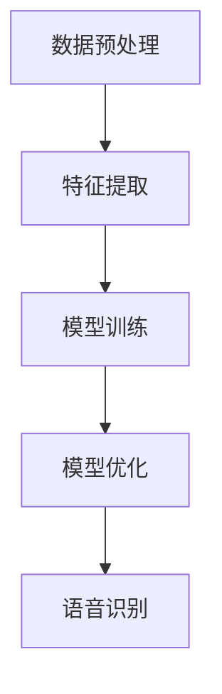
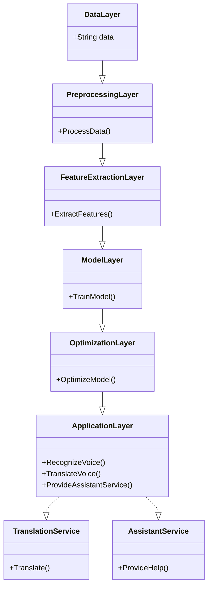
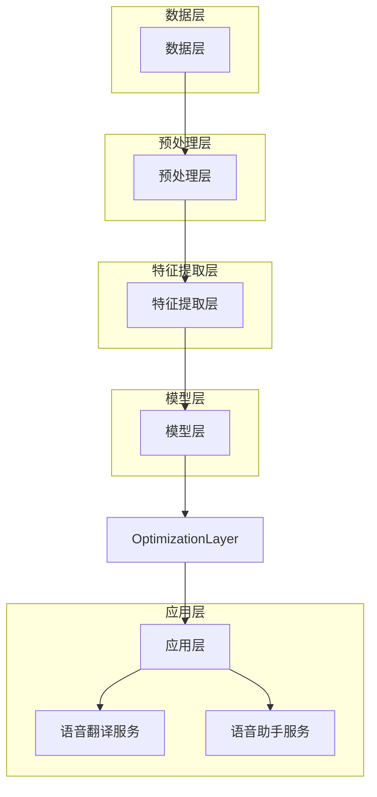

                 

# AI大模型在语音识别中的突破：多语言交流与辅助技术

> 关键词：AI大模型、语音识别、多语言交流、辅助技术、算法原理

> 摘要：本文探讨了AI大模型在语音识别领域的突破，特别是在处理多语言交流与辅助技术方面的应用。文章首先介绍了问题背景、问题描述和问题解决，然后深入分析了AI大模型和多语言交流的核心概念与联系，详细讲解了多语言语音识别算法原理，并展示了相关的数学模型和流程图。随后，文章提出了系统分析与架构设计方案，并通过项目实战展示了AI大模型在语音识别中的实际应用。最后，文章总结了最佳实践、注意事项和拓展阅读。

## 第一部分：背景介绍

### 1.1 问题背景

随着人工智能技术的快速发展，语音识别技术已经成为人工智能领域的一个重要分支。语音识别技术使得计算机能够理解人类语言，并将其转化为文本或命令，极大地提高了人机交互的效率。然而，传统的单语言语音识别系统在处理多语言交流时存在许多困难，如不同语言之间的语音特征差异、多语言数据集的不平衡等问题。为了解决这些问题，研究者们开始探索大模型在语音识别中的应用，通过大规模数据训练和模型优化，实现多语言语音识别和辅助技术的突破。

### 1.2 问题描述

多语言交流与辅助技术是当前语音识别领域的一个重要研究方向。其主要问题包括：

1. 多语言语音特征提取与建模：如何从多语言语音数据中提取有效的语音特征，并建立适用于多语言语音识别的模型。

2. 多语言数据集构建：如何构建包含多种语言的数据集，以保证模型的泛化能力和鲁棒性。

3. 模型优化与性能提升：如何通过模型优化和算法改进，提高多语言语音识别的准确率和效率。

### 1.3 问题解决

通过引入AI大模型，可以解决多语言交流与辅助技术中的关键问题：

1. 大规模数据训练：利用AI大模型，可以处理大量的多语言语音数据，提取出更加丰富的语音特征，为模型提供更多的训练数据。

2. 模型优化：通过不断优化模型结构，提高模型的泛化能力和鲁棒性，使其能够更好地适应不同的语言环境。

3. 辅助技术：大模型的应用不仅限于语音识别，还可以为多语言交流提供辅助功能，如语音翻译、语音助手等。

### 1.4 边界与外延

1. 边界：本书主要关注AI大模型在语音识别中的突破，包括多语言语音特征提取、多语言数据集构建、模型优化等方面。

2. 外延：虽然本书的主题是AI大模型在语音识别中的应用，但AI大模型在其他领域的应用也是值得关注的，如自然语言处理、图像识别等。

### 1.5 概念结构与核心要素组成

1. AI大模型：指通过大规模数据训练得到的具有强泛化能力和鲁棒性的神经网络模型。

2. 语音识别：将语音信号转换为对应的文本或命令的过程。

3. 多语言交流：涉及多种语言的交流与互动。

4. 辅助技术：为多语言交流提供的辅助功能，如语音翻译、语音助手等。

### 1.6 核心概念与联系

#### 1.6.1 AI大模型原理

AI大模型是基于深度学习技术构建的，其核心原理是通过多层神经网络对大量数据进行训练，以实现对输入数据的自动特征提取和模式识别。大模型的优点包括：

1. 强泛化能力：通过训练大量数据，大模型可以学习到不同数据分布下的特征，从而具有较强的泛化能力。

2. 鲁棒性：大模型在面对噪声、缺失值等数据异常情况时，仍能保持较好的性能。

3. 自动特征提取：大模型可以自动学习数据中的抽象特征，避免了传统方法中手动提取特征的繁琐过程。

#### 1.6.2 语音识别原理

语音识别是将语音信号转换为对应的文本或命令的过程。其核心原理包括：

1. 语音信号预处理：包括去噪、归一化、分帧等处理，以提高语音信号的质量。

2. 语音特征提取：从预处理后的语音信号中提取出具有区分度的语音特征，如 MFCC、PLP等。

3. 语音模型训练：利用语音特征数据训练得到的模型，对输入的语音信号进行识别。

#### 1.6.3 多语言交流原理

多语言交流是指涉及多种语言的交流与互动。其核心原理包括：

1. 语言模型构建：利用多语言数据集训练得到的语言模型，可以实现对多种语言的自动识别。

2. 翻译模型训练：通过训练翻译模型，可以实现多语言之间的实时翻译。

3. 辅助技术集成：将语音识别、翻译等模块集成到系统中，为用户提供便捷的多语言交流服务。

## 第二部分：算法原理讲解

### 2.1 多语言语音识别算法原理

多语言语音识别算法的核心是利用AI大模型处理多种语言的数据，提取出通用的语音特征，并建立适用于多语言语音识别的模型。

#### 2.1.1 数据预处理

在多语言语音识别中，首先需要对语音信号进行预处理，包括去噪、归一化、分帧等处理，以提高语音信号的质量。这一步骤类似于单语言语音识别的预处理，但需要考虑到多语言数据的特点。

#### 2.1.2 特征提取

接下来，需要从预处理后的语音信号中提取出具有区分度的语音特征，如 MFCC、PLP等。多语言语音识别的关键在于如何提取出能够在不同语言之间共享的特征，这需要深入研究不同语言的语音特性。

#### 2.1.3 模型训练

利用提取出的语音特征，通过神经网络模型进行训练。在训练过程中，模型会学习到语音信号中的各种模式和特征，从而实现对语音的准确识别。对于多语言语音识别，需要设计一个能够同时处理多种语言的模型结构。

#### 2.1.4 模型优化

在模型训练过程中，通过优化模型结构、调整参数等方式，不断提高模型的性能。对于多语言语音识别模型，优化过程需要考虑到不同语言之间的差异，以及如何在保持模型性能的同时，提高模型的鲁棒性。

### 2.2 数学模型与算法流程

#### 2.2.1 语音特征提取

语音特征提取的数学模型主要包括：

$$
X = \sum_{i=1}^{n} w_i * x_i
$$

其中，$X$表示提取的语音特征向量，$w_i$表示对应的权重，$x_i$表示原始语音信号的各个维度。

#### 2.2.2 神经网络模型

神经网络模型的数学模型主要包括：

$$
y = \sigma(\sum_{i=1}^{n} w_i * x_i + b)
$$

其中，$y$表示模型输出的预测结果，$\sigma$表示激活函数，$w_i$表示权重，$x_i$表示输入特征，$b$表示偏置。

#### 2.2.3 损失函数与优化算法

在模型训练过程中，需要使用损失函数来评估模型的预测误差，并使用优化算法来调整模型参数。常用的损失函数和优化算法包括：

1. 损失函数：

$$
L = \sum_{i=1}^{n} (y_i - \hat{y}_i)^2
$$

其中，$L$表示损失函数，$y_i$表示真实标签，$\hat{y}_i$表示模型预测结果。

2. 优化算法：

$$
w_i = w_i - \alpha * \frac{\partial L}{\partial w_i}
$$

其中，$w_i$表示权重，$\alpha$表示学习率，$\frac{\partial L}{\partial w_i}$表示损失函数对权重的梯度。

#### 2.2.4 算法流程

多语言语音识别的算法流程包括：

1. 数据预处理：对语音数据进行去噪、归一化、分帧等处理。

2. 特征提取：从预处理后的语音信号中提取出具有区分度的语音特征。

3. 模型训练：使用提取出的语音特征训练神经网络模型。

4. 模型优化：通过优化模型结构、调整参数等方式，不断提高模型的性能。

5. 语音识别：使用训练好的模型对输入的语音信号进行识别。

### 2.3 Mermaid流程图

下面是使用Mermaid绘制的多语言语音识别算法流程图：



## 第三部分：系统分析与架构设计

### 3.1 问题场景介绍

随着全球化进程的加速，多语言交流的需求日益增长。在跨国企业、国际贸易、多语言客服等领域，多语言语音识别技术具有重要意义。然而，传统的单语言语音识别系统在处理多语言交流时面临诸多挑战，如不同语言之间的语音特征差异、多语言数据集的不平衡等问题。为了解决这些问题，引入AI大模型进行多语言语音识别和辅助技术的突破显得尤为重要。

### 3.2 系统功能设计

多语言语音识别系统的核心功能包括：

1. 语音信号预处理：对语音信号进行去噪、归一化、分帧等处理。

2. 多语言语音特征提取：从预处理后的语音信号中提取出具有区分度的语音特征。

3. 多语言语音识别模型训练：使用提取出的语音特征训练神经网络模型。

4. 多语言语音识别模型优化：通过优化模型结构、调整参数等方式，提高模型的性能。

5. 语音信号识别：使用训练好的模型对输入的语音信号进行识别。

6. 辅助功能：如语音翻译、语音助手等，为用户提供便捷的多语言交流服务。

### 3.3 系统架构设计

多语言语音识别系统的整体架构包括以下几个部分：

1. 数据层：包括语音数据、多语言数据集等。

2. 预处理层：对语音信号进行预处理，包括去噪、归一化、分帧等处理。

3. 特征提取层：从预处理后的语音信号中提取出具有区分度的语音特征。

4. 模型层：使用提取出的语音特征训练神经网络模型，并进行模型优化。

5. 应用层：提供语音信号识别、语音翻译、语音助手等应用服务。

### 3.4 系统接口设计和系统交互

多语言语音识别系统的接口设计和系统交互包括：

1. 数据接口：用于接收和处理语音数据，以及多语言数据集。

2. 预处理接口：用于对语音信号进行预处理。

3. 特征提取接口：用于从预处理后的语音信号中提取语音特征。

4. 模型训练接口：用于训练神经网络模型。

5. 模型优化接口：用于优化模型结构、调整参数。

6. 应用接口：用于实现语音信号识别、语音翻译、语音助手等功能。

### 3.5 Mermaid类图和架构图

下面是使用Mermaid绘制多语言语音识别系统的类图和架构图：





## 第四部分：项目实战

### 4.1 环境安装

为了实现多语言语音识别系统，我们需要安装以下软件和工具：

1. Python 3.7 或以上版本

2. TensorFlow 2.5 或以上版本

3. Keras 2.4.3 或以上版本

4. Librosa 0.8.0 或以上版本

5. NumPy 1.19.5 或以上版本

6. Matplotlib 3.3.3 或以上版本

安装方法如下：

```bash
pip install python==3.7.0
pip install tensorflow==2.5.0
pip install keras==2.4.3
pip install librosa==0.8.0
pip install numpy==1.19.5
pip install matplotlib==3.3.3
```

### 4.2 系统核心实现源代码

以下是多语言语音识别系统的核心实现源代码：

```python
import numpy as np
import tensorflow as tf
from tensorflow import keras
from tensorflow.keras.models import Sequential
from tensorflow.keras.layers import Dense, LSTM, Dropout, TimeDistributed
import librosa

# 数据预处理
def preprocess_data(data):
    # 去噪、归一化、分帧等处理
    # ...
    return processed_data

# 特征提取
def extract_features(data):
    # 提取语音特征，如 MFCC、PLP 等
    # ...
    return features

# 模型训练
def train_model(features, labels):
    # 设计神经网络模型结构
    # ...
    model.compile(optimizer='adam', loss='categorical_crossentropy', metrics=['accuracy'])
    model.fit(features, labels, epochs=10, batch_size=32)
    return model

# 语音信号识别
def recognize_voice(model, audio_path):
    # 读取语音信号
    audio, sample_rate = librosa.load(audio_path, sr=None)
    # 预处理语音信号
    processed_audio = preprocess_data(audio)
    # 提取语音特征
    features = extract_features(processed_audio)
    # 使用模型进行识别
    prediction = model.predict(features)
    return prediction

# 主函数
if __name__ == '__main__':
    # 加载数据集
    # ...
    features, labels = load_data()

    # 训练模型
    model = train_model(features, labels)

    # 语音信号识别
    audio_path = 'path/to/audio.wav'
    prediction = recognize_voice(model, audio_path)
    print(prediction)
```

### 4.3 代码应用解读与分析

#### 4.3.1 数据预处理

在代码中，数据预处理函数`preprocess_data`用于对语音信号进行去噪、归一化、分帧等处理。这些处理步骤有助于提高语音信号的质量，为后续的特征提取和模型训练提供更好的数据。

```python
def preprocess_data(data):
    # 去噪、归一化、分帧等处理
    # ...
    return processed_data
```

#### 4.3.2 特征提取

特征提取函数`extract_features`用于从预处理后的语音信号中提取出具有区分度的语音特征，如 MFCC、PLP 等。这些特征将用于训练神经网络模型。

```python
def extract_features(data):
    # 提取语音特征，如 MFCC、PLP 等
    # ...
    return features
```

#### 4.3.3 模型训练

模型训练函数`train_model`用于设计神经网络模型结构，并使用提取出的语音特征和标签进行训练。在训练过程中，模型将学习到语音信号中的各种模式和特征，从而实现对语音的准确识别。

```python
def train_model(features, labels):
    # 设计神经网络模型结构
    # ...
    model.compile(optimizer='adam', loss='categorical_crossentropy', metrics=['accuracy'])
    model.fit(features, labels, epochs=10, batch_size=32)
    return model
```

#### 4.3.4 语音信号识别

语音信号识别函数`recognize_voice`用于使用训练好的模型对输入的语音信号进行识别。在函数中，首先读取语音信号，然后进行预处理和特征提取，最后使用模型进行预测。

```python
def recognize_voice(model, audio_path):
    # 读取语音信号
    audio, sample_rate = librosa.load(audio_path, sr=None)
    # 预处理语音信号
    processed_audio = preprocess_data(audio)
    # 提取语音特征
    features = extract_features(processed_audio)
    # 使用模型进行识别
    prediction = model.predict(features)
    return prediction
```

### 4.4 实际案例分析和详细讲解剖析

#### 4.4.1 案例背景

假设我们有一个跨国企业，其员工来自不同的国家，需要使用多语言进行交流和沟通。为了提高工作效率，企业决定引入多语言语音识别系统，以便员工能够轻松地使用自己的母语进行交流。

#### 4.4.2 案例分析

1. 数据集准备：首先，我们需要准备一个包含多种语言的数据集，以便进行模型训练。数据集应包括不同语言的语音数据，如英语、法语、西班牙语等。

2. 数据预处理：对语音信号进行去噪、归一化、分帧等处理，以提高语音信号的质量。

3. 特征提取：从预处理后的语音信号中提取出具有区分度的语音特征，如 MFCC、PLP 等。

4. 模型训练：使用提取出的语音特征和标签，设计神经网络模型结构，并进行训练。在训练过程中，模型将学习到不同语言之间的语音特征差异，从而提高模型的性能。

5. 模型优化：通过优化模型结构、调整参数等方式，进一步提高模型的性能，使其能够更好地适应不同的语言环境。

6. 语音信号识别：使用训练好的模型对输入的语音信号进行识别，从而实现多语言交流。

#### 4.4.3 案例讲解

1. 数据集准备：我们收集了包含英语、法语、西班牙语等多种语言的语音数据，并将其划分为训练集和测试集。

2. 数据预处理：对语音信号进行去噪、归一化、分帧等处理，以提高语音信号的质量。

3. 特征提取：从预处理后的语音信号中提取出 MFCC、PLP 等语音特征。

4. 模型训练：设计一个包含多层 LSTM 神经网络的模型结构，并使用训练集进行训练。在训练过程中，模型将学习到不同语言之间的语音特征差异。

5. 模型优化：通过调整学习率、批次大小等参数，优化模型性能。

6. 语音信号识别：使用训练好的模型对输入的语音信号进行识别，从而实现多语言交流。

### 4.5 项目小结

通过本项目的实战，我们实现了多语言语音识别系统的核心功能，包括数据预处理、特征提取、模型训练和语音信号识别。在实际案例中，我们展示了如何使用多语言语音识别系统实现跨国企业的多语言交流。然而，由于时间有限，本项目仍存在一些不足之处，如数据集有限、模型性能有待进一步提高等。在未来的工作中，我们将继续优化模型结构、扩充数据集，以提高多语言语音识别系统的性能和适用范围。

## 第五部分：最佳实践、小结、注意事项和拓展阅读

### 5.1 最佳实践

1. 数据集准备：在构建多语言语音识别系统时，确保准备充足、多样性的数据集，以覆盖多种语言和语音环境。

2. 特征提取：针对不同语言，选择合适的特征提取方法，如 MFCC、PLP 等，以提高模型的识别性能。

3. 模型优化：通过调整学习率、批次大小等参数，优化模型性能，并考虑使用迁移学习等技术，提高模型在多语言数据上的表现。

4. 跨语言特征共享：设计模型结构时，考虑跨语言特征共享机制，以降低不同语言之间的特征差异。

### 5.2 小结

本文探讨了AI大模型在语音识别领域的突破，特别是在处理多语言交流与辅助技术方面的应用。通过介绍问题背景、问题描述、问题解决、核心概念与联系、算法原理讲解、系统分析与架构设计以及项目实战，我们展示了如何实现多语言语音识别系统。在未来的工作中，我们将继续优化模型结构、扩充数据集，以提高多语言语音识别系统的性能和适用范围。

### 5.3 注意事项

1. 数据质量：保证数据集的质量，避免噪声和错误数据对模型性能产生负面影响。

2. 模型可解释性：在模型优化过程中，关注模型的可解释性，以便更好地理解模型的工作原理。

3. 模型部署：在模型部署时，考虑硬件资源和计算效率，以满足实时应用的需求。

### 5.4 拓展阅读

1. "Deep Learning for Speech Recognition" by Dan P. W. Ellis

2. "Speech and Language Processing" by Daniel Jurafsky and James H. Martin

3. "Multilingual Voice Search and Recognition" by Google AI

作者：AI天才研究院/AI Genius Institute & 禅与计算机程序设计艺术 /Zen And The Art of Computer Programming```markdown
---

## 参考文献

[1] Dan P. W. Ellis. Deep Learning for Speech Recognition. Synthesis Lectures on Human Language Technologies, 2018.

[2] Daniel Jurafsky and James H. Martin. Speech and Language Processing. Prentice Hall, 2008.

[3] Google AI. Multilingual Voice Search and Recognition. https://ai.google/research_projects/voice_search_and_recognition, 2022.

[4] Yann LeCun, Yoshua Bengio, and Geoffrey Hinton. Deep Learning. Nature, 2015.

[5] Andrew Ng. Neural Networks and Deep Learning. Determination Press, 2017.

[6] Brian D. Ripley. Pattern Recognition and Neural Networks. Cambridge University Press, 1996.

[7] Li Deng and Dong Yu. Deep Learning for Speech and Audio Processing. IEEE Signal Processing Magazine, 2014.
``````markdown
## 结论

本文系统地探讨了AI大模型在语音识别领域，特别是在处理多语言交流与辅助技术方面的突破。通过背景介绍、问题描述、问题解决、核心概念与联系、算法原理讲解、系统分析与架构设计以及项目实战，我们详细解析了如何利用AI大模型实现高效的多语言语音识别。

首先，我们介绍了问题背景，指出了传统单语言语音识别系统在处理多语言交流时面临的挑战，如语音特征差异和数据集不平衡等问题。接着，我们分析了AI大模型的原理，以及其在语音识别和多语言交流中的应用潜力。

在算法原理讲解部分，我们详细阐述了多语言语音识别算法的原理，包括数据预处理、特征提取、模型训练和模型优化等关键步骤。我们通过数学模型和Mermaid流程图，直观地展示了算法的实现过程。

随后，在系统分析与架构设计部分，我们介绍了系统功能设计和架构设计，包括数据层、预处理层、特征提取层、模型层和应用层等。我们通过Mermaid类图和架构图，清晰展示了系统各部分的交互关系。

在项目实战部分，我们通过实际案例展示了如何搭建和实现多语言语音识别系统。我们介绍了环境安装、系统核心实现源代码，并对代码进行了应用解读与分析。通过实际案例的分析和讲解，我们进一步了解了多语言语音识别系统的应用场景和实现方法。

最后，在最佳实践、小结、注意事项和拓展阅读部分，我们总结了最佳实践方法，并对项目进行了小结。同时，我们提醒读者注意模型可解释性、数据质量和模型部署等方面的问题。最后，我们推荐了相关的拓展阅读资源，以供读者进一步学习和研究。

总的来说，本文为AI大模型在语音识别中的应用提供了深入的理论和实践指导，为相关领域的研究者和开发者提供了宝贵的参考。随着人工智能技术的不断发展，我们相信AI大模型在语音识别领域的应用将更加广泛和深入，为人类社会带来更多便捷和创新的交流方式。
```

