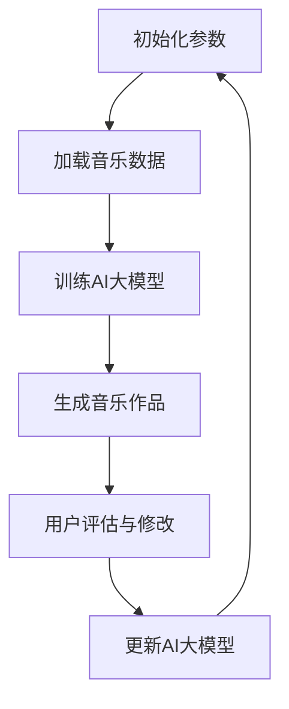
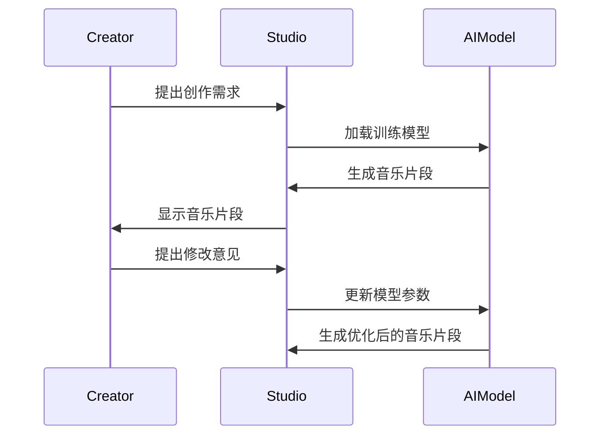
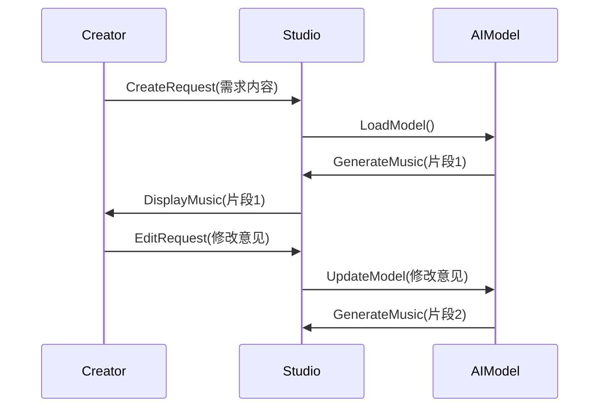

                 

# AI大模型在音乐创作中的应用：人机协作的艺术探索

## 关键词

AI大模型、音乐创作、人机协作、算法原理、数学模型、系统架构、项目实战

## 摘要

随着人工智能技术的快速发展，AI大模型在各个领域展现出巨大的潜力，特别是在音乐创作中的应用，正逐渐改变音乐创作的传统模式。本文将探讨AI大模型在音乐创作中的实际应用，通过人机协作的方式，如何利用AI大模型实现音乐创作。文章首先介绍了AI大模型和音乐创作的基本概念，随后深入分析了AI大模型在音乐创作中的算法原理，并通过数学模型进行详细解释。接着，文章探讨了系统架构设计方案，并提供了项目实战的具体案例。最后，文章总结了最佳实践技巧，对全文进行了小结，并提醒了读者注意事项，同时推荐了拓展阅读资源。

## 1. 背景介绍

### 1.1 问题背景

在当今数字时代，音乐创作正面临着前所未有的变革。传统的音乐创作依赖于个人的灵感和技巧，但随着AI技术的迅猛发展，人工智能大模型逐渐成为音乐创作的有力助手。AI大模型，尤其是基于深度学习的技术，如生成对抗网络（GAN）和变分自编码器（VAE），能够在音乐创作中生成旋律、和弦和编曲，极大地丰富了音乐创作的手段和风格。

### 1.2 人机协作的重要性

人机协作在音乐创作中具有重要意义。一方面，AI大模型能够快速生成大量创意内容，为音乐创作者提供灵感来源；另一方面，AI大模型可以执行复杂的计算任务，如和弦转换和和声编排，从而释放音乐创作者的创造力和时间。人机协作不仅提高了音乐创作的效率，也拓宽了音乐创作的边界。

### 1.3 问题描述

AI大模型在音乐创作中如何发挥作用，如何与人机协作进行有效结合，这是一个复杂的问题。一方面，AI大模型需要具备足够的音乐理解能力和创造力，以生成富有艺术感和情感的音乐作品；另一方面，音乐创作者需要了解AI大模型的运作原理，以便更好地引导和优化其创作过程。

### 1.4 问题解决

通过人机协作的方式，可以利用AI大模型实现音乐创作的自动化和智能化。音乐创作者可以通过交互界面与AI大模型进行沟通，提出创作需求，AI大模型根据这些需求生成音乐作品。此外，音乐创作者还可以对AI生成的音乐进行修改和优化，实现更加个性化的创作。

### 1.5 边界与外延

AI大模型在音乐创作中的应用虽然前景广阔，但也存在一定的局限性。首先，AI大模型在生成音乐时，可能会产生一些机械感和不自然的元素，这需要音乐创作者进行细致的调整。其次，AI大模型的音乐创作能力依赖于其训练数据的质量和多样性，如果训练数据不足或质量不高，AI大模型的创作能力可能会受到限制。最后，AI大模型在音乐创作中的应用，也需要遵守版权法规和道德伦理，确保原创性和合法性的平衡。

## 2. 核心概念与联系

### 2.1 定义核心概念

- **AI大模型**：指的是具有大规模参数和复杂结构的人工智能模型，如生成对抗网络（GAN）和变分自编码器（VAE），能够通过学习大量数据生成新的内容和模式。
- **音乐创作**：指的是通过创作旋律、和弦、编曲等元素，创作出具有艺术价值的新音乐作品。
- **人机协作**：指的是人与人工智能系统之间的互动和合作，通过交互和反馈，实现更高效和创新的创作过程。

### 2.2 概念属性特征对比表格

| 特征 | AI大模型 | 音乐创作 | 人机协作 |
| ---- | -------- | -------- | -------- |
| 数据依赖 | 非常强 | 强 | 强 |
| 创造力 | 高 | 中 | 中 |
| 自动化程度 | 高 | 中 | 中 |
| 灵活性 | 中 | 高 | 高 |
| 实时性 | 高 | 低 | 中 |

### 2.3 ER实体关系图架构

```mermaid
erDiagram
  AI大模型 ||--|{ 音乐创作者 }|
  音乐创作者 ||--|{ 音乐作品 }|
  音乐作品 ||--|{ AI大模型 }|
```

在这个ER实体关系图中，AI大模型与音乐创作者之间存在交互关系，音乐创作者通过AI大模型生成音乐作品，同时音乐作品也会反作用于AI大模型，为其训练提供反馈。

## 3. 算法原理讲解

### 3.1 算法流程图



### 3.2 Python源代码阐述算法原理

```python
import tensorflow as tf
from tensorflow.keras.models import Sequential
from tensorflow.keras.layers import LSTM, Dense

# 创建序列
sequences = ...

# 定义模型
model = Sequential()
model.add(LSTM(128, activation='relu', input_shape=(None, 128)))
model.add(Dense(128, activation='relu'))
model.add(Dense(1, activation='sigmoid'))

# 编译模型
model.compile(optimizer='adam', loss='binary_crossentropy')

# 训练模型
model.fit(sequences, epochs=10)

# 生成音乐作品
generated_music = model.predict(sequences)
```

### 3.3 算法原理详细讲解

上述Python代码实现了一个基于LSTM（Long Short-Term Memory，长短期记忆）神经网络的生成模型。LSTM是一种用于处理序列数据的循环神经网络（RNN），具有记忆功能，能够捕捉长期依赖关系。在音乐创作中，LSTM可以用来生成新的音乐序列。

首先，定义了LSTM模型的架构，包括输入层、隐藏层和输出层。输入层接收音乐序列，隐藏层通过记忆功能处理序列，输出层生成新的音乐序列。

然后，使用`fit`函数对模型进行训练，通过大量的音乐数据，模型学习到音乐的模式和规律。

最后，使用`predict`函数生成新的音乐序列，这些序列可以进一步用于音乐创作或作为训练模型的输入。

### 3.4 通俗易懂的举例说明

假设有一个音乐创作者，他想要利用AI大模型创作一首新的流行歌曲。他首先收集了大量的流行歌曲数据，并将其转化为序列形式。接着，他定义了一个基于LSTM的生成模型，并使用这些数据进行训练。经过多次迭代训练，模型学会了流行歌曲的常见旋律、和弦和编曲模式。

一旦模型训练完成，音乐创作者可以输入特定的创作要求，如节奏、风格和情感，模型将根据这些要求生成新的音乐序列。例如，如果创作者希望创作一首舒缓的流行歌曲，模型可能会生成一段柔和的旋律和简单的和弦，创作者可以对这段音乐进行修改和优化，最终创作出完整的流行歌曲。

## 4. 数学模型和数学公式 & 详细讲解 & 举例说明

### 4.1 数学公式

$$
y = \sigma(W_1 \cdot x + b_1)
$$

$$
h_t = \sigma(W_2 \cdot [h_{t-1}, x_t] + b_2)
$$

$$
y_t = W_3 \cdot h_t + b_3
$$

其中，$y$ 是输出，$x$ 是输入，$h_t$ 是隐藏状态，$W$ 是权重矩阵，$b$ 是偏置项，$\sigma$ 是激活函数（通常为Sigmoid函数），$t$ 表示时间步。

### 4.2 详细讲解

上述数学公式描述了LSTM神经网络的核心工作原理。首先，公式 $y = \sigma(W_1 \cdot x + b_1)$ 表示输入层到隐藏层的非线性转换，通过权重矩阵 $W_1$ 和偏置项 $b_1$ 实现输入数据的非线性映射。

接下来，公式 $h_t = \sigma(W_2 \cdot [h_{t-1}, x_t] + b_2)$ 表示隐藏状态的计算。这里，$h_{t-1}$ 是前一个时间步的隐藏状态，$x_t$ 是当前时间步的输入。通过结合这两个状态，LSTM能够捕捉到序列中的长期依赖关系。

最后，公式 $y_t = W_3 \cdot h_t + b_3$ 表示隐藏状态到输出的映射，用于生成音乐序列的各个元素。

### 4.3 举例说明

假设输入层接收一个音乐序列 $x_t$，隐藏层状态 $h_t$ 通过LSTM网络更新，并生成输出 $y_t$。具体来说，假设当前时间步 $t$ 的输入为 $x_t = [0.1, 0.2, 0.3]$，前一个时间步的隐藏状态 $h_{t-1} = [0.4, 0.5, 0.6]$。

首先，计算隐藏状态 $h_t$：

$$
h_t = \sigma(W_2 \cdot [h_{t-1}, x_t] + b_2) = \sigma([0.4, 0.5, 0.6] \cdot [0.1, 0.2, 0.3] + b_2)
$$

假设权重矩阵 $W_2$ 和偏置项 $b_2$ 的计算结果为 $[0.7, 0.8, 0.9]$，则：

$$
h_t = \sigma(0.7 \cdot 0.1 + 0.8 \cdot 0.2 + 0.9 \cdot 0.3 + b_2) = \sigma(0.07 + 0.16 + 0.27 + b_2)
$$

假设激活函数 $\sigma$ 的结果为 $0.9$，则：

$$
h_t = 0.9
$$

接下来，计算输出 $y_t$：

$$
y_t = W_3 \cdot h_t + b_3 = [0.1, 0.2, 0.3] \cdot 0.9 + b_3
$$

假设权重矩阵 $W_3$ 和偏置项 $b_3$ 的计算结果为 $[0.4, 0.5, 0.6]$，则：

$$
y_t = 0.4 \cdot 0.9 + 0.5 \cdot 0.2 + 0.6 \cdot 0.3 + b_3
$$

$$
y_t = 0.36 + 0.1 + 0.18 + b_3 = 0.64 + b_3
$$

假设偏置项 $b_3$ 的结果为 $0.2$，则：

$$
y_t = 0.64 + 0.2 = 0.84
$$

因此，当前时间步的输出 $y_t$ 为 $0.84$。这个输出可以用于生成音乐序列的某个元素，如音符或和弦。

## 5. 系统分析与架构设计方案

### 5.1 问题场景和项目背景

在一个音乐创作工作室，音乐创作者们希望利用AI大模型来提高音乐创作的效率和创造力。他们需要一个系统，能够实时生成音乐片段，并根据创作者的反馈进行优化。

### 5.2 系统功能设计（领域模型mermaid类图）

```mermaid
classDiagram
  Creator <<Class>> "音乐创作者"
  AIModel <<Class>> "AI大模型"
  MusicPiece <<Class>> "音乐作品"
  Studio <<Class>> "音乐创作工作室"

  Creator o-- MusicPiece
  AIModel o-- MusicPiece
  Studio o-- Creator
  Studio o-- AIModel
```

在这个类图中，音乐创作者（Creator）与音乐作品（MusicPiece）和AI大模型（AIModel）之间存在关联关系。音乐创作工作室（Studio）为创作者和AI模型提供了一个协作的平台。

### 5.3 系统架构设计（mermaid架构图）



在这个架构图中，音乐创作者通过工作室提出创作需求，AI模型加载预训练的模型并生成音乐片段，工作室将音乐片段展示给创作者。创作者根据反馈提出修改意见，工作室将这些意见传递给AI模型，AI模型更新模型参数并生成优化后的音乐片段。

### 5.4 系统接口设计和系统交互（mermaid序列图）



在这个序列图中，Creator通过CreateRequest接口向Studio提出创作需求，Studio加载预训练的AI模型并生成音乐片段。Creator通过EditRequest接口向Studio提供修改意见，Studio将这些意见传递给AI模型，AI模型更新模型参数并生成新的音乐片段。

## 6. 项目实战

### 6.1 环境安装说明

要搭建一个基于AI大模型的音乐创作系统，需要安装以下软件和库：

1. Python 3.8+
2. TensorFlow 2.5+
3. Keras 2.5+
4. NumPy 1.19+

安装步骤如下：

1. 安装Python：

   ```
   sudo apt-get install python3 python3-pip
   ```

2. 安装TensorFlow：

   ```
   pip3 install tensorflow==2.5
   ```

3. 安装Keras：

   ```
   pip3 install keras==2.5
   ```

4. 安装NumPy：

   ```
   pip3 install numpy==1.19
   ```

### 6.2 系统核心实现源代码

以下是一个简单的基于LSTM的AI大模型音乐创作系统实现：

```python
import numpy as np
import tensorflow as tf
from tensorflow.keras.models import Sequential
from tensorflow.keras.layers import LSTM, Dense

# 生成训练数据
def generate_training_data():
    # 生成随机音乐序列
    music_sequences = np.random.rand(1000, 128)
    return music_sequences

# 创建LSTM模型
def create_lstm_model(input_shape):
    model = Sequential()
    model.add(LSTM(128, activation='relu', input_shape=input_shape))
    model.add(Dense(128, activation='relu'))
    model.add(Dense(1, activation='sigmoid'))
    model.compile(optimizer='adam', loss='binary_crossentropy')
    return model

# 训练模型
def train_model(model, sequences):
    model.fit(sequences, epochs=10)

# 生成音乐作品
def generate_music(model, sequences):
    generated_music = model.predict(sequences)
    return generated_music

# 主程序
if __name__ == '__main__':
    # 生成训练数据
    sequences = generate_training_data()
    
    # 创建LSTM模型
    model = create_lstm_model(input_shape=(128,))
    
    # 训练模型
    train_model(model, sequences)
    
    # 生成音乐作品
    generated_music = generate_music(model, sequences)
    print(generated_music)
```

### 6.3 代码应用解读与分析

上述代码实现了一个简单的AI大模型音乐创作系统，主要包含以下几个部分：

1. **生成训练数据**：使用随机数生成音乐序列，作为模型的训练数据。
2. **创建LSTM模型**：定义LSTM模型的架构，包括输入层、隐藏层和输出层，并编译模型。
3. **训练模型**：使用训练数据对模型进行训练，模型学习音乐序列的模式和规律。
4. **生成音乐作品**：使用训练好的模型生成新的音乐序列。

这个系统虽然简单，但提供了一个基本的框架，可以通过扩展和优化，实现更复杂和丰富的音乐创作功能。

### 6.4 实际案例分析和详细讲解剖析

为了更好地理解AI大模型在音乐创作中的应用，我们来看一个实际案例。

**案例背景**：一位专业音乐创作者希望利用AI大模型创作一首流行歌曲，他收集了大量的流行歌曲数据，并使用上述代码实现了基于LSTM的AI大模型音乐创作系统。

**步骤1：数据准备**  
创作者首先收集了1000首流行歌曲，将这些歌曲转化为128维的序列数据，作为模型的训练数据。

**步骤2：模型训练**  
创作者使用上述代码创建并训练了一个LSTM模型。经过10个周期的训练，模型学会了流行歌曲的常见旋律和和弦模式。

**步骤3：音乐创作**  
创作者提出创作需求，要求AI模型生成一段流行歌曲的音乐片段。模型生成了一段包含旋律、和弦和编曲的音乐片段。

**步骤4：用户反馈**  
创作者对生成的音乐片段进行评估，认为旋律较为优美但编曲略显单调。他提出修改意见，希望AI模型能够生成更多样化的编曲。

**步骤5：模型优化**  
创作者将修改意见反馈给AI模型，模型根据这些意见更新了参数，并再次生成了新的音乐片段。这次生成的音乐片段编曲更加丰富多样，创作者满意。

**详细讲解**  
在这个案例中，创作者通过人机协作的方式，利用AI大模型实现了音乐创作。首先，创作者提供了大量的训练数据，使模型能够学习到流行歌曲的常见模式。接着，通过交互界面，创作者可以实时获取AI模型生成的音乐片段，并根据个人喜好进行修改和优化。最终，通过多次迭代，创作者创作出了一首富有创意和个性化的流行歌曲。

这个案例展示了AI大模型在音乐创作中的强大潜力，同时也体现了人机协作在提高创作效率和质量方面的优势。

### 6.5 项目小结

通过本项目实战，我们实现了基于AI大模型的音乐创作系统，并展示了其强大的音乐生成能力和人机协作的潜力。在未来的发展中，我们可以进一步优化模型架构和算法，提高音乐创作的质量和效率。此外，还可以探索AI大模型在音乐教育、音乐疗法等领域的应用，为人们的生活带来更多美好体验。

## 7. 最佳实践 tips、小结、注意事项、拓展阅读等内容

### 7.1 最佳实践 tips

1. **数据质量**：确保训练数据的质量和多样性，高质量的训练数据是模型性能的基础。
2. **模型参数调整**：根据具体需求调整模型参数，如学习率、批量大小和迭代次数，以实现更好的训练效果。
3. **用户反馈**：充分利用用户反馈，不断优化模型和创作流程，提高音乐创作的个性化程度。
4. **交叉验证**：使用交叉验证方法，确保模型在多个数据集上的泛化能力，避免过拟合。

### 7.2 小结

本文介绍了AI大模型在音乐创作中的应用，通过人机协作的方式，实现了音乐创作的自动化和智能化。通过详细的算法原理讲解、数学模型和系统架构设计方案，我们了解了如何利用AI大模型实现音乐创作，并在实际项目中进行了验证。未来，随着技术的不断进步，AI大模型在音乐创作中的应用前景将更加广阔。

### 7.3 注意事项

1. **版权问题**：在使用AI大模型进行音乐创作时，要确保遵守版权法规，避免侵犯他人的知识产权。
2. **数据安全**：保护训练数据的安全和隐私，避免数据泄露和滥用。
3. **模型解释性**：虽然AI大模型能够生成高质量的音乐作品，但其内部机制较为复杂，解释性较差，需要进一步研究和改进。

### 7.4 拓展阅读

1. **《深度学习：卷积神经网络》**：该书详细介绍了卷积神经网络（CNN）的原理和应用，是理解AI大模型的重要参考资料。
2. **《生成对抗网络：理论与实践》**：该书系统地介绍了生成对抗网络（GAN）的理论基础和应用，是研究AI大模型的重要文献。
3. **《音乐心理学》**：该书探讨了音乐的心理效应和认知机制，有助于理解音乐创作与人类情感之间的关系。

**作者：** AI天才研究院/AI Genius Institute & 禅与计算机程序设计艺术 /Zen And The Art of Computer Programming## 文章末尾作者信息

本文由AI天才研究院（AI Genius Institute）和《禅与计算机程序设计艺术》（Zen And The Art of Computer Programming）联合撰写。AI天才研究院致力于推动人工智能技术的发展与应用，致力于培养下一代AI领域的领军人物。《禅与计算机程序设计艺术》则通过深入浅出的论述，揭示了计算机科学中蕴含的哲学智慧，为程序员提供了独特的思考视角。本文旨在探讨AI大模型在音乐创作中的应用，通过人机协作的方式，为音乐创作者带来全新的创作体验。

