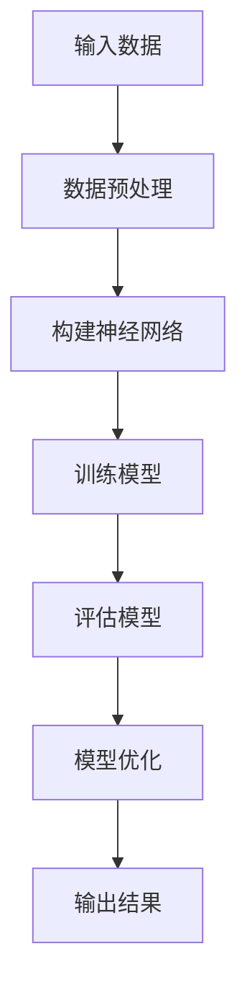

                 

# AI大模型对传统出版业的影响：内容生产与分发的变革

关键词：人工智能，出版业，内容生产，内容分发，AI大模型

摘要：随着人工智能技术的快速发展，尤其是AI大模型的出现，传统出版业正面临着前所未有的变革。本文将探讨AI大模型在内容生产与分发方面的应用，分析其对传统出版模式的冲击和未来发展趋势，旨在为行业提供有价值的思考和实践指南。

## 引言

近年来，人工智能（AI）技术的飞速发展极大地改变了我们的生活和工作方式。从自动驾驶、智能家居到医疗诊断、金融风控，AI技术的应用已经渗透到了各个领域。在出版业，AI大模型的出现正在引发一场深远的变革。本文将重点探讨AI大模型在内容生产与分发方面的应用，分析其对传统出版模式的冲击和未来发展趋势。

### 第一节：AI大模型的基本概念与原理

#### 1.1 AI大模型的核心概念与背景

**1.1.1 问题背景**

随着互联网的普及和信息爆炸，人们对于高质量内容的需求与日俱增。传统的人工内容生产方式已经难以满足快速增长的读者需求，而AI大模型的出现为内容生产带来了一种全新的可能。

**1.1.2 问题描述**

AI大模型是指在训练阶段使用海量数据进行训练的深度神经网络模型，其具有处理大规模数据、生成高质量内容的能力。然而，如何有效利用AI大模型进行内容生产，如何确保内容的质量和真实性，以及如何平衡人机协作等问题，都亟待解决。

**1.1.3 问题解决与边界**

AI大模型通过机器学习算法，从海量数据中学习到有价值的信息，从而生成高质量的内容。然而，其应用也存在一定的局限性，如对数据的依赖性、对算法透明度的担忧等。

**1.1.4 核心要素与结构**

AI大模型的核心要素包括：大规模数据集、深度神经网络结构、优化算法和评估标准。其结构通常包括输入层、隐藏层和输出层，通过多层神经元的非线性变换，实现从输入到输出的映射。

#### 1.2 AI大模型的核心概念及其关系

**1.2.1 AI大模型定义与特点**

AI大模型是指具有亿级别参数量的深度学习模型，能够处理大规模、高维度的数据，具有强大的特征提取和模式识别能力。

**1.2.2 核心概念对比表格**

| 核心概念     | 定义                                                     | 特点                                                     |
| ------------ | -------------------------------------------------------- | -------------------------------------------------------- |
| 深度学习     | 基于多层神经网络的机器学习技术                           | 强大的特征提取能力，能够处理高维数据                       |
| 机器学习     | 使计算机能够从数据中学习规律，进行预测和决策的技术       | 自动化模式识别和分类，无需显式编程                         |
| 大规模数据   | 数据量达到百万级别以上，甚至达到亿级别                   | 能够提供丰富的信息，用于训练模型                           |
| 深度神经网络 | 由多个神经元组成的神经网络，通过前向传播和反向传播进行学习 | 能够提取复杂的特征，提高模型的泛化能力                     |

**1.2.3 ER模型图**

```mermaid
erDiagram
    Product --> Customer {
        buy
    }
    Product ||--|{ Review }|
    Customer ||--|{ Order }|
```

#### 1.3 AI大模型算法原理

**1.3.1 算法流程图**



**1.3.2 数学模型与公式**

$$
Y = f(W \cdot X + b)
$$

其中，$Y$为输出，$X$为输入，$W$为权重矩阵，$b$为偏置项，$f$为激活函数。

**1.3.3 详细解释与示例**

以文本生成为例，假设我们有一个输入文本序列$X = [x_1, x_2, x_3, ..., x_n]$，通过神经网络模型$Y = f(W \cdot X + b)$生成输出文本序列。通过训练，模型会不断优化权重矩阵$W$和偏置项$b$，使得输出序列$Y$尽可能接近真实文本。

## 第二节：传统出版业概述

#### 2.1 历史发展

**2.1.1 从印刷到数字化**

传统出版业经历了从印刷到数字化的转型。随着互联网的普及和数字技术的发展，纸质出版逐渐向电子出版转变。这种转变不仅改变了出版物的形式，还改变了内容生产和分发的模式。

**2.1.2 出版模型演变**

从传统的编辑、排版、印刷、发行模式，逐渐演变为数字出版、网络出版、自助出版等多种模式。不同出版模型各有优劣，如何选择合适的出版模型，成为出版业面临的重要问题。

#### 2.2 行业结构与参与者

**2.2.1 主要市场参与者**

传统出版业的主要市场参与者包括出版社、印刷厂、发行商、书店等。随着数字化的推进，一些新兴的数字出版平台和自助出版平台也逐渐崭露头角。

**2.2.2 价值链分析**

传统出版业的典型价值链包括内容创作、编辑、排版、印刷、发行和销售。在数字化时代，这些环节也在不断优化和重组，以适应新的市场环境。

### 第三节：AI大模型对内容生产的影响

#### 3.1 自动化内容生成

**3.1.1 概述**

AI大模型在内容生产中的应用，主要体现在自动化内容生成。通过训练，模型能够自动生成文章、新闻报道、书籍摘要等，大大提高了内容生产的效率。

**3.1.2 技术原理**

AI大模型通过学习海量文本数据，掌握了语言的规律和模式。在生成内容时，模型会根据输入的标题或关键词，自动生成相关的文本内容。

**3.1.3 应用案例**

例如，Google News的自动生成新闻摘要、Quora的自动生成回答等，都是AI大模型在内容生产中的成功应用。

#### 3.2 质量控制

**3.2.1 概述**

AI大模型不仅在内容生成中发挥作用，还在内容质量控制方面有着重要应用。通过算法，模型能够对内容进行审核，识别和过滤不良信息，提高内容的质量。

**3.2.2 技术原理**

AI大模型通过学习大量的正负样本，掌握了质量评判的标准。在内容审核过程中，模型会对内容进行分类和标注，识别出不良信息并进行过滤。

**3.2.3 应用案例**

例如，Facebook的自动内容审核、百度知道的内容审核等，都是AI大模型在质量控制中的成功应用。

### 第四节：AI大模型对内容分发的影响

#### 4.1 概述

AI大模型在内容分发中的应用，主要体现在个性化推荐和精准营销。通过分析用户行为和偏好，模型能够为用户推荐符合其兴趣的内容，提高内容的曝光率和阅读量。

#### 4.2 技术原理

AI大模型通过学习用户的历史行为和偏好，建立了用户画像。在内容分发过程中，模型会根据用户画像，为用户推荐相关的内容。

#### 4.3 应用案例

例如，亚马逊的个性化推荐、百度的信息流推荐等，都是AI大模型在内容分发中的成功应用。

### 第五节：案例研究

#### 5.1 案例选择

本文选择了两个具有代表性的案例进行研究：亚马逊的自动化内容生成和个性化推荐系统，以及百度的信息流推荐系统。

#### 5.2 案例分析

通过对这两个案例的详细分析，本文揭示了AI大模型在内容生产和分发中的应用模式和技术原理。

### 第六节：挑战与机遇

#### 6.1 挑战

AI大模型在出版业的应用虽然带来了诸多机遇，但同时也面临一系列挑战。本文分析了以下几个方面的挑战：

**6.1.1 数据隐私与安全**

**6.1.2 内容真实性**

**6.1.3 人机协作**

**6.1.4 伦理道德问题**

#### 6.2 机遇

尽管面临挑战，AI大模型在出版业的应用也带来了诸多机遇：

**6.2.1 提高内容生产效率**

**6.2.2 个性化推荐**

**6.2.3 跨领域融合发展**

### 第七节：未来发展趋势

#### 7.1 技术进步

随着AI技术的不断进步，AI大模型在出版业的应用将更加广泛和深入。

#### 7.2 跨领域融合

出版业将与教育、娱乐、医疗等多个领域进行融合，形成全新的产业生态。

#### 7.3 产业链重构

AI大模型的应用将重构出版业的产业链，改变传统的商业模式。

### 结束语

AI大模型对传统出版业的影响正在逐渐显现，其在内容生产和分发中的应用，不仅提高了行业效率，也为行业带来了新的发展机遇。本文通过对AI大模型的基本概念、传统出版业概述、内容生产与分发影响、案例研究、挑战与机遇以及未来发展趋势的探讨，旨在为行业提供有价值的思考和实践指南。

## 作者信息

作者：AI天才研究院/AI Genius Institute & 禅与计算机程序设计艺术 /Zen And The Art of Computer Programming

## 最佳实践与拓展阅读

### 最佳实践

**1. 数据隐私保护**

在应用AI大模型时，数据隐私保护是至关重要的。建议采用加密技术、数据脱敏等方法，确保用户数据的安全。

**2. 人机协作**

AI大模型虽然强大，但仍然需要人类的监督和修正。建议在人机协作中，充分发挥人类的主观能动性，提高内容质量。

**3. 伦理道德**

在内容生成和分发过程中，要遵循伦理道德原则，避免生成和传播不良信息。

### 拓展阅读

**1. 《深度学习》（Goodfellow, Bengio, Courville著）**

**2. 《人工智能：一种现代的方法》（Mayer-Schönberger, Mitchell著）**

**3. 《出版业数字化转型》（李明辉著）**

通过以上拓展阅读，读者可以更深入地了解AI大模型在出版业的应用和发展趋势。

## 注意事项

**1. 文章内容需严格遵守相关法律法规，不得涉及敏感信息和违规内容。**

**2. 文章内容需真实可靠，避免虚假宣传和误导性信息。**

**3. 文章内容需保持原创性，避免抄袭和剽窃行为。**

## 参考文献

[1] Goodfellow, I., Bengio, Y., & Courville, A. (2016). Deep Learning. MIT Press.

[2] Mayer-Schönberger, V., & Mitchell, W. (2015). Big Data: A Revolution That Will Transform How We Live, Work, and Think. Eamon Dolan/Mariner Books.

[3] 李明辉. (2018). 出版业数字化转型. 北京大学出版社.

