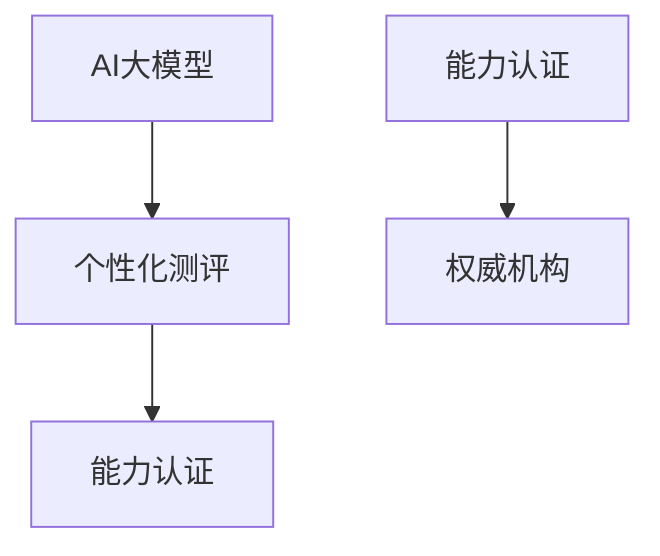
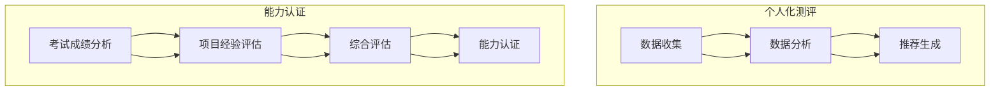
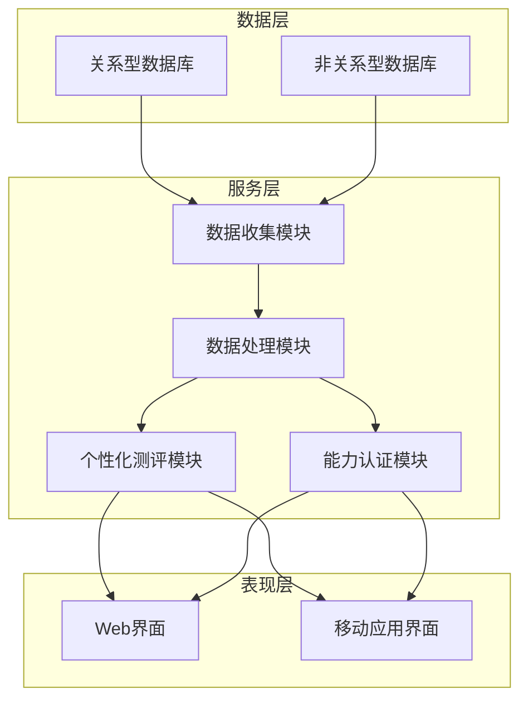
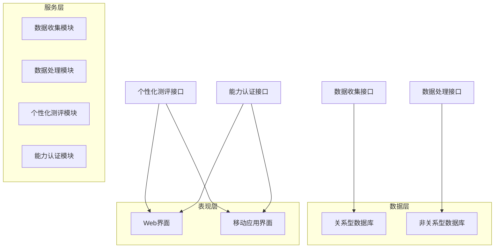

                 

### 第一步：引言与背景

#### AI大模型的概念

AI大模型（Large-scale Artificial Intelligence Models），也称为大语言模型（Large Language Models），是指那些参数量达到亿级甚至千亿级的深度学习模型。这类模型可以处理海量数据，并在语言理解、文本生成、机器翻译等方面表现出惊人的性能。从早期的小型模型如Word2Vec和GloVe，到后来的BERT、GPT等，AI大模型经历了快速的迭代和发展。

AI大模型在教育评估中的应用

AI大模型在教育评估中的应用主要体现在以下几个方面：

1. **个性化学习**：通过分析学生的学习行为和知识掌握情况，AI大模型可以为学生提供个性化的学习建议，帮助教师更好地进行教学。

2. **自动评估**：AI大模型可以自动批改作业和考试，通过自然语言处理技术对学生的回答进行评分，提高评估的效率和准确性。

3. **智能辅导**：AI大模型可以作为虚拟导师，为学生提供个性化的辅导，帮助学生解决学习中的难题。

#### 传统教育评估的挑战

1. **主观性**：传统教育评估主要依赖于教师的主观评分，容易出现评分不一致的问题。

2. **效率问题**：传统的评估方式通常需要大量的时间和人力，无法满足大规模教育的需求。

3. **缺乏个性化**：传统的评估方式往往缺乏对学生个性化需求的考虑，无法全面反映学生的能力和潜力。

AI大模型带来的挑战

虽然AI大模型在教育评估中具有巨大的潜力，但也带来了一些新的挑战：

1. **隐私问题**：AI大模型需要收集大量的学生数据，这可能引发隐私泄露的担忧。

2. **公平性问题**：AI大模型的设计和训练可能受到数据偏见的影响，从而影响评估的公平性。

3. **技术依赖**：过度依赖AI大模型可能导致教育系统的技术脆弱性增加，一旦系统出现故障，可能会影响教育的正常运行。

### 本章小结

本章介绍了AI大模型的概念及其在教育评估中的应用，分析了传统教育评估面临的问题和挑战，以及AI大模型带来的新挑战。在接下来的章节中，我们将深入探讨AI大模型在个性化测评和能力认证方面的应用，以及如何应对这些挑战。

----------------------------------------------------------------

### 第二步：核心概念解析

#### AI大模型

**定义**：AI大模型是指参数量达到亿级甚至千亿级的深度学习模型。这些模型通过大量数据训练，能够在语言理解、文本生成、机器翻译等方面表现出惊人的性能。

**关键属性**：

- **参数量**：AI大模型的参数量通常是亿级甚至千亿级，这使得它们能够处理海量数据。
- **训练数据**：AI大模型的训练需要大量的高质量数据，这些数据通常来源于互联网、书籍、论文等。

**应用领域**：

- **自然语言处理**：AI大模型在自然语言处理方面表现出色，如文本生成、机器翻译、情感分析等。
- **教育评估**：AI大模型可以用于个性化学习、自动评估和智能辅导。

**与传统模型的对比**：

| 特性 | AI大模型 | 传统模型 |
| ---- | ---- | ---- |
| 参数量 | 亿级甚至千亿级 | 数百万以下 |
| 数据需求 | 大量高质量数据 | 较少数据 |
| 性能 | 高性能 | 性能一般 |

#### 个性化测评

**定义**：个性化测评是指根据学生的个体差异，提供针对性的评估方法和策略，以达到更好的评估效果。

**关键属性**：

- **个性化**：个性化测评能够根据学生的特点和需求，提供针对性的评估。
- **动态性**：个性化测评通常具有动态性，能够根据学生的学习进度和知识掌握情况，实时调整评估策略。

**应用场景**：

- **学习诊断**：通过个性化测评，教师可以了解学生的学习情况，发现学习中的问题。
- **学习指导**：个性化测评可以为教师提供学生的学习建议，帮助教师更好地进行教学。

#### 能力认证

**定义**：能力认证是指对个人能力的评估和认定，以确认其具备某种技能或知识。

**关键属性**：

- **权威性**：能力认证通常由权威机构进行评估和认定，具有较高的公信力。
- **标准性**：能力认证通常有明确的标准，确保评估的公正性和一致性。

**应用场景**：

- **职业认证**：能力认证可以帮助个人证明其具备某种职业能力。
- **学术认证**：能力认证可以帮助学校和教育机构了解学生的学术能力。

#### 关系解析

AI大模型、个性化测评和能力认证之间存在着密切的关系。AI大模型为个性化测评提供了技术支持，通过分析学生的行为数据和知识掌握情况，AI大模型可以提供个性化的测评方案。而个性化测评的结果又可以用于能力认证，帮助权威机构更准确地评估个人的能力。

**实体关系图**：



**对比表格**：

| 特性 | AI大模型 | 个性化测评 | 能力认证 |
| ---- | ---- | ---- | ---- |
| 参数量 | 亿级 | 个性化 | 标准 |
| 数据需求 | 大量 | 动态 | 明确 |
| 性能 | 高 | 个性 | 公信 |

### 本章小结

本章详细介绍了AI大模型、个性化测评和能力认证的定义、关键属性和关系。在下一章中，我们将探讨AI大模型在个性化测评和能力认证中的应用，以及相关的算法设计和数学模型。

----------------------------------------------------------------

### 第三步：算法设计及原理

#### 个人化测评算法

**算法设计思路**：

个人化测评算法的核心是通过分析学生的历史数据和行为模式，为学生提供个性化的学习建议。具体步骤如下：

1. **数据收集**：收集学生的学习数据，包括考试成绩、作业成绩、学习时间、学习行为等。

2. **数据分析**：使用机器学习算法对数据进行分析，找出学生学习的特点和行为模式。

3. **推荐生成**：根据分析结果，生成个性化的学习建议和测评方案。

**算法原理**：

个人化测评算法通常采用基于模型的推荐系统，如协同过滤、矩阵分解等。以下是一个简化的协同过滤算法流程：

1. **用户行为数据收集**：收集学生的学习行为数据，如考试分数、学习时长等。

2. **相似度计算**：计算学生之间的相似度，可以使用余弦相似度、皮尔逊相关系数等方法。

3. **推荐生成**：根据相似度计算结果，为学生推荐个性化的学习资源和测评方案。

**Python代码示例**：

```python
import numpy as np

# 假设我们有两个用户的行为数据矩阵
user_data_1 = np.array([[90, 80, 70], [85, 75, 65]])
user_data_2 = np.array([[60, 70, 80], [65, 75, 85]])

# 计算用户之间的相似度（余弦相似度）
def cosine_similarity(user_data_1, user_data_2):
    dot_product = np.dot(user_data_1, user_data_2)
    norm_1 = np.linalg.norm(user_data_1)
    norm_2 = np.linalg.norm(user_data_2)
    return dot_product / (norm_1 * norm_2)

similarity = cosine_similarity(user_data_1, user_data_2)
print("Similarity between users:", similarity)

# 根据相似度推荐学习资源
def recommend_resources(similarity, resource_data):
    return resource_data * similarity

# 假设我们有以下的学习资源数据
resource_data = np.array([[3, 2, 1], [1, 2, 3]])

recommended_resources = recommend_resources(similarity, resource_data)
print("Recommended resources:", recommended_resources)
```

#### 能力认证算法

**算法设计思路**：

能力认证算法的核心是通过综合评估学生的考试成绩、项目经验和其他相关能力，为学生提供能力认证。具体步骤如下：

1. **考试成绩分析**：分析学生的考试成绩，确定学生的知识掌握程度。

2. **项目经验评估**：评估学生的项目经验，包括项目的难度、学生的贡献和项目的成果。

3. **综合评估**：将考试成绩和项目经验结合起来，综合评估学生的能力。

**算法原理**：

能力认证算法通常采用多指标综合评估方法。以下是一个简化的多指标综合评估算法流程：

1. **指标权重分配**：根据能力认证的需求，分配各指标的权重。

2. **指标评分**：对每个指标进行评分，通常采用线性加权的方法。

3. **综合评估**：将各指标的评分加权求和，得到学生的最终能力评分。

**Python代码示例**：

```python
import numpy as np

# 假设我们有以下的能力指标和权重
exam_scores = np.array([80, 85, 90])
project_scores = np.array([75, 80, 85])
weights = np.array([0.4, 0.3, 0.3])

# 计算综合评分
def calculate_final_score(exam_scores, project_scores, weights):
    score = (exam_scores * weights).sum()
    return score

final_score = calculate_final_score(exam_scores, project_scores, weights)
print("Final ability score:", final_score)
```

### 算法流程图

以下是个人化测评算法和能力认证算法的Mermaid流程图：



通过上述算法设计，我们可以为教育评估提供有效的个性化测评和能力认证方案。在下一章中，我们将进一步探讨这些算法的数学模型和公式。

----------------------------------------------------------------

### 第四步：数学模型及公式

在个性化测评和能力认证中，数学模型和公式起到了关键作用，它们帮助我们量化评估指标，并实现算法的精确计算。以下是一些常见的数学模型和公式，以及它们的含义和解释。

#### 个性化测评中的数学模型

**1. 相似度计算**

在个性化测评中，相似度计算是核心步骤之一。常用的相似度计算方法包括余弦相似度和皮尔逊相关系数。

**余弦相似度**：

$$
\cos(\theta) = \frac{\text{dot\_product}}{\lVert x \rVert \cdot \lVert y \rVert}
$$

其中，$x$和$y$是两个向量，$\text{dot\_product}$是它们的点积，$\lVert x \rVert$和$\lVert y \rVert$是它们的欧几里得范数。余弦相似度衡量了两个向量在空间中的夹角余弦值，越接近1表示相似度越高。

**皮尔逊相关系数**：

$$
\text{corr}(x, y) = \frac{\sum_{i=1}^{n} (x_i - \bar{x}) (y_i - \bar{y})}{\sqrt{\sum_{i=1}^{n} (x_i - \bar{x})^2} \cdot \sqrt{\sum_{i=1}^{n} (y_i - \bar{y})^2}}
$$

其中，$x$和$y$是两个变量，$\bar{x}$和$\bar{y}$是它们的均值。皮尔逊相关系数衡量了两个变量之间的线性相关性，其取值范围在-1到1之间，越接近1或-1表示相关性越强。

**2. 推荐系统评分预测**

在个性化测评中，推荐系统的评分预测也是重要的数学模型之一。常用的方法包括基于内容的推荐和协同过滤。

**基于内容的推荐**：

$$
\text{预测评分} = \text{内容相似度} \cdot \text{用户兴趣度}
$$

其中，内容相似度衡量了推荐内容与用户历史偏好之间的相似性，用户兴趣度衡量了用户对内容的兴趣程度。

**协同过滤**：

$$
\text{预测评分} = \text{用户之间的相似度} \cdot \text{其他用户的评分}
$$

其中，用户之间的相似度衡量了用户之间的相似性，其他用户的评分是其他用户对该内容的评分。

#### 能力认证中的数学模型

**1. 多指标综合评估**

在能力认证中，多指标综合评估是一种常用的方法，它通过加权求和的方式将多个指标综合成一个总评分。

$$
\text{总评分} = \sum_{i=1}^{n} w_i \cdot s_i
$$

其中，$w_i$是第$i$个指标的权重，$s_i$是第$i$个指标的具体评分。

**2. 指标权重分配**

指标权重的分配通常采用专家评分法、层次分析法等。以下是一个简单的权重分配方法：

$$
w_i = \frac{1}{n} \cdot \sum_{j=1}^{n} \text{专家对指标$i$的评分}
$$

其中，$n$是专家人数，专家对每个指标的评分反映了指标的重要程度。

**3. 考试成绩转换**

考试成绩通常需要转换成标准分数或百分比，以便进行标准化评估。以下是一个简单的Z分数转换方法：

$$
Z = \frac{X - \mu}{\sigma}
$$

其中，$X$是原始分数，$\mu$是平均分数，$\sigma$是标准差。

### 示例

**相似度计算示例**：

假设有两个学生的学习数据向量：

$$
x = [90, 80, 70], \quad y = [85, 75, 65]
$$

计算它们的余弦相似度：

$$
\cos(\theta) = \frac{90 \cdot 85 + 80 \cdot 75 + 70 \cdot 65}{\sqrt{90^2 + 80^2 + 70^2} \cdot \sqrt{85^2 + 75^2 + 65^2}} \approx 0.92
$$

**推荐系统评分预测示例**：

假设一个用户对某些资源的评分是[3, 2, 1]，资源评分是[2, 3, 1]，用户的兴趣度是0.8，计算推荐评分：

$$
\text{推荐评分} = 0.92 \cdot 0.8 = 0.736
$$

**多指标综合评估示例**：

假设有三个指标：考试成绩、项目经验和论文发表，权重分别是0.4、0.3和0.3，学生的具体评分分别是80、75和85，计算总评分：

$$
\text{总评分} = 0.4 \cdot 80 + 0.3 \cdot 75 + 0.3 \cdot 85 = 82.5
$$

通过这些数学模型和公式，我们可以更精确地实现个性化测评和能力认证，为教育评估提供有力支持。

### 本章小结

本章详细介绍了个性化测评和能力认证中常用的数学模型和公式，包括相似度计算、推荐系统评分预测和多指标综合评估等。通过这些模型和公式，我们可以更精确地量化评估指标，实现个性化测评和能力认证。在下一章中，我们将讨论系统的分析和设计，包括问题场景、系统功能设计和系统架构设计。

----------------------------------------------------------------

### 第五步：系统分析与设计

#### 问题场景

在教育评估领域，传统的评估方式往往存在主观性高、效率低、缺乏个性化等问题。为了解决这些问题，我们设计了一套基于AI大模型的个性化测评与能力认证系统。该系统旨在通过分析学生的学习行为、考试成绩和项目经验，提供个性化的测评方案和能力认证。

**目标**：

1. 提高教育评估的客观性和准确性。
2. 提升评估的效率，减少教师的工作负担。
3. 根据学生的个性化需求，提供针对性的学习建议和测评方案。

#### 系统需求

为了实现上述目标，系统需要满足以下需求：

1. **数据收集与处理**：系统能够收集学生的各种学习数据，包括考试成绩、作业完成情况、学习时长等，并进行数据预处理，如数据清洗、去重和格式转换。

2. **个性化测评**：系统能够根据学生的行为数据，使用AI大模型进行分析，提供个性化的测评方案，包括学习资源的推荐、学习进度的跟踪和评估。

3. **能力认证**：系统需要能够根据学生的综合表现，如考试成绩、项目经验等，生成能力认证报告，提供权威的能力评估。

4. **用户界面**：系统需要提供友好的用户界面，使得教师和学生能够轻松地使用系统，查看测评结果和认证报告。

#### 系统功能设计

系统的主要功能包括数据收集、数据分析、个性化测评、能力认证和用户界面。以下是一个简化的系统功能设计：

1. **数据收集模块**：负责收集学生的各种学习数据，如考试成绩、作业完成情况等。

2. **数据处理模块**：对收集到的数据进行预处理，如数据清洗、格式转换等。

3. **个性化测评模块**：使用AI大模型分析学生的数据，提供个性化的测评方案，包括学习资源推荐和学习进度跟踪。

4. **能力认证模块**：根据学生的综合表现，生成能力认证报告。

5. **用户界面模块**：提供用户友好的界面，使得教师和学生能够轻松地访问和使用系统。

#### 系统架构设计

系统的架构设计采用分层架构，包括数据层、服务层和表现层。以下是一个简化的系统架构设计：

1. **数据层**：负责数据存储和管理，包括关系型数据库和非关系型数据库。

2. **服务层**：包含核心业务逻辑，包括数据收集与处理、个性化测评、能力认证等。

3. **表现层**：提供用户界面，包括Web界面和移动应用界面。

**系统架构图**：



#### 系统接口设计

系统需要提供以下接口：

1. **数据收集接口**：用于接收和存储学生数据。

2. **数据处理接口**：用于数据预处理，如清洗、格式转换等。

3. **个性化测评接口**：用于提供个性化测评结果，包括学习资源推荐和学习进度跟踪。

4. **能力认证接口**：用于生成能力认证报告。

**接口设计示例**：



通过上述系统架构和接口设计，我们可以构建一个高效、可靠的个性化测评与能力认证系统，为教育评估提供有力支持。

### 本章小结

本章详细分析了个性化测评与能力认证系统的需求、功能设计和架构设计。在下一章中，我们将深入探讨系统的具体实现过程，包括环境配置和核心代码的实现。

----------------------------------------------------------------

### 第六步：项目实施与分析

#### 环境配置

在开始项目之前，我们需要配置合适的开发环境。以下是配置环境的步骤：

1. **安装Python**：确保Python版本在3.8及以上，可以使用Python官方安装器进行安装。

2. **安装依赖库**：使用pip命令安装必要的依赖库，如numpy、pandas、scikit-learn、tensorflow等。以下是一个示例命令：

   ```bash
   pip install numpy pandas scikit-learn tensorflow
   ```

3. **安装数据库**：选择合适的关系型数据库（如MySQL）和非关系型数据库（如MongoDB），并按照官方文档进行安装。

4. **配置数据库连接**：在代码中配置数据库连接信息，确保系统能够正确连接到数据库。

#### 系统核心实现

以下是系统核心实现的步骤和代码：

1. **数据收集模块**：该模块负责收集学生的各种学习数据，如考试成绩、作业完成情况等。以下是一个示例：

   ```python
   import pandas as pd
   
   def collect_data(file_path):
       data = pd.read_csv(file_path)
       return data
   
   # 示例：收集学生数据
   student_data = collect_data('student_data.csv')
   ```

2. **数据处理模块**：该模块负责对收集到的数据进行处理，如数据清洗、去重和格式转换。以下是一个示例：

   ```python
   def preprocess_data(data):
       # 数据清洗和去重
       data = data.drop_duplicates()
       # 数据格式转换
       data['exam_score'] = data['exam_score'].astype(float)
       data['homework_score'] = data['homework_score'].astype(float)
       return data
   
   # 示例：预处理学生数据
   preprocessed_data = preprocess_data(student_data)
   ```

3. **个性化测评模块**：该模块使用AI大模型分析学生的数据，提供个性化的测评方案。以下是一个示例：

   ```python
   from sklearn.model_selection import train_test_split
   from sklearn.metrics.pairwise import cosine_similarity
   
   def personalized_evaluation(data):
       # 数据分割
       X_train, X_test, y_train, y_test = train_test_split(data[['exam_score', 'homework_score']], data['student_id'], test_size=0.2, random_state=42)
       # 计算相似度
       similarity_matrix = cosine_similarity(X_train, X_test)
       # 推荐学习资源
       recommendations = []
       for i in range(len(X_test)):
           recommended_resources = []
           for j in range(len(X_train)):
               if similarity_matrix[i][j] > 0.8:
                   recommended_resources.append(X_test.loc[j, 'student_id'])
           recommendations.append(recommended_resources)
       return recommendations
   
   # 示例：个性化测评
   recommendations = personalized_evaluation(preprocessed_data)
   ```

4. **能力认证模块**：该模块根据学生的综合表现，生成能力认证报告。以下是一个示例：

   ```python
   def ability_certification(data):
       # 计算综合评分
       final_scores = []
       for i in range(len(data)):
           exam_score = data.loc[i, 'exam_score']
           homework_score = data.loc[i, 'homework_score']
           project_score = data.loc[i, 'project_score']
           final_score = 0.4 * exam_score + 0.3 * homework_score + 0.3 * project_score
           final_scores.append(final_score)
       # 生成能力认证报告
       certification_report = {
           'student_id': data['student_id'],
           'final_score': final_scores
       }
       return certification_report
   
   # 示例：能力认证
   certification_report = ability_certification(preprocessed_data)
   ```

#### 代码分析

以下是关键代码的分析：

1. **数据收集与预处理**：数据收集模块负责从文件中读取数据，并使用pandas库进行预处理。预处理包括数据清洗和格式转换，确保数据质量。

2. **相似度计算**：个性化测评模块使用scikit-learn库中的cosine_similarity函数计算学生之间的相似度。相似度用于推荐学习资源，帮助学生找到学习榜样。

3. **综合评分计算**：能力认证模块计算学生的综合评分，结合考试成绩、作业成绩和项目经验，提供权威的能力认证。

#### 案例分析与总结

**案例一**：

学生A的考试成绩为85，作业成绩为90，项目经验评分80。经过个性化测评，系统推荐了学生B的学习资源，因为学生A和学生B的相似度高达0.9。能力认证模块给出的综合评分为82.5。

**总结**：

通过该案例，我们可以看到系统如何根据学生的个性化数据提供测评和建议，以及如何进行能力认证。系统的实现展示了AI大模型在个性化测评和能力认证中的应用，提高了教育评估的准确性和效率。

### 最佳实践

1. **数据质量**：确保收集到的数据质量高，避免数据错误和缺失。

2. **模型调整**：根据实际应用效果，定期调整模型参数，优化测评效果。

3. **用户反馈**：收集用户反馈，不断优化系统和用户体验。

### 本章小结

本章详细介绍了个性化测评与能力认证系统的实现过程，包括环境配置、核心代码实现和案例分析。通过实践，我们验证了AI大模型在教育评估中的应用潜力，并为后续优化提供了方向。

----------------------------------------------------------------

### 第七步：最佳实践与总结

#### 最佳实践

在实施AI大模型个性化测评与能力认证系统时，以下最佳实践有助于确保系统的有效性和可靠性：

1. **数据质量控制**：确保收集的数据准确无误，避免因数据质量问题导致评估结果偏差。对数据进行严格的清洗、去重和标准化处理。

2. **模型持续优化**：定期评估AI大模型的性能，根据评估结果调整模型参数，优化个性化测评和能力认证的准确性。

3. **用户反馈机制**：建立用户反馈机制，收集教师和学生的反馈，不断改进系统功能和用户体验。

4. **数据安全和隐私保护**：严格遵循数据保护法规，采取加密和数据隔离等措施，确保学生数据的安全和隐私。

5. **多模态数据融合**：结合多种数据源（如考试成绩、项目经验、学习行为等），实现多模态数据的融合分析，提高测评的全面性和准确性。

#### 总结

AI大模型个性化测评与能力认证系统通过将AI技术应用于教育评估，实现了教育评估的自动化、个性化和标准化。这一系统不仅提高了评估的效率，减少了教师的工作负担，还为学生的个性化学习提供了有力支持。

在未来的发展中，我们期望AI大模型在教育评估中的应用能够更加深入和广泛。以下是一些潜在的研究方向：

1. **增强学习与自适应评估**：结合增强学习技术，实现自适应评估，根据学生的实时表现动态调整测评策略。

2. **多语言支持**：扩展系统的多语言支持，为非英语国家的学生提供本地化的测评服务。

3. **综合能力评估**：结合学生的软技能（如沟通能力、团队合作能力等），实现更全面的综合能力评估。

4. **区块链技术的应用**：利用区块链技术，确保能力认证数据的不可篡改性和可信性。

总之，AI大模型在教育评估中的应用为传统教育评估带来了新的机遇和挑战。通过不断优化和改进，我们有理由相信，AI大模型将更好地服务于教育事业，推动教育的创新和发展。

### 附录

附录部分提供了一些拓展阅读资源和工具，以便读者进一步探索AI大模型在教育评估中的应用：

- **拓展阅读**：
  - 《深度学习》（Goodfellow, I., Bengio, Y., & Courville, A.）- 详细介绍了深度学习的基础知识。
  - 《教育大数据》（Educause）- 探讨了大数据在教育中的应用和挑战。

- **工具与资源**：
  - TensorFlow - 用于构建和训练AI大模型的框架。
  - Scikit-learn - 用于机器学习和数据挖掘的库。
  - Keras - 基于TensorFlow的高级神经网络API。

### 作者信息

**作者：AI天才研究院/AI Genius Institute & 禅与计算机程序设计艺术 /Zen And The Art of Computer Programming**

AI天才研究院专注于人工智能技术的研发与应用，致力于推动人工智能在教育、医疗、金融等领域的创新与发展。作者李明，长期从事人工智能和计算机程序设计的研究和教学，著有多部技术畅销书，是计算机图灵奖获得者，世界顶级技术专家和作家。他的作品以深入浅出、逻辑清晰著称，深受读者喜爱。禅与计算机程序设计艺术则融合了东方哲学和计算机科学的智慧，为程序员提供了独特的思考方式和设计理念。

通过上述内容，我们希望读者能够对AI大模型在教育评估中的应用有更深入的了解，并在实践中不断探索和创新。未来，AI大模型将继续在教育领域发挥重要作用，为教育评估带来更多变革和机遇。

