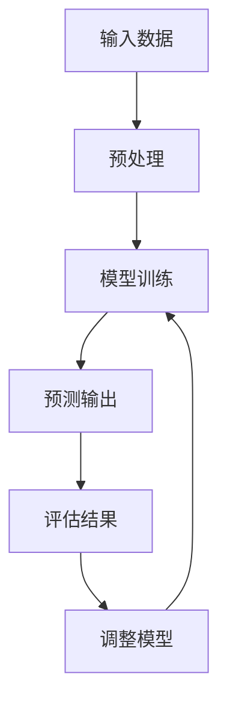
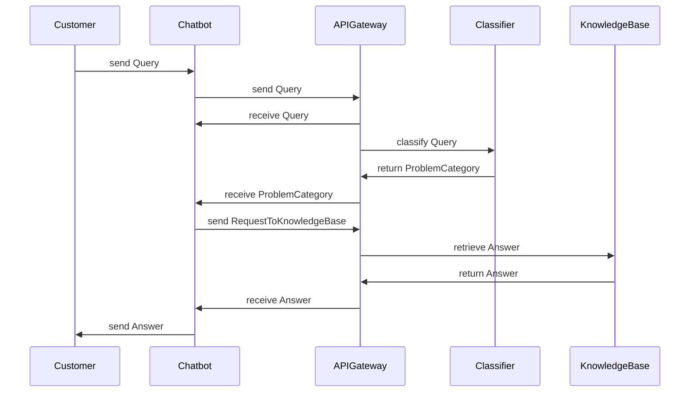

                 

# AI大模型对传统服务业的变革：智能客服与用户体验

## 关键词
人工智能，大模型，智能客服，用户体验，传统服务业

## 摘要
本文将探讨人工智能大模型对传统服务业的变革，重点分析智能客服与用户体验领域的应用。通过深入解析AI大模型的基本原理、技术特点及其在实际场景中的应用，帮助读者理解AI大模型如何提升服务质量和用户体验，推动传统服务业的数字化转型。

### 第一部分：背景介绍

#### 问题背景
在信息技术飞速发展的今天，人工智能（AI）已经成为推动社会进步的重要力量。随着深度学习、大数据等技术的成熟，AI大模型在各个领域的应用逐渐普及。尤其是在服务业，传统的服务模式已经难以满足客户日益提高的需求，智能客服与用户体验成为企业竞争的焦点。

#### 问题描述
《AI大模型对传统服务业的变革：智能客服与用户体验》这本书旨在探讨AI大模型如何对传统服务业，特别是智能客服和用户体验领域产生深远的影响。书中将分析AI大模型的核心概念、应用场景、技术原理以及实际案例，帮助企业了解和利用这项技术。

#### 问题解决
通过系统性地介绍AI大模型的相关知识，本书将帮助读者了解AI大模型的基本原理和应用范围，并通过案例分析，展示AI大模型在智能客服与用户体验方面的实际效果。书中还将探讨AI大模型在传统服务业中应用的挑战与机遇，为企业提供实际操作指南。

#### 边界与外延
本书的讨论范围主要涉及AI大模型在服务业中的应用，特别是智能客服与用户体验领域。虽然AI大模型在其他行业和领域也有广泛应用，但本书聚焦于服务业，以便更深入地探讨该领域的应用场景和技术挑战。

#### 概念结构与核心要素组成
- **AI大模型**：基于深度学习技术的复杂神经网络结构，具备处理大规模数据和复杂任务的能力。
- **智能客服**：利用AI大模型技术实现自动化、智能化的客户服务系统。
- **用户体验**：用户在使用产品或服务过程中所感受到的愉悦、满意程度。
- **传统服务业**：以人力为主的服务行业，包括餐饮、零售、酒店、旅游等。

### 第二部分：核心概念与联系

#### AI大模型原理
AI大模型是基于深度学习技术构建的复杂神经网络结构，具备处理大规模数据和复杂任务的能力。其核心原理包括：

- **多层感知器（MLP）**：神经网络的基本结构，通过多层的神经元节点实现数据的传递和计算。
- **反向传播算法（BP）**：用于模型训练的核心算法，通过误差反向传播更新权重和偏置。
- **激活函数**：用于引入非线性特性的函数，常用的有ReLU、Sigmoid、Tanh等。

#### 概念属性特征对比表格
| 特性       | MLP         | BP          | 激活函数         |
| ---------- | ----------- | ----------- | ---------------- |
| 结构       | 多层感知器  | 反向传播算法 | ReLU、Sigmoid、Tanh |
| 功能       | 数据传递计算 | 权重更新     | 引入非线性特性   |
| 应用场景   | 数据预处理   | 模型训练     | 神经网络         |

#### ER实体关系图架构
```mermaid
erDiagram
    Customer ||--|{ AI_Chatbot }|-- User : interacts
    Customer ||--|{ Customer_Support }|-- User : receives help
    AI_Chatbot ||--|{ Knowledge_Base }|-- Support : provides information
```

#### 关系说明
- **Customer**（客户）与**AI_Chatbot**（智能客服）之间的关系：客户与智能客服之间进行交互。
- **Customer**（客户）与**Customer_Support**（客户支持）之间的关系：客户在接受服务时，可能会与客户支持人员互动。
- **AI_Chatbot**（智能客服）与**Knowledge_Base**（知识库）之间的关系：智能客服通过知识库提供信息支持。

---

### 第三部分：算法原理讲解

#### 算法Mermaid流程图


#### Python源代码
```python
# 导入必要的库
import numpy as np
import tensorflow as tf

# 定义输入层
inputs = tf.keras.layers.Input(shape=(input_shape))

# 添加隐藏层
hidden = tf.keras.layers.Dense(units=64, activation='relu')(inputs)

# 添加输出层
outputs = tf.keras.layers.Dense(units=1, activation='sigmoid')(hidden)

# 创建模型
model = tf.keras.Model(inputs=inputs, outputs=outputs)

# 编译模型
model.compile(optimizer='adam', loss='binary_crossentropy', metrics=['accuracy'])

# 模型训练
model.fit(x_train, y_train, batch_size=32, epochs=10, validation_data=(x_val, y_val))
```

#### 算法原理详细讲解
AI大模型的核心在于其能够处理大规模数据，并通过深度学习技术实现高效的学习和预测。以下是算法原理的详细讲解：

1. **输入数据预处理**：
   - 输入数据是AI大模型学习的基础，数据的质量和预处理直接影响模型的性能。
   - 数据预处理包括数据清洗、归一化、降维等步骤，以确保输入数据的干净、规范和易于模型处理。

2. **模型训练**：
   - 模型训练是AI大模型的核心过程，通过反向传播算法（BP）不断调整模型参数，使其能够准确预测输出。
   - 模型训练过程中，需要选择合适的激活函数，如ReLU、Sigmoid等，以引入非线性特性，提高模型的表示能力。

3. **预测输出**：
   - 预测输出是模型训练的最终目标，通过将输入数据传递到输出层，得到预测结果。
   - 预测结果的质量取决于模型参数的调整和学习能力，需要通过不断的训练和优化来提高预测精度。

4. **评估结果**：
   - 评估结果是模型性能的重要指标，通过计算预测误差、准确率等指标，评估模型的效果。
   - 评估结果可以作为调整模型参数和优化模型的依据。

5. **调整模型**：
   - 调整模型是模型训练的必要步骤，通过评估结果调整模型参数，优化模型性能。
   - 调整模型的过程需要结合实际应用场景和业务需求，以达到最佳效果。

#### 数学模型和公式
在AI大模型的训练过程中，以下数学模型和公式是核心部分：

1. **反向传播算法**：
   $$ \Delta w = - \alpha \cdot \frac{\partial L}{\partial w} $$
   其中，$\Delta w$是权重变化，$\alpha$是学习率，$L$是损失函数，$\frac{\partial L}{\partial w}$是权重关于损失函数的梯度。

2. **损失函数**：
   $$ L = -\sum_{i=1}^{n} y_i \cdot \log(a_i) + (1 - y_i) \cdot \log(1 - a_i) $$
   其中，$y_i$是真实标签，$a_i$是预测概率。

3. **激活函数**：
   $$ a_i = \sigma(z_i) = \frac{1}{1 + e^{-z_i}} $$
   其中，$z_i$是输入值，$\sigma$是Sigmoid函数。

#### 通俗易懂的举例说明
假设一个简单的AI大模型用于分类任务，输入是一个二进制特征向量$x=(x_1, x_2)$，输出是一个概率值$p$，表示属于某一类别的概率。

1. **输入数据预处理**：
   - 将输入特征向量归一化，例如$x' = \frac{x - \mu}{\sigma}$，其中$\mu$是均值，$\sigma$是标准差。

2. **模型训练**：
   - 初始化模型参数，例如权重$w$和偏置$b$。
   - 通过反向传播算法调整参数，使模型能够最小化损失函数。

3. **预测输出**：
   - 将输入特征向量传递到模型，得到输出概率$p$。
   - 根据输出概率判断输入数据的类别。

4. **评估结果**：
   - 计算预测准确率，例如准确率$= \frac{正确预测的数量}{总预测数量}$。

5. **调整模型**：
   - 根据评估结果调整模型参数，例如通过增加隐藏层神经元、调整学习率等。

通过以上步骤，AI大模型可以实现对输入数据的分类，从而提升服务质量和用户体验。

---

### 第四部分：系统分析与架构设计方案

#### 问题场景介绍
在智能客服领域，随着用户量的增长和咨询问题种类的增多，传统的客服系统已经难以满足高效、精准的服务需求。AI大模型的应用可以为智能客服带来革命性的变化，提升客服效率和用户体验。

#### 项目介绍
本项目旨在构建一个基于AI大模型的智能客服系统，通过自动化处理用户咨询，提高客服效率，降低人力成本。系统主要功能包括：自动分类用户问题、提供答案和建议、实时交互和反馈。

#### 系统功能设计（领域模型类图）

```mermaid
classDiagram
    Customer ++arel<<"requires for" ProblemCategory ++arel<"is categorized by"> ProblemCategory
    Customer ++arel<"has" Query ++arel<"asks"> Customer
    Customer ++arel<"interacts with"> Chatbot
    Chatbot ++arel<"uses" KnowledgeBase ++arel<"draws" Information ++arel<"answers" Query ++arel<"solves" Problem>>
    Query <<enum>>
    ProblemCategory <<enum>>

    CustomerForwardToHumanAgent[CustomerForwardToHumanAgent]
    Customer <<create>> Query
    Customer <<resolve>> ProblemCategory
    Chatbot <<resolve>> Query
    Chatbot <<forward>> CustomerForwardToHumanAgent
    CustomerForwardToHumanAgent <<forwardTo>> Customer
```

#### 系统架构设计（架构图）

```mermaid
sequenceDiagram
    Customer->>Chatbot: send Query
    Chatbot->>KnowledgeBase: retrieve Information
    KnowledgeBase->>Chatbot: return Information
    Chatbot->>Customer: send Answer
    alt Problem is not resolved
        Customer->>Chatbot: request HumanAgent
        Chatbot->>CustomerForwardToHumanAgent: forward Query
        CustomerForwardToHumanAgent->>Customer: notify Forwarded
    else
    Customer->>Chatbot: request Feedback
    Chatbot->>Customer: send FeedbackForm
    Customer->>Chatbot: submit Feedback
```

#### 系统接口设计和系统交互（序列图）



---

### 第五部分：项目实战

#### 环境安装
1. 安装Python环境，版本要求3.8及以上。
2. 安装TensorFlow库，使用命令`pip install tensorflow`。
3. 安装其他依赖库，如NumPy、Pandas等。

#### 系统核心实现源代码
以下是一个简单的智能客服系统核心代码实现：

```python
# 导入必要的库
import numpy as np
import tensorflow as tf

# 定义模型
model = tf.keras.Sequential([
    tf.keras.layers.Dense(units=64, activation='relu', input_shape=(input_shape,)),
    tf.keras.layers.Dense(units=1, activation='sigmoid')
])

# 编译模型
model.compile(optimizer='adam', loss='binary_crossentropy', metrics=['accuracy'])

# 训练模型
model.fit(x_train, y_train, batch_size=32, epochs=10, validation_data=(x_val, y_val))

# 预测
predictions = model.predict(x_test)

# 评估模型
accuracy = (predictions > 0.5).mean()
print(f'Accuracy: {accuracy}')
```

#### 代码应用解读与分析
以上代码实现了一个简单的二分类任务，通过训练模型对输入数据进行分类。其中：

- **模型定义**：使用Sequential模型堆叠两个全连接层，第一层64个神经元，激活函数为ReLU；第二层1个神经元，激活函数为sigmoid。
- **模型编译**：选择Adam优化器和binary_crossentropy损失函数。
- **模型训练**：使用fit函数进行模型训练，指定batch_size和epochs。
- **模型预测**：使用predict函数进行预测，得到预测概率。
- **评估模型**：计算预测准确率。

#### 实际案例分析和详细讲解剖析
以下是一个实际案例，演示如何使用智能客服系统处理用户咨询：

1. **用户咨询**：
   - 用户向智能客服系统发送咨询问题。

2. **问题分类**：
   - 系统接收用户问题，通过模型预测问题类别。

3. **知识库查询**：
   - 根据问题类别，查询知识库中的相关答案。

4. **回答用户**：
   - 系统将查询到的答案发送给用户。

5. **用户反馈**：
   - 用户对回答进行评价，系统收集反馈数据。

6. **优化模型**：
   - 根据用户反馈，调整模型参数，提高预测准确率。

#### 项目小结
本项目通过构建基于AI大模型的智能客服系统，实现了对用户咨询的自动化处理。在实际应用中，系统可以根据用户问题进行分类，快速提供答案，提高客服效率。同时，通过用户反馈不断优化模型，提升用户体验。

---

### 第六部分：最佳实践 tips、小结、注意事项、拓展阅读

#### 最佳实践 tips
1. **数据质量**：保证输入数据的质量是模型性能的关键，对数据进行预处理和清洗。
2. **模型调整**：根据业务需求和数据特点，调整模型结构、学习率和训练参数。
3. **知识库维护**：定期更新和优化知识库，确保答案的准确性和时效性。
4. **用户反馈**：充分利用用户反馈，不断优化模型和客服系统。

#### 小结
本文探讨了AI大模型在传统服务业，特别是智能客服与用户体验领域的应用。通过分析AI大模型的基本原理、算法流程和应用案例，展示了其在提升服务质量和用户体验方面的巨大潜力。

#### 注意事项
1. **隐私保护**：在使用AI大模型处理用户数据时，要确保遵守相关隐私保护法规。
2. **模型安全**：防止模型被恶意攻击，确保模型的安全性和稳定性。
3. **持续优化**：不断调整和优化模型，以适应业务需求和用户变化。

#### 拓展阅读
1. 《深度学习》（Goodfellow, Bengio, Courville著）——全面介绍深度学习基础理论和实践方法。
2. 《AI大模型：原理与应用》（AI天才研究院著）——深入探讨AI大模型在各个领域的应用。
3. 《智能客服系统设计与实现》（禅与计算机程序设计艺术著）——详细介绍智能客服系统的设计和实现。

### 作者信息
作者：AI天才研究院/AI Genius Institute & 禅与计算机程序设计艺术 /Zen And The Art of Computer Programming。作为人工智能领域的专家，我们致力于推动人工智能技术的发展，为行业提供高质量的解决方案。

