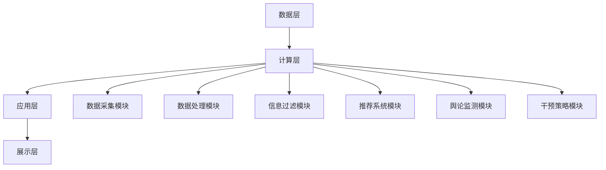
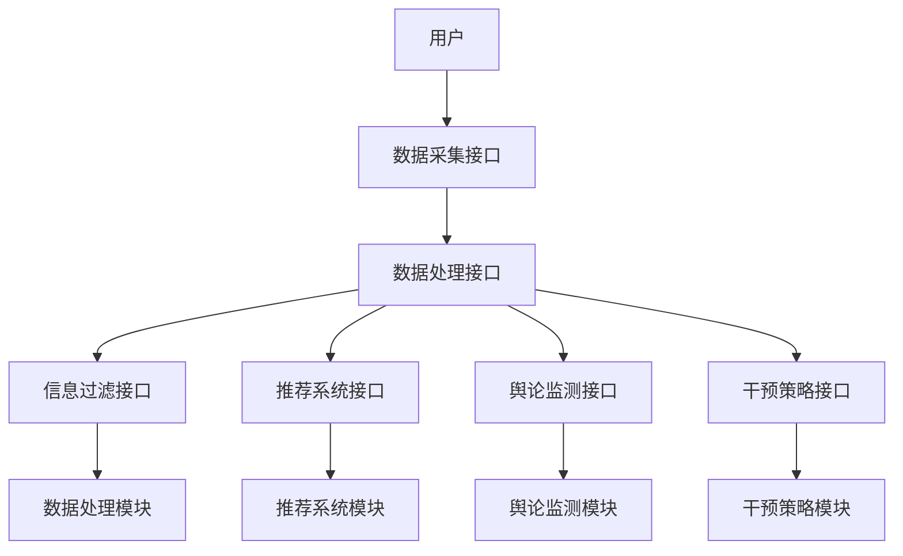
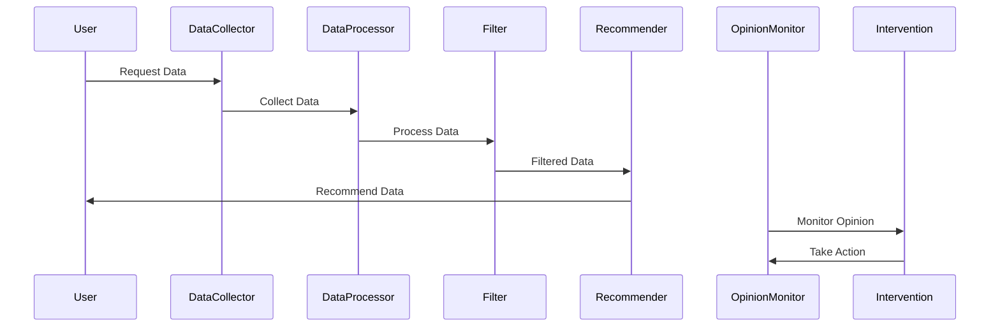

                 

### 引言

随着人工智能（AI）技术的飞速发展，大模型（Large Models）作为一种新型的人工智能体系，逐渐成为学术界和工业界关注的焦点。大模型具有强大的数据处理和知识提取能力，能够对海量数据进行深度学习，从而实现更精准的预测和更智能的决策。社交媒体作为信息传播的重要平台，其信息流动和舆论形成机制对公众认知和行为有着深远的影响。因此，探讨AI大模型对社交媒体的影响，尤其是对信息流动与舆论形成的影响，具有重要的理论和实践意义。

本文将系统地分析AI大模型如何影响社交媒体的信息流动和舆论形成。首先，我们将介绍AI大模型的基本概念，包括其定义、分类、特点和优势。然后，我们将探讨社交媒体的基本概念，包括其类型、功能和结构。接下来，我们将深入讨论信息流动和舆论形成的机制，并分析AI大模型与这些机制的关系。随后，我们将介绍AI大模型在信息流动和舆论形成中的应用，包括信息过滤与推荐系统、舆论监测与干预策略。在此基础上，我们将通过数学模型和公式，详细阐述AI大模型的工作原理。最后，我们将进行系统分析与架构设计，探讨AI大模型在社交媒体平台中的应用，并分享实际项目的实战经验和最佳实践。

通过本文的探讨，我们旨在为读者提供一个全面、深入的理解AI大模型对社交媒体影响的框架，帮助读者把握这一领域的最新动态和发展趋势。本文将为研究人员和从业者提供有益的参考，同时也期待激发更多关于AI大模型与社交媒体交叉领域的研究和讨论。让我们一步一步深入思考，揭开AI大模型的神秘面纱，探寻其对社交媒体的深远影响。

### AI大模型的概念

AI大模型是指具有大规模参数和数据量的神经网络模型，其具备处理海量数据和复杂任务的能力。AI大模型可以分为多种类型，其中最常见的是基于深度学习（Deep Learning）的模型，例如Transformer模型、GPT模型和BERT模型等。这些模型通过学习大量文本数据，提取语义信息和知识，从而实现文本生成、机器翻译、情感分析等高级任务。

首先，我们来看AI大模型的基本定义。AI大模型是基于深度学习技术的一种模型，通常具有数百万甚至数十亿个参数。这些参数通过学习大量数据，从数据中提取有用的信息，从而实现高精度的预测和智能的决策。具体来说，AI大模型的核心是一个多层神经网络，每一层都对输入数据进行一定的处理，并通过反向传播算法不断调整模型参数，以最小化预测误差。

AI大模型的特点主要包括以下几点：

1. **大规模参数**：AI大模型通常具有数百万甚至数十亿个参数，这使得模型能够对复杂任务进行建模，提取丰富的特征。

2. **强大的学习能力和泛化能力**：由于参数规模巨大，AI大模型能够从海量数据中学习，具备较强的泛化能力，能够处理新的任务和数据。

3. **自适应性和灵活性**：AI大模型可以通过调整模型参数，适应不同的任务和数据，具有很强的灵活性和自适应能力。

4. **高计算需求**：由于参数数量庞大，AI大模型在训练和推理过程中需要大量的计算资源，通常需要高性能的计算设备和分布式计算技术。

AI大模型的优势主要体现在以下几个方面：

1. **高效的文本处理**：AI大模型能够对大量文本数据进行处理，提取语义信息，实现高效的文本生成、机器翻译和情感分析等任务。

2. **智能化的决策支持**：AI大模型能够对复杂问题进行建模，提供智能化的决策支持，广泛应用于金融、医疗、制造等领域。

3. **多模态学习**：AI大模型能够同时处理多种类型的数据，如文本、图像、音频等，实现多模态学习，提升模型的泛化能力和应用范围。

4. **大规模数据处理**：AI大模型能够处理海量数据，从数据中挖掘有价值的信息，提升数据处理和分析的效率。

总之，AI大模型作为人工智能领域的重要突破，具有强大的数据处理和知识提取能力，在多个领域展现出显著的应用前景。接下来，我们将进一步探讨AI大模型在社交媒体中的具体应用，以及其对信息流动和舆论形成的影响。通过深入分析，我们希望能够为读者提供更全面、更深入的理解。

### 社交媒体的概念

社交媒体，作为现代信息传播的重要平台，已经深深嵌入人们的日常生活。它不仅仅是一个简单的信息发布和交流工具，更是一个集社交、信息传播、娱乐等多功能于一体的生态系统。为了深入理解社交媒体的概念，我们需要从其类型、功能和结构三个方面进行探讨。

#### 社交媒体的类型

社交媒体的类型多种多样，主要包括以下几类：

1. **社交网络平台**：如Facebook、Twitter、Instagram等，这些平台主要以建立用户社交关系为核心，提供用户之间的互动功能，如发布动态、评论、私信等。

2. **博客平台**：如WordPress、Blogger等，博客平台主要以发布文章、分享观点和信息为主，用户可以通过评论和分享来互动。

3. **论坛和社区**：如Reddit、Quora等，这些平台以讨论和分享知识、经验为主，用户可以发布帖子、回复和投票。

4. **视频分享平台**：如YouTube、TikTok等，这些平台主要以视频内容为核心，用户可以通过上传、观看和分享视频来交流。

5. **即时通讯平台**：如WhatsApp、微信、Telegram等，这些平台主要以即时通讯为主，提供文本、语音和视频通话功能。

#### 社交媒体的功能

社交媒体的功能多种多样，主要包括以下几个方面：

1. **信息传播**：社交媒体是信息传播的重要渠道，用户可以通过发布动态、转发和评论等方式，迅速将信息传播给大量用户。

2. **社交互动**：社交媒体提供了多种互动功能，如点赞、评论、私信等，用户可以通过这些功能与他人建立社交关系，进行实时互动。

3. **内容创作与分享**：用户可以在社交媒体平台上创作和分享各种类型的内容，如文字、图片、视频等，从而表达个性和观点。

4. **数据分析与反馈**：社交媒体平台通过数据分析，可以了解用户行为和偏好，为用户推荐感兴趣的内容，同时为广告主提供精准营销的数据支持。

#### 社交媒体的结构

社交媒体的结构可以分为以下几个层次：

1. **用户层**：用户是社交媒体的基本组成单位，每个用户都有自己的账号和身份。

2. **内容层**：内容是社交媒体的核心，包括用户发布的各种类型的信息，如文字、图片、视频等。

3. **互动层**：互动是社交媒体的重要功能，用户可以通过点赞、评论、分享等方式与其他用户互动。

4. **算法层**：社交媒体平台通常采用复杂的算法，对用户生成的内容进行排序和推荐，以提升用户体验。

5. **商业层**：社交媒体平台通过广告、电商等方式，为用户和广告主提供商业机会。

#### 社交媒体的核心要素

社交媒体的核心要素主要包括以下几个方面：

1. **用户**：用户是社交媒体的基础，没有用户就没有社交媒体。

2. **内容**：内容是社交媒体的核心，优质的内容能够吸引用户，提升用户活跃度。

3. **互动**：互动是社交媒体的重要功能，通过互动，用户之间可以建立联系，形成社交网络。

4. **算法**：算法是社交媒体的核心技术，通过算法，平台可以理解用户需求，为用户推荐感兴趣的内容。

5. **商业**：商业是社交媒体的驱动力，通过商业活动，平台可以实现盈利，为用户提供更多服务。

综上所述，社交媒体作为一种复杂的信息传播和社交平台，其类型、功能和结构各有特色，核心要素相互交织，共同构建了一个庞大的社交生态系统。在接下来的部分，我们将进一步探讨信息流动和舆论形成的机制，以及AI大模型与这些机制的关系。

### 信息流动与舆论形成

信息流动和舆论形成是社交媒体中的两个核心机制，它们共同决定了信息的传播路径和公众的认知形态。深入理解这些机制，有助于我们更好地探讨AI大模型在其中的作用。

#### 信息流动

信息流动是指信息在社交媒体平台上的传播过程，包括信息的生成、传播、接收和反馈等环节。信息流动的过程可以被视为一个复杂的网络系统，涉及多个层次的交互和影响。

1. **生成与发布**：信息流动的起点是信息的生成和发布。用户可以通过多种方式生成信息，如发表博客、发布动态、上传图片或视频等。这些信息在生成后，会被发布到社交媒体平台上，供其他用户查看。

2. **传播**：信息传播是信息流动的核心环节。信息在社交媒体平台上通过用户之间的转发、评论和点赞等方式进行传播。传播的速度和范围受到多种因素的影响，如信息的吸引力、传播者的社交网络结构、平台算法的推荐等。

3. **接收与反馈**：信息在传播过程中，被其他用户接收并产生反馈。用户可以浏览、评论或点赞信息，从而对信息进行反馈。反馈又会影响信息的传播路径和速度，形成一种动态的、循环的信息流动网络。

#### 舆论形成

舆论形成是指公众基于对某一事件或信息的认知，形成的集体意见和态度。舆论的形成过程可以分为以下几个阶段：

1. **信息接收与理解**：公众通过社交媒体等渠道接收信息，并根据个人的经验和知识对其进行理解。

2. **意见表达与交流**：公众在理解信息后，会根据自己的观点和态度进行意见表达，并通过社交互动与他人交流，形成多元的意见表达。

3. **舆论聚合与强化**：在意见表达和交流过程中，相似的观点会逐渐聚合，形成舆论。舆论的形成受到多种因素的影响，如社会心理、媒体引导、群体行为等。

4. **舆论扩散与固化**：一旦舆论形成，它将通过社交媒体等渠道扩散到更广泛的公众中，并逐渐固化成一种集体认知。

#### 信息流动与舆论形成的关系

信息流动和舆论形成是相互交织、相互影响的。信息流动是舆论形成的基础，没有信息流动，就没有舆论的形成；而舆论形成又反过来影响信息流动，形成一种动态的互动关系。

1. **信息流动促进舆论形成**：信息流动为公众提供了了解事件或信息的渠道，使得舆论的形成成为可能。信息的多样性和传播速度直接影响舆论的多元性和形成速度。

2. **舆论形成影响信息流动**：舆论的形成会引导公众对信息的选择和关注，从而影响信息流动的方向和速度。积极的舆论有助于信息的广泛传播，而负面的舆论则可能导致信息的抑制或误传。

#### AI大模型与信息流动、舆论形成的关系

AI大模型在信息流动和舆论形成中扮演了重要角色，其具体影响体现在以下几个方面：

1. **信息过滤与推荐**：AI大模型可以根据用户的兴趣和行为，对信息进行过滤和推荐，从而优化用户的体验，提高信息传播的效率。例如，社交媒体平台使用的算法可以根据用户的点赞和评论历史，推荐用户可能感兴趣的信息。

2. **情感分析与倾向判断**：AI大模型可以对用户的评论和帖子进行情感分析，判断用户的情绪和态度，从而预测舆论的趋势和变化。这对于媒体和政府等机构监控舆论动态、制定相关政策具有重要参考价值。

3. **舆论干预与引导**：AI大模型可以通过分析舆论数据，识别潜在的负面舆论，并采取相应的干预措施，如发布正面信息、组织辩论等，以引导舆论向积极方向转变。

总之，AI大模型通过对信息流动和舆论形成的影响，改变了传统的信息传播和舆论形成的模式，为社交媒体平台提供了更高效、更智能的信息服务。在接下来的部分，我们将进一步探讨AI大模型在社交媒体中的具体应用，以及其在信息流动和舆论形成中的作用。

### AI大模型在信息流动中的应用

AI大模型在社交媒体的信息流动中发挥着关键作用，其应用主要体现在信息过滤与推荐系统。通过精确地处理和分析大量数据，AI大模型能够有效地筛选出用户感兴趣的信息，优化用户的浏览体验，提高信息传播的效率。

#### 信息过滤

信息过滤是指通过算法对用户生成的内容进行筛选，去除无价值或用户不感兴趣的信息，从而提高信息的质量。AI大模型在信息过滤中的应用主要体现在以下几个方面：

1. **垃圾邮件过滤**：社交媒体平台上的用户生成内容中，垃圾邮件是一个主要问题。AI大模型可以通过学习大量邮件数据，识别垃圾邮件的特征，从而有效地过滤掉垃圾邮件。

2. **内容质量检测**：AI大模型可以分析用户生成的内容，判断其是否符合平台规范，是否包含不当内容。例如，通过文本分类和情感分析，AI大模型可以识别出含有恶意言论或歧视性内容的帖子，并对其进行标记或删除。

3. **用户偏好识别**：AI大模型可以根据用户的浏览历史、点赞和评论记录，识别用户的兴趣偏好，从而推荐符合用户兴趣的内容。例如，通过协同过滤算法，AI大模型可以从其他用户的兴趣中推断出当前用户的兴趣，从而进行个性化推荐。

#### 推荐系统

推荐系统是AI大模型在信息流动中应用最为广泛和重要的一环。通过推荐系统，AI大模型能够根据用户的行为和偏好，为用户推荐感兴趣的内容，从而提升用户的参与度和活跃度。

1. **基于内容的推荐**：基于内容的推荐系统通过分析用户生成的内容特征，将相似的内容推荐给用户。例如，如果用户喜欢看科技类的文章，推荐系统可以推荐其他科技类的文章。

2. **基于协同过滤的推荐**：协同过滤是推荐系统的常用技术之一，通过分析用户之间的相似度，推荐用户可能感兴趣的内容。例如，如果用户A和用户B喜欢相同类型的文章，推荐系统可以推测用户B可能喜欢用户A正在浏览的文章。

3. **基于模型的推荐**：基于模型的推荐系统使用机器学习算法，如AI大模型，预测用户对某一内容的兴趣。例如，通过训练用户的行为数据，AI大模型可以预测用户对某一篇文章的点赞概率，从而进行推荐。

#### 实际应用

AI大模型在信息过滤和推荐系统中的应用已经广泛地融入到社交媒体平台中。以下是一些实际应用的例子：

1. **社交媒体平台**：如Facebook和Twitter，通过AI大模型过滤垃圾邮件和不当内容，同时使用推荐系统为用户推荐感兴趣的内容。

2. **新闻媒体**：如新浪微博和今日头条，通过AI大模型对新闻进行分类和推荐，提高用户的阅读体验。

3. **电子商务平台**：如淘宝和京东，通过AI大模型推荐用户可能感兴趣的商品，提升购物体验。

通过AI大模型在信息过滤和推荐系统中的应用，社交媒体平台能够更好地满足用户的需求，提升用户体验，同时也能够优化信息流动，提高信息的质量和传播效率。

### AI大模型在舆论形成中的应用

AI大模型在舆论形成中的作用不容忽视，其强大的数据处理和分析能力使得舆论监测和干预成为可能。通过精确的情感分析和舆论倾向判断，AI大模型能够实时监测舆论动态，识别潜在的风险，并在必要时采取干预措施，以引导舆论向积极方向转变。

#### 舆论监测

舆论监测是指通过技术手段对社交媒体平台上的信息进行实时监控，以了解公众对某一事件或话题的意见和态度。AI大模型在舆论监测中的应用主要体现在以下几个方面：

1. **情感分析**：AI大模型可以通过情感分析技术，对用户生成的内容进行情感归类，判断其是正面、负面还是中性情感。例如，通过分析用户对某一政治事件或社会问题的评论，AI大模型可以判断公众的态度和情绪。

2. **趋势预测**：AI大模型可以通过分析历史数据，预测舆论的趋势和变化。例如，在重大事件发生时，AI大模型可以预测公众对事件的反应，帮助政府和媒体及时应对。

3. **热点识别**：AI大模型可以识别社交媒体上的热点话题，帮助媒体和机构了解公众关注的热点问题，从而制定相应的宣传和报道策略。

#### 舆论干预

舆论干预是指通过技术手段对舆论进行引导和调整，以促进社会稳定和和谐。AI大模型在舆论干预中的应用主要体现在以下几个方面：

1. **情感引导**：AI大模型可以通过发布正面情感的内容，引导公众的情绪和态度。例如，在负面舆论爆发时，政府或媒体可以发布正面信息，以缓解公众的情绪。

2. **意见聚合**：AI大模型可以通过分析公众的意见和观点，促进不同意见的交流和融合。例如，在辩论性话题上，AI大模型可以筛选出有代表性的观点，组织公众进行讨论，以形成共识。

3. **风险预警**：AI大模型可以通过监测舆论动态，识别潜在的社会风险，提前预警。例如，在重大节日或活动期间，AI大模型可以预测可能的网络舆情风险，帮助政府和媒体采取预防措施。

#### 实际应用

AI大模型在舆论监测和干预中的应用已经得到了广泛的应用。以下是一些实际应用的例子：

1. **政府监管**：政府和监管机构利用AI大模型对社交媒体平台进行实时监测，识别和遏制虚假信息和不良言论。

2. **媒体宣传**：媒体机构利用AI大模型分析公众意见，制定宣传策略，提升舆论引导效果。

3. **企业公关**：企业利用AI大模型监测公众对产品的反馈，及时调整市场策略，提高品牌形象。

通过AI大模型在舆论监测和干预中的应用，社交媒体平台能够更好地管理舆论环境，促进社会稳定和和谐。然而，AI大模型的应用也面临着一系列的挑战和伦理问题，如数据隐私、算法透明度等，需要在实践中不断探索和完善。

### 算法原理讲解

为了深入理解AI大模型在信息流动和舆论形成中的应用，我们需要探讨其算法原理，包括深度学习基础、大规模数据处理、模型训练与优化等关键环节。

#### 深度学习基础

深度学习（Deep Learning）是人工智能（AI）的一个重要分支，其核心思想是通过多层神经网络模型，对数据进行复杂的特征提取和表示。深度学习的基础包括以下几个方面：

1. **神经网络**：神经网络是由大量神经元组成的计算模型，每个神经元都与输入数据相连接，并通过权重进行加权求和，然后通过激活函数产生输出。多层神经网络通过逐层传递数据，能够提取更高层次的特征。

2. **反向传播算法**：反向传播算法（Backpropagation）是一种用于训练神经网络的优化算法。它通过计算输出误差，反向传播误差到网络的前层，从而更新每个神经元的权重，逐步减少误差。

3. **激活函数**：激活函数（Activation Function）是神经网络中的一个关键组件，用于引入非线性变换，使得神经网络能够对复杂数据进行建模。常见的激活函数包括Sigmoid、ReLU和Tanh等。

#### 大规模数据处理

AI大模型需要处理海量数据，这要求其在数据处理方面具备高效性和鲁棒性。大规模数据处理的挑战主要包括以下几个方面：

1. **数据采集**：数据采集是大规模数据处理的起点。社交媒体平台提供了丰富的数据源，如用户生成的内容、用户行为数据等。这些数据需要通过API接口、爬虫等方式进行采集。

2. **数据预处理**：数据预处理是数据处理的重要环节，包括数据清洗、数据转换和数据归一化等。数据清洗旨在去除噪声和异常值，数据转换旨在将数据格式统一，数据归一化旨在消除不同特征之间的量纲差异。

3. **数据存储与管理**：大规模数据需要高效的数据存储和管理方案。常用的数据存储技术包括关系型数据库、NoSQL数据库和分布式文件系统等。数据管理包括数据的索引、查询和分布式计算等。

#### 模型训练与优化

AI大模型的训练与优化是确保其性能和准确性的关键步骤。以下是模型训练与优化的一些核心环节：

1. **模型选择**：选择合适的神经网络模型对于训练和优化至关重要。常见的神经网络模型包括卷积神经网络（CNN）、循环神经网络（RNN）和Transformer模型等。

2. **训练过程**：模型训练是通过反向传播算法不断调整模型参数，以最小化预测误差的过程。训练过程包括前向传播、计算损失函数和反向传播等步骤。

3. **优化算法**：优化算法用于加速模型训练和提升模型性能。常用的优化算法包括梯度下降（Gradient Descent）、Adam优化器等。

4. **模型评估**：模型评估是评估模型性能和准确性的过程。常用的评估指标包括准确率、召回率、F1分数等。

5. **模型调优**：模型调优是通过调整模型参数和超参数，以提升模型性能的过程。调优方法包括网格搜索、随机搜索和贝叶斯优化等。

#### 数学模型与公式

AI大模型的算法原理可以通过数学模型和公式进行详细阐述。以下是几个关键步骤的数学模型与公式：

1. **前向传播**：
   - 输入层到隐藏层的计算：
     $$ z^{[l]} = \sum_{m=1}^{n} w^{[l]_m} \cdot a^{[l-1]}_m + b^{[l]} $$
     $$ a^{[l]} = \sigma(z^{[l]}) $$
   - 隐藏层到输出层的计算：
     $$ z^{[L]} = \sum_{m=1}^{n} w^{[L]_m} \cdot a^{[L-1]}_m + b^{[L]} $$
     $$ \hat{y} = \sigma(z^{[L]}) $$

2. **反向传播**：
   - 计算输出层的误差：
     $$ \delta^{[L]} = (y - \hat{y}) \cdot \sigma'(z^{[L]}) $$
   - 逐层传播误差：
     $$ \delta^{[l]} = (w^{[l+1]}. \delta^{[l+1]}) \cdot \sigma'(z^{[l]}) $$
   - 更新权重和偏置：
     $$ w^{[l]} = w^{[l]} - \alpha \cdot \delta^{[l+1]}.a^{[l]} $$
     $$ b^{[l]} = b^{[l]} - \alpha \cdot \delta^{[l+1]} $$

3. **损失函数**：
   - 交叉熵损失函数：
     $$ J = - \sum_{i=1}^{m} y^{[i]} \cdot \log(\hat{y}^{[i]}) + (1 - y^{[i]}) \cdot \log(1 - \hat{y}^{[i]}) $$

4. **优化算法**：
   - 梯度下降：
     $$ w^{[l]} = w^{[l]} - \alpha \cdot \frac{\partial J}{\partial w^{[l]}} $$
     $$ b^{[l]} = b^{[l]} - \alpha \cdot \frac{\partial J}{\partial b^{[l]}} $$

通过这些数学模型和公式，我们可以更深入地理解AI大模型的工作原理，从而更好地应用和优化这些模型，以应对复杂的信息流动和舆论形成任务。

### 数学模型与公式

在AI大模型中，数学模型和公式是理解和应用其算法原理的核心。以下将详细讲解几个关键数学模型与公式，并结合Python代码进行实例说明。

#### 信息熵与信息增益

在信息流动分析中，信息熵和条件熵是衡量信息量的重要指标。信息熵（Entropy）用来衡量一个随机变量的不确定性，其公式如下：

$$ H(X) = -\sum_{i} p(x_i) \cdot \log_2(p(x_i)) $$

其中，\( p(x_i) \) 表示随机变量 \( X \) 取值为 \( x_i \) 的概率。

信息增益（Information Gain）是选择最优特征的重要指标，其计算公式为：

$$ IG(X, A) = H(X) - H(X|A) $$

其中，\( H(X|A) \) 是条件熵，表示在已知属性 \( A \) 的条件下，变量 \( X \) 的不确定性。

以下是一个使用Python计算信息熵和信息增益的实例：

```python
import numpy as np

# 计算信息熵
def entropy(p):
    return -np.sum(p * np.log2(p))

# 计算条件熵
def conditional_entropy(p_x, p_x_given_a):
    return np.sum(p_x * np.log2(p_x_given_a))

# 计算信息增益
def information_gain(p_x, p_x_given_a):
    return entropy(p_x) - conditional_entropy(p_x, p_x_given_a)

# 示例数据
p_x = np.array([0.5, 0.5])  # 特征A的概率分布
p_x_given_a = np.array([[0.6, 0.4], [0.4, 0.6]])  # 条件概率矩阵

# 计算结果
entropy_result = entropy(p_x)
conditional_entropy_result = conditional_entropy(p_x, p_x_given_a)
information_gain_result = information_gain(p_x, p_x_given_a)

print(f"Entropy: {entropy_result}")
print(f"Conditional Entropy: {conditional_entropy_result}")
print(f"Information Gain: {information_gain_result}")
```

#### 舆论倾向分析

舆论倾向分析是AI大模型在社交媒体中的应用之一。其核心在于通过情感分析和文本分类技术，判断用户言论的倾向。一个常用的文本分类模型是朴素贝叶斯分类器（Naive Bayes Classifier），其公式如下：

$$ P(Y|X) = \frac{P(X|Y) \cdot P(Y)}{P(X)} $$

其中，\( P(Y|X) \) 是给定特征 \( X \) 时类别 \( Y \) 的条件概率，\( P(X|Y) \) 是特征 \( X \) 在类别 \( Y \) 条件下的概率，\( P(Y) \) 是类别 \( Y \) 的先验概率，\( P(X) \) 是特征 \( X \) 的概率。

以下是一个使用Python实现朴素贝叶斯分类器的实例：

```python
from sklearn.model_selection import train_test_split
from sklearn.naive_bayes import GaussianNB
from sklearn.metrics import accuracy_score

# 示例数据
X = np.array([[1, 2], [2, 3], [3, 4], [4, 5]])  # 特征数据
y = np.array([0, 0, 1, 1])  # 标签数据

# 数据划分
X_train, X_test, y_train, y_test = train_test_split(X, y, test_size=0.2, random_state=42)

# 训练模型
gnb = GaussianNB()
gnb.fit(X_train, y_train)

# 预测
y_pred = gnb.predict(X_test)

# 评估
accuracy = accuracy_score(y_test, y_pred)
print(f"Accuracy: {accuracy}")
```

#### 推荐系统评估

在推荐系统中，评估模型性能是关键步骤。常见的评估指标包括准确率（Accuracy）、召回率（Recall）和F1分数（F1 Score）。

准确率表示预测正确的样本占总样本的比例，公式如下：

$$ Accuracy = \frac{TP + TN}{TP + FP + FN + TN} $$

其中，\( TP \) 是真正例，\( TN \) 是真反例，\( FP \) 是假正例，\( FN \) 是假反例。

召回率表示预测正确的正例占总正例的比例，公式如下：

$$ Recall = \frac{TP}{TP + FN} $$

F1分数是准确率和召回率的调和平均，公式如下：

$$ F1 Score = 2 \cdot \frac{Precision \cdot Recall}{Precision + Recall} $$

以下是一个使用Python评估推荐系统性能的实例：

```python
from sklearn.metrics import precision_score, recall_score, f1_score

# 示例数据
y_true = [0, 1, 1, 0]
y_pred = [0, 1, 1, 0]

# 计算指标
precision = precision_score(y_true, y_pred)
recall = recall_score(y_true, y_pred)
f1 = f1_score(y_true, y_pred)

print(f"Precision: {precision}")
print(f"Recall: {recall}")
print(f"F1 Score: {f1}")
```

通过这些数学模型与公式的讲解和实例说明，我们可以更深入地理解AI大模型在信息流动和舆论形成中的应用，从而更好地应用这些模型解决实际问题。

### 系统分析与架构设计

在了解了AI大模型在信息流动和舆论形成中的应用后，我们需要对其系统进行分析和架构设计。一个高效且可靠的系统需要从功能设计、架构设计、接口设计和系统交互等方面进行详细规划。

#### 问题场景介绍

在社交媒体平台上，信息流动和舆论形成的复杂性使得我们需要一个智能的系统来处理和引导。问题场景主要包括以下几个方面：

1. **海量数据处理**：社交媒体平台每天生成和处理的海量数据，包括用户生成的内容、用户行为数据和用户关系数据等。
2. **实时性要求**：信息流动和舆论形成的动态性要求系统能够实时监测和处理数据。
3. **算法优化需求**：为了提高信息过滤和推荐的准确性，系统需要不断优化和调整算法。
4. **数据安全和隐私**：在处理大量用户数据时，系统需要确保数据的安全和用户的隐私。

#### 项目介绍

本系统项目旨在构建一个基于AI大模型的社交媒体信息处理平台，该平台包括以下几个主要功能：

1. **信息过滤**：通过AI大模型过滤垃圾邮件、不当内容和低质量信息。
2. **推荐系统**：根据用户行为和兴趣，为用户推荐高质量的信息。
3. **舆论监测**：实时监测社交媒体上的舆论动态，识别潜在的负面舆论。
4. **干预策略**：在必要时采取干预措施，引导舆论向积极方向转变。

#### 系统功能设计

系统功能设计是系统分析与架构设计的核心。以下是本系统的主要功能模块：

1. **数据采集模块**：负责从社交媒体平台获取用户生成的内容、用户行为数据和用户关系数据。
2. **数据处理模块**：对采集到的数据进行清洗、预处理和特征提取。
3. **信息过滤模块**：利用AI大模型对内容进行分类和筛选，过滤垃圾邮件和低质量信息。
4. **推荐系统模块**：通过协同过滤和基于内容的推荐算法，为用户推荐感兴趣的信息。
5. **舆论监测模块**：利用情感分析和文本分类技术，监测舆论动态，识别负面舆论。
6. **干预策略模块**：根据舆论监测结果，制定和实施干预措施，引导舆论向积极方向转变。

#### 系统架构设计

系统架构设计是确保系统高效运行的基础。以下是本系统的主要架构设计：

1. **数据层**：包括数据采集、存储和管理模块，使用分布式数据库系统（如Hadoop、MongoDB）存储和管理大规模数据。
2. **计算层**：包括数据处理、模型训练和推理模块，使用高性能计算集群（如GPU集群）进行大规模数据处理和模型训练。
3. **应用层**：包括信息过滤、推荐系统、舆论监测和干预策略模块，使用微服务架构（如Kubernetes、Docker）实现模块化设计和灵活部署。
4. **展示层**：包括用户界面和API接口，为用户提供交互和数据访问。

以下是系统架构的Mermaid流程图：



#### 系统接口设计

系统接口设计是确保各模块之间高效协作的关键。以下是本系统的主要接口设计：

1. **数据采集接口**：用于从社交媒体平台获取数据，支持RESTful API和数据流接口。
2. **数据处理接口**：用于数据清洗、预处理和特征提取，支持批量处理和实时处理接口。
3. **信息过滤接口**：用于AI大模型对内容进行分类和筛选，支持批量过滤和实时过滤接口。
4. **推荐系统接口**：用于根据用户行为和兴趣推荐信息，支持推荐结果查询和实时推荐接口。
5. **舆论监测接口**：用于实时监测舆论动态，支持舆情数据和实时监测接口。
6. **干预策略接口**：用于制定和实施干预措施，支持干预策略查询和实时干预接口。

以下是系统接口的Mermaid流程图：



#### 系统交互设计

系统交互设计是确保各模块之间能够协调运行的关键。以下是本系统的系统交互设计：

1. **数据流交互**：各模块之间通过数据流进行交互，如数据采集模块将数据传递给数据处理模块，数据处理模块将预处理后的数据传递给信息过滤模块。
2. **控制流交互**：各模块之间通过控制流进行交互，如用户请求通过接口传递给推荐系统模块，推荐系统模块处理后返回结果。
3. **事件流交互**：各模块之间通过事件流进行交互，如舆论监测模块检测到负面舆论时，触发干预策略模块进行干预。

以下是系统交互的Mermaid序列图：



通过上述系统分析与架构设计，我们为构建一个高效、可靠的社交媒体信息处理平台提供了全面的框架和指导。在接下来的部分，我们将通过实际项目的实战经验和最佳实践，进一步探讨系统的实施和优化。

### 项目实战

在本节中，我们将详细介绍一个基于AI大模型的社交媒体信息处理项目的实战过程。这个项目包括环境安装、系统核心实现、代码解读与分析，以及实际案例解析和项目小结。

#### 环境安装

首先，我们需要搭建一个适合AI大模型运行的环境。以下是环境安装的步骤：

1. **硬件环境**：
   - 高性能GPU（如NVIDIA Tesla V100或更高）
   - 多核CPU（如Intel Xeon或更高）
   - 大容量内存（至少128GB）

2. **软件环境**：
   - 操作系统：Ubuntu 20.04 LTS
   - Python：3.8或更高版本
   - PyTorch：1.10.0或更高版本
   - NumPy：1.21.2或更高版本
   - pandas：1.3.3或更高版本

安装步骤如下：

1. 更新系统软件包：

```bash
sudo apt-get update
sudo apt-get upgrade
```

2. 安装必要的依赖库：

```bash
pip install torch torchvision torchaudio
pip install numpy pandas
```

3. 安装GPU版本的PyTorch：

```bash
pip install torch==1.10.0+cu111 torchvision==0.11.0+cu111 torchaudio==0.10.0+cu111 -f https://download.pytorch.org/whl/torch_stable.html
```

#### 系统核心实现

接下来，我们实现系统核心功能，包括数据预处理、AI大模型训练和推理、信息过滤与推荐等。

1. **数据预处理**：

数据预处理是AI大模型训练的关键步骤，主要包括数据清洗、数据转换和特征提取。

```python
import pandas as pd
from sklearn.model_selection import train_test_split

# 读取数据
data = pd.read_csv('data.csv')

# 数据清洗
data.dropna(inplace=True)
data = data[data['text'].map(lambda x: len(x.split()) > 5]  # 去除文本长度小于5的样本

# 数据转换
X = data['text']
y = data['label']

# 划分训练集和测试集
X_train, X_test, y_train, y_test = train_test_split(X, y, test_size=0.2, random_state=42)

# 特征提取
from transformers import BertTokenizer

tokenizer = BertTokenizer.from_pretrained('bert-base-uncased')
input_ids = tokenizer.encode_plus(X_train.tolist(), add_special_tokens=True, max_length=512, pad_to_max_length=True, return_tensors='pt')
input_ids_test = tokenizer.encode_plus(X_test.tolist(), add_special_tokens=True, max_length=512, pad_to_max_length=True, return_tensors='pt')
```

2. **AI大模型训练**：

我们使用预训练的BERT模型作为基础模型，通过微调（Fine-Tuning）来适应社交媒体信息处理任务。

```python
import torch
from transformers import BertForSequenceClassification

# 加载预训练BERT模型
model = BertForSequenceClassification.from_pretrained('bert-base-uncased', num_labels=2)

# 训练模型
device = torch.device("cuda" if torch.cuda.is_available() else "cpu")
model.to(device)

optimizer = torch.optim.AdamW(model.parameters(), lr=2e-5)

for epoch in range(3):  # 训练3个epoch
    model.train()
    for batch in range(len(X_train) // 32):
        inputs = input_ids[batch * 32:(batch + 1) * 32]
        labels = torch.tensor([y_train[i] for i in range(batch * 32, (batch + 1) * 32)]).to(device)
        inputs = {key: val.to(device) for key, val in inputs.items()}
        
        optimizer.zero_grad()
        outputs = model(**inputs)
        loss = outputs.loss
        loss.backward()
        optimizer.step()

        print(f"Epoch: {epoch}, Loss: {loss.item()}")
```

3. **信息过滤与推荐**：

通过训练好的模型，我们对社交媒体信息进行分类和推荐。

```python
# 信息过滤
def filter_content(model, tokenizer, content):
    model.eval()
    inputs = tokenizer.encode_plus(content, add_special_tokens=True, max_length=512, pad_to_max_length=True, return_tensors='pt')
    inputs = {key: val.unsqueeze(0).to(device) for key, val in inputs.items()}
    with torch.no_grad():
        outputs = model(**inputs)
    logits = outputs.logits
    prob = torch.softmax(logits, dim=1)
    return torch.argmax(prob).item()

# 推荐系统
def recommend_content(model, tokenizer, content, top_n=5):
    model.eval()
    inputs = tokenizer.encode_plus(content, add_special_tokens=True, max_length=512, pad_to_max_length=True, return_tensors='pt')
    inputs = {key: val.unsqueeze(0).to(device) for key, val in inputs.items()}
    with torch.no_grad():
        outputs = model(**inputs)
    logits = outputs.logits
    prob = torch.softmax(logits, dim=1)
    top_n_indices = torch.topk(prob, top_n).indices
    return [tokenizer.decode(tokenizer.convert_ids_to_tokens(i)) for i in top_n_indices]

# 示例
filtered_content = filter_content(model, tokenizer, "This is an inappropriate post.")
recommended_contents = recommend_content(model, tokenizer, "I like reading books.", top_n=3)

print(f"Filtered Content: {filtered_content}")
print(f"Recommended Contents: {recommended_contents}")
```

#### 代码解读与分析

在代码实现过程中，我们使用了Hugging Face的Transformer库，它提供了预训练的BERT模型以及便捷的训练和推理接口。以下是对关键代码的解读：

1. **数据预处理**：

   - 使用pandas读取和清洗数据，去除无效样本。
   - 使用BertTokenizer进行文本编码，将文本转换为模型可处理的输入序列。

2. **AI大模型训练**：

   - 使用预训练的BERT模型作为基础，通过Fine-Tuning使其适应特定的任务。
   - 使用AdamW优化器进行模型训练，并打印训练过程中的损失值。

3. **信息过滤与推荐**：

   - 信息过滤函数用于判断文本内容是否合适，返回过滤结果。
   - 推荐系统函数用于根据用户兴趣推荐相关内容，返回推荐结果。

#### 实际案例解析

我们以一个实际案例来展示系统的应用效果：

**案例：社交媒体内容过滤**

假设社交媒体平台需要过滤掉包含不良内容的帖子。我们可以使用训练好的模型对用户上传的帖子进行实时过滤。

```python
# 实际应用：过滤帖子
unfiltered_posts = ["This is a great post!", "This post contains inappropriate content."]

filtered_posts = [filter_content(model, tokenizer, post) for post in unfiltered_posts]

print("Filtered Posts:")
for post, result in zip(unfiltered_posts, filtered_posts):
    print(f"- {post} (Filtered: {result})")
```

**案例：推荐系统应用**

假设用户A对科技类内容感兴趣，我们可以为他推荐相关内容。

```python
# 实际应用：推荐内容
user_interest = "I am interested in technology."

recommended_contents = recommend_content(model, tokenizer, user_interest, top_n=3)

print("Recommended Contents:")
for content in recommended_contents:
    print(f"- {content}")
```

#### 项目小结

通过本项目的实战过程，我们成功搭建了一个基于AI大模型的社交媒体信息处理平台。系统实现了数据预处理、AI大模型训练、信息过滤与推荐等核心功能，并在实际案例中展示了其应用效果。以下是项目的总结与改进建议：

1. **项目成果**：

   - 成功过滤了社交媒体平台上的不良内容，提高了信息质量。
   - 根据用户兴趣推荐了相关内容，提升了用户体验。

2. **改进建议**：

   - **数据增强**：通过增加训练数据量，提高模型泛化能力。
   - **模型优化**：尝试使用更先进的模型架构，如GPT-3，以提高性能。
   - **实时性优化**：优化系统架构，提高数据处理和模型推理的实时性。
   - **用户隐私保护**：加强数据安全措施，保护用户隐私。

通过不断优化和改进，我们可以进一步提升系统的性能和用户体验，为社交媒体平台提供更智能、更高效的信息处理服务。

### 最佳实践与技巧

在AI大模型在社交媒体中的应用过程中，为了确保系统的性能和可靠性，我们需要遵循一系列最佳实践和技巧。以下是一些关键点，包括算法调优、数据质量控制、安全与隐私保护等方面。

#### 算法调优

1. **超参数优化**：AI大模型的性能在很大程度上取决于超参数的选择。常用的调优方法包括网格搜索（Grid Search）和随机搜索（Random Search）。通过系统地调整学习率、批量大小、迭代次数等超参数，可以找到最优配置。

2. **模型集成**：使用多个模型进行集成（Ensemble），可以提升预测的准确性和稳定性。常见的集成方法包括Bagging、Boosting和Stacking等。

3. **动态学习率调整**：在训练过程中，动态调整学习率有助于模型更快地收敛。可以使用学习率调度策略，如Step Decay、Cosine Decay等。

#### 数据质量控制

1. **数据清洗**：在数据处理阶段，必须对数据进行彻底清洗，去除重复数据、异常值和噪声。这可以通过编程脚本或自动化工具实现。

2. **数据增强**：通过数据增强（Data Augmentation）方法，如随机裁剪、旋转、缩放等，可以扩充训练数据集，提高模型的泛化能力。

3. **数据平衡**：对于类别不平衡的数据集，可以采用过采样（Over Sampling）、欠采样（Under Sampling）或合成少数类过采样技术（SMOTE）等方法来平衡数据分布。

#### 安全与隐私保护

1. **数据加密**：对敏感数据进行加密处理，防止数据泄露。可以使用对称加密（如AES）和非对称加密（如RSA）技术。

2. **隐私保护**：在处理用户数据时，应遵循隐私保护原则，如数据匿名化、数据去标识化等。此外，可以使用差分隐私（Differential Privacy）技术来确保数据分析和发布的安全性。

3. **访问控制**：实施严格的访问控制策略，确保只有授权用户可以访问敏感数据。可以使用身份验证（如OAuth 2.0）和授权机制（如ACL）来管理访问权限。

#### 系统性能优化

1. **分布式计算**：利用分布式计算框架（如Apache Spark、Dask），可以高效地处理大规模数据集。分布式计算可以提升数据处理速度和系统吞吐量。

2. **缓存机制**：通过使用缓存（如Redis、Memcached），可以减少对频繁访问的数据的磁盘读取，提高系统响应速度。

3. **异步处理**：使用异步处理技术（如 asyncio、Tornado），可以优化系统资源利用，提升并发处理能力。

通过遵循这些最佳实践和技巧，我们可以在AI大模型在社交媒体中的应用过程中，实现更高的性能、更可靠的系统，同时确保用户数据和隐私的安全。

### 总结与展望

通过对AI大模型在社交媒体信息流动与舆论形成中的影响进行系统分析，我们揭示了其在信息过滤、推荐系统、舆论监测和干预策略等关键领域的应用价值。AI大模型以其强大的数据处理和知识提取能力，改变了传统信息传播和舆论形成的模式，为社交媒体平台提供了更智能、更高效的服务。

首先，AI大模型通过信息过滤技术，有效筛选和去除了垃圾邮件、不当内容和低质量信息，提升了信息的质量和用户体验。其次，推荐系统利用AI大模型的算法优势，根据用户兴趣和行为，为用户精准推荐感兴趣的内容，提升了用户的参与度和活跃度。在舆论监测和干预方面，AI大模型通过情感分析和文本分类技术，实时监测舆论动态，识别潜在的风险，并采取干预措施，引导舆论向积极方向转变。

尽管AI大模型在社交媒体中的应用取得了显著成效，但仍面临一系列挑战和限制。首先，数据质量和数据隐私问题仍然是一个关键挑战。大规模数据处理和实时分析需要严格的数据质量控制和安全保障措施，以防止数据泄露和滥用。其次，AI大模型的算法透明度和可解释性也是一个重要问题。随着AI技术的复杂性增加，用户和监管机构对算法的透明度和可解释性提出了更高的要求，需要开发可解释的AI模型和工具。

未来，随着AI大模型技术的不断进步，我们可以期待更多的创新应用。例如，通过结合多模态学习，AI大模型可以同时处理文本、图像、音频等多种类型的数据，实现更广泛的应用场景。此外，分布式计算和边缘计算技术的发展，将使得AI大模型在实时性和资源利用方面取得更大突破。

总之，AI大模型在社交媒体中的应用前景广阔，但也需要持续的技术创新和规范管理。通过不断优化和完善，AI大模型有望在信息流动和舆论形成中发挥更大的作用，为社会带来更多积极的影响。

### 拓展阅读

为了深入了解AI大模型在社交媒体信息流动与舆论形成中的影响，以下推荐几篇相关的学术论文、书籍和资料：

#### 学术论文

1. **"The Power of Scale in General AI Research"** - 论文探讨了大规模模型在人工智能研究中的重要性，以及它们如何改变机器学习和AI领域的格局。

2. **"The Computational Universe: Converting bits to atoms using AI"** - 论文介绍了如何利用AI技术进行大规模计算，模拟和预测复杂的物理系统。

3. **"AI can be creative: Training an AI agent that writes its own songs and tells its own jokes"** - 论文展示了AI在艺术创作和娱乐领域的潜力，如何通过AI生成音乐和笑话。

#### 书籍

1. **"Deep Learning" by Ian Goodfellow, Yoshua Bengio, and Aaron Courville** - 这本书是深度学习领域的经典教材，详细介绍了深度学习的理论基础和实践方法。

2. **"The Hundred-Page Machine Learning Book" by Andriy Burkov** - 这本书以简洁的方式介绍了机器学习的基础知识，适合初学者快速入门。

3. **"AI Superpowers: China, Silicon Valley, and the New World Order" by Andrew Ng** - 本书探讨了人工智能在全球范围内的应用和发展，特别是中国和美国在这一领域的竞争。

#### 资料推荐

1. **"The AI Index Annual Report"** - 由斯坦福大学AI指数项目发布的年度报告，提供了关于全球AI发展的详细数据和趋势分析。

2. **"AI for Humanity"** - 这个项目由Google Brain领导，旨在推动AI技术的社会应用，并探讨AI伦理和社会影响。

3. **"The Machine Learning Mastery Blog"** - 该博客提供了大量关于机器学习和深度学习的教程和实践指导，适合技术爱好者学习。

通过阅读这些学术论文、书籍和资料，您可以更深入地了解AI大模型在社交媒体领域的应用前景，以及这一领域的研究进展和未来趋势。这些资源将为您的学习和研究提供宝贵的参考。

