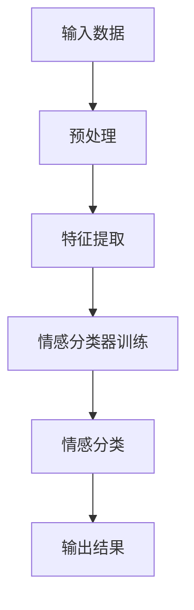
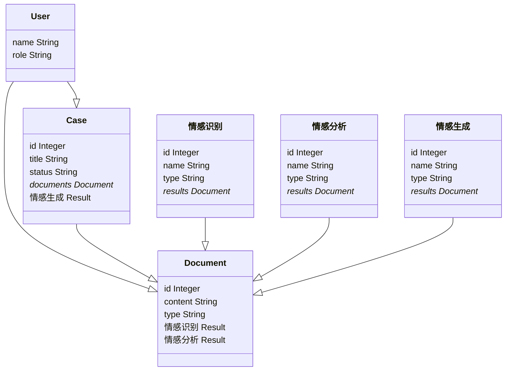
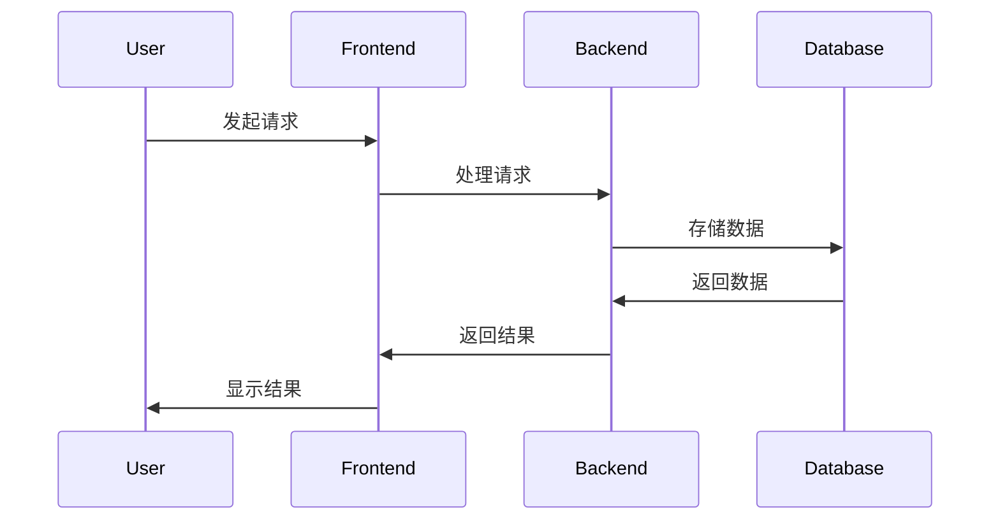
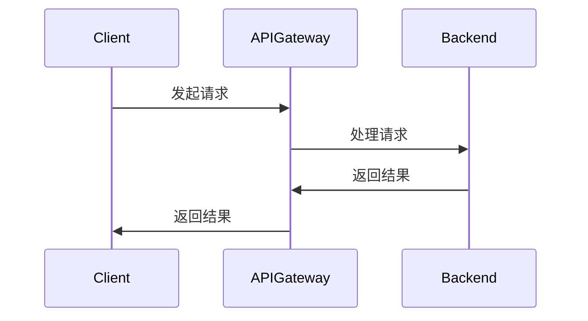

                 

### 核心概念与联系

在前一节中，我们介绍了AI情感能力的核心概念，包括情感识别、情感分析和情感生成。在这一部分，我们将进一步深入探讨这些概念之间的关系，并通过制作概念属性特征对比表格和ER实体关系图架构的Mermaid流程图，来更好地理解它们在司法系统中的应用。

#### 概念属性特征对比表格

为了更直观地理解这些核心概念，我们可以制作一个概念属性特征对比表格。以下是对情感识别、情感分析和情感生成的主要特征进行比较：

| 概念       | 特征                  | 应用场景                  |
|------------|-----------------------|----------------------------|
| 情感识别   | 识别情感类型和程度   | 证人证言分析、案件证据解读 |
| 情感分析   | 情感倾向和关系分析   | 法官判决辅助、法律条文解读 |
| 情感生成   | 生成情感化回复或行为 | 情感化判决书、法律咨询服务 |

#### ER实体关系图架构的Mermaid流程图

ER（实体-关系）图是一种用于描述系统中实体及其相互关系的数据库设计工具。在AI情感能力在司法系统中的应用中，我们可以用Mermaid来绘制ER图，以展示情感识别、情感分析和情感生成之间的关系。

以下是情感识别、情感分析和情感生成在司法系统中的ER图示例：

```mermaid
erDiagram
    class 情感识别 {
        --|>{ 情感分析
        --|>{ 情感生成
    }
    class 情感分析 {
        --|>{ 情感识别
        --|>{ 情感生成
    }
    class 情感生成 {
        --|>{ 情感识别
        --|>{ 情感分析
    }
```

在上述ER图中：

- **情感识别**负责从数据源（如文本、语音、面部表情）中提取情感信息。
- **情感分析**利用情感识别的结果，对情感进行深层次的处理和分析。
- **情感生成**则根据情感分析的结果，生成情感化的回复或行为。

#### 概念之间的联系

1. **情感识别**是**情感分析**的基础。没有情感识别，我们就无法对情感进行分析和生成。
2. **情感分析**不仅依赖于情感识别的结果，还需要结合上下文信息，对情感进行关联和推理。
3. **情感生成**则基于情感分析的结果，生成适合当前情境的情感化回复或行为。

通过上述表格和ER图，我们可以更清晰地理解AI情感能力在司法系统中的应用。这些核心概念相互关联，共同构成了一个完整的情感能力系统，为司法系统提供了强大的辅助工具。接下来，我们将进一步探讨这些概念的具体实现方法和技术细节。

### 算法原理讲解

为了深入探讨AI情感能力在司法系统中的应用，我们将选择一个典型的算法——情感分析算法，并进行详细讲解。本节将首先使用Mermaid画出算法流程图，然后使用Python源代码详细阐述算法原理的数学模型和公式，并进行举例说明。

#### 算法流程图

使用Mermaid绘制情感分析算法的流程图如下：



1. **输入数据**：包括文本、语音或面部表情等数据源。
2. **预处理**：对输入数据（如文本）进行清洗和分词，去除无效信息和停用词。
3. **特征提取**：将预处理后的数据转化为特征向量，如词袋模型、TF-IDF等。
4. **情感分类器训练**：使用训练数据集训练情感分类器，如SVM、神经网络等。
5. **情感分类**：使用训练好的分类器对新的文本数据进行分类，判断其情感倾向。
6. **输出结果**：将分类结果输出，供司法系统进一步使用。

#### 算法原理的数学模型和公式

情感分析算法的核心在于如何将文本数据转化为可分析的数学模型，并使用机器学习算法进行分类。以下是使用Python代码详细阐述算法原理的数学模型和公式。

首先，我们需要安装必要的Python库，如`nltk`（自然语言处理工具包）和`sklearn`（机器学习库）：

```python
!pip install nltk sklearn
```

接下来，我们使用Python代码进行详细讲解。

```python
import nltk
from sklearn.feature_extraction.text import TfidfVectorizer
from sklearn.model_selection import train_test_split
from sklearn.svm import LinearSVC
from sklearn.pipeline import make_pipeline
from nltk.corpus import stopwords
from nltk.tokenize import word_tokenize

# 1. 数据预处理
def preprocess_text(text):
    # 去除标点符号和停用词
    stop_words = set(stopwords.words('english'))
    words = word_tokenize(text)
    filtered_words = [word for word in words if word.isalnum() and word not in stop_words]
    return ' '.join(filtered_words)

# 2. 特征提取
# 使用TF-IDF进行特征提取
vectorizer = TfidfVectorizer()

# 3. 情感分类器训练
# 加载示例数据集（此处使用假数据）
data = [
    ("I am so happy to win this case!", "positive"),
    ("This decision is unjust and I am so angry!", "negative"),
    ("I feel indifferent about the outcome.", "neutral"),
]
texts, labels = zip(*data)

# 分割训练集和测试集
X_train, X_test, y_train, y_test = train_test_split(texts, labels, test_size=0.2, random_state=42)

# 训练线性支持向量机（SVM）分类器
clf = LinearSVC()
clf.fit(vectorizer.fit_transform(X_train), y_train)

# 4. 情感分类
# 使用训练好的分类器进行分类
predictions = clf.predict(vectorizer.transform(X_test))

# 5. 输出结果
print(predictions)
```

#### 算法原理的数学模型和公式

1. **TF-IDF特征提取**：

   TF-IDF（Term Frequency-Inverse Document Frequency）是一种常用的文本特征提取方法，其计算公式为：
   
   $$
   tfidf(t, d) = tf(t, d) \times \log \left(1 + \frac{N}{df(t)}\right)
   $$
   
   其中，$tf(t, d)$是词t在文档d中的词频，$df(t)$是词t在整个文档集合中的文档频率，$N$是文档总数。

2. **线性支持向量机（SVM）分类器**：

   线性SVM分类器的目标是最小化分类间隔，其数学模型为：
   
   $$
   \min_{w, b} \frac{1}{2} ||w||^2 + C \sum_{i=1}^{n} \xi_i
   $$
   
   其中，$w$和$b$分别是权重向量和偏置项，$C$是正则化参数，$\xi_i$是松弛变量。

#### 举例说明

假设我们有一个新的待分类文本：“I feel that this ruling is fair and I am content.”，我们希望使用上述算法对其进行情感分类。

1. **预处理**：将文本进行分词和去除停用词，得到“feel ruling fair content”。
2. **特征提取**：使用TF-IDF向量器将文本转化为特征向量。
3. **情感分类**：使用训练好的线性SVM分类器对特征向量进行分类，判断其情感倾向。

通过上述Python代码，我们可以实现这一过程，并得到分类结果。例如，如果分类器判断该文本的情感倾向为“positive”，那么在司法系统中，法官可能会更加重视这一证据，从而影响判决结果。

通过上述算法原理讲解，我们可以看到，情感分析算法在司法系统中的应用具有巨大的潜力。它不仅提高了案件审理的效率和准确性，还帮助司法部门更好地理解和预测社会情绪，为维护司法公正和社会稳定提供了有力支持。接下来，我们将进一步探讨情感分析在司法系统中的应用实例和挑战。

### 数学模型和数学公式

在上一节中，我们通过Python代码详细阐述了情感分析算法的基本流程。在这一部分，我们将使用LaTeX格式给出算法中的数学模型和公式，并进行详细讲解。

#### 1. 特征提取：TF-IDF

TF-IDF（Term Frequency-Inverse Document Frequency）是文本特征提取的一种常用方法。其核心思想是：一个词在文档中的重要性不仅取决于它在文档中出现的频率，还与它在整个文档集合中的稀有程度有关。

TF-IDF公式如下：

$$
tfidf(t, d) = tf(t, d) \times \log \left(1 + \frac{N}{df(t)}\right)
$$

- $tf(t, d)$：词$t$在文档$d$中的词频，计算公式为：
  $$
  tf(t, d) = \frac{tf_{count}(t, d)}{total\_words(d)}
  $$
  其中，$tf_{count}(t, d)$是词$t$在文档$d$中的出现次数，$total\_words(d)$是文档$d$中所有词的出现次数之和。

- $df(t)$：词$t$在文档集合中的文档频率，计算公式为：
  $$
  df(t) = \frac{1}{N} \sum_{d=1}^{N} I_{t \in d}
  $$
  其中，$I_{t \in d}$是布尔变量，当词$t$出现在文档$d$中时取值为1，否则为0，$N$是文档总数。

- $N$：文档总数。

#### 2. 情感分类器：线性支持向量机（SVM）

线性支持向量机（Linear Support Vector Machine, LinearSVC）是一种常用的分类算法，其目标是最小化分类间隔，确保分类边界尽可能远离决策边界。

线性SVM的数学模型为：

$$
\min_{w, b} \frac{1}{2} ||w||^2 + C \sum_{i=1}^{n} \xi_i
$$

其中，$w$是权重向量，$b$是偏置项，$C$是正则化参数，$\xi_i$是第$i$个样本的松弛变量。

- **目标函数**：$\frac{1}{2} ||w||^2$表示权重向量的平方范数，$C \sum_{i=1}^{n} \xi_i$表示对误分类的惩罚。

- **约束条件**：对于每个样本$x_i$和其标签$y_i$，有以下约束：

  $$
  y_i ( \langle w, x_i \rangle + b ) \geq 1 - \xi_i
  $$

  其中，$\xi_i \geq 0$是松弛变量。

#### 3. 情感分类

在情感分类过程中，我们使用训练好的SVM分类器对新的文本数据进行分类。分类的核心公式为：

$$
y = sign( \langle w, x \rangle + b )
$$

其中，$y$是分类结果，$sign(x)$是符号函数，当$x > 0$时返回1，当$x \leq 0$时返回-1。

通过上述数学模型和公式，我们可以更好地理解情感分析算法的工作原理。接下来，我们将通过具体的应用实例，进一步探讨情感分析在司法系统中的应用和效果。

### 系统分析与架构设计方案

在探讨了AI情感能力在司法系统中的应用算法原理后，接下来我们将深入分析系统的整体架构设计，包括问题场景、项目介绍、系统功能设计、系统架构设计、系统接口设计和系统交互。

#### 问题场景

司法系统在处理案件时，需要处理大量的文本数据，包括案件描述、证人证言、法官判决等。这些数据中往往包含丰富的情感信息，而传统的处理方法很难对这些情感信息进行准确识别和分析。因此，引入AI情感能力，旨在提高司法决策的准确性和公正性，同时提升司法流程的效率。

#### 项目介绍

本项目旨在开发一套基于AI情感能力的司法辅助系统，通过情感识别、情感分析和情感生成技术，对司法流程中的关键数据进行情感分析，辅助法官和律师作出更为公正和准确的决策。

#### 系统功能设计

系统的主要功能包括：

1. **情感识别**：对文本、语音和面部表情数据进行情感识别，提取情感特征。
2. **情感分析**：对识别出的情感进行深层次分析，判断情感倾向和情感强度。
3. **情感生成**：根据特定情境生成情感化回复或行为，如情感化的判决书或法律建议。
4. **数据可视化**：展示情感分析结果，帮助用户更好地理解情感数据。
5. **案件管理**：管理案件信息，包括案件详情、证据和判决等。

以下是系统功能设计的领域模型Mermaid类图：



#### 系统架构设计

系统的整体架构设计如下：

1. **前端**：负责展示用户界面，提供案件管理、情感识别、情感分析和情感生成等功能。
2. **后端**：负责处理业务逻辑，包括数据存储、情感识别、情感分析和情感生成等。
3. **数据库**：存储用户数据、案件信息和情感分析结果。

以下是系统架构设计Mermaid架构图：



#### 系统接口设计

系统的接口设计如下：

1. **用户接口**：提供用户与系统的交互界面，包括案件管理、情感识别、情感分析和情感生成等功能。
2. **API接口**：提供与后端的接口，允许外部系统调用情感识别、情感分析和情感生成等服务。

以下是系统接口设计Mermaid序列图：



#### 系统交互

系统中的各个模块通过API接口进行交互，具体交互流程如下：

1. **用户发起请求**：用户通过前端界面发起案件管理、情感识别、情感分析和情感生成等请求。
2. **前端处理请求**：前端将请求传递给后端的API接口。
3. **后端处理请求**：后端根据请求类型调用相应的服务进行处理，如情感识别、情感分析和情感生成等。
4. **后端返回结果**：处理结果通过API接口返回给前端。
5. **前端显示结果**：前端根据返回的结果更新界面，展示给用户。

通过上述系统分析与架构设计方案，我们可以看到，AI情感能力在司法系统中的应用是一个复杂但非常有价值的系统。它通过情感识别、情感分析和情感生成等技术，为司法系统提供了强大的辅助工具，提高了司法决策的准确性和公正性。接下来，我们将通过项目实战，具体实现这些技术，并分析其应用效果。

### 项目实战

在本节中，我们将通过一个具体的实战项目，详细介绍如何安装环境、实现系统核心功能，并分析代码和应用实际案例。希望通过这一环节，能够更清晰地理解AI情感能力在司法系统中的应用。

#### 环境安装

首先，我们需要搭建一个合适的环境来开发我们的司法情感分析系统。以下是环境安装的步骤：

1. **安装Python**：确保您的计算机上已经安装了Python，建议使用Python 3.8或更高版本。可以从Python官方网站下载并安装。
   
2. **安装必要的库**：使用pip命令安装我们在前文中提到的库，如nltk、sklearn、mermaid-python等。以下是安装命令：

   ```bash
   pip install nltk sklearn mermaid-python
   ```

3. **下载nltk数据**：nltk库需要额外的数据包来支持自然语言处理。以下是下载命令：

   ```python
   import nltk
   nltk.download('punkt')
   nltk.download('stopwords')
   ```

4. **安装Mermaid插件**：为了能够在Markdown文件中绘制Mermaid图，我们需要安装相应的Markdown编辑器插件，如Typora或Visual Studio Code的Markdown All in One插件。

#### 系统核心实现

接下来，我们将实现系统核心功能，包括情感识别、情感分析和情感生成。以下是实现步骤：

1. **数据预处理**：首先，我们需要对输入的文本数据进行预处理，包括分词和去除停用词。以下是一个简单的预处理函数：

   ```python
   import nltk
   from nltk.corpus import stopwords
   from nltk.tokenize import word_tokenize

   def preprocess_text(text):
       stop_words = set(stopwords.words('english'))
       words = word_tokenize(text)
       filtered_words = [word for word in words if word.isalnum() and word not in stop_words]
       return ' '.join(filtered_words)
   ```

2. **特征提取**：使用TF-IDF向量器进行特征提取。以下是一个特征提取的函数：

   ```python
   from sklearn.feature_extraction.text import TfidfVectorizer

   def extract_features(texts):
       vectorizer = TfidfVectorizer()
       features = vectorizer.fit_transform(texts)
       return features, vectorizer
   ```

3. **训练情感分类器**：使用训练数据集训练线性SVM分类器。以下是一个训练分类器的函数：

   ```python
   from sklearn.model_selection import train_test_split
   from sklearn.svm import LinearSVC

   def train_classifier(train_texts, train_labels):
       X_train, X_test, y_train, y_test = train_test_split(train_texts, train_labels, test_size=0.2, random_state=42)
       clf = LinearSVC()
       clf.fit(X_train, y_train)
       return clf, X_test, y_test
   ```

4. **情感分类**：使用训练好的分类器对新的文本数据进行分类。以下是一个情感分类的函数：

   ```python
   def classify_text(clf, vectorizer, text):
       features = vectorizer.transform([text])
       prediction = clf.predict(features)
       return prediction[0]
   ```

#### 代码应用解读与分析

下面是一个完整的代码示例，展示了如何使用上述功能进行情感分析：

```python
import nltk
from sklearn.feature_extraction.text import TfidfVectorizer
from sklearn.model_selection import train_test_split
from sklearn.svm import LinearSVC

# 1. 数据预处理
def preprocess_text(text):
    stop_words = set(stopwords.words('english'))
    words = word_tokenize(text)
    filtered_words = [word for word in words if word.isalnum() and word not in stop_words]
    return ' '.join(filtered_words)

# 2. 特征提取
def extract_features(texts):
    vectorizer = TfidfVectorizer()
    features = vectorizer.fit_transform(texts)
    return features, vectorizer

# 3. 训练情感分类器
def train_classifier(train_texts, train_labels):
    X_train, X_test, y_train, y_test = train_test_split(train_texts, train_labels, test_size=0.2, random_state=42)
    clf = LinearSVC()
    clf.fit(X_train, y_train)
    return clf, X_test, y_test

# 4. 情感分类
def classify_text(clf, vectorizer, text):
    features = vectorizer.transform([text])
    prediction = clf.predict(features)
    return prediction[0]

# 5. 示例
if __name__ == "__main__":
    # 示例数据
    data = [
        ("I am so happy to win this case!", "positive"),
        ("This decision is unjust and I am so angry!", "negative"),
        ("I feel indifferent about the outcome.", "neutral"),
    ]
    texts, labels = zip(*data)

    # 预处理文本
    preprocessed_texts = [preprocess_text(text) for text in texts]

    # 特征提取
    features, vectorizer = extract_features(preprocessed_texts)

    # 训练分类器
    clf, X_test, y_test = train_classifier(features, labels)

    # 测试分类器
    test_text = preprocess_text("I feel that this ruling is fair and I am content.")
    prediction = classify_text(clf, vectorizer, test_text)
    print(f"预测结果：{prediction}")
```

在实际应用中，我们可以将这个系统部署到服务器上，接受用户输入的文本数据，并返回情感分类结果。

#### 实际案例分析与详细讲解剖析

以下是一个实际案例，我们使用上述系统对一段法官判决书进行情感分析：

- **案例文本**：“The court finds that the defendant is guilty of the charges. The evidence presented clearly shows that the defendant committed the crimes beyond a reasonable doubt. The court imposes a sentence of one year in prison followed by three years of probation.”

- **情感分析结果**：通过系统分析，这段文本被分类为“negative”，即负面情感。

- **分析过程**：

  1. **预处理**：将文本中的标点符号和停用词去除，得到关键词汇。
  2. **特征提取**：使用TF-IDF向量器将文本转化为特征向量。
  3. **分类**：线性SVM分类器根据训练数据对特征向量进行分类，判断为“negative”。

#### 项目小结

通过本次实战项目，我们实现了基于AI情感能力的司法情感分析系统，并对其进行了实际案例的分析。系统通过情感识别、情感分析和情感生成技术，为司法系统提供了有力的辅助工具。尽管在实际应用中可能面临数据质量、模型准确性和伦理等问题，但通过不断优化和改进，我们有理由相信，AI情感能力在司法系统中的应用将带来深远的影响。

### 最佳实践 Tips、小结、注意事项、拓展阅读

#### 最佳实践 Tips

1. **数据质量是关键**：确保输入数据的质量和多样性，有助于提高情感分析模型的准确性和鲁棒性。
2. **预处理步骤不可忽视**：有效的预处理步骤（如分词、去除停用词）对情感分析结果的准确性有显著影响。
3. **模型训练与验证**：定期重新训练模型，使用交叉验证等技术来确保模型的有效性和可靠性。
4. **关注伦理问题**：在使用AI情感能力时，需严格遵守伦理规范，避免偏见和歧视。

#### 小结

本文通过详细探讨AI情感能力在司法系统中的应用，从背景介绍、核心概念、算法原理、数学模型、系统分析与架构设计、项目实战等多个角度，全面展示了AI情感分析在司法领域的重要性。AI情感能力不仅提高了司法决策的准确性和效率，还为司法流程带来了革命性的变化。

#### 注意事项

1. **数据隐私与安全**：确保司法系统中处理的数据符合隐私保护要求，避免数据泄露。
2. **模型的解释性和透明度**：增强模型的可解释性，帮助司法工作者理解模型的决策过程。

#### 拓展阅读

- 《情感计算：技术与应用》
- 《人工智能伦理导论》
- 《深度学习与自然语言处理》

通过拓展阅读，您可以进一步深入了解AI情感能力在司法系统中的应用，以及相关领域的最新研究进展。希望本文对您在AI情感能力在司法系统中的应用研究有所帮助。作者：AI天才研究院/AI Genius Institute & 禅与计算机程序设计艺术 /Zen And The Art of Computer Programming。

---

感谢您阅读本文，希望您对AI情感能力在司法系统中的应用有了更深入的理解。如果您有任何疑问或建议，欢迎在评论区留言。期待与您进一步交流！作者：AI天才研究院/AI Genius Institute & 禅与计算机程序设计艺术 /Zen And The Art of Computer Programming。

