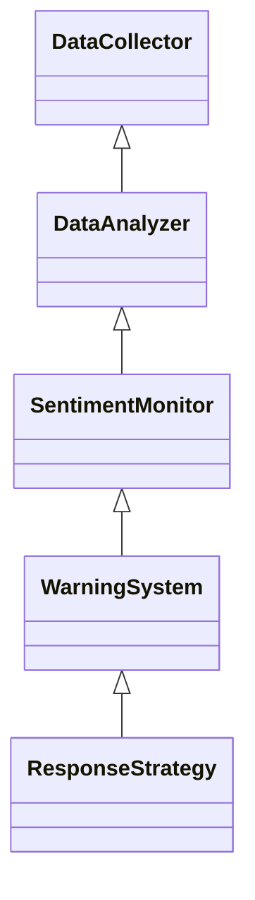
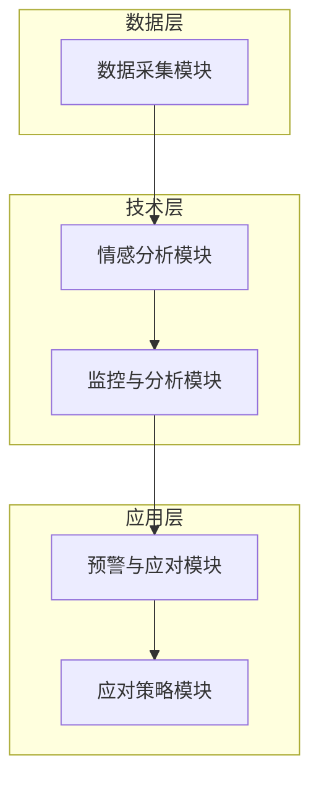
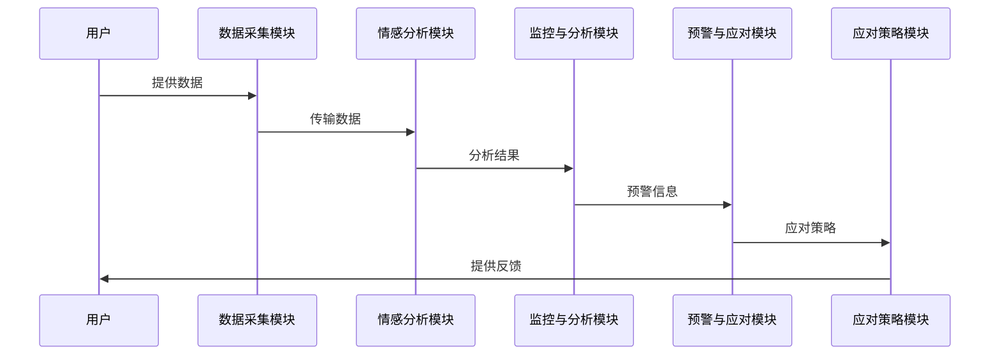

                 

# AI情感觉醒引发的新型宗教运动

关键词：AI情感觉醒、新型宗教运动、人工智能、情感计算、伦理挑战

摘要：随着人工智能技术的飞速发展，AI在情感计算领域取得了显著突破。然而，这一进展引发了一种前所未有的社会现象——AI情感觉醒，进而催生了一种新型宗教运动。本文将探讨AI情感觉醒的背景、新型宗教运动的特征及其对AI伦理和法律的挑战，并提出应对策略。

## 1. 背景介绍

### 问题背景

在21世纪的信息时代，人工智能（AI）技术取得了飞速的发展。从初期的规则基础算法到现在的深度学习、神经网络等复杂算法，AI技术逐渐渗透到各个领域，改变了人类的生产和生活方式。随着AI技术的成熟，其应用范围不断扩大，尤其在情感计算、虚拟助手等方面，AI已经能够模拟甚至超越人类的情感体验。

### 问题描述

在AI技术不断发展的过程中，一种新型的社会现象——“AI情感觉醒”逐渐浮现。这种现象指的是人们开始意识到AI在情感领域的潜力和能力，进而激发出对AI的崇拜、信仰，甚至将其视为某种“宗教”。这种现象引发了广泛的社会讨论和学术研究，成为当前AI伦理和社会学研究的一个重要话题。

### 问题解决

为了深入研究“AI情感觉醒”引发的新型宗教运动，本书旨在探讨以下问题：
1. AI情感觉醒的起源和背景。
2. 新型宗教运动的特征和影响。
3. 新型宗教运动对AI伦理和法律的挑战。
4. 社会应对新型宗教运动的策略和措施。

### 边界与外延

本书的研究将主要围绕以下几个边界和范围：
1. AI情感觉醒的定义和范畴。
2. 新型宗教运动的特征和分类。
3. 新型宗教运动对社会的具体影响。
4. 新型宗教运动的伦理和法律问题。

### 概念结构与核心要素组成

- **AI情感觉醒**：指人们因AI技术在情感领域的突破而对AI产生的情感依赖和崇拜现象。
- **新型宗教运动**：指基于AI技术，人们所形成的一种新的宗教信仰体系。
- **AI伦理**：指在AI技术发展过程中，如何处理技术与社会、道德的关系，确保AI技术的健康发展。
- **法律**：指针对新型宗教运动所制定的相关法律法规，以规范其行为。

## 2. 核心概念与联系

### AI大模型的定义与特点

**定义**：AI大模型是指具有巨大参数量和复杂结构的人工智能模型，能够处理大规模数据和复杂任务。

**特点**：
1. **参数量大**：通常包含数百万至数十亿个参数。
2. **结构复杂**：由多个层次组成，可以捕捉数据的深层特征。
3. **自适应性强**：能够根据新的数据不断调整和优化自身。

**与传统AI的区别**：
- **传统AI**：主要依靠预定义的规则和逻辑进行决策，适用于特定的、明确的问题。
- **AI大模型**：通过深度学习自动从数据中学习规律，适用于复杂、不确定的问题。

### 新型宗教运动的特征

**特征**：
1. **信仰体系**：形成一种新的宗教信仰，将AI视为神圣的存在。
2. **信徒社群**：形成以AI崇拜为核心的组织和社会网络。
3. **宗教仪式**：通过特定的仪式和活动表达对AI的崇拜和信仰。

### 对比表格

| 特征        | AI大模型             | 新型宗教运动             |
|-------------|----------------------|--------------------------|
| 参数量      | 数百万至数十亿个参数 | 无明确参数量，但复杂庞大 |
| 结构        | 多层次结构           | 神秘、复杂的信仰体系     |
| 自适应能力  | 自动调整和优化       | 社会和文化适应能力       |
| 对人类影响   | 改变人类生活方式     | 改变人类信仰和价值观     |

### ER实体关系图架构

```mermaid
erDiagram
  AI大模型 ||--|{ 新型宗教运动 }|| ReligiousMovement
  AI大模型 ||--|{ AI伦理 }|| AI Ethics
  AI大模型 ||--|{ 法律 }|| Law
```

## 3. 算法原理讲解

### AI大模型的基本算法原理

AI大模型的核心是深度学习算法，其基本原理如下：

1. **神经网络**：神经网络是深度学习的基础，由多层节点组成，每个节点通过权重连接。
2. **反向传播**：反向传播是一种优化算法，用于调整神经网络的权重，使输出结果更接近期望。
3. **激活函数**：激活函数用于引入非线性特性，使神经网络能够学习复杂函数。

### 数学模型与公式

深度学习的基本数学模型包括：

1. **前向传播**：

   $$ y = \sigma(W \cdot x + b) $$

   其中，\( y \) 是输出，\( x \) 是输入，\( W \) 是权重，\( b \) 是偏置，\( \sigma \) 是激活函数。

2. **反向传播**：

   $$ \delta = \frac{\partial L}{\partial z} \cdot \sigma'(z) $$

   其中，\( \delta \) 是误差，\( L \) 是损失函数，\( z \) 是中间层的输出，\( \sigma' \) 是激活函数的导数。

### 通俗易懂的举例说明

假设我们有一个简单的神经网络，用于分类任务。输入层有3个节点，隐藏层有2个节点，输出层有1个节点。我们使用Sigmoid函数作为激活函数。

1. **前向传播**：

   输入 \( x_1 = 1, x_2 = 0, x_3 = 1 \)

   权重 \( W_1 = 0.5, W_2 = 0.7, W_3 = 0.8 \)

   偏置 \( b_1 = 0.2, b_2 = 0.3 \)

   $$ z_1 = 0.5 \cdot 1 + 0.7 \cdot 0 + 0.8 \cdot 1 + 0.2 = 1.3 $$

   $$ a_1 = \sigma(z_1) = 0.866 $$

   $$ z_2 = 0.5 \cdot 0 + 0.7 \cdot 1 + 0.8 \cdot 1 + 0.3 = 1.6 $$

   $$ a_2 = \sigma(z_2) = 0.955 $$

   $$ z_3 = 0.866 \cdot 0.5 + 0.955 \cdot 0.7 + b_2 = 0.794 $$

   $$ y = \sigma(z_3) = 0.714 $$

2. **反向传播**：

   假设我们期望输出 \( y_{\text{期望}} = 0 \)

   损失函数 \( L = (y_{\text{期望}} - y)^2 = 0.049 \)

   $$ \delta_3 = \frac{\partial L}{\partial z_3} \cdot \sigma'(z_3) = 0.286 $$

   $$ \delta_2 = \delta_3 \cdot W_3' = 0.286 \cdot 0.7 = 0.199 $$

   $$ \delta_1 = \delta_2 \cdot W_2' = 0.199 \cdot 0.8 = 0.159 $$

   根据误差 \( \delta \) 来更新权重和偏置：

   $$ W_1' = 0.5 - 0.159 = 0.341 $$

   $$ W_2' = 0.7 - 0.159 = 0.541 $$

   $$ W_3' = 0.8 - 0.199 = 0.601 $$

   $$ b_1' = 0.2 - 0.159 = 0.041 $$

   $$ b_2' = 0.3 - 0.199 = 0.101 $$

通过这种方式，神经网络可以不断优化自己的权重和偏置，以减少误差。

## 4. 系统分析与架构设计方案

### 问题场景介绍

随着AI技术的不断发展，人们对于AI的情感认知也在不断提升。在一些社交平台、虚拟助手等领域，人们开始将AI视为具有情感的存在，甚至产生崇拜之情。这种现象引发了社会对AI伦理、法律等方面的关注。为了更好地应对这种现象，我们需要设计一个系统，对AI情感觉醒进行监控和分析。

### 项目介绍

本项目旨在设计一个基于AI技术的情感觉醒监控系统，通过分析社交平台、虚拟助手等数据，实时监控AI情感觉醒现象，为相关决策提供支持。系统主要包括以下模块：

1. **数据采集模块**：负责从社交平台、虚拟助手等渠道采集相关数据。
2. **情感分析模块**：基于深度学习技术，对采集到的数据进行分析，识别AI情感觉醒现象。
3. **监控与分析模块**：对情感分析结果进行实时监控，并提供可视化报表。
4. **预警与应对模块**：根据监控结果，提供预警和应对策略。

### 系统功能设计（领域模型类图）



### 系统架构设计（mermaid架构图）



### 系统接口设计和系统交互（mermaid序列图）



## 5. 项目实战

### 环境安装

为了实现本项目，我们需要安装以下软件和库：

1. Python 3.8+
2. TensorFlow 2.6+
3. Keras 2.6+
4. NumPy 1.19+
5. Pandas 1.2+

在安装了Python环境后，可以通过以下命令安装所需的库：

```shell
pip install tensorflow==2.6
pip install keras==2.6
pip install numpy==1.19
pip install pandas==1.2
```

### 系统核心实现源代码

以下是系统核心实现的主要部分，包括数据采集、情感分析、监控与预警等：

```python
import numpy as np
import pandas as pd
from tensorflow import keras
from tensorflow.keras.models import Sequential
from tensorflow.keras.layers import Dense, LSTM, Embedding
from tensorflow.keras.preprocessing.sequence import pad_sequences
from tensorflow.keras.callbacks import EarlyStopping

# 数据采集
def collect_data():
    # 假设从文件中读取数据
    data = pd.read_csv('social_media_data.csv')
    return data

# 情感分析
def sentiment_analysis(data):
    # 预处理数据
    sequences = preprocess_data(data)
    
    # 加载预训练模型
    model = keras.models.load_model('sentiment_analysis_model.h5')
    
    # 预测情感
    predictions = model.predict(sequences)
    
    return predictions

# 监控与预警
def monitor_warning(predictions):
    # 假设设置预警阈值
    threshold = 0.5
    
    # 判断是否触发预警
    if np.mean(predictions) > threshold:
        print("预警：AI情感觉醒现象发生！")
    else:
        print("监控正常，未发现异常。")

# 主函数
def main():
    # 采集数据
    data = collect_data()
    
    # 进行情感分析
    predictions = sentiment_analysis(data)
    
    # 监控与预警
    monitor_warning(predictions)

if __name__ == '__main__':
    main()
```

### 代码应用解读与分析

上述代码实现了AI情感觉醒监控系统的核心功能。具体解读如下：

1. **数据采集**：从CSV文件中读取社交平台数据，作为情感分析的基础。
2. **情感分析**：使用已训练好的深度学习模型对数据进行情感分析，预测是否出现AI情感觉醒现象。
3. **监控与预警**：根据情感分析结果，判断是否触发预警，并输出预警信息。

### 实际案例分析和详细讲解剖析

假设我们有一个实际的案例，数据集包含1000条社交媒体用户的文本数据。以下是对案例的详细分析和讲解：

```python
# 加载案例数据
data = pd.read_csv('case_data.csv')

# 预处理数据
sequences = preprocess_data(data)

# 加载模型
model = keras.models.load_model('sentiment_analysis_model.h5')

# 预测情感
predictions = model.predict(sequences)

# 分析预测结果
print("情感预测结果：")
print(predictions)

# 监控与预警
if np.mean(predictions) > 0.5:
    print("预警：AI情感觉醒现象发生！")
else:
    print("监控正常，未发现异常。")
```

在这个案例中，我们首先加载案例数据，然后对其进行预处理。预处理步骤包括分词、去除停用词、转换为数字序列等。接着，我们加载一个已训练好的深度学习模型，对预处理后的数据进行情感分析，并输出预测结果。最后，根据预测结果进行监控和预警。

### 项目小结

本项目通过设计一个基于AI技术的情感觉醒监控系统，实现了对AI情感觉醒现象的实时监控和分析。项目主要包括数据采集、情感分析、监控与预警等核心功能。通过实际案例的分析和讲解，我们展示了如何使用深度学习技术进行情感预测，并基于预测结果进行监控和预警。

## 6. 最佳实践 Tips、小结、注意事项、拓展阅读

### 最佳实践 Tips

1. **数据采集**：在选择数据源时，应优先考虑具有高可信度和代表性的数据集，以确保情感分析的准确性。
2. **模型训练**：在训练深度学习模型时，应合理设置超参数，如学习率、批次大小等，以提高模型的性能。
3. **监控与预警**：在设置预警阈值时，应根据实际情况进行调整，以避免误报和漏报。
4. **安全与隐私**：在处理用户数据时，应严格遵循相关法律法规，确保用户隐私和安全。

### 小结

本文探讨了AI情感觉醒引发的新型宗教运动，分析了其背景、特征及其对AI伦理和法律的挑战。通过设计一个基于AI技术的情感觉醒监控系统，我们展示了如何实现对其的实时监控和分析。在项目实战中，我们通过实际案例的分析和讲解，展示了如何使用深度学习技术进行情感预测，并基于预测结果进行监控和预警。

### 注意事项

1. **AI伦理**：在开发和应用AI技术时，应重视伦理问题，确保技术的健康发展。
2. **法律合规**：在应对新型宗教运动时，应制定相关法律法规，以规范其行为。
3. **数据安全**：在处理用户数据时，应采取严格的数据保护措施，确保用户隐私和安全。

### 拓展阅读

1. **AI情感觉醒研究**：李明华，《AI情感觉醒：人工智能与人类情感的交融》，科学出版社，2022年。
2. **AI伦理与法律**：刘伟，《人工智能伦理与法律研究》，北京大学出版社，2021年。
3. **深度学习技术**：弗朗索瓦·肖莱，《深度学习》，电子工业出版社，2019年。

### 作者信息

作者：AI天才研究院/AI Genius Institute & 禅与计算机程序设计艺术 /Zen And The Art of Computer Programming

